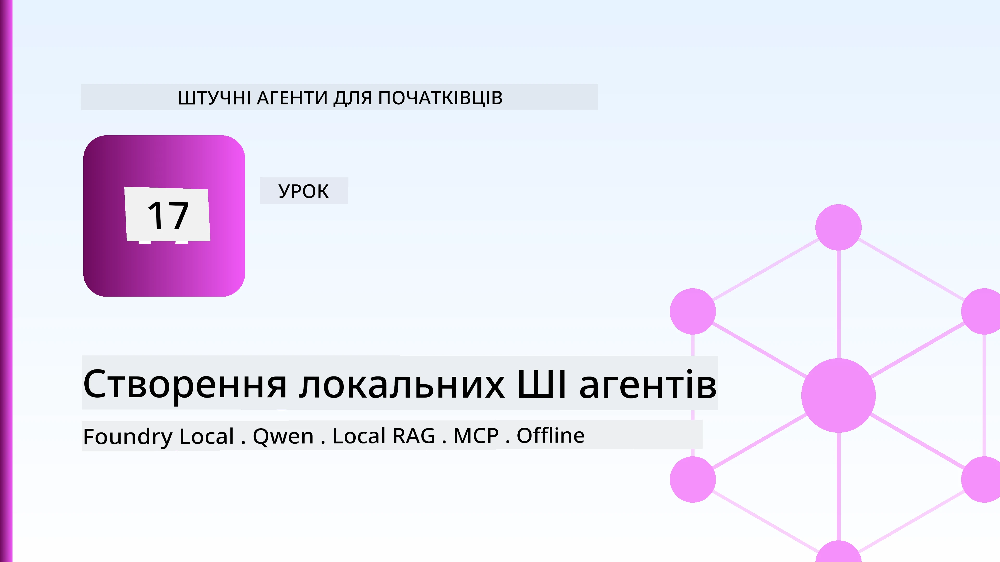
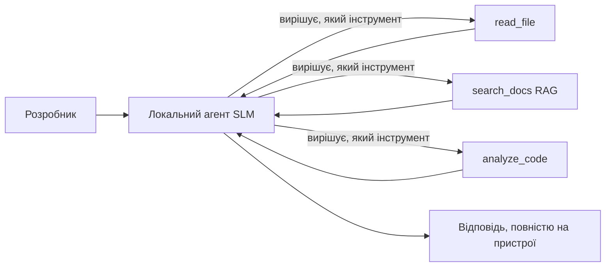
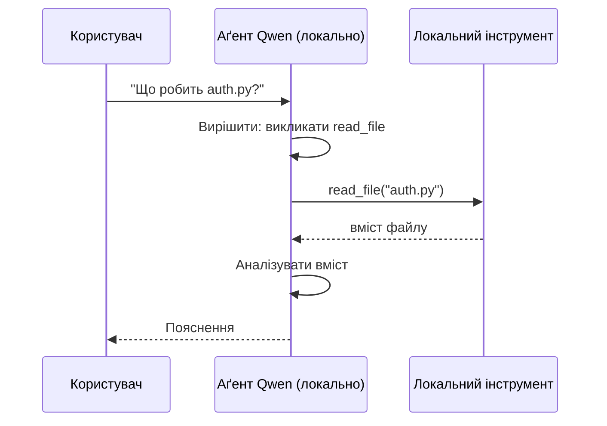
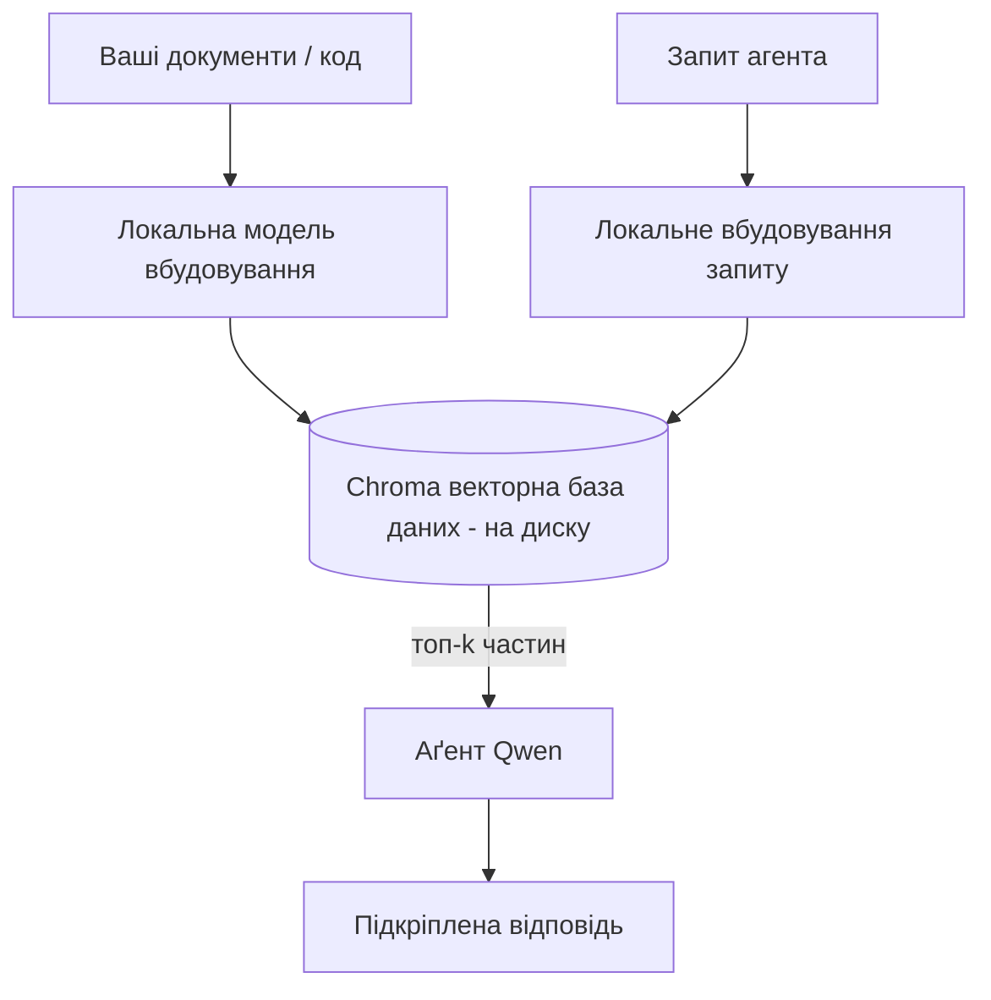
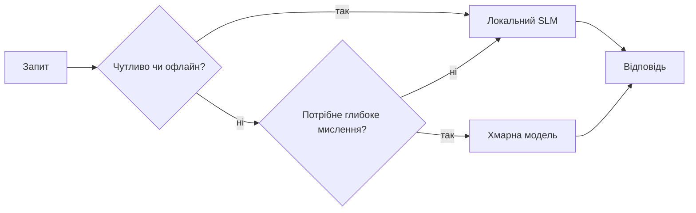

# Створення локальних AI агентів за допомогою Microsoft Foundry Local і Qwen



У попередньому уроці агенти масштабувалися в хмару. Цей урок переносить їх на одну машину. Наприкінці ви матимете працюючого інженерного помічника, який міркує, викликає інструменти, читає ваші файли та шукає у вашій документації — **без жодного виклику хмарного inferential сервісу.**

Чому б вам це могло бути потрібно? Три причини, які регулярно зустрічаються у реальній інженерній роботі:

- **Приватність.** Код і документи ніколи не залишають машину. Жоден підказка, фрагмент або дані клієнта не перетинають межу мережі.
- **Вартість.** Локальний inference не має плати за токен. Ви можете ітерувати весь день за вартість електроенергії.
- **Офлайн.** У літаку, у захищеному приміщенні або під час відключення зв’язку агент все одно працює.

Суть у тому, що ви міняєте передову хмарну модель на **Small Language Model (SLM)**, що працює на вашому CPU, GPU або NPU. Цей урок про створення агентів, які *добре* працюють в рамках цього обмеження, а не про те, щоб ігнорувати це обмеження.

## Вступ

У цьому уроці розглянемо:

- **Small Language Models (SLM)** — що це, де вони хороші, а де ні.
- **Microsoft Foundry Local** — runtime, який завантажує та обслуговує моделі локально через **OpenAI-сумісний API**.
- **Qwen моделі з викликом функцій** — SLM, які надійно створюють виклики інструментів, що робить можливим локальних *агентів* (а не лише локальний чат).
- **Локальні інструменти, локальний RAG і локальний MCP** — надають агенту можливості без хмари.
- **Гібридні паттерни** — коли тримати все локально, а коли звертатися до хмари.

## Цілі навчання

Після закінчення цього уроку ви знатимете, як:

- Пояснювати компроміси SLM і обирати відповідні сценарії для локальних агентів.
- Запустити модель Qwen локально через Foundry Local і підключитися до неї через OpenAI-сумісний endpoint.
- Побудувати агента з викликом інструментів, який працюватиме повністю на вашій робочій станції.
- Додати локальний RAG поверх ваших власних документів, використовуючи локальну векторну базу даних (Chroma).
- Під’єднати агента до локального MCP сервера та аналізувати гібридні локальні/хмарні архітектури.

## Вимоги до початкового рівня

Для цього уроку припускається, що ви пройшли попередні уроки і впевнені в:

- [Використанні інструментів](../04-tool-use/README.md) (Урок 4) та [Агентському RAG](../05-agentic-rag/README.md) (Урок 5).
- [Агентські протоколи / MCP](../11-agentic-protocols/README.md) (Урок 11).
- [Microsoft Agent Framework](../14-microsoft-agent-framework/README.md) (Урок 14).

Вам також знадобиться:

- Робоча станція розробника. **8 ГБ ОЗП — мінімум, 16 ГБ і більше — комфортно.** GPU або NPU допомагають, але не обов’язкові.
- Встановлений **Microsoft Foundry Local** (див. розділ налаштування нижче).
- Python 3.12+ та пакети з репозиторію [`requirements.txt`](../../../requirements.txt), а також `foundry-local-sdk`, `openai` та `chromadb` для цього уроку.

## Small Language Models: правильний інструмент для локальної роботи

Хмарна передова модель має сотні мільярдів параметрів і розміщена в дата-центрі. SLM має кілька мільярдів параметрів і має поміститися у ОЗП вашого ноутбука. Ця різниця задає ясні очікування.

**SLM добре справляються з:**

- Структурованими, обмеженими завданнями — класифікація, вилучення, стислий виклад відомого документа.
- **Викликом інструментів** — вибором, яку функцію викликати і з якими аргументами.
- Швидкою, дешевою, приватною ітерацією над вашими даними.

**SLM слабші в:**

- Відкритому розгорнутому багатокроковому міркуванні на великому контексті.
- Широкій світовій обізнаності (вони бачили менше і більше забувають).

Отже, виграшна стратегія для локальних агентів: **дати SLM координувати, а важку роботу — інструментам.** Модель не повинна *знати* ваш код — вона має знати, коли викликати `read_file` і `search_docs`. Це саме те, де SLM найсильніші.



## Microsoft Foundry Local

**Microsoft Foundry Local** — це легкий runtime, який завантажує, керує та обслуговує моделі повністю на вашій машині. Найважливіша для нас особливість — це те, що він надає **OpenAI-сумісний HTTP endpoint** — отже, OpenAI SDK і клієнт Microsoft Agent Framework OpenAI працюють з ним лише зміною `base_url`. Все, що ви дізнались про створення агентів, переноситься напряму; змінюється лише endpoint: з хмари на `localhost`.

Foundry Local також автоматично підбирає найкращу збірку моделі для вашого апаратного забезпечення — збірку для CPU, CUDA/GPU або NPU — так що вам не потрібно оптимізувати вручну під кожну машину.

### Налаштування

Встановіть Foundry Local (див. [документацію](https://learn.microsoft.com/azure/ai-foundry/foundry-local/) для вашої ОС), потім перевірте його роботу:

```bash
# Встановити (приклад; дотримуйтесь документації для вашої платформи)
winget install Microsoft.FoundryLocal      # Windows
# brew install microsoft/foundrylocal/foundrylocal   # macOS

# Завантажте і запустіть модель Qwen, а потім запустіть локальний сервіс
foundry model run qwen2.5-7b-instruct
foundry service status
```

Після запуску сервісу у вас є локальний OpenAI-сумісний endpoint (зазвичай `http://localhost:PORT/v1`). Блокнот використовує `foundry-local-sdk`, щоб автоматично знаходити endpoint, тому вам не потрібно жорстко задавати порт.

## Qwen Function Calling: чому це важливо

Агент — це агент, лише якщо він може викликати інструменти. Багато SLM можуть чатитися, але створюють ненадійні, некоректні виклики інструментів. **Qwen** моделі навчені на виклик функцій і послідовно генерують коректну структуру викликів — саме це перетворює локальну чат-модель у локального *агента*.

Потік — стандартний цикл виклику інструментів, який ви вже знаєте, лише виконується локально:



## Локальний RAG

Пошук у документації — це саме те, що робить локальних агентів корисними. Замість того, щоб сподіватися, що SLM запам’ятав вашу документацію, ви вбудовуєте ці документи у **локальну векторну базу даних** і даєте агенту змогу отримувати потрібні фрагменти за запитом.

Ми використовуємо **Chroma** — вбудоване сховище векторів, яке працює в процесі і не потребує окремого сервера для керування. Пайплайн повністю локальний: локальна модель для вбудовування → локальні вектори → локальний пошук → локальний SLM.



Це той самий паттерн Agentic RAG з уроку 5 — єдина зміна в тому, що кожен компонент працює у вас на машині.

## Локальні MCP сервери

[MCP](../11-agentic-protocols/README.md) — це транспорт, а не хмарний сервіс. MCP сервер може запускатися як локальний процес на `stdio`, надаючи інструменти агенту через стандартний протокол. Це дає змогу повторно використовувати зростаючу екосистему MCP серверів — доступ до файлової системи, операції git, запити до баз даних — повністю офлайн.

Система безпеки відрізняється від хмари, але не відсутня: локальний MCP сервер все одно працює з правами вашого користувача, тому обмежуйте його дії — наприклад, директорією проекту, а не всіма домашніми файлами — і розглядайте його вихідні дані як вхідні для валідації.

## Гібридні хмарно-локальні паттерни

Локально-перший не означає лише локально. Дорослі системи маршрутизують за степенем чутливості та складності:

| Ситуація | Де виконується |
| --- | --- |
| Чутливий код / дані, або офлайн | **Локальний SLM** |
| Проста, обмежена задача | **Локальний SLM** (дешево, швидко) |
| Складне багатокрокове міркування над нечутливими даними | **Хмарна модель** |
| Всі запити під час відключення зв’язку | **Локальний SLM** (плавне погіршення) |

Це віддзеркалює ідею **маршрутизації моделей** з уроку 16 — окрім того, що один із «моделей» тепер ваша власна машина. Надійний дизайн переключається на локальне, коли хмара недоступна, тому агент працює з меншим рівнем якості, а не зовсім виходить з ладу.



## Практична лабораторна: локальний інженерний помічник

Відкрийте [`code_samples/17-local-agent-foundry-local.ipynb`](./code_samples/17-local-agent-foundry-local.ipynb) і пройдіть його. Ви створите **локального інженерного помічника**, який працюватиме повністю на вашій робочій станції і здатен:

1. **Викликати інструменти** — через Qwen function calling з Foundry Local.
2. **Виконувати локальні операції з файлами** — перераховувати та читати файли у директорії проекту.
3. **Аналізувати код** — звітувати базові метрики по файлу з вихідним кодом.
4. **Шукати у документації** — локальний RAG по папці з документацією з Chroma.
5. **Використовувати MCP** — підключатися до локального MCP сервера (плавно пропускаючи крок, якщо сервер не сконфігурований).

Жодного хмарного інференсу не використовується на жодному кроці.

### Покрокове пояснення

Асистент підключається через OpenAI-сумісний endpoint Foundry Local, тож код агента виглядає майже ідентично хмарним урокам — змінюється лише клієнт:

```python
from foundry_local import FoundryLocalManager
from openai import OpenAI

# Foundry Local знаходить/завантажує модель і надає нам локальну кінцеву точку.
manager = FoundryLocalManager(\"qwen2.5-7b-instruct\")
client = OpenAI(base_url=manager.endpoint, api_key=manager.api_key)  # api_key є локальним заповнювачем
```

Інструменти — це звичайні функції Python, обмежені директорією проекту:

```python
def read_file(path: str) -> str:
    \"\"\"Read a file, but only inside the sandboxed project directory.\"\"\"
    full = (PROJECT_ROOT / path).resolve()
    if PROJECT_ROOT not in full.parents and full != PROJECT_ROOT:
        return \"Access denied: path is outside the project directory.\"
    return full.read_text(encoding=\"utf-8\")
```

Зверніть увагу на перевірку sandbox — навіть локально інструмент, який читає довільні шляхи, є небезпечним. Блокнот обмежує кожен інструмент кореневою директорією проекту.

## Перевірка знань

Перевірте свої знання перед переходом до завдання.

**1. Наведіть дві конкретні причини запускати агента локально, а не в хмарі.**

<details>
<summary>Відповідь</summary>

Будь-які дві з: **приватність** (код та дані не залишають машину), **вартість** (немає плати за токен inference), та **офлайн-можливість** (працює без мережі — у літаку, в безпечних приміщеннях або під час відключення). Регуляторні/комплаєнс обмеження, які забороняють відсилати дані з пристрою, часто є драйвером для приватності.
</details>

**2. Який рекомендований розподіл праці між SLM і його інструментами в локальному агенті і чому?**

<details>
<summary>Відповідь</summary>

Нехай SLM **координує** (вирішує, який інструмент викликати і з якими аргументами), а **важку роботу виконує інструменти** (читання файлів, пошук документації, обчислення результатів). SLM сильні у обмежених рішеннях, наприклад виборі інструменту, але слабкі в широких знаннях і довгому багатокроковому міркуванні, тому покладатися на інструменти — це їхня сильна сторона.
</details>

**3. Що робить можливим повторне використання хмарного коду агента з Foundry Local?**

<details>
<summary>Відповідь</summary>

Foundry Local надає **OpenAI-сумісний HTTP endpoint**. OpenAI SDK і клієнт Agent Framework OpenAI працюють з ним лише змінивши `base_url` (та використовуючи локальний API ключ-заповнювач). Все інше у коді агента залишається без змін.
</details>

**4. Чому саме використовується модель з викликом функцій Qwen, а не будь-яка SLM?**

<details>
<summary>Відповідь</summary>

Тому що агент повинен створювати надійні, коректні **виклики інструментів**. Багато SLM можуть спілкуватися, але створюють некоректні або непослідовні структури викликів. Qwen моделі навчені для виклику функцій і виробляють послідовні виклики, що й перетворює локальну чат-модель у працездатного локального агента.
</details>

**5. У локальному RAG пайплайні які компоненти працюють на машині?**

<details>
<summary>Відповідь</summary>

Всі: модель вбудовування, векторна база даних (Chroma, на диску), крок пошуку і SLM. Документи вбудовуються локально, зберігаються локально, отримуються локально і над ними міркує локальна модель — жоден компонент не звертається до хмари.
</details>

**6. Локальний MCP сервер працює на вашій машині. Чи означає це, що він автоматично безпечний? Які заходи безпеки слід все ще вживати?**

<details>
<summary>Відповідь</summary>

Ні. Локальний MCP сервер працює з правами вашого користувача, отже він може торкатися всього, до чого маєте доступ ви. Обмежте його завдання (наприклад, лише директорією проекту, а не всією домашньою папкою) і розглядайте його вихідні дані як вхідні для валідації перед виконанням.
</details>

**7. Опишіть розумне гібридне правило маршрутизації, яке включає локальну модель.**

<details>
<summary>Відповідь</summary>

Маршрутизуйте чутливі або офлайн-запити на локальний SLM; прості обмежені задачі — на локальний SLM для швидкості і економії; складне багатокрокове міркування на нечутливих даних — на хмарну модель; а у випадку недоступності хмари повертайтесь до локального SLM, щоб агент плавно знижував якість, а не зупинявся зовсім. Це і є модельна маршрутизація (Урок 16) з локальною машиною в ролі однієї з моделей.
</details>

**8. Яка реалістична мінімальна кількість оперативної пам’яті для запуску локального агента у цьому уроці і що дає більше пам’яті?**

<details>
<summary>Відповідь</summary>

Приблизно **8 ГБ** — це мінімум; 16 ГБ і більше — комфортно. Більше пам’яті дозволяє запускати більші, потужніші моделі і зберігати більше контексту в пам’яті. GPU або NPU прискорюють інференс, але не є обов’язковими — Foundry Local вибирає збірку для CPU, якщо акселератор недоступний.
</details>

## Завдання

Розширте локального інженерного помічника до **локального рецензента документації** для обраного вами невеликого проєкту (можна скористатись одним з уроків цього репозиторію).

Ваше завдання має:

1. **Індексувати реальну папку з документацією/кодом** у Chroma (мінімум п’ять файлів).
2. **Додати інструмент `find_todos`**, який сканує проект на наявність коментарів `TODO`/`FIXME` і повертає їх із вказанням файлу та рядка — з тією ж перевіркою sandbox, що і `read_file`.

3. **Задайте агенту три питання**, які змушують його поєднувати інструменти: одне суто RAG-питання, одне, що вимагає прочитання конкретного файлу, і одне, що вимагає пошуку TODO.
4. **Виміряйте час**: заміряйте час кожної з трьох відповідей і зафіксуйте їх у markdown-комірці. Прокоментуйте, чи є затримка прийнятною для вашого робочого процесу.

Потім напишіть короткий абзац про те, **що ви б перенесли в хмару, а що залишили локально** для цього рецензента, і чому. Ваша оцінка базується на тому, чи правильно з’єднані локальні компоненти і чи обґрунтоване ваше гібридне мислення — а не на якості моделі.

## Підсумок

У цьому уроці ви створили агента, який працює повністю на вашому власному комп’ютері:

- **SLM** жертвують поширеністю заради приватності, вартості та роботи офлайн — і блищать, коли вони **організовують інструменти**, а не несуть усі знання самі.
- **Foundry Local** обслуговує моделі локально на пристрої за **OpenAI-сумісною кінцевою точкою**, тому ваш код в хмарного агента можна перенести з одною зміною рядка.
- **Qwen models із викликом функцій** роблять надійний локальний виклик інструментів — і тому дозволяють існування локальних *агентів*.
- **Local RAG** (Chroma) та **local MCP** дають агенту можливості без виходу за межі машини.
- **Гібридні патерни** дозволяють направляти за чутливістю та складністю, використовуючи локальний режим як плавну резервну опцію.

Це завершує розгортання: урок 16 масштабував агентів у Microsoft Foundry, а цей урок масштабував їх на одну робочу станцію. Наступний урок присвячений забезпеченню безпеки розгорнутих агентів.

## Додаткові ресурси

- <a href="https://learn.microsoft.com/azure/ai-foundry/foundry-local/" target="_blank">Документація Microsoft Foundry Local</a>
- <a href="https://learn.microsoft.com/azure/ai-foundry/what-is-azure-ai-foundry" target="_blank">Документація Microsoft Foundry</a>
- <a href="https://learn.microsoft.com/en-us/agent-framework/overview/?wt.mc_id=youtube_26688_organicsocial_reactor&pivots=programming-language-python" target="_blank">Microsoft Agent Framework</a>
- <a href="https://qwen.readthedocs.io/en/latest/framework/function_call.html" target="_blank">Документація Qwen з виклику функцій</a>
- <a href="https://modelcontextprotocol.io/" target="_blank">Model Context Protocol (MCP)</a>
- <a href="https://docs.trychroma.com/" target="_blank">Chroma векторна база даних</a>

## Попередній урок

[Розгортання масштабованих агентів](../16-deploying-scalable-agents/README.md)

## Наступний урок

[Забезпечення безпеки AI-агентів](../18-securing-ai-agents/README.md)

---

<!-- CO-OP TRANSLATOR DISCLAIMER START -->
**Відмова від відповідальності**:
Цей документ було перекладено за допомогою сервісу штучного інтелекту для перекладу [Co-op Translator](https://github.com/Azure/co-op-translator). Хоча ми прагнемо до точності, будь ласка, майте на увазі, що автоматичні переклади можуть містити помилки або неточності. Оригінальний документ рідною мовою слід вважати авторитетним джерелом. Для критично важливої інформації рекомендується професійний людський переклад. Ми не несемо відповідальності за будь-які непорозуміння або неправильні тлумачення, що виникли внаслідок використання цього перекладу.
<!-- CO-OP TRANSLATOR DISCLAIMER END -->