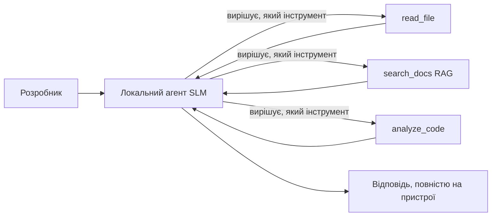
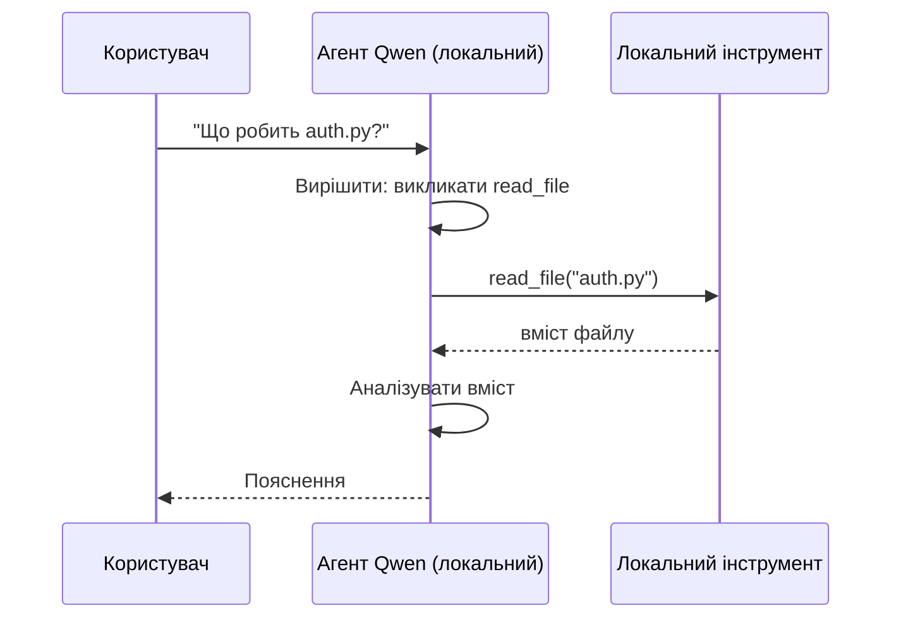
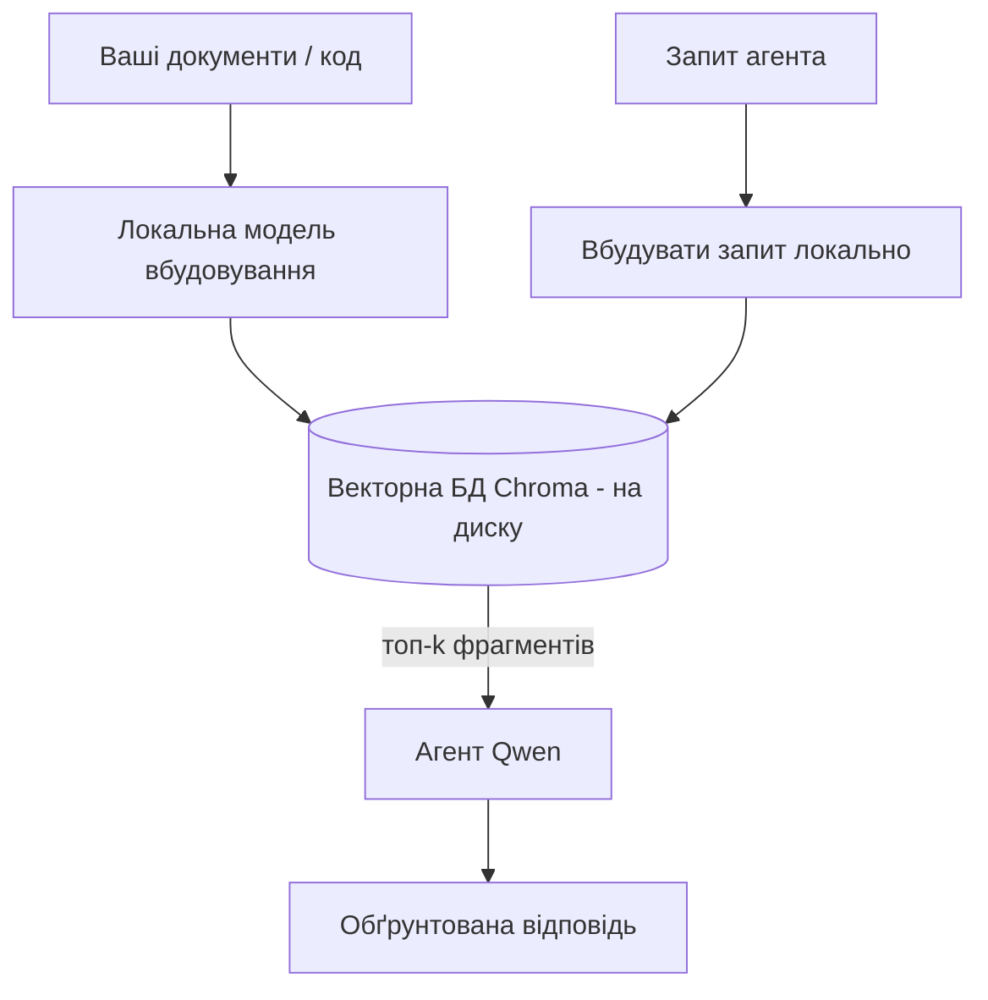
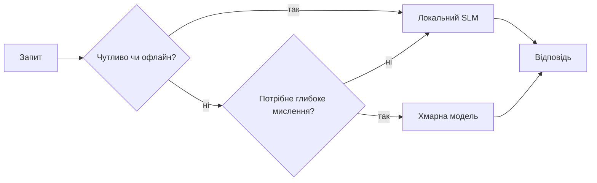

# Створення локальних AI агентів за допомогою Microsoft Foundry Local і Qwen


У попередньому уроці агенти масштабувалися *вгору* у хмару. Цей урок опускає їх *вниз* на одну машину. До кінця ви матимете працюючого інженерного асистента, який міркує, викликає інструменти, читає ваші файли та шукає в документації — **без жодного звернення до хмари.**

Чому це може бути корисним? Три причини, які постійно виникають у реальній інженерній роботі:

- **Конфіденційність.** Код і документи ніколи не покидають машину. Жодна підказка, жодний фрагмент і жодні дані клієнта не переходять межу мережі.
- **Вартість.** Локальне виконання не має плати за токен. Ви можете ітеруватися увесь день за вартість електроенергії.
- **Оффлайн.** На літаку, у захищеному приміщенні або під час відключення, агент при цьому продовжує працювати.

Віддаєте перевагу тому, щоб обміняти хмарну модель передового рівня на **Small Language Model (SLM)**, яка працює на вашому CPU, GPU або NPU. Цей урок присвячений побудові агентів, які *добре* працюють у межах цього обмеження, замість того щоб ігнорувати його.

## Вступ

У цьому уроці розглянемо:

- **Small Language Models (SLMs)** — що це, в чому їхні сильні сторони і де вони слабкі.
- **Microsoft Foundry Local** — середовище виконання, що завантажує та обслуговує моделі локально через **OpenAI-сумісний API**.
- **Моделі Qwen з викликом функцій** — SLM, що послідовно генерує виклики інструментів, що й робить локальних *агентів* (а не лише локальний чат) можливими.
- **Локальні інструменти, локальний RAG і локальний MCP** — надаючи агенту можливості без хмари.
- **Гібридні патерни** — коли залишати локально, а коли звертатись до хмари.

## Цілі навчання

Після завершення уроку ви знатимете, як:

- Пояснити компроміси SLM і вибрати відповідні випадки використання локальних агентів.
- Запустити модель Qwen локально за допомогою Foundry Local та підключитися через OpenAI-сумісний кінцевий пункт.
- Побудувати агента, що викликає інструменти, який повністю працює на вашій робочій станції.
- Додати локальний RAG поверх власних документів, використовуючи локальну векторну базу даних (Chroma).
- Підключити агента до локального MCP сервера та зрозуміти гібридний дизайн локального/хмарного підходу.

## Необхідні знання

Цей урок передбачає, що ви пройшли попередні уроки і впевнено користуєтесь:

- [Використання інструментів](../04-tool-use/README.md) (Урок 4) і [Agentic RAG](../05-agentic-rag/README.md) (Урок 5).
- [Agentic Protocols / MCP](../11-agentic-protocols/README.md) (Урок 11).
- [Microsoft Agent Framework](../14-microsoft-agent-framework/README.md) (Урок 14).

Також вам знадобляться:

- Розробницька робоча станція. **Реалістичний мінімум — 8 ГБ ОЗП**; комфортно — 16 ГБ і більше. Наявність GPU чи NPU допомагає, але не обов’язкова.
- Встановлений **Microsoft Foundry Local** (див. розділ налаштування нижче).
- Python 3.12+ та пакунки з репозиторію [`requirements.txt`](../../../requirements.txt), а також `foundry-local-sdk`, `openai` і `chromadb` для цього уроку.

## Small Language Models: Правильний інструмент для локальної роботи

Хмарна модель передового рівня має сотні мільярдів параметрів і великий дата-центр. SLM має кілька мільярдів параметрів і має поміщатися в оперативну пам'ять вашого ноутбука. Ця різниця встановлює чіткі очікування.

**SLM добре справляються з:**

- Структурованими, обмеженими завданнями — класифікацією, витяганням, підсумовуванням відомого документа.
- **Викликом інструментів** — вибором функції для виклику та її аргументів.
- Швидкою, дешевою, приватною ітерацією з власними даними.

**SLM слабші в:**

- Відкритих, багатоступеневих міркуваннях на великому контексті.
- Широких знаннях про світ (вони бачили менше і швидше забувають).

Тож стратегія успіху для локальних агентів: **дозвольте SLM керувати, а інструментам виконувати важку роботу.** Моделі не потрібно *знати* ваш код — їй потрібно знати, коли викликати `read_file` і `search_docs`. Це саме те, у чому сильні SLM.



## Microsoft Foundry Local

**Microsoft Foundry Local** — легке середовище виконання, що завантажує, управляє та обслуговує моделі повністю на вашій машині. Найважливіша для нас особливість — це **OpenAI-сумісний HTTP кінцевий пункт** — тобто SDK OpenAI і OpenAI клієнт Microsoft Agent Framework працюватимуть з ним, змінивши лише `base_url`. Все, що ви вивчили про побудову агентів, переноситься напряму; змінюється лише пункт доступу — з хмари на `localhost`.

Foundry Local також автоматично підбирає найкращу збірку моделі для вашого обладнання — для CPU, CUDA/GPU або NPU — тож вам не потрібно оптимізувати вручну під кожен комп’ютер.

### Налаштування

Встановіть Foundry Local (див. [документацію](https://learn.microsoft.com/azure/ai-foundry/foundry-local/) для вашої ОС), а потім підтвердьте, що він працює:

```bash
# Встановіть (наприклад; дотримуйтесь документації для вашої платформи)
winget install Microsoft.FoundryLocal      # Windows
# brew install microsoft/foundrylocal/foundrylocal   # macOS

# Завантажте та запустіть модель Qwen, потім розпочніть локальний сервіс
foundry model run qwen2.5-7b-instruct
foundry service status
```

Після запуску сервісу у вас буде локальний, OpenAI-сумісний кінцевий пункт (зазвичай `http://localhost:PORT/v1`). Ноутбук використовує `foundry-local-sdk` для автоматичного пошуку кінцевого пункту, тож не потрібно жорстко прописувати порт.

## Виклик функцій Qwen: Чому це важливо

Агент — це агент лише якщо він може викликати інструменти. Багато SLM можуть спілкуватися, але виробляють ненадійні та неправильно сформовані виклики інструментів. Моделі **Qwen** навчили надійно створювати структури викликів інструментів — саме це перетворює локальну чат-модель у локального *агента*.

Потік стандартний, ви його вже знаєте — виклик інструментів у циклі, тільки тепер локально:



## Локальний RAG

Пошук у документації — це те, де локальні агенти виправдовують себе. Замість надії, що SLM запам’ятала документацію вашого фреймворку, ви вбудовуєте ці документи у **локальну векторну базу** і даєте агенту повертати відповідні фрагменти за потребою.

Ми використовуємо **Chroma** — вбудоване сховище векторів, що працює в процесі без окремого сервера. Конвеєр повністю локальний: локальна модель вбудовування → локальні вектори → локальний пошук → локальний SLM.



Це той самий патерн Agentic RAG з уроку 5 — єдина зміна в тому, що кожен компонент працює на вашій машині.

## Локальні MCP сервери

[MCP](../11-agentic-protocols/README.md) — це транспорт, а не хмарний сервіс. MCP сервер може запускатися локально як процес на `stdio`, виставляючи інструменти агенту через стандартний протокол. Це дає можливість використовувати численні MCP сервери — доступ до файлової системи, git-операції, запити до бази даних — повністю офлайн.

Рівень безпеки відрізняється від хмари, але не відсутній: локальний MCP сервер працює з правами вашого користувача, тож обмежуйте, до чого він матиме доступ (папка проєкту, а не весь домашній каталог) і валідуйте його вивід як вхідні дані.

## Гібридні патерни хмарних і локальних систем

Локальний підхід не означає виключно локальний. Дорослі системи направляють за чутливістю і складністю:

| Ситуація | Де працює |
| --- | --- |
| Чутливий код / дані, або офлайн | **Локальний SLM** |
| Просте, обмежене завдання | **Локальний SLM** (дешево, швидко) |
| Складні багатоступеневі міркування над нечутливими даними | **Хмарна модель** |
| Усе під час відключення | **Локальний SLM** (плавна деградація) |

Це відображає ідею **маршрутизації моделей** з уроку 16 — тільки тепер одна з "моделей" — ваша власна машина. Надійний дизайн переходить на локальний режим, коли хмара недоступна, тож якість агента падає поступово, а не повністю відмовляється.



## Практична лабораторна робота: локальний інженерний асистент

Відкрийте [`code_samples/17-local-agent-foundry-local.ipynb`](./code_samples/17-local-agent-foundry-local.ipynb) і виконайте його. Ви створите **локального інженерного асистента**, який повністю працює на вашій робочій станції і може:

1. **Викликати інструменти** — через виклик функцій Qwen через Foundry Local.
2. **Виконувати локальні операції з файлами** — перелік і читання файлів у папці проєкту.
3. **Аналізувати код** — звітувати основні метрики за файлом джерела.
4. **Шукати в документації** — локальний RAG по папці документів з Chroma.
5. **Використовувати MCP** — підключатися до локального MCP сервера (з акуратним пропуском, якщо сервер не налаштований).

Жодних звернень до хмари не використовується.

### Коротке керівництво

Асистент підключається до Foundry Local через OpenAI-сумісний кінцевий пункт, тому код агента майже ідентичний тому, що у хмарних уроках — змінюється лише клієнт:

```python
from foundry_local import FoundryLocalManager
from openai import OpenAI

# Foundry Local виявляє/завантажує модель і надає нам локальну точку доступу.
manager = FoundryLocalManager(\"qwen2.5-7b-instruct\")
client = OpenAI(base_url=manager.endpoint, api_key=manager.api_key)  # api_key є локальним заповнювачем
```

Інструменти — це звичайні функції Python, обмежені папкою проєкту:

```python
def read_file(path: str) -> str:
    \"\"\"Read a file, but only inside the sandboxed project directory.\"\"\"
    full = (PROJECT_ROOT / path).resolve()
    if PROJECT_ROOT not in full.parents and full != PROJECT_ROOT:
        return \"Access denied: path is outside the project directory.\"
    return full.read_text(encoding=\"utf-8\")
```

Зверніть увагу на перевірку sandbox — навіть локально інструмент, що читає будь-які шляхи, може бути ризиком. Ноутбук тримає кожен інструмент обмеженим кореневою папкою проєкту.

## Перевірка знань

Перевірте своє розуміння перед переходом до завдання.

**1. Наведіть дві конкретні причини запускати агента локально, а не у хмарі.**

<details>
<summary>Відповідь</summary>

Будь-які дві з: **конфіденційність** (код і дані ніколи не покидають машину), **вартість** (немає плати за токен на inference), і **можливість працювати офлайн** (функціонує без мережі — на літаку, в захищеному приміщенні або під час відключення). Часто причиною конфіденційності є нормативні/юридичні обмеження, що забороняють відправку даних поза пристрій.
</details>

**2. Який рекомендований розподіл ролей між SLM і інструментами в локальному агенті і чому?**

<details>
<summary>Відповідь</summary>

Дозвольте SLM **керувати** (вирішувати, який інструмент викликати і з якими аргументами), а **важку роботу нехай виконують інструменти** (читання файлів, отримання документації, обчислення результатів). SLM сильні у вузьких рішеннях, як вибір інструменту, але слабкі у широких знаннях і складних багатоступеневих міркуваннях, тож опора на інструменти грає їм на руку.
</details>

**3. Що робить можливою повторне використання коду хмарного агента з Foundry Local?**

<details>
<summary>Відповідь</summary>

Foundry Local надає **OpenAI-сумісний HTTP кінцевий пункт**. SDK OpenAI і клієнт Agent Framework працюють з ним, змінюючи лише `base_url` (і використовуючи локальний умовний API ключ). Усе інше в коді агента залишається без змін.
</details>

**4. Чому ми конкретно використовуємо модель виклику функцій Qwen замість будь-якої іншої SLM?**

<details>
<summary>Відповідь</summary>

Тому що агент має створювати надійні, добре сформовані **виклики інструментів**. Багато SLM можуть вести бесіду, але створюють неправильно сформовані чи непослідовні структури викликів. Моделі Qwen навчені для виклику функцій і видають послідовні виклики, що щойно й перетворює локальний чат на робочого локального агента.
</details>

**5. Які компоненти локального конвеєра RAG працюють на машині?**

<details>
<summary>Відповідь</summary>

Всі: модель вбудовування, векторна база (Chroma, на диску), крок пошуку і SLM. Документи вбудовуються локально, зберігаються локально, шукаються локально і аналізуються локальною моделлю — жоден компонент не звертається до хмари.
</details>

**6. Локальний MCP сервер працює на вашій машині. Чи робить це його автоматично безпечним? Які заходи обережності варто дотримуватися?**

<details>
<summary>Відповідь</summary>

Ні. Локальний MCP сервер працює з правами вашого користувача, тож має доступ до всього, до чого маєте доступ ви. Обмежте його тим, що потрібно (наприклад, однією папкою проєкту, а не всім домашнім каталогом) і валідуйте результати як вхідні дані перед наступними діями.
</details>

**7. Опишіть розумне гібридне правило маршрутизації, що включає локальну модель.**

<details>
<summary>Відповідь</summary>

Направляйте чутливі або офлайн-запити до локального SLM; спрямовуйте прості обмежені завдання до локального SLM заради швидкості і вартості; складні багатоступеневі міркування за нечутливими даними — у хмарну модель; і переходьте на локальний SLM, коли хмара недоступна, щоб агент деградував плавно, а не відмовляв зовсім. Це маршрутизація моделей (Урок 16) з локальною машиною як однією з моделей.
</details>

**8. Який реалістичний мінімум ОЗП для запуску локального агента в цьому уроці і що дає більше ОЗП?**

<details>
<summary>Відповідь</summary>

Близько **8 ГБ** — реалістичний мінімум; 16 ГБ і більше — комфортно. Більше оперативної пам'яті дає змогу запускати більші та потужніші моделі і зберігати більше контексту в пам'яті. GPU або NPU пришвидшують inference, але не обов’язкові — Foundry Local обирає збірку для CPU, якщо акселератор відсутній.
</details>

## Завдання

Розширте локального інженерного асистента у **локального рев’юера документації** для невеликого проєкту за вашим вибором (можете використати одну з папок з уроками цього репозиторію).

Ваше рішення має:

1. **Індексувати реальну папку з документацією/кодом** в Chroma (щонайменше п’ять файлів).
2. **Додати інструмент `find_todos`**, що сканує проєкт на наявність коментарів `TODO`/`FIXME` і повертає їх з іменами файлів і номерами рядків — з такою самою перевіркою sandbox, як і в `read_file`.

3. **Задайте агенту три питання**, які змусять його поєднати інструменти: одне чисто RAG-питання, одне, що вимагає прочитання конкретного файлу, і одне, що потребує пошуку TODO.
4. **Виміряйте це**: зафіксуйте час відповіді на кожне з трьох питань і запишіть у markdown-клітинку. Прокоментуйте, чи є затримка прийнятною для вашого робочого процесу.

Потім напишіть короткий абзац про **що ви б перенесли в хмару, а що залишили б локальним** для цього рецензента і чому. Вас оцінюють за правильність з’єднання локальних компонентів і за обґрунтованість гібридного мислення — але не за якість моделі.

## Підсумок

У цьому уроці ви побудували агента, який працює повністю на вашому комп'ютері:

- **SLMs** жертвують широтою охоплення заради приватності, вартості та роботи в офлайні — і стають ефективними, коли **керують інструментами**, а не несуть усі знання самі.
- **Foundry Local** обслуговує моделі на пристрої за **OpenAI-сумісною кінцевою точкою**, тому ваш код хмарного агента можна перенести лише змінивши один рядок.
- **Qwen-моделі з викликом функцій** роблять надійним локальний виклик інструментів — і, отже, локальних *агентів* — можливим.
- **Локальний RAG** (Chroma) та **локальний MCP** дають агенту можливості, не виходячи з машини.
- **Гібридні шаблони** дозволяють маршрутизувати за ступенем чутливості та складності, використовуючи локальне як елегантне резервне рішення.

Це завершує арку розгортання: урок 16 масштабував агентів у Microsoft Foundry, а цей урок масштабував їх на одну робочу станцію. Наступний урок присвячений забезпеченню безпеки розгорнутих агентів.

## Додаткові ресурси

- <a href="https://learn.microsoft.com/azure/ai-foundry/foundry-local/" target="_blank">Документація Microsoft Foundry Local</a>
- <a href="https://learn.microsoft.com/azure/ai-foundry/what-is-azure-ai-foundry" target="_blank">Документація Microsoft Foundry</a>
- <a href="https://learn.microsoft.com/en-us/agent-framework/overview/?wt.mc_id=youtube_26688_organicsocial_reactor&pivots=programming-language-python" target="_blank">Microsoft Agent Framework</a>
- <a href="https://qwen.readthedocs.io/en/latest/framework/function_call.html" target="_blank">Документація з викликів функцій Qwen</a>
- <a href="https://modelcontextprotocol.io/" target="_blank">Model Context Protocol (MCP)</a>
- <a href="https://docs.trychroma.com/" target="_blank">Векторна база даних Chroma</a>

## Попередній урок

[Розгортання масштабованих агентів](../16-deploying-scalable-agents/README.md)

## Наступний урок

[Забезпечення безпеки AI агентів](../18-securing-ai-agents/README.md)

---

<!-- CO-OP TRANSLATOR DISCLAIMER START -->
**Відмова від відповідальності**:
Цей документ було перекладено за допомогою сервісу штучного інтелекту для перекладу [Co-op Translator](https://github.com/Azure/co-op-translator). Хоча ми прагнемо до точності, будь ласка, майте на увазі, що автоматичні переклади можуть містити помилки або неточності. Оригінальний документ рідною мовою слід вважати авторитетним джерелом. Для критично важливої інформації рекомендується професійний людський переклад. Ми не несемо відповідальності за будь-які непорозуміння або неправильні тлумачення, що виникли внаслідок використання цього перекладу.
<!-- CO-OP TRANSLATOR DISCLAIMER END -->