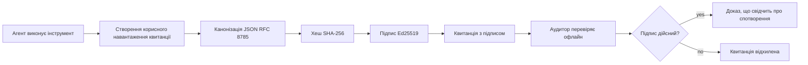
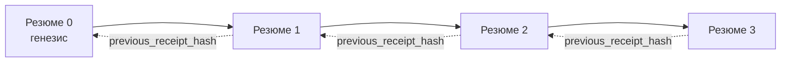

[Переглянути відео уроку: Захист AI-агентів за допомогою криптографічних квитанцій](https://youtu.be/PLACEHOLDER_VIDEO_ID)

> _(Відео уроку та мініатюра будуть додані командою контенту Microsoft після злиття, відповідно до патерну уроків 14 / 15.)_

# Захист AI-агентів за допомогою криптографічних квитанцій

## Вступ

У цьому уроці буде розглянуто:

- Чому аудиторські сліди для AI-агентів важливі для відповідності, налагодження та довіри.
- Що таке криптографічна квитанція і чим вона відрізняється від незаподписаного рядка логу.
- Як створити підписану квитанцію для виклику інструмента агента на чистому Python.
- Як перевірити квитанцію офлайн та виявити підробку.
- Як ланцюжити квитанції так, щоб видалення або зміна порядку однієї порушувала ланцюжок.
- Що квитанції доводять і що вони явно не доводять.

## Цілі навчання

Після проходження цього уроку ви знатимете, як:

- Визначати режими відмов, які мотивують криптографічне походження дій агента.
- Створювати квитанцію, підписану Ed25519, над канонічним JSON-пакетом.
- Перевіряти квитанцію незалежно, використовуючи лише публічний ключ підписувача.
- Виявляти підробку шляхом повторного запуску перевірки зміненої квитанції.
- Будувати послідовність квитанцій, пов'язаних хешем, та пояснювати, чому ланцюжок важливий.
- Визнавати межу між тим, що квитанції доводять (атрибуція, цілісність, порядок) і тим, що вони не доводять (коректність дії, обґрунтованість політики).

## Проблема: Аудиторський слід вашого агента

Уявіть, що ви розгорнули AI-агента для Contoso Travel. Агент читає запити клієнтів, викликає API квитків для пошуку варіантів і бронює місця від імені клієнта. У минулому кварталі агент обробив 50,000 бронювань.

Сьогодні приходить аудитор. Він ставить просте запитання: «Покажіть, що зробив ваш агент.»

Ви даєте журнали. Аудитор дивиться їх і ставить складніше запитання: «Як я можу знати, що ці логи не були відредаговані?»

Це й є проблема аудиторського сліду. Більшість сьогоднішніх розгортань агентів покладаються на:

- **Логи застосунку**: пише їх сам агент, їх можна редагувати будь-кому, хто має доступ до файлової системи.
- **Хмарні служби логування**: захищені від підробок на рівні платформи, але лише якщо аудитор довіряє оператору платформи.
- **Логи транзакцій бази даних**: добре підходять для змін у базі даних, але не для довільних викликів інструментів.

Жоден із цих способів не може відповісти аудиторське питання без того, щоб аудитор не довіряв комусь (вам, вашому хмарному провайдеру або постачальнику бази даних). Для внутрішнього використання така довіра часто прийнятна. Для регламентованих навантажень (фінанси, охорона здоров’я, будь-що під юрисдикцією AI Act ЄС) — ні.

Криптографічні квитанції вирішують це, роблячи кожну дію агента незалежно перевірною. Аудитор не має довіряти вам. Йому потрібен лише ваш публічний ключ і сама квитанція.

## Що таке криптографічна квитанція?

Квитанція — це об’єкт JSON, який записує, що зробив агент, підписаний цифровим підписом.


  
Мінімальна квитанція виглядає так:

```json
{
  "type": "agent.tool_call.v1",
  "agent_id": "contoso-travel-bot",
  "tool_name": "lookup_flights",
  "tool_args_hash": "sha256:a3f9c1...",
  "result_hash": "sha256:7b2e1d...",
  "policy_id": "contoso-travel-policy-v3",
  "timestamp": "2026-04-25T14:30:00Z",
  "sequence": 47,
  "previous_receipt_hash": "sha256:9d4e6a...",
  "signature": {
    "alg": "EdDSA",
    "sig": "c5af83...",
    "public_key": "8f3b2c..."
  }
}
```
  
Три властивості виконують основну роботу:

1. **Підпис**. Квитанція підписується шлюзом агента за допомогою приватного ключа Ed25519. Будь-хто, хто має відповідний публічний ключ, може офлайн перевірити підпис. Зміна будь-якого поля робить підпис недійсним.

2. **Канонічне кодування**. Перед підписом квитанція серіалізується за схемою JSON Canonicalization Scheme (JCS, RFC 8785). Це гарантує, що дві реалізації, які виробляють один логічний вміст, генерують ідентичний у байтах результат. Без канонізації різні JSON-серіалізатори створювали б різні підписи для однакового вмісту.

3. **Хеш-ланцюжок**. Поле `previous_receipt_hash` пов’язує кожну квитанцію з попередньою. Видалення або зміна порядку однієї квитанції руйнує всі наступні. Підробка стає помітною на рівні ланцюжка, навіть якщо окремі підписи обходять.

Разом ці властивості забезпечують три гарантії:

- **Атрибуція**: цей ключ підписав цей вміст.
- **Цілісність**: вміст не змінювався після підпису.
- **Порядок**: ця квитанція йде після тієї у ланцюжку.

## Створення квитанції на Python

Для створення квитанції вам не потрібна спеціальна бібліотека. Криптографічні примітиви широко доступні, а логіка — це кілька десятків рядків на Python.

Покрокові вправи у `code_samples/18-signed-receipts.ipynb` показують увесь процес. Коротко:

```python
import json
import hashlib
import base64
from nacl import signing
from jcs import canonicalize  # RFC 8785 канонічний JSON

def b64url_nopad(data: bytes) -> str:
    return base64.urlsafe_b64encode(data).decode("ascii").rstrip("=")

def sha256_canonical(obj) -> str:
    """SHA-256 of a Python object's JCS-canonical JSON form."""
    return f"sha256:{hashlib.sha256(canonicalize(obj)).hexdigest()}"

# Згенерувати або завантажити ключ підпису (у виробництві зберігати в сховищі ключів)
signing_key = signing.SigningKey.generate()
verify_key = signing_key.verify_key

# Побудувати корисне навантаження квитанції (ще без підпису)
tool_args = {"origin": "SYD", "destination": "LAX"}
tool_result = [{"flight": "QF11", "price": 1850, "stops": 0}]

payload = {
    "type": "agent.tool_call.v1",
    "agent_id": "contoso-travel-bot",
    "tool_name": "lookup_flights",
    "tool_args_hash": sha256_canonical(tool_args),
    "result_hash": sha256_canonical(tool_result),
    "policy_id": "contoso-travel-policy-v3",
    "timestamp": "2026-04-25T14:30:00Z",
    "sequence": 0,
    "previous_receipt_hash": None,
}

# Канонізувати, хешувати, підписувати.
canonical_bytes = canonicalize(payload)
message_hash = hashlib.sha256(canonical_bytes).digest()
signature_bytes = signing_key.sign(message_hash).signature

# Додати структуру об'єкта підпису.
receipt = {
    **payload,
    "signature": {
        "alg": "EdDSA",
        "sig": b64url_nopad(signature_bytes),
        "public_key": b64url_nopad(bytes(verify_key)),
    },
}
```
  
Це увесь конвеєр підпису. Вправи в зошиті проходять кожен крок.

## Перевірка квитанції та виявлення підробок

Перевірка — це обернена операція:

```python
import base64
import hashlib
from nacl import signing
from nacl.exceptions import BadSignatureError
from jcs import canonicalize

def b64url_decode(s: str) -> bytes:
    padding = "=" * ((4 - len(s) % 4) % 4)
    return base64.urlsafe_b64decode(s + padding)

def verify_receipt(receipt: dict) -> bool:
    # Підпис є структурованим об'єктом: {"alg", "sig", "public_key"}.
    sig_obj = receipt.get("signature")
    if not sig_obj or sig_obj.get("alg") != "EdDSA":
        return False

    # Відновіть навантаження, яке було фактично підписане (все, крім підпису).
    payload = {k: v for k, v in receipt.items() if k != "signature"}

    canonical_bytes = canonicalize(payload)
    message_hash = hashlib.sha256(canonical_bytes).digest()

    try:
        verify_key = signing.VerifyKey(b64url_decode(sig_obj["public_key"]))
        verify_key.verify(message_hash, b64url_decode(sig_obj["sig"]))
        return True
    except BadSignatureError:
        return False
```
  
Ця функція приймає квитанцію і повертає `True`, якщо підпис дійсний, і `False` інакше. Жодних мережевих викликів, жодної залежності від сервісу, жодної потрібної довіри до третьої сторони.

Щоби побачити в дії виявлення підробки, у зошиті демонструють:

1. Створення дійсної квитанції та підтвердження, що перевірка проходить.
2. Зміну одного байта в полі `tool_args_hash`.
3. Повторну перевірку, яка провалюється.

Це практична демонстрація, що квитанції є підробно-виявними: будь-яка зміна, навіть найменша, порушує підпис.

## Ланцюжок квитанцій для багатокрокових агентів

Одна підписана квитанція захищає одну дію. Ланцюг квитанцій захищає послідовність дій.


  
Кожна квитанція записує хеш попередньої. Щоб тихо видалити квитанцію 2, зловмисник має або:

- Змінити поле `previous_receipt_hash` у квитанції 3 (порушить підпис квитанції 3), АБО
- Підробити новий підпис на зміненій квитанції 3 (потрібен приватний ключ агента).

Якщо приватний ключ зберігається у апаратному сховищі, а публічний ключ публікується з кожною квитанцією, жодна з атак неможлива без виявлення.

У зошиті демонструють:

1. Побудову ланцюжка з трьох квитанцій.
2. Перевірку, що `previous_receipt_hash` кожної квитанції співпадає з фактичним хешем попередньої квитанції.
3. Підробку однієї квитанції посередині і спостереження, як ланцюжок ламається саме у цій точці.

Так ви отримуєте аудиторський слід, який зовнішній аудитор може перевірити без довіри до вас.

## Що доводять квитанції (і що ні)

Це найважливіший розділ уроку. Квитанції потужні, але їх потужність обмежена.

**Квитанції доводять три речі:**

1. **Атрибуція**: конкретний ключ підписав конкретний пакет.
2. **Цілісність**: пакет не змінився після підпису.
3. **Порядок**: ця квитанція йде після іншої в хеш-ланцюжку.

**Квитанції НЕ доводять:**

1. **Коректність**: що дія агента була правильною. Квитанція може підписати й неправильну відповідь так само чисто, як і правильну.
2. **Відповідність політиці**: що політика, згадана в `policy_id`, була справді оцінена, або що вона б дозволила цю дію, якби була перевірена. Квитанція записує, що було заявлено, а не що було застосовано.
3. **Ідентичність поза ключем**: квитанція каже «цей ключ підписав цей вміст». Вона не каже «ця людина авторизувала це». Зв’язок ключа з особою або організацією вимагає окремої інфраструктури ідентичності (каталог, реєстр публічних ключів тощо).
4. **Правдивість вхідних даних**: якщо агент отримує змінений запит і реагує на нього, квитанція фіксує дію чесно. Квитанції — це наступний рівень після валідації вхідних даних, а не її заміна.

Ця межа важлива з двох причин:

- Вона показує, для чого квитанції корисні: робити поведінку агентів аудиторською та підробно-виявною, навіть між організаціями.
- Вона показує, які додаткові шари вам ще потрібні: валідація вхідних даних (урок 6), примусова політика (коротко нижче), та інфраструктура ідентичності (поза межами уроку).

Поширена помилка — вважати, що «у нас є квитанції» означає «ми керуємося». Ні. Квитанції — це фундамент. Керування — це система, яку ви на нього насипаєте.

## Промислові посилання

Код Python у цьому уроці навмисно мінімальний, щоб ви могли прочитати кожен рядок і точно розуміти, що відбувається. У виробництві у вас є два варіанти:

1. **Будувати безпосередньо на криптографічних примітивах.** 50 рядків, які ви бачили вище, достатньо для багатьох випадків. PyNaCl (Ed25519) і пакет `jcs` (канонічний JSON) — це добре підтримувані і перевірені бібліотеки.

2. **Використовувати виробничу бібліотеку квитанцій.** Кілька open-source проектів реалізують той самий патерн із додатковими функціями (ротація ключів, пакетна перевірка, розповсюдження JWK Set, інтеграція з політичними рушіями):
   - Формат квитанції, використаний в цьому уроці, слідує чернетці IETF Internet-Draft (`draft-farley-acta-signed-receipts`), яка наразі йде процесом стандартизації.
   - Microsoft Agent Governance Toolkit поєднує квитанції з політичними рішеннями, заснованими на Cedar; дивіться Tutorial 33 у тому репозиторії для прикладу крок-за-кроком.
   - Пакети `protect-mcp` (npm) і `@veritasacta/verify` (npm) надають Node-реалізацію підпису квитанцій і офлайн перевірки, призначені для враппінгу будь-якого MCP-сервера під підробно-виявний аудиторський слід.

Вибір між написанням свого та використанням бібліотеки подібний до вибору між написанням власної JWT-бібліотеки або використанням перевіреної: обидва варіанти розумні; бібліотека економить час і звужує аудиторську площу; підхід із нуля змушує розуміти кожен примітив. Цей урок навчає підходу із нуля, щоб дати вам фундамент для будь-якого вибору.

## Перевірка знань

Перевірте свої знання перед переходом до практичного завдання.

**1. Квитанція підписана приватним ключем Ed25519 агента. Аудитор має лише публічний ключ. Чи може аудитор перевірити квитанцію офлайн?**

<details>
<summary>Відповідь</summary>

Так. Перевірка Ed25519 вимагає лише публічний ключ і підписані байти. Жодних мережевих викликів, жодної залежності від сервісів. Це властивість, яка робить квитанції корисними в умовах ізоляції, мультиорганізаційних або низькодовірчих аудиторських сценаріях.
</details>

**2. Зловмисник змінив поле `policy_id` квитанції, щоб стверджувати, що дія підпорядковується більш ліберальній політиці. Підпис було виконано за оригінальним пакетом. Що станеться під час перевірки?**

<details>
<summary>Відповідь</summary>

Перевірка не пройде. Підпис був утворений над канонічними байтами оригінального пакета; будь-яка зміна поля змінює байти, що змінює SHA-256 хеш, що робить підпис недійсним. Зловмиснику потрібен приватний ключ для створення свіжого дійсного підпису, якого він не має.
</details>

**3. Чому у квитанції є `tool_args_hash` та `result_hash`, а не сирі аргументи чи результат?**

<details>
<summary>Відповідь</summary>

Дві причини. По-перше, квитанція може архівуватися або передаватися у середовищах, де утечка сирого вмісту (персональні дані, бізнес-інформація) є проблемою. Хешування зберігає квитанцію невеликою та конфіденційною; аудитор перевіряє, що хеш відповідає окремо збереженій копії фактичного вмісту. По-друге, хеші мають фіксований розмір; квитанція з хешами обмежена за розміром незалежно від розміру вхідних та вихідних даних.
</details>

**4. Поле `previous_receipt_hash` пов’язує кожну квитанцію з попередньою. Якщо зловмисник тихо видалить одну квитанцію посеред ланцюжка, що стане недійсним?**

<details>
<summary>Відповідь</summary>

Кожна квитанція, що йшла після видаленої. Їхні поля `previous_receipt_hash` більше не співпадатимуть із фактичним ланцюжком (тому що квитанції, на яку вони посилалися, більше немає, або ланцюжок вказує на інший попередник). Щоб приховати видалення, зловмиснику довелося б перепідписувати кожну пізнішу квитанцію, що вимагає приватного ключа.
</details>

**5. Квитанція коректно перевірилася. Чи доводить це, що дія агента була правильною, обґрунтованою і відповідала політиці?**

<details>
<summary>Відповідь</summary>

Ні. Дійсна квитанція доводить три речі: атрибуцію (цей ключ підписав вміст), цілісність (вміст не змінився) і порядок (ця квитанція йде після іншої). Вона НЕ доводить, що дія була правильною, що політика в `policy_id` справді була оцінена, або що агент дотримувався всіх правил. Квитанції роблять поведінку агента аудиторською, не обов’язково коректною. Це найважливіша межа уроку.
</details>

## Практичне завдання

Відкрийте `code_samples/18-signed-receipts.ipynb` і виконайте усі чотири розділи:

1. **Розділ 1**: Підпишіть першу квитанцію і перевірте її.
2. **Розділ 2**: Підробіть квитанцію і спостерігайте, як перевірка не проходить.
3. **Розділ 3**: Побудуйте ланцюжок із трьох квитанцій і перевірте цілісність ланцюга.
4. **Розділ 4**: Застосуйте патерн до агента, побудованого за Microsoft Agent Framework: обгорніть виклик інструмента у підписання квитанції, потім перевірте її незалежно.

**Додаткове завдання 1:** розширте схему квитанції власним додатковим полем (наприклад, ідентифікатором запиту для трасування), оновіть логіку канонічного підпису, щоб його включити, і підтвердіть, що квитанція проходить перевірку круговим шляхом. Потім змініть поле після підпису і підтвердіть, що перевірка провалюється. Це змусить вас зрозуміти, як кожен байт канонічного кодування впливає на підпис.
**Задача підвищеної складності 2:** Хешуйте дві ваші квитанції за допомогою SHA-256 разом (конкатенуючи їх канонічні байти в детермінованому порядку) і вбудуйте отриманий дайджест як нове поле у третю квитанцію перед її підписанням. Перевірте, що всі три квитанції все ще можуть пройти цикл перевірки. Ви тільки що побудували доказ включення в один крок: будь-хто, хто має третю квитанцію, може довести, що перші дві існували на момент її підписання, не розкриваючи їх вміст. Це патерн, який використовується у квитанціях селективного розкриття на великому масштабі (Merkle-зобов’язання, RFC 6962).

## Висновок

Криптографічні квитанції надають агентам ШІ аудитний слід, який є:

- **Незалежно перевіреним**: будь-яка сторона з публічним ключем може перевірити, без залежності від сервісу.
- **Захищеним від підробки**: будь-яка зміна робить підпис недійсним.
- **Портативним**: квитанція — це невеликий JSON-файл; її можна архівувати, передавати та перевіряти будь-де.
- **Відповідним стандартам**: побудованим на Ed25519 (RFC 8032), JCS (RFC 8785) та SHA-256, всі широко використовувані примітиви.

Вони не є заміною валідації вхідних даних, виконання політик або інфраструктури ідентичності. Вони — основа для цих шарів. Коли ви розгортаєте агентів у регульованих робочих навантаженнях, міжорганізаційних робочих процесах чи будь-якому середовищі, де не можна припускати, що майбутній аудитор вам довірятиме, квитанції – це спосіб зробити аудиторський слід чесним.

Найважливіше: квитанції доводять, хто що сказав і коли. Вони не доводять, що те, що було сказано, є правдивим або правильним. Тримайте це розмежування чітким. Це різниця між чесною системою походження та оманливою.

## Контрольний список для виробничого впровадження

Коли ви будете готові перейти від цього уроку до розгортання агентів, підписаних квитанціями, у реальному середовищі:

- [ ] **Перемістіть ключ підпису зі свого ноутбука розробника.** Використовуйте Azure Key Vault, AWS KMS або апаратний модуль безпеки. Приватний ключ, який підписує ваші квитанції, ніколи не повинен зберігатися у системах контролю версій або у відкритому текстовому вигляді на серверах додатків.
- [ ] **Опублікуйте публічний ключ для перевірки.** Аудиторам він потрібен для офлайн-перевірки. Стандартний патерн — набір ключів JWK за відомою URL-адресою (RFC 7517), наприклад, `https://your-org.example.com/.well-known/agent-keys.json`.
- [ ] **Анкеруйте ланцюжок зовні.** Періодично записуйте хеш останньої вершини ланцюжка в журнал прозорості (Sigstore Rekor, RFC 3161 тимчасовий авторитет чи друга внутрішня система), щоб зовнішня сторона могла підтвердити "цей ланцюг існував у цей час".
- [ ] **Зберігайте квитанції незмінно.** Сховище з архівацією лише дозаписом (Azure Storage з політиками незмінності, AWS S3 Object Lock) запобігає переписуванню історії на рівні сховища.
- [ ] **Визначтесь із термінами зберігання.** Багато вимог відповідності передбачають зберігання кілька років. Плануйте зростання кількості квитанцій (кожна ~500 байт; агент, який робить 10 тис. викликів на день, виробляє ~1.8 ГБ на рік).
- [ ] **Документуйте, що квитанції не охоплюють.** Квитанції доводять атрибуцію, цілісність і порядок. Ваш керівництво має чітко перелічувати, які додаткові контролі (валидація вхідних даних, виконання політик, обмеження темпу, інфраструктура ідентичності) співіснують із квитанціями у вашій системі управління.

### Маєте більше запитань про безпеку агентів ШІ?

Приєднуйтесь до [Microsoft Foundry Discord](https://aka.ms/ai-agents/discord), щоб поспілкуватися з іншими учнями, відвідати години прийому та отримати відповіді на ваші питання про агентів ШІ.

## За межами цього уроку

Урок охоплює підписання одиночної квитанції і послідовності з хеш-ланцюгом. Ті ж примітиви формують ще кілька більш просунутих патернів, які ви можете зустріти із розвитком вашої системи управління:

- **Селективне розкриття.** Коли поля квитанції комітуються окремо (Merkle-дерево в стилі RFC 6962), ви можете розкривати певні поля певним аудиторам і доводити, що решта не змінилася, не розкриваючи їх. Це корисно, коли одна квитанція має відповідати і загальному аудиту (який вимагає повноти), і правилам мінімізації даних, як GDPR (які вимагають, аби аудитор бачив лише необхідне).
- **Відкликання квитанцій.** Якщо ключ підпису скомпрометовано, потрібен спосіб позначити всі квитанції, підписані цим ключем, як ненадійні починаючи з певного часу. Стандартні підходи: короткострокові ключі підпису плюс опублікований список відкликання або журнал прозорості з записами про відкликання.
- **Двосторонні / спільні підписані квитанції.** Деякі реалізації розбивають підписаний вміст на дві частини: до виконання (`authorization_*`) і після виконання (`result_*`) з незалежними підписами, що корисно, коли рішення про авторизацію та фактичний результат виробляються різними учасниками або у різний час. Це доповнює формат квитанції з цього уроку.
- **Композиція вмісту.** Квитанція закриває будь-які байти, які ви поклали в `result_hash`. Реальні вмісти часто багатші за результат одного виклику: логіка перед рішенням (прогноз моделі, опції, докази з їх повнотою, ризик, ланцюг відповідальності, результат охорони) можуть зберігатися у вмісті, закритому однією квитанцією. Це зберігає формат мінімальним, даючи змогу схематам вмісту розвиватися для кожної доменної області.
- **Сумісність між реалізаціями.** Декілька незалежних реалізацій того ж формату квитанції (Python, TypeScript, Rust, Go) перевіряють один одного на основі спільних тестових векторів. Якщо ви створите власну реалізацію, перевірка проти опублікованих векторів підтверджує сумісність.
- **Міграція з урахуванням постквантових технологій.** Ed25519 широко використовується сьогодні, але не є стійким до квантових атак. Формат квитанції алгоритмічно гнучкий: поле `signature.alg` може містити `ML-DSA-65` (стандарт постквантового підпису NIST), коли потрібно перейти на новий стандарт. Плануйте період переходу з подвійним підписом квитанцій.

## Додаткові ресурси

- <a href="https://datatracker.ietf.org/doc/draft-farley-acta-signed-receipts/" target="_blank">IETF Internet-Draft: Signed Decision Receipts for Machine-to-Machine Access Control</a>
- <a href="https://learn.microsoft.com/azure/ai-studio/responsible-use-of-ai-overview" target="_blank">Огляд відповідального використання ШІ (Azure AI)</a>
- <a href="https://datatracker.ietf.org/doc/html/rfc8032" target="_blank">RFC 8032: Алгоритм цифрового підпису на кривій Едвардса (EdDSA)</a>
- <a href="https://datatracker.ietf.org/doc/html/rfc8785" target="_blank">RFC 8785: Схема канонізації JSON (JCS)</a>
- <a href="https://datatracker.ietf.org/doc/html/rfc6962" target="_blank">RFC 6962: Прозорість сертифікатів</a> (Merkle-дерево, яке використовується у квитанціях селективного розкриття)
- <a href="https://github.com/microsoft/agent-governance-toolkit/blob/main/docs/tutorials/33-offline-verifiable-receipts.md" target="_blank">Microsoft Agent Governance Toolkit, Підручник 33: Офлайн-перевіряні квитанції про рішення</a>
- <a href="https://github.com/ScopeBlind/agent-governance-testvectors" target="_blank">Тестові вектори сумісності між реалізаціями</a> для формату квитанції цього уроку (Apache-2.0)
- <a href="https://pynacl.readthedocs.io/" target="_blank">Документація PyNaCl</a> (Ed25519 у Python)

## Попередній урок

[Побудова агентів для роботи з комп’ютером (CUA)](../15-browser-use/README.md)

## Наступний урок

_(Визначатиметься авторами навчальної програми)_

---

<!-- CO-OP TRANSLATOR DISCLAIMER START -->
**Відмова від відповідальності**:
Цей документ було перекладено за допомогою сервісу штучного інтелекту для перекладу [Co-op Translator](https://github.com/Azure/co-op-translator). Хоча ми прагнемо до точності, будь ласка, майте на увазі, що автоматичні переклади можуть містити помилки або неточності. Оригінальний документ рідною мовою слід вважати авторитетним джерелом. Для критично важливої інформації рекомендується професійний людський переклад. Ми не несемо відповідальності за будь-які непорозуміння або неправильні тлумачення, що виникли внаслідок використання цього перекладу.
<!-- CO-OP TRANSLATOR DISCLAIMER END -->