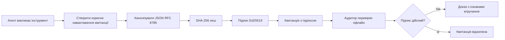
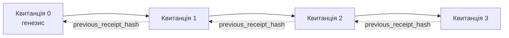

[Watch the lesson video: Захист AI-агентів за допомогою криптографічних квитанцій](https://youtu.be/PLACEHOLDER_VIDEO_ID)

> _(Відео уроку та мініатюра будуть додані командою контенту Microsoft після об’єднання, відповідно до шаблону уроків 14/15.)_

# Захист AI-агентів за допомогою криптографічних квитанцій

## Вступ

У цьому уроці розглянемо:

- Чому аудит ланцюжків для AI-агентів важливий для відповідності, налагодження та довіри.
- Що таке криптографічна квитанція і чим вона відрізняється від незаписаного рядка журналу.
- Як згенерувати підписану квитанцію на виклик інструмента агента простими засобами Python.
- Як перевірити квитанцію офлайн і виявити фальсифікації.
- Як зв’язати квитанції ланцюжком, щоб видалення чи перестановка однієї порушувала весь ланцюжок.
- Що квитанції доводять, а що вони явно не доводять.

## Цілі навчання

Після завершення цього уроку ви знатимете, як:

- Визначати режими відмов, які мотивують використання криптографічної походження для дій агента.
- Створювати квитанцію з підписом Ed25519 над канонічним JSON-пейлоадом.
- Самостійно перевіряти квитанцію, маючи лише публічний ключ підписувача.
- Виявляти фальсифікації, повторно запускаючи перевірку зміненої квитанції.
- Побудувати хеш-ланцюжок квитанцій та пояснити значення ланцюжка.
- Розрізняти межу між тим, що квитанції доводять (відносність, цілісність, упорядкування), і тим, що вони не доводять (коректність дії, правильність політики).

## Проблема: Аудиторський слід вашого агента

Уявіть, що ви запустили AI-агента для Contoso Travel. Агент читає запити клієнтів, робить виклики до API авіарейсів для пошуку варіантів і бронює квитки від імені клієнта. Минулого кварталу агент обробив 50 000 замовлень.

Сьогодні приходить аудитор з простим питанням: «Покажіть, що робив ваш агент.»

Ви надаєте лог-файли. Аудитор дивиться на них і ставить складніше питання: «Як я можу бути впевненим, що ці логи не редагували?»

Це проблема аудиторського сліду. Нині більшість розгортань агентів покладаються на:

- **Журнали застосунку**: записані самим агентом, можуть редагуватися будь-ким із доступом до файлової системи.
- **Хмарні служби журналювання**: мають захист від підробки на рівні платформи, але лише якщо аудитор довіряє оператору платформи.
- **Журнали транзакцій бази даних**: добре підходять для змін у базі, але не для довільних викликів інструментів.

Жоден із цих варіантів не може відповісти аудитору без необхідності довіри (до вас, вашого хмарного провайдера або продавця бази даних). Для внутрішнього використання така довіра часто прийнятна. Для регульованих навантажень (фінанси, охорона здоров’я, будь-що під ЄС AI Act) — ні.

Криптографічні квитанції вирішують це, роблячи кожну дію агента незалежно перевірною. Аудитор не має довіряти вам. Йому потрібні лише ваш публічний ключ та сама квитанція.

## Що таке криптографічна квитанція?

Квитанція — це JSON-об’єкт, який фіксує, що зробив агент, підписаний цифровим підписом.



Мінімальна квитанція має вигляд:

```json
{
  "type": "agent.tool_call.v1",
  "agent_id": "contoso-travel-bot",
  "tool_name": "lookup_flights",
  "tool_args_hash": "sha256:a3f9c1...",
  "result_hash": "sha256:7b2e1d...",
  "policy_id": "contoso-travel-policy-v3",
  "timestamp": "2026-04-25T14:30:00Z",
  "sequence": 47,
  "previous_receipt_hash": "sha256:9d4e6a...",
  "signature": {
    "alg": "EdDSA",
    "sig": "c5af83...",
    "public_key": "8f3b2c..."
  }
}
```

Три властивості виконують основну роботу:

1. **Підпис**. Квитанція підписана шлюзом агента за допомогою приватного ключа Ed25519. Будь-хто з відповідним публічним ключем може офлайн перевірити підпис. Зміна будь-якого поля робить підпис недійсним.

2. **Канонічне кодування**. Перед підписом квитанція серіалізується за схемою JSON Canonicalization Scheme (JCS, RFC 8785). Це гарантує, що різні реалізації, які виробляють однакову логічну квитанцію, видають однаковий байтовий вигляд. Без канонізації різні JSON-серіалізатори створювали б різні підписи для одного й того ж вмісту.

3. **Хеш-ланцюжок**. Поле `previous_receipt_hash` зв’язує кожну квитанцію з попередньою. Видалення або перестановка квитанції порушує всі наступні квитанції. Фальсифікації стають помітними на рівні ланцюжка, навіть якщо поодинокі підписи обійдені.

Разом ці властивості дають три гарантії:

- **Віднесення**: цей ключ підписав цей вміст.
- **Цілісність**: вміст не змінився після підпису.
- **Упорядкування**: ця квитанція іде після тієї у ланцюжку.

## Створення квитанції на Python

Не потрібна спеціальна бібліотека для створення квитанції. Криптографічні примітиви широко доступні, а логіка — кілька десятків рядків Python.

Практичні вправи в `code_samples/18-signed-receipts.ipynb` детально проходять увесь процес. Підсумок:

```python
import json
import hashlib
import base64
from nacl import signing
from jcs import canonicalize  # RFC 8785 канонічний JSON

def b64url_nopad(data: bytes) -> str:
    return base64.urlsafe_b64encode(data).decode("ascii").rstrip("=")

def sha256_canonical(obj) -> str:
    """SHA-256 of a Python object's JCS-canonical JSON form."""
    return f"sha256:{hashlib.sha256(canonicalize(obj)).hexdigest()}"

# Згенеруйте або завантажте ключ підпису (у продакшені зберігайте у сховищі ключів)
signing_key = signing.SigningKey.generate()
verify_key = signing_key.verify_key

# Побудуйте вміст квитанції (ще без підпису)
tool_args = {"origin": "SYD", "destination": "LAX"}
tool_result = [{"flight": "QF11", "price": 1850, "stops": 0}]

payload = {
    "type": "agent.tool_call.v1",
    "agent_id": "contoso-travel-bot",
    "tool_name": "lookup_flights",
    "tool_args_hash": sha256_canonical(tool_args),
    "result_hash": sha256_canonical(tool_result),
    "policy_id": "contoso-travel-policy-v3",
    "timestamp": "2026-04-25T14:30:00Z",
    "sequence": 0,
    "previous_receipt_hash": None,
}

# Канонізуйте, захешуйте, підпишіть.
canonical_bytes = canonicalize(payload)
message_hash = hashlib.sha256(canonical_bytes).digest()
signature_bytes = signing_key.sign(message_hash).signature

# Додайте структурований об'єкт підпису.
receipt = {
    **payload,
    "signature": {
        "alg": "EdDSA",
        "sig": b64url_nopad(signature_bytes),
        "public_key": b64url_nopad(bytes(verify_key)),
    },
}
```

Це весь конвеєр підпису. Вправи в ноутбуці пояснюють кожен крок.

## Перевірка квитанції та виявлення фальсифікацій

Перевірка — зворотна операція:

```python
import base64
import hashlib
from nacl import signing
from nacl.exceptions import BadSignatureError
from jcs import canonicalize

def b64url_decode(s: str) -> bytes:
    padding = "=" * ((4 - len(s) % 4) % 4)
    return base64.urlsafe_b64decode(s + padding)

def verify_receipt(receipt: dict) -> bool:
    # Підпис є структурованим об'єктом: {"alg", "sig", "public_key"}.
    sig_obj = receipt.get("signature")
    if not sig_obj or sig_obj.get("alg") != "EdDSA":
        return False

    # Відновіть корисне навантаження, яке було фактично підписане (все, крім підпису).
    payload = {k: v for k, v in receipt.items() if k != "signature"}

    canonical_bytes = canonicalize(payload)
    message_hash = hashlib.sha256(canonical_bytes).digest()

    try:
        verify_key = signing.VerifyKey(b64url_decode(sig_obj["public_key"]))
        verify_key.verify(message_hash, b64url_decode(sig_obj["sig"]))
        return True
    except BadSignatureError:
        return False
```

Ця функція приймає квитанцію і повертає `True`, якщо підпис валідний, інакше `False`. Ніяких мережевих викликів, без залежностей на сервіси, без необхідності довіри третім сторонам.

Щоб побачити, як виявляється фальсифікація, ноутбук проходить:

1. Створення валідної квитанції і підтвердження її перевірки.
2. Зміну одного байта поля `tool_args_hash`.
3. Повторну перевірку і бачення, що вона не проходить.

Це практичний доказ, що квитанції захищені від фальсифікацій: будь-яка зміна, навіть найменша, руйнує підпис.

## Зв’язування квитанцій у ланцюжок для багатокрокових агентів

Одна підписана квитанція захищає одну дію. Ланцюжок — послідовність.



Кожна квитанція містить хеш попередньої. Щоб тихо видалити квитанцію 2, зловмиснику треба або:

- Змінити поле `previous_receipt_hash` у квитанції 3 (порушить підпис квитанції 3), АБО
- Підробити новий підпис на зміненій квитанції 3 (потрібен приватний ключ агента).

Якщо приватний ключ зберігається у пристрої безпечного зберігання й публічний ключ публікується з кожною квитанцією, жодна з цих атак неможлива без виявлення.

Ноутбук проходить:

1. Побудову ланцюжка з трьох квитанцій.
2. Перевірку, що поле `previous_receipt_hash` кожної квитанції співпадає з реальним хешем попередньої.
3. Фальсифікацію однієї квитанції посередині і виявлення, що ланцюжок порушується саме там.

Ось як створити аудит, який зовнішній аудитор може перевірити без довіри до вас.

## Що доводять квитанції (і що ні)

Це найважливіша частина уроку. Квитанції потужні, але їх сила обмежена.

**Квитанції доводять три речі:**

1. **Віднесення**: конкретний ключ підписав конкретний пейлоад.
2. **Цілісність**: пейлоад не змінювався після підпису.
3. **Упорядкування**: ця квитанція йде після зазначеної у хеш-ланцюжку.

**Квитанції НЕ доводять:**

1. **Правильність**: що дія агента була правильною. Квитанція може підписуватися як за правильну, так і за неправильну відповідь.
2. **Відповідність політиці**: що політика у `policy_id` була реально оцінена, або що вона дозволила б цю дію. Квитанція фіксує заявлене, а не виконане.
3. **Ідентичність поза ключем**: квитанція каже «цей ключ підписав цей вміст», але не каже «ця людина авторизувала це». Пов’язування ключа з людиною чи організацією потребує окремої ідентифікаційної системи (довідник, реєстр публічних ключів тощо).
4. **Правдивість вхідних даних**: якщо агент отримує маніпульований запит і реагує на нього, квитанція чесно фіксує дію. Квитанції — це наступний рівень після перевірки вхідних даних, а не її заміна.

Ця межа важлива з двох причин:

- Вона показує, для чого корисні квитанції: роблять поведінку агента аудиторською і захищеною від фальсифікацій, навіть між організаціями.
- Вона показує, які додаткові шари ще потрібні: перевірка вхідних даних (Урок 6), забезпечення політики (коротко далі) і ідентифікаційна інфраструктура (поза межами цього уроку).

Типова помилка — вважати, що «ми маємо квитанції» означає «ми керовані». Ні. Квитанції — це база. Керування — це система, яку ви будуєте зверху.

## Рекомендації для продакшену

Код Python у цьому уроці навмисно мінімальний, щоб кожен рядок був зрозумілим. У продакшені є два варіанти:

1. **Працювати безпосередньо з криптографічними примітивами.** 50 рядків коду вище достатньо для багатьох випадків використання. PyNaCl (Ed25519) і пакет `jcs` (канонічний JSON) — це добре підтримувані й перевірені бібліотеки.

2. **Використовувати виробничу бібліотеку квитанцій.** Кілька open-source проєктів реалізують цей шаблон із додатковими можливостями (ротація ключів, пакетна перевірка, розповсюдження JWK Set, інтеграція з політичними рушіями):
   - Формат квитанції, використаний у цьому уроці, слідує IETF Internet-Draft (`draft-farley-acta-signed-receipts`), який наразі в процесі стандартизації.
   - Microsoft Agent Governance Toolkit поєднує квитанції з рішеннями політики на базі Cedar; дивіться Tutorial 33 у цьому репозиторії для повного прикладу.
   - Пакети `protect-mcp` (npm) та `@veritasacta/verify` (npm) надають Node-реалізацію підписання та офлайн-перевірки квитанцій, призначених для обгортання будь-якого MCP сервера захищеним аудиторським треком.
   - **[nobulex](https://github.com/arian-gogani/nobulex)** Python SDK (`pip install nobulex`) реалізує ту ж схему Ed25519 + JCS у Python із інтеграціями LangChain і CrewAI, включно з опублікованими тестовими векторами для крос-валідації й мапінгом відповідності через [OWASP PR #2210](https://github.com/OWASP/CheatSheetSeries/pull/2210).

Вибір між написанням власної системи та використанням бібліотеки схожий на вибір між власною JWT-бібліотекою і готовою: обидва підходи розумні; бібліотека економить час і зменшує площу аудиту; «з нуля» змушує розуміти кожен примітив. Цей урок навчає «з нуля», щоб у вас була база для обох варіантів.

## Перевірка знань

Перевірте свої знання перед переходом до практики.

**1. Квитанція підписана приватним ключем Ed25519 агента. Аудитор має лише публічний ключ. Чи може аудитор перевірити квитанцію офлайн?**

<details>
<summary>Відповідь</summary>

Так. Перевірка Ed25519 потребує лише публічного ключа й підписаних байтів. Без мережевих викликів, без залежності від сервісів. Ця властивість робить квитанції корисними в режимах із повітряним розривом, мультиорганізаційних або з низькою довірою.
</details>

**2. Зловмисник змінює поле `policy_id` у квитанції, щоб заявити, що діяв більш лояльний політика. Підпис був зроблений над оригінальним пейлоадом. Що станеться при перевірці?**

<details>
<summary>Відповідь</summary>

Перевірка не пройде. Підпис розраховано над канонічними байтами оригінального пейлоаду; зміна будь-якого поля змінює байти, змінює SHA-256 хеш, робить підпис недійсним. Зловмиснику потрібен приватний ключ, щоб створити дійсний новий підпис, якого він не має.
</details>

**3. Чому квитанція містить `tool_args_hash` і `result_hash`, а не сирі аргументи та результат?**

<details>
<summary>Відповідь</summary>

Дві причини. По-перше, квитанцію можливо треба архівувати або передавати у середовищах, де розкриття сирого вмісту (персональні дані, бізнес-дані) є проблемою. Хешування тримає квитанцію малою і приховує вміст; аудитор перевіряє, що хеш співпадає з окремо збереженою копією вмісту. По-друге, хеші мають фіксований розмір; квитанція з хешами обмежена в розмірі, незалежно від обсягу вхідних і вихідних даних.
</details>

**4. Поле `previous_receipt_hash` зв’язує кожну квитанцію з попередньою. Якщо зловмисник тихо видаляє одну квитанцію посеред ланцюжка, що стає недійсним?**

<details>
<summary>Відповідь</summary>

Недійсними стають всі квитанції після видаленої. Їхні поля `previous_receipt_hash` не відповідають справжньому ланцюжку (бо посилання вказують на неіснуючу квитанцію або на іншу попередницю). Щоб приховати видалення, зловмиснику довелося б повторно підписати всі наступні квитанції, що потребує приватного ключа.
</details>

**5. Квитанція валідно перевірена. Чи свідчить це, що дія агента була правильною, надійною або відповідала політиці?**

<details>
<summary>Відповідь</summary>

Ні. Валідна квитанція доводить три речі: віднесення (цей ключ підписав цей вміст), цілісність (вміст не змінено) та упорядкування (ця квитанція іде після вказаної у ланцюжку). Вона НЕ доводить, що дія була коректною, що політика у `policy_id` реально оцінювалася або що агент дотримувався правил. Квитанції роблять поведінку агента аудиторською, але не обов’язково правильною. Це найважливіша межа уроку.
</details>

## Практичне завдання

Відкрийте `code_samples/18-signed-receipts.ipynb` та виконайте всі чотири розділи:

1. **Розділ 1**: Підпишіть першу квитанцію та перевірте її.
2. **Розділ 2**: Змініть квитанцію та спостерігайте за невдачею перевірки.
3. **Розділ 3**: Побудуйте ланцюжок із трьох квитанцій і перевірте цілісність ланцюга.
4. **Розділ 4**: Застосуйте цей шаблон до агента на Microsoft Agent Framework: заверніть виклик інструмента у підписання квитанції, потім перевірте квитанцію незалежно.
**Розширене завдання 1:** розширте схему квитанції додатковим полем на ваш вибір (наприклад, ID запиту для трасування), оновіть логіку канонічного підпису, щоб включити його, і підтвердіть, що квитанція все ще проходить перевірку. Потім змініть це поле після підписання і переконайтеся, що перевірка не проходить. Це змусить вас зрозуміти, як кожен байт канонічного кодування впливає на підпис.

**Розширене завдання 2:** обчисліть SHA-256 хеш двох ваших квитанцій разом (конкатенуючи їх канонічні байти в детермінованому порядку) і вбудуйте отриманий дайджест як нове поле в третю квитанцію перед її підписанням. Перевірте, що усі три квитанції все ще проходять перевірку. Ви щойно побудували одноступеневе доказ включення: будь-хто, хто має третю квитанцію, може довести, що перші дві існували на момент її підписання, без необхідності розкривати їх вміст. Це патерн, який використовується у квитанціях з селективним розкриттям у масштабі (Merkle-зобов’язання, RFC 6962).

## Висновок

Криптографічні квитанції надають агентам ШІ аудиторський слід, який є:

- **Незалежно перевіреним**: будь-яка сторона з публічним ключем може перевірити, без залежності від сервісу.
- **Спрямованим на виявлення підробок**: будь-яка зміна робить підпис недійсним.
- **Портативним**: квитанція — це невеликий JSON-файл; його можна архівувати, передавати і перевіряти будь-де.
- **Відповідним стандартам**: побудований на Ed25519 (RFC 8032), JCS (RFC 8785) та SHA-256 — всі широко використовуються примітиви.

Вони не є заміною для перевірки вхідних даних, реалізації політик чи інфраструктури ідентичності. Вони — фундамент для цих рівнів. Коли ви розгортаєте агентів у регульованих навантаженнях, багатоорганізаційних робочих процесах або будь-якому оточенні, де майбутньому аудиторію не можна довіряти з першого разу, квитанції — це спосіб зробити аудиторський слід чесним.

Найважливіший висновок: квитанції доводять, хто що сказав і коли. Вони не доводять, що те, що сказано, є істинним чи правильним. Тримайте цю відмінність чітко. Це різниця між чесною системою походження та вводящою в оману.

## Перелік продуктивних заходів

Коли ви будете готові перейти від цього уроку до розгортання агентів з підписаними квитанціями в реальному середовищі:

- [ ] **Перенесіть ключ підпису з ноутбука розробника.** Використовуйте Azure Key Vault, AWS KMS або апаратний модуль безпеки. Приватний ключ, що підписує ваші квитанції, ніколи не повинен зберігатися в системах контролю версій або у відкритому вигляді на серверах.
- [ ] **Опублікуйте публічний ключ перевірки.** Аудиторам він потрібен для офлайн-перевірки. Стандартна практика — JWK Set на відомому URL (RFC 7517), наприклад `https://your-org.example.com/.well-known/agent-keys.json`.
- [ ] **Анкоруйте ланцюжок зовнішньо.** Періодично записуйте хеш голови ланцюжка у журнал прозорості (Sigstore Rekor, RFC 3161 timestamp authority або друга внутрішня система), щоб зовнішня сторона могла підтвердити „цей ланцюжок існував у цей час“.
- [ ] **Зберігайте квитанції незмінно.** Сховища тільки для додавання (Azure Storage з політиками незмінності, AWS S3 Object Lock) не дозволяють внутрішньому користувачу переписувати історію на рівні зберігання.
- [ ] **Визначте зберігання.** Багато вимог нормативів вимагають багаторічного зберігання. Плануйте зростання кількості квитанцій (кожна близько 500 байт; агент, що робить 10К викликів на день, виробляє близько 1.8 ГБ на рік).
- [ ] **Документуйте, що квитанції не охоплюють.** Квитанції доводять атрибуцію, цілісність і порядок. Ваш робочий процес має чітко окреслити, які додаткові контролі (перевірка вхідних, виконання політик, обмеження швидкості, інфраструктура ідентичності) працюють на боці квитанцій у вашій моделі управління.

### Маєте додаткові питання про безпеку агентів ШІ?

Приєднуйтесь до [Microsoft Foundry Discord](https://aka.ms/ai-agents/discord) щоб зустрітися з іншими учнями, відвідати години консультацій і отримати відповіді на ваші питання про агентів ШІ.

## Поза межами цього уроку

Цей урок охоплює підписання однієї квитанції і послідовності з хеш-ланцюгом. Ті ж примітиви складають кілька більш просунутих патернів, що ви можете зустріти, коли ваша модель управління дозріває:

- **Селективне розкриття.** Коли поля квитанції незалежно закріплені (Merkle-дерево у стилі RFC 6962), можна розкрити конкретні поля конкретним аудиторам і довести, що інші незмінні, не розкриваючи їх. Корисно, коли одна квитанція має задовольняти і комплексний аудит (якому потрібна повнота), і правила мінімізації даних, як GDPR (які хочуть, щоб аудитор побачив мінімум).
- **Скасування квитанцій.** Якщо ключ підпису скомпрометовано, потрібно мати спосіб позначити всі квитанції, підписані цим ключем, як недовірені з певного моменту. Стандартні схеми: короткоживучі ключі з опублікованим списком скасувань або журнал прозорості з записами скасування.
- **Білатеральні / розділені квитанції.** Деякі реалізації поділяють підписаний вміст на предвиконання (`authorization_*`) і поствиконання (`result_*`) з незалежними підписами, що корисно, коли рішення авторизації і спостережений результат створюються різними акторами або в різний час. Це накладається зверху на формат квитанції, викладений у цьому уроці.
- **Композиція навантаження.** Квитанція опечатує байти, які ви кладете у `result_hash`. Реальні навантаження часто багатші за результат одного виклику інструменту: передрішення, передбачення моделі, розглянуті варіанти, докази і їх повнота, ризик, ланцюг відповідальності, результат пропускного пункту — все це може бути у навантаженні, опечатаному одною квитанцією. Це тримає формат квитанції мінімальним, дозволяючи схемам навантаження розвиватися домен за доменом.
- **Відповідність між реалізаціями.** Кілька незалежних реалізацій одного формату квитанції (Python, TypeScript, Rust, Go) перевіряють одна одну на спільних тестових векторах. Якщо ви пишете свою реалізацію, перевірка по опублікованих векторах підтверджує сумісність.
- **Міграція до постквантових алгоритмів.** Ed25519 широко використовується сьогодні, але не є квантовостійким. Формат квитанції алгоритмічно адаптивний: поле `signature.alg` може містити `ML-DSA-65` (стандарт підпису NIST для постквантових алгоритмів), коли потрібно здійснити міграцію. Плануйте період переходу, коли квитанції підписуються двічі.

## Додаткові ресурси

- <a href="https://datatracker.ietf.org/doc/draft-farley-acta-signed-receipts/" target="_blank">IETF Internet-Draft: Signed Decision Receipts for Machine-to-Machine Access Control</a>
- <a href="https://learn.microsoft.com/azure/ai-studio/responsible-use-of-ai-overview" target="_blank">Огляд Відповідального ШІ (Azure AI)</a>
- <a href="https://datatracker.ietf.org/doc/html/rfc8032" target="_blank">RFC 8032: Алгоритм цифрового підпису на базі Edwards-кривої (EdDSA)</a>
- <a href="https://datatracker.ietf.org/doc/html/rfc8785" target="_blank">RFC 8785: Схема канонічного JSON (JCS)</a>
- <a href="https://datatracker.ietf.org/doc/html/rfc6962" target="_blank">RFC 6962: Прозорість сертифікатів</a> (побудова Merkle-дерева, використана у квитанціях з селективним розкриттям)
- <a href="https://github.com/microsoft/agent-governance-toolkit/blob/main/docs/tutorials/33-offline-verifiable-receipts.md" target="_blank">Microsoft Agent Governance Toolkit, навчальний посібник 33: Офлайн-перевіряємо квитанції про рішення</a>
- <a href="https://github.com/ScopeBlind/agent-governance-testvectors" target="_blank">Тестові вектори відповідності між реаліаціями</a> для формату квитанцій, використаного в цьому уроці (Apache-2.0)
- <a href="https://pynacl.readthedocs.io/" target="_blank">Документація PyNaCl</a> (Ed25519 у Python)

## Попередній урок

[Побудова агентів використання комп’ютера (CUA)](../15-browser-use/README.md)

## Наступний урок

_(Визначається розробниками навчальної програми)_

---

<!-- CO-OP TRANSLATOR DISCLAIMER START -->
**Відмова від відповідальності**:
Цей документ було перекладено за допомогою сервісу штучного інтелекту для перекладу [Co-op Translator](https://github.com/Azure/co-op-translator). Хоча ми прагнемо до точності, будь ласка, майте на увазі, що автоматичні переклади можуть містити помилки або неточності. Оригінальний документ рідною мовою слід вважати авторитетним джерелом. Для критично важливої інформації рекомендується професійний людський переклад. Ми не несемо відповідальності за будь-які непорозуміння або неправильні тлумачення, що виникли внаслідок використання цього перекладу.
<!-- CO-OP TRANSLATOR DISCLAIMER END -->