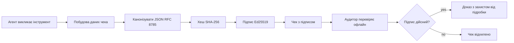
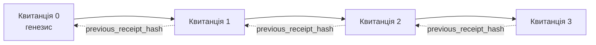

[Перегляньте відео уроку: Захист AI агентів за допомогою криптографічних квитанцій](https://youtu.be/PLACEHOLDER_VIDEO_ID)

> _(Відео уроку та мініатюру додасть команда контенту Microsoft після об'єднання, відповідно до шаблону уроку 14 / 15.)_

# Захист AI агентів за допомогою криптографічних квитанцій

## Вступ

У цьому уроці буде розглянуто:

- Чому аудитні сліди для AI агентів важливі для відповідності, відлагодження та довіри.
- Що таке криптографічна квитанція і чим вона відрізняється від підписаного логу.
- Як створити підписану квитанцію для виклику інструменту агента на чистому Python.
- Як перевірити квитанцію офлайн і виявити підробку.
- Як ланцюжити квитанції так, щоб видалення або зміна порядку порушували ланцюжок.
- Що квитанції доводять, а що відверто не доводять.

## Цілі навчання

Після завершення цього уроку ви знатимете, як:

- Визначити режими збоїв, що мотивують криптографічне підтвердження походження дій агента.
- Створити Ed25519-підписану квитанцію на канонічному JSON-повідомленні.
- Перевірити квитанцію самостійно, використовуючи лише публічний ключ підписувача.
- Виявити підробку, повторно виконавши перевірку зміненої квитанції.
- Побудувати послідовність квитанцій із геш-ланцюжком і пояснити, чому ланцюжок має значення.
- Розпізнати межу між тим, що квитанції доводять (атрибуцію, цілісність, порядок), та тим, що вони не доводять (коректність дії, правильність політики).

## Проблема: аудитний слід вашого агента

Уявіть, що ви розгорнули AI агента для Contoso Travel. Агент читає запити клієнтів, викликає API авіарейсів для пошуку варіантів і бронює місця від імені клієнта. Минулого кварталу агент обробив 50 000 бронювань.

Сьогодні приходить аудитор. Він ставить просте запитання: "Покажіть, що робив ваш агент."

Ви передаєте свої лог-файли. Аудитор дивиться на них і ставить складніше питання: "Як я можу знати, що ці логи не редагувалися?"

Це проблема аудитного сліду. Більшість розгортань агентів сьогодні покладаються на:

- **Логи додатків**: пишуться самим агентом, редагуються будь-ким із доступом до файлової системи.
- **Хмарні сервіси логування**: мають ознаки підробки на рівні платформи, але лише якщо аудитор довіряє оператору платформи.
- **Логи транзакцій бази даних**: добре підходять для змін у базі, але не для довільних викликів інструментів.

Жоден із цих варіантів не може відповісти аудиторській вимозі без необхідності довіри до когось (вас, вашого хмарного провайдера, постачальника бази даних). Для внутрішнього використання така довіра часто прийнятна. Для регульованих навантажень (фінанси, охорона здоров'я, все, що підпадає під EU AI Act) – ні.

Криптографічні квитанції вирішують це, роблячи кожну дію агента незалежно перевірною. Аудитору не потрібно довіряти вам. Йому потрібні лише ваш публічний ключ і сама квитанція.

## Що таке криптографічна квитанція?

Квитанція – це JSON-об’єкт, який записує, що зробив агент, підписаний цифровим підписом.


```mermaid
flowchart LR
    A[Агент викликає інструмент] --> B[Побудова даних чека]
    B --> C[Канонізувати JSON RFC 8785]
    C --> D[Хеш SHA-256]
    D --> E[Підпис Ed25519]
    E --> F[Чек з підписом]
    F --> G[Аудитор перевіряє офлайн]
    G --> H{Підпис дійсний?}
    H -- yes --> I[Доказ з захистом від підробки]
    H -- no --> J[Чек відхилено]
```

Мініальна квитанція виглядає так:

```json
{
  "type": "agent.tool_call.v1",
  "agent_id": "contoso-travel-bot",
  "tool_name": "lookup_flights",
  "tool_args_hash": "sha256:a3f9c1...",
  "result_hash": "sha256:7b2e1d...",
  "policy_id": "contoso-travel-policy-v3",
  "timestamp": "2026-04-25T14:30:00Z",
  "sequence": 47,
  "previous_receipt_hash": "sha256:9d4e6a...",
  "signature": {
    "alg": "EdDSA",
    "sig": "c5af83...",
    "public_key": "8f3b2c..."
  }
}
```

Три властивості виконують роботу:

1. **Підпис**. Квитанція підписана воротами агента за допомогою приватного ключа Ed25519. Будь-хто з відповідним публічним ключем може перевірити підпис офлайн. Підробка будь-якого поля робить підпис недійсним.

2. **Канонічне кодування**. Перед підписом квитанція послідовно серіалізується за схемою канонізації JSON (JCS, RFC 8785). Це гарантує, що дві реалізації, які генерують однаковий логічний вміст, видають ідентичний байтовий вихід. Без канонізації різні серіалізатори JSON створювали б різні підписи для однакового вмісту.

3. **Хеш-ланцюжок**. Поле `previous_receipt_hash` пов’язує кожну квитанцію з попередньою. Видалення або зміна порядку квитанції порушує кожну квитанцію, що йде після неї. Підробка стає видимою на рівні ланцюжка, навіть якщо окремі підписи були обійдені.

Разом ці властивості забезпечують три гарантії:

- **Атрибуція**: цей ключ підписав цей вміст.
- **Цілісність**: вміст не змінювався після підпису.
- **Порядок**: ця квитанція з’явилася після тієї у ланцюжку.

## Створення квитанції на Python

Для створення квитанції не потрібна спеціальна бібліотека. Криптографічні примітиви широко доступні, а логіка — це кілька десятків рядків Python.

Практичні вправи у `code_samples/18-signed-receipts.ipynb` покроково показують весь процес. Скорочена версія:

```python
import json
import hashlib
import base64
from nacl import signing
from jcs import canonicalize  # Канонічний JSON за RFC 8785

def b64url_nopad(data: bytes) -> str:
    return base64.urlsafe_b64encode(data).decode("ascii").rstrip("=")

def sha256_canonical(obj) -> str:
    """SHA-256 of a Python object's JCS-canonical JSON form."""
    return f"sha256:{hashlib.sha256(canonicalize(obj)).hexdigest()}"

# Згенерувати або завантажити ключ підпису (у виробництві зберігати в сховищі ключів)
signing_key = signing.SigningKey.generate()
verify_key = signing_key.verify_key

# Створити навантаження квитанції (ще без підпису)
tool_args = {"origin": "SYD", "destination": "LAX"}
tool_result = [{"flight": "QF11", "price": 1850, "stops": 0}]

payload = {
    "type": "agent.tool_call.v1",
    "agent_id": "contoso-travel-bot",
    "tool_name": "lookup_flights",
    "tool_args_hash": sha256_canonical(tool_args),
    "result_hash": sha256_canonical(tool_result),
    "policy_id": "contoso-travel-policy-v3",
    "timestamp": "2026-04-25T14:30:00Z",
    "sequence": 0,
    "previous_receipt_hash": None,
}

# Канонізувати, хешувати, підписати.
canonical_bytes = canonicalize(payload)
message_hash = hashlib.sha256(canonical_bytes).digest()
signature_bytes = signing_key.sign(message_hash).signature

# Додати структурований об'єкт підпису.
receipt = {
    **payload,
    "signature": {
        "alg": "EdDSA",
        "sig": b64url_nopad(signature_bytes),
        "public_key": b64url_nopad(bytes(verify_key)),
    },
}
```

Це вся конвеєрна схема підпису. Вправи в ноутбуці пояснюють кожен крок.

## Перевірка квитанції та виявлення підробки

Перевірка — це зворотна операція:

```python
import base64
import hashlib
from nacl import signing
from nacl.exceptions import BadSignatureError
from jcs import canonicalize

def b64url_decode(s: str) -> bytes:
    padding = "=" * ((4 - len(s) % 4) % 4)
    return base64.urlsafe_b64decode(s + padding)

def verify_receipt(receipt: dict) -> bool:
    # Підпис є структурованим об'єктом: {"alg", "sig", "public_key"}.
    sig_obj = receipt.get("signature")
    if not sig_obj or sig_obj.get("alg") != "EdDSA":
        return False

    # Відновіть корисне навантаження, яке фактично було підписано (усе, крім підпису).
    payload = {k: v for k, v in receipt.items() if k != "signature"}

    canonical_bytes = canonicalize(payload)
    message_hash = hashlib.sha256(canonical_bytes).digest()

    try:
        verify_key = signing.VerifyKey(b64url_decode(sig_obj["public_key"]))
        verify_key.verify(message_hash, b64url_decode(sig_obj["sig"]))
        return True
    except BadSignatureError:
        return False
```

Ця функція приймає квитанцію і повертає `True`, якщо підпис дійсний, і `False` – інакше. Без дзвінків в мережу, без залежності від сервісів, без довіри до третіх сторін.

Щоб побачити в дії виявлення підробки, ноутбук показує:

1. Створення дійсної квитанції та підтвердження її перевірки.
2. Зміну одного байта поля `tool_args_hash`.
3. Повторну перевірку і спостереження, як вона не проходить.

Це практичний доказ, що квитанції мають ознаки підробки: будь-яка, навіть найменша, зміна порушує підпис.

## Ланцюжок квитанцій для багатокрокових агентів

Одна підписана квитанція захищає одну дію. Ланцюжок квитанцій захищає послідовність.


```mermaid
flowchart LR
    R0[Квитанція 0<br/>генезис] --> R1[Квитанція 1]
    R1 --> R2[Квитанція 2]
    R2 --> R3[Квитанція 3]
    R1 -. previous_receipt_hash .-> R0
    R2 -. previous_receipt_hash .-> R1
    R3 -. previous_receipt_hash .-> R2
```

Кожна квитанція записує хеш попередньої. Щоб тихо видалити квитанцію 2, атакуючий повинен або:

- Змінити поле `previous_receipt_hash` у квитанції 3 (порушить підпис квитанції 3), АБО
- Підробити новий підпис для зміненої квитанції 3 (потрібен приватний ключ агента).

Якщо приватний ключ зберігається в апаратному сховищі ключів, а публічний ключ публікується з кожною квитанцією, жодна атака неможлива без виявлення.

Ноутбук показує:

1. Побудову ланцюжка з трьох квитанцій.
2. Перевірку, що `previous_receipt_hash` кожної квитанції відповідає реальному хешу попередньої.
3. Підробку однієї квитанції посередині та порушення ланцюжка в тій точці.

Так створюється аудитний слід, який зовнішній аудитор може перевірити без довіри до вас.

## Що доводять квитанції (і що ні)

Це найважливіша частина уроку. Квитанції потужні, але їхні можливості обмежені.

**Квитанції доводять три речі:**

1. **Атрибуція**: певний ключ підписав певне повідомлення.
2. **Цілісність**: повідомлення не змінювалось після підпису.
3. **Порядок**: ця квитанція йде після тієї у геш-ланцюжку.

**Квитанції НЕ доводять:**

1. **Коректність**: що дія агента була правильною. Квитанція може бути підписана і для неправильної відповіді так само акуратно, як і для правильної.
2. **Відповідність політиці**: що політика з `policy_id` дійсно була оцінена або що вона дозволила б цю дію, якщо б перевірялася. Квитанція фіксує, що було заявлено, а не що було виконано.
3. **Ідентичність поза ключем**: квитанція каже "цей ключ підписав цей вміст", але не каже "ця людина схвалила це". Зв’язок ключа з особою або організацією вимагає окремої інфраструктури ідентичності (словник, реєстр публічних ключів тощо).
4. **Правдивість вводів**: якщо агент отримує змінений запит і діє згідно з ним, квитанція точно фіксує дію. Квитанції наступні після перевірки введень, а не її заміна.

Ця межа важлива з двох причин:

- Вона показує, для чого квитанції корисні: робити поведінку агента аудитованою і помітною до підробок, навіть через організаційні кордони.
- Вона показує, які додаткові шари вам потрібні: перевірка введень (Урок 6), застосування політик (розглянуто нижче), ідентифікаційна інфраструктура (поза межами уроку).

Частою помилкою є думка, що "у нас є квитанції" означає "ми керовані". Це не так. Квитанції — це фундамент. Керування — це система, яку ви будуєте поверх.

## Посилання для продакшену

Python-код у цьому уроці навмисно мінімальний, щоб ви могли читати кожен рядок і розуміти, що відбувається. У продакшені у вас є два варіанти:

1. **Будувати безпосередньо на криптографічних примітивах.** 50 рядків коду, які ви бачили, достатньо для багатьох випадків. PyNaCl (Ed25519) і пакет `jcs` (канонічний JSON) — це добре підтримувані та перевірені бібліотеки.

2. **Використовувати бібліотеку квитанцій для продакшену.** Декілька open-source проектів реалізують ту ж схему з додатковими функціями (ротація ключів, пакетна перевірка, розповсюдження JWK Set, інтеграція з рушіями політик):
   - Формат квитанції в уроці базується на IETF Internet-Draft (`draft-farley-acta-signed-receipts`), який зараз проходить стандартизацію.
   - Microsoft Agent Governance Toolkit поєднує квитанції з рішеннями на базі Cedar; дивіться Приклад 33 у репозиторії для повного прикладу.
   - Пакети `protect-mcp` (npm) і `@veritasacta/verify` (npm) забезпечують реалізацію підпису і офлайн перевірки квитанцій на Node, для обгортання серверів MCP у тампер-евідентний аудитний слід.
   - **[nobulex](https://github.com/arian-gogani/nobulex)** Python SDK (`pip install nobulex`) реалізує ту ж схему Ed25519 + JCS у Python з інтеграціями LangChain і CrewAI, з опублікованими тестовими векторами та картою відповідності, внесеною через [OWASP PR #2210](https://github.com/OWASP/CheatSheetSeries/pull/2210).

Вибір між власною реалізацією і бібліотекою подібний до вибору між власною JWT-бібліотекою і перевіреною: обидва варіанти розумні; бібліотека економить час і зменшує площу аудиту; власна реалізація змушує розуміти кожну примітиву. Урок дає основу для обох шляхів.

## Перевірка знань

Перевірте своє розуміння перед практичною вправою.

**1. Квитанція підписана приватним ключем Ed25519 агента. Аудитор має лише публічний ключ. Чи може аудитор перевірити квитанцію офлайн?**

<details>
<summary>Відповідь</summary>

Так. Перевірка Ed25519 потребує лише публічного ключа і підписаних байтів. Жодних мережевих викликів, жодної залежності від сервісу. Це робить квитанції корисними в умовах відсутності мережі, для багатох організацій або з низьким рівнем довіри.
</details>

**2. Атакуючий змінює поле `policy_id` квитанції, щоб стверджувати, що її регулювала більш лояльна політика. Підпис було зроблено над оригіналом. Що станеться при перевірці?**

<details>
<summary>Відповідь</summary>

Перевірка не пройде. Підпис обчислено над канонічними байтами оригінального повідомлення; зміна будь-якого поля змінює канонічні байти, що змінює SHA-256 хеш, через що підпис стає недійсним. Атакуючому знадобився б приватний ключ для створення нового дійсного підпису, якого він не має.
</details>

**3. Чому квитанція містить `tool_args_hash` та `result_hash`, а не сирі аргументи та результат?**

<details>
<summary>Відповідь</summary>

Дві причини. По-перше, квитанцію можуть архівувати або передавати в середовищах, де витік сирого вмісту (ПІД, бізнес-дані) є проблемою. Хешування зберігає квитанцію лаконічною і дані приватними; аудитор підтверджує хеш із копією вмісту. По-друге, хеші мають фіксований розмір; квитанція з хешами обмежена у розмірі, незалежно від обсягу вхідних і вихідних даних.
</details>

**4. Поле `previous_receipt_hash` зв’язує кожну квитанцію з попередньою. Якщо атакуючий тихо видаляє одну квитанцію посередині ланцюжка, що стане недійсним?**

<details>
<summary>Відповідь</summary>

Кожна квитанція після видаленої. Їхні поля `previous_receipt_hash` більше не збігаються з актуальним ланцюжком (бо квитанції, на яку посилалися, більше нема або ланцюжок веде на іншого попередника). Щоб приховати видалення, атакуючому довелося б перепідписати кожну пізнішу квитанцію, що потребує приватного ключа.
</details>

**5. Квитанція пройшла перевірку коректно. Чи доводить це, що дія агента була правильною, обґрунтованою або відповідала політиці?**

<details>
<summary>Відповідь</summary>

Ні. Дійсна квитанція доводить три речі: атрибуцію (цей ключ підписав цей вміст), цілісність (вміст не змінено) та порядок (ця квитанція іде після тієї). Вона НЕ доводить, що дія була коректною, що політика з `policy_id` була фактично оцінена, чи що агент дотримувався всіх правил. Квитанції роблять поведінку агента аудитованою, але не обов’язково правильною. Це найважливіша межа в уроці.
</details>

## Практична вправа

Відкрийте `code_samples/18-signed-receipts.ipynb` і виконайте всі чотири розділи:

1. **Розділ 1**: Підпишіть вашу першу квитанцію і перевірте її.
2. **Розділ 2**: Підробіть квитанцію і спостерігайте, як перевірка не проходить.
3. **Розділ 3**: Побудуйте ланцюжок із трьох квитанцій і перевірте цілісність ланцюжка.
4. **Розділ 4**: Застосуйте цю схему до агента, збудованого з Microsoft Agent Framework: обгорніть виклик інструменту в підписування квитанції, потім перевірте квитанцію окремо.


**Завдання для розтягування 1:** розширте схему квитанції додатковим полем на ваш вибір (наприклад, ID запиту для відстеження), оновіть логіку канонічного підпису, щоб включити його, та підтвердіть, що квитанція все ще проходить перевірку. Потім змініть поле після підпису і підтвердіть, що перевірка не проходить. Це змушує вас зрозуміти, як кожен байт канонічного кодування впливає на підпис.

**Завдання для розтягування 2:** зашифруйте SHA-256 дві ваші квитанції разом (конкатенуйте їх канонічні байти в детермінованому порядку) та вбудуйте отриманий дайджест як нове поле в третю квитанцію перед її підписанням. Перевірте, що всі три квитанції все ще проходять перевірку. Ви щойно побудували доказ включення в один крок: будь-хто, хто має третю квитанцію, може довести, що перші дві існували на момент її підпису, не розкриваючи їх вміст. Це патерн, який використовується квитанціями вибіркового розкриття в масштабі (зобов’язання Меркле, RFC 6962).

## Висновок

Криптографічні квитанції дають AI-агентам аудиторський слід, який є:

- **Незалежно перевіряємим**: будь-хто з публічним ключем може перевірити, без залежності від сервісу.
- **Виявляє втручання**: будь-яка зміна робить підпис недійсним.
- **Портативний**: квитанція — це маленький JSON-файл; її можна архівувати, передавати та перевіряти будь-де.
- **Відповідає стандартам**: побудовано на Ed25519 (RFC 8032), JCS (RFC 8785) та SHA-256, усі широко впроваджені примітиви.

Вони не замінюють валідацію вхідних даних, застосування політик або інфраструктуру ідентичності. Вони є основою для цих рівнів. Коли ви розгортаєте агентів у регульованих робочих навантаженнях, у багатоустановчих робочих процесах або в будь-яких середовищах, де майбутній аудитор не може вам довіряти, квитанції дозволяють зробити аудиторський слід чесним.

Найголовніше: квитанції доводять, хто що сказав і коли. Вони не доводять, що сказане було правдою чи правильним. Чітко тримайте цю різницю. Це різниця між чесною системою походження і вводячою в оману.

## Контрольний список для продакшн

Коли ви готові перейти від цього уроку до розгортання агентів з підписаними квитанціями у реальному середовищі:

- [ ] **Перемістіть ключ підпису з ноутбука розробника.** Використовуйте Azure Key Vault, AWS KMS або апаратний модуль безпеки. Приватний ключ, що підписує ваші квитанції, ніколи не має міститись у системах керування вихідним кодом або у відкритому вигляді на машинах застосунку.
- [ ] **Опублікуйте публічний ключ для перевірки.** Аудиторам він потрібен для офлайн-перевірки. Стандартна практика — набір JWK за відомою URL-адресою (RFC 7517), наприклад, `https://your-org.example.com/.well-known/agent-keys.json`.
- [ ] **Анкоруйте ланцюг зовні.** Періодично записуйте хеш останньої голови ланцюга у лог прозорості (Sigstore Rekor, RFC 3161 timestamp authority або друга внутрішня система), щоб зовнішня сторона могла підтвердити "цей ланцюг існував у цей час."
- [ ] **Зберігайте квитанції незмінними.** Сховище, до якого можна лише додавати (Azure Storage з політиками незмінності, AWS S3 Object Lock), заважає інсайдеру переписувати історію на рівні зберігання.
- [ ] **Визначте політику зберігання.** Багато правил відповідності вимагають багаторічного зберігання. Плануйте зростання кількості квитанцій (кожна квитанція ~500 байт; агент, що робить 10 000 викликів на день, генерує ~1.8 ГБ на рік).
- [ ] **Документуйте, що квитанції не покривають.** Квитанції підтверджують атрибуцію, цілісність та порядок. Ваш регламент повинен явно перелічувати додаткові контролі (валідація вхідних даних, застосування політик, обмеження швидкості, інфраструктура ідентичності), які доповнюють квитанції у вашому режимі керування.

### Є ще питання щодо захисту AI-Агентів?

Приєднуйтесь до [Microsoft Foundry Discord](https://aka.ms/ai-agents/discord), щоб зустріти інших учнів, відвідати години консультацій та отримати відповіді на ваші питання про AI-Агентів.

## За межами цього уроку

Цей урок охоплює підписання однієї квитанції та послідовності з хеш-ланцюгом. Ті ж примітиви композиційно утворюють кілька більш просунутих патернів, з якими ви можете зіткнутися, коли ваш режим керування ускладнюється:

- **Вибіркове розкриття.** Коли поля квитанції незалежно зобов’язані (Merkle-дерево на зразок RFC 6962), ви можете розкривати конкретні поля певним аудиторам і доводити, що решта не змінена, не розкриваючи її. Корисно, коли одна квитанція має задовольнити і комплексний аудит (який хоче повноти), і правила мінімізації даних, як GDPR (які хочуть, щоб аудитор бачив якомога менше).
- **Відкликання квитанцій.** Якщо ключ підпису скомпрометовано, потрібен спосіб позначити всі квитанції, підписані цим ключем, як ненадійні з певного часу. Стандартні патерни: короткоживучі ключі підпису плюс опублікований список відкликань, або лог прозорості з записами відкликань.
- **Двозначні / розділені квитанції підпису.** Деякі реалізації розділяють підписаний вантаж на до-виконання (`authorization_*`) та після-виконання (`result_*`) половини з незалежними підписами, корисно, коли рішення про авторизацію та отриманий результат виконання створюються різними акторами чи у різний час. Це додатково накладається на формат квитанції, викладений у цьому уроці.
- **Композиція вантажу.** Квитанція запечатує ті байти, які ви поклали у `result_hash`. Реальні вантажі часто багатші, ніж результат одного виклику інструмента: передрішення (передбачення моделі, розглянуті варіанти, докази та їх повнота, ризики, ланцюг відповідальності, результат перевірки) можуть усі вміщуватися у вантаж, зацементований однією квитанцією. Це зберігає формат квитанції мінімальним, дозволяючи схемам вантажу еволюціонувати галузь за галуззю.
- **Відповідність між реалізаціями.** Кілька незалежних реалізацій одного формату квитанцій (Python, TypeScript, Rust, Go) крос-перевіряються за спільними тестовими векторами. Якщо ви створюєте власну реалізацію, валідація за опублікованими векторами підтверджує сумісність.
- **Перехід на постквантові алгоритми.** Ed25519 широко використовують сьогодні, проте він не стійкий до квантових атак. Формат квитанції алгоритмічно-гнучкий: поле `signature.alg` може містити `ML-DSA-65` (постквантовий стандарт підпису NIST), коли буде потрібно мігрувати. Плануйте період переходу, коли квитанції підписуються подвійно.

## Додаткові ресурси

- <a href="https://datatracker.ietf.org/doc/draft-farley-acta-signed-receipts/" target="_blank">IETF Internet-Draft: Signed Decision Receipts for Machine-to-Machine Access Control</a>
- <a href="https://learn.microsoft.com/azure/ai-studio/responsible-use-of-ai-overview" target="_blank">Огляд Відповідального використання AI (Azure AI)</a>
- <a href="https://datatracker.ietf.org/doc/html/rfc8032" target="_blank">RFC 8032: Цифровий підпис на кривій Едвардса (EdDSA)</a>
- <a href="https://datatracker.ietf.org/doc/html/rfc8785" target="_blank">RFC 8785: Схема канонізації JSON (JCS)</a>
- <a href="https://datatracker.ietf.org/doc/html/rfc6962" target="_blank">RFC 6962: Прозорість сертифікатів</a> (конструкція дерева Меркле, що використовується у квитанціях вибіркового розкриття)
- <a href="https://github.com/microsoft/agent-governance-toolkit/blob/main/docs/tutorials/33-offline-verifiable-receipts.md" target="_blank">Microsoft Agent Governance Toolkit, Tutorial 33: Offline-Verifiable Decision Receipts</a>
- <a href="https://github.com/ScopeBlind/agent-governance-testvectors" target="_blank">Тестові вектори для перевірки відповідності між реалізаціями</a> формату квитанцій, що використовується в цьому уроці (Apache-2.0)
- <a href="https://pynacl.readthedocs.io/" target="_blank">Документація PyNaCl</a> (Ed25519 у Python)

## Попередній урок

[Створення агентів використання комп’ютера (CUA)](../15-browser-use/README.md)

---

<!-- CO-OP TRANSLATOR DISCLAIMER START -->
**Відмова від відповідальності**:
Цей документ було перекладено за допомогою сервісу штучного інтелекту для перекладу [Co-op Translator](https://github.com/Azure/co-op-translator). Хоча ми прагнемо до точності, будь ласка, майте на увазі, що автоматичні переклади можуть містити помилки або неточності. Оригінальний документ рідною мовою слід вважати авторитетним джерелом. Для критично важливої інформації рекомендується професійний людський переклад. Ми не несемо відповідальності за будь-які непорозуміння або неправильні тлумачення, що виникли внаслідок використання цього перекладу.
<!-- CO-OP TRANSLATOR DISCLAIMER END -->