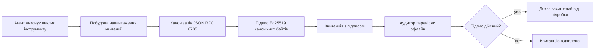
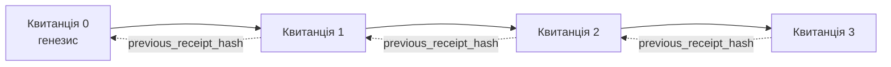

[Перегляньте відеоурок: Захист агентів ШІ криптографічними квитанціями](https://youtu.be/PLACEHOLDER_VIDEO_ID)

> _(Відео уроку та мініатюра будуть додані контент-командою Microsoft після мерджу, відповідно до шаблону уроків 14 / 15.)_

# Захист агентів ШІ з криптографічними квитанціями

## Вступ

У цьому уроці розглянемо:

- Чому важливі аудиторські сліди для агентів ШІ щодо відповідності, налагодження та довіри.
- Що таке криптографічна квитанція і чим вона відрізняється від несигнованого рядка логу.
- Як створити підписану квитанцію для виклику інструмента агента на чистому Python.
- Як перевірити квитанцію офлайн і виявити підміну.
- Як зв’язати квитанції так, щоб видалення чи змінення порядку однієї ланки порушувало ланцюжок.
- Що квитанції доводять і що вони явно не доводять.

## Цілі навчання

Після завершення уроку ви знатимете, як:

- Ідентифікувати режими збоїв, що мотивують криптографічне підтвердження походження дій агента.
- Створювати квитанцію із підписом Ed25519 над канонічним JSON-пейлоадом.
- Перевіряти квитанцію автономно з використанням лише публічного ключа підписувача.
- Виявляти підміну, повторно запускаючи перевірку зміненої квитанції.
- Створювати послідовність квитанцій із хеш-ланцюжком і пояснювати, чому ланцюг важливий.
- Розрізняти межу між тим, що квитанції доводять (атрибуція, цілісність, порядок), і тим, чого вони не доводять (коректність дії, обґрунтованість політики).

## Проблема: аудиторський слід вашого агента

Уявіть, що ви розгорнули агента ШІ для Contoso Travel. Агент читає запити клієнтів, виконує запити до API авіарейсів, щоб знайти варіанти, і бронює місця від імені клієнта. Торік агент опрацював 50 000 бронювань.

Сьогодні приходить аудитор. Він задає просте питання: «Покажіть, що робив ваш агент».

Ви передаєте файли журналів. Аудитор дивиться на них і ставить складніше питання: «Як я можу бути впевненим, що ці логи не редагувалися?»

Це і є проблема аудиторського сліду. Більшість розгортань агентів сьогодні спираються на:

- **Логи додатків**: записані самим агентом, редаговані будь-ким із доступом до файлової системи.
- **Хмарні служби логування**: мають захист від підміни на рівні платформи, але лише якщо аудитор довіряє оператору платформи.
- **Логи транзакцій бази даних**: добре підходять для змін у базі, але не для довільних викликів інструментів.

Жоден із цих способів не може відповісти на запитання аудитора, не вимагаючи довіри до когось (вас, вашого хмарного провайдера, вашого постачальника бази даних). Для внутрішнього використання така довіра часто прийнятна. Для регульованих робочих навантажень (фінанси, охорона здоров’я, будь-що під дією ЄС AI Act) — ні.

Криптографічні квитанції розв’язують це, роблячи кожну дію агента незалежно перевірною. Аудитору не потрібно довіряти вам. Потрібні лише ваш публічний ключ та сама квитанція.

## Що таке криптографічна квитанція?

Квитанція — це JSON-обʼєкт, який фіксує, що зробив агент, підписаний цифровим підписом.


```mermaid
flowchart LR
    A[Агент виконує виклик інструменту] --> B[Побудова навантаження квитанції]
    B --> C[Канонізація JSON RFC 8785]
    C --> E[Підпис Ed25519 канонічних байтів]
    E --> F[Квитанція з підписом]
    F --> G[Аудитор перевіряє офлайн]
    G --> H{Підпис дійсний?}
    H -- yes --> I[Доказ захищений від підробки]
    H -- no --> J[Квитанцію відхилено]
```

Мінімальна квитанція виглядає так:

```json
{
  "type": "agent.tool_call.v1",
  "agent_id": "contoso-travel-bot",
  "tool_name": "lookup_flights",
  "tool_args_hash": "sha256:a3f9c1...",
  "result_hash": "sha256:7b2e1d...",
  "policy_id": "contoso-travel-policy-v3",
  "timestamp": "2026-04-25T14:30:00Z",
  "sequence": 47,
  "previous_receipt_hash": "sha256:9d4e6a...",
  "signature": {
    "alg": "EdDSA",
    "sig": "c5af83...",
    "public_key": "8f3b2c..."
  }
}
```

Роботу виконують три властивості:

1. **Підпис**. Квитанція підписується шлюзом агента за допомогою приватного ключа Ed25519. Будь-хто з відповідним публічним ключем може перевірити підпис офлайн. Зміна будь-якого поля робить підпис недійсним.

2. **Канонічне кодування**. Перед підписанням квитанція серіалізується за схемою JSON Canonicalization Scheme (JCS, RFC 8785). Це гарантує, що дві реалізації, які створюють однакову логічну квитанцію, мають ідентичний байтовий вихід. Без канонізації різні JSON-серіалізатори створювали б різні підписи для однакового вмісту.

3. **Хеш-ланцюг**. Поле `previous_receipt_hash` пов’язує кожну квитанцію з попередньою. Видалення або перестановка квитанції порушує всі наступні. Підміна стає помітною на рівні ланцюга, навіть якщо окремі підписи обходять.

Разом ці властивості дають три гарантії:

- **Атрибуція**: цей ключ підписав цей вміст.
- **Цілісність**: вміст не змінювався з моменту підписання.
- **Порядок**: ця квитанція йде після тієї у ланцюжку.

## Створення квитанції на Python

Вам не потрібна спеціальна бібліотека для створення квитанції. Криптографічні примітиви широко доступні, а логіка займає кілька десятків рядків Python.

Практичні вправи в `code_samples/18-signed-receipts.ipynb` проходять весь процес. Коротко:

```python
import json
import hashlib
import base64
from nacl import signing
from jcs import canonicalize  # Канонічний JSON згідно з RFC 8785

def b64url_nopad(data: bytes) -> str:
    return base64.urlsafe_b64encode(data).decode("ascii").rstrip("=")

def sha256_canonical(obj) -> str:
    """SHA-256 of a Python object's JCS-canonical JSON form."""
    return f"sha256:{hashlib.sha256(canonicalize(obj)).hexdigest()}"

# Згенеруйте або завантажте ключ підпису (у продакшені зберігайте у сейфі ключів)
signing_key = signing.SigningKey.generate()
verify_key = signing_key.verify_key

# Побудуйте корисне навантаження квитанції (поки без підпису)
tool_args = {"origin": "SYD", "destination": "LAX"}
tool_result = [{"flight": "QF11", "price": 1850, "stops": 0}]

payload = {
    "type": "agent.tool_call.v1",
    "agent_id": "contoso-travel-bot",
    "tool_name": "lookup_flights",
    "tool_args_hash": sha256_canonical(tool_args),
    "result_hash": sha256_canonical(tool_result),
    "policy_id": "contoso-travel-policy-v3",
    "timestamp": "2026-04-25T14:30:00Z",
    "sequence": 0,
    "previous_receipt_hash": None,
}

# Канонізуйте і підпишіть байти JCS безпосередньо. PureEdDSA хешує внутрішньо.
canonical_bytes = canonicalize(payload)
signature_bytes = signing_key.sign(canonical_bytes).signature

# Додайте структурований об’єкт підпису.
receipt = {
    **payload,
    "signature": {
        "alg": "EdDSA",
        "sig": b64url_nopad(signature_bytes),
        "public_key": b64url_nopad(bytes(verify_key)),
    },
}
```

Це вся конвеєр підписання. Вправи в зошиті пояснюють кожен крок.

## Перевірка квитанції і виявлення підміни

Перевірка — це зворотна операція:

```python
import base64
import hashlib
from nacl import signing
from nacl.exceptions import BadSignatureError
from jcs import canonicalize

def b64url_decode(s: str) -> bytes:
    padding = "=" * ((4 - len(s) % 4) % 4)
    return base64.urlsafe_b64decode(s + padding)

def verify_receipt(receipt: dict) -> bool:
    # Підпис є структурованим об'єктом: {"alg", "sig", "public_key"}.
    sig_obj = receipt.get("signature")
    if not sig_obj or sig_obj.get("alg") != "EdDSA":
        return False

    # Відновити повідомлення, яке фактично було підписане (усе, крім підпису).
    payload = {k: v for k, v in receipt.items() if k != "signature"}

    canonical_bytes = canonicalize(payload)

    try:
        verify_key = signing.VerifyKey(b64url_decode(sig_obj["public_key"]))
        verify_key.verify(canonical_bytes, b64url_decode(sig_obj["sig"]))
        return True
    except BadSignatureError:
        return False
```

Ця функція приймає квитанцію і повертає `True`, якщо підпис дійсний, інакше `False`. Немає викликів у мережу, залежностей від сервісів, не потрібно довіряти третім сторонам.

Щоб побачити в дії виявлення підміни, у зошиті демонструють:

1. Створення дійсної квитанції і підтвердження її перевірки.
2. Зміну одного байта в полі `tool_args_hash`.
3. Повторну перевірку та отримання відмови.

Це практична демонстрація того, що квитанції помітно підміняють: будь-яка зміна, навіть найменша, робить підпис недійсним.

## Ланцюжок квитанцій для багатокрокових агентів

Одна підписана квитанція захищає одну дію. Ланцюжок квитанцій захищає послідовність.


```mermaid
flowchart LR
    R0[Квитанція 0<br/>генезис] --> R1[Квитанція 1]
    R1 --> R2[Квитанція 2]
    R2 --> R3[Квитанція 3]
    R1 -. previous_receipt_hash .-> R0
    R2 -. previous_receipt_hash .-> R1
    R3 -. previous_receipt_hash .-> R2
```

Кожна квитанція містить хеш попередньої. Щоб тихо видалити квитанцію 2, нападнику потрібно:

- Змінити поле `previous_receipt_hash` квитанції 3 (порушить підпис квитанції 3), АБО
- Сфальшувати новий підпис для зміненої квитанції 3 (потрібен приватний ключ агента).

Якщо приватний ключ зберігається у апаратному сховищі ключів, а ви публікуєте публічний ключ із кожною квитанцією, жоден із цих нападів неможливий без виявлення.

У зошиті показано:

1. Створення ланцюжка з трьох квитанцій.
2. Перевірка, що `previous_receipt_hash` кожної квитанції збігається з реальним хешем попередньої.
3. Підміна однієї квитанції посередині і прорив ланцюжка саме в тому місці.

Так ви створюєте аудиторський слід, який зовнішній аудитор може перевірити без довіри до вас.

## Що доводять квитанції (і що ні)

Це найважливіша частина уроку. Квитанції потужні, але їх сила обмежена.

**Квитанції доводять три речі:**

1. **Атрибуція**: конкретний ключ підписав конкретний пейлоад.
2. **Цілісність**: пейлоад не змінився з моменту підпису.
3. **Порядок**: ця квитанція йде після тої у хеш-ланцюгу.

**Квитанції НЕ доводять:**

1. **Коректність**: що дія агента була правильною. Квитанцію можна підписати як для правильної, так і для помилкової відповіді.
2. **Відповідність політиці**: що політика, вказана у `policy_id`, була фактично оцінена або що вона дозволила б цю дію, якби перевірялася. Квитанція фіксує, що було заявлено, а не що було застосовано.
3. **Особистість, крім ключа**: квитанція означає "цей ключ підписав цей вміст", але не "цю людину авторизували". Для пов’язання ключа з особою або організацією потрібна окрема інфраструктура ідентифікації (довідник, реєстр публічних ключів тощо).
4. **Правдивість вхідних даних**: якщо агент отримує змінений запит і діє на нього, квитанція вірно фіксує дію. Квитанції слідують за валідацією вхідних даних, не замінюють її.

Ця межа важлива з двох причин:

- Вона показує, для чого корисні квитанції: робити поведінку агента аудиторською та захищеною від підміни, навіть між організаціями.
- Вона показує, які додаткові шари вам ще потрібні: валідацію вхідних даних (Урок 6), примусове дотримання політик (коротко нижче) і інфраструктуру ідентифікації (поза межами цього уроку).

Поширена помилка — вважати, що «у нас є квитанції» означає «ми керуємося». Ні. Квитанції — це фундамент. Управління — це система, яку ви на ньому будуєте.

## Доказ, що людина схвалила конкретну дію

Пункт 3 вище вартий окремого розгляду: квитанція про дію каже "цей ключ підписав цей вміст", але ніколи не "людина авторизувала це". Для ризикових дій (повернення грошей, видалення, перекази) рамки управління все частіше вимагають саме такої відсутньої заяви, і вона можлива з використанням тих самих примітивів, створених у цьому уроці.

Наступний зошит `code_samples/human-authorization-receipts.ipynb` додає другий тип квитанції, `human.approval.v1`, у тому самому форматі, що й урокові квитанції (типізований пейлоад, підписаний Ed25519 над його канонічними JCS байтами, з обʼєктом `signature` поза підписаними байтами). Іменований схвалювач підписує **повну канонічну дію і її дайджест** до виконання; квитанція дії агента несе **той самий дайджест дії** і `parent_approval_ref`, `receipt_hash` схвалення, так само, як `previous_receipt_hash` у побудованому ланцюгу вище. Одна функція `verify_chain` перевіряє обидва артефакти під **окремими закріпленими реєстрами ключів** (ключі схвалювачів проти ключів агентів), таким чином код спільний, але авторитети ніколи не перетинаються.

Отримана властивість, сформульована точно: *людина схвалила цю точну дію, і агент виконав саме цю схвалену дію.* Механізми відмов у зошиті роблять цю властивість реальною, а не просто ствердженою:

- класичний набір: підміна, плутаний довірений, повтор, підроблені ключі з обох сторін, пошкоджений ввід;
- **старий авторитет**: підпис, що все ще перевіряється, але відхиляється, бо версія політики змінилася, ключ схвалювача виключено зі сховища, або схвалення втратило чинність до виконання;
- **підміна дайджесту**: дійсно підписана квитанція дії, що вказує на *реальне* схвалення, пов’язане з *іншою* канонічною дією.

Кожен збій повертає окрему причину, тому аудитор, читаючи відмову, може зрозуміти, чи авторитет застарів, чи дія змінилася. Правило зошита: підписане схвалення не є авторитетом саме по собі. Авторитет існує лише, якщо обидві квитанції зв’язані з тією самою канонічною дією в момент виконання. Квитанція про схвалення людиною — це освітня композиція, визначена цим уроком, а не тип квитанції з `draft-farley-acta-signed-receipts`.

## Посилання для виробництва

Код на Python у цьому уроці навмисно мінімальний, щоб ви могли прочитати кожний рядок і чітко зрозуміти, що відбувається. У виробництві у вас є два варіанти:

1. **Працювати безпосередньо з криптографічними примітивами.** Наведені вище 50 рядків достатньо для багатьох випадків. PyNaCl (Ed25519) і пакет `jcs` (канонічний JSON) — це добре підтримувані та аудиторські бібліотеки.

2. **Використовувати виробничу бібліотеку квитанцій.** Декілька відкритих проектів реалізують ту саму схему з додатковими функціями (ротація ключів, пакетна перевірка, розповсюдження наборів JWK, інтеграція з рушіями політик):
   - Конвеєр підписання використовує схеми JCS і область підпису згідно з незалежним IETF Internet-Draft ([`draft-farley-acta-signed-receipts`](https://datatracker.ietf.org/doc/draft-farley-acta-signed-receipts/), ревізія 02). Освітня плоска квитанція уроку відрізняється від `{payload, signature}` у драфті і не подається як відповідна імплементація. Драфт публікує спільний набір для тестування відповідності ([agent-governance-testvectors](https://github.com/ScopeBlind/agent-governance-testvectors)) для реалізацій, орієнтованих на його формат.
   - Microsoft Agent Governance Toolkit поєднує квитанції з рішеннями політик на основі Cedar; див. Навчальний посібник 33 у цьому репозиторії для прикладу скрізь-на-скрізь.
   - Пакети `protect-mcp` (npm) та `@veritasacta/verify` (npm) надають реалізацію підписання квитанцій та офлайн-перевірки на Node, призначені для обгортання серверів MCP із захищеним аудиторським слідом, включно з потоком утримання на співавторство, де призупинена дія випускає квитанцію схвалення, прив’язану до дайджесту дії (підтримка WebAuthn у десктопному потокові), та сама схема схвалення, що і в зошиті про авторизацію людини вище.
   - **[nobulex](https://github.com/arian-gogani/nobulex)** Python SDK (`pip install nobulex`) забезпечує ту саму схему підписання Ed25519 + JCS у Python із інтеграціями LangChain та CrewAI, включаючи опубліковані вектори тестування та аудиторської відповідності, внесені через [OWASP PR #2210](https://github.com/OWASP/CheatSheetSeries/pull/2210).

Вибір між написанням свого коду і використанням бібліотеки нагадує вибір між власною JWT-бібліотекою та перевіреною: обидва варіанти допустимі; бібліотека заощаджує час і зменшує площу аудиту; підхід з нуля змушує зрозуміти кожний примітив. Цей урок навчає шляху з нуля, щоб у вас була база для будь-якого вибору.

## Перевірка знань

Перевірте своє розуміння перед практичним завданням.

**1. Квитанція підписана приватним ключем Ed25519 агента. Аудитор має лише публічний ключ. Чи може аудитор перевірити квитанцію офлайн?**

<details>
<summary>Відповідь</summary>

Так. Верифікація Ed25519 потребує лише публічного ключа і підписаних байтів. Немає викликів у мережу, залежностей від сервісів. Це властивість робить квитанції корисними в ізольованих, мультиорганізаційних або низькодовірчих аудиторських налаштуваннях.
</details>

**2. Зловмисник змінює поле `policy_id` у квитанції, щоб стверджувати, що дія регулювалась більш ліберальною політикою. Підпис був над оригінальним пейлоадом. Що станеться під час перевірки?**

<details>
<summary>Відповідь</summary>


Перевірка не вдалася. Підпис був обчислений над канонічними байтами оригінального навантаження; зміна будь-якого поля змінює ці байти, що робить підпис недійсним. Зловмиснику потрібен приватний ключ для створення нового дійсного підпису, якого у нього немає.
</details>

**3. Чому у квитанції є `tool_args_hash` та `result_hash`, а не сирі аргументи та результат?**

<details>
<summary>Відповідь</summary>

Дві причини. По-перше, квитанція може потребувати архівації або передачі у середовищах, де розкриття сирого вмісту (ПІБ, бізнес-дані) є проблемою. Хешування зберігає квитанцію компактною та конфіденційною; аудитор перевіряє, що хеш відповідає окремо збереженій копії фактичного вмісту. По-друге, хеші мають фіксований розмір; квитанція з хешами обмежена у розмірі незалежно від розміру вхідних і вихідних даних.
</details>

**4. Поле `previous_receipt_hash` пов’язує кожну квитанцію з попередньою. Якщо зловмисник тихо видалить одну квитанцію посеред ланцюга, що стане недійсним?**

<details>
<summary>Відповідь</summary>

Кожна квитанція, що йде після видаленої. Їхні поля `previous_receipt_hash` більше не відповідають фактичному ланцюгу (бо квитанція, на яку вони посилались, більше не існує, або ланцюг тепер вказує на іншого попередника). Щоб приховати видалення, зловмиснику довелося б повторно підписати кожну наступну квитанцію, для чого потрібен приватний ключ.
</details>

**5. Квитанція проходить перевірку. Чи доводить це, що дія агента була правильною, обґрунтованою або відповідала політиці?**

<details>
<summary>Відповідь</summary>

Ні. Дійсна квитанція доводить три речі: авторство (цей ключ підписав цей вміст), цілісність (вміст не було змінено) і порядок (ця квитанція з’явилася після тієї квитанції). Вона НЕ доводить, що дія була правильною, що політика з `policy_id` була фактично оцінена або що агент дотримувався всіх правил. Квитанції роблять поведінку агента аудиторською, але не обов’язково правильною. Це найважливіша межа уроку.
</details>

## Практичне завдання

Відкрийте `code_samples/18-signed-receipts.ipynb` і виконайте всі чотири розділи:

1. **Розділ 1**: Підпишіть свою першу квитанцію та перевірте її.
2. **Розділ 2**: Маніпулюйте квитанцією та спостерігайте, як перевірка не вдалася.
3. **Розділ 3**: Побудуйте ланцюг з трьох квитанцій і перевірте цілісність ланцюга.
4. **Розділ 4**: Застосуйте шаблон до агента, створеного з Microsoft Agent Framework: обгорніть виклик інструменту у підписання квитанції, потім перевіряйте квитанцію незалежно.

**Розширене завдання 1:** розширте схему квитанції додатковим полем на свій вибір (наприклад, ідентифікатор запиту для трасування), оновіть логіку канонічного підпису для включення цього поля і підтвердіть, що квитанція все ще проходить перевірку. Потім змініть поле після підпису та підтвердіть, що перевірка не проходить. Це змушує вас зрозуміти, як кожен байт канонічного кодування впливає на підпис.

**Розширене завдання 2:** об'єднайте два своїх квитанції через SHA-256-хеш (конкатенуйте їх канонічні байти у детермінованому порядку) і вкладіть отриманий дайджест як нове поле в третю квитанцію перед її підписанням. Перевірте, що всі три квитанції все ще проходять перевірку. Ви щойно створили доказ включення в один крок: будь-хто, хто має третю квитанцію, може довести, що перші дві існували на момент її підписання, не розкриваючи їх вмісту. Це шаблон, який використовується в квитанціях з вибірковим розкриттям у великому масштабі (Merkle commitments, RFC 6962).

## Висновок

Криптографічні квитанції надають агентам ШІ аудиторський слід, який є:

- **Незалежно перевіряним**: будь-яка сторона з публічним ключем може перевірити без залежності від сервісу.
- **Захищеним від фальсифікацій**: будь-яка зміна робить підпис недійсним.
- **Портативним**: квитанція — це невеликий JSON-файл; його можна архівувати, передавати й перевіряти будь-де.
- **Відповідним стандартам**: побудовано на Ed25519 (RFC 8032), JCS (RFC 8785) та SHA-256, усіх широко використовуваних примітивах.

Вони не заміняють валідацію вводу, застосування політики чи інфраструктуру ідентифікації. Вони є основою для цих шарів. Коли ви розгортаєте агентів у регульованих робочих навантаженнях, багатозадачних робочих процесах кількох організацій або в будь-якому середовищі, де майбутній аудитор не може автоматично вам довіряти, квитанції — це спосіб зробити аудиторський слід чесним.

Найголовніше: квитанції доводять, хто що сказав і коли. Вони не доводять, що сказане було правдою чи правильним. Тримайте це розмежування чітко. Це різниця між чесною системою походження та такою, що вводить в оману.

## Контрольний список для продакшену

Коли будете готові перейти від цього уроку до розгортання агентів з підписаними квитанціями у реальному середовищі:

- [ ] **Перенесіть ключ підпису з ноутбука розробника.** Використовуйте Azure Key Vault, AWS KMS або апаратний модуль безпеки. Приватний ключ, що підписує ваші квитанції, ніколи не повинен зберігатися у системі контролю версій або у відкритому вигляді на серверах.
- [ ] **Опублікуйте публічний ключ для перевірки.** Аудиторам він потрібен для офлайн перевірки. Стандартний формат — набір JWK за відомою URL-адресою (RFC 7517), наприклад, `https://your-org.example.com/.well-known/agent-keys.json`.
- [ ] **Закріпіть ланцюг зовні.** Періодично записуйте хеш останньої голови ланцюга у логи прозорості (Sigstore Rekor, RFC 3161 timestamp authority або внутрішню систему), щоб зовнішній суб’єкт міг підтвердити «цей ланцюг існував на цей час».
- [ ] **Зберігайте квитанції незмінними.** Сховище типу append-only (Azure Storage з політиками незмінності, AWS S3 Object Lock) забороняє змінювати історію на рівні зберігання.
- [ ] **Визначте термін зберігання.** Багато вимог до відповідності потребують багаторічного зберігання. Плануйте зростання квитанцій (кожна ~500 байт; агент з 10 000 викликів щодня створює ~1,8 ГБ на рік).
- [ ] **Задокументуйте, що квитанції не охоплюють.** Квитанції доводять авторство, цілісність і порядок. Ваш робочий документ повинен явно перелічувати додаткові контролі (валідація вводу, виконання політики, обмеження частоти, інфраструктура ідентичності), які працюють поряд із квитанціями у вашій політиці управління.

### Є ще питання про безпеку агентів ШІ?

Приєднуйтесь до [Microsoft Foundry Discord](https://aka.ms/ai-agents/discord), щоб зустрітися з іншими учнями, відвідати години консультацій та отримати відповіді на питання щодо агентів ШІ.

## Поза межами цього уроку

Цей урок охоплює підписання однієї квитанції та послідовність з хеш-ланцюгом. Ті ж примітиви складають кілька більш складних шаблонів, з якими ви можете зіткнутися у міру розвитку вашої політики управління:

- **Вибіркове розкриття.** Коли поля квитанції незалежно закомічені (дерево Меркле в стилі RFC 6962), можна розкривати конкретні поля конкретним аудиторам і доводити, що решта не змінилася, не розкриваючи їх. Корисно, коли одна квитанція має задовольняти як всесторонню аудиторську перевірку (що хоче повноти), так і регуляції мінімізації даних, як GDPR (що хочуть, щоб аудитор бачив якомога менше).
- **Анулювання квитанцій.** Якщо ключ підпису скомпрометовано, потрібен спосіб позначити всі квитанції, підписані цим ключем, як недовірені з певного моменту. Стандартні підходи: короткоживучі ключі з публічним списком анулювання або журнал прозорості з записами анулювання.
- **Двобічні / розділені підписові квитанції.** Деякі реалізації розділяють підписану частину навантаження на передвиконавчу (`authorization_*`) і післявиконавчу (`result_*`) з незалежними підписами, корисне, коли рішення щодо авторизації та спостережуваний результат створюються різними акторами чи в різний час. Це додається до формату квитанції, викладеного в цьому уроці.
- **Композиція навантаження.** Квитанція запечатує всі байти, які ви поклали в `result_hash`. Реальні навантаження часто багатші за один результат виклику інструменту: передрішення (прогноз моделі, розглянуті опції, докази та їх повнота, ризиковий стан, ланцюжок відповідальності, результат пропуску) можуть жити всередині навантаження, запечатаного однією квитанцією. Це зберігає формат квитанції мінімальним і дозволяє схемам навантаження розвиватися по доменах.
- **Відповідність між реалізаціями.** Кілька незалежних реалізацій одного формату квитанцій (Python, TypeScript, Rust, Go) перевіряють одна одну за спільними тестовими векторами. Якщо ви створюєте власну реалізацію, перевірка за опублікованими векторами гарантує сумісність на дроті.
- **Міграція на постквантові алгоритми.** Ed25519 широко використовується сьогодні, але не є стійким до квантових атак. Формат квитанції алгоритмічно гнучкий: поле `signature.alg` може містити `ML-DSA-65` (стандарт постквантового підпису від NIST), коли потрібно мігрувати. Плануйте перехідний період з подвійним підписуванням квитанцій.

## Додаткові ресурси

- <a href="https://datatracker.ietf.org/doc/draft-farley-acta-signed-receipts/" target="_blank">IETF Internet-Draft: Signed Decision Receipts for Machine-to-Machine Access Control</a>
- <a href="https://learn.microsoft.com/azure/ai-studio/responsible-use-of-ai-overview" target="_blank">Огляд відповідального ШІ (Azure AI)</a>
- <a href="https://datatracker.ietf.org/doc/html/rfc8032" target="_blank">RFC 8032: Алгоритм цифрового підпису крива Едвардса (EdDSA)</a>
- <a href="https://datatracker.ietf.org/doc/html/rfc8785" target="_blank">RFC 8785: Схема канонізації JSON (JCS)</a>
- <a href="https://datatracker.ietf.org/doc/html/rfc6962" target="_blank">RFC 6962: Прозорість сертифікатів</a> (конструкція дерева Меркле, яка використовується у квитанціях з вибірковим розкриттям)
- <a href="https://github.com/microsoft/agent-governance-toolkit/blob/main/docs/tutorials/33-offline-verifiable-receipts.md" target="_blank">Microsoft Agent Governance Toolkit, Tutorial 33: Offline-Verifiable Decision Receipts</a>
- <a href="https://github.com/ScopeBlind/agent-governance-testvectors" target="_blank">Тестові вектори сумісності між реалізаціями</a> для формату квитанцій, використаного в цьому уроці (Apache-2.0)
- <a href="https://pynacl.readthedocs.io/" target="_blank">Документація PyNaCl</a> (Ed25519 у Python)

## Попередній урок

[Створення локальних агентів ШІ](../17-creating-local-ai-agents/README.md)

---

<!-- CO-OP TRANSLATOR DISCLAIMER START -->
**Відмова від відповідальності**:
Цей документ було перекладено за допомогою сервісу штучного інтелекту для перекладу [Co-op Translator](https://github.com/Azure/co-op-translator). Хоча ми прагнемо до точності, будь ласка, майте на увазі, що автоматичні переклади можуть містити помилки або неточності. Оригінальний документ рідною мовою слід вважати авторитетним джерелом. Для критично важливої інформації рекомендується професійний людський переклад. Ми не несемо відповідальності за будь-які непорозуміння або неправильні тлумачення, що виникли внаслідок використання цього перекладу.
<!-- CO-OP TRANSLATOR DISCLAIMER END -->