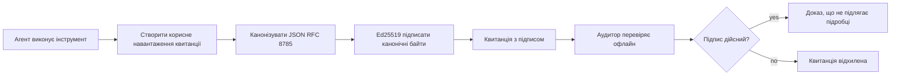
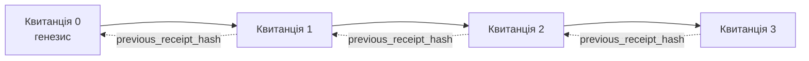

[Перегляньте відеоурок: Захист агентів ШІ за допомогою криптографічних квитанцій](https://youtu.be/PLACEHOLDER_VIDEO_ID)

> _(Відеоурок та мініатюра будуть додані командою Microsoft після об'єднання, відповідно до шаблону уроків 14 / 15.)_

# Захист агентів ШІ за допомогою криптографічних квитанцій

## Вступ

Цей урок охопить:

- Чому аудиторські сліди для агентів ШІ важливі для відповідності, відлагодження та довіри.
- Що таке криптографічна квитанція і чим вона відрізняється від незаписаного журналу.
- Як створити підписану квитанцію для виклику інструменту агента на звичайному Python.
- Як перевірити квитанцію офлайн та виявити підробку.
- Як зв’язати квитанції так, щоб видалення або перестановка однієї руйнували ланцюжок.
- Що квитанції доводять і що вони явно не доводять.

## Навчальні цілі

Після проходження цього уроку ви знатимете, як:

- Визначити режими збоїв, які мотивують криптографічне походження дій агента.
- Створити квитанцію з підписом Ed25519 над канонічним JSON-завантаженням.
- Перевірити квитанцію незалежно, використовуючи лише публічний ключ підписувача.
- Виявляти підробку, повторно запускаючи перевірку зміненої квитанції.
- Побудувати послідовність квитанцій із хеш-зчепленням і пояснити, чому ланцюжок важливий.
- Розрізняти межу між тим, що квитанції доводять (причетність, цілісність, порядок) та тим, що вони не доводять (коректність дії, обґрунтованість політики).

## Проблема: Аудиторський слід вашого агента

Уявіть, що ви розгорнули агента ШІ для Contoso Travel. Агент читає запити клієнтів, виконує виклики API для пошуку авіарейсів і бронює місця від імені клієнта. За останній квартал агент опрацював 50 000 бронювань.

Сьогодні приходить аудитор. Він ставить просте запитання: «Покажіть, що саме робив ваш агент».

Ви передаєте свої журнали. Аудитор дивиться їх і ставить складніше питання: «Як я можу бути впевнений, що ці журнали не редагувалися?»

Це проблема аудиторського сліду. Більшість сучасних розгортань агентів покладаються на:

- **Журнали застосунку**: записані самим агентом, їх може редагувати будь-хто, хто має доступ до файлової системи.
- **Хмарні служби журналювання**: захищені від підробки на рівні платформи, але лише якщо аудитор довіряє оператору платформи.
- **Журнали транзакцій бази даних**: добре підходять для змін у базі даних, але не для довільних викликів інструментів.

Жоден із цих способів не може відповісти на питання аудитора без того, щоб аудитор не довіряв комусь (вам, вашому хмарному провайдеру, постачальнику бази даних). Для внутрішнього використання така довіра часто прийнятна. Для регульованих навантажень (фінанси, охорона здоров’я, усе, підпорядковане Закону ЄС про ШІ) — ні.

Криптографічні квитанції вирішують цю проблему, роблячи кожну дію агента незалежно перевірною. Аудитору не потрібно довіряти вам. Потрібні лише ваш публічний ключ і сама квитанція.

## Що таке криптографічна квитанція?

Квитанція — це JSON-об'єкт, у якому зафіксовано, що агент зробив, підписаний цифровим підписом.


```mermaid
flowchart LR
    A[Агент виконує інструмент] --> B[Створити корисне навантаження квитанції]
    B --> C[Канонізувати JSON RFC 8785]
    C --> E[Ed25519 підписати канонічні байти]
    E --> F[Квитанція з підписом]
    F --> G[Аудитор перевіряє офлайн]
    G --> H{Підпис дійсний?}
    H -- yes --> I[Доказ, що не підлягає підробці]
    H -- no --> J[Квитанція відхилена]
```

Мінімальна квитанція виглядає так:

```json
{
  "type": "agent.tool_call.v1",
  "agent_id": "contoso-travel-bot",
  "tool_name": "lookup_flights",
  "tool_args_hash": "sha256:a3f9c1...",
  "result_hash": "sha256:7b2e1d...",
  "policy_id": "contoso-travel-policy-v3",
  "timestamp": "2026-04-25T14:30:00Z",
  "sequence": 47,
  "previous_receipt_hash": "sha256:9d4e6a...",
  "signature": {
    "alg": "EdDSA",
    "sig": "c5af83...",
    "public_key": "8f3b2c..."
  }
}
```

Три властивості виконують роботу:

1. **Підпис**. Квитанція підписується шлюзом агента за допомогою приватного ключа Ed25519. Будь-хто з відповідним публічним ключем може перевірити підпис офлайн. Будь-яка підробка в будь-якому полі робить підпис недійсним.

2. **Канонічне кодування**. Перед підписом квитанція серіалізується за допомогою JSON Canonicalization Scheme (JCS, RFC 8785). Це гарантує, що дві реалізації, які генерують одну й ту ж логічну квитанцію, видають байтово ідентичний вихід. Без канонізації різні серіалізатори JSON створювали б різні підписи на однаковому вмісті.

3. **Хеш-зчеплення**. Поле `previous_receipt_hash` пов’язує кожну квитанцію з попередньою. Видалення або перестановка квитанції порушить усі наступні квитанції. Підробка стає помітною на рівні ланцюжка, навіть якщо окремі підписи обійдено.

Разом ці властивості дають три гарантії:

- **Причетність**: цей ключ підписав цей вміст.
- **Цілісність**: вміст не змінився з моменту підпису.
- **Порядок**: ця квитанція йде після тієї у ланцюжку.

## Створення квитанції на Python

Для створення квитанції не потрібна спеціальна бібліотека. Криптографічні примітиви широко доступні, а логіка — усього кілька десятків рядків Python.

Практичні вправи в `code_samples/18-signed-receipts.ipynb` крок за кроком показують повний процес. Короткий виклад:

```python
import json
import hashlib
import base64
from nacl import signing
from jcs import canonicalize  # Канонічний JSON за RFC 8785

def b64url_nopad(data: bytes) -> str:
    return base64.urlsafe_b64encode(data).decode("ascii").rstrip("=")

def sha256_canonical(obj) -> str:
    """SHA-256 of a Python object's JCS-canonical JSON form."""
    return f"sha256:{hashlib.sha256(canonicalize(obj)).hexdigest()}"

# Генеруйте або завантажте ключ підпису (у продуктивному середовищі зберігайте в сховищі ключів)
signing_key = signing.SigningKey.generate()
verify_key = signing_key.verify_key

# Сформуйте вміст квитанції (поки без підпису)
tool_args = {"origin": "SYD", "destination": "LAX"}
tool_result = [{"flight": "QF11", "price": 1850, "stops": 0}]

payload = {
    "type": "agent.tool_call.v1",
    "agent_id": "contoso-travel-bot",
    "tool_name": "lookup_flights",
    "tool_args_hash": sha256_canonical(tool_args),
    "result_hash": sha256_canonical(tool_result),
    "policy_id": "contoso-travel-policy-v3",
    "timestamp": "2026-04-25T14:30:00Z",
    "sequence": 0,
    "previous_receipt_hash": None,
}

# Канонізуйте і підпишіть байти JCS безпосередньо. PureEdDSA хешує внутрішньо.
canonical_bytes = canonicalize(payload)
signature_bytes = signing_key.sign(canonical_bytes).signature

# Додайте структурований об'єкт підпису.
receipt = {
    **payload,
    "signature": {
        "alg": "EdDSA",
        "sig": b64url_nopad(signature_bytes),
        "public_key": b64url_nopad(bytes(verify_key)),
    },
}
```

Це повний конвеєр підписування. Вправи в зошиті детально пояснюють кожен крок.

## Перевірка квитанції та виявлення підробки

Перевірка — це обернена операція:

```python
import base64
import hashlib
from nacl import signing
from nacl.exceptions import BadSignatureError
from jcs import canonicalize

def b64url_decode(s: str) -> bytes:
    padding = "=" * ((4 - len(s) % 4) % 4)
    return base64.urlsafe_b64decode(s + padding)

def verify_receipt(receipt: dict) -> bool:
    # Підпис є структурованим об'єктом: {"alg", "sig", "public_key"}.
    sig_obj = receipt.get("signature")
    if not sig_obj or sig_obj.get("alg") != "EdDSA":
        return False

    # Відновити корисне навантаження, яке фактично було підписано (все, крім підпису).
    payload = {k: v for k, v in receipt.items() if k != "signature"}

    canonical_bytes = canonicalize(payload)

    try:
        verify_key = signing.VerifyKey(b64url_decode(sig_obj["public_key"]))
        verify_key.verify(canonical_bytes, b64url_decode(sig_obj["sig"]))
        return True
    except BadSignatureError:
        return False
```

Ця функція приймає квитанцію та повертає `True`, якщо підпис дійсний, і `False` в іншому випадку. Без мережевих викликів, без залежностей від сервісів, без довіри до третіх сторін.

Щоб побачити в дії виявлення підробок, зошит проходить через:

1. Створення дійсної квитанції та підтвердження її перевірки.
2. Зміну одного байта в полі `tool_args_hash`.
3. Повторну перевірку та спостереження невдачі.

Це практична демонстрація того, що квитанції захищені від підробки: будь-яка модифікація, якою б маленькою не була, порушує підпис.

## Ланцюжок квитанцій для багатокрокових агентів

Одна підписана квитанція захищає одну дію. Ланцюг квитанцій захищає послідовність.


```mermaid
flowchart LR
    R0[Квитанція 0<br/>генезис] --> R1[Квитанція 1]
    R1 --> R2[Квитанція 2]
    R2 --> R3[Квитанція 3]
    R1 -. previous_receipt_hash .-> R0
    R2 -. previous_receipt_hash .-> R1
    R3 -. previous_receipt_hash .-> R2
```

Кожна квитанція фіксує хеш попередньої. Щоб тихо видалити квитанцію 2, атакуючий повинен або:

- Змінити поле `previous_receipt_hash` у квитанції 3 (порушить підпис квитанції 3), АБО
- Підробити новий підпис для зміненої квитанції 3 (потрібен приватний ключ агента).

Якщо приватний ключ зберігається в апаратному сховищі, а публічний ключ публікується з кожною квитанцією, жодна з атак неможлива без виявлення.

Зошит проходить через:

1. Побудову ланцюжка з трьох квитанцій.
2. Перевірку, що поле `previous_receipt_hash` кожної квитанції збігається з фактичним хешем попередньої.
3. Підробку однієї квитанції посередині та спостереження розриву ланцюжка саме в цій точці.

Так ви створюєте аудиторський слід, який зовнішній аудитор може перевірити без довіри до вас.

## Що доводять квитанції (і що вони не доводять)

Це найважливіший розділ уроку. Квитанції потужні, але їх міць обмежена.

**Квитанції доводять три речі:**

1. **Причетність**: конкретний ключ підписав конкретний завантажений об'єкт.
2. **Цілісність**: завантаження не змінилося з моменту підпису.
3. **Порядок**: ця квитанція трапилася після тієї в хеш-ланцюжку.

**Квитанції НЕ доводять:**

1. **Коректність**: що дія агента була правильною. Квитанцію можна підписати і для неправильної відповіді так само чисто, як і для правильної.
2. **Відповідність політиці**: що політика, зазначена в `policy_id`, фактично була оцінена, або що вона дозволила б цю дію, якби її перевірили. Квитанція фіксує, що заявлено, а не що виконано.
3. **Ідентичність понад ключем**: квитанція каже «цей ключ підписав цей вміст», але не каже «цю людину авторизовано». Прив’язка ключа до людини чи організації вимагає окремої інфраструктури ідентичності (каталог, реєстр публічних ключів тощо).
4. **Правдивість вхідних даних**: якщо агент отримує маніпульований запит і діє за ним, квитанція відтворює дію точно. Квитанції залежні від валідації вхідних даних, але не є її заміною.

Ця межа важлива з двох причин:

- Вона показує, для чого корисні квитанції: роблять поведінку агента аудиторською та захищеною від підробки, навіть між організаційними межами.
- Вона показує, які додаткові шари ще потрібні: валідація введення (Урок 6), забезпечення політики (коротко розглянуто нижче) та інфраструктура ідентичності (поза межами цього уроку).

Поширена помилка — думати, що «ми маємо квитанції» означає «ми керовані». Це не так. Квитанції — це фундамент. Управління — це система, яку ви будуєте зверху.

## Доказ того, що людина підтвердила саме цю дію

Пункт 3 вартий окремого розділу: квитанція дії каже «цей ключ підписав цей вміст», але ніколи «людина авторизувала це». Для дій із високим ризиком (повернення коштів, видалення, банківські перекази) фреймворки управління все частіше вимагають саме такої відсутньої заяви, і це можна реалізувати тими ж примітивами, що ви вже побудували в цьому уроці.

Наступний зошит `code_samples/human-authorization-receipts.ipynb` додає другий тип квитанції, `human.approval.v1`, у тому ж форматі конверта, що й квитанції уроку (типізований завантажений об’єкт, підписаний Ed25519 поверх канонічних байтів JCS, з об’єктом `signature` поза підписаними байтами). Іменований схвалювач підписує **повну канонічну дію та її дайджест** перед виконанням; квитанція дії агента несе **той самий дайджест дії** і посилання `parent_approval_ref`, хеш квитанції схвалення, той самий конвенційний формат, що й `previous_receipt_hash` у ланцюзі вище. Одна функція `verify_chain` перевіряє обидва документи під різними реєстрами ключів (ключі схвалювачів проти ключів агентів), тому шлях коду спільний, але повноваження — ні.

Властивість, яку це дає, обережно сформульовано так: *людина схвалила саме цю дію, і агент виконав саме цю схвалену дію.* Ігнорування відмов у зошиті робить цю властивість реальною, а не просто заявленою:

- класичний набір: підробка, плутанина довіреної особи, повтори, підроблені ключі з будь-якого боку, неправильно сформоване введення;
- **застарілі повноваження**: підпис, який досі проходить перевірку, але відхиляється, бо версія політики змінилась, ключ схвалювача вилучено з реєстру, або схвалення втратило чинність перед виконанням;
- **заміна дайджесту**: дійсно підписана квитанція дії, що вказує на *реальне* схвалення, яке зв’язує *іншу* канонічну дію.

Кожен випадок відхиляється з чіткою причиною, тож аудитор, який читає відмову, може визначити, чи втратили повноваження чинність або чи дія змінилася. Правило, яке викладає зошит: підписане схвалення не є повноваженням само по собі. Повноваження існують, лише якщо обидві квитанції прив’язані до однієї канонічної дії в час виконання. Квитанція схвалення людиною — це освітній композит, визначений цим уроком, а не тип квитанції, визначений у `draft-farley-acta-signed-receipts`.

## Виробничі посилання

Python-код у цьому уроці навмисно мінімальний, щоб ви могли прочитати кожен рядок і точно зрозуміти, що відбувається. У виробництві у вас є два варіанти:

1. **Працювати безпосередньо з криптографічними примітивами.** 50 рядків, які ви бачили вище, достатньо для багатьох випадків використання. PyNaCl (Ed25519) і пакет `jcs` (канонічний JSON) — це добре підтримувані й перевірені бібліотеки.

2. **Використовувати виробничу бібліотеку квитанцій.** Кілька проєктів із відкритим кодом реалізують цей самий шаблон з додатковими функціями (ротація ключів, групова перевірка, розповсюдження JWK Set, інтеграція з політиками):
   - Конвеєр підпису використовує JCS та конвенції області підпису в незалежному IETF Internet-Draft ([`draft-farley-acta-signed-receipts`](https://datatracker.ietf.org/doc/draft-farley-acta-signed-receipts/), редакція 02). Освітня плоска квитанція цього уроку відрізняється від конверта `{payload, signature}` чорновика і не розглядається як сумісна реалізація. Чорновик публікує спільний набір тестів сумісності ([agent-governance-testvectors](https://github.com/ScopeBlind/agent-governance-testvectors)) для реалізацій, орієнтованих на його формат.
   - Microsoft Agent Governance Toolkit поєднує квитанції з рішеннями політики на основі Cedar; див. навчальний посібник 33 у репозиторії для прикладу від початку до кінця.
   - Пакети `protect-mcp` (npm) та `@veritasacta/verify` (npm) забезпечують реалізацію підписування квитанцій та офлайн-перевірку на Node, призначену для обгортання будь-якого MCP-сервера з аудиторським слідом, що захищений від підробки, включно із відкладеним для співавторства потоком, у якому призупинена дія видає квитанцію про схвалення, пов’язану з дайджестом дії (підтримується WebAuthn у настільному потоці), той самий шаблон квитанції схвалення людиною, що й у зошиті вище.
   - **[nobulex](https://github.com/arian-gogani/nobulex)** SDK для Python (`pip install nobulex`) надає той самий шаблон підпису Ed25519 + JCS у Python з інтеграціями LangChain і CrewAI, включно з опублікованими векторними тестами крос-валідації та картою відповідності, запропонованою через [OWASP PR #2210](https://github.com/OWASP/CheatSheetSeries/pull/2210).

Вибір між саморобною реалізацією та бібліотекою подібний до вибору між написанням власної JWT-бібліотеки і використанням перевіреної: обидва варіанти розумні; бібліотека економить час і зменшує площу аудиту; підхід із нуля змушує розуміти кожен примітив. Цей урок навчає робити з нуля, щоб у вас була основа для будь-якого вибору.

## Перевірка знань

Перевірте своє розуміння перед тим, як переходити до практичних вправ.

**1. Квитанція підписана приватним ключем Ed25519 агента. Аудитор має лише публічний ключ. Чи може аудитор перевірити квитанцію офлайн?**

<details>
<summary>Відповідь</summary>

Так. Перевірка Ed25519 вимагає лише публічного ключа та підписаних байтів. Без мережевих викликів, без залежності від сервісів. Це властивість, що робить квитанції корисними в умовах ізольованих мереж, міжорганізаційних аудиторських перевірок або довіри на низькому рівні.
</details>

**2. Атакувальник змінює поле `policy_id` квитанції, щоб стверджувати, що дія регулювалася більш дозволяючою політикою. Підпис було зроблено над оригінальним завантаженням. Що станеться під час перевірки?**

<details>
<summary>Відповідь</summary>


Перевірка не пройшла. Підпис було обчислено над канонічними байтами оригінального навантаження; зміна будь-якого поля змінює ці байти, що робить підпис недійсним. Зловмиснику потрібен приватний ключ, щоб створити новий дійсний підпис, якого у нього немає.
</details>

**3. Чому в квитанції є `tool_args_hash` і `result_hash`, а не необроблені аргументи й результат?**

<details>
<summary>Відповідь</summary>

Дві причини. По-перше, квитанцію може бути потрібно зберегти або передати в середовищах, де витік сирого вмісту (ПІІ, бізнес-дані) є проблемою. Хешування зберігає квитанцію компактною і вміст конфіденційним; аудитор перевіряє, що хеш відповідає окремо збереженій копії реального вмісту. По-друге, хеші мають фіксований розмір; квитанція з хешами має обмежений розмір незалежно від того, наскільки великими були вхідні та вихідні дані.
</details>

**4. Поле `previous_receipt_hash` пов’язує кожну квитанцію з її попередником. Якщо зловмисник безшумно видалить одну квитанцію з середини ланцюжка, що стане недійсним?**

<details>
<summary>Відповідь</summary>

Кожна квитанція, що йде після видаленої. Їхні поля `previous_receipt_hash` більше не відповідають реальному ланцюжку (бо квитанція, на яку вони посилалися, більше не існує, або ланцюжок тепер вказує на іншого попередника). Щоб приховати видалення, зловмиснику довелося б перепідписати кожну пізнішу квитанцію, що вимагає приватного ключа.
</details>

**5. Квитанція проходить перевірку успішно. Чи доводить це, що дія агента була правильною, коректною або відповідала політиці?**

<details>
<summary>Відповідь</summary>

Ні. Дійсна квитанція доводить три речі: атрибуцію (цей ключ підписав цей вміст), цілісність (вміст не змінено) і порядок (ця квитанція йде після тієї). Вона НЕ доводить, що дія була правильною, що політику в `policy_id` справді оцінено, або що агент дотримувався всіх правил. Квитанції роблять поведінку агента аудиторською, а не обов’язково правильною. Це найважливіша межа уроку.
</details>

## Практична вправа

Відкрийте `code_samples/18-signed-receipts.ipynb` і виконайте всі чотири розділи:

1. **Розділ 1**: Підпишіть вашу першу квитанцію й перевірте її.
2. **Розділ 2**: Змініть квитанцію і спостерігайте, як перевірка не проходить.
3. **Розділ 3**: Побудуйте ланцюжок із трьох квитанцій і перевірте цілісність ланцюга.
4. **Розділ 4**: Застосуйте патерн до агента, створеного з Microsoft Agent Framework: обгорніть виклик інструменту в підписування квитанції, потім перевірте квитанцію окремо.

**Додаткове випробування 1:** розширте схему квитанції власним додатковим полем (наприклад, ідентифікатор запиту для трасування), оновіть канонічну логіку підписування для його включення, і підтвердіть, що квитанція все ще проходить перевірку. Потім змініть поле після підписування і підтвердіть, що перевірка не проходить. Це змусить вас зрозуміти, як кожен байт канонічного кодування впливає на підпис.

**Додаткове випробування 2:** виконайте SHA-256-хеш двох ваших квитанцій разом (конкатенуючи їхні канонічні байти у визначеному порядку) і вставте отриманий дайджест як нове поле в третю квитанцію перед підписуванням. Перевірте, що всі три квитанції все ще проходять перевірку. Ви щойно побудували доказ включення за один крок: кожен, хто має третю квитанцію, може довести, що перші дві існували на момент підписання, не розкриваючи їхній вміст. Це патерн, який застосовують квитанції вибіркового розкриття у масштабі (Merkle-зобов’язання, RFC 6962).

## Висновок

Криптографічні квитанції дають агентам ШІ аудиторський слід, який є:

- **Незалежно перевірним**: будь-хто з публічним ключем може перевірити, без залежності від сервісу.
- **Захищеним від підробки**: будь-яка зміна робить підпис недійсним.
- **Портативним**: квитанція — це невеликий JSON-файл; її можна зберігати, передавати та перевіряти будь-де.
- **Відповідним стандартам**: побудовано на Ed25519 (RFC 8032), JCS (RFC 8785) та SHA-256, всі широко використовувані примітиви.

Вони не замінюють перевірку вхідних даних, застосування політик чи інфраструктуру ідентичності. Вони — фундамент для цих рівнів. Коли ви розгортатимете агентів у регульованих робочих навантаженнях, багаторганізаційних робочих процесах чи будь-якому середовищі, де не можна автоматично припускати довіру майбутньому аудитору, квитанції роблять аудиторський слід чесним.

Найважливіший урок: квитанції доводять, хто, що і коли сказав. Вони не доводять, що те, що сказано — правда або правильне. Тримайте цю різницю чітко. Це різниця між чесною системою походження і оманливою.

## Перелік перевірки для виробництва

Коли будете готові перейти від цього уроку до розгортання агентів із підписами квитанцій у реальному середовищі:

- [ ] **Перемістіть ключ підписування з ноутбука розробника.** Використовуйте Azure Key Vault, AWS KMS або модуль безпеки апаратний. Приватний ключ, що підписує ваші квитанції, не повинен ніколи зберігатися у системах контролю версій або в відкритому вигляді на машинах додатків.
- [ ] **Опублікуйте публічний ключ для перевірки.** Аудиторам він потрібен для офлайн-перевірки. Стандартний патерн — набір JWK у відомому URL (RFC 7517), наприклад, `https://your-org.example.com/.well-known/agent-keys.json`.
- [ ] **Закріпіть ланцюжок зовні.** Періодично записуйте хеш останньої голови ланцюжка у журнал прозорості (Sigstore Rekor, RFC 3161 timestamp authority або другий внутрішній сервіс), щоб зовнішня сторона могла підтвердити "цей ланцюжок існував на той час."
- [ ] **Зберігайте квитанції незмінними.** Сховище з режимом додавання тільки (Azure Storage з політикою незмінності, AWS S3 Object Lock) запобігає переписанню історії усередині сховища.
- [ ] **Визначте терміни зберігання.** Багато режимів відповідності вимагають багаторічного зберігання. Плануйте зростання обсягу квитанцій (кожна квитанція близько 500 байтів; агент, що робить 10 тис. викликів на день, виробляє близько 1.8 ГБ на рік).
- [ ] **Задокументуйте, що квитанції не охоплюють.** Квитанції доводять атрибуцію, цілісність і порядок. Ваш робочий процес має чітко перелічувати, які додаткові контролі (перевірка вхідних даних, застосування політик, обмеження швидкості, інфраструктура ідентичності) працюють разом із квитанціями у вашій системі управління.

### Маєте додаткові питання про безпеку агентів ШІ?

Приєднуйтесь до [Microsoft Foundry Discord](https://aka.ms/ai-agents/discord), щоб зустріти інших учнів, відвідати години консультацій та отримати відповіді на ваші питання про агентів ШІ.

## Поза межами цього уроку

Цей урок охоплює одиночне підписування квитанцій і ланцюжки з хешами. Ті самі примітиви формують кілька більш складних патернів, з якими ви можете зіткнутися, коли ваша система управління дозріватиме:

- **Вибіркове розкриття.** Коли поля квитанції незалежно зафіксовані (Merkle-дерево за стилем RFC 6962), ви можете розкривати окремі поля окремим аудиторам і доводити незмінність інших без розкриття їхнього вмісту. Корисно, коли одна квитанція має задовольняти і комплексний аудит (який хоче повноти), і регуляції мінімізації даних, як GDPR (які хочуть, щоб аудитор бачив якнайменше).
- **Відкликання квитанції.** Якщо ключ підписування скомпрометовано, потрібно мати спосіб позначати всі квитанції, підписані цим ключем, як ненадійні з певного часу. Стандартні патерни: короткоживучі ключі підписування плюс опублікований список відкликань або журнал прозорості з записами відкликань.
- **Двосторонні / розділені підписи квитанцій.** Деякі реалізації розділяють підписаний навантаження на передвиконавчу частину (`authorization_*`) і поствиконавчу (`result_*`) з незалежними підписами, що корисно, коли рішення про авторизацію і отриманий результат виробляються різними учасниками або в різний час. Це додається поверх формату квитанції, викладеного у цьому уроці.
- **Композиція навантаження.** Квитанція опечатує байти, які ви кладете у `result_hash`. Реальні навантаження часто багатші за результат одного виклику інструменту: передрішення (прогноз моделі, розглянуті варіанти, докази і їх повнота, ризикова позиція, ланцюжок відповідальності, результати воротів) можуть міститися у навантаженні, опечатаному однією квитанцією. Це зберігає мінімалістський формат квитанції, водночас дозволяючи еволюцію схем навантаження домен за доменом.
- **Відповідність між реалізаціями.** Декілька незалежних реалізацій того самого формату квитанції (Python, TypeScript, Rust, Go) перевіряють одна одну за спільними тестовими векторами. Якщо ви створюєте власну реалізацію, валідація за публічними векторами підтверджує сумісність по вайру.
- **Міграція післяквантової криптографії.** Ed25519 широко використовується сьогодні, але не є стійким до квантових атак. Формат квитанції є алгоритмічно гнучким: поле `signature.alg` може містити `ML-DSA-65` (стандарт підпису NIST післяквантового періоду) для міграції. Плануйте перехідний період із подвійним підписуванням квитанцій.

## Додаткові ресурси

- <a href="https://datatracker.ietf.org/doc/draft-farley-acta-signed-receipts/" target="_blank">IETF Internet-Draft: Signed Decision Receipts for Machine-to-Machine Access Control</a>
- <a href="https://learn.microsoft.com/azure/ai-studio/responsible-use-of-ai-overview" target="_blank">Огляд відповідального використання ШІ (Azure AI)</a>
- <a href="https://datatracker.ietf.org/doc/html/rfc8032" target="_blank">RFC 8032: Алгоритм цифрового підпису на еліптичних кривих Едвардса (EdDSA)</a>
- <a href="https://datatracker.ietf.org/doc/html/rfc8785" target="_blank">RFC 8785: Схема канонізації JSON (JCS)</a>
- <a href="https://datatracker.ietf.org/doc/html/rfc6962" target="_blank">RFC 6962: Прозорість сертифікатів</a> (конструкція Merkle-дерева, що використовується в квитанціях вибіркового розкриття)
- <a href="https://github.com/microsoft/agent-governance-toolkit/blob/main/docs/tutorials/33-offline-verifiable-receipts.md" target="_blank">Microsoft Agent Governance Toolkit, підручник 33: Офлайн-перевірні квитанції про рішення</a>
- <a href="https://github.com/ScopeBlind/agent-governance-testvectors" target="_blank">Тестові вектори для перевірки відповідності реалізацій</a> формату квитанції, що використовується в цьому уроці (Apache-2.0)
- <a href="https://pynacl.readthedocs.io/" target="_blank">Документація PyNaCl</a> (Ed25519 у Python)

## Попередній урок

[Створення локальних агентів ШІ](../17-creating-local-ai-agents/README.md)

---

<!-- CO-OP TRANSLATOR DISCLAIMER START -->
**Відмова від відповідальності**:
Цей документ було перекладено за допомогою сервісу штучного інтелекту для перекладу [Co-op Translator](https://github.com/Azure/co-op-translator). Хоча ми прагнемо до точності, будь ласка, майте на увазі, що автоматичні переклади можуть містити помилки або неточності. Оригінальний документ рідною мовою слід вважати авторитетним джерелом. Для критично важливої інформації рекомендується професійний людський переклад. Ми не несемо відповідальності за будь-які непорозуміння або неправильні тлумачення, що виникли внаслідок використання цього перекладу.
<!-- CO-OP TRANSLATOR DISCLAIMER END -->