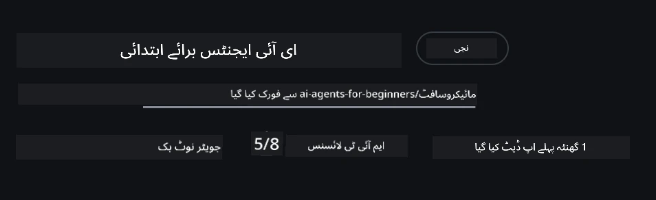

# کورس سیٹ اپ

## تعارف

یہ سبق اس کورس کے کوڈ کے نمونوں کو چلانے کا طریقہ سکھائے گا۔

## دوسرے سیکھنے والوں سے شامل ہوں اور مدد حاصل کریں

اپنا ریپو کلون کرنے سے پہلے، کسی بھی سیٹ اپ کی مدد، کورس کے بارے میں سوالات، یا دوسرے سیکھنے والوں سے رابطہ کرنے کے لئے [AI Agents For Beginners Discord چینل](https://aka.ms/ai-agents/discord) میں شامل ہوں۔

## اس ریپو کو کلون یا فورک کریں

شروع کرنے کے لیے، براہ کرم گٹ ہب ریپوزیٹری کو کلون یا فورک کریں۔ اس سے آپ کے پاس کورس میٹریل کا اپنا ورژن ہو گا تاکہ آپ کوڈ کو چلائیں، ٹیسٹ کریں، اور تبدیل کریں!

یہ کام <a href="https://github.com/microsoft/ai-agents-for-beginners/fork" target="_blank">ریپو کو فورک کرنے کے لیے</a> لنک پر کلک کرکے کیا جا سکتا ہے۔

اب آپ کے پاس اس کورس کا اپنا فورک کیا ہوا ورژن درج ذیل لنک پر ہونا چاہیے:



### شالو کلون (ورکشاپ / Codespaces کے لیے تجویز کردہ)

  >جب آپ مکمل ہسٹری اور تمام فائلز ڈاؤن لوڈ کرتے ہیں تو مکمل ریپوزیٹری بڑی (~3 GB) ہو سکتی ہے۔ اگر آپ صرف ورکشاپ میں شرکت کر رہے ہیں یا صرف چند سبق فولڈرز کی ضرورت ہے، تو شالو کلون (یا اسپارس کلون) زیادہ تر ڈاؤن لوڈ سے بچتا ہے کیونکہ یہ ہسٹری کو مختصر کرتا ہے اور/یا بلیبز کو چھوڑ دیتا ہے۔

#### فوری شالو کلون — کم از کم ہسٹری، تمام فائلز

نیچے دیے گئے کمانڈز میں `<your-username>` کو اپنے فورک URL (یا اپ اسٹریم URL اگر آپ چاہیں) سے بدلیں۔

صرف تازہ ترین کمیٹ ہسٹری کلون کرنے کے لیے (چھوٹا ڈاؤن لوڈ):

```bash|powershell
git clone --depth 1 https://github.com/<your-username>/ai-agents-for-beginners.git
```

کسی خاص برانچ کو کلون کرنے کے لیے:

```bash|powershell
git clone --depth 1 --branch <branch-name> https://github.com/<your-username>/ai-agents-for-beginners.git
```

#### جزوی (اسپارس) کلون — کم از کم بلوپس + صرف منتخب فولڈرز

یہ جزوی کلون اور اسپارس چیک آؤٹ کا استعمال کرتا ہے (گٹ 2.25+ درکار ہے اور جدید گٹ جس میں جزوی کلون کی حمایت ہے تجویز کی جاتی ہے):

```bash|powershell
git clone --depth 1 --filter=blob:none --sparse https://github.com/<your-username>/ai-agents-for-beginners.git
```

ریپو فولڈر میں چلیں:

```bash|powershell
cd ai-agents-for-beginners
```

پھر بتائیں کہ آپ کون سے فولڈرز چاہتے ہیں (نیچے کی مثال دو فولڈرز دکھاتی ہے):

```bash|powershell
git sparse-checkout set 00-course-setup 01-intro-to-ai-agents
```

کلون کرنے اور فائلز کو تصدیق کرنے کے بعد، اگر آپ کو صرف فائلز کی ضرورت ہے اور جگہ آزاد کرنا چاہتے ہیں (کوئی گٹ ہسٹری نہیں)، تو براہ کرم ریپوزیٹری میٹا ڈیٹا حذف کریں (💀 ناقابل واپسی — آپ گٹ کی تمام فعالیت کھو دیں گے: کوئی کمیٹس، پولز، پوشز، یا ہسٹری کی رسائی نہیں)۔

```bash
# زی-ایس-ایچ/بش
rm -rf .git
```

```powershell
# پاورشیل
Remove-Item -Recurse -Force .git
```

#### گٹ ہب کوڈسپیسز کا استعمال (لوکل بڑے ڈاؤن لوڈز سے بچنے کے لیے تجویز کردہ)

- اس ریپو کے لیے [GitHub UI](https://github.com/codespaces) کے ذریعے نیا کوڈسپیس بنائیں۔  

- نئے بنائے گئے کوڈسپیس کے ٹرمینل میں، اوپر دیے گئے شالو/اسپارس کلون کمانڈز میں سے ایک چلائیں تاکہ صرف آپ کو ضرورت والے سبق فولڈرز کو کوڈسپیس ورک اسپیس میں لایا جا سکے۔
- اختیاری: کوڈسپیسز میں کلون کرنے کے بعد، اضافی جگہ واپس لینے کے لئے .git کو ہٹا دیں (اوپر دیے گئے ہٹانے کے کمانڈز دیکھیں)۔
- نوٹ: اگر آپ کوڈسپیسز میں ریپو کو براہ راست کھولنا چاہتے ہیں (اضافی کلون کے بغیر)، تو غور کریں کہ کوڈسپیسز ڈیو کنٹینر ماحول تیار کرے گا اور ممکنہ طور پر آپ کی ضرورت سے زیادہ چیزیں فراہم کرے گا۔ تازہ کوڈسپیس میں شالو کاپی کلون کرنے سے آپ کو ڈسک کے استعمال پر زیادہ کنٹرول ملتا ہے۔

#### تجاویز

- اگر آپ ترمیم/کمیٹ کرنا چاہتے ہیں تو کلون URL کو ہمیشہ اپنے فورک سے بدلیں۔
- اگر آپ بعد میں مزید ہسٹری یا فائلز کی ضرورت ہو، تو آپ انہیں فیچ کر سکتے ہیں یا اسپارس چیک آؤٹ کو مزید فولڈرز شامل کرنے کی صورت میں ایڈجسٹ کر سکتے ہیں۔

## کوڈ چلانا

اس کورس میں جیوپیٹر نوٹ بکس کی ایک سیریز دی گئی ہے جسے آپ چلائیں گے تا کہ AI ایجنٹس بنانے کا عملی تجربہ حاصل کریں۔

کوڈ کے نمونے **Microsoft Agent Framework (MAF)** کا استعمال کرتے ہیں جس میں `AzureAIProjectAgentProvider` شامل ہے، جو **Azure AI Agent Service V2** (Responses API) سے **Microsoft Foundry** کے ذریعے رابطہ کرتا ہے۔

تمام پائتھن نوٹ بکس کا لیبل `*-python-agent-framework.ipynb` ہے۔

## ضروریات

- Python 3.12+
  - **نوٹ**: اگر آپ کے پاس Python3.12 انسٹال نہیں ہے، تو اسے انسٹال کریں۔ پھر اپنے venv کو python3.12 کے ساتھ بنائیں تاکہ `requirements.txt` فائل سے درست ورژنز انسٹال ہوں۔
  
    >مثال

    Python venv ڈائریکٹری بنائیں:

    ```bash|powershell
    python -m venv venv
    ```

    پھر venv ماحول کو چالو کریں:

    ```bash
    # زش/بش
    source venv/bin/activate
    ```
  
    ```dos
    # Command Prompt for Windows
    venv\Scripts\activate
    ```

- .NET 10+: .NET استعمال کرنے والے نمونے کے کوڈز کے لیے، یقینی بنائیں کہ آپ نے [.NET 10 SDK](https://dotnet.microsoft.com/download/dotnet/10.0) یا اس سے جدید ورژن انسٹال کیا ہے۔ پھر اپنے انسٹال شدہ .NET SDK ورژن کو چیک کریں:

    ```bash|powershell
    dotnet --list-sdks
    ```

- **Azure CLI** — تصدیق کے لیے درکار۔ [aka.ms/installazurecli](https://aka.ms/installazurecli) سے انسٹال کریں۔
- **Azure Subscription** — Microsoft Foundry اور Azure AI Agent Service تک رسائی کے لیے۔
- **Microsoft Foundry Project** — ایک پراجیکٹ جس میں ایک تعینات ماڈل ہے (جیسے `gpt-4o`)۔ نیچے [Step 1](../../../00-course-setup) دیکھیں۔

ہم نے اس ریپوزیٹری کی روٹ میں `requirements.txt` فائل شامل کی ہے جس میں تمام درکار پائتھن پیکجز موجود ہیں تاکہ کوڈ نمونے چل سکیں۔

آپ انہیں ریپوزیٹری کی روٹ میں اپنے ٹرمینل سے درج ذیل کمانڈ چلا کر انسٹال کر سکتے ہیں:

```bash|powershell
pip install -r requirements.txt
```

ہم کسی تنازع یا مسائل سے بچنے کے لیے پائتھن ورچوئل اینوائرنمنٹ بنانے کی سفارش کرتے ہیں۔

## وی ایس کوڈ کو سیٹ اپ کریں

یقینی بنائیں کہ آپ VSCode میں صحیح ورژن کا پائتھن استعمال کر رہے ہیں۔


## Microsoft Foundry اور Azure AI Agent Service سیٹ اپ کریں

### مرحلہ 1: Microsoft Foundry پروجیکٹ بنائیں

آپ کو Azure AI Foundry کا **ہب** اور **پروجیکٹ** درکار ہے جس میں تعینات ماڈل ہو تاکہ نوٹ بکس چل سکیں۔

1. [ai.azure.com](https://ai.azure.com) پر جائیں اور اپنے Azure اکاؤنٹ سے سائن ان کریں۔
2. ایک **ہب** بنائیں (یا موجودہ استعمال کریں)۔ دیکھیں: [Hub resources overview](https://learn.microsoft.com/azure/ai-foundry/concepts/ai-resources)۔
3. ہب کے اندر ایک **پروجیکٹ** بنائیں۔
4. **Models + Endpoints** → **Deploy model** سے ایک ماڈل (مثلاً `gpt-4o`) تعینات کریں۔

### مرحلہ 2: اپنے پروجیکٹ اینڈ پوائنٹ اور ماڈل کی تعیناتی کا نام حاصل کریں

Microsoft Foundry پورٹل میں اپنے پروجیکٹ سے:

- **Project Endpoint** — **Overview** صفحے پر جائیں اور اینڈ پوائنٹ URL کو کاپی کریں۔


- **Model Deployment Name** — **Models + Endpoints** میں جائیں، اپنے تعینات ماڈل کو منتخب کریں، اور **Deployment name** نوٹ کریں (مثلاً `gpt-4o`)۔

### مرحلہ 3: `az login` کے ذریعے Azure میں سائن ان کریں

تمام نوٹ بکس کے لیے تصدیق کے لیے **`AzureCliCredential`** استعمال ہوتا ہے — کوئی API کیز مینیج کرنے کی ضرورت نہیں۔ اس کے لیے ضروری ہے کہ آپ Azure CLI کے ذریعے سائن ان ہوں۔

1. اگر آپ نے پہلے سے Azure CLI انسٹال نہیں کیا تو انسٹال کریں: [aka.ms/installazurecli](https://aka.ms/installazurecli)

2. سائن ان کے لیے یہ کمانڈ چلائیں:

    ```bash|powershell
    az login
    ```

    یا اگر آپ ریموٹ/کوڈسپیس ماحول میں ہیں جہاں براؤزر نہیں ہے:

    ```bash|powershell
    az login --use-device-code
    ```

3. اگر پوچھا جائے تو اپنی سبسکرپشن منتخب کریں — وہ سبسکرپشن جس میں آپ کا Foundry پروجیکٹ ہے۔

4. تصدیق کریں کہ آپ سائن ان ہیں:

    ```bash|powershell
    az account show
    ```

> **کیوں `az login`؟** نوٹ بکس `azure-identity` پیکج کے ذریعے `AzureCliCredential` کا استعمال کرتے ہیں۔ اس کا مطلب ہے کہ آپ کا Azure CLI سیشن اسناد فراہم کرتا ہے — `.env` فائل میں کوئی API کی یا سیکریٹ نہیں۔ یہ [سیکیورٹی کی بہترین مشق](https://learn.microsoft.com/azure/developer/ai/keyless-connections) ہے۔

### مرحلہ 4: اپنی `.env` فائل بنائیں

مثال فائل کو کاپی کریں:

```bash
# زی ش / باش
cp .env.example .env
```

```powershell
# پاور شیل
Copy-Item .env.example .env
```

`.env` کھولیں اور یہ دو ویلیوز پُر کریں:

```env
AZURE_AI_PROJECT_ENDPOINT=https://<your-project>.services.ai.azure.com/api/projects/<your-project-id>
AZURE_AI_MODEL_DEPLOYMENT_NAME=gpt-4o
```

| متغیر | کہاں سے حاصل کریں |
|----------|-----------------|
| `AZURE_AI_PROJECT_ENDPOINT` | Foundry پورٹل → اپنا پروجیکٹ → **Overview** صفحہ |
| `AZURE_AI_MODEL_DEPLOYMENT_NAME` | Foundry پورٹل → **Models + Endpoints** → اپنے تعینات ماڈل کا نام |

زیادہ تر اسباق کے لیے بس یہی کافی ہے! نوٹ بکس خود بخود آپ کے `az login` سیشن کے ذریعے تصدیق کرتے ہیں۔

### مرحلہ 5: پائتھن کی dependencies انسٹال کریں

```bash|powershell
pip install -r requirements.txt
```

ہم سفارش کرتے ہیں کہ یہ کمانڈ آپ کے بنائے ہوئے ورچوئل اینوائرنمنٹ میں چلائیں۔

## سبق 5 (Agentic RAG) کی اضافی سیٹ اپ

سبق 5 **Azure AI Search** کو retrieval-augmented generation کے لیے استعمال کرتا ہے۔ اگر آپ یہ سبق چلانے کا ارادہ رکھتے ہیں، تو اپنی `.env` فائل میں یہ ویریبلز شامل کریں:

| متغیر | کہاں سے حاصل کریں |
|----------|-----------------|
| `AZURE_SEARCH_SERVICE_ENDPOINT` | Azure پورٹل → اپنا **Azure AI Search** ریسورس → **Overview** → URL |
| `AZURE_SEARCH_API_KEY` | Azure پورٹل → اپنا **Azure AI Search** ریسورس → **Settings** → **Keys** → پرائمری ایڈمن کی |

## سبق 6 اور سبق 8 (GitHub Models) کی اضافی سیٹ اپ

سبق 6 اور 8 میں کچھ نوٹ بکس **GitHub Models** کا استعمال کرتے ہیں بجائے Azure AI Foundry کے۔ اگر آپ یہ نمونے چلانے جا رہے ہیں تو اپنی `.env` فائل میں یہ ویریبلز شامل کریں:

| متغیر | کہاں سے حاصل کریں |
|----------|-----------------|
| `GITHUB_TOKEN` | GitHub → **Settings** → **Developer settings** → **Personal access tokens** |
| `GITHUB_ENDPOINT` | `https://models.inference.ai.azure.com` استعمال کریں (ڈیفالٹ ویلیو) |
| `GITHUB_MODEL_ID` | استعمال کے لیے ماڈل کا نام (مثلاً `gpt-4o-mini`) |

## سبق 8 (Bing Grounding Workflow) کی اضافی سیٹ اپ

سبق 8 کی conditional workflow نوٹ بک **Bing grounding** Azure AI Foundry کے ذریعے استعمال کرتی ہے۔ اگر آپ یہ نمونہ چلانے جا رہے ہیں، تو اپنی `.env` فائل میں یہ ویریبل شامل کریں:

| متغیر | کہاں سے حاصل کریں |
|----------|-----------------|
| `BING_CONNECTION_ID` | Azure AI Foundry پورٹل → اپنا پروجیکٹ → **Management** → **Connected resources** → اپنا Bing کنکشن → کنکشن ID کاپی کریں |

## مسائل کا حل

### macOS پر SSL سرٹیفکیٹ ویریفیکیشن کی غلطیاں

اگر آپ macOS پر ہیں اور اس طرح کی غلطی آتی ہے:

```plaintext
ssl.SSLCertVerificationError: [SSL: CERTIFICATE_VERIFY_FAILED] certificate verify failed: self-signed certificate in certificate chain
```

یہ Python کے macOS پر ایک معروف مسئلہ ہے جہاں سسٹم کے SSL سرٹیفکیٹس خود بخود معتبر نہیں سمجھے جاتے۔ ان حلوں کو ترتیب وار آزمایں:

**اختيار 1: Python کا Install Certificates اسکرپٹ چلائیں (تجویز کردہ)**

```bash
# اپنے نصب کردہ پائتھن ورژن (مثلاً 3.12 یا 3.13) کے ساتھ 3.XX کو تبدیل کریں:
/Applications/Python\ 3.XX/Install\ Certificates.command
```

**اختيار 2: نوٹ بک میں `connection_verify=False` استعمال کریں (صرف GitHub Models نوٹ بکس کے لیے)**

سبق 6 کی نوٹ بک (`06-building-trustworthy-agents/code_samples/06-system-message-framework.ipynb`) میں پہلے سے ایک تبصرہ شدہ حل شامل ہے۔ کلائنٹ بنانے میں `connection_verify=False` کو ان کومینٹ کریں:

```python
client = ChatCompletionsClient(
    endpoint=endpoint,
    credential=AzureKeyCredential(token),
    connection_verify=False,  # اگر آپ کو سرٹیفکیٹ کی خرابیوں کا سامنا ہو تو SSL کی تصدیق کو غیر فعال کریں
)
```

> **⚠️ انتباہ:** SSL ویریفیکیشن کو نااہل کرنا (`connection_verify=False`) سیکیورٹی کو کم کرتا ہے کیونکہ سرٹیفکیٹ کی تصدیق نہیں ہوتی۔ اس کو صرف ترقیاتی ماحول میں عارضی طور پر استعمال کریں، پیداوار میں کبھی نہیں۔

**اختيار 3: `truststore` انسٹال اور استعمال کریں**

```bash
pip install truststore
```

پھر نیٹ ورک کالز سے پہلے اپنے نوٹ بک یا اسکرپٹ کے شروع میں درج ذیل شامل کریں:

```python
import truststore
truststore.inject_into_ssl()
```

## کہیں رکے ہوئے ہیں؟

اگر آپ کو اس سیٹ اپ کو چلانے میں کوئی مسئلہ ہو، تو ہمارے <a href="https://discord.gg/kzRShWzttr" target="_blank">Azure AI Community Discord</a> میں شامل ہوں یا <a href="https://github.com/microsoft/ai-agents-for-beginners/issues?WT.mc_id=academic-105485-koreyst" target="_blank">مسئلہ رپورٹ کریں</a>۔

## اگلا سبق

اب آپ اس کورس کا کوڈ چلانے کے لیے تیار ہیں۔ AI Agents کی دنیا کے بارے میں مزید سیکھنے کا لطف اٹھائیں! 

[AI Agents اور ایجنٹ کے استعمال کے مقدمات کا تعارف](../01-intro-to-ai-agents/README.md)

---

<!-- CO-OP TRANSLATOR DISCLAIMER START -->
**دستخطی دستبرداری**:
یہ دستاویز AI ترجمہ سروس [Co-op Translator](https://github.com/Azure/co-op-translator) کے ذریعے ترجمہ کی گئی ہے۔ اگرچہ ہم درستگی کے لیے کوشاں ہیں، براہ کرم اس بات سے آگاہ رہیں کہ خودکار ترجمے میں غلطیاں یا عدم صحیح معلومات ہو سکتی ہیں۔ اصل دستاویز اپنی مادری زبان میں ہی مستند ماخذ سمجھی جائے۔ اہم معلومات کے لیے پیشہ ور انسانی ترجمہ کی سفارش کی جاتی ہے۔ ہم اس ترجمے کے استعمال سے پیدا ہونے والی کسی بھی غلط فہمی یا غلط تشریح کے ذمہ دار نہیں ہیں۔
<!-- CO-OP TRANSLATOR DISCLAIMER END -->