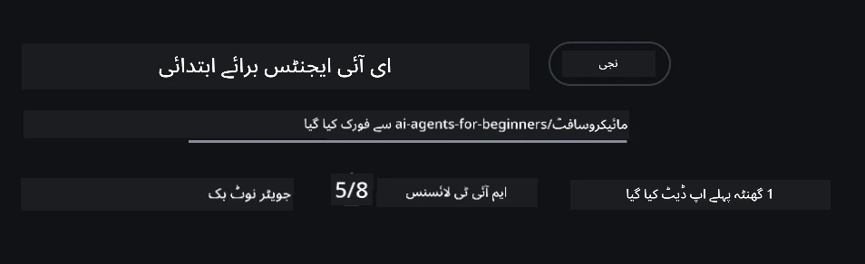
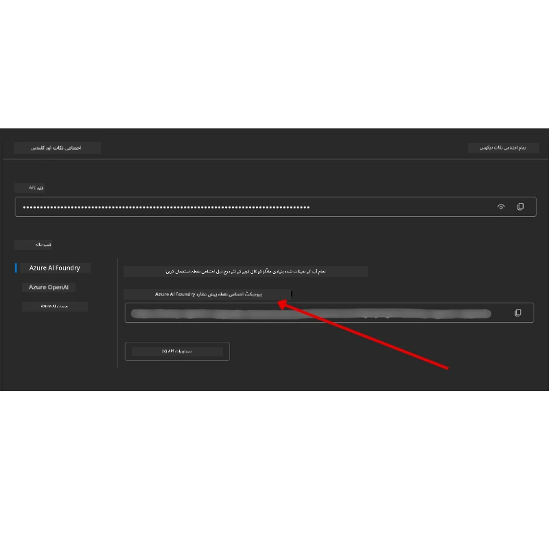

# کورس سیٹ اپ  

## تعارف  

یہ سبق اس بات کا احاطہ کرے گا کہ اس کورس کے کوڈ نمونوں کو کیسے چلایا جائے۔  

## دیگر سیکھنے والوں میں شامل ہوں اور مدد حاصل کریں  

اپنے ریپو کو کلون کرنے سے پہلے، [AI Agents For Beginners Discord چینل](https://aka.ms/ai-agents/discord) میں شامل ہوں تاکہ سیٹ اپ میں مدد، کورس کے بارے میں سوالات، یا دیگر سیکھنے والوں سے رابطہ حاصل کیا جا سکے۔  

## اس ریپو کو کلون یا فورک کریں  

شروع کرنے کے لیے، براہ کرم گٹ ہب ریپوزٹری کو کلون یا فورک کریں۔ اس سے آپ کے پاس کورس کے مواد کا اپنا ورژن ہوگا تاکہ آپ کوڈ کو چلا سکیں، ٹیسٹ کر سکیں، اور تبدیل کر سکیں!  

یہ <a href="https://github.com/microsoft/ai-agents-for-beginners/fork" target="_blank">ریپو کو فورک کرنے</a> کے لنک پر کلک کرکے کیا جا سکتا ہے۔  

اب آپ کے پاس اس کورس کا اپنا فورک شدہ ورژن درج ذیل لنک پر ہونا چاہیے:  

  

### شیللو کلون (ورکشاپ / کوڈ اسپیسز کے لیے تجویز کردہ)  

  >مکمل ریپوزٹری بڑی ہو سکتی ہے (~3 GB) جب آپ مکمل تاریخ اور تمام فائلیں ڈاؤن لوڈ کرتے ہیں۔ اگر آپ صرف ورکشاپ میں شرکت کر رہے ہیں یا چند سبق فولڈرز کی ضرورت ہے، تو شیللو کلون (یا اسپارس کلون) بہت کم ڈاونلوڈ کرتا ہے۔  

#### فوری شیللو کلون — کم از کم تاریخ، تمام فائلیں  

نیچے دیے گئے کمانڈز میں `<your-username>` کو اپنے فورک URL سے (یا پوسٹ اپ URL اگر آپ چاہیں) تبدیل کریں۔  

صرف تازہ ترین کمیٹ ہسٹری کلون کرنے کے لیے (چھوٹا ڈاؤنلوڈ):  

```bash
git clone --depth 1 https://github.com/<your-username>/ai-agents-for-beginners.git
```
  
مخصوص برانچ کلون کرنے کے لیے:  

```bash
git clone --depth 1 --branch <branch-name> https://github.com/<your-username>/ai-agents-for-beginners.git
```
  
#### جزوی (اسپارس) کلون — کم از کم بلب + صرف منتخب فولڈرز  

یہ جزوی کلون اور اسپارس چیک آؤٹ استعمال کرتا ہے (گیٹ 2.25+ درکار ہے اور جزوی کلون سپورٹ کے ساتھ جدید گیٹ تجویز کی گئی ہے):  

```bash
git clone --depth 1 --filter=blob:none --sparse https://github.com/<your-username>/ai-agents-for-beginners.git
```
  
ریپو فولڈر میں جائیں:  

```bash
cd ai-agents-for-beginners
```
  
پھر بتائیں کہ آپ کون سے فولڈرز چاہتے ہیں (نیچے کی مثال میں دو فولڈرز دکھائے گئے ہیں):  

```bash
git sparse-checkout set 00-course-setup 01-intro-to-ai-agents
```
  
کلون کرنے اور فائلز کی تصدیق کے بعد، اگر آپ کو صرف فائلز چاہیے اور جگہ خالی کرنی ہے (کوئی گٹ ہسٹری نہیں)، براہ کرم ریپوزٹری میٹاڈیٹا کو حذف کریں (💀 ناقابل واپسی — آپ تمام گٹ فنکشنلٹی کھو دیں گے):  

```bash
# زی ایس ایچ/باش
rm -rf .git
```
  
```powershell
# پاورشل
Remove-Item -Recurse -Force .git
```
  
#### گٹ ہب کوڈ اسپیسز کا استعمال (مقامی بڑے ڈاؤنلوڈ سے بچنے کے لیے تجویز کردہ)  

- اس ریپو کے لیے [GitHub UI](https://github.com/codespaces) کے ذریعے نیا کوڈ اسپیس بنائیں۔  

- نئے بنے ہوئے کوڈ اسپیس کے ٹرمینل میں، اوپر دیئے گئے شیللو/سپارس کلون کمانڈز میں سے کوئی ایک چلائیں تاکہ آپ کو صرف وہی سبق فولڈرز کوڈ اسپیس ورک اسپیس میں ملیں جو آپ کو چاہیے۔  
- اختیاری: کوڈ اسپیس کے اندر کلون کرنے کے بعد اضافی جگہ حاصل کرنے کے لیے .git کو ہٹا دیں (اوپر ہٹانے کے کمانڈز دیکھیں)۔  
- نوٹ: اگر آپ ریپو کو براہ راست کوڈ اسپیسز میں کھولنا چاہتے ہیں (اضافی کلون کے بغیر)، تو جان لیں کہ کوڈ اسپیسز ڈیولپمنٹ کنٹینر ماحول تیار کرے گا اور ممکن ہے آپ کو ضرورت سے زیادہ چیزیں مہیا کرے۔  

#### تجاویز  

- ہمیشہ کلون URL کو اپنے فورک سے تبدیل کریں اگر آپ ترمیم/کمیٹ کرنا چاہتے ہیں۔  
- اگر بعد میں آپ کو مزید ہسٹری یا فائلز کی ضرورت ہو، تو آپ انہیں حاصل کر سکتے ہیں یا اسپارس چیک آؤٹ کو مزید فولڈرز شامل کرنے کے لیے ایڈجسٹ کر سکتے ہیں۔  

## کوڈ چلانا  

یہ کورس جیوپیٹر نوٹ بکس کا سلسلہ پیش کرتا ہے جنہیں آپ چلائیں تاکہ AI ایجنٹس بنانے کا عملی تجربہ حاصل ہو۔  

کوڈ نمونے **Microsoft Agent Framework (MAF)** استعمال کرتے ہیں `FoundryChatClient` کے ساتھ، جو **Microsoft Foundry Agent Service V2** (Responses API) کے ذریعے **Microsoft Foundry** سے جڑتا ہے۔  

تمام پائتھن نوٹ بکس `*-python-agent-framework.ipynb` کے لیبل سے نشان زد ہیں۔  

## ضروریات  

- پائتھن 3.12+  
  - **نوٹ**: اگر آپ کے پاس Python3.12 انسٹال نہیں ہے تو اسے یقینی بنائیں۔ پھر اپنے وینو کو python3.12 سے بنائیں تاکہ requirements.txt فائل سے صحیح ورژنز انسٹال ہوں۔  
  
    >مثال  

    پائتھن وینو ڈائریکٹری بنائیں:  

    ```bash
    python -m venv venv
    ```
  
    پھر وینو ماحول کو فعال کریں:  

    ```bash
    # زی ش / باش
    source venv/bin/activate
    ```
  
    ```dos
    # Command Prompt for Windows
    venv\Scripts\activate
    ```
  
- .NET 10+: .NET کے لیے، یقین دہانی کریں کہ آپ نے [.NET 10 SDK](https://dotnet.microsoft.com/download/dotnet/10.0) یا اس سے نئی ورژن انسٹال کر رکھی ہے۔ پھر اپنے انسٹال شدہ .NET SDK ورژن کو چیک کریں:  

    ```bash
    dotnet --list-sdks
    ```
  
- **Azure CLI** — تصدیق کے لیے ضروری۔ انسٹال کریں [aka.ms/installazurecli](https://aka.ms/installazurecli) سے۔  
- **Azure سبسکرپشن** — Microsoft Foundry اور Microsoft Foundry Agent Service تک رسائی کے لیے۔  
- **Microsoft Foundry پروجیکٹ** — ایک پروجیکٹ جس میں تعینات ماڈل ہو (جیسے `gpt-5-mini`)۔ دیکھیں [Step 1](#مرحلہ-1-microsoft-foundry-پروجیکٹ-بنائیں) نیچے۔  

ہم نے اس ریپوزٹری کی روٹ میں `requirements.txt` فائل شامل کی ہے، جو کوڈ نمونوں کو چلانے کے لیے تمام ضروری پائتھن پیکجز رکھتی ہے۔  

آپ انہیں ٹرمینل میں درج ذیل کمانڈ چلا کر انسٹال کر سکتے ہیں:  

```bash
pip install -r requirements.txt
```
  
ہم تجویز کرتے ہیں کہ کسی پائتھن ورچوئل اینوائرنمنٹ بنائیں تاکہ کسی قسم کے تنازعے اور مسائل سے بچا جاسکے۔  

## VSCode سیٹ اپ کریں  

یقینی بنائیں کہ آپ VSCode میں صحیح ورژن والا پائتھن استعمال کر رہے ہیں۔  

  

## Microsoft Foundry اور Microsoft Foundry Agent Service سیٹ اپ کریں  

### مرحلہ 1: Microsoft Foundry پروجیکٹ بنائیں  

آپ کو Microsoft Foundry **ہب** اور **پروجیکٹ** کی ضرورت ہے جس میں تعینات شدہ ماڈل ہو تاکہ نوٹ بکس چل سکیں۔  

1. [ai.azure.com](https://ai.azure.com) پر جائیں اور اپنے Azure اکاؤنٹ سے سائن ان کریں۔  
2. ایک **ہب** بنائیں (یا موجودہ استعمال کریں)۔ دیکھیں: [Hub resources overview](https://learn.microsoft.com/azure/ai-foundry/concepts/ai-resources)۔  
3. ہب کے اندر ایک **پروجیکٹ** بنائیں۔  
4. **Models + Endpoints** → **Deploy model** سے ماڈل تعینات کریں (جیسے `gpt-5-mini`)۔  

### مرحلہ 2: اپنے پروجیکٹ کا اینڈپوائنٹ اور ماڈل تعیناتی کا نام حاصل کریں  

Microsoft Foundry پورٹل میں اپنے پروجیکٹ سے:  

- **پروجیکٹ اینڈپوائنٹ** — **Overview** صفحے پر جائیں اور اینڈپوائنٹ URL کاپی کریں۔  

  

- **ماڈل تعیناتی کا نام** — **Models + Endpoints** پر جائیں، اپنا تعینات شدہ ماڈل منتخب کریں، اور **Deployment name** یاد رکھیں (مثلاً `gpt-5-mini`)۔  

### مرحلہ 3: `az login` سے Azure میں سائن ان کریں  

زیادہ تر نوٹ بکس آپ کے **Azure CLI سائن ان** کے ذریعے خودکار تصدیق کرتے ہیں — `AzureCliCredential` یا `DefaultAzureCredential` استعمال کرکے (دونوں آپ کے `az login` سیشن کو پکڑتے ہیں) جو `azure-identity` پیکج سے ہیں — اس لیے انہیں API کیز کی ضرورت نہیں ہوتی۔ کچھ اسباق اور اختیاری انٹیگریشنز API کیز کا استعمال کرتے ہیں؛ ہر سبق کے پری ریکوئزٹس چیک کریں کہ اضافی ماحول کے متغیرات کی ضرورت ہو۔ اس کے لیے Azure CLI کے ذریعے سائن ان ہونا ضروری ہے۔  

1. **Azure CLI انسٹال کریں** اگر ابھی تک نہیں کیا: [aka.ms/installazurecli](https://aka.ms/installazurecli)  

2. **سائن ان کریں** درج ذیل کمانڈ چلائیں:  

    ```bash
    az login
    ```
  
    اگر آپ ریموٹ/کوڈ اسپیس ماحول میں ہیں اور براؤزر نہیں، تو:  

    ```bash
    az login --use-device-code
    ```
  
3. اگر پوچھا جائے، تو اپنا سبسکرپشن منتخب کریں — وہ جس میں آپ کا Foundry پروجیکٹ ہو۔  

4. تصدیق کریں کہ آپ سائن ان ہیں:  

    ```bash
    az account show
    ```
  
> **کیوں `az login`؟** نوٹ بکس `AzureCliCredential` (یا `DefaultAzureCredential`، جو Azure CLI سائن ان بھی اٹھاتا ہے) استعمال کرتے ہوئے تصدیق کرتے ہیں جو `azure-identity` پیکج سے ہے۔ اس کا مطلب ہے کہ آپ کا Azure CLI سیشن اسناد فراہم کرتا ہے — کوئی API کیز یا راز `.env` فائل میں نہیں ہوتے۔ یہ ایک [سیکیورٹی کی بہترین مشق](https://learn.microsoft.com/azure/developer/ai/keyless-connections) ہے۔  

### مرحلہ 4: اپنی `.env` فائل بنائیں  

مثال فائل کو کاپی کریں:  

```bash
# زی ایس ایچ / بی اے ایس ایچ
cp .env.example .env
```
  
```powershell
# پاور شیل
Copy-Item .env.example .env
```
  
`.env` کھولیں اور یہ دو اقدار بھریں:  

```env
AZURE_AI_PROJECT_ENDPOINT=https://<your-project>.services.ai.azure.com/api/projects/<your-project-id>
AZURE_AI_MODEL_DEPLOYMENT_NAME=gpt-5-mini
```
  
| متغیر | کہاں سے حاصل کریں |  
|----------|-----------------|  
| `AZURE_AI_PROJECT_ENDPOINT` | Foundry پورٹل → آپ کا پروجیکٹ → **Overview** صفحہ |  
| `AZURE_AI_MODEL_DEPLOYMENT_NAME` | Foundry پورٹل → **Models + Endpoints** → آپ کے تعینات ماڈل کا نام |  

زیادہ تر اسباق کے لیے یہی کافی ہے! نوٹ بکس آپ کے `az login` سیشن کے ذریعے خودکار تصدیق کریں گے۔  

### مرحلہ 5: پائتھن انحصار انسٹال کریں  

```bash
pip install -r requirements.txt
```
  
ہم تجویز کرتے ہیں کہ اس کو اس ورچوئل اینوائرنمنٹ کے اندر چلائیں جو آپ نے پہلے بنایا تھا۔  

## اختیاری سیٹ اپ: Azure AI سرچ (سبق 5 اور 16)  

سبق 5 (Agentic RAG) اور سبق 16 نوٹ بکس **ان-میموری نالج بیس** کے ساتھ چلتے ہیں — کسی اضافی Azure وسائل کی ضرورت نہیں۔ اگر آپ انہیں حقیقی **Azure AI سرچ** انڈیکس کے ساتھ بیک کرنا چاہتے ہیں، تو نوٹ کریں کہ **سبق 16 نوٹ بک فی الحال کی بیسڈ تصدیق استعمال کرتا ہے**: یہ ان-میموری سرچ سے Azure AI سرچ پر تبادلہ کرتا ہے جب **دونوں** `AZURE_SEARCH_SERVICE_ENDPOINT` **اور** `AZURE_SEARCH_API_KEY` سیٹ ہوں، ورنہ ان-میموری سرچ پر ہی رہتا ہے — اس لیے حقیقی انڈیکس کے لیے آپ کو ایڈمن کلید بھی سیٹ کرنی ہوگی۔ کی لیس تصدیق مائیکروسافٹ Entra ID (RBAC) کے ساتھ سفارش کردہ ہے آپ کے اپنے پروڈکشن کوڈ کے لیے، جو اس کورس میں کہیں بھی استعمال ہونے والے `az login` فلو کے مطابق ہے۔  

ذیل کے RBAC مراحل سیٹ اپ گائیڈ نمونوں اور آپ کے اپنے کوڈ پر لاگو ہوتے ہیں۔ وہ سبق 16 نوٹ بک میں کی لیس تصدیق فعال نہیں کرتے؛ سبق 16 اب بھی Azure AI سرچ استعمال کرنے کے لیے دونوں اینڈپوائنٹ اور ایڈمن کلید کی ضرورت ہے۔  

1. اپنی سرچ سروس پر **رول کی بنیاد پر رسائی کو فعال کریں**:  

    ```bash
    az search service update --name <service-name> --resource-group <resource-group> --auth-options aadOrApiKey
    ```
  
2. اپنے آپ کو مطلوبہ کردار تفویض کریں (انڈیکسز بنائیں/لوڈ کریں اور کوئری کریں):  

    ```bash
    az role assignment create --assignee <your-user-or-principal-id> --role "Search Service Contributor" --scope $(az search service show -g <resource-group> -n <service-name> --query id -o tsv)
    az role assignment create --assignee <your-user-or-principal-id> --role "Search Index Data Contributor" --scope $(az search service show -g <resource-group> -n <service-name> --query id -o tsv)
    ```
  
3. اینڈپوائنٹ اپنے `.env` فائل میں شامل کریں:  

| متغیر | کہاں سے حاصل کریں |  
|----------|-----------------|  
| `AZURE_SEARCH_SERVICE_ENDPOINT` | Azure پورٹل → آپ کا **Azure AI Search** ریسورس → **Overview** → URL |  
| `AZURE_SEARCH_API_KEY` | سبق 16 نوٹ بک میں Azure AI سرچ کو فعال کرنے کے لیے ضروری (اینڈپوائنٹ کے ساتھ)، جو کی بیسڈ تصدیق استعمال کرتا ہے۔ Azure پورٹل → **Settings** → **Keys** → پرائمری ایڈمن کی |  

> **کیوں کی لیس؟** ایڈمن کیز آپ کی سرچ سروس تک مکمل تحریری رسائی دیتی ہیں اور `.env` فائلز کے ذریعے لیک ہو سکتی ہیں۔ RBAC کے ساتھ، آپ کی `az login` شناخت استعمال ہوتی ہے — وہی کی لیس Entra ID پیٹرن جو کورس نوٹ بکس استعمال کرتے ہیں (`AzureCliCredential` / `DefaultAzureCredential`)۔ دیکھیں [رولز کے ذریعے Azure AI سرچ سے جڑیں](https://learn.microsoft.com/azure/search/search-security-rbac)۔  

مکمل انڈیکس بنانے کے نمونوں کے لیے [Azure AI سرچ سیٹ اپ گائیڈ](./AzureSearch.md) دیکھیں، پائتھن اور .NET میں۔  

## اضافی سیٹ اپ ان اسباق کے لیے جو براہ راست Azure OpenAI کال کرتے ہیں (سبق 6 اور 8)  

سبق 6 اور 8 کے کچھ نوٹ بکس براہ راست **Azure OpenAI** کو (Responses API کے ذریعے) کال کرتے ہیں بجائے Microsoft Foundry پروجیکٹ کے۔ یہ نمونے پہلے GitHub Models استعمال کرتے تھے، جو اب ختم ہو چکا ہے اور Responses API کی حمایت نہیں کرتا۔ اپنی `.env` فائل میں یہ متغیرات شامل کریں:  

| متغیر | کہاں سے حاصل کریں |  
|----------|-----------------|  
| `AZURE_OPENAI_ENDPOINT` | Azure پورٹل → آپ کا **Azure OpenAI** ریسورس → **Keys and Endpoint** → اینڈپوائنٹ (مثلاً `https://<your-resource>.openai.azure.com`) |  
| `AZURE_OPENAI_DEPLOYMENT` | آپ کے تعینات شدہ ماڈل کا نام (مثلاً `gpt-5-mini`) جو Responses API کو سپورٹ کرتا ہے |  
| `AZURE_OPENAI_API_KEY` | اختیاری — صرف اگر آپ کی بیسڈ تصدیق استعمال کرتے ہیں بجائے `az login` / Entra ID کے |  

> Responses API مستحکم `/openai/v1/` اینڈپوائنٹ استعمال کرتا ہے، اس لیے `api-version` کی ضرورت نہیں۔ کی لیس Entra ID تصدیق کے لیے `az login` کے ساتھ سائن ان کریں۔  

## متبادل فراہم کنندہ: MiniMax (OpenAI-مطابق)  

[MiniMax](https://platform.minimaxi.com/) بڑے کانٹیکسٹ والے ماڈلز (204K ٹوکن تک) OpenAI-مطابق API کے ذریعہ فراہم کرتا ہے۔ چونکہ Microsoft Agent Framework کا `OpenAIChatClient` کسی بھی OpenAI-مطابق اینڈپوائنٹ کے ساتھ کام کرتا ہے، آپ MiniMax کو بطور متبادل استعمال کر سکتے ہیں ان اسباق کے لیے جو `OpenAIChatClient` استعمال کرتے ہیں۔  

اپنی `.env` فائل میں یہ متغیرات شامل کریں:  

| متغیر | کہاں سے حاصل کریں |  
|----------|-----------------|  
| `MINIMAX_API_KEY` | [MiniMax Platform](https://platform.minimaxi.com/) → API کیز |  
| `MINIMAX_BASE_URL` | استعمال کریں `https://api.minimax.io/v1` (ڈیفالٹ ویلیو) |  
| `MINIMAX_MODEL_ID` | استعمال کرنے کے لیے ماڈل کا نام (جیسے `MiniMax-M3`) |  

**مثال ماڈلز**: `MiniMax-M3` (تجویز کردہ)، `MiniMax-M2.7`, `MiniMax-M2.7-highspeed` (تیز تر جوابات). ماڈل کے نام اور دستیابی وقت کے ساتھ بدل سکتے ہیں، اور کسی ماڈل تک رسائی آپ کے اکاؤنٹ پر منحصر ہو سکتی ہے۔  

وہ کوڈ نمونے جو `OpenAIChatClient` استعمال کرتے ہیں (مثلاً سبق 14 ہوٹل بکنگ ورک فلو) خود بخود آپ کی MiniMax ترتیب کو پہچانیں گے جب `MINIMAX_API_KEY` سیٹ ہو۔  


## متبادل فراہم کنندہ: Foundry Local (ماڈلز کو ڈیوائس پر چلائیں)

[Foundry Local](https://foundrylocal.ai) ایک ہلکا پھلکا رن ٹائم ہے جو OpenAI کے موافق API کے ذریعے **پورا ماڈل آپ کے اپنے کمپیوٹر پر** ڈاؤن لوڈ، منظم اور فراہم کرتا ہے — کوئی کلاؤڈ ضروری نہیں۔

کیونکہ Microsoft Agent Framework کا `OpenAIChatClient` کسی بھی OpenAI موافق اینڈپوائنٹ کے ساتھ کام کرتا ہے، Foundry Local Azure OpenAI کا لوکل متبادل ہے۔

**1. Foundry Local انسٹال کریں**

```bash
# ونڈوز
winget install Microsoft.FoundryLocal

# میک او ایس
brew install foundrylocal
```

**2. ایک ماڈل ڈاؤن لوڈ کریں اور چلائیں** (یہ لوکل سروس بھی شروع کرتا ہے):

```bash
foundry model list          # دستیاب ماڈلز دیکھیں
foundry model run phi-4-mini
```

**3. لوکل اینڈپوائنٹ معلوم کرنے کے لیے Python SDK انسٹال کریں:**

```bash
pip install foundry-local-sdk
```

**4. Microsoft Agent Framework کو اپنے لوکل ماڈل کی طرف پوائنٹ کریں:**

```python
from foundry_local import FoundryLocalManager
from agent_framework.openai import OpenAIChatClient

# ماڈل کو مقامی طور پر ڈاؤن لوڈ (اگر ضروری ہو) اور فراہم کرتا ہے، پھر اینڈ پوائنٹ/پورٹ کو دریافت کرتا ہے۔
manager = FoundryLocalManager("phi-4-mini")

chat_client = OpenAIChatClient(
    base_url=manager.endpoint,      # جیسے http://localhost:<port>/v1
    api_key=manager.api_key,        # فورنڈری لوکل کے لیے ہمیشہ "درکار نہیں" ہوتا ہے
    model_id=manager.get_model_info("phi-4-mini").id,
)

agent = chat_client.as_agent(
    name="LocalAgent",
    instructions="You are a helpful assistant running fully on-device.",
)
```

> **نوٹ:** Foundry Local ایک OpenAI-compatible **Chat Completions** اینڈپوائنٹ فراہم کرتا ہے۔ اسے لوکل ڈویلپمنٹ اور آف لائن حالات کے لیے استعمال کریں۔ مکمل **Responses API** فیچر سیٹ (مثلاً اسٹیٹ فل گفتگو) کے لیے Azure OpenAI یا Microsoft Foundry پروجیکٹ استعمال کریں۔

## سبق 8 کے لیے اضافی سیٹ اپ (Bing Grounding ورک فلو)

سبق 8 کا شرطی ورک فلو نوٹ بک Microsoft Foundry کے ذریعے **Bing grounding** کو استعمال کرتا ہے۔ اگر آپ اس نمونے کو چلانے کا ارادہ رکھتے ہیں تو اپنی `.env` فائل میں یہ ویری ایبل شامل کریں:

| متغیر | کہاں ملے گا |
|----------|-----------------|
| `BING_CONNECTION_ID` | Microsoft Foundry پورٹل → آپ کا پروجیکٹ → **Management** → **Connected resources** → آپ کا Bing کنیکشن → کنیکشن ID کو کاپی کریں |

## مسائل کا حل

### macOS پر SSL سرٹیفکیٹ کی تصدیق میں ایررز

اگر آپ macOS پر ہیں اور مندرجہ ذیل ایرر آتا ہے:

```plaintext
ssl.SSLCertVerificationError: [SSL: CERTIFICATE_VERIFY_FAILED] certificate verify failed: self-signed certificate in certificate chain
```

یہ macOS پر Python کا معروف مسئلہ ہے جہاں سسٹم کے SSL سرٹیفکیٹس خودکار طور پر قابل اعتماد نہیں ہوتے۔ درج ذیل حل ترتیب سے آزمائیں:

**اختیار 1: Python کا Install Certificates اسکرپٹ چلائیں (تجویز کردہ)**

```bash
# اپنے نصب شدہ پائتھون ورژن (مثلاً 3.12 یا 3.13) کے ساتھ 3.XX کو تبدیل کریں:
/Applications/Python\ 3.XX/Install\ Certificates.command
```

**اختیار 2: نوٹ بک میں `connection_verify=False` استعمال کریں (صرف GitHub Models نوٹ بکس کے لیے)**

سبق 6 کی نوٹ بک (`06-building-trustworthy-agents/code_samples/06-system-message-framework.ipynb`) میں ایک کمنٹ کردہ ورک اراؤنڈ شامل ہے۔ سرٹیفکیٹ ایررز پر `connection_verify=False` کو ان کمنٹ کریں:

```python
client = ChatCompletionsClient(
    endpoint=endpoint,
    credential=AzureKeyCredential(token),
    connection_verify=False,  # اگر آپ کو سند کی غلطیاں پیش آئیں تو SSL تصدیق کو غیر فعال کریں
)
```

> **⚠️ انتباہ:** SSL تصدیق کو غیر فعال کرنا (`connection_verify=False`) سیکیورٹی کو کم کر دیتا ہے کیونکہ یہ سرٹیفکیٹ ویلیڈیشن کو چھوڑ دیتا ہے۔ اسے صرف ترقیاتی ماحول میں عارضی حل کے طور پر استعمال کریں۔ پروڈکشن میں کبھی مت استعمال کریں۔

**اختیار 3: `truststore` انسٹال اور استعمال کریں**

```bash
pip install truststore
```

پھر اپنے نوٹ بک یا اسکرپٹ کے اوپر نیٹ ورک کالز کرنے سے پہلے درج ذیل شامل کریں:

```python
import truststore
truststore.inject_into_ssl()
```

## کہیں پھنس گئے ہیں؟

اگر آپ کو اس سیٹ اپ کو چلانے میں کوئی مسئلہ ہے تو ہمارے <a href="https://discord.gg/kzRShWzttr" target="_blank">Azure AI Community Discord</a> میں شامل ہوں یا <a href="https://github.com/microsoft/ai-agents-for-beginners/issues?WT.mc_id=academic-105485-koreyst" target="_blank">مسئلہ بنائیں</a>۔

## اگلا سبق

اب آپ اس کورس کے کوڈ کو چلانے کے لیے تیار ہیں۔ AI ایجنٹس کی دنیا کے بارے میں مزید جاننے کا لطف اٹھائیں! 

[Introduction to AI Agents and Agent Use Cases](../01-intro-to-ai-agents/README.md)

---

<!-- CO-OP TRANSLATOR DISCLAIMER START -->
**ڈس کلیمر**:
یہ دستاویز AI ترجمہ سروس [Co-op Translator](https://github.com/Azure/co-op-translator) کے ذریعے ترجمہ کی گئی ہے۔ جبکہ ہم درستگی کے لیے کوشاں ہیں، براہ کرم اس بات سے آگاہ رہیں کہ خودکار ترجمے میں غلطیاں یا عدم درستیاں ہو سکتی ہیں۔ اصل دستاویز اپنے مادری زبان میں مستند ماخذ سمجھی جائے گی۔ حساس معلومات کے لیے پیشہ ور انسانی ترجمہ کی سفارش کی جاتی ہے۔ اس ترجمے کے استعمال سے پیدا ہونے والی کسی بھی غلط فہمی یا غلط تشریح کی ذمہ داری ہم قبول نہیں کرتے۔
<!-- CO-OP TRANSLATOR DISCLAIMER END -->