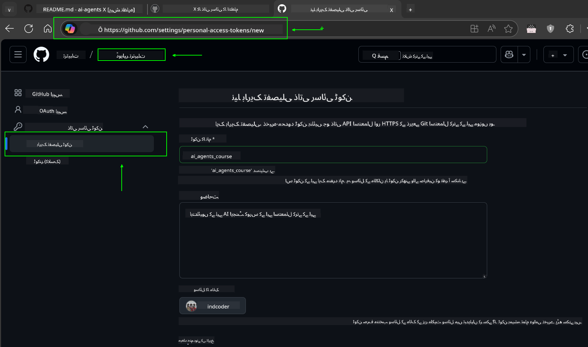
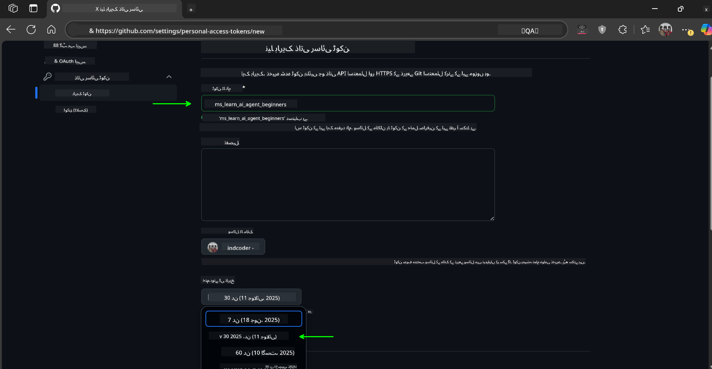
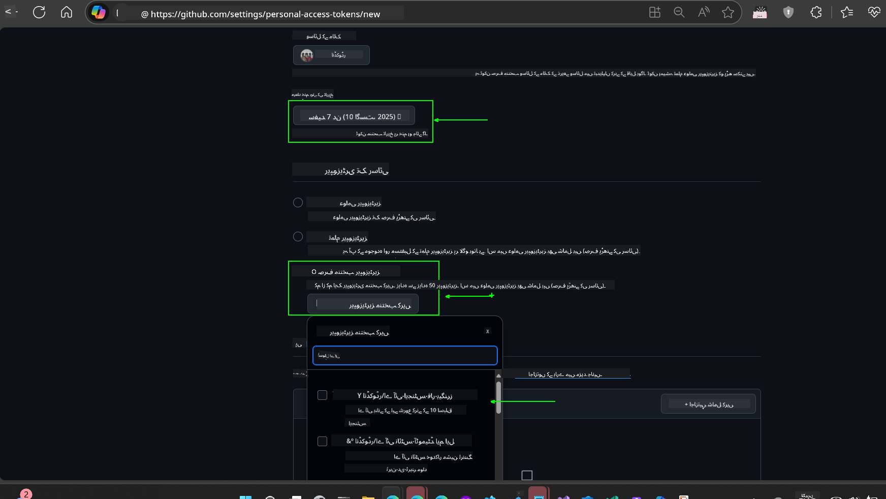
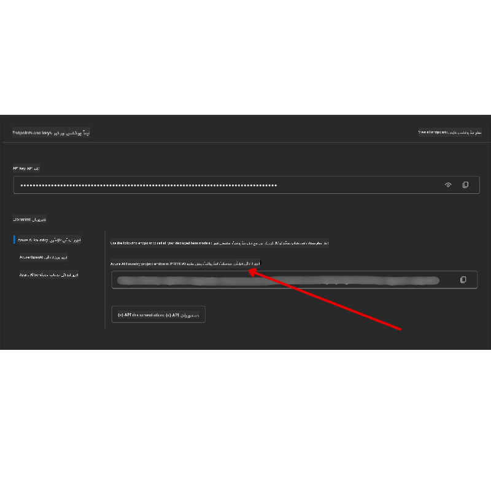

<!--
CO_OP_TRANSLATOR_METADATA:
{
  "original_hash": "96eb7f95375daa3e91778ca0295a55d9",
  "translation_date": "2025-10-15T11:38:25+00:00",
  "source_file": "00-course-setup/README.md",
  "language_code": "ur"
}
-->
# کورس سیٹ اپ

## تعارف

اس سبق میں آپ کو اس کورس کے کوڈ نمونوں کو چلانے کا طریقہ بتایا جائے گا۔

## دوسرے سیکھنے والوں کے ساتھ شامل ہوں اور مدد حاصل کریں

اپنا ریپو کلون کرنے سے پہلے، [AI Agents For Beginners Discord چینل](https://aka.ms/ai-agents/discord) میں شامل ہوں تاکہ سیٹ اپ میں مدد حاصل کریں، کورس کے بارے میں سوالات کریں، یا دوسرے سیکھنے والوں کے ساتھ رابطہ کریں۔

## اس ریپو کو کلون یا فورک کریں

شروع کرنے کے لیے، براہ کرم GitHub ریپوزیٹری کو کلون یا فورک کریں۔ اس سے آپ کے پاس کورس مواد کا اپنا ورژن ہوگا تاکہ آپ کوڈ کو چلا سکیں، ٹیسٹ کر سکیں، اور اس میں تبدیلی کر سکیں!

یہ کرنے کے لیے <a href="https://github.com/microsoft/ai-agents-for-beginners/fork" target="_blank">ریپو کو فورک کریں</a> کے لنک پر کلک کریں۔

اب آپ کے پاس اس کورس کا فورک شدہ ورژن درج ذیل لنک میں ہونا چاہیے:


### شالو کلون (ورکشاپ / Codespaces کے لیے تجویز کردہ)

  > مکمل ریپوزیٹری بڑی ہو سکتی ہے (~3 GB) جب آپ مکمل تاریخ اور تمام فائلیں ڈاؤن لوڈ کرتے ہیں۔ اگر آپ صرف ورکشاپ میں شرکت کر رہے ہیں یا صرف چند سبق فولڈرز کی ضرورت ہے، تو شالو کلون (یا اسپارس کلون) زیادہ تر ڈاؤن لوڈ کو تاریخ کو مختصر کر کے اور/یا بلاگز کو چھوڑ کر بچاتا ہے۔

#### فوری شالو کلون — کم از کم تاریخ، تمام فائلیں

ذیل کے کمانڈز میں `<your-username>` کو اپنے فورک URL (یا اپ اسٹریم URL اگر آپ کو ترجیح ہو) سے تبدیل کریں۔

صرف تازہ ترین کمیٹ تاریخ کو کلون کرنے کے لیے (چھوٹا ڈاؤن لوڈ):

```bash|powershell
git clone --depth 1 https://github.com/<your-username>/ai-agents-for-beginners.git
```

کسی مخصوص برانچ کو کلون کرنے کے لیے:

```bash|powershell
git clone --depth 1 --branch <branch-name> https://github.com/<your-username>/ai-agents-for-beginners.git
```

#### جزوی (اسپارس) کلون — کم از کم بلاگز + صرف منتخب فولڈرز

یہ جزوی کلون اور اسپارس-چیک آؤٹ استعمال کرتا ہے (Git 2.25+ کی ضرورت ہے اور جدید Git کے ساتھ جزوی کلون سپورٹ کی سفارش کی جاتی ہے):

```bash|powershell
git clone --depth 1 --filter=blob:none --sparse https://github.com/<your-username>/ai-agents-for-beginners.git
```

ریپو فولڈر میں جائیں:

بش کے لیے:

```bash
cd ai-agents-for-beginners
```

پاور شیل کے لیے:

```powershell
Set-Location ai-agents-for-beginners
```

پھر وہ فولڈرز منتخب کریں جن کی آپ کو ضرورت ہے (نیچے دی گئی مثال دو فولڈرز دکھاتی ہے):

```bash|powershell
git sparse-checkout set 00-course-setup 01-intro-to-ai-agents
```

کلون کرنے اور فائلوں کی تصدیق کے بعد، اگر آپ کو صرف فائلوں کی ضرورت ہے اور جگہ خالی کرنا چاہتے ہیں (کوئی git تاریخ نہیں)، براہ کرم ریپوزیٹری میٹا ڈیٹا کو حذف کریں (💀 ناقابل واپسی — آپ تمام Git فعالیت کھو دیں گے: کوئی کمیٹس، پلز، پشز، یا تاریخ تک رسائی نہیں ہوگی)۔

Linux/macOS کے لیے:

```bash
rm -rf .git
```

Windows کے لیے:

```powershell
Remove-Item -Recurse -Force .git
```

#### GitHub Codespaces استعمال کرنا (مقامی بڑے ڈاؤن لوڈز سے بچنے کے لیے تجویز کردہ)

- اس ریپو کے لیے [GitHub UI](https://github.com/codespaces) کے ذریعے ایک نیا Codespace بنائیں۔  

- نئے بنائے گئے Codespace کے ٹرمینل میں، اوپر دیے گئے شالو/اسپارس کلون کمانڈز میں سے ایک چلائیں تاکہ صرف وہ سبق فولڈرز جو آپ کو ضرورت ہیں Codespace ورک اسپیس میں لائے جائیں۔
- اختیاری: Codespaces کے اندر کلون کرنے کے بعد، اضافی جگہ واپس حاصل کرنے کے لیے .git کو ہٹا دیں (اوپر دیے گئے ہٹانے کے کمانڈز دیکھیں)۔
- نوٹ: اگر آپ ریپو کو براہ راست Codespaces میں کھولنے کو ترجیح دیتے ہیں (اضافی کلون کے بغیر)، تو آگاہ رہیں کہ Codespaces devcontainer ماحول کو تشکیل دے گا اور پھر بھی آپ کی ضرورت سے زیادہ فراہم کر سکتا ہے۔ ایک تازہ Codespace کے اندر شالو کاپی کلون کرنا آپ کو ڈسک کے استعمال پر زیادہ کنٹرول دیتا ہے۔

#### تجاویز

- اگر آپ ترمیم/کمیٹ کرنا چاہتے ہیں تو ہمیشہ کلون URL کو اپنے فورک سے تبدیل کریں۔
- اگر آپ کو بعد میں مزید تاریخ یا فائلوں کی ضرورت ہو، تو آپ انہیں حاصل کر سکتے ہیں یا اسپارس-چیک آؤٹ کو ایڈجسٹ کر سکتے ہیں تاکہ اضافی فولڈرز شامل ہوں۔

## کوڈ چلانا

یہ کورس Jupyter Notebooks کی ایک سیریز پیش کرتا ہے جسے آپ AI Agents بنانے کا عملی تجربہ حاصل کرنے کے لیے چلا سکتے ہیں۔

کوڈ نمونے درج ذیل استعمال کرتے ہیں:

**GitHub اکاؤنٹ کی ضرورت ہے - مفت**:

1) Semantic Kernel Agent Framework + GitHub Models Marketplace۔ لیبل شدہ (semantic-kernel.ipynb)
2) AutoGen Framework + GitHub Models Marketplace۔ لیبل شدہ (autogen.ipynb)

**Azure سبسکرپشن کی ضرورت ہے**:
3) Azure AI Foundry + Azure AI Agent Service۔ لیبل شدہ (azureaiagent.ipynb)

ہم آپ کو تینوں قسم کے نمونے آزمانے کی ترغیب دیتے ہیں تاکہ دیکھ سکیں کہ آپ کے لیے کون سا بہترین کام کرتا ہے۔

جو بھی آپشن آپ منتخب کریں، یہ طے کرے گا کہ آپ کو نیچے دیے گئے سیٹ اپ مراحل میں سے کون سے مراحل پر عمل کرنا ہوگا:

## ضروریات

- Python 3.12+
  - **نوٹ**: اگر آپ کے پاس Python3.12 انسٹال نہیں ہے، تو یقینی بنائیں کہ آپ اسے انسٹال کریں۔ پھر requirements.txt فائل سے صحیح ورژنز انسٹال کرنے کو یقینی بنانے کے لیے python3.12 کا استعمال کرتے ہوئے اپنا venv بنائیں۔
  
    >مثال

    Python venv ڈائریکٹری بنائیں:

    ``` bash
    python3 -m venv venv
    ```

    پھر venv ماحول کو فعال کریں:

    macOS اور Linux کے لیے

    ```bash
    source venv/bin/activate
    ```
  
    Windows کے لیے

    ```bash
    venv\Scripts\activate
    ```

- GitHub اکاؤنٹ - GitHub Models Marketplace تک رسائی کے لیے
- Azure سبسکرپشن - Azure AI Foundry تک رسائی کے لیے
- Azure AI Foundry اکاؤنٹ - Azure AI Agent Service تک رسائی کے لیے

ہم نے اس ریپوزیٹری کی جڑ میں ایک `requirements.txt` فائل شامل کی ہے جس میں کوڈ نمونے چلانے کے لیے تمام مطلوبہ Python پیکجز شامل ہیں۔

آپ انہیں ریپوزیٹری کی جڑ میں اپنے ٹرمینل میں درج ذیل کمانڈ چلا کر انسٹال کر سکتے ہیں:

```bash
pip install -r requirements.txt
```
ہم تنازعات اور مسائل سے بچنے کے لیے Python ورچوئل ماحول بنانے کی تجویز کرتے ہیں۔

## VSCode سیٹ اپ کریں
یقینی بنائیں کہ آپ VSCode میں Python کا صحیح ورژن استعمال کر رہے ہیں۔


## GitHub Models استعمال کرتے ہوئے نمونوں کے لیے سیٹ اپ کریں 

### مرحلہ 1: اپنا GitHub Personal Access Token (PAT) حاصل کریں

یہ کورس GitHub Models Marketplace کا فائدہ اٹھاتا ہے، جو آپ کو مفت رسائی فراہم کرتا ہے Large Language Models (LLMs) تک جنہیں آپ AI Agents بنانے کے لیے استعمال کریں گے۔

GitHub Models استعمال کرنے کے لیے، آپ کو ایک [GitHub Personal Access Token](https://docs.github.com/en/authentication/keeping-your-account-and-data-secure/managing-your-personal-access-tokens) بنانا ہوگا۔

یہ آپ کے GitHub اکاؤنٹ میں <a href="https://github.com/settings/personal-access-tokens" target="_blank">Personal Access Tokens settings</a> پر جا کر کیا جا سکتا ہے۔

براہ کرم [Principle of Least Privilege](https://docs.github.com/en/get-started/learning-to-code/storing-your-secrets-safely) پر عمل کریں جب آپ اپنا ٹوکن بناتے ہیں۔ اس کا مطلب ہے کہ آپ کوڈ نمونے چلانے کے لیے صرف وہی اجازتیں دیں جو اس کورس میں ضروری ہیں۔

1. **Developer settings** پر جا کر اسکرین کے بائیں جانب `Fine-grained tokens` آپشن منتخب کریں۔
   

    پھر `Generate new token` منتخب کریں۔

    

2. اپنے ٹوکن کے لیے ایک وضاحتی نام درج کریں جو اس کے مقصد کی عکاسی کرے، تاکہ بعد میں اسے آسانی سے پہچانا جا سکے۔

    🔐 ٹوکن کی مدت کی سفارش

    تجویز کردہ مدت: 30 دن
    زیادہ محفوظ انداز کے لیے، آپ مختصر مدت کا انتخاب کر سکتے ہیں—جیسے 7 دن 🛡️
    یہ ایک ذاتی ہدف مقرر کرنے اور کورس مکمل کرنے کا ایک بہترین طریقہ ہے جب آپ کی سیکھنے کی رفتار زیادہ ہو 🚀۔

    

3. ٹوکن کے دائرہ کار کو اس ریپوزیٹری کے فورک تک محدود کریں۔

    

4. ٹوکن کی اجازتیں محدود کریں: **Permissions** کے تحت، **Account** ٹیب پر کلک کریں، اور "+ Add permissions" بٹن پر کلک کریں۔ ایک ڈراپ ڈاؤن ظاہر ہوگا۔ براہ کرم **Models** تلاش کریں اور اس کے لیے باکس کو چیک کریں۔
    

5. ٹوکن بنانے سے پہلے مطلوبہ اجازتوں کی تصدیق کریں۔ 

6. ٹوکن بنانے سے پہلے، یقینی بنائیں کہ آپ ٹوکن کو محفوظ جگہ جیسے پاس ورڈ مینیجر والٹ میں محفوظ کرنے کے لیے تیار ہیں، کیونکہ یہ آپ کے بنائے جانے کے بعد دوبارہ نہیں دکھایا جائے گا۔ 

اپنا نیا ٹوکن کاپی کریں جو آپ نے ابھی بنایا ہے۔ آپ اسے اس کورس میں شامل `.env` فائل میں شامل کریں گے۔

### مرحلہ 2: اپنی `.env` فائل بنائیں

اپنی `.env` فائل بنانے کے لیے اپنے ٹرمینل میں درج ذیل کمانڈ چلائیں۔

```bash
cp .env.example .env
```

یہ مثال فائل کو کاپی کرے گا اور آپ کی ڈائریکٹری میں `.env` بنائے گا جہاں آپ ماحول کے متغیرات کے لیے اقدار بھریں گے۔

اپنا ٹوکن کاپی کرنے کے بعد، اپنی پسندیدہ ٹیکسٹ ایڈیٹر میں `.env` فائل کھولیں اور اپنے ٹوکن کو `GITHUB_TOKEN` فیلڈ میں پیسٹ کریں۔


اب آپ اس کورس کے کوڈ نمونے چلانے کے قابل ہونا چاہیے۔

## Azure AI Foundry اور Azure AI Agent Service استعمال کرتے ہوئے نمونوں کے لیے سیٹ اپ کریں

### مرحلہ 1: اپنا Azure پروجیکٹ اینڈپوائنٹ حاصل کریں

Azure AI Foundry میں ہب اور پروجیکٹ بنانے کے مراحل پر عمل کریں یہاں: [Hub resources overview](https://learn.microsoft.com/en-us/azure/ai-foundry/concepts/ai-resources)

ایک بار جب آپ نے اپنا پروجیکٹ بنا لیا، آپ کو اپنے پروجیکٹ کے لیے کنکشن اسٹرنگ حاصل کرنے کی ضرورت ہوگی۔

یہ Azure AI Foundry پورٹل میں اپنے پروجیکٹ کے **Overview** صفحے پر جا کر کیا جا سکتا ہے۔



### مرحلہ 2: اپنی `.env` فائل بنائیں

اپنی `.env` فائل بنانے کے لیے اپنے ٹرمینل میں درج ذیل کمانڈ چلائیں۔

```bash
cp .env.example .env
```

یہ مثال فائل کو کاپی کرے گا اور آپ کی ڈائریکٹری میں `.env` بنائے گا جہاں آپ ماحول کے متغیرات کے لیے اقدار بھریں گے۔

اپنا ٹوکن کاپی کرنے کے بعد، اپنی پسندیدہ ٹیکسٹ ایڈیٹر میں `.env` فائل کھولیں اور اپنے ٹوکن کو `PROJECT_ENDPOINT` فیلڈ میں پیسٹ کریں۔

### مرحلہ 3: Azure میں سائن ان کریں

سیکیورٹی کے بہترین عمل کے طور پر، ہم [keyless authentication](https://learn.microsoft.com/azure/developer/ai/keyless-connections?tabs=csharp%2Cazure-cli?WT.mc_id=academic-105485-koreyst) استعمال کریں گے تاکہ Microsoft Entra ID کے ساتھ Azure OpenAI میں تصدیق کی جا سکے۔

اگلے مرحلے میں، ایک ٹرمینل کھولیں اور `az login --use-device-code` چلائیں تاکہ اپنے Azure اکاؤنٹ میں سائن ان کریں۔

ایک بار جب آپ لاگ ان ہو جائیں، ٹرمینل میں اپنی سبسکرپشن منتخب کریں۔

## اضافی ماحول متغیرات - Azure Search اور Azure OpenAI 

Agentic RAG سبق - سبق 5 - میں ایسے نمونے شامل ہیں جو Azure Search اور Azure OpenAI استعمال کرتے ہیں۔

اگر آپ ان نمونوں کو چلانا چاہتے ہیں، تو آپ کو اپنی `.env` فائل میں درج ذیل ماحول متغیرات شامل کرنے کی ضرورت ہوگی:

### Overview صفحہ (پروجیکٹ)

- `AZURE_SUBSCRIPTION_ID` - **Overview** صفحے پر **Project details** چیک کریں۔

- `AZURE_AI_PROJECT_NAME` - اپنے پروجیکٹ کے **Overview** صفحے کے اوپر دیکھیں۔

- `AZURE_OPENAI_SERVICE` - **Overview** صفحے پر **Azure OpenAI Service** کے لیے **Included capabilities** ٹیب میں تلاش کریں۔

### Management Center

- `AZURE_OPENAI_RESOURCE_GROUP` - **Management Center** کے **Overview** صفحے پر **Project properties** پر جائیں۔

- `GLOBAL_LLM_SERVICE` - **Connected resources** کے تحت، **Azure AI Services** کنکشن نام تلاش کریں۔ اگر درج نہیں ہے، تو اپنے ریسورس گروپ کے تحت AI Services ریسورس نام کے لیے **Azure portal** چیک کریں۔

### Models + Endpoints صفحہ

- `AZURE_OPENAI_EMBEDDING_DEPLOYMENT_NAME` - اپنا ایمبیڈنگ ماڈل منتخب کریں (مثال کے طور پر، `text-embedding-ada-002`) اور ماڈل کی تفصیلات سے **Deployment name** نوٹ کریں۔

- `AZURE_OPENAI_CHAT_DEPLOYMENT_NAME` - اپنا چیٹ ماڈل منتخب کریں (مثال کے طور پر، `gpt-4o-mini`) اور ماڈل کی تفصیلات سے **Deployment name** نوٹ کریں۔

### Azure Portal

- `AZURE_OPENAI_ENDPOINT` - **Azure AI services** تلاش کریں، اس پر کلک کریں، پھر **Resource Management**, **Keys and Endpoint** پر جائیں، "Azure OpenAI endpoints" پر نیچے سکرول کریں، اور وہ ایک کاپی کریں جو "Language APIs" کہتا ہے۔

- `AZURE_OPENAI_API_KEY` - اسی اسکرین سے، KEY 1 یا KEY 2 کاپی کریں۔

- `AZURE_SEARCH_SERVICE_ENDPOINT` - اپنی **Azure AI Search** ریسورس تلاش کریں، اس پر کلک کریں، اور **Overview** دیکھیں۔

- `AZURE_SEARCH_API_KEY` - پھر **Settings** پر جائیں اور پھر **Keys** پر جائیں تاکہ پرائمری یا سیکنڈری ایڈمن کی کو کاپی کریں۔

### بیرونی ویب صفحہ

- `AZURE_OPENAI_API_VERSION` - [API version lifecycle](https://learn.microsoft.com/en-us/azure/ai-services/openai/api-version-deprecation#latest-ga-api-release) صفحے پر **Latest GA API release** کے تحت جائیں۔

### keyless authentication سیٹ اپ کریں

اپنی اسناد کو ہارڈ کوڈ کرنے کے بجائے، ہم Azure OpenAI کے ساتھ keyless کنکشن استعمال کریں گے۔ ایسا کرنے کے لیے، ہم `DefaultAzureCredential` کو درآمد کریں گے اور بعد میں `DefaultAzureCredential` فنکشن کو کال کریں گے تاکہ اسناد حاصل کی جا سکیں۔

```python
from azure.identity import DefaultAzureCredential, InteractiveBrowserCredential
```

## کہیں پھنس گئے ہیں؟
اگر آپ کو اس سیٹ اپ کو چلانے میں کوئی مسئلہ ہو، تو ہمارے <a href="https://discord.gg/kzRShWzttr" target="_blank">Azure AI کمیونٹی ڈسکارڈ</a> میں شامل ہوں یا <a href="https://github.com/microsoft/ai-agents-for-beginners/issues?WT.mc_id=academic-105485-koreyst" target="_blank">ایک مسئلہ درج کریں</a>۔

## اگلا سبق

آپ اس کورس کے کوڈ کو چلانے کے لیے تیار ہیں۔ AI ایجنٹس کی دنیا کے بارے میں مزید سیکھنے کا لطف اٹھائیں!

[AI ایجنٹس اور ایجنٹ کے استعمال کے کیسز کا تعارف](../01-intro-to-ai-agents/README.md)

---

**ڈسکلیمر**:  
یہ دستاویز AI ترجمہ سروس [Co-op Translator](https://github.com/Azure/co-op-translator) کا استعمال کرتے ہوئے ترجمہ کی گئی ہے۔ ہم درستگی کے لیے کوشش کرتے ہیں، لیکن براہ کرم آگاہ رہیں کہ خودکار ترجمے میں غلطیاں یا غیر درستیاں ہو سکتی ہیں۔ اصل دستاویز کو اس کی اصل زبان میں مستند ذریعہ سمجھا جانا چاہیے۔ اہم معلومات کے لیے، پیشہ ور انسانی ترجمہ کی سفارش کی جاتی ہے۔ ہم اس ترجمے کے استعمال سے پیدا ہونے والی کسی بھی غلط فہمی یا غلط تشریح کے ذمہ دار نہیں ہیں۔