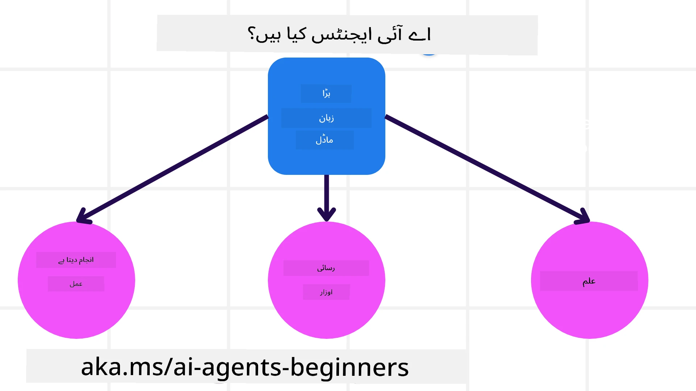
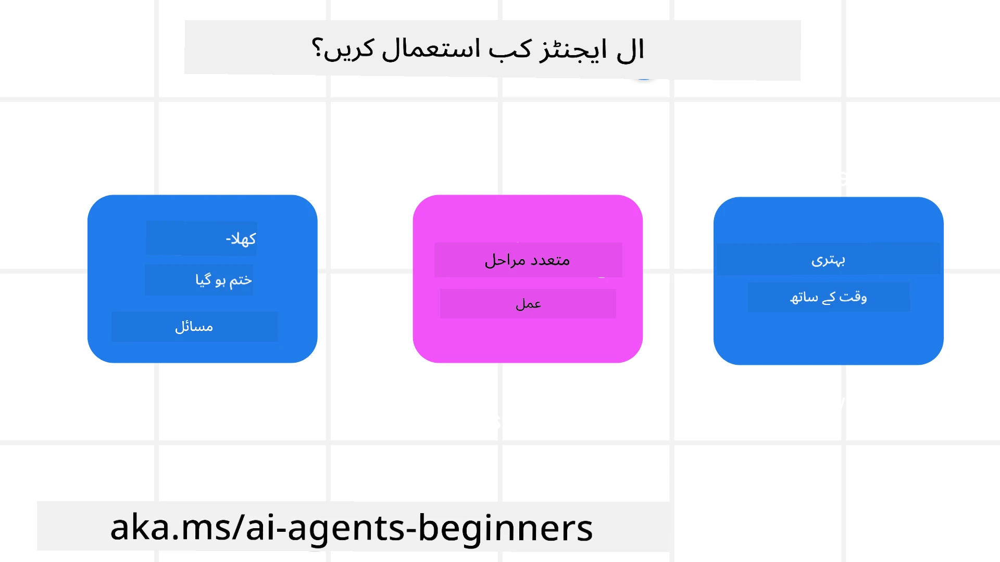

> _(اس سبق کی ویڈیو دیکھنے کے لیے اوپر تصویر پر کلک کریں)_

# AI ایجنٹس اور ایجنٹ استعمال کے معاملات کا تعارف

"AI ایجنٹس فار بیگنرز" کورس میں خوش آمدید! یہ کورس AI ایجنٹس بنانے کے لیے بنیادی معلومات اور عملی مثالیں فراہم کرتا ہے۔

دیگر سیکھنے والوں اور AI ایجنٹ بنانے والوں سے ملنے اور اس کورس کے بارے میں اپنے سوالات پوچھنے کے لیے <a href="https://discord.gg/kzRShWzttr" target="_blank">Azure AI Discord کمیونٹی</a> میں شامل ہوں۔

اس کورس کو شروع کرنے کے لیے، ہم پہلے بہتر سمجھ حاصل کرتے ہیں کہ AI ایجنٹس کیا ہیں اور ہم انہیں ان ایپلیکیشنز اور ورک فلو میں کیسے استعمال کر سکتے ہیں جو ہم بناتے ہیں۔

## تعارف

یہ سبق زیر بحث ہے:

- AI ایجنٹس کیا ہیں اور ایجنٹس کی مختلف اقسام کیا ہیں؟
- AI ایجنٹس کے لیے کون سے استعمال کے بہترین مواقع ہیں اور یہ ہمیں کیسے مدد دے سکتے ہیں؟
- ایجنٹک حل ڈیزائن کرتے وقت کچھ بنیادی تعمیراتی عناصر کیا ہیں؟

## سیکھنے کے مقاصد
اس سبق کو مکمل کرنے کے بعد، آپ کے قابل ہونا چاہیے کہ:

- AI ایجنٹ کے تصورات کو سمجھیں اور یہ دوسرے AI حل سے کیسے مختلف ہیں۔
- AI ایجنٹس کو سب سے مؤثر طریقے سے لگائیں۔
- صارفین اور گاہکوں دونوں کے لیے مصنوعی حل کو کارآمد طریقے سے ڈیزائن کریں۔

## AI ایجنٹس کی تعریف اور AI ایجنٹس کی اقسام

### AI ایجنٹس کیا ہیں؟

AI ایجنٹس وہ **سسٹمز** ہیں جو **بڑے زبان ماڈلز (LLMs)** کو **عمل انجام دینے** کے قابل بناتے ہیں، ان کی صلاحیتوں کو بڑھاتے ہوئے LLMs کو **ٹولز تک رسائی** اور **علم** فراہم کرتے ہیں۔

آئیے اس تعریف کو چھوٹے حصوں میں تقسیم کرتے ہیں:

- **سسٹم** - ایجنٹس کو صرف ایک جزو کے طور پر نہیں بلکہ کئی اجزاء کے نظام کے طور پر سوچنا اہم ہے۔ بنیادی سطح پر، AI ایجنٹ کے اجزاء یہ ہیں:
  - **ماحول** - وہ مخصوص جگہ جہاں AI ایجنٹ کام کر رہا ہوتا ہے۔ مثال کے طور پر، اگر ہمارے پاس ایک سفر کی بکنگ AI ایجنٹ ہے، تو ماحول وہ سفر کی بکنگ سسٹم ہو سکتی ہے جسے AI ایجنٹ کام مکمل کرنے کے لیے استعمال کرتا ہے۔
  - **سینسرز** - ماحول میں معلومات ہوتی ہیں اور وہ فیڈ بیک دیتے ہیں۔ AI ایجنٹس سینسرز کا استعمال کر کے ماحول کی موجودہ حالت کی معلومات جمع اور تشریح کرتے ہیں۔ سفر کی بکنگ ایجنٹ کی مثال میں، بکنگ سسٹم ہوٹل کی دستیابی یا پروازوں کی قیمتوں جیسی معلومات فراہم کر سکتا ہے۔
  - **ایکچیویٹرز** - جب AI ایجنٹ ماحول کی موجودہ حالت حاصل کر لیتا ہے، تو موجودہ کام کے لیے یہ طے کرتا ہے کہ ماحول میں تبدیلی کے لیے کون سا عمل کرنا ہے۔ سفر کی بکنگ ایجنٹ کے لیے، یہ صارف کے لیے دستیاب کمرہ بک کرنا ہو سکتا ہے۔

**بڑے زبان ماڈلز (LLMs)** - ایجنٹس کا تصور LLMs کی تخلیق سے پہلے موجود تھا۔ LLMs کے ساتھ AI ایجنٹس بنانے کا فائدہ ان کی انسانی زبان اور ڈیٹا کی تشریح کرنے کی صلاحیت ہے۔ یہ صلاحیت LLMs کو ماحول کی معلومات کی تشریح کرنے اور ماحول میں تبدیلی کے لیے منصوبہ بنانے کے قابل بناتی ہے۔

**عمل انجام دینا** - AI ایجنٹس کے نظام کے باہر، LLMs صرف اس صورت میں محدود ہوتے ہیں جب عمل صارف کے پرامپٹ کی بنیاد پر مواد یا معلومات تیار کرنا ہو۔ AI ایجنٹس کے نظام میں، LLMs صارف کی درخواست کی تشریح کر کے اور اپنے ماحول میں دستیاب ٹولز کا استعمال کر کے کام کر سکتے ہیں۔

**ٹولز تک رسائی** - LLM کے پاس کون سے ٹولز ہیں اس کی وضاحت کی جاتی ہے 1) اس ماحول سے جس میں یہ کام کر رہا ہے اور 2) AI ایجنٹ کے ڈویلپر کی طرف سے۔ ہمارے سفر ایجنٹ کی مثال میں، ایجنٹ کے ٹولز بکنگ سسٹم میں دستیاب آپریشنز تک محدود ہیں، اور/یا ڈویلپر ایجنٹ کی ٹول رسائی کو فلائٹس تک محدود کر سکتا ہے۔

**میموری + علم** - میموری بات چیت کے سیاق و سباق میں قلیل مدتی ہو سکتی ہے جو صارف اور ایجنٹ کے درمیان ہوتی ہے۔ طویل مدتی، ماحول سے فراہم کردہ معلومات کے علاوہ، AI ایجنٹس دیگر نظاموں، خدمات، ٹولز، اور یہاں تک کہ دوسرے ایجنٹس سے علم بھی حاصل کر سکتے ہیں۔ سفر ایجنٹ کی مثال میں، یہ علم صارف کی سفر کی ترجیحات کے بارے میں معلومات ہو سکتی ہے جو کسٹمر ڈیٹا بیس میں موجود ہو۔

### ایجنٹس کی مختلف اقسام

اب جب کہ ہمارے پاس AI ایجنٹس کی عمومی تعریف ہے، آئیے کچھ مخصوص ایجنٹ اقسام پر نظر ڈالیں اور یہ دیکھیں کہ انہیں سفر کی بکنگ AI ایجنٹ پر کیسے لاگو کیا جائے گا۔

| **ایجنٹ کی قسم**               | **تفصیل**                                                                                                                      | **مثال**                                                                                                                                                                                                                    |
| ----------------------------- | ------------------------------------------------------------------------------------------------------------------------------- | ---------------------------------------------------------------------------------------------------------------------------------------------------------------------------------------------------------------------------- |
| **سادہ ریفلیکس ایجنٹس**      | پہلے سے طے شدہ قواعد کی بنیاد پر فوری کارروائیاں انجام دیتے ہیں۔                                                                       | سفر کا ایجنٹ ای میل کے سیاق و سباق کی تشریح کرتا ہے اور سفر کی شکایات کو کسٹمر سروس کو بھیج دیتا ہے۔                                                                                                                       |
| **ماڈل پر مبنی ریفلیکس ایجنٹس** | دنیا کے ماڈل اور اس ماڈل میں ہونے والی تبدیلیوں کی بنیاد پر عمل کرتے ہیں۔                                                               | سفر کا ایجنٹ تاریخی قیمتوں کے ڈیٹا تک رسائی کی بنیاد پر اہم قیمتوں میں تبدیلی والے راستوں کو ترجیح دیتا ہے۔                                                                                                                |
| **مقصد پر مبنی ایجنٹس**         | مخصوص مقاصد کے حصول کے لیے منصوبے بناتے ہیں، مقصد کی تشریح کرتے ہیں اور اسے حاصل کرنے کے لیے کارروائیاں طے کرتے ہیں۔                    | سفر کا ایجنٹ موجودہ مقام سے منزل تک ضروری سفر کی ترتیبات (گاڑی، عوامی ٹرانسپورٹ، پروازیں) طے کر کے سفر بک کرتا ہے۔                                                                                                         |
| **افادیت پر مبنی ایجنٹس**       | ترجیحات پر غور کرتے ہیں اور ہدف کو حاصل کرنے کے لیے عددی لحاظ سے وزن تول کرتے ہیں۔                                                      | سفر کا ایجنٹ سفری بکنگ کرتے وقت سہولت اور لاگت کے توازن کو دیکھ کر افادیت کو زیادہ سے زیادہ کرتا ہے۔                                                                                                                       |
| **سیکھنے والے ایجنٹس**          | وقت کے ساتھ بہتر ہوتے ہیں، فیڈ بیک پر ردِعمل ظاہر کرتے اور اس کے مطابق کارروائیاں ایڈجسٹ کرتے ہیں۔                                   | سفر کا ایجنٹ پوسٹ ٹرپ سروے سے صارف کی رائے حاصل کر کے مستقبل کی بکنگز میں بہتری لاتا ہے۔                                                                                                                                |
| **مرتب ایجنٹس**                | متعدد ایجنٹس پر مشتمل تہہ دار نظام ہوتے ہیں، جہاں اعلیٰ درجے کے ایجنٹ کام کو ذیلی کاموں میں تقسیم کرتے ہیں جنہیں نچلے درجے کے ایجنٹس مکمل کرتے ہیں۔ | سفر کا ایجنٹ ایک سفر کو منسوخ کرتا ہے، کام کو ذیلی کاموں میں تقسیم کر کے (مثلاً مخصوص بکنگز کو منسوخ کرنا) اور نچلے درجے کے ایجنٹس کو انہیں مکمل کر کے اعلیٰ درجے کے ایجنٹ کو رپورٹ کرنے کے لیے کہتا ہے۔                          |
| **کثیر ایجنٹس نظام (MAS)**     | ایجنٹس خود مختاری سے کام مکمل کرتے ہیں، چاہے تعاون سے یا مقابلہ بازی سے۔                                                              | تعاون: متعدد ایجنٹس مخصوص سفر کی خدمات جیسے ہوٹل، پروازیں، اور تفریحی سرگرمیوں کو بک کرتے ہیں۔ مقابلہ بازی: متعدد ایجنٹس مشترکہ ہوٹل بکنگ کیلنڈر پر کام کرتے اور گاہکوں کو ہوٹل میں بک کرنے کے لیے مقابلہ کرتے ہیں۔          |

## AI ایجنٹس کب استعمال کریں

پچھلے حصے میں، ہم نے سفر کے ایجنٹ کے استعمال کی مثال دی تاکہ یہ بتایا جا سکے کہ مختلف اقسام کے ایجنٹس کو سفر کی بکنگ کے مختلف حالات میں کیسے استعمال کیا جا سکتا ہے۔ ہم پورے کورس میں اس اپلیکیشن کو استعمال کرتے رہیں گے۔

آئیے دیکھتے ہیں کہ AI ایجنٹس کے لیے کون سے استعمال کے معاملات سب سے زیادہ موزوں ہیں:

- **کھلے اختتام والے مسائل** - اس بات کی اجازت دینا کہ LLM کام مکمل کرنے کے لیے ضروری اقدامات کا تعین کرے کیونکہ اسے ہمیشہ ورک فلو میں سخت کوڈ نہیں کیا جا سکتا۔
- **کئی مراحل کے عمل** - ایسے کام جو پیچیدگی کی سطح کا تقاضا کرتے ہیں جس میں AI ایجنٹ کو متعدد چکروں پر ٹولز یا معلومات استعمال کرنی ہوتی ہے بجائے ایک دفعہ کی بازیافت کے۔
- **وقت کے ساتھ بہتری** - ایسے کام جہاں ایجنٹ وقت کے ساتھ بہتر ہو سکتا ہے، چاہے ماحول سے فیڈ بیک حاصل کر کے ہو یا صارفین سے، تاکہ بہتر افادیت فراہم کی جا سکے۔

ہم AI ایجنٹس کے استعمال کے مزید پہلوؤں کا احاطہ "Building Trustworthy AI Agents" سبق میں کرتے ہیں۔

## ایجنٹک حل کی بنیادی باتیں

### ایجنٹ کی ترقی

AI ایجنٹ کے نظام کو ڈیزائن کرنے کا پہلا قدم ٹولز، عمل اور رویوں کی تعریف کرنا ہے۔ اس کورس میں، ہم اپنے ایجنٹس کی تعریف کے لیے **Azure AI Agent Service** کا استعمال کرتے ہیں۔ اس میں یہ خصوصیات شامل ہیں:

- اوپن ماڈلز کا انتخاب جیسے OpenAI، Mistral، اور Llama
- لائسنس یافتہ ڈیٹا کا استعمال جیسے Tripadvisor کے فراہم کنندگان کے ذریعہ
- معیاری OpenAPI 3.0 ٹولز کا استعمال

### ایجنٹک پیٹرنز

LLMs کے ساتھ رابطہ پرامپٹس کے ذریعے ہوتا ہے۔ AI ایجنٹس کی نیم خود مختار فطرت کی وجہ سے، ماحول کی تبدیلی کے بعد ہر بار دستی طور پر LLM کو دوبارہ پرامپٹ کرنا ممکن یا ضروری نہیں ہوتا۔ ہم **ایجنٹک پیٹرنز** استعمال کرتے ہیں جو ہمیں LLM کو کئی مراحل میں زیادہ پیمانے پر پراپمپٹ کرنے کی اجازت دیتے ہیں۔

یہ کورس موجودہ مقبول ایجنٹک پیٹرنز میں تقسیم ہے۔

### ایجنٹک فریم ورک

ایجنٹک فریم ورکس ڈویلپرز کو ایجنٹک پیٹرنز کوڈ کے ذریعے نافذ کرنے کی اجازت دیتے ہیں۔ یہ فریم ورکس ٹیمپلیٹس، پلگ انز، اور ٹولز فراہم کرتے ہیں تاکہ AI ایجنٹس کی بہتر تعاون کی جا سکے۔ یہ فوائد AI ایجنٹ کے نظام کی بہتر نگرانی اور خرابیوں کی تشخیص کی صلاحیت فراہم کرتے ہیں۔

اس کورس میں، ہم پروڈکشن کے قابل AI ایجنٹس بنانے کے لیے Microsoft Agent Framework (MAF) کی تحقیق کریں گے۔

## نمونہ کوڈ

- Python: [Agent Framework](./code_samples/01-python-agent-framework.ipynb)
- .NET: [Agent Framework](./code_samples/01-dotnet-agent-framework.md)

## AI ایجنٹس کے بارے میں مزید سوالات ہیں؟

دیگر سیکھنے والوں سے ملنے، آفس آورز میں شرکت کرنے اور اپنے AI ایجنٹس کے سوالات کے جواب حاصل کرنے کے لیے [Microsoft Foundry Discord](https://aka.ms/ai-agents/discord) میں شامل ہوں۔

## پچھلا سبق

[Course Setup](../00-course-setup/README.md)

## اگلا سبق

[Exploring Agentic Frameworks](../02-explore-agentic-frameworks/README.md)

---

<!-- CO-OP TRANSLATOR DISCLAIMER START -->
**دستخطی اعلان**:  
یہ دستاویز AI ترجمہ سروس [Co-op Translator](https://github.com/Azure/co-op-translator) کے ذریعے ترجمہ کی گئی ہے۔ اگرچہ ہم درستگی کی کوشش کرتے ہیں، براہ کرم اس بات سے آگاہ رہیں کہ خودکار تراجم میں غلطیاں یا عدم صحت شامل ہو سکتی ہے۔ اصل دستاویز کو اس کی مادری زبان میں ماہر اور مستند ذریعہ سمجھا جانا چاہیے۔ اہم معلومات کے لیے پیشہ ور انسانی ترجمہ کی سفارش کی جاتی ہے۔ اس ترجمے کے استعمال سے پیدا ہونے والے کسی بھی غلط فہمی یا غلط تشریحات کے لیے ہماری کوئی ذمہ داری نہیں ہے۔
<!-- CO-OP TRANSLATOR DISCLAIMER END -->