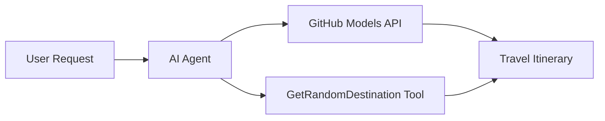

<!--
CO_OP_TRANSLATOR_METADATA:
{
  "original_hash": "23afd9be7b6ba5b69a44c3b6a78e07f6",
  "translation_date": "2025-11-06T10:01:50+00:00",
  "source_file": "01-intro-to-ai-agents/code_samples/01-dotnet-agent-framework.md",
  "language_code": "ur"
}
-->
# 🌍 مائیکروسافٹ ایجنٹ فریم ورک (.NET) کے ساتھ AI ٹریول ایجنٹ

## 📋 منظر نامہ کا جائزہ

یہ نوٹ بک مائیکروسافٹ ایجنٹ فریم ورک برائے .NET کا استعمال کرتے ہوئے ایک ذہین سفر منصوبہ بندی ایجنٹ بنانے کا مظاہرہ کرتی ہے۔ یہ ایجنٹ دنیا بھر کے مختلف مقامات کے لیے ذاتی نوعیت کے دن بھر کے سفر کے منصوبے خود بخود تیار کر سکتا ہے۔

**اہم خصوصیات:**
- 🎲 **بے ترتیب مقام کا انتخاب**: چھٹی کے مقامات منتخب کرنے کے لیے ایک حسب ضرورت ٹول استعمال کرتا ہے
- 🗺️ **ذہین سفر منصوبہ بندی**: تفصیلی دن بہ دن سفر کے منصوبے تیار کرتا ہے
- 🔄 **ریئل ٹائم اسٹریمنگ**: فوری اور اسٹریمنگ جوابات دونوں کی حمایت کرتا ہے
- 🛠️ **حسب ضرورت ٹول انضمام**: ایجنٹ کی صلاحیتوں کو بڑھانے کا مظاہرہ کرتا ہے

## 🔧 تکنیکی فن تعمیر

### بنیادی ٹیکنالوجیز
- **مائیکروسافٹ ایجنٹ فریم ورک**: AI ایجنٹ کی ترقی کے لیے .NET کا جدید ترین نفاذ
- **GitHub ماڈلز انضمام**: GitHub کے AI ماڈل انفرنس سروس کا استعمال کرتا ہے
- **OpenAI API مطابقت**: حسب ضرورت اینڈپوائنٹس کے ساتھ OpenAI کلائنٹ لائبریریوں کا فائدہ اٹھاتا ہے
- **محفوظ ترتیب**: ماحول پر مبنی API کلید کا انتظام

### اہم اجزاء
1. **AIAgent**: مرکزی ایجنٹ آرکیسٹریٹر جو گفتگو کے بہاؤ کو سنبھالتا ہے
2. **حسب ضرورت ٹولز**: ایجنٹ کے لیے دستیاب `GetRandomDestination()` فنکشن
3. **چیٹ کلائنٹ**: GitHub ماڈلز پر مبنی گفتگو کا انٹرفیس
4. **اسٹریمنگ سپورٹ**: ریئل ٹائم جواب پیدا کرنے کی صلاحیتیں

### انضمام کا نمونہ


## 🚀 شروعات کریں

**ضروریات:**
- .NET 10.0 یا اس سے زیادہ
- GitHub ماڈلز API تک رسائی کا ٹوکن
- `.env` فائل میں ترتیب دی گئی ماحول متغیرات

**ضروری ماحول متغیرات:**
```env
GITHUB_TOKEN=your_github_token
GITHUB_ENDPOINT=https://models.inference.ai.azure.com
GITHUB_MODEL_ID=gpt-4o-mini
```

نیچے دیے گئے کوڈ نمونے کو ترتیب وار چلائیں تاکہ سفر ایجنٹ کو عمل میں دیکھ سکیں!

---

## .NET سنگل فائل ایپ: AI ٹریول ایجنٹ کی مثال

مکمل قابل عمل کوڈ نمونے کے لیے `01-dotnet-agent-framework.cs` دیکھیں۔

```bash
dotnet run 01-dotnet-agent-framework.cs
```

### نمونہ کوڈ

```csharp
static string GetRandomDestination()
{
    var destinations = new List<string>
    {
        "Paris, France",
        "Tokyo, Japan",
        "New York City, USA",
        "Sydney, Australia",
        "Rome, Italy",
        "Barcelona, Spain",
        "Cape Town, South Africa",
        "Rio de Janeiro, Brazil",
        "Bangkok, Thailand",
        "Vancouver, Canada"
    };
    var random = new Random();
    int index = random.Next(destinations.Count);
    return destinations[index];
}

// Extract configuration from environment variables
var github_endpoint = Environment.GetEnvironmentVariable("GITHUB_ENDPOINT") ?? throw new InvalidOperationException("GITHUB_ENDPOINT is not set.");
var github_model_id = Environment.GetEnvironmentVariable("GITHUB_MODEL_ID") ?? "gpt-4o-mini";
var github_token = Environment.GetEnvironmentVariable("GITHUB_TOKEN") ?? throw new InvalidOperationException("GITHUB_TOKEN is not set.");

// Configure OpenAI Client Options
var openAIOptions = new OpenAIClientOptions()
{
    Endpoint = new Uri(github_endpoint)
};

// Initialize OpenAI Client with GitHub Models Configuration
var openAIClient = new OpenAIClient(new ApiKeyCredential(github_token), openAIOptions);

// Create AI Agent with Travel Planning Capabilities
AIAgent agent = openAIClient
    .GetChatClient(github_model_id)
    .CreateAIAgent(
        instructions: "You are a helpful AI Agent that can help plan vacations for customers at random destinations",
        tools: [AIFunctionFactory.Create(GetRandomDestination)]
    );

// Execute Agent: Plan a Day Trip (Non-Streaming)
Console.WriteLine(await agent.RunAsync("Plan me a day trip"));

// Execute Agent: Plan a Day Trip (Streaming Response)
await foreach (var update in agent.RunStreamingAsync("Plan me a day trip"))
{
    Console.Write(update);
}
```

---

**اعلانِ لاتعلقی**:  
یہ دستاویز AI ترجمہ سروس [Co-op Translator](https://github.com/Azure/co-op-translator) کا استعمال کرتے ہوئے ترجمہ کی گئی ہے۔ ہم درستگی کی بھرپور کوشش کرتے ہیں، لیکن براہ کرم آگاہ رہیں کہ خودکار ترجمے میں غلطیاں یا عدم درستگی ہو سکتی ہے۔ اصل دستاویز کو اس کی اصل زبان میں مستند ذریعہ سمجھا جانا چاہیے۔ اہم معلومات کے لیے، پیشہ ور انسانی ترجمہ کی سفارش کی جاتی ہے۔ اس ترجمے کے استعمال سے پیدا ہونے والی کسی بھی غلط فہمی یا غلط تشریح کے لیے ہم ذمہ دار نہیں ہیں۔