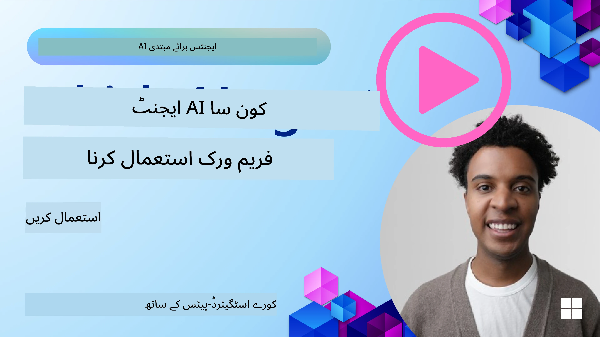

[](https://youtu.be/ODwF-EZo_O8?si=1xoy_B9RNQfrYdF7)

> _(اس سبق کا ویڈیو دیکھنے کے لیے اوپر دی گئی تصویر پر کلک کریں)_

# AI ایجنٹ فریم ورکس کو دریافت کریں

AI ایجنٹ فریم ورکس سوفٹ ویئر پلیٹ فارمز ہیں جو AI ایجنٹس کی تخلیق، تعیناتی، اور انتظام کو آسان بنانے کے لیے ڈیزائن کیے گئے ہیں۔ یہ فریم ورکس ڈویلپرز کو پہلے سے بنے ہوئے اجزاء، خلاصے، اور اوزار فراہم کرتے ہیں جو پیچیدہ AI نظاموں کی ترقی کو ہموار کرتے ہیں۔

یہ فریم ورکس ڈویلپرز کو ان کی ایپلیکیشنز کے منفرد پہلوؤں پر توجہ مرکوز کرنے میں مدد دیتے ہیں کیونکہ یہ AI ایجنٹ کی ترقی میں عام چیلنجز کے لیے معیاری طریقے فراہم کرتے ہیں۔ یہ AI نظاموں کی تعمیر میں اسکیل ایبلیٹی، رسائی، اور کارکردگی کو بڑھاتے ہیں۔

## تعارف

اس سبق میں مندرجہ ذیل موضوعات شامل ہوں گے:

- AI ایجنٹ فریم ورکس کیا ہیں اور یہ ڈویلپرز کو کیا حاصل کرنے کے قابل بناتے ہیں؟
- ٹیمیں ان کا استعمال کیسے کر سکتی ہیں تاکہ اپنے ایجنٹ کی صلاحیتوں کو جلدی پروٹوٹائپ، تکرار، اور بہتر بنا سکیں؟
- Microsoft کی طرف سے بنائے گئے فریم ورکس اور ٹولز (<a href="https://aka.ms/ai-agents-beginners/ai-agent-service" target="_blank">Azure AI Agent Service</a> اور <a href="https://learn.microsoft.com/azure/ai-services/openai/how-to/responses" target="_blank">Microsoft Agent Framework</a>) میں کیا فرق ہے؟
- کیا میں اپنے موجودہ Azure ماحولیاتی نظام کے ٹولز کو براہ راست شامل کر سکتا ہوں، یا مجھے آزاد حل کی ضرورت ہے؟
- Azure AI Agents سروس کیا ہے اور یہ میری کس طرح مدد کر رہی ہے؟

## سیکھنے کے مقاصد

اس سبق کے مقاصد یہ ہیں کہ آپ کو یہ سمجھنے میں مدد دیں:

- AI ایجنٹ فریم ورکس کا AI ترقی میں کردار۔
- AI ایجنٹ فریم ورکس کا استعمال کرتے ہوئے ذہین ایجنٹس کی تعمیر کیسے کی جائے۔
- AI ایجنٹ فریم ورکس کے ذریعے فعال کی جانے والی کلیدی صلاحیتیں۔
- Microsoft Agent Framework اور Azure AI Agent Service کے مابین فرق۔

## AI ایجنٹ فریم ورکس کیا ہیں اور یہ ڈویلپرز کو کیا کرنے کے قابل بناتے ہیں؟

روایتی AI فریم ورکس آپ کی ایپلیکیشنز میں AI کو شامل کرنے اور انہیں بہتر بنانے میں درج ذیل طریقوں سے مدد کر سکتے ہیں:

- **ذاتی نوعیت**: AI صارف کے رویے اور ترجیحات کا تجزیہ کر سکتا ہے تاکہ ذاتی نوعیت کی سفارشات، مواد، اور تجربات فراہم کیے جا سکیں۔
مثال: Netflix جیسی اسٹریمنگ سروسز AI کا استعمال کرتی ہیں تاکہ دیکھنے کی تاریخ کی بنیاد پر فلمیں اور شو تجویز کریں، جس سے صارف کی مشغولیت اور تسکین میں اضافہ ہوتا ہے۔
- **خودکاری اور کارکردگی**: AI دہرائے جانے والے کاموں کو خودکار بنا سکتا ہے، ورک فلو کو ہموار کر سکتا ہے، اور آپریشنل کارکردگی کو بہتر بنا سکتا ہے۔
مثال: کسٹمر سروس ایپس AI سے چلنے والے چیٹ بوٹس استعمال کرتی ہیں تاکہ عام سوالات کے جوابات دے سکیں، جس سے جواب دینے کا وقت کم ہوتا ہے اور انسان ایجنٹس کو زیادہ پیچیدہ مسائل کے لیے فارغ کیا جا سکتا ہے۔
- **بہتر صارف تجربہ**: AI کلیدی خصوصیات فراہم کر کے مجموعی صارف تجربہ بہتر بنا سکتا ہے جیسے کہ وائس ریکگنیشن، قدرتی زبان کی پروسیسنگ، اور پیشن گوئی کرنے والا متن۔
مثال: Siri اور Google Assistant جیسے ورچوئل اسسٹنٹس AI استعمال کرتے ہیں تاکہ وائس کمانڈز کو سمجھ سکیں اور ان کا جواب دے سکیں، جو صارفین کے لیے اپنے آلات کے ساتھ بات چیت آسان بناتے ہیں۔

### یہ سب بہت اچھا لگتا ہے، تو پھر ہمیں AI ایجنٹ فریم ورک کی ضرورت کیوں ہے؟

AI ایجنٹ فریم ورکس صرف AI فریم ورکس سے کہیں زیادہ ہیں۔ یہ ذہین ایجنٹس کی تخلیق کو فعال بنانے کے لیے ڈیزائن کیے گئے ہیں جو صارفین، دوسرے ایجنٹس، اور ماحول کے ساتھ بات چیت کر سکتے ہیں تاکہ مخصوص مقاصد حاصل کیے جا سکیں۔ یہ ایجنٹس خود مختار رویہ دکھا سکتے ہیں، فیصلے کر سکتے ہیں، اور بدلتے ہوئے حالات کے ساتھ مطابقت پذیر ہو سکتے ہیں۔ آئیے AI ایجنٹ فریم ورکس کے ذریعے فعال کی جانے والی کچھ اہم صلاحیتوں پر نظر ڈالتے ہیں:

- **ایجنٹ تعاون اور ہم آہنگی**: متعدد AI ایجنٹس کی تخلیق کو ممکن بنائیں جو ایک ساتھ کام کر سکیں، بات چیت کر سکیں، اور پیچیدہ کاموں کو حل کرنے کے لیے ہم آہنگی کر سکیں۔
- **کام کی خودکاری اور انتظام**: متعدد مراحل کے ورک فلوز کو خودکار بنانے کے لیے طریقہ کار فراہم کریں، کام کی تفویض کریں، اور ایجنٹس کے درمیان متحرک کام کا انتظام کریں۔
- **سیاق و سباق کی سمجھ اور مطابقت**: ایجنٹس کو اس قابل بنائیں کہ وہ سیاق و سباق کو سمجھیں، بدلتے ہوئے ماحول کے مطابق ڈھل سکیں، اور حقیقی وقت کی معلومات کی بنیاد پر فیصلے کر سکیں۔

خلاصہ کے طور پر، ایجنٹس آپ کو زیادہ کام کرنے کی اجازت دیتے ہیں، خودکاری کو اگلے درجے تک لے جانے کی، مزید ذہین نظام بنانے کی جو اپنے ماحول سے سیکھ سکیں اور اس کے مطابق ڈھل سکیں۔

## ایجنٹ کی صلاحیتوں کو جلدی پروٹوٹائپ، تکرار، اور بہتر بنانے کا طریقہ کیا ہے؟

یہ ایک تیزی سے بدلنے والا میدان ہے، لیکن زیادہ تر AI ایجنٹ فریم ورکس میں کچھ عام خصوصیات ہوتی ہیں جو آپ کو جلدی پروٹوٹائپ بنانے اور تکرار کرنے میں مدد دیتی ہیں، جیسے ماڈیولر کمپوننٹس، تعاونی اوزار، اور حقیقی وقت میں سیکھنا۔ آئیے ان پر تفصیل سے بات کرتے ہیں:

- **ماڈیولر کمپوننٹس کا استعمال کریں**: AI SDKs پہلے سے بنے ہوئے کمپوننٹس پیش کرتے ہیں جیسے AI اور میموری کنیکٹرز، قدرتی زبان یا کوڈ پلگ انز کا استعمال کرتے ہوئے فنکشن کالنگ، پرامپٹ ٹیمپلیٹس، اور بہت کچھ۔
- **تعاونی اوزار کا فائدہ اٹھائیں**: ایسے ایجنٹس ڈیزائن کریں جن کے مخصوص کردار اور کام ہوں، تاکہ وہ تعاونی ورک فلو کو ٹیسٹ اور بہتر بنا سکیں۔
- **حقیقی وقت میں سیکھیں**: فیدبیک لوپس نافذ کریں جہاں ایجنٹس تعاملات سے سیکھیں اور اپنی رویہ توانائی کو متحرک طور پر ایڈجسٹ کریں۔

### ماڈیولر کمپوننٹس کا استعمال کریں

Microsoft Agent Framework جیسے SDKs AI کنیکٹرز، ٹول کی تعریفیں، اور ایجنٹ مینجمنٹ جیسے پہلے سے بنے ہوئے کمپوننٹس فراہم کرتے ہیں۔

**ٹیمیں ان کا استعمال کیسے کر سکتی ہیں**: ٹیمیں ان کمپوننٹس کو جلدی جمع کر کے ایک فعال پروٹوٹائپ بنا سکتی ہیں بغیر شروع سے کام کیے، جو تیزی سے تجربہ کرنے اور تکرار کرنے کی اجازت دیتا ہے۔

**عملی طور پر یہ کیسے کام کرتا ہے**: آپ یوزر ان پٹ سے معلومات نکالنے کے لیے ایک پہلے سے بنا ہوا پارسر استعمال کر سکتے ہیں، ڈیٹا ذخیرہ کرنے اور بازیافت کے لیے میموری ماڈیول، اور صارفین کے ساتھ بات چیت کے لیے پرامپٹ جنریٹر، اور یہ سب بغیر کمپوننٹس کو خود بنانے کی ضرورت کے۔

**مثال کوڈ**۔ آئیے ایک مثال دیکھتے ہیں کہ آپ Microsoft Agent Framework کو `AzureAIProjectAgentProvider` کے ساتھ کس طرح استعمال کر سکتے ہیں تاکہ ماڈل یوزر ان پٹ کے جواب میں ٹول کال کر سکے:

``` python
# Microsoft Agent Framework کا پائتھن مثال

import asyncio
import os
from typing import Annotated

from agent_framework.azure import AzureAIProjectAgentProvider
from azure.identity import AzureCliCredential


# سفر بک کرنے کے لیے ایک نمونہ ٹول فنکشن متعین کریں
def book_flight(date: str, location: str) -> str:
    """Book travel given location and date."""
    return f"Travel was booked to {location} on {date}"


async def main():
    provider = AzureAIProjectAgentProvider(credential=AzureCliCredential())
    agent = await provider.create_agent(
        name="travel_agent",
        instructions="Help the user book travel. Use the book_flight tool when ready.",
        tools=[book_flight],
    )

    response = await agent.run("I'd like to go to New York on January 1, 2025")
    print(response)
    # مثال آؤٹ پٹ: آپ کی 1 جنوری 2025 کو نیو یارک کے لیے پرواز کامیابی سے بک کر دی گئی ہے۔ محفوظ سفر! ✈️🗽


if __name__ == "__main__":
    asyncio.run(main())
```

اس مثال سے آپ دیکھ سکتے ہیں کہ آپ کس طرح ایک پہلے سے بنے ہوئے پارسر کا فائدہ اٹھاتے ہوئے یوزر ان پٹ سے کلیدی معلومات نکال سکتے ہیں، جیسے پرواز کی بکنگ کی درخواست کا آغاز، منزل، اور تاریخ۔ یہ ماڈیولر طریقہ کار آپ کو اعلی سطح کی منطق پر توجہ مرکوز کرنے کی اجازت دیتا ہے۔

### تعاونی اوزار کا فائدہ اٹھائیں

Microsoft Agent Framework جیسے فریم ورکس متعدد ایجنٹس کی تخلیق کو آسان بناتے ہیں جو ایک ساتھ کام کر سکتے ہیں۔

**ٹیمیں ان کا استعمال کیسے کر سکتی ہیں**: ٹیمیں مخصوص کردار اور کاموں کے ساتھ ایجنٹس ڈیزائن کر سکتی ہیں، تاکہ وہ تعاونی ورک فلو کو ٹیسٹ اور بہتر بنا سکیں اور مجموعی نظام کی کارکردگی کو بڑھا سکیں۔

**عملی طور پر یہ کیسے کام کرتا ہے**: آپ ایجنٹس کی ایک ٹیم بنا سکتے ہیں جہاں ہر ایجنٹ کا ایک خصوصی کام ہو، جیسے ڈیٹا بازیافت، تجزیہ، یا فیصلہ سازی۔ یہ ایجنٹس ایک مشترکہ مقصد کو حاصل کرنے کے لیے بات چیت کر سکتے ہیں اور معلومات کا تبادلہ کر سکتے ہیں، جیسے صارف کے سوال کا جواب دینا یا کوئی کام مکمل کرنا۔

**مثال کوڈ (Microsoft Agent Framework)**:

```python
# Microsoft Agent Framework استعمال کرتے ہوئے مل کر کام کرنے والے کئی ایجنٹس بنانا

import os
from agent_framework.azure import AzureAIProjectAgentProvider
from azure.identity import AzureCliCredential

provider = AzureAIProjectAgentProvider(credential=AzureCliCredential())

# ڈیٹا بازیافت ایجنٹ
agent_retrieve = await provider.create_agent(
    name="dataretrieval",
    instructions="Retrieve relevant data using available tools.",
    tools=[retrieve_tool],
)

# ڈیٹا تجزیہ ایجنٹ
agent_analyze = await provider.create_agent(
    name="dataanalysis",
    instructions="Analyze the retrieved data and provide insights.",
    tools=[analyze_tool],
)

# کسی کام پر ایجنٹس کو ترتیب وار چلائیں
retrieval_result = await agent_retrieve.run("Retrieve sales data for Q4")
analysis_result = await agent_analyze.run(f"Analyze this data: {retrieval_result}")
print(analysis_result)
```

پچھلے کوڈ میں آپ دیکھتے ہیں کہ کس طرح آپ ایک ایسا کام بنا سکتے ہیں جس میں متعدد ایجنٹس مل کر ڈیٹا کا تجزیہ کرتے ہیں۔ ہر ایجنٹ ایک مخصوص کام انجام دیتا ہے، اور کام کو ایجنٹس کو ہم آہنگ کر کے مطلوبہ نتیجہ حاصل کیا جاتا ہے۔ مخصوص کردار رکھنے والے مختص شدہ ایجنٹس بناکر، آپ کام کی کارکردگی اور کارکردگی کو بہتر بنا سکتے ہیں۔

### حقیقی وقت میں سیکھیں

جدید فریم ورکس حقیقی وقت کی سیاق و سباق کی سمجھ اور مطابقت کی صلاحیتیں فراہم کرتے ہیں۔

**ٹیمیں ان کا استعمال کیسے کر سکتی ہیں**: ٹیمیں فیدبیک لوپس نافذ کر سکتی ہیں جہاں ایجنٹس تعاملات سے سیکھتے ہیں اور اپنی رویہ توانائی کو متحرک طور پر ایڈجسٹ کرتے ہیں، جس سے صلاحیتوں کی مسلسل بہتری اور اصلاح ہوتی ہے۔

**عملی طور پر یہ کیسے کام کرتا ہے**: ایجنٹس صارف کا فیڈبیک، ماحولیاتی ڈیٹا، اور کام کے نتائج کا تجزیہ کر کے اپنے علم کے ذخیرے کو اپ ڈیٹ کر سکتے ہیں، فیصلہ سازی کے الگورتھمز کو ایڈجسٹ کر سکتے ہیں، اور وقت کے ساتھ کارکردگی کو بہتر بنا سکتے ہیں۔ یہ تکراری سیکھنے کا عمل ایجنٹس کو بدلتے ہوئے حالات اور صارف کی ترجیحات کے مطابق ڈھالنے کے قابل بناتا ہے، جس سے مجموعی نظام کی مؤثریت میں اضافہ ہوتا ہے۔

## Microsoft Agent Framework اور Azure AI Agent Service میں کیا فرق ہے؟

ان طریقوں کا موازنہ کرنے کے بہت سے طریقے ہیں، لیکن آئیے ان کے ڈیزائن، صلاحیتوں، اور ہدف کے استعمال کے معاملات کے حوالے سے کچھ کلیدی فرق دیکھتے ہیں:

## Microsoft Agent Framework (MAF)

Microsoft Agent Framework ایک سادہ SDK فراہم کرتا ہے جو `AzureAIProjectAgentProvider` کا استعمال کرتے ہوئے AI ایجنٹس کی تعمیر کے لیے ہے۔ یہ ڈویلپرز کو Azure OpenAI ماڈلز کے ساتھ ایجنٹس بنانے کی اجازت دیتا ہے جن میں بلٹ ان ٹول کالنگ، بات چیت کا انتظام، اور Azure شناخت کے ذریعے انٹرپرائز گریڈ سیکیورٹی شامل ہے۔

**استعمال کے کیسز**: تیاری کے قابل AI ایجنٹس کی تعمیر جو ٹول استعمال کرتے ہیں، متعدد مراحل کے ورک فلوز، اور انٹرپرائز انضمام کے منازل کے لیے۔

Microsoft Agent Framework کے چند اہم بنیادی تصورات درج ذیل ہیں:

- **ایجنٹس**۔ ایک ایجنٹ `AzureAIProjectAgentProvider` کے ذریعے بنایا جاتا ہے اور اسے نام، ہدایات، اور ٹولز کے ساتھ ترتیب دیا جاتا ہے۔ ایجنٹ کر سکتا ہے:
  - **صارف کے پیغامات کو پروسیس کرے** اور Azure OpenAI ماڈلز کا استعمال کرتے ہوئے جوابات تیار کرے۔
  - **بات چیت کے سیاق و سباق کی بنیاد پر خودکار طریقے سے ٹولز کال کرے**۔
  - **متعدد تعاملات میں بات چیت کی حالت برقرار رکھے**۔

  یہاں ایک کوڈ کا ٹکڑا ہے جو ایک ایجنٹ بنانے کا طریقہ دکھاتا ہے:

    ```python
    import os
    from agent_framework.azure import AzureAIProjectAgentProvider
    from azure.identity import AzureCliCredential

    provider = AzureAIProjectAgentProvider(credential=AzureCliCredential())
    agent = await provider.create_agent(
        name="my_agent",
        instructions="You are a helpful assistant.",
    )

    response = await agent.run("Hello, World!")
    print(response)
    ```

- **ٹولز**۔ فریم ورک ایسے ٹولز کی تعریف کی حمایت کرتا ہے جو پائتھن فنکشنز کے طور پر خودکار طور پر ایجنٹ کے ذریعے کال کیے جا سکتے ہیں۔ ٹولز ایجنٹ بنانے کے وقت رجسٹر کیے جاتے ہیں:

    ```python
    def get_weather(location: str) -> str:
        """Get the current weather for a location."""
        return f"The weather in {location} is sunny, 72\u00b0F."

    agent = await provider.create_agent(
        name="weather_agent",
        instructions="Help users check the weather.",
        tools=[get_weather],
    )
    ```

- **کثیر ایجنٹ ہم آہنگی**۔ آپ مختلف تخصصات والے متعدد ایجنٹس بنا سکتے ہیں اور ان کے کام کی ہم آہنگی کر سکتے ہیں:

    ```python
    planner = await provider.create_agent(
        name="planner",
        instructions="Break down complex tasks into steps.",
    )

    executor = await provider.create_agent(
        name="executor",
        instructions="Execute the planned steps using available tools.",
        tools=[execute_tool],
    )

    plan = await planner.run("Plan a trip to Paris")
    result = await executor.run(f"Execute this plan: {plan}")
    ```

- **Azure شناخت انضمام**۔ فریم ورک `AzureCliCredential` (یا `DefaultAzureCredential`) استعمال کرتا ہے تاکہ محفوظ، بغیر کلید کی تصدیق ممکن ہو، جس سے API کلیدوں کے براہ راست انتظام کی ضرورت ختم ہو جاتی ہے۔

## Azure AI Agent Service

Azure AI Agent Service ایک حالیہ اضافہ ہے جسے Microsoft Ignite 2024 میں متعارف کرایا گیا۔ یہ AI ایجنٹس کی ترقی اور تعیناتی کے لیے زیادہ لچکدار ماڈلز کی اجازت دیتا ہے، جیسے کہ براہ راست اوپن سورس LLMs جیسے Llama 3، Mistral، اور Cohere کو کال کرنا۔

Azure AI Agent Service مضبوط انٹرپرائز سیکیورٹی کے طریقہ کار اور ڈیٹا اسٹوریج کے طریقے فراہم کرتا ہے، جس سے یہ انٹرپرائز ایپلیکیشنز کے لیے موزوں ہے۔

یہ Microsoft Agent Framework کے ساتھ بغیر کسی مشکل کے کام کرتا ہے تاکہ ایجنٹس کی تعمیر اور تعیناتی کی جا سکے۔

یہ سروس اس وقت پبلک پریویو میں ہے اور ایجنٹس کی تعمیر کے لیے پائتھن اور C# کو سپورٹ کرتی ہے۔

Azure AI Agent Service Python SDK کا استعمال کرتے ہوئے ہم صارف کی تعریف کردہ ٹول کے ساتھ ایک ایجنٹ بنا سکتے ہیں:

```python
import asyncio
from azure.identity import DefaultAzureCredential
from azure.ai.projects import AIProjectClient

# ٹول فنکشنز کی تعریف کریں
def get_specials() -> str:
    """Provides a list of specials from the menu."""
    return """
    Special Soup: Clam Chowder
    Special Salad: Cobb Salad
    Special Drink: Chai Tea
    """

def get_item_price(menu_item: str) -> str:
    """Provides the price of the requested menu item."""
    return "$9.99"


async def main() -> None:
    credential = DefaultAzureCredential()
    project_client = AIProjectClient.from_connection_string(
        credential=credential,
        conn_str="your-connection-string",
    )

    agent = project_client.agents.create_agent(
        model="gpt-4o-mini",
        name="Host",
        instructions="Answer questions about the menu.",
        tools=[get_specials, get_item_price],
    )

    thread = project_client.agents.create_thread()

    user_inputs = [
        "Hello",
        "What is the special soup?",
        "How much does that cost?",
        "Thank you",
    ]

    for user_input in user_inputs:
        print(f"# User: '{user_input}'")
        message = project_client.agents.create_message(
            thread_id=thread.id,
            role="user",
            content=user_input,
        )
        run = project_client.agents.create_and_process_run(
            thread_id=thread.id, agent_id=agent.id
        )
        messages = project_client.agents.list_messages(thread_id=thread.id)
        print(f"# Agent: {messages.data[0].content[0].text.value}")


if __name__ == "__main__":
    asyncio.run(main())
```

### بنیادی تصورات

Azure AI Agent Service کے درج ذیل بنیادی تصورات ہیں:

- **ایجنٹ**۔ Azure AI Agent Service Microsoft Foundry کے ساتھ انٹیگریٹ ہوتا ہے۔ AI Foundry کے اندر، AI ایجنٹ ایک "ذہین" مائیکرو سروس کے طور پر کام کرتا ہے جو سوالات کے جواب (RAG)، عمل انجام دینے، یا مکمل طور پر ورک فلو کو خودکار بنانے کے لیے استعمال کیا جا سکتا ہے۔ یہ جنریٹو AI ماڈلز کی طاقت کو ایسے ٹولز کے ساتھ جوڑ کر یہ حاصل کرتا ہے جو اس کو حقیقی دنیا کے ڈیٹا ذرائع تک رسائی اور ان کے ساتھ تعامل کرنے کی اجازت دیتے ہیں۔ یہاں ایک ایجنٹ کی مثال ہے:

    ```python
    agent = project_client.agents.create_agent(
        model="gpt-4o-mini",
        name="my-agent",
        instructions="You are helpful agent",
        tools=code_interpreter.definitions,
        tool_resources=code_interpreter.resources,
    )
    ```

    اس مثال میں، ایک ایجنٹ ماڈل `gpt-4o-mini`، نام `my-agent`، اور ہدایات `You are helpful agent` کے ساتھ بنایا گیا ہے۔ یہ ایجنٹ کوڈ تشریح کے کام انجام دینے کے لیے ٹولز اور وسائل سے لیس ہے۔

- **تھریڈ اور پیغامات**۔ تھریڈ ایک اور اہم تصور ہے۔ یہ ایک ایسی بات چیت یا تعامل کی نمائندگی کرتا ہے جو ایک ایجنٹ اور صارف کے درمیان ہوتا ہے۔ تھریڈز کو بات چیت کی پیش رفت کو ٹریک کرنے، سیاق و سباق کی معلومات ذخیرہ کرنے، اور تعامل کی حالت کو منظم کرنے کے لیے استعمال کیا جا سکتا ہے۔ یہاں ایک تھریڈ کی مثال ہے:

    ```python
    thread = project_client.agents.create_thread()
    message = project_client.agents.create_message(
        thread_id=thread.id,
        role="user",
        content="Could you please create a bar chart for the operating profit using the following data and provide the file to me? Company A: $1.2 million, Company B: $2.5 million, Company C: $3.0 million, Company D: $1.8 million",
    )
    
    # Ask the agent to perform work on the thread
    run = project_client.agents.create_and_process_run(thread_id=thread.id, agent_id=agent.id)
    
    # Fetch and log all messages to see the agent's response
    messages = project_client.agents.list_messages(thread_id=thread.id)
    print(f"Messages: {messages}")
    ```

    پچھلے کوڈ میں ایک تھریڈ بنایا گیا ہے۔ اس کے بعد، تھریڈ کو ایک پیغام بھیجا جاتا ہے۔ `create_and_process_run` کو کال کر کے، ایجنٹ سے کہا جاتا ہے کہ وہ تھریڈ پر کام کرے۔ آخر میں، پیغامات حاصل کیے جاتے ہیں اور لاگ کیے جاتے ہیں تاکہ ایجنٹ کا جواب دیکھا جا سکے۔ یہ پیغامات صارف اور ایجنٹ کے درمیان بات چیت کی پیش رفت کی نشاندہی کرتے ہیں۔ یہ سمجھنا بھی ضروری ہے کہ پیغامات مختلف اقسام کے ہو سکتے ہیں جیسے متن، تصویر، یا فائل، یعنی ایجنٹس کا کام کسی تصویر یا متن کے جواب کی صورت میں نتیجہ خیز ہو سکتا ہے۔ بطور ڈویلپر، آپ پھر اس معلومات کو مزید جواب کی پراسیسنگ یا صارف کو پیش کرنے کے لیے استعمال کر سکتے ہیں۔

- **Microsoft Agent Framework کے ساتھ انٹیگریشن**۔ Azure AI Agent Service Microsoft Agent Framework کے ساتھ بغیر کسی رکاوٹ کے کام کرتا ہے، مطلب یہ ہے کہ آپ `AzureAIProjectAgentProvider` کا استعمال کرتے ہوئے ایجنٹس بنا سکتے ہیں اور انہیں پروڈکشن حالات کے لیے ایجنٹ سروس کے ذریعے تعینات کر سکتے ہیں۔

**استعمال کے کیسز**: Azure AI Agent Service انٹرپرائز ایپلیکیشنز کے لیے تیار کیا گیا ہے جنہیں محفوظ، اسکیل ایبل، اور لچکدار AI ایجنٹ تعیناتی کی ضرورت ہوتی ہے۔

## ان طریقوں میں کیا فرق ہے؟

یہ لگتا ہے کہ کچھ اوورلیپ موجود ہے، لیکن ان کے ڈیزائن، صلاحیتوں، اور ہدف کے استعمال کے معاملات کے لحاظ سے کچھ کلیدی فرق موجود ہیں:

- **Microsoft Agent Framework (MAF)**: AI ایجنٹس کی تعمیری کے لیے تیار شدہ SDK ہے۔ یہ ایجنٹس بنانے کے لیے ایک سادہ API فراہم کرتا ہے جس میں ٹول کالنگ، بات چیت کا انتظام، اور Azure شناختی انضمام شامل ہے۔
- **Azure AI Agent Service**: Azure Foundry میں ایک پلیٹ فارم اور تعیناتی سروس ہے۔ یہ Azure OpenAI، Azure AI سرچ، Bing سرچ، اور کوڈ ایکزیکیوشن جیسی سروسز کے ساتھ بلٹ ان کنیکٹوٹی پیش کرتی ہے۔

ابھی بھی فیصلہ کرنے میں الجھن ہے؟

### استعمال کے کیسز

آئیے دیکھتے ہیں کہ کچھ عام استعمال کے کیسز کے ذریعے آپ کی مدد کر سکتے ہیں:

> سوال: میں پروڈکشن AI ایجنٹ ایپلیکیشنز بنا رہا ہوں اور جلدی شروع کرنا چاہتا ہوں۔
>

>جواب: Microsoft Agent Framework ایک بہترین انتخاب ہے۔ یہ `AzureAIProjectAgentProvider` کے ذریعے ایک سادہ، پائتھونک API فراہم کرتا ہے جو آپ کو چند لائنوں میں ٹولز اور ہدایات کے ساتھ ایجنٹس کی تعریف کرنے دیتا ہے۔

>سوال: مجھے Azure انضمام جیسے سرچ اور کوڈ ایگزیکیوشن کے ساتھ انٹرپرائز گریڈ تعیناتی کی ضرورت ہے۔
>
>جواب: Azure AI Agent Service بہترین موزوں ہے۔ یہ ایک پلیٹ فارم سروس ہے جو متعدد ماڈلز، Azure AI سرچ، Bing سرچ، اور Azure فنکشنز کے لیے بلٹ ان صلاحیتیں فراہم کرتی ہے۔ یہ آپ کو Foundry پورٹل میں اپنے ایجنٹس بنانے اور بڑے پیمانے پر تعینات کرنے میں آسانی دیتا ہے۔

>سوال: میں اب بھی الجھن میں ہوں، مجھے صرف ایک آپشن دیں۔
>
>جواب: Microsoft Agent Framework سے شروع کریں تاکہ اپنے ایجنٹس بنائیں، اور پھر Azure AI Agent Service کا استعمال کریں جب آپ کو پروڈکشن میں تعیناتی اور پیمانہ بڑھانے کی ضرورت ہو۔ یہ طریقہ آپ کو اپنے ایجنٹ کے منطق پر جلدی تکرار کرنے اور انٹرپرائز تعیناتی کے لیے واضح راستہ فراہم کرنے دیتا ہے۔

آئیے ایک جدول میں کلیدی فرق کا خلاصہ کریں:

| فریم ورک | توجہ | بنیادی تصورات | استعمال کے کیسز |
| --- | --- | --- | --- |
| Microsoft Agent Framework | ٹول کالنگ کے ساتھ آسان ایجنٹ SDK | ایجنٹس، ٹولز، Azure شناخت | AI ایجنٹس کی تعمیر، ٹول کا استعمال، متعدد مراحل کے ورک فلو |
| Azure AI Agent Service | لچکدار ماڈلز، انٹرپرائز سیکیورٹی، کوڈ جنریشن، ٹول کالنگ | ماڈیولیریٹی، تعاون، عمل کی ہم آہنگی | محفوظ، اسکیل ایبل، اور لچکدار AI ایجنٹ تعیناتی |

## کیا میں اپنے موجودہ Azure ماحولیاتی نظام کے ٹولز کو براہ راست شامل کر سکتا ہوں، یا مجھے آزاد حل کی ضرورت ہے؟
جواب ہاں ہے، آپ اپنے موجودہ Azure ماحولیاتی نظام کے اوزار کو براہ راست Azure AI Agent سروس کے ساتھ مربوط کر سکتے ہیں خاص طور پر، کیونکہ اسے دوسرے Azure خدمات کے ساتھ بے جوڑ کام کرنے کے لیے بنایا گیا ہے۔ آپ مثال کے طور پر Bing، Azure AI Search، اور Azure Functions کو مربوط کر سکتے ہیں۔ مائیکروسافٹ Foundry کے ساتھ بھی گہرا انضمام موجود ہے۔

Microsoft Agent Framework بھی `AzureAIProjectAgentProvider` اور Azure شناخت کے ذریعے Azure خدمات سے جڑتا ہے، جو آپ کو اپنے ایجنٹ کے اوزار سے براہ راست Azure خدمات کو کال کرنے دیتا ہے۔

## نمونہ کوڈ

- Python: [Agent Framework](./code_samples/02-python-agent-framework.ipynb)
- .NET: [Agent Framework](./code_samples/02-dotnet-agent-framework.md)

## AI Agent Frameworks کے بارے میں مزید سوالات ہیں؟

[Microsoft Foundry Discord](https://aka.ms/ai-agents/discord) میں شامل ہوں تاکہ دیگر سیکھنے والوں سے ملاقات کریں، آفس آورز میں شریک ہوں اور اپنے AI Agents کے سوالات کے جواب حاصل کریں۔

## حوالہ جات

- <a href="https://techcommunity.microsoft.com/blog/azure-ai-services-blog/introducing-azure-ai-agent-service/4298357" target="_blank">Azure Agent Service</a>
- <a href="https://learn.microsoft.com/azure/ai-services/openai/how-to/responses" target="_blank">Microsoft Agent Framework - Azure OpenAI Responses</a>
- <a href="https://learn.microsoft.com/azure/ai-services/agents/overview" target="_blank">Azure AI Agent service</a>

## پچھلا سبق

[Introduction to AI Agents and Agent Use Cases](../01-intro-to-ai-agents/README.md)

## اگلا سبق

[Understanding Agentic Design Patterns](../03-agentic-design-patterns/README.md)

---

<!-- CO-OP TRANSLATOR DISCLAIMER START -->
**دستخطی اعلامیہ**:
یہ دستاویز AI ترجمہ سروس [Co-op Translator](https://github.com/Azure/co-op-translator) کے ذریعے ترجمہ کی گئی ہے۔ اگرچہ ہم درستگی کے لیے کوشاں ہیں، براہ کرم آگاہ رہیں کہ خودکار تراجم میں غلطیاں یا عدم صحت ہو سکتی ہے۔ اصل دستاویز اپنی مادری زبان میں ہی معتبر ماخذ سمجھی جانی چاہیے۔ اہم معلومات کے لیے پیشہ ورانہ انسانی ترجمہ تجویز کیا جاتا ہے۔ ہم اس ترجمے کے استعمال سے ہونے والی کسی بھی غلط فہمی یا غلط تعبیر کے لیے ذمہ دار نہیں ہیں۔
<!-- CO-OP TRANSLATOR DISCLAIMER END -->