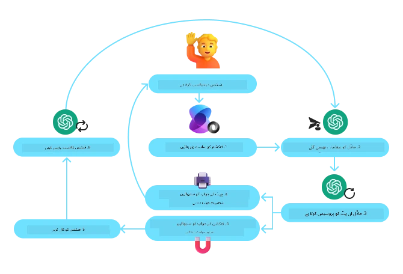
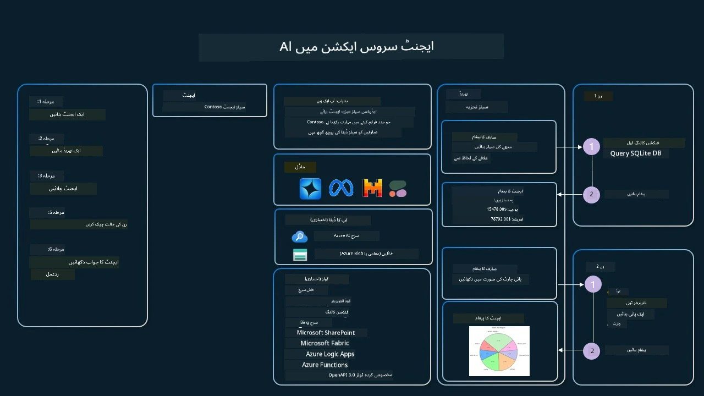

[](https://youtu.be/vieRiPRx-gI?si=cEZ8ApnT6Sus9rhn)

> _(اوپر موجود تصویر پر کلک کریں تاکہ اس سبق کی ویڈیو دیکھی جا سکے)_

# ٹول استعمال کرنے کا ڈیزائن پیٹرن

ٹولز دلچسپ ہیں کیونکہ وہ AI ایجنٹس کو وسیع تر صلاحیتوں کا دائرہ فراہم کرتے ہیں۔ اس کے بجائے کہ ایجنٹ کے پاس محدود ایکشنز کا سیٹ ہو جسے وہ انجام دے سکے، ایک ٹول شامل کرنے سے ایجنٹ اب بہت سے مختلف ایکشنز انجام دے سکتا ہے۔ اس باب میں، ہم ٹول استعمال کرنے کے ڈیزائن پیٹرن کو دیکھیں گے، جو بتاتا ہے کہ AI ایجنٹس مخصوص ٹولز کو اپنے مقاصد کے حصول کے لیے کیسے استعمال کر سکتے ہیں۔

## تعارف

اس سبق میں، ہم درج ذیل سوالات کے جواب تلاش کرنے کی کوشش کر رہے ہیں:

- ٹول استعمال کرنے کا ڈیزائن پیٹرن کیا ہے؟
- یہ کن استعمال کے معاملات پر لاگو کیا جا سکتا ہے؟
- ڈیزائن پیٹرن کو نافذ کرنے کے لیے کن عناصر/بلڈنگ بلاکس کی ضرورت ہوتی ہے؟
- قابل اعتماد AI ایجنٹس بنانے کے لیے ٹول استعمال کرنے کے ڈیزائن پیٹرن کے مخصوص ملاحظات کیا ہیں؟

## سیکھنے کے مقاصد

اس سبق کو مکمل کرنے کے بعد، آپ قابل ہو جائیں گے:

- ٹول استعمال کرنے کے ڈیزائن پیٹرن اور اس کے مقصد کی تعریف کرنا۔
- ایسے استعمال کے معاملات کی نشاندہی کرنا جہاں یہ ڈیزائن پیٹرن قابل اطلاق ہو۔
- ڈیزائن پیٹرن کو نافذ کرنے کے لیے درکار کلیدی عناصر کو سمجھنا۔
- اس ڈیزائن پیٹرن استعمال کرنے والے AI ایجنٹس میں قابلِ اعتماد ہونے کے ملاحظات کو پہچاننا۔

## ٹول استعمال کرنے کا ڈیزائن پیٹرن کیا ہے؟

The **ٹول استعمال کرنے کا ڈیزائن پیٹرن** اس بات پر مرکوز ہے کہ LLMs کو مخصوص مقاصد حاصل کرنے کے لیے بیرونی ٹولز کے ساتھ تعامل کرنے کی صلاحیت دی جائے۔ ٹولز وہ کوڈ ہوتے ہیں جو ایجنٹ کی طرف سے ایکشنز انجام دینے کے لیے چلائے جا سکتے ہیں۔ ایک ٹول ایک سادہ فنکشن ہو سکتا ہے جیسے کیلکولیٹر، یا تیسری پارٹی کی سروس کو کال کرنے والا API جیسا کہ اسٹاک قیمت کی تلاش یا موسمیاتی پیش گوئی۔ AI ایجنٹس کے سیاق و سباق میں، ٹولز کو عام طور پر **ماڈل-جنریٹڈ فنکشن کالز** کے جواب میں ایجنٹس کے ذریعے چلانے کے لیے ڈیزائن کیا جاتا ہے۔

## یہ کن استعمال کے معاملات پر لاگو ہو سکتا ہے؟

AI ایجنٹس پیچیدہ کام مکمل کرنے، معلومات بازیافت کرنے، یا فیصلے کرنے کے لیے ٹولز سے فائدہ اٹھا سکتے ہیں۔ ٹول استعمال کرنے کا ڈیزائن پیٹرن اکثر ایسے منظرناموں میں استعمال ہوتا ہے جن میں بیرونی نظاموں کے ساتھ متحرک تعامل درکار ہوتا ہے، جیسے کہ ڈیٹا بیسز، ویب سروسز، یا کوڈ انٹرپریٹرز۔ یہ صلاحیت متعدد مختلف استعمال کے معاملات کے لیے مفید ہے جن میں شامل ہیں:

- **متحرک معلومات کی بازیافت:** ایجنٹس بیرونی APIs یا ڈیٹا بیسز سے تازہ ترین ڈیٹا حاصل کر سکتے ہیں (مثلاً، ڈیٹا تجزیے کے لیے SQLite ڈیٹا بیس سے استفسار کرنا، اسٹاک کی قیمتیں یا موسم کی معلومات حاصل کرنا)۔
- **کوڈ کا نفاذ اور تشریح:** ایجنٹس ریاضیاتی مسائل حل کرنے، رپورٹس تیار کرنے، یا سیمولیشنز انجام دینے کے لیے کوڈ یا اسکرپٹس چلا سکتے ہیں۔
- **ورک فلو آٹومیشن:** ٹاسک شیڈیولرز، ای میل سروسز، یا ڈیٹا پائپ لائنز جیسے ٹولز کو مربوط کر کے بار بار یا کثیر مرحلوں والے ورک فلو کو خودکار بنانا۔
- **کسٹمر سپورٹ:** ایجنٹس CRM سسٹمز، ٹکٹنگ پلیٹ فارمز، یا نالج بیسز کے ساتھ تعامل کر کے صارف کے استفسارات حل کر سکتے ہیں۔
- **مواد کی تخلیق اور ترمیم:** ایجنٹس گرامر چیکرز، متن کے خلاصہ کار، یا مواد کی حفاظت کے جائزہ کار جیسے ٹولز استعمال کر کے مواد کی تخلیق میں مدد کر سکتے ہیں۔

## ڈیزائن پیٹرن کو نافذ کرنے کے لیے کن عناصر/بلڈنگ بلاکس کی ضرورت ہے؟

یہ بلڈنگ بلاکس AI ایجنٹ کو مختلف قسم کے کام کرنے کے قابل بناتے ہیں۔ آئیے ٹول استعمال کرنے کے ڈیزائن پیٹرن کو نافذ کرنے کے لیے درکار کلیدی عناصر دیکھتے ہیں:

- **Function/Tool Schemas**: دستیاب ٹولز کی تفصیلی تعریفیں، جن میں فنکشن کا نام، مقصد، درکار پیرامیٹرز، اور متوقع آؤٹ پٹس شامل ہیں۔ یہ اسکیمائیں LLM کو سمجھنے کے قابل بناتی ہیں کہ کون سے ٹولز دستیاب ہیں اور درست درخواستیں کیسے تشکیل دی جائیں۔

- **Function Execution Logic**: یہ طے کرتی ہے کہ کن حالات میں اور کب ٹولز کو بلایا جائے، صارف کی نیت اور بات چیت کے سیاق و سباق کی بنیاد پر۔ اس میں پلانر ماڈیولز، روٹنگ میکانزم، یا کنڈیشنل فلو شامل ہو سکتے ہیں جو متحرک طریقے سے ٹول کے استعمال کا فیصلہ کرتے ہیں۔

- **Message Handling System**: وہ اجزاء جو صارف کے ان پٹ، LLM کے جوابات، ٹول کالز، اور ٹول آؤٹ پٹس کے درمیان مکالماتی بہاؤ کو سنبھالتے ہیں۔

- **Tool Integration Framework**: وہ انفراسٹرکچر جو ایجنٹ کو مختلف ٹولز سے جوڑتا ہے، چاہے وہ سادہ فنکشنز ہوں یا پیچیدہ بیرونی سروسز۔

- **Error Handling & Validation**: وہ میکانیزم جو ٹول کے نفاذ میں ناکامیوں کو ہینڈل کرتے ہیں، پیرامیٹرز کی توثیق کرتے ہیں، اور غیر متوقع جوابات کو منظم کرتے ہیں۔

- **State Management**: بات چیت کے سیاق و سباق، پچھلے ٹول تعاملات، اور مستقل ڈیٹا کو ٹریک کرتا ہے تاکہ کثیر موڑ تعاملات میں مستقل مزاجی برقرار رہے۔

اب، آئیے Function/Tool Calling کو مزید تفصیل سے دیکھتے ہیں۔
 
### فنکشن/ٹول کالنگ

فنکشن کالنگ وہ بنیادی طریقہ ہے جس کے ذریعے ہم Large Language Models (LLMs) کو ٹولز کے ساتھ تعامل کرنے کے قابل بناتے ہیں۔ آپ اکثر 'Function' اور 'Tool' کو باری باری استعمال ہوتے دیکھیں گے کیونکہ 'functions' (دوبارہ استعمال کے قابل کوڈ بلاکس) وہ 'tools' ہیں جو ایجنٹس کام انجام دینے کے لیے استعمال کرتے ہیں۔ کسی فنکشن کے کوڈ کو چلانے کے لیے، ایک LLM کو صارف کی درخواست کا موازنہ فنکشن کی وضاحت کے ساتھ کرنا ہوگا۔ اس کے لیے، دستیاب تمام فنکشنز کی وضاحتوں پر مشتمل ایک اسکیمہ LLM کو بھیجا جاتا ہے۔ پھر LLM اس کام کے لیے سب سے موزوں فنکشن کا انتخاب کرتا ہے اور اس کا نام اور دلائل واپس کرتا ہے۔ منتخب شدہ فنکشن کو چلایا جاتا ہے، اس کا جواب واپس LLM کو بھیجا جاتا ہے، جو اس معلومات کو صارف کی درخواست کے جواب میں استعمال کرتا ہے۔

ڈیویلپرز کے لیے ایجنٹس کے لیے فنکشن کالنگ نافذ کرنے کے لیے آپ کو درکار ہوگا:

1. An LLM model that supports function calling
2. A schema containing function descriptions
3. The code for each function described

آئیے ایک شہر میں موجودہ وقت معلوم کرنے کی مثال استعمال کریں تاکہ واضح کریں:

1. **Initialize an LLM that supports function calling:**

    Not all models support function calling, so it's important to check that the LLM you are using does.     <a href="https://learn.microsoft.com/azure/ai-services/openai/how-to/function-calling" target="_blank">Azure OpenAI</a> supports function calling. We can start by initiating the Azure OpenAI client. 

    ```python
    # Azure OpenAI کلائنٹ کو شروع کریں
    client = AzureOpenAI(
        azure_endpoint = os.getenv("AZURE_AI_PROJECT_ENDPOINT"), 
        api_key=os.getenv("AZURE_OPENAI_API_KEY"),  
        api_version="2024-05-01-preview"
    )
    ```

1. **Create a Function Schema**:

    Next we will define a JSON schema that contains the function name, description of what the function does, and the names and descriptions of the function parameters.
    We will then take this schema and pass it to the client created previously, along with the users request to find the time in San Francisco. What's important to note is that a **tool call** is what is returned, **not** the final answer to the question. As mentioned earlier, the LLM returns the name of the function it selected for the task, and the arguments that will be passed to it.

    ```python
    # ماڈل کے پڑھنے کے لیے فنکشن کی وضاحت
    tools = [
        {
            "type": "function",
            "function": {
                "name": "get_current_time",
                "description": "Get the current time in a given location",
                "parameters": {
                    "type": "object",
                    "properties": {
                        "location": {
                            "type": "string",
                            "description": "The city name, e.g. San Francisco",
                        },
                    },
                    "required": ["location"],
                },
            }
        }
    ]
    ```
   
    ```python
  
    # ابتدائی صارف کا پیغام
    messages = [{"role": "user", "content": "What's the current time in San Francisco"}] 
  
    # پہلی API کال: ماڈل سے کہیں کہ فنکشن استعمال کرے
      response = client.chat.completions.create(
          model=deployment_name,
          messages=messages,
          tools=tools,
          tool_choice="auto",
      )
  
      # ماڈل کے جواب کو پراسیس کریں
      response_message = response.choices[0].message
      messages.append(response_message)
  
      print("Model's response:")  

      print(response_message)
  
    ```

    ```bash
    Model's response:
    ChatCompletionMessage(content=None, role='assistant', function_call=None, tool_calls=[ChatCompletionMessageToolCall(id='call_pOsKdUlqvdyttYB67MOj434b', function=Function(arguments='{"location":"San Francisco"}', name='get_current_time'), type='function')])
    ```
  
1. **The function code required to carry out the task:**

    Now that the LLM has chosen which function needs to be run the code that carries out the task needs to be implemented and executed.
    We can implement the code to get the current time in Python. We will also need to write the code to extract the name and arguments from the response_message to get the final result.

    ```python
      def get_current_time(location):
        """Get the current time for a given location"""
        print(f"get_current_time called with location: {location}")  
        location_lower = location.lower()
        
        for key, timezone in TIMEZONE_DATA.items():
            if key in location_lower:
                print(f"Timezone found for {key}")  
                current_time = datetime.now(ZoneInfo(timezone)).strftime("%I:%M %p")
                return json.dumps({
                    "location": location,
                    "current_time": current_time
                })
      
        print(f"No timezone data found for {location_lower}")  
        return json.dumps({"location": location, "current_time": "unknown"})
    ```

     ```python
     # فنکشن کالز کو سنبھالیں
      if response_message.tool_calls:
          for tool_call in response_message.tool_calls:
              if tool_call.function.name == "get_current_time":
     
                  function_args = json.loads(tool_call.function.arguments)
     
                  time_response = get_current_time(
                      location=function_args.get("location")
                  )
     
                  messages.append({
                      "tool_call_id": tool_call.id,
                      "role": "tool",
                      "name": "get_current_time",
                      "content": time_response,
                  })
      else:
          print("No tool calls were made by the model.")  
  
      # دوسری API کال: ماڈل سے حتمی جواب حاصل کریں
      final_response = client.chat.completions.create(
          model=deployment_name,
          messages=messages,
      )
  
      return final_response.choices[0].message.content
     ```

     ```bash
      get_current_time called with location: San Francisco
      Timezone found for san francisco
      The current time in San Francisco is 09:24 AM.
     ```

Function Calling is at the heart of most, if not all agent tool use design, however implementing it from scratch can sometimes be challenging.
As we learned in [Lesson 2](../../../02-explore-agentic-frameworks) agentic frameworks provide us with pre-built building blocks to implement tool use.
 
## ایجنٹک فریم ورکس کے ساتھ ٹول استعمال کی مثالیں

Here are some examples of how you can implement the Tool Use Design Pattern using different agentic frameworks:

### Microsoft Agent Framework

<a href="https://learn.microsoft.com/azure/ai-services/agents/overview" target="_blank">Microsoft Agent Framework</a> ایک اوپن سورس AI فریم ورک ہے جو AI ایجنٹس بنانے کے عمل کو آسان بناتا ہے۔ یہ فنکشن کالنگ کے استعمال کو آسان بناتا ہے اس طریقے سے کہ آپ ٹولز کو Python فنکشنز کے طور پر `@tool` ڈیکورییٹر کے ساتھ تعریف کر سکتے ہیں۔ فریم ورک ماڈل اور آپ کے کوڈ کے درمیان مواصلات کو سنبھالتا ہے۔ یہ `AzureAIProjectAgentProvider` کے ذریعے فائل تلاش اور کوڈ انٹرپریٹر جیسے پہلے سے بنے ہوئے ٹولز تک رسائی بھی فراہم کرتا ہے۔

The following diagram illustrates the process of function calling with the Microsoft Agent Framework:



In the Microsoft Agent Framework, tools are defined as decorated functions. We can convert the `get_current_time` function we saw earlier into a tool by using the `@tool` decorator. The framework will automatically serialize the function and its parameters, creating the schema to send to the LLM.

```python
from agent_framework import tool
from agent_framework.azure import AzureAIProjectAgentProvider
from azure.identity import AzureCliCredential

@tool
def get_current_time(location: str) -> str:
    """Get the current time for a given location"""
    ...

# کلائنٹ بنائیں
provider = AzureAIProjectAgentProvider(credential=AzureCliCredential())

# ایک ایجنٹ بنائیں اور اسے ٹول کے ساتھ چلائیں
agent = await provider.create_agent(name="TimeAgent", instructions="Use available tools to answer questions.", tools=get_current_time)
response = await agent.run("What time is it?")
```
  
### Azure AI Agent Service

<a href="https://learn.microsoft.com/azure/ai-services/agents/overview" target="_blank">Azure AI Agent Service</a> ایک نیا ایجنٹک فریم ورک ہے جو ڈیویلپرز کو محفوظ طریقے سے اعلیٰ معیار کے، اور توسیع پزیر AI ایجنٹس بنانے، تعینات کرنے، اور اسکیل کرنے کا اختیار دیتا ہے بغیر زیریں سطح کے کمپیوٹ اور اسٹوریج وسائل کو مینیج کیے۔ یہ خاص طور پر انٹرپرائز ایپلیکیشنز کے لیے مفید ہے کیونکہ یہ ایک مکمل مینیجڈ سروس ہے جس میں انٹرپرائز گریڈ سیکیورٹی موجود ہے۔

جب براہِ راست LLM API کے ساتھ ترقی کرنے کے مقابلے میں دیکھا جائے، Azure AI Agent Service کچھ فوائد فراہم کرتا ہے، جن میں شامل ہیں:

- خود کار طریقے سے ٹول کالنگ – ٹول کال کو پارس کرنے، ٹول کو invoke کرنے، اور جواب ہینڈل کرنے کی ضرورت نہیں؛ یہ سب سرور-سائیڈ کیا جاتا ہے
- محفوظ طریقے سے منظم ڈیٹا – اپنی گفتگو کی حالت منظم کرنے کے بجائے، آپ تمام ضروری معلومات ذخیرہ کرنے کے لیے threads پر انحصار کر سکتے ہیں
- باکس سے باہر دستیاب ٹولز – وہ ٹولز جو آپ کو آپ کے ڈیٹا سورسز کے ساتھ تعامل کرنے کے لیے دستیاب ہیں، جیسے کہ Bing، Azure AI Search، اور Azure Functions۔

Azure AI Agent Service میں دستیاب ٹولز کو دو زمروں میں تقسیم کیا جا سکتا ہے:

1. Knowledge Tools:
    - <a href="https://learn.microsoft.com/azure/ai-services/agents/how-to/tools/bing-grounding?tabs=python&pivots=overview" target="_blank">Bing سرچ کے ساتھ گراؤنڈنگ</a>
    - <a href="https://learn.microsoft.com/azure/ai-services/agents/how-to/tools/file-search?tabs=python&pivots=overview" target="_blank">فائل تلاش</a>
    - <a href="https://learn.microsoft.com/azure/ai-services/agents/how-to/tools/azure-ai-search?tabs=azurecli%2Cpython&pivots=overview-azure-ai-search" target="_blank">Azure AI سرچ</a>

2. Action Tools:
    - <a href="https://learn.microsoft.com/azure/ai-services/agents/how-to/tools/function-calling?tabs=python&pivots=overview" target="_blank">فنکشن کالنگ</a>
    - <a href="https://learn.microsoft.com/azure/ai-services/agents/how-to/tools/code-interpreter?tabs=python&pivots=overview" target="_blank">کوڈ انٹرپریٹر</a>
    - <a href="https://learn.microsoft.com/azure/ai-services/agents/how-to/tools/openapi-spec?tabs=python&pivots=overview" target="_blank">OpenAPI سے متعین کردہ ٹولز</a>
    - <a href="https://learn.microsoft.com/azure/ai-services/agents/how-to/tools/azure-functions?pivots=overview" target="_blank">Azure Functions</a>

The Agent Service allows us to be able to use these tools together as a `toolset`. It also utilizes `threads` which keep track of the history of messages from a particular conversation.

فرض کریں آپ Contoso نامی کمپنی میں ایک سیلز ایجنٹ ہیں۔ آپ ایک مکالماتی ایجنٹ تیار کرنا چاہتے ہیں جو آپ کے سیلز ڈیٹا کے بارے میں سوالات کے جوابات دے سکے۔

The following image illustrates how you could use Azure AI Agent Service to analyze your sales data:



To use any of these tools with the service we can create a client and define a tool or toolset. To implement this practically we can use the following Python code. The LLM will be able to look at the toolset and decide whether to use the user created function, `fetch_sales_data_using_sqlite_query`, or the pre-built Code Interpreter depending on the user request.

```python 
import os
from azure.ai.projects import AIProjectClient
from azure.identity import DefaultAzureCredential
from fetch_sales_data_functions import fetch_sales_data_using_sqlite_query # fetch_sales_data_using_sqlite_query فنکشن جو fetch_sales_data_functions.py فائل میں پایا جا سکتا ہے۔
from azure.ai.projects.models import ToolSet, FunctionTool, CodeInterpreterTool

project_client = AIProjectClient.from_connection_string(
    credential=DefaultAzureCredential(),
    conn_str=os.environ["PROJECT_CONNECTION_STRING"],
)

# ٹول سیٹ کو ابتدائی بنائیں۔
toolset = ToolSet()

# fetch_sales_data_using_sqlite_query فنکشن کے ساتھ فنکشن کال کرنے والے ایجنٹ کو ابتدائی بنائیں اور اسے ٹول سیٹ میں شامل کریں۔
fetch_data_function = FunctionTool(fetch_sales_data_using_sqlite_query)
toolset.add(fetch_data_function)

# کوڈ انٹرپریٹر ٹول کو ابتدائی بنائیں اور اسے ٹول سیٹ میں شامل کریں۔
code_interpreter = code_interpreter = CodeInterpreterTool()
toolset.add(code_interpreter)

agent = project_client.agents.create_agent(
    model="gpt-4o-mini", name="my-agent", instructions="You are helpful agent", 
    toolset=toolset
)
```

## ٹول استعمال کرنے کے ڈیزائن پیٹرن کو استعمال کرتے ہوئے قابلِ اعتماد AI ایجنٹس بنانے کے لیے مخصوص ملاحظات کیا ہیں؟

LLMs کی طرف سے متحرک طور پر بنائے جانے والے SQL کے بارے میں ایک عام تشویش سیکیورٹی ہے، خاص طور پر SQL injection یا نقصان دہ اقدامات کا خطرہ، جیسے کہ ڈیٹا بیس کو ڈراپ کرنا یا اس میں مداخلت کرنا۔ اگرچہ یہ خدشات جائز ہیں، لیکن انہیں مناسب طریقے سے ڈیٹا بیس تک رسائی کی اجازتیں مرتب کر کے مؤثر طریقے سے کم کیا جا سکتا ہے۔ زیادہ تر ڈیٹا بیسز کے لیے اس کا مطلب یہ ہے کہ ڈیٹا بیس کو read-only کے طور پر کنفیگر کرنا۔ PostgreSQL یا Azure SQL جیسے ڈیٹا بیس سروسز کے لیے، ایپ کو ایک read-only (SELECT) رول تفویض کیا جانا چاہیے۔

ایپ کو ایک محفوظ ماحول میں چلانا مزید تحفظ فراہم کرتا ہے۔ انٹرپرائز منظرناموں میں، عام طور پر ڈیٹا کو آپریشنل سسٹمز سے نکالا اور تبدیل کیا جاتا ہے اور ایک read-only ڈیٹا بیس یا ڈیٹا ویئر ہاؤس میں منتقل کیا جاتا ہے جس کا اسکیما صارف دوست ہوتا ہے۔ یہ طریقہ یقینی بناتا ہے کہ ڈیٹا محفوظ ہے، کارکردگی اور رسائی کے لیے بہتر ہے، اور ایپ کو محدود، صرف پڑھنے کی رسائی حاصل ہے۔

## نمونہ کوڈز

- Python: [Agent Framework](./code_samples/04-python-agent-framework.ipynb)
- .NET: [Agent Framework](./code_samples/04-dotnet-agent-framework.md)

## ٹول استعمال کرنے کے ڈیزائن پیٹرنز کے بارے میں مزید سوالات ہیں؟

Join the [Microsoft Foundry Discord](https://aka.ms/ai-agents/discord) to meet with other learners, attend office hours and get your AI Agents questions answered.

## اضافی وسائل

- <a href="https://microsoft.github.io/build-your-first-agent-with-azure-ai-agent-service-workshop/" target="_blank">Azure AI Agents Service ورکشاپ</a>
- <a href="https://github.com/Azure-Samples/contoso-creative-writer/tree/main/docs/workshop" target="_blank">Contoso Creative Writer Multi-Agent ورکشاپ</a>
- <a href="https://learn.microsoft.com/azure/ai-services/agents/overview" target="_blank">Microsoft Agent Framework کا جائزہ</a>

## پچھلا سبق

[ایجنٹک ڈیزائن پیٹرنز کو سمجھنا](../03-agentic-design-patterns/README.md)

## اگلا سبق
[ایجنٹک آر اے جی](../05-agentic-rag/README.md)

---

<!-- CO-OP TRANSLATOR DISCLAIMER START -->
اعلانِ عدم ذمہ داری:
اس دستاویز کا ترجمہ AI ترجمہ سروس [Co-op Translator](https://github.com/Azure/co-op-translator) کا استعمال کرتے ہوئے کیا گیا ہے۔ اگرچہ ہم درستگی کے لیے کوشاں ہیں، براہِ کرم نوٹ کریں کہ خودکار تراجم میں غلطیاں یا عدم درستی ہو سکتی ہے۔ اصل دستاویز اپنی مادری زبان میں ہی مستند ذریعہ سمجھی جانی چاہیے۔ اہم معلومات کے لیے پیشہ ور انسانی ترجمہ کی سفارش کی جاتی ہے۔ اس ترجمے کے استعمال سے پیدا ہونے والی کسی بھی غلط فہمی یا غلط تشریح کے لیے ہم ذمہ دار نہیں ہیں۔
<!-- CO-OP TRANSLATOR DISCLAIMER END -->