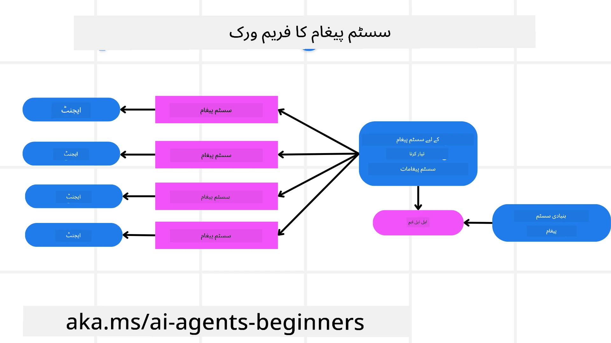
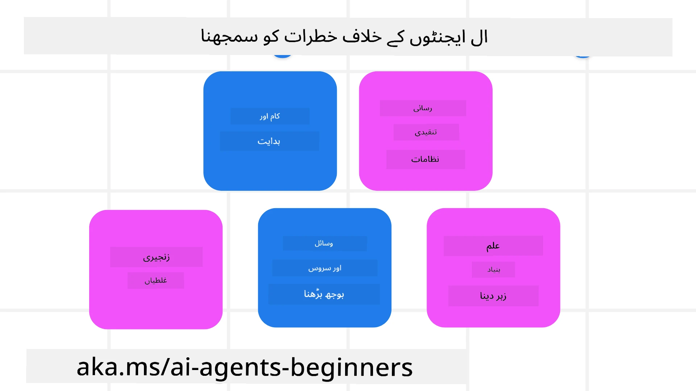
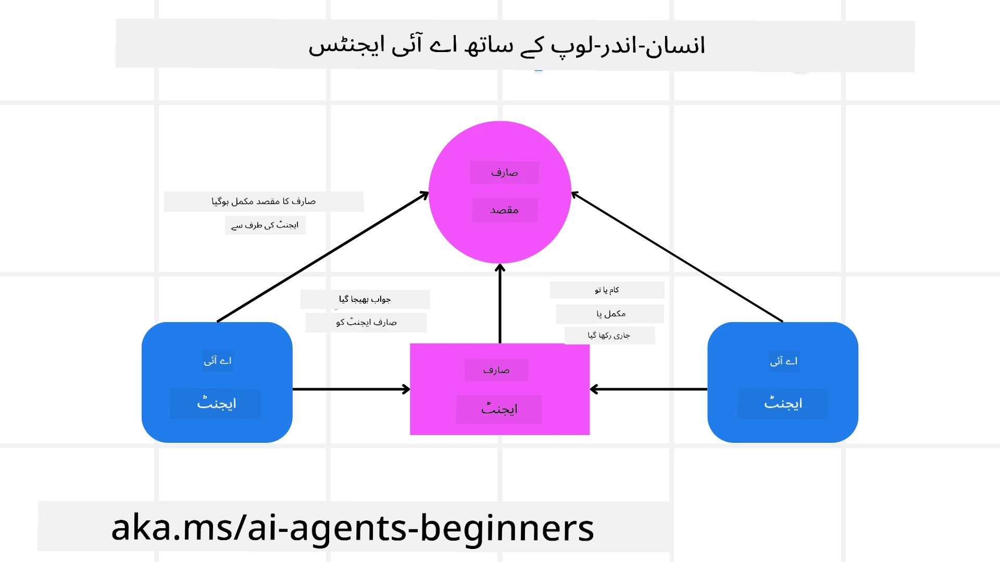

[](https://youtu.be/iZKkMEGBCUQ?si=Q-kEbcyHUMPoHp8L)

> _(اس سبق کا ویڈیو دیکھنے کے لیے اوپر والی تصویر پر کلک کریں)_

# قابلِ اعتماد AI ایجنٹس بنانا

## تعارف

یہ سبق درج ذیل موضوعات کا احاطہ کرے گا:

- محفوظ اور مؤثر AI ایجنٹس کو کیسے بنائیں اور تعینات کریں
- AI ایجنٹس تیار کرتے وقت اہم سیکیورٹی نکات
- AI ایجنٹس تیار کرتے وقت ڈیٹا اور صارف کی رازداری کو کیسے برقرار رکھیں

## تعلیمی اہداف

اس سبق مکمل کرنے کے بعد، آپ جان سکیں گے کہ کیسے:

- AI ایجنٹس بناتے وقت خطرات کی شناخت اور ان کا تدارک کریں۔
- اس بات کو یقینی بنانے کے لیے سیکیورٹی اقدامات نافذ کریں کہ ڈیٹا اور رسائی مناسب طریقے سے منظم ہوں۔
- ایسے AI ایجنٹس بنائیں جو ڈیٹا کی رازداری برقرار رکھیں اور معیاری صارف تجربہ فراہم کریں۔

## حفاظت

آئیے پہلے محفوظ ایجنٹ ایپلی کیشنز بنانے پر نظر ڈالیں۔ حفاظت کا مطلب ہے کہ AI ایجنٹ اپنی متعین کردہ کارکردگی انجام دے۔ ایجنٹ ایپلی کیشنز بنانے والوں کے طور پر، ہمارے پاس حفاظت کو زیادہ سے زیادہ یقینی بنانے کے طریقے اور اوزار موجود ہیں:

### ایک سسٹم پیغام فریم ورک بنانا

اگر آپ نے کبھی Large Language Models (LLMs) استعمال کرکے AI ایپلی کیشن بنائی ہے، تو آپ جانتے ہیں کہ مضبوط سسٹم پرامپٹ یا سسٹم پیغام ڈیزائن کرنے کی اہمیت کیا ہے۔ یہ پرامپٹس وہ میٹا قواعد، ہدایات، اور رہنما اصول قائم کرتے ہیں جن کے تحت LLM صارف اور ڈیٹا کے ساتھ تعامل کرے گا۔

AI ایجنٹس کے لیے، سسٹم پرامپٹ اور بھی زیادہ اہم ہوتا ہے کیونکہ AI ایجنٹس کو ہمارے تیار کردہ کام مکمل کرنے کے لیے بہت مخصوص ہدایات درکار ہوں گی۔

قابلِ توسیع سسٹم پرامپٹس بنانے کے لیے، ہم اپنے ایپلیکیشن میں ایک یا زیادہ ایجنٹس بنانے کے لیے سسٹم پیغام فریم ورک استعمال کر سکتے ہیں:



#### مرحلہ 1: ایک میٹا سسٹم پیغام بنائیں 

یہ میٹا پرامپٹ LLM کی جانب سے ہمارے بنائے گئے ایجنٹس کے لیے سسٹم پرامپٹس تیار کرنے کے لیے استعمال ہوگا۔ ہم اسے ایک ٹیمپلیٹ کی صورت میں ڈیزائن کرتے ہیں تاکہ ضرورت پڑنے پر ہم مؤثر طریقے سے متعدد ایجنٹس بنا سکیں۔

یہاں ایک مثال ہے میٹا سسٹم پیغام کی جو ہم LLM کو دیں گے:

```plaintext
You are an expert at creating AI agent assistants. 
You will be provided a company name, role, responsibilities and other
information that you will use to provide a system prompt for.
To create the system prompt, be descriptive as possible and provide a structure that a system using an LLM can better understand the role and responsibilities of the AI assistant. 
```

#### مرحلہ 2: ایک بنیادی پرامپٹ بنائیں

اگلا قدم AI ایجنٹ کو بیان کرنے کے لیے ایک بنیادی پرامپٹ بنانا ہے۔ آپ کو ایجنٹ کے کردار، وہ کام جو ایجنٹ مکمل کرے گا، اور ایجنٹ کی دیگر ذمہ داریوں کو شامل کرنا چاہیے۔

مثال یہاں ہے:

```plaintext
You are a travel agent for Contoso Travel that is great at booking flights for customers. To help customers you can perform the following tasks: lookup available flights, book flights, ask for preferences in seating and times for flights, cancel any previously booked flights and alert customers on any delays or cancellations of flights.  
```

#### مرحلہ 3: بنیادی سسٹم پیغام LLM کو فراہم کریں

اب ہم اس سسٹم پیغام کو بہتر بنا سکتے ہیں، میٹا سسٹم پیغام کو سسٹم پیغام کے طور پر استعمال کرتے ہوئے اور ہمارا بنیادی سسٹم پیغام بھی شامل کریں۔

اس سے ایک ایسا سسٹم پیغام تیار ہوگا جو ہمارے AI ایجنٹس کی رہنمائی کے لیے بہتر ڈیزائن کیا گیا ہوگا:

```markdown
**Company Name:** Contoso Travel  
**Role:** Travel Agent Assistant

**Objective:**  
You are an AI-powered travel agent assistant for Contoso Travel, specializing in booking flights and providing exceptional customer service. Your main goal is to assist customers in finding, booking, and managing their flights, all while ensuring that their preferences and needs are met efficiently.

**Key Responsibilities:**

1. **Flight Lookup:**
    
    - Assist customers in searching for available flights based on their specified destination, dates, and any other relevant preferences.
    - Provide a list of options, including flight times, airlines, layovers, and pricing.
2. **Flight Booking:**
    
    - Facilitate the booking of flights for customers, ensuring that all details are correctly entered into the system.
    - Confirm bookings and provide customers with their itinerary, including confirmation numbers and any other pertinent information.
3. **Customer Preference Inquiry:**
    
    - Actively ask customers for their preferences regarding seating (e.g., aisle, window, extra legroom) and preferred times for flights (e.g., morning, afternoon, evening).
    - Record these preferences for future reference and tailor suggestions accordingly.
4. **Flight Cancellation:**
    
    - Assist customers in canceling previously booked flights if needed, following company policies and procedures.
    - Notify customers of any necessary refunds or additional steps that may be required for cancellations.
5. **Flight Monitoring:**
    
    - Monitor the status of booked flights and alert customers in real-time about any delays, cancellations, or changes to their flight schedule.
    - Provide updates through preferred communication channels (e.g., email, SMS) as needed.

**Tone and Style:**

- Maintain a friendly, professional, and approachable demeanor in all interactions with customers.
- Ensure that all communication is clear, informative, and tailored to the customer's specific needs and inquiries.

**User Interaction Instructions:**

- Respond to customer queries promptly and accurately.
- Use a conversational style while ensuring professionalism.
- Prioritize customer satisfaction by being attentive, empathetic, and proactive in all assistance provided.

**Additional Notes:**

- Stay updated on any changes to airline policies, travel restrictions, and other relevant information that could impact flight bookings and customer experience.
- Use clear and concise language to explain options and processes, avoiding jargon where possible for better customer understanding.

This AI assistant is designed to streamline the flight booking process for customers of Contoso Travel, ensuring that all their travel needs are met efficiently and effectively.

```

#### مرحلہ 4: دہرائیں اور بہتر کریں

اس سسٹم پیغام فریم ورک کی قدر یہ ہے کہ یہ متعدد ایجنٹس کے لیے سسٹم پیغامات بنانا آسان اور قابلِ توسیع بناتا ہے اور ساتھ ہی وقت کے ساتھ آپ کے سسٹم پیغامات کو بہتر بناتا ہے۔ شاذ و نادر ہی ایسا ہوتا ہے کہ آپ کا سسٹم پیغام پہلی بار میں ہی آپ کے مکمل استعمال کے کیس کے لیے کام کرے۔ بنیادی سسٹم پیغام میں چھوٹی تبدیلیاں کر کے اور اسے سسٹم کے ذریعے چلا کر آپ نتائج کا موازنہ اور جائزہ لے سکیں گے۔

## خطرات کو سمجھنا

قابلِ اعتماد AI ایجنٹس بنانے کے لیے، یہ ضروری ہے کہ آپ اپنے AI ایجنٹ کے خطرات اور دھمکیوں کو سمجھیں اور ان کا تدارک کریں۔ آئیے AI ایجنٹس کے مختلف خطرات میں سے کچھ اور ان کے لیے بہتر منصوبہ بندی اور تیاری کے طریقے دیکھتے ہیں۔



### کام اور ہدایات

**تفصیل:** حملہ آور پرامپٹنگ یا ان پٹس میں تبدیلی کے ذریعے AI ایجنٹ کی ہدایات یا مقاصد بدلنے کی کوشش کرتے ہیں۔

**تدارک**: AI ایجنٹ کے پروسیس کرنے سے پہلے ممکنہ خطرناک پرامپٹس کا پتہ لگانے کے لیے ویلیڈیشن چیک اور ان پٹ فلٹرز چلائیں۔ چونکہ یہ حملے عام طور پر ایجنٹ کے ساتھ کثرت سے تعامل کا تقاضا کرتے ہیں، گفتگو میں گردشوں (turns) کی تعداد محدود کرنا بھی ایسی حملوں کو روکنے کا ایک طریقہ ہے۔

### اہم نظاموں تک رسائی

**تفصیل**: اگر AI ایجنٹ کو ایسے نظاموں اور خدمات تک رسائی حاصل ہے جو حساس ڈیٹا اسٹور کرتی ہیں، تو حملہ آور ایجنٹ اور ان خدمات کے درمیان مواصلت کو متاثر کر سکتے ہیں۔ یہ براہِ راست حملے ہو سکتے ہیں یا ایجنٹ کے ذریعے ان نظاموں کے بارے میں معلومات حاصل کرنے کی بالواسطہ کوششیں ہو سکتی ہیں۔

**تدارک**: ان قسم کے حملوں کو روکنے کے لیے AI ایجنٹس کو صرف ضرورت کی بنیاد پر ہی نظاموں تک رسائی ہونی چاہیے۔ ایجنٹ اور نظام کے درمیان مواصلت بھی محفوظ ہونی چاہیے۔ توثیق (authentication) اور رسائی کنٹرول لاگو کرنا اس معلومات کو محفوظ رکھنے کا ایک اور طریقہ ہے۔

### وسائل اور خدمات کا اوورلوڈنگ

**تفصیل:** AI ایجنٹس مختلف ٹولز اور خدمات تک رسائی حاصل کر کے کام مکمل کر سکتے ہیں۔ حملہ آور اس صلاحیت کا استعمال ان خدمات پر حملہ کرنے کے لیے کر سکتے ہیں، AI ایجنٹ کے ذریعے بڑی تعداد میں درخواستیں بھیج کر، جو نظام کی خرابیوں یا زیادہ لاگت کا سبب بن سکتی ہیں۔

**تدارک:** اس بات کی پالیسیز نافذ کریں کہ AI ایجنٹ کسی سروس کو کتنی درخواستیں بھیج سکتا ہے۔ اپنی AI ایجنٹ کے لیے گفتگو کے گردشوں اور درخواستوں کی تعداد محدود کرنا بھی ان حملوں کو روکنے کا ایک طریقہ ہے۔

### نالج بیس میں زہریلا پن

**تفصیل:** اس قسم کا حملہ براہِ راست AI ایجنٹ کو نشانہ نہیں بناتا بلکہ نالج بیس اور دیگر خدمات کو نشانہ بناتا ہے جو AI ایجنٹ استعمال کرے گا۔ اس میں ایسے ڈیٹا یا معلومات کو خراب کرنا شامل ہو سکتا ہے جو AI ایجنٹ کسی کام کو مکمل کرنے کے لیے استعمال کرے گا، جس کے نتیجے میں صارف کو جانبدار یا غیر مطلوبہ جوابات مل سکتے ہیں۔

**تدارک:** AI ایجنٹ اپنے ورک فلو میں جو ڈیٹا استعمال کرے گا اس کی باقاعدگی سے تصدیق کریں۔ اس ڈیٹا تک رسائی کو محفوظ رکھیں اور یہ یقینی بنائیں کہ صرف معتبر افراد ہی اس میں تبدیلی کر سکیں تاکہ اس قسم کے حملے سے بچا جا سکے۔

### زنجیری خامیاں

**تفصیل:** AI ایجنٹس مختلف ٹولز اور خدمات تک رسائی حاصل کرتے ہیں تاکہ کام مکمل کر سکیں۔ حملہ آوروں کی وجہ سے پیدا ہونے والی خامیاں دوسرے نظاموں کی ناکامی کا سبب بن سکتی ہیں جن سے AI ایجنٹ منسلک ہوتا ہے، جس سے حملہ وسیع تر اور خرابی کی تشخیص مشکل ہو جاتی ہے۔

**تدارک**: اس سے بچنے کا ایک طریقہ یہ ہے کہ AI ایجنٹ کو محدود ماحول میں چلایا جائے، مثلاً Docker کنٹینر میں کام انجام دینا، تاکہ براہِ راست سسٹم حملوں سے بچا جا سکے۔ جب کچھ نظام غلطی کا جواب دیں تو بیک اپ میکانزمز اور دوبارہ کوشش (retry) لاجک بنانا بڑے نظامی نقصانات کو روکنے کا ایک اور طریقہ ہے۔

## انسان کو لوپ میں شامل کرنا

قابلِ اعتماد AI ایجنٹ سسٹم بنانے کا ایک اور مؤثر طریقہ 'Human-in-the-loop' ہے۔ اس سے ایک ایسا عمل بنتا ہے جہاں صارفین رن کے دوران ایجنٹس کو فیڈ بیک دے سکتے ہیں۔ بنیادی طور پر صارفین ایک کثیر ایجنٹ سسٹم میں ایجنٹس کی مانند عمل کرتے ہیں اور رننگ پروسیس کی منظوری یا ختم کرنے کا اختیار فراہم کرتے ہیں۔



یہاں Microsoft Agent Framework استعمال کرتے ہوئے ایک کوڈ سنِپِٹ ہے جو دکھاتا ہے کہ یہ تصور کیسے نافذ کیا جاتا ہے:

```python
import os
from agent_framework.azure import AzureAIProjectAgentProvider
from azure.identity import AzureCliCredential

# انسانی منظوری کے عمل کے ساتھ فراہم کنندہ بنائیں
provider = AzureAIProjectAgentProvider(
    credential=AzureCliCredential(),
)

# انسانی منظوری کے مرحلے کے ساتھ ایجنٹ بنائیں
response = provider.create_response(
    input="Write a 4-line poem about the ocean.",
    instructions="You are a helpful assistant. Ask for user approval before finalizing.",
)

# صارف جواب کا جائزہ لے سکتا ہے اور اسے منظور کر سکتا ہے
print(response.output_text)
user_input = input("Do you approve? (APPROVE/REJECT): ")
if user_input == "APPROVE":
    print("Response approved.")
else:
    print("Response rejected. Revising...")
```

## نتیجہ

قابلِ اعتماد AI ایجنٹس بنانے کے لیے محتاط ڈیزائن، مضبوط سیکیورٹی اقدامات، اور مسلسل بہتری درکار ہے۔ ساختی میٹا پرامپٹنگ سسٹمز نافذ کر کے، ممکنہ خطرات کو سمجھ کر، اور تدارکی حکمتِ عملیاں اپناتے ہوئے، ڈویلپر ایسے AI ایجنٹس تشکیل دے سکتے ہیں جو محفوظ اور مؤثر دونوں ہوں۔ علاوہ ازیں، human-in-the-loop طریقہ اپنانا یقینی بناتا ہے کہ AI ایجنٹس صارفین کی ضروریات کے مطابق رہیں جبکہ خطرات کم کیے جائیں۔ جیسے جیسے AI ترقی کرتا ہے، سیکیورٹی، رازداری، اور اخلاقی پہلوؤں کے بارے میں پیش قدمی رویہ برقرار رکھنا AI سے چلنے والے سسٹمز میں اعتماد اور قابلِ اعتمادیت پیدا کرنے کی کنجی ہوگا۔

### کیا آپ کے پاس قابلِ اعتماد AI ایجنٹس بنانے کے بارے میں مزید سوالات ہیں؟

دیگر سیکھنے والوں سے ملنے، آفس آورز میں شریک ہونے اور اپنے AI ایجنٹس کے سوالات کے جواب حاصل کرنے کے لیے [Microsoft Foundry ڈسکارڈ](https://aka.ms/ai-agents/discord) میں شامل ہوں۔

## اضافی وسائل

- <a href="https://learn.microsoft.com/azure/ai-studio/responsible-use-of-ai-overview" target="_blank">ذمہ دار AI کا جائزہ</a>
- <a href="https://learn.microsoft.com/azure/ai-studio/concepts/evaluation-approach-gen-ai" target="_blank">جنریٹو AI ماڈلز اور AI ایپلیکیشنز کا جائزہ</a>
- <a href="https://learn.microsoft.com/azure/ai-services/openai/concepts/system-message?context=%2Fazure%2Fai-studio%2Fcontext%2Fcontext&tabs=top-techniques" target="_blank">حفاظتی سسٹم پیغامات</a>
- <a href="https://blogs.microsoft.com/wp-content/uploads/prod/sites/5/2022/06/Microsoft-RAI-Impact-Assessment-Template.pdf?culture=en-us&country=us" target="_blank">خطرے کا جائزہ ٹیمپلیٹ</a>

## پچھلا سبق

[ایجنٹک RAG](../05-agentic-rag/README.md)

## اگلا سبق

[منصوبہ بندی ڈیزائن پیٹرن](../07-planning-design/README.md)

---

<!-- CO-OP TRANSLATOR DISCLAIMER START -->
اعلانِ عدمِ ذمہ داری:
اس دستاویز کا ترجمہ اے آئی ترجمہ سروس Co-op Translator (https://github.com/Azure/co-op-translator) کے ذریعے کیا گیا ہے۔ اگرچہ ہم درستگی کے لیے کوشاں ہیں، براہِ کرم نوٹ کریں کہ خودکار ترجموں میں غلطیاں یا عدمِ درستگی ہو سکتی ہیں۔ اصل دستاویز اپنی مادری زبان میں ہی معتبر ماخذ تصور کی جانی چاہیے۔ اہم معلومات کے لیے پیشہ ورانہ انسانی ترجمہ کی سفارش کی جاتی ہے۔ اس ترجمے کے استعمال سے پیدا ہونے والی کسی بھی قسم کی غلط فہمی یا غلط تعبیر کے لیے ہم ذمہ دار نہیں ہیں۔
<!-- CO-OP TRANSLATOR DISCLAIMER END -->