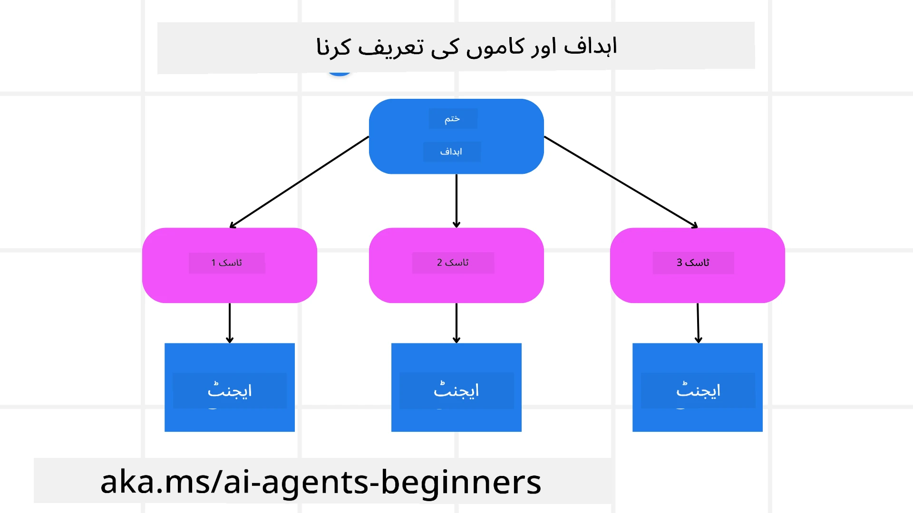

[](https://youtu.be/kPfJ2BrBCMY?si=9pYpPXp0sSbK91Dr)

> _(اوپر والی تصویر پر کلک کریں تاکہ اس سبق کی ویڈیو دیکھی جا سکے)_

# منصوبہ بندی کا ڈیزائن

## تعارف

یہ سبق مندرجہ ذیل موضوعات کا احاطہ کرے گا

* ایک واضح مجموعی مقصد کی تعریف کرنا اور ایک پیچیدہ کام کو قابلِ انتظام ذیلی کاموں میں تقسیم کرنا۔
* مزید قابلِ اعتماد اور مشین-قابلِ مطالعہ جوابات کے لیے ساختہ آؤٹ پٹ کا استعمال۔
* متحرک کاموں اور غیر متوقع ان پٹس کو سنبھالنے کے لیے ایونٹ-ڈرائیون طریقہ کار کا اطلاق۔

## سیکھنے کے مقاصد

اس سبق کے مکمل ہونے کے بعد، آپ کو مندرجہ ذیل چیزوں کی سمجھ حاصل ہوگی:

* ایک AI ایجنٹ کے لیے ایک مجموعی مقصد کی شناخت اور تعین کرنا، تاکہ وہ واضح طور پر جان سکے کہ کیا حاصل کرنا ہے۔
* ایک پیچیدہ کام کو قابلِ انتظام ذیلی کاموں میں تقسیم کرنا اور انہیں منطقی ترتیب میں منظم کرنا۔
* ایجنٹس کو مناسب اوزار (مثلاً تلاش کے اوزار یا ڈیٹا اینالیٹکس کے اوزار) سے لیس کرنا، یہ فیصلہ کرنا کہ انہیں کب اور کیسے استعمال کیا جائے، اور سامنے آنے والی غیر متوقع صورتحال سے نمٹنا۔
* ذیلی کاموں کے نتائج کا جائزہ لینا، کارکردگی کی پیمائش کرنا، اور حتمی آؤٹ پٹ کو بہتر بنانے کے لیے کارروائیوں میں تکرار کرنا۔

## مجموعی مقصد کی تعریف اور ایک کام کو تقسیم کرنا



زیادہ تر حقیقی دنیا کے کام ایک ہی قدم میں نپٹنے کے لیے بہت پیچیدہ ہوتے ہیں۔ ایک AI ایجنٹ کو اپنی منصوبہ بندی اور اقدامات کی رہنمائی کے لیے ایک مختصر مقصد درکار ہوتا ہے۔ مثال کے طور پر، درج ذیل مقصد پر غور کریں:

    "3 دن کا سفرنامہ تیار کریں۔"

اگرچہ اس کا بیان کرنا آسان ہے، مگر اسے بہتر بنانے کی ضرورت ہے۔ جتنا واضح مقصد ہوگا، اتنا بہتر ایجنٹ (اور کوئی بھی انسانی شریک کار) صحیح نتیجہ حاصل کرنے پر توجہ مرکوز کر سکتے ہیں، مثلاً پرواز کے اختیارات، ہوٹل کی سفارشات، اور سرگرمیوں کی تجاویز کے ساتھ ایک مکمل سفرنامہ بنانا۔

### کام کی تقسیم

بڑے یا پیچیدہ کام چھوٹے، مقصد-محور ذیلی کاموں میں تقسیم ہونے پر زیادہ قابلِ انتظام بن جاتے ہیں۔
سفرنامے کی مثال کے لیے، آپ مقصد کو مندرجہ ذیل میں تقسیم کر سکتے ہیں:

* پرواز کی بکنگ
* ہوٹل کی بکنگ
* کار کرائے پر لینا
* شخصی تخصیص

ہر ذیلی کام کو پھر مخصوص ایجنٹس یا عمل کے ذریعے نمٹایا جا سکتا ہے۔ ایک ایجنٹ بہترین پرواز کے ڈیلز تلاش کرنے میں مہارت رکھ سکتا ہے، دوسرا ہوٹل بکنگ پر توجہ دیتا ہے، وغیرہ۔ ایک کوآرڈینیٹنگ یا "ڈاؤن اسٹریم" ایجنٹ پھر ان نتائج کو ایک مربوط سفرنامے میں مرتب کر کے اختتامی صارف تک پہنچا سکتا ہے۔

یہ ماڈیولر طریقہ کار بتدریج بہتری کی بھی اجازت دیتا ہے۔ مثال کے طور پر، آپ فوڈ سفارشات یا مقامی سرگرمیوں کی تجاویز کے لیے مخصوص ایجنٹس شامل کر سکتے ہیں اور وقت کے ساتھ ساتھ سفرنامے کو بہتر بنا سکتے ہیں۔

### ساختہ آؤٹ پٹ

بڑے لینگویج ماڈلز (LLMs) ساختہ آؤٹ پٹ (مثلاً JSON) پیدا کر سکتے ہیں جو نیچے کے ایجنٹس یا خدمات کے لیے پارس اور پروسیس کرنا آسان ہوتا ہے۔ یہ خاص طور پر ملٹی-ایجنٹ سیاق و سباق میں مفید ہے، جہاں ہم پلاننگ آؤٹ پٹ موصول ہونے کے بعد ان کاموں کو عمل میں لا سکتے ہیں۔

مندرجہ ذیل Python نمونہ ایک سادہ پلاننگ ایجنٹ کو دکھاتا ہے جو ایک مقصد کو ذیلی کاموں میں تقسیم کرتا ہے اور ایک ساختہ منصوبہ تیار کرتا ہے:

```python
from pydantic import BaseModel
from enum import Enum
from typing import List, Optional, Union
import json
import os
from typing import Optional
from pprint import pprint
from agent_framework.azure import AzureAIProjectAgentProvider
from azure.identity import AzureCliCredential

class AgentEnum(str, Enum):
    FlightBooking = "flight_booking"
    HotelBooking = "hotel_booking"
    CarRental = "car_rental"
    ActivitiesBooking = "activities_booking"
    DestinationInfo = "destination_info"
    DefaultAgent = "default_agent"
    GroupChatManager = "group_chat_manager"

# سفر کے ذیلی کام کا ماڈل
class TravelSubTask(BaseModel):
    task_details: str
    assigned_agent: AgentEnum  # ہم یہ کام ایجنٹ کو تفویض کرنا چاہتے ہیں

class TravelPlan(BaseModel):
    main_task: str
    subtasks: List[TravelSubTask]
    is_greeting: bool

provider = AzureAIProjectAgentProvider(credential=AzureCliCredential())

# صارف کا پیغام متعین کریں
system_prompt = """You are a planner agent.
    Your job is to decide which agents to run based on the user's request.
    Provide your response in JSON format with the following structure:
{'main_task': 'Plan a family trip from Singapore to Melbourne.',
 'subtasks': [{'assigned_agent': 'flight_booking',
               'task_details': 'Book round-trip flights from Singapore to '
                               'Melbourne.'}
    Below are the available agents specialised in different tasks:
    - FlightBooking: For booking flights and providing flight information
    - HotelBooking: For booking hotels and providing hotel information
    - CarRental: For booking cars and providing car rental information
    - ActivitiesBooking: For booking activities and providing activity information
    - DestinationInfo: For providing information about destinations
    - DefaultAgent: For handling general requests"""

user_message = "Create a travel plan for a family of 2 kids from Singapore to Melbourne"

response = client.create_response(input=user_message, instructions=system_prompt)

response_content = response.output_text
pprint(json.loads(response_content))
```

### ملٹی-ایجنٹ آرکسٹریشن کے ساتھ پلاننگ ایجنٹ

اس مثال میں، ایک Semantic Router Agent صارف کی درخواست وصول کرتا ہے (مثلاً، "مجھے اپنے سفر کے لیے ہوٹل پلان چاہیے۔")۔

پلانر پھر:

* ہوٹل پلان وصول کرتا ہے: پلانر صارف کا پیغام لیتا ہے اور سسٹم پرامپٹ (دستیاب ایجنٹس کی تفصیلات شامل) کی بنیاد پر ایک ساختہ سفری منصوبہ بناتا ہے۔
* ایجنٹس اور ان کے اوزار کی فہرست بناتا ہے: ایجنٹ رجسٹری میں ایجنٹس کی فہرست موجود ہوتی ہے (مثلاً پرواز، ہوٹل، کار کرائے پر لینے، اور سرگرمیاں) اور ان کے فراہم کردہ فنکشنز یا اوزار شامل ہوتے ہیں۔
* منصوبے کو متعلقہ ایجنٹس تک پہنچاتا ہے: ذیلی کاموں کی تعداد کے مطابق، پلانر پیغام کو یا تو براہِ راست مخصوص ایجنٹ کو بھیجتا ہے (ایک ٹاسک صورتِ حال میں) یا ملٹی-ایجنٹ تعاون کے لیے گروپ چیٹ مینیجر کے ذریعے ہم آہنگی کرتا ہے۔
* نتیجہ کا خلاصہ کرتا ہے: آخر میں، پلانر واضحی کے لیے بنائے گئے منصوبے کا خلاصہ کرتا ہے۔
مندرجہ ذیل Python کوڈ نمونہ ان مراحل کی وضاحت کرتا ہے:

```python

from pydantic import BaseModel

from enum import Enum
from typing import List, Optional, Union

class AgentEnum(str, Enum):
    FlightBooking = "flight_booking"
    HotelBooking = "hotel_booking"
    CarRental = "car_rental"
    ActivitiesBooking = "activities_booking"
    DestinationInfo = "destination_info"
    DefaultAgent = "default_agent"
    GroupChatManager = "group_chat_manager"

# سفر کا ذیلی کام ماڈل

class TravelSubTask(BaseModel):
    task_details: str
    assigned_agent: AgentEnum # ہم اس کام کو ایجنٹ کو تفویض کرنا چاہتے ہیں

class TravelPlan(BaseModel):
    main_task: str
    subtasks: List[TravelSubTask]
    is_greeting: bool
import json
import os
from typing import Optional

from agent_framework.azure import AzureAIProjectAgentProvider
from azure.identity import AzureCliCredential

# کلائنٹ بنائیں

provider = AzureAIProjectAgentProvider(credential=AzureCliCredential())

from pprint import pprint

# صارف کا پیغام متعین کریں

system_prompt = """You are a planner agent.
    Your job is to decide which agents to run based on the user's request.
    Below are the available agents specialized in different tasks:
    - FlightBooking: For booking flights and providing flight information
    - HotelBooking: For booking hotels and providing hotel information
    - CarRental: For booking cars and providing car rental information
    - ActivitiesBooking: For booking activities and providing activity information
    - DestinationInfo: For providing information about destinations
    - DefaultAgent: For handling general requests"""

user_message = "Create a travel plan for a family of 2 kids from Singapore to Melbourne"

response = client.create_response(input=user_message, instructions=system_prompt)

response_content = response.output_text

# JSON کے طور پر لوڈ کرنے کے بعد جواب کا مواد پرنٹ کریں

pprint(json.loads(response_content))
```

درج ذیل پچھلے کوڈ کا آؤٹ پٹ ہے اور آپ اس ساختہ آؤٹ پٹ کو `assigned_agent` کی طرف بھیجنے اور اختتامی صارف کے لیے سفری منصوبہ کا خلاصہ کرنے کے لیے استعمال کر سکتے ہیں۔

```json
{
    "is_greeting": "False",
    "main_task": "Plan a family trip from Singapore to Melbourne.",
    "subtasks": [
        {
            "assigned_agent": "flight_booking",
            "task_details": "Book round-trip flights from Singapore to Melbourne."
        },
        {
            "assigned_agent": "hotel_booking",
            "task_details": "Find family-friendly hotels in Melbourne."
        },
        {
            "assigned_agent": "car_rental",
            "task_details": "Arrange a car rental suitable for a family of four in Melbourne."
        },
        {
            "assigned_agent": "activities_booking",
            "task_details": "List family-friendly activities in Melbourne."
        },
        {
            "assigned_agent": "destination_info",
            "task_details": "Provide information about Melbourne as a travel destination."
        }
    ]
}
```

پچھلے کوڈ نمونے کے ساتھ ایک مثال نوٹ بک [یہاں](07-python-agent-framework.ipynb) دستیاب ہے۔

### تکراری منصوبہ بندی

کچھ کاموں کے لیے باہمی تبادلے یا دوبارہ منصوبہ بندی کی ضرورت ہوتی ہے، جہاں ایک ذیلی کام کا نتیجہ اگلے کو متاثر کرتا ہے۔ مثال کے طور پر، اگر ایجنٹ پروازیں بک کرتے وقت غیر متوقع ڈیٹا فارمیٹ دریافت کرتا ہے، تو اسے ہوٹل بکنگ پر جانے سے پہلے اپنی حکمت عملی کو ایڈجسٹ کرنے کی ضرورت پڑ سکتی ہے۔

اضافہ ازیں، صارف کی رائے (مثلاً اگر کسی انسان نے فیصلہ کیا کہ وہ پہلے والی پرواز کو ترجیح دیتا ہے) جزوی دوبارہ منصوبہ بندی کو متحرک کر سکتی ہے۔ یہ متحرک، تکراری طریقہ کار یقینی بناتا ہے کہ حتمی حل حقیقی دنیا کی پابندیوں اور بدلتی ہوئی صارف ترجیحات کے مطابق ہو۔

مثلاً نمونہ کوڈ

```python
from agent_framework.azure import AzureAIProjectAgentProvider
from azure.identity import AzureCliCredential
#.. پہلے والے کوڈ کی طرح اور صارف کی تاریخ اور موجودہ منصوبہ آگے بھیجیں

system_prompt = """You are a planner agent to optimize the
    Your job is to decide which agents to run based on the user's request.
    Below are the available agents specialized in different tasks:
    - FlightBooking: For booking flights and providing flight information
    - HotelBooking: For booking hotels and providing hotel information
    - CarRental: For booking cars and providing car rental information
    - ActivitiesBooking: For booking activities and providing activity information
    - DestinationInfo: For providing information about destinations
    - DefaultAgent: For handling general requests"""

user_message = "Create a travel plan for a family of 2 kids from Singapore to Melbourne"

response = client.create_response(
    input=user_message,
    instructions=system_prompt,
    context=f"Previous travel plan - {TravelPlan}",
)
# .. دوبارہ منصوبہ بندی کریں اور کام متعلقہ ایجنٹوں کو بھیجیں
```

مزید جامع منصوبہ بندی کے لیے پیچیدہ کاموں کو حل کرنے کے لیے Magnetic One کی <a href="https://www.microsoft.com/research/articles/magentic-one-a-generalist-multi-agent-system-for-solving-complex-tasks" target="_blank">بلاگ پوسٹ</a> دیکھیں۔

## خلاصہ

اس مضمون میں ہم نے ایک ایسے پلانر کی مثال دیکھی ہے جو متحرک طور پر دستیاب ایجنٹس کا انتخاب کر سکتا ہے۔ پلانر کا آؤٹ پٹ کاموں کو تقسیم کرتا ہے اور ایجنٹس کو تفویض کرتا ہے تاکہ وہ انہیں انجام دے سکیں۔ یہ مفروضہ ہے کہ ایجنٹس کے پاس وہ فنکشنز/اوزار تک رسائی موجود ہے جو کام انجام دینے کے لیے درکار ہیں۔ ایجنٹس کے علاوہ آپ مزید تخصیص کے لیے دیگر پیٹرنز شامل کر سکتے ہیں جیسے reflection، summarizer، اور round robin چیٹ۔

## اضافی وسائل

Magentic One - پیچیدہ کام حل کرنے کے لیے ایک جنرلِسٹ ملٹی-ایجنٹ سسٹم ہے جس نے متعدد چیلنجنگ agentic بینچ مارکس پر متاثر کن نتائج حاصل کیے ہیں۔ حوالہ: <a href="https://www.microsoft.com/research/articles/magentic-one-a-generalist-multi-agent-system-for-solving-complex-tasks" target="_blank">Magentic One</a>۔ اس عمل درآمد میں آرکسٹریٹر مخصوص کاموں کے منصوبے بناتا ہے اور ان کاموں کو دستیاب ایجنٹس کو تفویض کرتا ہے۔ منصوبہ بندی کے علاوہ آرکسٹریٹر ایک ٹریکنگ میکانزم بھی استعمال کرتا ہے تاکہ کام کی پیش رفت کی نگرانی کی جا سکے اور ضرورت کے مطابق دوبارہ منصوبہ بندی کی جا سکے۔

### پلاننگ ڈیزائن پیٹرن کے بارے میں مزید سوالات ہیں؟

دوسرے سیکھنے والوں سے ملنے کے لیے، آفس آورز میں شرکت کرنے اور اپنے AI ایجنٹس کے سوالات کے جوابات حاصل کرنے کے لیے [Microsoft Foundry Discord](https://aka.ms/ai-agents/discord) میں شامل ہوں۔

## پچھلا سبق

[قابل اعتماد AI ایجنٹس بنانا](../06-building-trustworthy-agents/README.md)

## اگلا سبق

[ملٹی-ایجنٹ ڈیزائن پیٹرن](../08-multi-agent/README.md)

---

<!-- CO-OP TRANSLATOR DISCLAIMER START -->
ڈِس کلیمر:
اس دستاویز کا ترجمہ AI ترجمہ سروس [Co-op Translator](https://github.com/Azure/co-op-translator) کے ذریعے کیا گیا ہے۔ جبکہ ہم درستگی کی بھرپور کوشش کرتے ہیں، براہِ مہربانی نوٹ کریں کہ خودکار ترجموں میں غلطیاں یا عدم درستی ہو سکتی ہیں۔ اصل دستاویز کو اس کی مادری زبان میں ہی مستند ماخذ سمجھا جانا چاہیے۔ اہم معلومات کے لیے پیشہ ور انسانی ترجمہ تجویز کیا جاتا ہے۔ اس ترجمے کے استعمال سے پیدا ہونے والی کسی بھی غلط فہمی یا غلط تعبیر کے لیے ہم ذمہ دار نہیں ہیں۔
<!-- CO-OP TRANSLATOR DISCLAIMER END -->