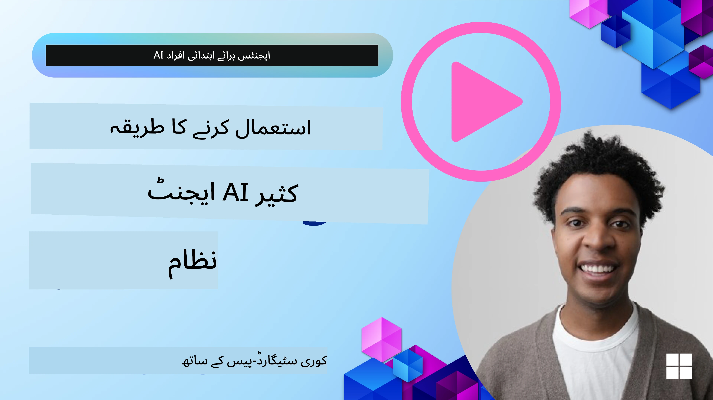
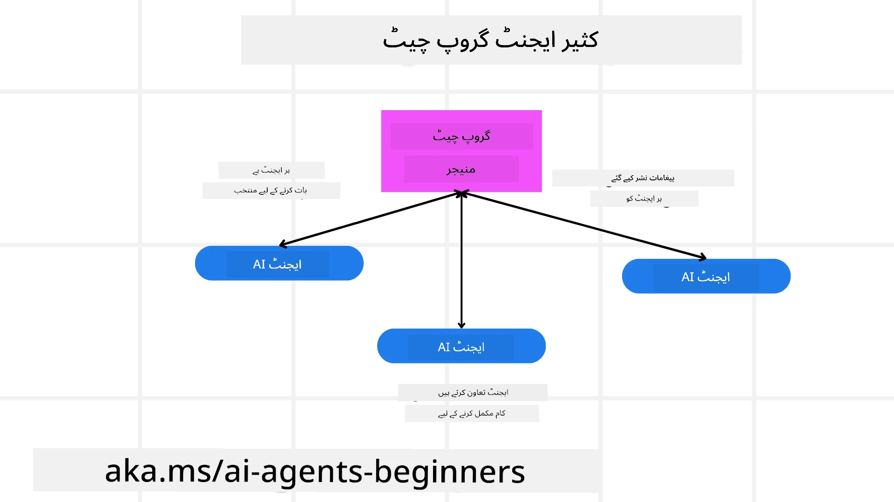
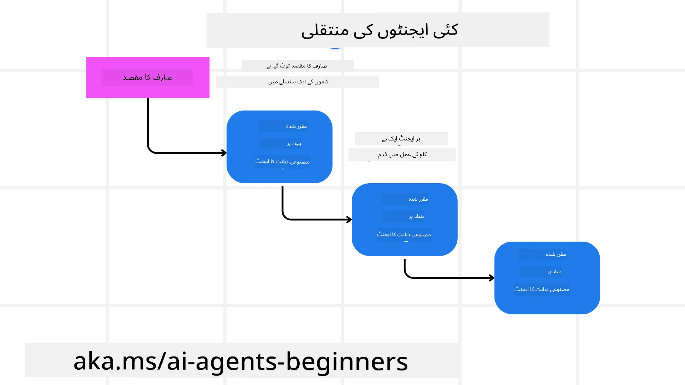
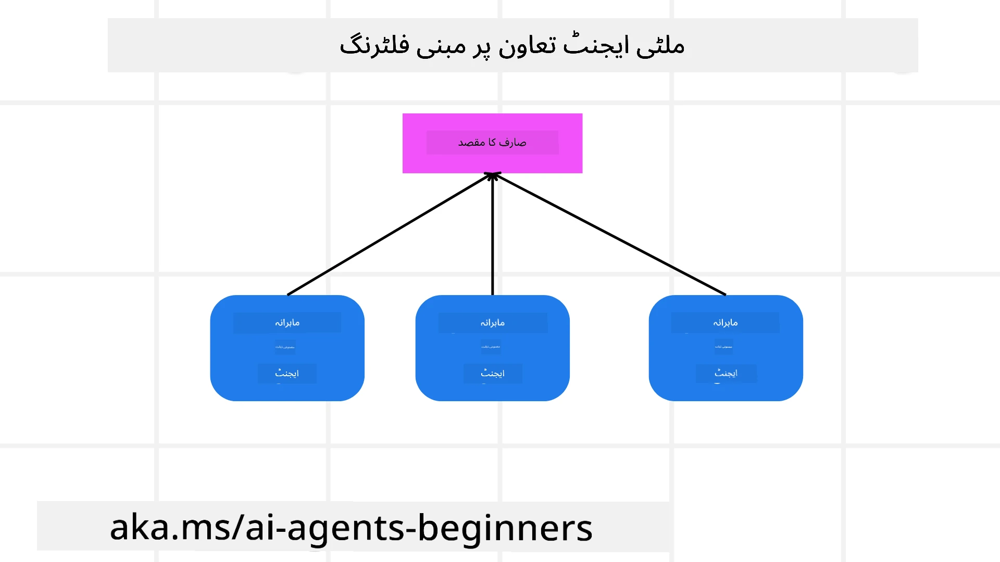

\u202B

> _(اوپر والی تصویر پر کلک کریں تاکہ اس سبق کا ویڈیو دیکھیں)_

# ملٹی ایجنٹ ڈیزائن پیٹرنز

جیسے ہی آپ ایسے پروجیکٹ پر کام شروع کریں گے جس میں متعدد ایجنٹس شامل ہوں گے، آپ کو ملٹی ایجنٹ ڈیزائن پیٹرن کے بارے میں غور کرنا ہوگا۔ تاہم، فوراً واضح نہیں ہوسکتا کہ کب ملٹی-ایجنٹس کی طرف سوئچ کرنا ہے اور اس کے فوائد کیا ہیں۔

## تعارف

اس سبق میں، ہم مندرجہ ذیل سوالات کے جواب دینے کی کوشش کر رہے ہیں:

- وہ کون سے منظرنامے ہیں جہاں ملٹی-ایجنٹس قابل اطلاق ہیں؟
- صرف ایک واحد ایجنٹ کے مقابلے میں ملٹی-ایجنٹس استعمال کرنے کے کیا فوائد ہیں؟
- ملٹی-ایجنٹ ڈیزائن پیٹرن کو نافذ کرنے کے کون سے بنیادی اجزاء ہیں؟
- ہمیں کس طرح معلوم ہو گا کہ متعدد ایجنٹس ایک دوسرے کے ساتھ کیسے تعامل کر رہے ہیں؟

## سیکھنے کے مقاصد

اس سبق کے بعد، آپ کے قابل ہونا چاہئے کہ:

- ایسے منظرناموں کی نشاندہی کریں جہاں ملٹی-ایجنٹس قابل اطلاق ہوں
- ملٹی-ایجنٹس استعمال کرنے کے فوائد کو ایک واحد ایجنٹ کے مقابلے میں پہچانیں۔
- ملٹی-ایجنٹ ڈیزائن پیٹرن کو نافذ کرنے کے بنیادی اجزاء کو سمجھیں۔

بڑی تصویر کیا ہے؟

*ملٹی ایجنٹس ایک ڈیزائن پیٹرن ہیں جو متعدد ایجنٹس کو ایک مشترکہ مقصد حاصل کرنے کے لیے ایک ساتھ کام کرنے کی اجازت دیتا ہے۔* 

یہ پیٹرن مختلف شعبوں میں وسیع پیمانے پر استعمال ہوتا ہے، جس میں روبوٹکس، خودمختار نظام، اور تقسیم شدہ کمپیوٹنگ شامل ہیں۔

## وہ منظرنامے جہاں ملٹی-ایجنٹس قابل اطلاق ہیں

تو کون سے منظرنامے ملٹی-ایجنٹس کے استعمال کے لیے اچھے کیس ہیں؟ جواب یہ ہے کہ بہت سے منظرنامے ہیں جہاں متعدد ایجنٹس کا استعمال فائدہ مند ہوتا ہے، خاص طور پر درج ذیل حالات میں:

- **بڑے ورک لوڈز**: بڑے ورک لوڈز کو چھوٹے ٹاسکس میں تقسیم کیا جا سکتا ہے اور مختلف ایجنٹس کو تفویض کیا جا سکتا ہے، جس سے متوازی پروسیسنگ اور تیز تر تکمیل ممکن ہوتی ہے۔ اس کی ایک مثال بڑے ڈیٹا پروسیسنگ کے ٹاسک میں مل سکتی ہے۔
- **پیچیدہ کام**: پیچیدہ کام، بڑے ورک لوڈز کی طرح، چھوٹے ذیلی کاموں میں تقسیم کیے جا سکتے ہیں اور مختلف ایجنٹس کو تفویض کیے جا سکتے ہیں، ہر ایک کام کے ایک مخصوص پہلو میں مہارت رکھتا ہے۔ اس کی ایک عمدہ مثال خودمختار گاڑیوں کے کیس میں ہے جہاں مختلف ایجنٹس نیویگیشن، رکاوٹ کی شناخت، اور دیگر گاڑیوں کے ساتھ مواصلت کا انتظام کرتے ہیں۔
- **متنوع مہارت**: مختلف ایجنٹس کے پاس مختلف مہارتیں ہو سکتی ہیں، جو انھیں کسی کام کے مختلف پہلوؤں کو ایک واحد ایجنٹ کے مقابلے میں زیادہ مؤثر انداز میں سنبھالنے کی اجازت دیتی ہیں۔ اس صورت میں ایک اچھا مثال ہیلتھ کیئر ہے جہاں ایجنٹس تشخیص، علاج کے منصوبے، اور مریض کی نگرانی کا انتظام کر سکتے ہیں۔

## ایک واحد ایجنٹ کے مقابلے میں ملٹی-ایجنٹس کے فوائد

ایک واحد ایجنٹ سسٹم سادہ کاموں کے لیے ٹھیک کام کر سکتا ہے، لیکن زیادہ پیچیدہ کاموں کے لیے متعدد ایجنٹس استعمال کرنے سے کئی فوائد حاصل ہو سکتے ہیں:

- **تخصص**: ہر ایجنٹ کسی مخصوص کام کے لیے ماہر ہو سکتا ہے۔ ایک واحد ایجنٹ میں تخصص کی کمی کا مطلب ہے کہ آپ کے پاس ایک ایسا ایجنٹ ہے جو سب کچھ کر سکتا ہے لیکن پیچیدہ کام کا سامنا ہونے پر اسے یہ سمجھنے میں مشکل ہو سکتی ہے کہ کیا کرنا ہے۔ مثال کے طور پر یہ ایسے کام کر سکتا ہے جس کے لیے وہ بہترین موزوں نہیں ہے۔
- **اسکیلیبیلٹی**: سسٹمز کو اسکیل کرنا آسان ہوتا ہے کیونکہ آپ مزید ایجنٹس شامل کر کے کارکردگی بڑھا سکتے ہیں بجائے اس کے کہ ایک ہی ایجنٹ پر بوجھ ڈالا جائے۔
- **فالتھ ٹالرنس**: اگر ایک ایجنٹ فیل ہو جائے تو دوسرے ایجنٹس کام جاری رکھ سکتے ہیں، جس سے سسٹم کی قابل اعتمادیت برقرار رہتی ہے۔

آئیں ایک مثال لیتے ہیں، صارف کے لیے ایک سفر بک کرنا۔ ایک واحد ایجنٹ سسٹم کو سفر کی بکنگ کے عمل کے تمام پہلوؤں کو سنبھالنا ہوگا، پروازیں تلاش کرنے سے لے کر ہوٹلز اور کرائے کی گاڑیاں بک کرنے تک۔ اسے ایک واحد ایجنٹ کے ذریعے پورا کرنے کے لیے، ایجنٹ کے پاس ان تمام کاموں کو سنبھالنے کے لیے ٹولز ہونے چاہئیں۔ اس سے ایک پیچیدہ اور مونولیتھک سسٹم بن سکتا ہے جسے مینٹین اور اسکیل کرنا مشکل ہو سکتا ہے۔ دوسری طرف، ایک ملٹی-ایجنٹ سسٹم میں مختلف ایجنٹس ہو سکتے ہیں جو پروازیں تلاش کرنے، ہوٹلز بک کرنے، اور کرائے کی گاڑیاں بک کرنے میں مہارت رکھتے ہوں۔ اس سے سسٹم زیادہ ماڈیولر، آسانی سے مینٹینیبل، اور اسکیل ایبل ہو جائے گا۔

اس کا موازنہ ایک چھوٹے فیملی کے چلائے جانے والے ٹریول بیورو کے ساتھ کریں بمقابلہ ایک فرنچائز کے طور پر چلائے جانے والے ٹریول بیورو۔ فیملی کی دکان میں ایک ہی ایجنٹ سفر کی بکنگ کے تمام پہلوؤں کو سنبھالے گا، جبکہ فرنچائز میں مختلف ایجنٹس مختلف پہلوؤں کو سنبھالیں گے۔

## ملٹی-ایجنٹ ڈیزائن پیٹرن کو نافذ کرنے کے بنیادی اجزاء

اس سے پہلے کہ آپ ملٹی-ایجنٹ ڈیزائن پیٹرن کو نافذ کریں، آپ کو ان بنیادی اجزاء کو سمجھنے کی ضرورت ہے جو اس پیٹرن پر مشتمل ہیں۔

آئیے ایک بار پھر صارف کے لیے سفر بک کرنے کی مثال لے کر اسے زیادہ ٹھوس بنائیں۔ اس صورت میں، بنیادی اجزاء میں شامل ہوں گے:

- **ایجنٹ مواصلت**: پروازیں تلاش کرنے والے، ہوٹلز بک کرنے والے، اور کرائے کی گاڑیاں سنبھالنے والے ایجنٹس کو صارف کی ترجیحات اور پابندیوں کے بارے میں معلومات کا تبادلہ اور اشتراک کرنے کی ضرورت ہے۔ آپ کو اس مواصلت کے پروٹوکولز اور طریقوں کا فیصلہ کرنا ہوگا۔ اس کا عملی مطلب یہ ہے کہ پروازیں تلاش کرنے والا ایجنٹ ہوٹل بک کرنے والے ایجنٹ کے ساتھ بات چیت کرے تاکہ یقینی بنایا جا سکے کہ ہوٹل اسی تاریخوں کے لیے بک ہوا ہے جو پرواز کے لیے ہیں۔ اس کا مطلب یہ ہے کہ ایجنٹس کو صارف کی سفر کی تاریخوں کے بارے میں معلومات شیئر کرنی ہوں گی، یعنی آپ کو فیصلہ کرنا ہوگا *کون سے ایجنٹس معلومات شیئر کر رہے ہیں اور وہ کیسے شیئر کر رہے ہیں*۔
- **ہم آہنگی میکانزم**: ایجنٹس کو اپنے اعمال کو ہم آہنگ کرنے کی ضرورت ہے تاکہ صارف کی ترجیحات اور پابندیاں پوری ہوں۔ ایک صارف کی ترجیح یہ ہو سکتی ہے کہ وہ ہوٹل ہوائی اڈے کے قریب چاہتے ہیں جبکہ ایک پابندی یہ ہو سکتی ہے کہ کرائے کی گاڑیاں صرف ہوائی اڈے پر دستیاب ہیں۔ اس کا مطلب ہے کہ ہوٹل بک کرنے والا ایجنٹ کرائے کی گاڑی بک کرنے والے ایجنٹ کے ساتھ ہم آہنگی کرے گا تاکہ صارف کی ترجیحات اور پابندیاں پوری ہوں۔ یعنی آپ کو یہ فیصلہ کرنا ہوگا *کہ ایجنٹس اپنے اعمال کو کس طرح مربوط کر رہے ہیں*۔
- **ایجنٹ فن تعمیر**: ایجنٹس کو اندرونی ساخت درکار ہوتی ہے تاکہ وہ فیصلے کر سکیں اور صارف کے ساتھ اپنے تعاملات سے سیکھ سکیں۔ اس کا مطلب یہ ہے کہ پروازیں تلاش کرنے والے ایجنٹ کو اندرونی ساخت ہونی چاہیے تاکہ وہ یہ فیصلہ کر سکے کہ صارف کو کون سی پروازیں تجویز کرنی ہیں۔ اس کا مطلب یہ ہے کہ آپ کو فیصلہ کرنا ہوگا *ایجنٹس کیسے فیصلے کر رہے ہیں اور صارف کے ساتھ اپنے تعاملات سے کیسے سیکھ رہے ہیں*۔ ایک ایجنٹ کے سیکھنے اور بہتر ہونے کی مثال یہ ہو سکتی ہے کہ پرواز تلاش کرنے والا ایجنٹ ماضی کی ترجیحات کی بنیاد پر صارف کو پروازیں تجویز کرنے کے لیے مشین لرننگ ماڈل استعمال کرے۔
- **ملٹی-ایجنٹ تعاملات میں شفافیت**: آپ کو یہ دیکھنے کی صلاحیت درکار ہے کہ متعدد ایجنٹس ایک دوسرے کے ساتھ کیسے تعامل کر رہے ہیں۔ اس کا مطلب یہ ہے کہ آپ کو ایجنٹ کی سرگرمیوں اور تعاملات کو ٹریک کرنے کے لیے ٹولز اور تکنیک درکار ہوں گی۔ یہ لاگنگ اور مانیٹرنگ ٹولز، ویژولائزیشن ٹولز، اور کارکردگی میٹرکس کی شکل میں ہو سکتا ہے۔
- **ملٹی-ایجنٹ پیٹرنز**: ملٹی-ایجنٹ سسٹمز کو نافذ کرنے کے مختلف پیٹرنز ہوتے ہیں، جیسے مرکزی، غیر مرکزی، اور ہائبرڈ فن تعمیرات۔ آپ کو اس پیٹرن کا انتخاب کرنا ہوگا جو آپ کے استعمال کے کیس کے لیے بہترین ہو۔
- **انسانی شمولیت (Human in the loop)**: زیادہ تر صورتوں میں، آپ کے پاس ایک انسان سسٹم میں شامل ہوگا اور آپ کو ایجنٹس کو ہدایت کرنا ہوگی کہ وہ کب انسانی مداخلت مانگیں۔ یہ ایسے صورت میں ہو سکتا ہے جب صارف کسی مخصوص ہوٹل یا پرواز کے لیے کہے جو ایجنٹس نے تجویز نہیں کیں یا بکنگ سے پہلے تصدیق مانگے۔

## ملٹی-ایجنٹ تعاملات میں شفافیت

یہ ضروری ہے کہ آپ کو معلوم ہو کہ متعدد ایجنٹس ایک دوسرے کے ساتھ کیسے تعامل کر رہے ہیں۔ یہ شفافیت ڈیبگنگ، بہتر بنانے، اور مجموعی سسٹم کی مؤثریت کو یقینی بنانے کے لیے لازمی ہے۔ اسے حاصل کرنے کے لیے، آپ کو ایجنٹ کی سرگرمیوں اور تعاملات کو ٹریک کرنے کے لیے ٹولز اور تکنیک درکار ہوں گی۔ یہ لاگنگ اور مانیٹرنگ ٹولز، ویژولائزیشن ٹولز، اور کارکردگی میٹرکس کی صورت میں ہو سکتا ہے۔

مثال کے طور پر، صارف کے لیے سفر بک کرنے کے معاملے میں، آپ کے پاس ایک ڈیش بورڈ ہو سکتا ہے جو ہر ایجنٹ کی حیثیت، صارف کی ترجیحات اور پابندیوں، اور ایجنٹس کے درمیان تعاملات دکھاتا ہو۔ یہ ڈیش بورڈ صارف کی سفر کی تاریخیں، فلائٹ ایجنٹ کی جانب سے تجویز کردہ پروازیں، ہوٹل ایجنٹ کی جانب سے تجویز کردہ ہوٹلز، اور کرایہ گاڑی ایجنٹ کی جانب سے تجویز کردہ کرایہ گاڑیاں دکھا سکتا ہے۔ اس سے آپ کو واضح منظر ملے گا کہ ایجنٹس ایک دوسرے کے ساتھ کیسے تعامل کر رہے ہیں اور کیا صارف کی ترجیحات اور پابندیاں پوری ہو رہی ہیں یا نہیں۔

آئیں ان میں سے ہر پہلو کو تفصیل سے دیکھیں۔

- **لاگنگ اور مانیٹرنگ ٹولز**: آپ چاہتے ہیں کہ ہر وہ عمل جو کسی ایجنٹ نے انجام دیا ہے اس کی لاگنگ ہو۔ ایک لاگ انٹری میں اس ایجنٹ کی معلومات محفوظ کی جا سکتی ہیں جس نے عمل کیا، انجام دیا گیا عمل، عمل کا وقت، اور اس عمل کا نتیجہ۔ اس معلومات کو بعد میں ڈیبگنگ، بہتر بنانے اور مزید کے لیے استعمال کیا جا سکتا ہے۔
- **ویژولائزیشن ٹولز**: ویژولائزیشن ٹولز آپ کو ایجنٹس کے درمیان تعاملات کو زیادہ واضح انداز میں دیکھنے میں مدد دے سکتے ہیں۔ مثال کے طور پر، آپ کے پاس ایک گراف ہو سکتا ہے جو ایجنٹس کے درمیان معلومات کے بہاؤ کو دکھاتا ہو۔ یہ آپ کو نظام میں بوتل نیک، غیر مؤثر طریقہ کار، اور دیگر مسائل کی شناخت میں مدد دے سکتا ہے۔
- **کارکردگی میٹرکس**: کارکردگی میٹرکس آپ کو ملٹی-ایجنٹ سسٹم کی مؤثریت کو ٹریک کرنے میں مدد دے سکتے ہیں۔ مثال کے طور پر، آپ ٹریک کر سکتے ہیں کہ کسی ٹاسک کو مکمل کرنے میں کتنا وقت لگا، فی یونٹ وقت مکمل ہونے والے کاموں کی تعداد، اور ایجنٹس کی جانب سے کی جانے والی سفارشات کی درستگی۔ یہ معلومات آپ کو بہتری کے علاقوں کی نشاندہی کرنے اور سسٹم کو بہتر بنانے میں مدد کر سکتی ہے۔

## ملٹی-ایجنٹ پیٹرنز

آئیں کچھ ٹھوس پیٹرنز میں غور کریں جنہیں ہم ملٹی-ایجنٹ ایپس بنانے کے لیے استعمال کر سکتے ہیں۔ یہاں کچھ دلچسپ پیٹرنز ہیں جو غور طلب ہیں:

### گروپ چیٹ

یہ پیٹرن اس وقت مفید ہے جب آپ ایک گروپ چیٹ ایپلیکیشن بنانا چاہتے ہیں جہاں متعدد ایجنٹس ایک دوسرے کے ساتھ بات چیت کر سکتے ہیں۔ اس پیٹرن کے عام استعمال کے کیسز میں ٹیم کولیبریشن، کسٹمر سپورٹ، اور سوشل نیٹ ورکنگ شامل ہیں۔

اس پیٹرن میں، ہر ایجنٹ گروپ چیٹ میں ایک یوزر کی نمائندگی کرتا ہے، اور پیغامات ایک پیغام رسانی پروٹوکول کے ذریعے ایجنٹس کے درمیان تبادلہ ہوتے ہیں۔ ایجنٹس گروپ چیٹ میں پیغامات بھیج سکتے ہیں، گروپ چیٹ سے پیغامات وصول کر سکتے ہیں، اور دوسرے ایجنٹس کے پیغامات کا جواب دے سکتے ہیں۔

یہ پیٹرن مرکزی فن تعمیر استعمال کرتے ہوئے نافذ کیا جا سکتا ہے جہاں تمام پیغامات ایک مرکزی سرور کے ذریعے روٹ کیے جاتے ہیں، یا غیر مرکزی فن تعمیر جہاں پیغامات براہ راست تبادلہ ہوتے ہیں۔

### ہینڈ-آف

یہ پیٹرن اس وقت مفید ہے جب آپ ایک ایسی ایپلیکیشن بنانا چاہتے ہیں جہاں متعدد ایجنٹس ایک دوسرے کو ٹاسکس ہینڈ آف کر سکیں۔

اس پیٹرن کے عام استعمال کے کیسز میں کسٹمر سپورٹ، ٹاسک مینجمنٹ، اور ورک فلو آٹومیشن شامل ہیں۔

اس پیٹرن میں، ہر ایجنٹ کسی ٹاسک یا ورک فلو کے ایک مرحلے کی نمائندگی کرتا ہے، اور ایجنٹس پہلے سے طے شدہ قواعد کی بنیاد پر ٹاسکس کو دوسرے ایجنٹس کو منتقل کر سکتے ہیں۔

### مشترکہ فلٹرنگ (Collaborative filtering)

یہ پیٹرن اس وقت مفید ہے جب آپ ایک ایسی ایپلیکیشن بنانا چاہتے ہیں جہاں متعدد ایجنٹس مل کر صارفین کو سفارشات فراہم کریں۔

یہ کہ متعدد ایجنٹس کو مل کر کام کرنا مفید کیوں ہے اس کی وجہ یہ ہے کہ ہر ایجنٹ کی مختلف مہارت ہو سکتی ہے اور وہ سفارش سازی کے عمل میں مختلف طریقوں سے حصہ ڈال سکتے ہیں۔

آئیں ایک مثال لیتے ہیں جہاں ایک صارف اسٹاک مارکیٹ میں بہترین اسٹاک خریدنے کی سفارش چاہتا ہے۔

- **انڈسٹری ایکسپرٹ**: ایک ایجنٹ کسی مخصوص صنعت میں ماہر ہو سکتا ہے۔
- **ٹیکنیکل اینالیسس**: ایک اور ایجنٹ تکنیکی تجزیے میں ماہر ہو سکتا ہے۔
- **فنڈامینٹل اینالیسس**: اور ایک ایجنٹ بنیادی تجزیے میں ماہر ہو سکتا ہے۔ ان ایجنٹس کے مل کر کام کرنے سے وہ صارف کو زیادہ جامع سفارش فراہم کر سکتے ہیں۔

## منظرنامہ: ریفنڈ پراسس

ایک منظرنامے پر غور کریں جہاں ایک کسٹمر کسی پروڈکٹ کے لیے ریفنڈ حاصل کرنے کی کوشش کر رہا ہے، اس عمل میں کافی سارے ایجنٹس شامل ہو سکتے ہیں لیکن آئیں اسے اس عمل کے مخصوص ایجنٹس اور ایسے عمومی ایجنٹس میں تقسیم کریں جو آپ کے کاروبار کے دیگر عملوں میں بھی استعمال ہو سکتے ہیں۔

**ریفنڈ پراسس کے مخصوص ایجنٹس**:

مندرجہ ذیل کچھ ایجنٹس ہیں جو ریفنڈ پراسس میں شامل ہو سکتے ہیں:

- **کسٹمر ایجنٹ**: یہ ایجنٹ کسٹمر کی نمائندگی کرتا ہے اور ریفنڈ پراسس شروع کرنے کا ذمہ دار ہوتا ہے۔
- **سیلر ایجنٹ**: یہ ایجنٹ سیلر کی نمائندگی کرتا ہے اور ریفنڈ کو پراسیس کرنے کا ذمہ دار ہوتا ہے۔
- **پیمنٹ ایجنٹ**: یہ ایجنٹ ادائیگی کے عمل کی نمائندگی کرتا ہے اور کسٹمر کی ادائیگی واپس کرنے کا ذمہ دار ہوتا ہے۔
- **ریزولوشن ایجنٹ**: یہ ایجنٹ تنازعات کو حل کرنے کے عمل کی نمائندگی کرتا ہے اور ریفنڈ پراسس کے دوران پیدا ہونے والے مسائل کو حل کرنے کا ذمہ دار ہوتا ہے۔
- **کمپلائنس ایجنٹ**: یہ ایجنٹ تعمیل کے عمل کی نمائندگی کرتا ہے اور یہ یقینی بنانے کا ذمہ دار ہوتا ہے کہ ریفنڈ پراسس قواعد و ضوابط اور پالیسیوں کے مطابق ہو۔

**جنرل ایجنٹس**:

یہ ایجنٹس آپ کے کاروبار کے دوسرے حصوں میں بھی استعمال ہو سکتے ہیں۔

- **شپنگ ایجنٹ**: یہ ایجنٹ شپنگ کے عمل کی نمائندگی کرتا ہے اور پروڈکٹ کو بیچنے والے کو واپس بھیجنے کا ذمہ دار ہوتا ہے۔ یہ ایجنٹ ریفنڈ پراسس اور کسی خریداری کے ذریعے پروڈکٹ کی عمومی شپنگ دونوں کے لیے استعمال ہو سکتا ہے۔
- **فیڈبیک ایجنٹ**: یہ ایجنٹ فیڈبیک کے عمل کی نمائندگی کرتا ہے اور کسٹمر سے فیڈبیک جمع کرنے کا ذمہ دار ہوتا ہے۔ فیڈبیک کسی بھی وقت حاصل کیا جا سکتا ہے، صرف ریفنڈ پراسس کے دوران نہیں۔
- **ایسکلیشن ایجنٹ**: یہ ایجنٹ ایسکلیشن کے عمل کی نمائندگی کرتا ہے اور مسائل کو اعلیٰ سطحی سپورٹ تک پہنچانے کا ذمہ دار ہوتا ہے۔ آپ اس قسم کے ایجنٹس کو کسی بھی ایسے عمل میں استعمال کر سکتے ہیں جہاں مسئلے کو ایسکلیشن کرنے کی ضرورت ہو۔
- **نوٹیفیکیشن ایجنٹ**: یہ ایجنٹ نوٹیفیکیشن کے عمل کی نمائندگی کرتا ہے اور ریفنڈ پراسس کے مختلف مراحل میں کسٹمر کو اطلاعات بھیجنے کا ذمہ دار ہوتا ہے۔
- **اینالٹکس ایجنٹ**: یہ ایجنٹ اینالٹکس کے عمل کی نمائندگی کرتا ہے اور ریفنڈ پراسس سے متعلق ڈیٹا کا تجزیہ کرنے کا ذمہ دار ہوتا ہے۔
- **آڈٹ ایجنٹ**: یہ ایجنٹ آڈٹ کے عمل کی نمائندگی کرتا ہے اور یہ یقینی بنانے کے لیے ریفنڈ پراسس کا آڈٹ کرنے کا ذمہ دار ہوتا ہے کہ یہ درست طریقے سے انجام پا رہا ہے۔
- **رپورٹنگ ایجنٹ**: یہ ایجنٹ رپورٹنگ کے عمل کی نمائندگی کرتا ہے اور ریفنڈ پراسس پر رپورٹس تیار کرنے کا ذمہ دار ہوتا ہے۔
- **نالج ایجنٹ**: یہ ایجنٹ علم کے عمل کی نمائندگی کرتا ہے اور ریفنڈ پراسس سے متعلق معلومات کا نالج بیس برقرار رکھنے کا ذمہ دار ہوتا ہے۔ یہ ایجنٹ ریفنڈز اور آپ کے کاروبار کے دوسرے حصوں دونوں پر ماہر ہو سکتا ہے۔
- **سیکیورٹی ایجنٹ**: یہ ایجنٹ سیکیورٹی کے عمل کی نمائندگی کرتا ہے اور ریفنڈ پراسس کی سلامتی کو یقینی بنانے کا ذمہ دار ہوتا ہے۔
- **کوالیٹی ایجنٹ**: یہ ایجنٹ کوالٹی کے عمل کی نمائندگی کرتا ہے اور ریفنڈ پراسس کے معیار کو یقینی بنانے کا ذمہ دار ہوتا ہے۔

پہلے جو متعدد ایجنٹس درج کیے گئے تھے وہ خاص ریفنڈ پراسس کے لیے بھی تھے اور ساتھ ہی آپ کے کاروبار کے دوسرے حصوں میں استعمال ہونے والے عمومی ایجنٹس بھی تھے۔ امید ہے کہ اس سے آپ کو یہ خیال مل گیا ہوگا کہ آپ اپنے ملٹی-ایجنٹ سسٹم میں کون سے ایجنٹس استعمال کریں گے۔

## اسائنمنٹ

کسٹمر سپورٹ پراسس کے لیے ایک ملٹی-ایجنٹ سسٹم ڈیزائن کریں۔ پراسس میں شامل ایجنٹس کی نشاندہی کریں، ان کے کردار اور ذمہ داریاں بیان کریں، اور یہ کہ وہ ایک دوسرے کے ساتھ کیسے تعامل کرتے ہیں۔ اس بات پر غور کریں کہ کسٹمر سپورٹ پراسس کے مخصوص ایجنٹس اور وہ عمومی ایجنٹس جو آپ کے کاروبار کے دوسرے حصوں میں استعمال ہو سکتے ہیں دونوں کو کس طرح شامل کیا جائے۔\u202C
‫\u202B> پڑھنے سے پہلے ایک بار سوچیں، آپ کو شاید جتنے لگتے ہیں اس سے زیادہ ایجنٹس درکار ہوں۔
> مشورہ: کسٹمر سپورٹ کے مختلف مراحل کے بارے میں سوچیں اور کسی بھی نظام کے لیے درکار ایجنٹس کو بھی مدنظر رکھیں۔

## حل

[حل](./solution/solution.md)

## جانچ کے سوالات

سوال: آپ کب ملٹی-ایجنٹس کے استعمال پر غور کریں؟

- [ ] A1: جب آپ کے پاس کم کام کا بوجھ اور ایک آسان کام ہو۔
- [ ] A2: جب آپ کے پاس کام کا بوجھ زیادہ ہو
- [ ] A3: جب آپ کے پاس ایک آسان کام ہو۔

[حل کا کوئز](./solution/solution-quiz.md)

## خلاصہ

اس سبق میں، ہم نے ملٹی-ایجنٹ ڈیزائن پیٹرن کا جائزہ لیا، جن منظرناموں میں ملٹی-ایجنٹس قابلِ اطلاق ہیں، واحد ایجنٹ کے مقابلے میں ملٹی-ایجنٹس کے استعمال کے فوائد، ملٹی-ایجنٹ ڈیزائن پیٹرن کو نافذ کرنے کے بنیادی اجزاء، اور یہ کہ متعدد ایجنٹس ایک دوسرے کے ساتھ کس طرح تعامل کر رہے ہیں اس پر کس طرح نظر رکھی جاسکتی ہے۔

### ملٹی-ایجنٹ ڈیزائن پیٹرن کے بارے میں مزید سوالات ہیں؟

دیگر سیکھنے والوں سے ملنے، آفس آورز میں شرکت کرنے اور اپنے AI ایجنٹس کے سوالات کے جوابات حاصل کرنے کے لیے [Microsoft Foundry ڈسکارڈ](https://aka.ms/ai-agents/discord) میں شامل ہوں۔

## اضافی وسائل

- <a href="https://learn.microsoft.com/azure/ai-services/agents/overview" target="_blank">Microsoft Agent Framework کی دستاویزات</a>
- <a href="https://www.analyticsvidhya.com/blog/2024/10/agentic-design-patterns/" target="_blank">ایجنٹک ڈیزائن پیٹرن</a>

## پچھلا سبق

[ڈیزائن کی منصوبہ بندی](../07-planning-design/README.md)

## اگلا سبق

[AI ایجنٹس میں میٹا کگنیشن](../09-metacognition/README.md)\u202C

---

<!-- CO-OP TRANSLATOR DISCLAIMER START -->
ردِّ ذمہ داری:
یہ دستاویز مصنوعی ذہانت پر مبنی ترجمہ سروس Co-op Translator (https://github.com/Azure/co-op-translator) کے ذریعے ترجمہ کی گئی ہے۔ اگرچہ ہم درستگی کے لیے کوشاں ہیں، براہِ کرم نوٹ کریں کہ خودکار ترجمے میں غلطیاں یا عدم درستیاں ہو سکتی ہیں۔ اصل دستاویز کو اس کی مادری زبان میں مستند ماخذ سمجھا جانا چاہیے۔ اہم معلومات کے لیے پیشہ ور انسانی ترجمہ کی سفارش کی جاتی ہے۔ ہم اس ترجمے کے استعمال سے پیدا ہونے والی کسی بھی غلط فہمی یا غلط تشریح کے لیے ذمہ دار نہیں ہیں۔
<!-- CO-OP TRANSLATOR DISCLAIMER END -->