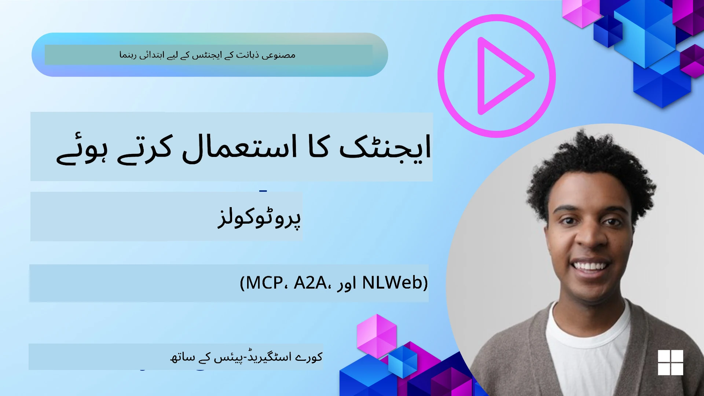
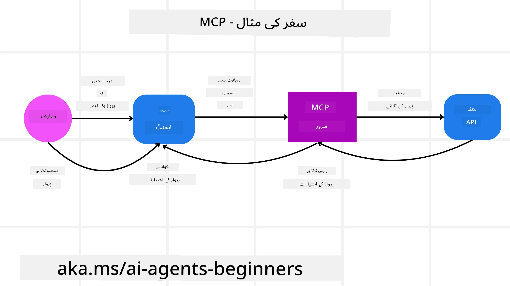
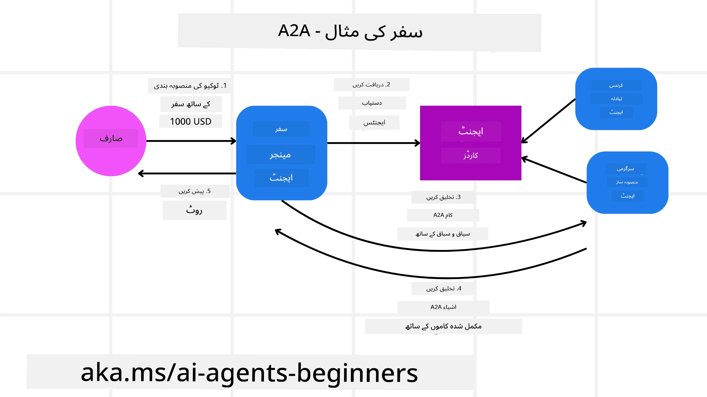
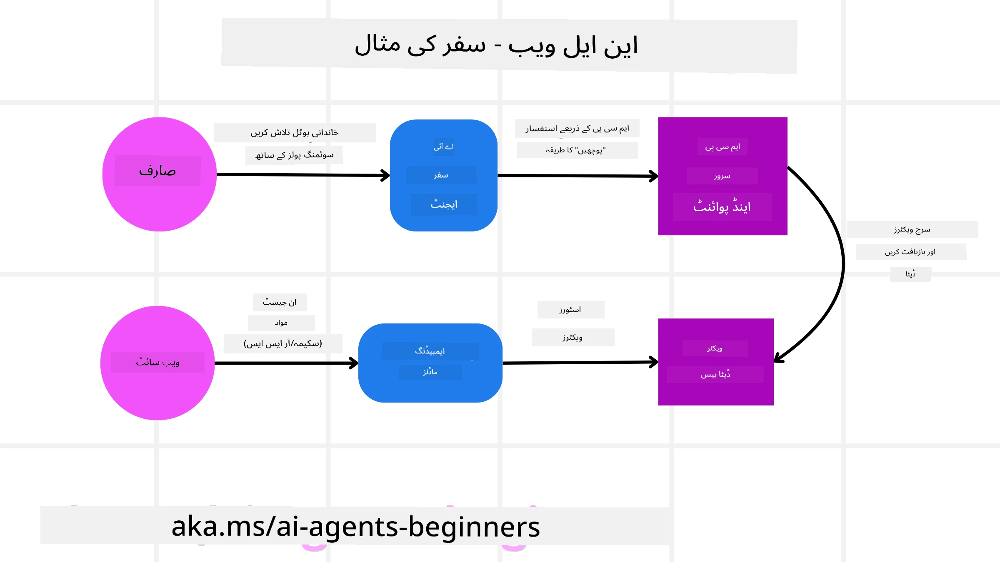

# ایجنٹک پروٹوکولز کا استعمال (MCP، A2A اور NLWeb)

> _(اس سبق کی ویڈیو دیکھنے کے لئے اوپر تصویر پر کلک کریں)_

جیسا کہ AI ایجنٹز کا استعمال بڑھ رہا ہے، اسی طرح ایسے پروٹوکولز کی ضرورت بھی بڑھ رہی ہے جو معیاری، محفوظ، اور کھلی جدت کی حمایت کو یقینی بنائیں۔ اس سبق میں، ہم تین پروٹوکولز کا احاطہ کریں گے جو اس ضرورت کو پورا کرنے کی کوشش کر رہے ہیں - ماڈل کانٹیکسٹ پروٹوکول (MCP)، ایجنٹ ٹو ایجنٹ (A2A) اور نیچرل لینگویج ویب (NLWeb)۔

## تعارف

اس سبق میں، ہم احاطہ کریں گے:

• کیسے **MCP** AI ایجنٹز کو بیرونی ٹولز اور ڈیٹا تک رسائی دے کر صارف کے کام مکمل کرنے کی اجازت دیتا ہے۔

• کیسے **A2A** مختلف AI ایجنٹز کے درمیان رابطہ کاری اور تعاون کو ممکن بناتا ہے۔

• کیسے **NLWeb** کسی بھی ویب سائٹ پر قدرتی زبان کے انٹرفیس فراہم کرتا ہے تاکہ AI ایجنٹ مواد کو دریافت اور اس کے ساتھ تعامل کر سکیں۔

## سیکھنے کے مقاصد

• **شناخت کریں** MCP، A2A اور NLWeb کے بنیادی مقصد اور فوائد کو AI ایجنٹز کے تناظر میں۔

• **وضاحت کریں** کہ ہر پروٹوکول کس طرح LLMs، ٹولز، اور دیگر ایجنٹز کے درمیان رابطہ اور تعامل کو سہولت دیتا ہے۔

• **پہچانیں** کہ ہر پروٹوکول پیچیدہ ایجنٹک نظاموں کی تشکیل میں کون سا منفرد کردار ادا کرتا ہے۔

## ماڈل کانٹیکسٹ پروٹوکول

**ماڈل کانٹیکسٹ پروٹوکول (MCP)** ایک اوپن اسٹینڈرڈ ہے جو ایپلیکیشنز کو LLMs کو کانٹیکسٹ اور ٹولز فراہم کرنے کا معیاری طریقہ فراہم کرتا ہے۔ اس سے ایک "یونیورسل اڈاپٹر" ممکن ہوتا ہے جو مختلف ڈیٹا ذرائع اور ٹولز سے منسلک ہو سکتا ہے جنہیں AI ایجنٹ مستقل اور یکساں طریقے سے استعمال کر سکتے ہیں۔

آئیے MCP کے اجزا، براہِ راست API کے مقابلے میں فوائد، اور یہ کہ AI ایجنٹ ایک MCP سرور کو کیسے استعمال کر سکتے ہیں، کا جائزہ لیتے ہیں۔

### MCP کے بنیادی اجزا

MCP ایک **کلائنٹ-سرور آرکیٹیکچر** پر کام کرتا ہے اور اس کے بنیادی اجزا یہ ہیں:

• **ہوسٹس** وہ LLM ایپلیکیشنز ہیں (مثلاً VSCode جیسے کوڈ ایڈیٹر) جو MCP سرور سے کنکشن شروع کرتے ہیں۔

• **کلائنٹس** ہوسٹ ایپلیکیشن کے وہ کمپونینٹس ہیں جو سرورز سے ایک سے ایک کنکشن برقرار رکھتے ہیں۔

• **سرورز** ہلکے پھلکے پروگرام ہوتے ہیں جو مخصوص صلاحیتوں کو ظاہر کرتے ہیں۔

پروٹوکول میں تین بنیادی اجزاء شامل ہیں جو MCP سرور کی قابلیت ہیں:

• **ٹولز**: یہ الگ الگ ایکشنز یا فنکشنز ہیں جنہیں AI ایجنٹ کال کر کے کوئی کام انجام دے سکتا ہے۔ مثال کے طور پر، ایک موسم کی سروس "موسم معلوم کریں" کا ٹول فراہم کر سکتی ہے، یا ایک ای کامرس سرور "مصنوع خریدیں" کا ٹول پیش کر سکتا ہے۔ MCP سرور ہر ٹول کا نام، وضاحت، اور ان پٹ/آؤٹ پٹ اسکیمہ اپنی قابلیت کی فہرست میں شامل کرتا ہے۔

• **وسائل**: یہ صرف پڑھنے کے لیے ڈیٹا آئٹمز یا دستاویزات ہیں جو MCP سرور فراہم کر سکتا ہے، اور کلائنٹس انہیں ضرورت کے مطابق حاصل کر سکتے ہیں۔ مثالوں میں فائل کے مواد، ڈیٹا بیس ریکارڈز، یا لاگ فائلز شامل ہیں۔ وسائل متن (جیسے کوڈ یا JSON) یا بائنری (جیسے تصاویر یا PDFs) ہو سکتے ہیں۔

• **پرومٹس**: یہ پہلے سے طے شدہ ٹیمپلیٹس ہیں جو تجویز کردہ پرومٹس فراہم کرتے ہیں، جس سے پیچیدہ ورک فلو بنانا آسان ہوتا ہے۔

### MCP کے فوائد

MCP AI ایجنٹز کے لیے اہم فوائد فراہم کرتا ہے:

• **ڈائنامک ٹول دریافت**: ایجنٹز سرور سے دستیاب ٹولز کی فہرست متحرک طور پر حاصل کر سکتے ہیں، جس میں ان کے افعال کی وضاحت بھی شامل ہوتی ہے۔ یہ روایتی APIs کے مقابلے میں فرق ہے جن کے لیے اکثر انضمام کے لیے کوڈنگ درکار ہوتی ہے، اور API میں تبدیلی پر کوڈ اپڈیٹ کرنا پڑتا ہے۔ MCP "ایک بار انٹیگریٹ کریں" کا طریقہ فراہم کرتا ہے، جس سے زیادہ لچک ملتی ہے۔

• **مختلف LLMs میں باہمی تعاون**: MCP مختلف LLMs کے درمیان کام کرتا ہے، جو بہتر کارکردگی کے لیے کور ماڈلز کو تبدیل کرنے کی سہولت دیتا ہے۔

• **معیاری سیکورٹی**: MCP ایک معیاری تصدیقی طریقہ شامل کرتا ہے، جو اضافی MCP سرورز تک رسائی شامل کرتے وقت اسکیل ایبلٹی کو بہتر بناتا ہے۔ یہ مختلف APIs کے لیے مختلف کیز اور آتھنٹیکیشن کی اقسام کو سنبھالنے سے آسان ہے۔

### MCP کی مثال

فرض کریں ایک صارف MCP سے چلنے والے AI اسسٹنٹ کے ذریعے پرواز بک کرنا چاہتا ہے۔

1. **کنکشن**: AI اسسٹنٹ (MCP کلائنٹ) کسی ایئرلائن کے فراہم کردہ MCP سرور سے جڑتا ہے۔

2. **ٹول دریافت**: کلائنٹ ایئرلائن کے MCP سرور سے پوچھتا ہے، "آپ کے پاس کون سے ٹولز دستیاب ہیں؟" سرور "پرواز تلاش کریں" اور "پرواز بک کریں" جیسے ٹولز واپس کرتا ہے۔

3. **ٹول کال**: پھر آپ AI اسسٹنٹ سے کہتے ہیں، "براہ کرم پورٹ لینڈ سے ہونولولو کی فلائٹ تلاش کریں۔" AI اسسٹنٹ، اپنے LLM کا استعمال کرتے ہوئے، پہچانتا ہے کہ اسے "پرواز تلاش کریں" ٹول کو کال کرنا ہے اور متعلقہ پیرا میٹرز (اصل اور منزل) MCP سرور کو فراہم کرتا ہے۔

4. **عمل درآمد اور جواب**: MCP سرور، ایک ریپر کے طور پر کام کرتے ہوئے، ایئرلائن کے اندرونی بکنگ API کو کال کرتا ہے۔ یہ پرواز کی معلومات (مثلاً JSON ڈیٹا) وصول کرتا ہے اور AI اسسٹنٹ کو بھیج دیتا ہے۔

5. **مزید تعامل**: AI اسسٹنٹ پرواز کے اختیارات دکھاتا ہے۔ جب آپ کوئی فلائٹ منتخب کرتے ہیں، تو اسسٹنٹ اسی MCP سرور پر "پرواز بک کریں" ٹول کو کال کر کے بکنگ مکمل کر سکتا ہے۔

## ایجنٹ ٹو ایجنٹ پروٹوکول (A2A)

جبکہ MCP LLMs کو ٹولز سے جوڑنے پر توجہ دیتا ہے، **ایجنٹ ٹو ایجنٹ (A2A) پروٹوکول** ایک قدم آگے بڑھ کر مختلف AI ایجنٹز کے درمیان رابطہ کاری اور تعاون کو ممکن بناتا ہے۔ A2A مختلف تنظیموں، ماحولیات، اور ٹیکنالوجی اسٹیکس کے AI ایجنٹز کو مربوط کر کے ایک مشترکہ کام مکمل کرنے دیتا ہے۔

آئیے A2A کے اجزاء اور فوائد کا جائزہ لیتے ہیں، اور دیکھتے ہیں کہ یہ ہمارے سفر کی ایپلیکیشن میں کیسے استعمال ہو سکتا ہے۔

### A2A کے بنیادی اجزاء

A2A کا مقصد ایجنٹز کے درمیان رابطہ قائم کرنا اور صارف کے ذیلی کام کو مکمل کرنے کے لئے مل کر کام کرنا ہے۔ پروٹوکول کے ہر حصے کا حصہ یہ ہے:

#### ایجنٹ کارڈ

جیسے MCP سرور اپنی ٹولز کی فہرست شیئر کرتا ہے، ایجنٹ کارڈ میں شامل ہیں:
- ایجنٹ کا نام۔
- اس کے مکمل کردہ عمومی کاموں کی **وضاحت**۔
- مخصوص مہارتوں کی **فہرست** جس کی وضاحت دیگر ایجنٹز (یا انسان صارفین) کے لیے ہوتی ہے تاکہ وہ جان سکیں کہ کب اور کیوں اس ایجنٹ کو کال کرنا ہے۔
- ایجنٹ کا **موجودہ اینڈپوائنٹ یو آر ایل**
- ایجنٹ کا **ورژن** اور **صلاحیتیں**، جیسے اسٹریمنگ جوابات اور پش نوٹیفیکیشنز۔

#### ایجنٹ ایگزیکیوٹر

ایجنٹ ایگزیکیوٹر **صارف کی چیٹ کا کانٹیکسٹ ریموٹ ایجنٹ تک منتقل کرنے** کا ذمہ دار ہے تاکہ ریموٹ ایجنٹ کام کو سمجھ سکے۔ A2A سرور میں، ایجنٹ اپنے LLM کا استعمال کرتے ہوئے آنے والی درخواستوں کی تجزیہ کرتا ہے اور اپنے اندرونی ٹولز کے ذریعے کام سرانجام دیتا ہے۔

#### آرفیفیکٹ

جب ریموٹ ایجنٹ مطلوبہ کام مکمل کر لیتا ہے، تو اس کا نتیجہ ایک آرفیفیکٹ کے طور پر تخلیق ہوتا ہے۔ آرفیفیکٹ **ایجنٹ کے کام کا نتیجہ**، **مکمل کیے گئے کام کی تفصیل**، اور پروٹوکول کے ذریعے بھیجے گئے **متنی کانٹیکسٹ** پر مشتمل ہوتا ہے۔ آرفیفیکٹ بھیجے جانے کے بعد ریموٹ ایجنٹ کے ساتھ کنکشن بند کر دیا جاتا ہے یہاں تک کہ دوبارہ ضرورت پڑے۔

#### ایونٹ کیو

یہ حصہ **اپڈیٹس سنبھالنے اور پیغامات بھیجنے** کے لئے استعمال ہوتا ہے۔ یہ خاص طور پر ایجنٹک نظاموں میں ضروری ہوتا ہے تاکہ کام مکمل ہونے سے پہلے ایجنٹز کے درمیان کنکشن بند نہ ہو، خاص طور پر جب کام مکمل ہونے میں زیادہ وقت لگ سکتا ہو۔

### A2A کے فوائد

• **بہتر تعاون**: یہ مختلف وینڈرز اور پلیٹ فارمز کے ایجنٹس کو آپس میں بات چیت، کانٹیکسٹ شیئر، اور مل کر کام کرنے کے قابل بناتا ہے، جس سے روایتی طور پر جُڑے نہ ہونے والے نظاموں میں بغیر رکاوٹ خود کاری ممکن ہوتی ہے۔

• **ماڈل انتخاب کی لچک**: ہر A2A ایجنٹ اپنی درخواستوں کی خدمت کے لیے استعمال ہونے والا LLM خود منتخب کر سکتا ہے، جس سے ہر ایجنٹ کے لیے بہتر یا خاص ماڈلز استعمال کیے جا سکتے ہیں، برعکس کچھ MCP منظرناموں میں واحد LLM کنکشن کے۔

• **بلٹ ان تصدیق**: تصدیق براہ راست A2A پروٹوکول میں شامل ہے، جو ایجنٹ کے تعاملات کے لیے ایک مضبوط سیکورٹی فریم ورک فراہم کرتا ہے۔

### A2A کی مثال

آئیے ہمارے سفر کی بکنگ منظرنامے کو A2A کے ساتھ دیکھتے ہیں۔

1. **صارف کی درخواست ملٹی ایجنٹ کو**: صارف "ٹریول ایجنٹ" A2A کلائنٹ/ایجنٹ سے بات کرتا ہے، مثلاً کہتا ہے "برائے مہربانی اگلے ہفتے ہونولولو کا مکمل سفر بک کریں، جس میں پروازیں، ہوٹل، اور کرائے کی گاڑی شامل ہو"۔

2. **ٹریول ایجنٹ کی آدرشپ**: ٹریول ایجنٹ اس پیچیدہ درخواست کو موصول کرتا ہے۔ یہ اپنے LLM کا استعمال کرتے ہوئے کام پر غور کرتا ہے اور طے کرتا ہے کہ اسے دوسرے خصوصی ایجنٹز سے بات کرنی ہوگی۔

3. **ایجنٹوں کے درمیان مواصلات**: پھر ٹریول ایجنٹ A2A پروٹوکول کا استعمال کرتے ہوئے نیچے کے ایجنٹس جیسے "ایئرلائن ایجنٹ"، "ہوٹل ایجنٹ"، اور "کار رینٹل ایجنٹ" سے جڑتا ہے جو مختلف کمپنیوں کی طرف سے بنائے گئے ہیں۔

4. **تفویض شدہ کام کی انجام دہی**: ٹریول ایجنٹ مخصوص کام ان ایجنٹز کو بھیجتا ہے (مثلاً "ہونولولو کی پروازیں تلاش کریں"، "ہوٹل بک کریں"، "گاڑی کرائے پر لیں")۔ ہر خصوصی ایجنٹ، اپنا LLM اور اپنے ٹولز (جو خود MCP سرورز ہو سکتے ہیں) استعمال کرتے ہوئے اپنے مخصوص حصے کو انجام دیتا ہے۔

5. **مرکب جواب**: جب تمام نیچے کے ایجنٹ اپنے کام مکمل کر لیتے ہیں، تو ٹریول ایجنٹ نتائج (پرواز کی تفصیلات، ہوٹل کی تصدیق، کار رینٹل بکنگ) کو مرتب کرکے صارف کو جامع چیٹ طرز کا جواب بھیجتا ہے۔

## نیچرل لینگویج ویب (NLWeb)

ویب سائٹس طویل عرصے سے انٹرنیٹ پر صارفین کو معلومات اور ڈیٹا تک رسائی کا بنیادی ذریعہ رہی ہیں۔

آئیے NLWeb کے مختلف اجزاء، اس کے فوائد، اور ہمارے سفر کی ایپلیکیشن کی مثال سے دیکھتے ہیں کہ ہمارا NLWeb کیسے کام کرتا ہے۔

### NLWeb کے اجزاء

- **NLWeb ایپلیکیشن (کور سروس کوڈ)**: وہ نظام جو قدرتی زبان کے سوالات کو پروسیس کرتا ہے۔ یہ پلیٹ فارم کے مختلف حصوں کو جوڑ کر جوابات تخلیق کرتا ہے۔ آپ اسے ویب سائٹ کی قدرتی زبان کی خصوصیات کو چلانے والی **انجن** سمجھ سکتے ہیں۔

- **NLWeb پروٹوکول**: یہ ویب سائٹ کے ساتھ قدرتی زبان کے تعامل کے لیے **بنیادی قواعد کا مجموعہ** ہے۔ یہ جوابات JSON فارمیٹ میں واپس بھیجتا ہے (اکثر Schema.org استعمال کرتے ہوئے)۔ اس کا مقصد "AI ویب" کے لیے ایک آسان بنیاد بنانا ہے، اسی طرح جیسے HTML نے دستاویزات کو آن لائن شیئر کرنا ممکن بنایا۔

- **MCP سرور (ماڈل کانٹیکسٹ پروٹوکول اینڈپوائنٹ)**: ہر NLWeb سیٹ اپ ایک **MCP سرور** کے طور پر بھی کام کرتا ہے۔ اس کا مطلب ہے کہ یہ دوسرے AI سسٹمز کے ساتھ **ٹولز (جیسے 'ask' طریقہ) اور ڈیٹا** شیئر کر سکتا ہے۔ عملی طور پر، یہ ویب سائٹ کے مواد اور صلاحیتوں کو AI ایجنٹز کے لیے قابل استعمال بناتا ہے، جس سے سائٹ وسیع "ایجنٹ ایکو سسٹم" کا حصہ بن جاتی ہے۔

- **ایمبیڈنگ ماڈلز**: یہ ماڈلز ویب سائٹ کے مواد کو عددی نمائندگیوں (ویکٹرز) میں تبدیل کرنے کے لیے استعمال ہوتے ہیں۔ یہ ویکٹرز کمپیوٹرز کے لیے سمجھ اور تلاش کے قابل ہوتے ہیں۔ انہیں خاص ڈیٹا بیس میں محفوظ کیا جاتا ہے، اور صارف اپنی پسند کے ایمبیڈنگ ماڈل کا انتخاب کر سکتے ہیں۔

- **ویکٹر ڈیٹا بیس (ریٹریول میکانزم)**: یہ ڈیٹا بیس ویب سائٹ کے مواد کی ایمبیڈنگز کو ذخیرہ کرتا ہے۔ جب کوئی سوال پوچھتا ہے، NLWeb ویکٹر ڈیٹا بیس چیک کرتا ہے تاکہ سب سے متعلقہ معلومات فوری طور پر حاصل کی جا سکیں۔ یہ جوابات کی تیز فہرست فراہم کرتا ہے، جس کی درجہ بندی مماثلت کی بنیاد پر ہوتی ہے۔ NLWeb مختلف ویکٹر اسٹوریج سسٹمز جیسے Qdrant, Snowflake, Milvus, Azure AI Search, اور Elasticsearch کے ساتھ کام کرتا ہے۔

### NLWeb کی مثال

ہماری سفر کی بکنگ ویب سائٹ کو دوبارہ غور کریں، لیکن اس بار یہ NLWeb سے چل رہی ہے۔

1. **ڈیٹا انٹیک**: سفر کی ویب سائٹ کے موجودہ پروڈکٹ کیٹلاگز (جیسے فلائٹ لسٹنگز، ہوٹل کی تفصیلات، ٹور پیکجز) Schema.org کے مطابق فارمیٹ کیے جاتے ہیں یا RSS فیڈز کے ذریعے لوڈ کیے جاتے ہیں۔ NLWeb کے ٹولز اس ساختہ ڈیٹا کو انٹیک کرتے ہیں، ایمبیڈنگز تخلیق کرتے ہیں، اور انہیں مقامی یا ریموٹ ویکٹر ڈیٹا بیس میں محفوظ کرتے ہیں۔

2. **قدرتی زبان کی استفسار (انسان)**: صارف ویب سائٹ پر آتا ہے اور مینو نیویگیشن کے بجائے چیٹ انٹرفیس میں ٹائپ کرتا ہے: "مجھے ہونولولو میں اگلے ہفتے کے لیے پول کے ساتھ فیملی فرینڈلی ہوٹل تلاش کریں"۔

3. **NLWeb پروسیسنگ**: NLWeb ایپلیکیشن یہ استفسار وصول کرتی ہے۔ یہ استفسار کو سمجھنے کے لیے LLM کو بھیجتی ہے اور بیک وقت متعلقہ ہوٹل لسٹنگز کے لیے ویکٹر ڈیٹا بیس میں تلاش کرتی ہے۔

4. **صحیح نتائج**: LLM ڈیٹا بیس سے تلاش کے نتائج کی تشریح کرتا ہے، "فیملی فرینڈلی"، "پول"، اور "ہونولولو" کے معیار کی بنیاد پر بہترین میل تلاش کرتا ہے، اور پھر قدرتی زبان میں جواب بناتا ہے۔ خاص بات یہ ہے کہ جواب ویب سائٹ کے اصل ہوٹل کیٹلاگ سے تعلق رکھتا ہے، مہیّا کردہ معلومات نہیں۔

5. **AI ایجنٹ کا تعامل**: چونکہ NLWeb ایک MCP سرور کے طور پر کام کرتا ہے، ایک بیرونی AI ٹریول ایجنٹ بھی اس ویب سائٹ کے NLWeb انسٹینس سے جڑ سکتا ہے۔ AI ایجنٹ پھر `ask` MCP میتھڈ کا استعمال کرتے ہوئے ویب سائٹ سے براہ راست سوال کر سکتا ہے: `ask("کیا ہونولولو علاقے میں ہوٹل کی جانب سے سفارش شدہ ویگن فرینڈلی ریسٹورانٹ ہیں؟")`۔ NLWeb انسٹینس اس کو پروسیس کرے گا، اپنے ریسٹورانٹ معلومات کے ڈیٹا بیس (اگر لوڈ کیا گیا ہو) کا فائدہ اٹھاتے ہوئے، اور ایک ساختہ JSON جواب واپس کرے گا۔

### MCP/A2A/NLWeb کے بارے میں مزید سوالات ہیں؟

[Microsoft Foundry Discord](https://aka.ms/ai-agents/discord) میں شامل ہوں تاکہ دیگر سیکھنے والوں سے ملیں، آفیس آورز میں شرکت کریں اور اپنے AI ایجنٹس کے سوالات کا جواب حاصل کریں۔

## وسائل

- [ابتدائیوں کے لیے MCP](https://aka.ms/mcp-for-beginners)  
- [MCP ڈاکیومنٹیشن](https://learn.microsoft.com/python/api/overview/azure/ai-projects-readme)
- [NLWeb ریپو](https://github.com/nlweb-ai/NLWeb)
- [Microsoft Agent Framework](https://aka.ms/ai-agents-beginners/agent-framewrok)

---

<!-- CO-OP TRANSLATOR DISCLAIMER START -->
**اخطار:**
اس دستاویز کا ترجمہ AI ترجمہ سروس [Co-op Translator](https://github.com/Azure/co-op-translator) کے ذریعے کیا گیا ہے۔ جبکہ ہم درستگی کی کوشش کرتے ہیں، براہ کرم یہ جان لیں کہ خودکار ترجمے میں غلطیاں یا غیر درستیاں ہوسکتی ہیں۔ اصل دستاویز جو اپنی مادری زبان میں ہے، اسے مستند ذریعہ سمجھا جانا چاہیے۔ اہم معلومات کے لیے پیشہ ورانہ انسانی ترجمہ کی سفارش کی جاتی ہے۔ ہم اس ترجمے کے استعمال سے پیدا ہونے والے کسی بھی غلط فہمی یا غلط تعبیر کے لیے ذمہ دار نہیں ہیں۔
<!-- CO-OP TRANSLATOR DISCLAIMER END -->