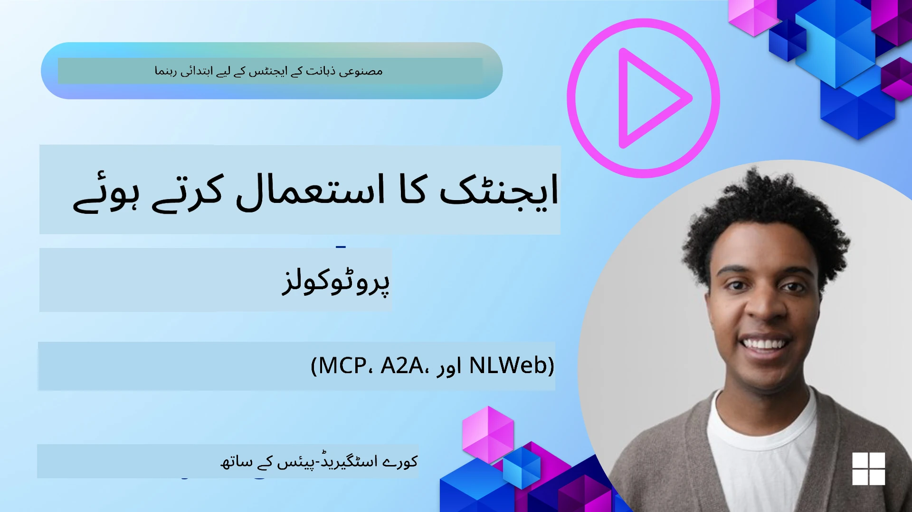
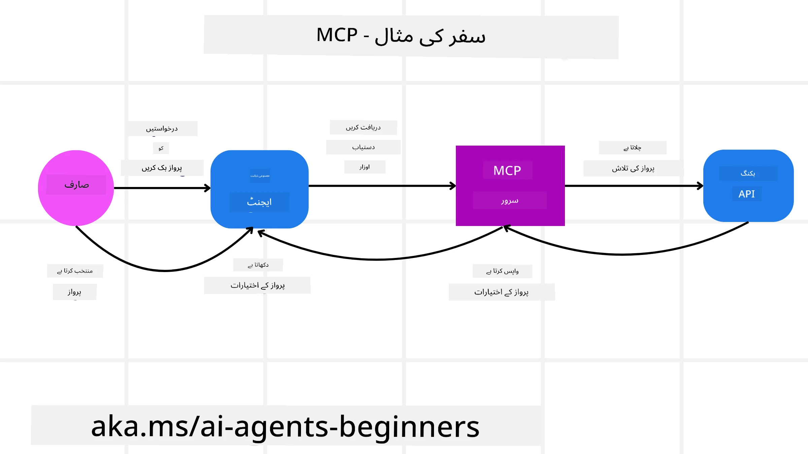
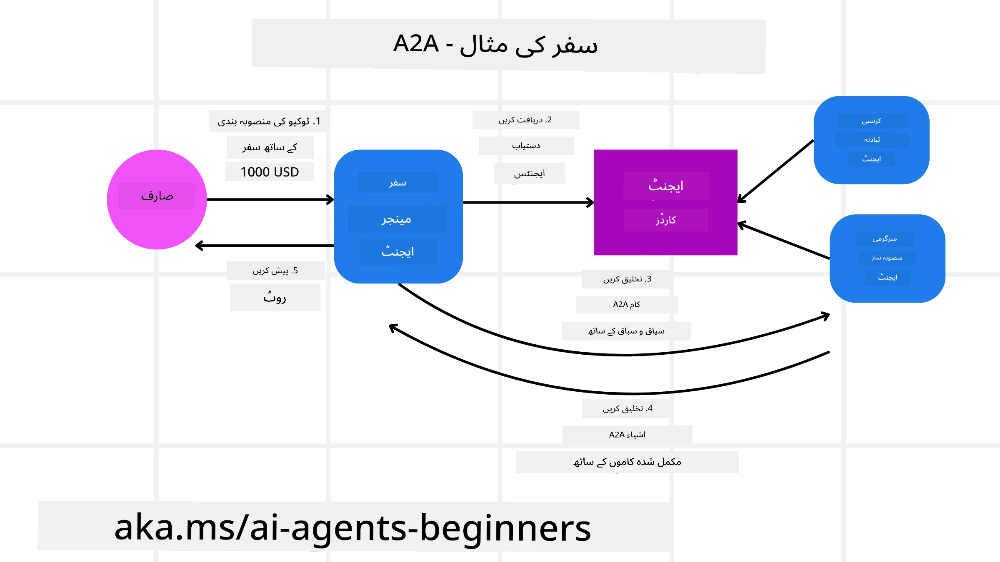
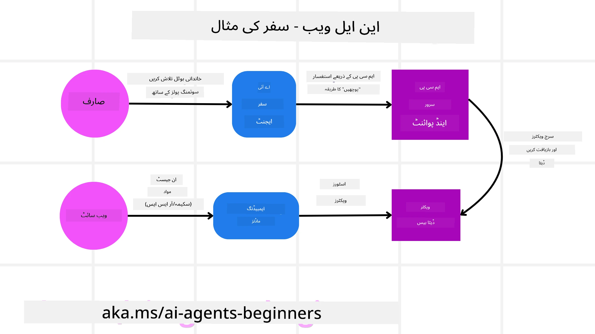

# ایجنٹک پروٹوکولز کا استعمال (MCP، A2A اور NLWeb)

> _(اس سبق کی ویڈیو دیکھنے کے لیے اوپر تصویر پر کلک کریں)_

جیسا کہ AI ایجنٹس کا استعمال بڑھ رہا ہے، اسی طرح ایسے پروٹوکولز کی ضرورت بڑھ رہی ہے جو معیاری بنانے، سیکیورٹی کی ضمانت دینے، اور کھلے جدیدیت کی حمایت کریں۔ اس سبق میں ہم تین پروٹوکولز پر بات کریں گے جو اس ضرورت کو پورا کرنے کی کوشش کرتے ہیں - ماڈل کانٹیکسٹ پروٹوکول (MCP)، ایجنٹ ٹو ایجنٹ (A2A) اور نیچرل لینگویج ویب (NLWeb)۔

## تعارف

اس سبق میں ہم یہ موضوعات کور کریں گے:

• کیسے **MCP** AI ایجنٹس کو خارجی ٹولز اور ڈیٹا تک رسائی دیتا ہے تاکہ صارف کے کام مکمل کیے جا سکیں۔

• کیسے **A2A** مختلف AI ایجنٹس کے درمیان مواصلات اور تعاون کو ممکن بناتا ہے۔

• کیسے **NLWeb** کسی بھی ویب سائٹ پر قدرتی زبان کے انٹرفیس لاتا ہے جو AI ایجنٹس کو مواد دریافت کرنے اور اس سے بات چیت کرنے کے قابل بناتا ہے۔

## سیکھنے کے اہداف

• AI ایجنٹس کے سیاق و سباق میں MCP، A2A، اور NLWeb کے بنیادی مقاصد اور فوائد کی **شناخت** کریں۔

• وضاحت کریں کہ ہر پروٹوکول کس طرح LLMs، ٹولز، اور دوسرے ایجنٹس کے درمیان مواصلات اور تعامل کی سہولت فراہم کرتا ہے۔

• پیچیدہ ایجنٹک نظام بنانے میں ہر پروٹوکول کے مختلف کرداروں کو **جانچیں**۔

## ماڈل کانٹیکسٹ پروٹوکول

**ماڈل کانٹیکسٹ پروٹوکول (MCP)** ایک کھلا اسٹینڈرڈ ہے جو ایپلیکیشنز کو LLMs کو کانٹیکسٹ اور ٹولز فراہم کرنے کے لیے معیاری طریقہ فراہم کرتا ہے۔ یہ ایک "یونیورسل اڈاپٹر" کی اجازت دیتا ہے جو مختلف ڈیٹا ذرائع اور ٹولز سے مربوط ہوتا ہے اور AI ایجنٹس کو مستقل انداز میں جڑنے دیتا ہے۔

آئیے MCP کے اجزاء، براہ راست API استعمال سے فوائد، اور ایک مثال دیکھتے ہیں کہ AI ایجنٹس MCP سرور کیسے استعمال کر سکتے ہیں۔

### MCP کے بنیادی اجزاء

MCP ایک **کلائنٹ-سرور آرکیٹیکچر** پر چلتا ہے اور اس کے بنیادی اجزاء یہ ہیں:

• **ہوسٹس** وہ LLM ایپلیکیشنز ہیں (مثلاً VSCode جیسا کوڈ ایڈیٹر) جو MCP سرور سے کنیکشن شروع کرتے ہیں۔

• **کلائنٹس** ہوسٹ ایپلیکیشن کے اندر ایسے اجزاء ہیں جو سرورز کے ساتھ ایک سے ایک کنیکشن بنائے رکھتے ہیں۔

• **سرورز** ہلکے پھلکے پروگرامز ہیں جو خاص صلاحیتیں ظاہر کرتے ہیں۔

پروٹوکول میں تین بنیادی پرامیٹیوز شامل ہیں جو MCP سرور کی صلاحیتیں ہیں:

• **ٹولز**: یہ الگ الگ ایکشنز یا فنکشنز ہیں جنہیں ایک AI ایجنٹ کال کر سکتا ہے۔ مثلاً، ایک موسم کی خدمت "موسم معلوم کریں" کا ٹول پیش کر سکتی ہے، یا ایک ای کامرس سرور "پروڈکٹ خریدیں" کا ٹول پیش کر سکتا ہے۔ MCP سرورز ہر ٹول کا نام، وضاحت اور ان پٹ/آؤٹ پٹ اسکیمہ اپنی صلاحیتوں کی فہرست میں ظاہر کرتے ہیں۔

• **وسائل**: یہ ریڈ اونلی ڈیٹا آئٹمز یا دستاویزات ہیں جو MCP سرور فراہم کر سکتا ہے، اور کلائنٹس انہیں ضرورت پر حاصل کر سکتے ہیں۔ مثالیں فائل کے مواد، ڈیٹا بیس ریکارڈز، یا لاگ فائلز ہیں۔ وسائل متن (جیسے کوڈ یا JSON) یا بائنری (جیسے تصاویر یا PDFs) ہو سکتے ہیں۔

• **پرومپٹس**: یہ پہلے سے متعین ٹیمپلیٹس ہیں جو مجوزہ پرومپٹس فراہم کرتے ہیں، جو زیادہ پیچیدہ ورکس فلو کی اجازت دیتے ہیں۔

### MCP کے فوائد

MCP AI ایجنٹس کے لیے اہم فوائد فراہم کرتا ہے:

• **ڈیانامک ٹول دریافت**: ایجنٹس ایک سرور سے دستیاب ٹولز کی فہرست حرکی طور پر وصول کر سکتے ہیں اور ان کے کام کی وضاحت بھی۔ یہ روایتی APIs کے برعکس ہے جو اکثر انٹیگریشن کے لیے جامد کوڈنگ کا مطالبہ کرتے ہیں، یعنی کسی API کی تبدیلی کوڈ اپ ڈیٹ کا تقاضا کرتی ہے۔ MCP ایک "ایک بار انٹیگریٹ کریں" نقطہ نظر دیتا ہے جو زیادہ لچکدار ہے۔

• **LLMs کے درمیان تعامل**: MCP مختلف LLMs کے ساتھ کام کرتا ہے، پیشن گوئی کے لیے بہتر کارکردگی کے لیے کور ماڈلز کو تبدیل کرنے کی لچک فراہم کرتا ہے۔

• **معیاری سیکیورٹی**: MCP ایک معیاری تصدیقی طریقہ شامل کرتا ہے، جو مزید MCP سرورز تک رسائی شامل کرنے پر اسکیل ایبلٹی بہتر بناتا ہے۔ یہ مختلف روایتی APIs کے لیے مختلف کلیدوں اور تصدیقات کے انتظام سے آسان ہے۔

### MCP کی مثال

تصور کریں کہ ایک صارف MCP سے چلنے والے AI اسسٹنٹ کا استعمال کرتے ہوئے پرواز کی بکنگ کرنا چاہتا ہے۔

1. **کنکشن**: AI اسسٹنٹ (MCP کلائنٹ) ایک ہوائی کمپنی کے فراہم کردہ MCP سرور سے رابطہ کرتا ہے۔

2. **ٹول دریافت**: کلائنٹ ہوائی کمپنی کے MCP سرور سے پوچھتا ہے، "آپ کے پاس کون سے ٹولز دستیاب ہیں؟" سرور "پروازیں تلاش کریں" اور "پروازیں بُک کریں" جیسے ٹولز کے ساتھ جواب دیتا ہے۔

3. **ٹول کال**: پھر آپ AI اسسٹنٹ سے کہتے ہیں، "براہ کرم پورٹ لینڈ سے ہونولولو کے لیے پرواز تلاش کریں۔" AI اسسٹنٹ، اپنے LLM کا استعمال کرتے ہوئے، شناخت کرتا ہے کہ اسے "پروازیں تلاش کریں" ٹول کو کال کرنا ہے اور متعلقہ پیرامیٹرز (ابتدائی، منزل) MCP سرور کو بھیجتا ہے۔

4. **عمل درآمد اور جواب**: MCP سرور، ایک ریپر کے طور پر، ہوائی کمپنی کے اندرونی بکنگ API کو کال کرتا ہے، پھر پرواز کی معلومات (مثلاً JSON ڈیٹا) وصول کرکے AI اسسٹنٹ کو واپس بھیج دیتا ہے۔

5. **مزید تعامل**: AI اسسٹنٹ پرواز کے آپشنز پیش کرتا ہے۔ جب آپ کوئی پرواز منتخب کرتے ہیں، اسسٹنٹ ممکنہ طور پر اسی MCP سرور پر "پرواز بُک کریں" ٹول کو کال کر کے بکنگ مکمل کر دیتا ہے۔

## ایجنٹ-ٹو-ایجنٹ پروٹوکول (A2A)

جہاں MCP LLMs کو ٹولز سے جوڑنے پر توجہ دیتا ہے، وہیں **ایجنٹ-ٹو-ایجنٹ (A2A) پروٹوکول** اسے ایک قدم آگے بڑھا کر مختلف AI ایجنٹس کے درمیان مواصلات اور تعاون کی اجازت دیتا ہے۔ A2A مختلف تنظیموں، ماحولیات، اور ٹیکنالوجی اسٹیکس کے AI ایجنٹس کو مشترکہ کام مکمل کرنے کے لیے منسلک کرتا ہے۔

ہم A2A کے اجزاء اور فوائد کا جائزہ لیں گے اور ایک مثال بھی دیکھیں گے کہ یہ ہمارے سفری ایپلیکیشن میں کیسے استعمال ہو سکتا ہے۔

### A2A کے بنیادی اجزاء

A2A ایجنٹس کے درمیان مواصلات کو ممکن بنانے پر مرکوز ہے تاکہ وہ صارف کے ذیلی کام کو مکمل کر سکیں۔ پروٹوکول کا ہر جزو اس میں مدد دیتا ہے:

#### ایجنٹ کارڈ

جیسے MCP سرور ٹولز کی فہرست شیئر کرتا ہے، ایجنٹ کارڈ میں شامل ہیں:
- ایجنٹ کا نام۔
- مکمل کیے جانے والے عمومی کاموں کی **تفصیل**۔
- مخصوص مہارتوں کی **فہرست** جو دیگر ایجنٹس (یا انسان صارفین تک) کو یہ سمجھنے میں مدد دیتی ہے کہ کب اور کیوں وہ ایجنٹ کو کال کریں۔
- ایجنٹ کا **موجودہ اینڈپوائنٹ URL**
- ایجنٹ کا **ورژن** اور **صلاحیتیں**، جیسا کہ اسٹریمنگ جوابات اور پش نوٹیفیکیشنز۔

#### ایجنٹ ایگزیکیوٹر

ایجنٹ ایگزیکیوٹر **صارف کی چیٹ کا کانٹیکسٹ دور دراز ایجنٹ کو پہنچانے** کا ذمہ دار ہے تاکہ دور دراز ایجنٹ یہ سمجھ سکے کہ کام کیا ہے۔ A2A سرور میں، ایجنٹ اپنے LLM کا استعمال کرتے ہوئے آنے والی درخواستیں پروسیس کرتا ہے اور اپنے اندرونی ٹولز سے کام انجام دیتا ہے۔

#### آرٹیفیکٹ

جب دور دراز ایجنٹ مطلوبہ کام مکمل کر لیتا ہے، تو اس کا کام ایک آرٹیفیکٹ کے طور پر تخلیق کیا جاتا ہے۔ آرٹیفیکٹ میں **ایجنٹ کے کام کا نتیجہ**، **کیا مکمل ہوا اس کی وضاحت**، اور پروٹوکول کے ذریعے بھیجا گیا **متنی کانٹیکسٹ** شامل ہوتا ہے۔ آرٹیفیکٹ بھیجنے کے بعد، دور دراز ایجنٹ کے ساتھ کنکشن بند کر دیا جاتا ہے جب تک دوبارہ ضرورت نہ ہو۔

#### ایونٹ قطار

یہ جزو **اپ ڈیٹس سنبھالنے اور پیغامات پہنچانے** کے لیے استعمال ہوتا ہے۔ یہ پیداوار میں ایجنٹک نظاموں کے لیے خاص طور پر اہم ہے تاکہ کام مکمل ہونے سے پہلے ایجنٹس کے درمیان کنکشن بند نہ ہو، خاص طور پر جب کام مکمل ہونے میں زیادہ وقت لگ سکتا ہو۔

### A2A کے فوائد

• **بہتر تعاون**: یہ مختلف وینڈرز اور پلیٹ فارمز کے ایجنٹس کو بات چیت، کانٹیکسٹ شیئرنگ، اور مل کر کام کرنے کی اجازت دیتا ہے، روایتی طور پر جدا نظاموں میں آسان خود کاری ممکن بناتا ہے۔

• **ماڈل منتخب کرنے کی لچک**: ہر A2A ایجنٹ اپنی درخواستوں کی خدمت کے لیے منتخب کر سکتا ہے کہ کون سا LLM استعمال کرے، جو کچھ MCP منظرناموں میں ایک ہی LLM کنیکشن کی جگہ بہتر یا فائن ٹیونڈ ماڈلز کی اجازت دیتا ہے۔

• **بلٹ ان تصدیق**: تصدیق براہ راست A2A پروٹوکول میں شامل ہے، جو ایجنٹ تعاملات کے لیے ایک مضبوط سیکیورٹی فریم ورک فراہم کرتی ہے۔

### A2A کی مثال

آئیے ہمارے سفر کی بکنگ منظرنامے کو A2A کے ذریعے مزید بڑھائیں۔

1. **صارف کی درخواست ملٹی-ایجنٹ کو**: ایک صارف "ٹریول ایجنٹ" A2A کلائنٹ/ایجنٹ سے بات کرتا ہے، مثال کے طور پر، "براہ کرم اگلے ہفتے ہونولولو کے لیے پورے سفر کی بکنگ کریں، جس میں پروازیں، ہوٹل، اور کرایہ کی گاڑی شامل ہوں۔"

2. **ٹریول ایجنٹ کی آؤرکیسٹریشن**: ٹریول ایجنٹ یہ پیچیدہ درخواست وصول کرتا ہے۔ اپنے LLM کا استعمال کرتے ہوئے، وہ کام پر غور کرتا ہے اور فیصلہ کرتا ہے کہ اسے دیگر ماہر ایجنٹس سے بات کرنی چاہیے۔

3. **ایجنٹس کے درمیان مواصلات**: ٹریول ایجنٹ پھر A2A پروٹوکول کا استعمال کر کے مختلف کمپنیوں کے بنائے گئے "ایئر لائن ایجنٹ"، "ہوٹل ایجنٹ"، اور "کار رینٹل ایجنٹ" جیسے نیچے کے ایجنٹس سے منسلک ہوتا ہے۔

4. **ذیلی کام پر عمل**: ٹریول ایجنٹ مخصوص کام ان ماہر ایجنٹس کو بھیجتا ہے (مثلاً "ہونولولو کی پروازیں تلاش کریں"، "ہوٹل بک کریں"، "گاڑی کرایہ پر لیں")۔ ہر ماہر ایجنٹ اپنے LLMs اور اپنے ٹولز کا استعمال کرتا ہے (جو MCP سرورز بھی ہو سکتے ہیں) اور اپنا کام انجام دیتا ہے۔

5. **مرکب جواب**: جب تمام نیچے کے ایجنٹس اپنے کام مکمل کر لیتے ہیں، تو ٹریول ایجنٹ نتائج (پرواز کی تفصیلات، ہوٹل کی تصدیق، کار رینٹل بکنگ) کو جوڑ کر صارف کو مکمل چیٹ انداز میں جواب بھیجتا ہے۔

## نیچرل لینگویج ویب (NLWeb)

ویب سائٹس طویل عرصے سے انٹرنیٹ پر صارفین کے لیے معلومات اور ڈیٹا تک رسائی کا بنیادی ذریعہ رہی ہیں۔

آئیے NLWeb کے مختلف اجزاء، اس کے فوائد، اور ہمارے سفر کی ایپلیکیشن کی مثال کے ذریعے دیکھتے ہیں کہ ہمارا NLWeb کیسے کام کرتا ہے۔

### NLWeb کے اجزاء

- **NLWeb ایپلیکیشن (کور سروس کوڈ)**: وہ نظام جو قدرتی زبان میں سوالات کو پروسیس کرتا ہے۔ یہ پلیٹ فارم کے مختلف حصوں کو جوڑ کر جوابات تخلیق کرتا ہے۔ آپ اسے ویب سائٹ کی قدرتی زبان کی خصوصیات چلانے والا **انجن** سمجھ سکتے ہیں۔

- **NLWeb پروٹوکول**: یہ ویب سائٹ کے ساتھ قدرتی زبان میں تعامل کے لیے **بنیادی اصولوں کا مجموعہ** ہے۔ یہ JSON فارمیٹ میں (اکثر Schema.org کا استعمال کرتے ہوئے) جوابات بھیجتا ہے۔ اس کا مقصد ایک سادہ بنیاد فراہم کرنا ہے "AI ویب" کے لیے، جس طرح HTML نے آن لائن دستاویزات شیئر کرنا ممکن بنایا تھا۔

- **MCP سرور (ماڈل کانٹیکسٹ پروٹوکول اینڈپوائنٹ)**: ہر NLWeb سیٹ اپ ایک **MCP سرور** کے طور پر بھی کام کرتا ہے۔ اس کا مطلب ہے کہ یہ دوسرے AI نظاموں کے ساتھ ٹولز (جیسے "ask" طریقہ) اور ڈیٹا شئیر کر سکتا ہے۔ عملی طور پر، یہ ویب سائٹ کے مواد اور صلاحیتوں کو AI ایجنٹس کے لیے قابل استعمال بناتا ہے، جس سے سائٹ وسیع "ایجنٹ ماحولیاتی نظام" کا حصہ بن جاتی ہے۔

- **ایمبیڈنگ ماڈلز**: یہ ماڈلز ویب سائٹ کے مواد کو عددی نمائندگیوں (جسے ویکٹرز یا ایمبیڈنگز کہتے ہیں) میں تبدیل کرنے کے لیے استعمال ہوتے ہیں۔ یہ ویکٹرز اس طرح معنی رکھتے ہیں کہ کمپیوٹر ان کا موازنہ اور تلاش کر سکتے ہیں۔ یہ ایک خاص ڈیٹا بیس میں محفوظ کیے جاتے ہیں، اور صارفین منتخب کر سکتے ہیں کہ کون سا ایمبیڈنگ ماڈل استعمال کرنا ہے۔

- **ویکٹر ڈیٹا بیس (ریکوری میکانزم)**: یہ ڈیٹا بیس **ویب سائٹ کے مواد کی ایمبیڈنگز محفوظ کرتا ہے**۔ جب کوئی سوال کرتا ہے، NLWeb تیزی سے متعلقہ معلومات تلاش کرنے کے لیے ویکٹر ڈیٹا بیس چیک کرتا ہے۔ یہ ممکنہ جوابات کی تیز فہرست دیتا ہے جو مماثلت کے لحاظ سے درجہ بند ہوتی ہے۔ NLWeb مختلف ویکٹر اسٹوریج سسٹمز جیسے Qdrant، Snowflake، Milvus، Azure AI Search، اور Elasticsearch کے ساتھ کام کرتا ہے۔

### NLWeb کی مثال

ہمارے سفر کی بکنگ ویب سائٹ پر غور کریں، مگر اس بار یہ NLWeb سے چل رہی ہے۔

1. **ڈیٹا انٹیک**: سفر کی ویب سائٹ کے موجودہ مصنوعات کے کیٹلاگز (مثلاً پروازوں کی فہرست، ہوٹل کے تفصیلات، ٹور پیکجز) Schema.org کے ذریعہ فارمیٹ کیے گئے یا RSS فیڈ کے ذریعے لوڈ کیے گئے ہیں۔ NLWeb کے ٹولز اس ساخت شدہ ڈیٹا کو انٹیک کرتے ہیں، ایمبیڈنگز بناتے ہیں، اور انہیں مقامی یا دور دراز ویکٹر ڈیٹا بیس میں ذخیرہ کرتے ہیں۔

2. **قدرتی زبان میں سوال (انسان)**: ایک صارف ویب سائٹ پر آتا ہے اور مینو کی نیویگیشن کی بجائے چیٹ انٹرفیس میں ٹائپ کرتا ہے: "مجھے ہونولولو میں اگلے ہفتے کے لیے پول کے ساتھ فیملی فرینڈلی ہوٹل تلاش کرو۔"

3. **NLWeb پروسیسنگ**: NLWeb ایپلیکیشن اس سوال کو وصول کرتی ہے۔ یہ سوال کو سمجھنے کے لیے LLM کو بھیجتی ہے اور ساتھ ساتھ اپنے ویکٹر ڈیٹا بیس میں متعلقہ ہوٹل کی فہرست کی تلاش کرتی ہے۔

4. **صحیح نتائج**: LLM تلاش کے نتائج کی تشریح میں مدد دیتا ہے، "فیملی فرینڈلی"، "پول"، اور "ہونولولو" کے معیار کی بنیاد پر بہترین میچ شناخت کرتا ہے، اور پھر قدرتی زبان میں جواب تیار کرتا ہے۔ اہم بات یہ ہے کہ جواب ویب سائٹ کے اصلی ہوٹل کیٹلاگ سے حوالہ دیتا ہے، من گھڑت معلومات سے بچتا ہے۔

5. **AI ایجنٹ کے ساتھ تعامل**: چونکہ NLWeb ایک MCP سرور کے طور پر کام کرتا ہے، ایک بیرونی AI سفری ایجنٹ بھی ویب سائٹ کے NLWeb انسٹینس سے منسلک ہو سکتا ہے۔ AI ایجنٹ پھر `ask` MCP طریقہ استعمال کر کے ویب سائٹ سے براہ راست سوال کر سکتا ہے: `ask("کیا ہوٹل کی طرف سے ہونولولو علاقے میں کوئی ویگن فرینڈلی ریستوران تجویز کیے گئے ہیں؟")`۔ NLWeb انسٹینس اس کو پروسیس کرے گا، اپنی ریستوران کی معلومات کی ڈیٹا بیس (اگر لوڈ کی گئی ہو) کا فائدہ اٹھاتے ہوئے، اور ساختہ JSON جواب لوٹائے گا۔

### MCP/A2A/NLWeb کے بارے میں مزید سوالات؟

[Microsoft Foundry Discord](https://discord.com/invite/ATgtXmAS5D) میں شامل ہوں تاکہ دوسرے سیکھنے والوں سے ملیں، آفیس آورز میں شرکت کریں، اور اپنے AI ایجنٹس کے سوالات کے جواب حاصل کریں۔

## وسائل

- [نو آموزوں کے لیے MCP](https://aka.ms/mcp-for-beginners)  
- [MCP دستاویزات](https://learn.microsoft.com/python/api/overview/azure/ai-projects-readme)
- [NLWeb ریپو](https://github.com/nlweb-ai/NLWeb)
- [Microsoft Agent Framework](https://learn.microsoft.com/en-us/agent-framework/overview/?wt.mc_id=youtube_26688_organicsocial_reactor&pivots=programming-language-python)

## پچھلا سبق

[AI Agents in Production](../10-ai-agents-production/README.md)

## اگلا سبق

[Context Engineering for AI Agents](../12-context-engineering/README.md)

---

<!-- CO-OP TRANSLATOR DISCLAIMER START -->
**ڈس کلیمر**:
یہ دستاویز AI ترجمہ سروس [Co-op Translator](https://github.com/Azure/co-op-translator) کے ذریعے ترجمہ کی گئی ہے۔ جبکہ ہم درستگی کے لیے کوشاں ہیں، براہ کرم اس بات سے آگاہ رہیں کہ خودکار ترجمے میں غلطیاں یا عدم درستیاں ہو سکتی ہیں۔ اصل دستاویز اپنے مادری زبان میں مستند ماخذ سمجھی جائے گی۔ حساس معلومات کے لیے پیشہ ور انسانی ترجمہ کی سفارش کی جاتی ہے۔ اس ترجمے کے استعمال سے پیدا ہونے والی کسی بھی غلط فہمی یا غلط تشریح کی ذمہ داری ہم قبول نہیں کرتے۔
<!-- CO-OP TRANSLATOR DISCLAIMER END -->