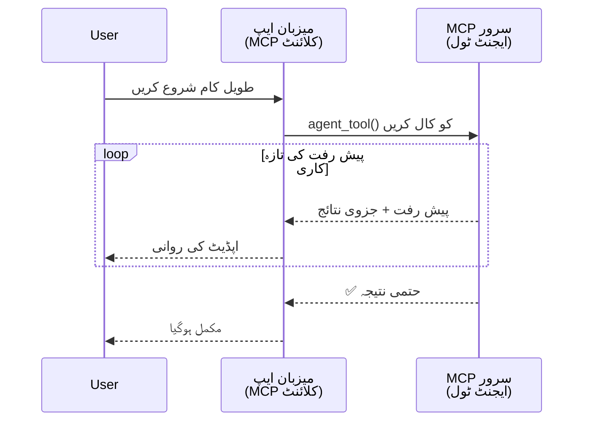
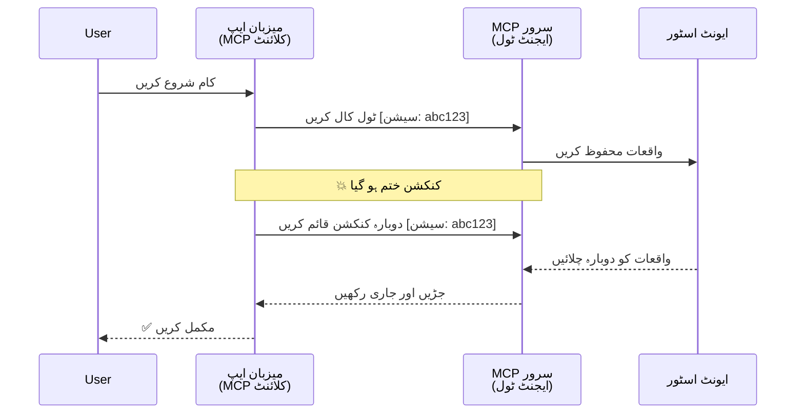
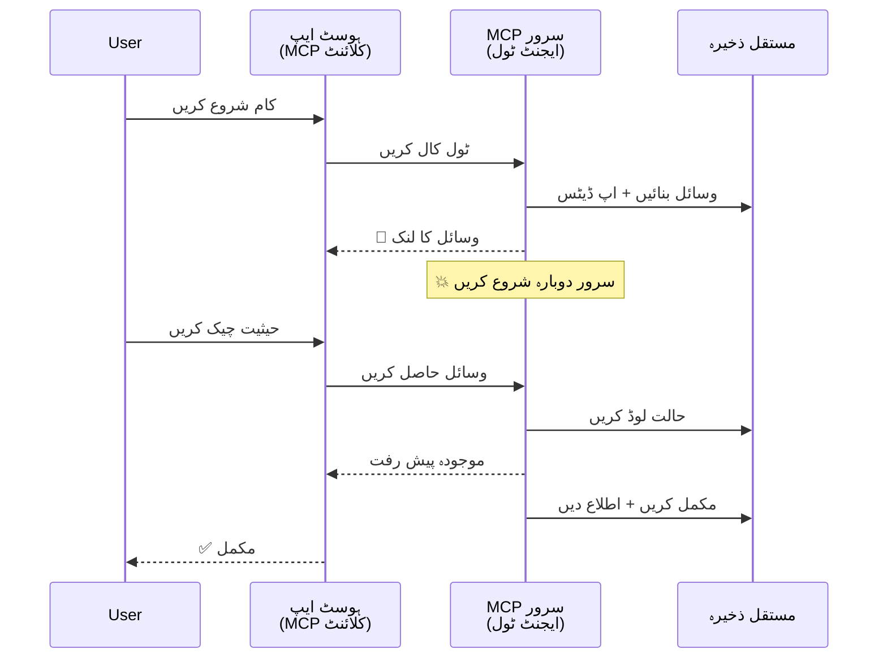
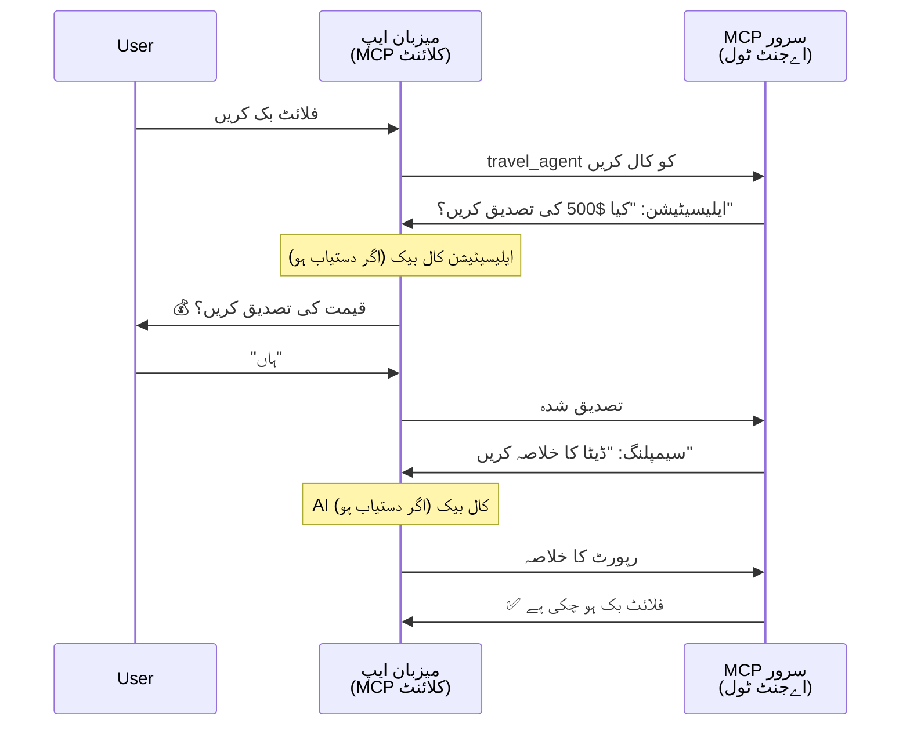
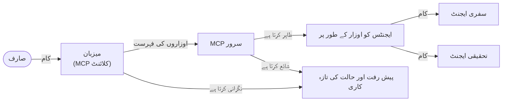

# MCP کے ساتھ ایجنٹ سے ایجنٹ رابطہ کاری کے نظام کی تعمیر

> مختصر خلاصہ - کیا آپ MCP پر Agent2Agent رابطہ نظام بنا سکتے ہیں؟ ہاں!

MCP نے اپنے اصل مقصد "LLMs کو سیاق و سباق فراہم کرنا" سے کہیں آگے ترقی کی ہے۔ حالیہ بہتریوں میں شامل ہیں [قابل تجدید اسٹریمز](https://modelcontextprotocol.io/docs/concepts/transports#resumability-and-redelivery)، [السیٹیشن](https://modelcontextprotocol.io/specification/2025-06-18/client/elicitation)، [سیمپلنگ](https://modelcontextprotocol.io/specification/2025-06-18/client/sampling)، اور اطلاعی نظام ([پروگریس](https://modelcontextprotocol.io/specification/2025-06-18/basic/utilities/progress) اور [وسائل](https://modelcontextprotocol.io/specification/2025-06-18/schema#resourceupdatednotification))، MCP اب پیچیدہ ایجنٹ سے ایجنٹ رابطہ کاری کے نظام بنانے کے لیے ایک مضبوط بنیاد فراہم کرتا ہے۔

## ایجنٹ/ٹول کی غلط فہمی

جب مزید ڈویلپرز ایجنٹک رویے رکھنے والے ٹولز کو تلاش کرتے ہیں (جو لمبے عرصے چل سکتے ہیں، عملدرآمد کے دوران اضافی ان پٹ کی ضرورت ہو سکتی ہے، وغیرہ)، ایک عام غلط فہمی یہ ہے کہ MCP مناسب نہیں ہے کیونکہ اس کے ابتدائی ٹولز کے نمونے بنیادی طور پر سادہ درخواست-جواب پیٹرنز پر مرکوز تھے۔

یہ تصور اب پرانا ہو چکا ہے۔ MCP کی وضاحت پچھلے چند مہینوں میں خاصی بہتر ہوئی ہے جس میں وہ صلاحیتیں شامل ہیں جو طویل مدتی ایجنٹک رویے کی تعمیر کے لیے خلا کو پر کرتی ہیں:

- **اسٹریمنگ اور جزوی نتائج**: عملدرآمد کے دوران حقیقی وقت کی پیش رفت کی تازہ کاری
- **قابلیتِ تجدید**: کلائنٹ منقطع ہونے کے بعد دوبارہ جڑ سکتے ہیں اور جاری رکھ سکتے ہیں
- **پائیداری**: نتائج سرور کے ری اسٹارٹ کے بعد بھی محفوظ رہتے ہیں (مثلاً، وسائل کے لنکس کے ذریعے)
- **کئی چکر**: عملدرآمد کے دوران انٹرایکٹو ان پٹ البرم روشنی اور سیمپلنگ کے ذریعے

یہ خصوصیات پیچیدہ ایجنٹک اور کثیر ایجنٹ ایپلیکیشنز کو تشکیل دینے کے لیے مرکب کی جا سکتی ہیں، جو سب MCP پروٹوکول پر تعینات کی جاتی ہیں۔

حوالہ کے لیے، ہم ایجنٹ کو "ٹول" کہیں گے جو MCP سرور پر دستیاب ہو۔ اس کا مطلب ہے کہ ایک ہوسٹ ایپلیکیشن موجود ہے جو MCP کلائنٹ کو نافذ کرتی ہے، جو MCP سرور کے ساتھ سیشن قائم کرتی ہے اور ایجنٹ کو کال کر سکتی ہے۔

## کیا چیز MCP ٹول کو "ایجنٹک" بناتی ہے؟

عملدرآمد میں جانے سے پہلے، آئیے وہ بنیادی انفراسٹرکچر صلاحیتیں قائم کریں جو لمبے عرصے چلنے والے ایجنٹس کی حمایت کے لیے درکار ہیں۔

> ہم ایجنٹ کی تعریف ایک ایسی ہستی کے طور پر کریں گے جو خود مختار طریقے سے طویل عرصے تک کام کر سکتی ہے، جو پیچیدہ کاموں کو سنبھال سکتی ہے جن میں متعدد تعاملات یا حقیقی وقت کی آراء کی بنیاد پر ایڈجسٹمنٹ کی ضرورت ہو سکتی ہے۔

### 1. اسٹریمنگ اور جزوی نتائج

روایتی درخواست-جواب پیٹرنز لمبے عرصے چلنے والے کاموں کے لیے کام نہیں کرتے۔ ایجنٹس کو فراہم کرنا ہوتا ہے:

- حقیقی وقت کی پیش رفت کی تازہ کاری
- درمیانی نتائج

**MCP کی حمایت**: وسائل کی تازہ کاری کی اطلاعی نظام جزوی نتائج کے لیے اسٹریمنگ کو ممکن بناتے ہیں، حالانکہ اس کے لیے JSON-RPC کے 1:1 درخواست/جواب ماڈل کے ساتھ تضادات سے بچنے کے لیے محتاط ڈیزائن کی ضرورت ہوتی ہے۔

| خصوصیت                   | استعمال کا کیس                                                                                                                                    | MCP کی حمایت                                                                             |
| -------------------------- | ------------------------------------------------------------------------------------------------------------------------------------------------- | ----------------------------------------------------------------------------------------- |
| حقیقی وقت کی پیش رفت کی تازہ کاری | صارف کوڈبیس مائیگریشن ٹاسک کی درخواست کرتا ہے۔ ایجنٹ پیش رفت اسٹریم کرتا ہے: "10% - انحصاریات کا تجزیہ... 25% - ٹائپ اسکرپٹ فائلوں کی تبدیلی... 50% - امپورٹس کی تازہ کاری..." | ✅ پروگریس اطلاعی نظام                                                                     |
| جزوی نتائج                | "کتاب بنائیں" ٹاسک جزوی نتائج اسٹریم کرتا ہے، مثلاً: 1) کہانی کا خاکہ، 2) ابواب کی فہرست، 3) ہر باب مکمل ہوتے ہی۔ ہوسٹ کسی بھی مرحلے پر معائنہ، منسوخ یا دوبارہ ہدایت کر سکتا ہے۔ | ✅ اطلاعات کو "موسع" کیا جا سکتا ہے جزوی نتائج شامل کرنے کے لیے، پی آر 383، 776 پر تجاویز دیکھیں     |

<div align="center" style="font-style: italic; font-size: 0.95em; margin-bottom: 0.5em;">
<strong>تصویر 1:</strong> یہ خاکہ دکھاتا ہے کہ MCP ایجنٹ کسی لمبے عرصے چلنے والے کام کے دوران ہوسٹ ایپلیکیشن کو حقیقی وقت کی پیش رفت کی تازہ کاری اور جزوی نتائج کیسے اسٹریم کرتا ہے، جس سے صارف کو عملدرآمد کی نگرانی ممکن ہوتی ہے۔
</div>



### 2. قابلیتِ تجدید

ایجنٹس کو نیٹ ورک منقطع ہونے کی صورت میں اچھی طرح سے سنبھالنا چاہیے:

- (کلائنٹ کی) منقطع ہونے کے بعد دوبارہ جڑنا
- جہاں سے رکے تھے وہاں سے جاری رکھنا (پیغام کی دوبارہ فراہمی)

**MCP کی حمایت**: MCP StreamableHTTP ٹرانسپورٹ آج سیشن کی بحالی اور پیغام کی دوبارہ فراہمی کو سیشن آئی ڈیز اور آخری ایونٹ آئی ڈیز کے ساتھ سپورٹ کرتا ہے۔ اہم بات یہ ہے کہ سرور کو ایک ایونٹ اسٹور نافذ کرنا چاہیے جو کلائنٹ کی دوبارہ کنکشن پر ایونٹس کو دوبارہ چلانے کی اجازت دیتا ہے۔
نوٹ کریں کہ ایک کمیونٹی تجویز (PR #975) ہے جو ٹرانسپورٹ-آگناسٹک قابل تجدید اسٹریمز کو تلاش کرتی ہے۔

| خصوصیت     | استعمال کا کیس                                                                                                                                        | MCP کی حمایت                                                              |
| ------------ | --------------------------------------------------------------------------------------------------------------------------------------------------- | -------------------------------------------------------------------------- |
| قابلیتِ تجدید | کلائنٹ لمبے عرصے چلنے والے ٹاسک کے دوران منقطع ہو جاتا ہے۔ دوبارہ کنکشن پر سیشن بحال ہو جاتا ہے اور چھوٹے ہوئے ایونٹس دوبارہ چلائے جاتے ہیں، اور کام بغیر رکے جاری رہتا ہے۔ | ✅ StreamableHTTP ٹرانسپورٹ سیشن آئی ڈیز، ایونٹ ری پلے، اور ایونٹ اسٹور کے ساتھ  |

<div align="center" style="font-style: italic; font-size: 0.95em; margin-bottom: 0.5em;">
<strong>تصویر 2:</strong> یہ خاکہ دکھاتا ہے کہ MCP کا StreamableHTTP ٹرانسپورٹ اور ایونٹ اسٹور کیسے بغیر رکے سیشن کی بحالی کو ممکن بناتے ہیں: اگر کلائنٹ منقطع ہو جائے تو وہ دوبارہ جڑ سکتا ہے اور چھوٹے ہوئے ایونٹس کو دوبارہ چلا سکتا ہے، کام بغیر کسی نقصان کے جاری رکھتا ہے۔
</div>



### 3. پائیداری

لمبے عرصے چلنے والے ایجنٹس کو مستقل حالت کی ضرورت ہوتی ہے:

- نتائج سرور کے ری اسٹارٹس کے بعد بھی برقرار رہتے ہیں
- حیثیت خارجِ بینڈ حاصل کی جا سکتی ہے
- سیشنز کے دوران پیش رفت کی ٹریکنگ

**MCP کی حمایت**: MCP اب ٹول کالز کے لیے ریسورس لنک واپسی کی قسم کی حمایت کرتا ہے۔ آج کا ایک ممکنہ نمونہ یہ ہے کہ ایک ٹول ڈیزائن کیا جائے جو ایک ریسورس تخلیق کرے اور فوراً ریسورس لنک واپس کرے۔ ٹول پس منظر میں کام جاری رکھ سکتا ہے اور ریسورس کو اپ ڈیٹ کرتا ہے۔ اس طرح، کلائنٹ اس ریسورس کی حالت کو پول کر کے جزوی یا مکمل نتائج حاصل کر سکتا ہے (سرور کی جانب سے فراہم کردہ ریسورس اپڈیٹس پر مبنی) یا اپڈیٹ اطلاعی نظام کے لیے ریسورس کو سبسکرائب کر سکتا ہے۔

ایک حد یہ ہے کہ پولنگ یا سبسکرپشن سے وسائل استعمال ہو سکتے ہیں جس کے اثرات بڑے پیمانے پر ہو سکتے ہیں۔ ایک کھلی کمیونٹی تجویز (#992 سمیت) ویب ہُکس یا ٹریگرز شامل کرنے کی تحقیقات کر رہی ہے جو سرور کلائنٹ/ہوسٹ ایپلیکیشن کو اپڈیٹس کی اطلاع دے سکے۔

| خصوصیت    | استعمال کا کیس                                                                                                                                | MCP کی حمایت                                                      |
| ---------- | ------------------------------------------------------------------------------------------------------------------------------------------- | ---------------------------------------------------------------- |
| پائیداری    | ڈیٹا مائیگریشن ٹاسک کے دوران سرور کریش ہو جاتا ہے۔ نتائج اور پیش رفت دوبارہ شروع ہونے کے بعد بچ جاتی ہے، کلائنٹ حیثیت چیک کر کے مستقل ریسورس سے جاری رکھ سکتا ہے۔           | ✅ وسائل کے لنکس مستقل ذخیرہ اور حیثیت کی اطلاعی نظام کے ساتھ      |

آج کا عام پیٹرن یہ ہے کہ ایک ٹول ڈیزائن کیا جائے جو ریسورس بنائے اور فوراً ریسورس لنک واپس کرے۔ ٹول پس منظر میں کام کرتا رہے، ریسورس اطلاعات جاری کرے جو پیش رفت کی تازہ کاری کے طور پر کام کریں یا جزوی نتائج شامل کریں، اور ضرورت کے مطابق ریسورس کے مواد کو اپ ڈیٹ کرے۔

<div align="center" style="font-style: italic; font-size: 0.95em; margin-bottom: 0.5em;">
<strong>تصویر 3:</strong> یہ خاکہ دکھاتا ہے کہ MCP ایجنٹس کس طرح مستقل وسائل اور حیثیت کی اطلاعی نظام استعمال کرتے ہیں تاکہ لمبے عرصے چلنے والے کام سرور ری اسٹارٹس کے بعد بھی زندہ رہیں، جس سے کلائنٹس کو پیش رفت چیک کرنے اور ناکامی کے بعد بھی نتائج حاصل کرنے کی اجازت ملتی ہے۔
</div>



### 4. کئی چکر کی تعاملات

ایجنٹس کو عموماً عملدرآمد کے دوران اضافی ان پٹ کی ضرورت ہوتی ہے:

- انسانی وضاحت یا منظوری
- پیچیدہ فیصلوں کے لیے AI مدد
- متحرک پیرامیٹر کی ایڈجسٹمنٹ

**MCP کی حمایت**: مکمل حمایت سیمپلنگ (AI ان پٹ کے لیے) اور ایلسیٹیشن (انسانی ان پٹ کے لیے) کے ذریعے۔

| خصوصیت                   | استعمال کا کیس                                                                                                                             | MCP کی حمایت                                             |
| ----------------------- | ---------------------------------------------------------------------------------------------------------------------------------------- | -------------------------------------------------------- |
| کئی چکر کی تعاملات       | سفر کی بکنگ ایجنٹ صارف سے قیمت کی تصدیق طلب کرتا ہے، پھر AI سے سفر کے ڈیٹا کا خلاصہ کرنے کو کہتا ہے قبل اس کے کہ بکنگ مکمل ہو۔          | ✅ انسانی ان پٹ کے لیے elicitation، AI ان پٹ کے لیے sampling |

<div align="center" style="font-style: italic; font-size: 0.95em; margin-bottom: 0.5em;">
<strong>تصویر 4:</strong> یہ خاکہ دکھاتا ہے کہ MCP ایجنٹس عملدرآمد کے دوران انسانی ان پٹ کی تعاملی طلب یا AI امداد کیسے حاصل کر سکتے ہیں، پیچیدہ اور کئی چکر کے ورک فلو جیسے تصدیقات اور متحرک فیصلہ سازی کی حمایت کرتے ہوئے۔
</div>



## MCP پر لمبے عرصے چلنے والے ایجنٹس کو نافذ کرنا - کوڈ کا جائزہ

اس مضمون کے حصے کے طور پر، ہم ایک [کوڈ ریپوزٹری](https://github.com/victordibia/ai-tutorials/tree/main/MCP%20Agents) فراہم کرتے ہیں جس میں MCP پائتھن SDK کے ساتھ StreamableHTTP ٹرانسپورٹ کے ذریعے سیشن بحالی اور پیغام کی دوبارہ فراہمی کے لیے لمبے عرصے چلنے والے ایجنٹس کا مکمل نفاذ موجود ہے۔ یہ نفاذ دکھاتا ہے کہ MCP کی صلاحیتیں کیسے مرکب کی جا سکتی ہیں تاکہ ایجنٹ جیسے پیچیدہ رویے فعال ہوں۔

خاص طور پر، ہم دو بنیادی ایجنٹ ٹولز کے ساتھ ایک سرور نافذ کرتے ہیں:

- **ٹریول ایجنٹ** - سفر کی بکنگ سروس کی نقل، جس میں elicitation کے ذریعے قیمت کی تصدیق شامل ہے
- **ریسرچ ایجنٹ** - تحقیقاتی کام انجام دیتا ہے جس میں AI مدد یافتہ خلاصے سیمپلنگ کے ذریعے شامل ہیں

دونوں ایجنٹس حقیقی وقت کی پیش رفت کی تازہ کاری، انٹرایکٹو تصدیقات، اور مکمل سیشن بحالی کی صلاحیتیں دکھاتے ہیں۔

### کلیدی نفاذی تصورات

مندرجہ ذیل سیکشنز ہر صلاحیت کے لیے سرور سائیڈ ایجنٹ نفاذ اور کلائنٹ سائیڈ ہوسٹ ہینڈلنگ دکھاتے ہیں:

#### اسٹریمنگ اور پیش رفت کی تازہ کاری - حقیقی وقت کا کام کا اسٹیٹس

اسٹریمنگ ایجنٹس کو لمبے عرصے چلنے والے کاموں کے دوران حقیقی وقت کی پیش رفت کی تازہ کاری فراہم کرنے کے قابل بناتا ہے، صارفین کو کام کی حالت اور درمیانی نتائج سے آگاہ رکھتا ہے۔

**سرور نفاذ (ایجنٹ پیش رفت اطلاعات بھیجتا ہے):**

```python
# سرور/سرور.py سے - سفر ایجنٹ پیش رفت کی تازہ کاری بھیج رہا ہے
for i, step in enumerate(steps):
    await ctx.session.send_progress_notification(
        progress_token=ctx.request_id,
        progress=i * 25,
        total=100,
        message=step,
        related_request_id=str(ctx.request_id)
    )
    await anyio.sleep(2)  # کام کی نقل کرنا

# متبادل: تفصیلی قدم بہ قدم اپ ڈیٹس کے لیے پیغامات کی لاگنگ
await ctx.session.send_log_message(
    level="info",
    data=f"Processing step {current_step}/{steps} ({progress_percent}%)",
    logger="long_running_agent",
    related_request_id=ctx.request_id,
)
```

**کلائنٹ نفاذ (ہوسٹ پیش رفت کی تازہ کاری وصول کرتا ہے):**

```python
# کلائنٹ/کلائنٹ.py سے - کلائنٹ جو حقیقی وقت کی اطلاعات سنبھال رہا ہے
async def message_handler(message) -> None:
    if isinstance(message, types.ServerNotification):
        if isinstance(message.root, types.LoggingMessageNotification):
            console.print(f"📡 [dim]{message.root.params.data}[/dim]")
        elif isinstance(message.root, types.ProgressNotification):
            progress = message.root.params
            console.print(f"🔄 [yellow]{progress.message} ({progress.progress}/{progress.total})[/yellow]")

# سیشن بنانے کے وقت پیغام ہینڈلر کو رجسٹر کریں
async with ClientSession(
    read_stream, write_stream,
    message_handler=message_handler
) as session:
```

#### elicitation - صارف کا ان پٹ طلب کرنا

elicitation ایجنٹس کو عملدرآمد کے دوران صارف سے ان پٹ طلب کرنے کے قابل بناتا ہے۔ یہ لمبے عرصے چلنے والے کاموں کے دوران تصدیقات، وضاحتوں، یا منظوریوں کے لیے ضرروی ہے۔

**سرور نفاذ (ایجنٹ تصدیق طلب کرتا ہے):**

```python
# سرور/server.py سے - ٹریول ایجنٹ قیمت کی تصدیق طلب کر رہا ہے
elicit_result = await ctx.session.elicit(
    message=f"Please confirm the estimated price of $1200 for your trip to {destination}",
    requestedSchema=PriceConfirmationSchema.model_json_schema(),
    related_request_id=ctx.request_id,
)

if elicit_result and elicit_result.action == "accept":
    # بکنگ جاری رکھیں
    logger.info(f"User confirmed price: {elicit_result.content}")
elif elicit_result and elicit_result.action == "decline":
    # بکنگ منسوخ کریں
    booking_cancelled = True
```

**کلائنٹ نفاذ (ہوسٹ elicitation کال بیک فراہم کرتا ہے):**

```python
# کلائنٹ/کلائنٹ.py سے - کلائنٹ کی درخواستیں سنبھالنا
async def elicitation_callback(context, params):
    console.print(f"💬 Server is asking for confirmation:")
    console.print(f"   {params.message}")

    response = console.input("Do you accept? (y/n): ").strip().lower()

    if response in ['y', 'yes']:
        return types.ElicitResult(
            action="accept",
            content={"confirm": True, "notes": "Confirmed by user"}
        )
    else:
        return types.ElicitResult(
            action="decline",
            content={"confirm": False, "notes": "Declined by user"}
        )

# سیشن بناتے وقت کال بیک رجسٹر کریں
async with ClientSession(
    read_stream, write_stream,
    elicitation_callback=elicitation_callback
) as session:
```

#### سیمپلنگ - AI مدد طلب کرنا

سیمپلنگ ایجنٹس کو عملدرآمد کے دوران پیچیدہ فیصلوں یا مواد کی تخلیق کے لیے LLM مدد طلب کرنے کے قابل بناتا ہے۔ یہ ہائبرڈ انسانی-AI ورک فلو کو ممکن بناتا ہے۔

**سرور نفاذ (ایجنٹ AI مدد طلب کرتا ہے):**

```python
# سرور/server.py سے - تحقیق ایجنٹ AI خلاصہ کی درخواست کر رہا ہے
sampling_result = await ctx.session.create_message(
    messages=[
        SamplingMessage(
            role="user",
            content=TextContent(type="text", text=f"Please summarize the key findings for research on: {topic}")
        )
    ],
    max_tokens=100,
    related_request_id=ctx.request_id,
)

if sampling_result and sampling_result.content:
    if sampling_result.content.type == "text":
        sampling_summary = sampling_result.content.text
        logger.info(f"Received sampling summary: {sampling_summary}")
```

**کلائنٹ نفاذ (ہوسٹ سیمپلنگ کال بیک فراہم کرتا ہے):**

```python
# کلائنٹ/کلائنٹ.py سے - کلائنٹ کے نمونہ درخواستوں کو سنبھالنا
async def sampling_callback(context, params):
    message_text = params.messages[0].content.text if params.messages else 'No message'
    console.print(f"🧠 Server requested sampling: {message_text}")

    # حقیقی درخواست میں، یہ ایک LLM API کو کال کر سکتا ہے
    # نمائش کے مقاصد کے لیے، ہم ایک نقلی جواب فراہم کرتے ہیں
    mock_response = "Based on current research, MCP has evolved significantly..."

    return types.CreateMessageResult(
        role="assistant",
        content=types.TextContent(type="text", text=mock_response),
        model="interactive-client",
        stopReason="endTurn"
    )

# سیشن بناتے وقت کال بیک رجسٹر کریں
async with ClientSession(
    read_stream, write_stream,
    sampling_callback=sampling_callback,
    elicitation_callback=elicitation_callback
) as session:
```

#### قابلیتِ تجدید - منقطع ہونے کے دوران سیشن تسلسل

قابلیتِ تجدید اس بات کو یقینی بناتی ہے کہ لمبے عرصے چلنے والے ایجنٹ ٹاسک کلائنٹ کی منقطع ہونے کی صورت میں زندہ رہیں اور دوبارہ جڑنے پر بغیر رکے چلتے رہیں۔ یہ ایونٹ اسٹورز اور بحالی ٹوکنز کے ذریعے نافذ ہوتی ہے۔

**ایونٹ اسٹور نفاذ (سرور سیشن کی حالت رکھتا ہے):**

```python
# سرور/event_store.py سے - سادہ میموری میں واقعہ سٹور
class SimpleEventStore(EventStore):
    def __init__(self):
        self._events: list[tuple[StreamId, EventId, JSONRPCMessage]] = []
        self._event_id_counter = 0

    async def store_event(self, stream_id: StreamId, message: JSONRPCMessage) -> EventId:
        """Store an event and return its ID."""
        self._event_id_counter += 1
        event_id = str(self._event_id_counter)
        self._events.append((stream_id, event_id, message))
        return event_id

    async def replay_events_after(self, last_event_id: EventId, send_callback: EventCallback) -> StreamId | None:
        """Replay events after the specified ID for resumption."""
        start_index = None
        stream_id = None
        for index, (event_stream_id, event_id, _) in enumerate(self._events):
            if event_id == last_event_id:
                start_index = index + 1
                stream_id = event_stream_id
                break

        if start_index is None:
            return None

        # سیشن کے اصل اسٹریم سے صرف بعد کے واقعات کو دوبارہ چلائیں۔
        for event_stream_id, event_id, message in self._events[start_index:]:
            if event_stream_id != stream_id:
                continue
            await send_callback(EventMessage(message, event_id))

        return stream_id

# سرور/server.py سے - ایونٹ سٹور کو سیشن مینیجر میں منتقل کرنا
def create_server_app(event_store: Optional[EventStore] = None) -> Starlette:
    server = ResumableServer()

    # دوبارہ شروع کرنے کے لیے ایونٹ سٹور کے ساتھ سیشن مینیجر بنائیں
    session_manager = StreamableHTTPSessionManager(
        app=server,
        event_store=event_store,  # ایونٹ سٹور سیشن کے دوبارہ شروع ہونے کو ممکن بناتا ہے
        json_response=False,
        security_settings=security_settings,
    )

    return Starlette(routes=[Mount("/mcp", app=session_manager.handle_request)])

# استعمال: ایونٹ سٹور کے ساتھ شروع کریں
event_store = SimpleEventStore()
app = create_server_app(event_store)
```

**کلائنٹ میٹا ڈیٹا بحالی ٹوکن کے ساتھ (کلائنٹ موجودہ حالت کے استعمال سے دوبارہ جڑتا ہے):**

```python
# کلائنٹ/client.py سے - میٹاڈیٹا کے ساتھ کلائنٹ ریزیومپشن
if existing_tokens and existing_tokens.get("resumption_token"):
    # ریزیومپشن ٹوکن کا استعمال کریں تاکہ جہاں چھوڑا تھا وہاں سے دوبارہ شروع کیا جا سکے
    metadata = ClientMessageMetadata(
        resumption_token=existing_tokens["resumption_token"],
    )
else:
    # کال بیک بنائیں تاکہ ریزیومپشن ٹوکن موصول ہونے پر اسے محفوظ کیا جا سکے
    def enhanced_callback(token: str):
        protocol_version = getattr(session, 'protocol_version', None)
        token_manager.save_tokens(session_id, token, protocol_version, command, args)

    metadata = ClientMessageMetadata(
        on_resumption_token_update=enhanced_callback,
    )

# ریزیومپشن میٹاڈیٹا کے ساتھ درخواست بھیجیں
result = await session.send_request(
    types.ClientRequest(
        types.CallToolRequest(
            method="tools/call",
            params=types.CallToolRequestParams(name=command, arguments=args)
        )
    ),
    types.CallToolResult,
    metadata=metadata,
)
```

ہوسٹ ایپلیکیشن سیشن آئی ڈیز اور بحالی ٹوکن مقامی طور پر رکھتی ہے، جس سے وہ بغیر پیش رفت یا حالت کھوئے موجودہ سیشنز سے دوبارہ جڑ سکتی ہے۔

### کوڈ کی تنظیم

<div align="center" style="font-style: italic; font-size: 0.95em; margin-bottom: 0.5em;">
<strong>تصویر 5:</strong> MCP پر مبنی ایجنٹ نظام کا معماری خاکہ
</div>



**اہم فائلیں:**

- **`server/server.py`** - قابل تجدید MCP سرور جس میں سفری اور تحقیقی ایجنٹس شامل ہیں جو elicitation، سیمپلنگ، اور پیش رفت کی تازہ کاریوں کو ظاہر کرتے ہیں
- **`client/client.py`** - انٹرایکٹو ہوسٹ ایپلیکیشن جس میں بحالی کی حمایت، کال بیک ہینڈلرز، اور ٹوکن مینجمنٹ شامل ہے
- **`server/event_store.py`** - ایونٹ اسٹور نفاذ جو سیشن کی بحالی اور پیغام کی دوبارہ فراہمی کو ممکن بناتا ہے

## MCP پر کثیر ایجنٹ رابطہ کاری کو بڑھانا

مذکورہ نفاذ کو کئی ایجنٹ نظاموں تک بڑھایا جا سکتا ہے ہوسٹ ایپلیکیشن کی ذہانت اور دائرہ کار کو بڑھا کر:

- **ذہانت بخش ٹاسک تجزیہ**: ہوسٹ پیچیدہ صارف کی درخواستوں کا تجزیہ کرتا ہے اور انہیں مختلف ماہر ایجنٹس کے ذیلی کاموں میں تقسیم کرتا ہے
- **کئی سرورز کی ہم آہنگی**: ہوسٹ کئی MCP سرورز سے کنکشن رکھتا ہے، ہر ایک مختلف ایجنٹ صلاحیتیں پیش کرتا ہے
- **ٹاسک کی حالت کا انتظام**: ہوسٹ کئی ہم عصر ایجنٹ ٹاسکوں کی پیش رفت کو ٹریک کرتا ہے، انحصار اور ترتیب کو سنبھالتا ہے
- **مزاحمت اور دوبارہ کوششیں**: ہوسٹ ناکامیوں کا انتظام کرتا ہے، دوبارہ کوشش کی منطق نافذ کرتا ہے، اور ایجنٹس کی غیر دستیابی پر ٹاسک ری راؤٹ کرتا ہے
- **نتائج کی ترکیب**: ہوسٹ متعدد ایجنٹس کے آوٹ پٹ کو مربوط حتمی نتائج میں ضم کرتا ہے

ہوسٹ ایک سادہ کلائنٹ سے ذہین منظِم میں تبدیل ہو جاتا ہے، جو تقسیم شدہ ایجنٹ صلاحیتوں کو مربوط کرتا ہے جبکہ وہی MCP پروٹوکول کی بنیاد برقرار رکھتا ہے۔

## نتیجہ

MCP کی بہتر شدہ صلاحیتیں - وسائل کی اطلاعات، elicitation/sampling، قابل تجدید اسٹریمز، اور مستقل وسائل - پیچیدہ ایجنٹ سے ایجنٹ بات چیت کو ممکن بناتی ہیں جبکہ پروٹوکول کی سادگی برقرار رکھتی ہیں۔

## شروعات کرنا

اپنا ایجنٹ2ایجنٹ نظام بنانے کے لیے تیار ہیں؟ درج ذیل اقدامات کریں:

### 1. ڈیمو چلائیں

```bash
# وقفے کے لیے ایونٹ اسٹور کے ساتھ سرور شروع کریں
python -m server.server --port 8006

# ایک اور ٹرمینل میں، انٹرایکٹو کلائنٹ چلائیں
python -m client.client --url http://127.0.0.1:8006/mcp
```

**انٹرایکٹو موڈ میں دستیاب کمانڈز:**

- `travel_agent` - elicitation کے ذریعے قیمت کی تصدیق کے ساتھ سفر کی بکنگ کریں
- `research_agent` - سیمپلنگ کے ذریعے AI مدد یافتہ خلاصوں کے ساتھ تحقیق کریں
- `list` - تمام دستیاب ٹولز دکھائیں
- `clean-tokens` - بحالی ٹوکنز صاف کریں
- `help` - تفصیلی کمانڈ مدد دکھائیں
- `quit` - کلائنٹ سے باہر نکلیں

### 2. بحالی کی صلاحیتوں کا تجربہ کریں

- ایک لمبے عرصے چلنے والے ایجنٹ کا آغاز کریں (مثلاً `travel_agent`)
- عملدرآمد کے دوران کلائنٹ منقطع کریں (Ctrl+C)
- کلائنٹ کو دوبارہ شروع کریں - یہ خود بخود وہاں سے بحال ہو جائے گا جہاں سے رکا تھا

### 3. دریافت کریں اور بڑھائیں

- **مثالیں دیکھیں**: اس [mcp-agents](https://github.com/victordibia/ai-tutorials/tree/main/MCP%20Agents) کو دیکھیں
- **کمیونٹی میں شامل ہوں**: GitHub پر MCP مباحثوں میں حصہ لیں
- **تجربہ کریں**: ایک سادہ لمبے عرصے چلنے والا ٹاسک سے شروع کریں اور مرحلہ وار اسٹریمنگ، قابلیتِ تجدید، اور کثیر ایجنٹ ہم آہنگی شامل کریں

یہ ظاہر کرتا ہے کہ MCP ٹول پر مبنی سادگی کو برقرار رکھتے ہوئے ذہین ایجنٹ رویے کیسے فعال کرتا ہے۔

مجموعی طور پر، MCP پروٹوکول کی وضاحت تیزی سے بڑھ رہی ہے؛ قارئین کو ترغیب دی جاتی ہے کہ وہ تازہ ترین اپ ڈیٹس کے لیے رسمی دستاویزات کی ویب سائٹ ملاحظہ کریں - https://modelcontextprotocol.io/introduction

---

<!-- CO-OP TRANSLATOR DISCLAIMER START -->
**ڈس کلیمر**:
یہ دستاویز AI ترجمہ سروس [Co-op Translator](https://github.com/Azure/co-op-translator) کے ذریعے ترجمہ کی گئی ہے۔ جبکہ ہم درستگی کے لیے کوشاں ہیں، براہ کرم اس بات سے آگاہ رہیں کہ خودکار ترجمے میں غلطیاں یا عدم درستیاں ہو سکتی ہیں۔ اصل دستاویز اپنے مادری زبان میں مستند ماخذ سمجھی جائے گی۔ حساس معلومات کے لیے پیشہ ور انسانی ترجمہ کی سفارش کی جاتی ہے۔ اس ترجمے کے استعمال سے پیدا ہونے والی کسی بھی غلط فہمی یا غلط تشریح کی ذمہ داری ہم قبول نہیں کرتے۔
<!-- CO-OP TRANSLATOR DISCLAIMER END -->