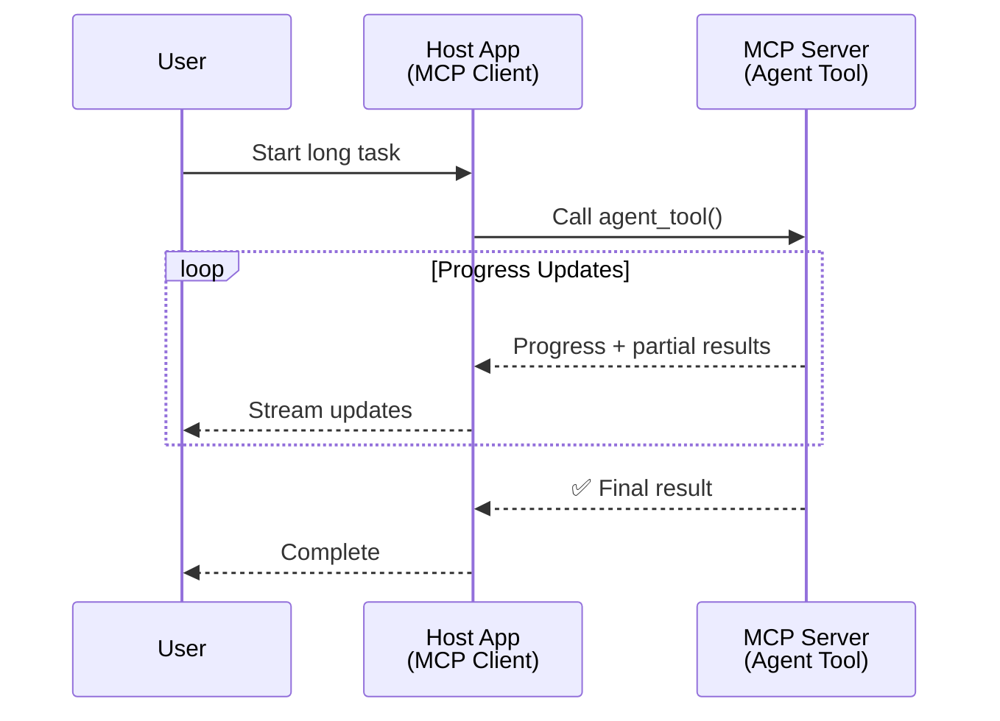
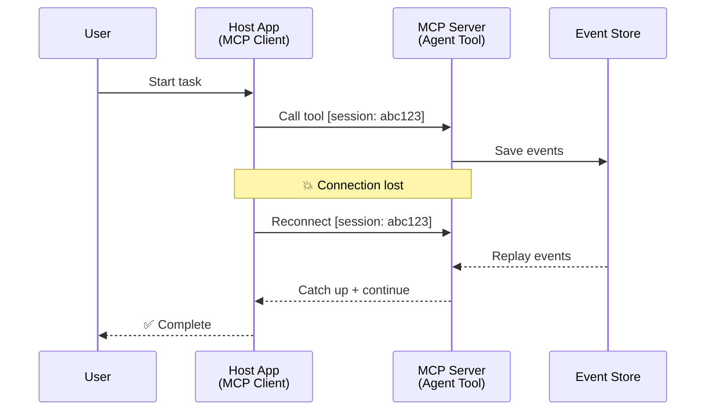
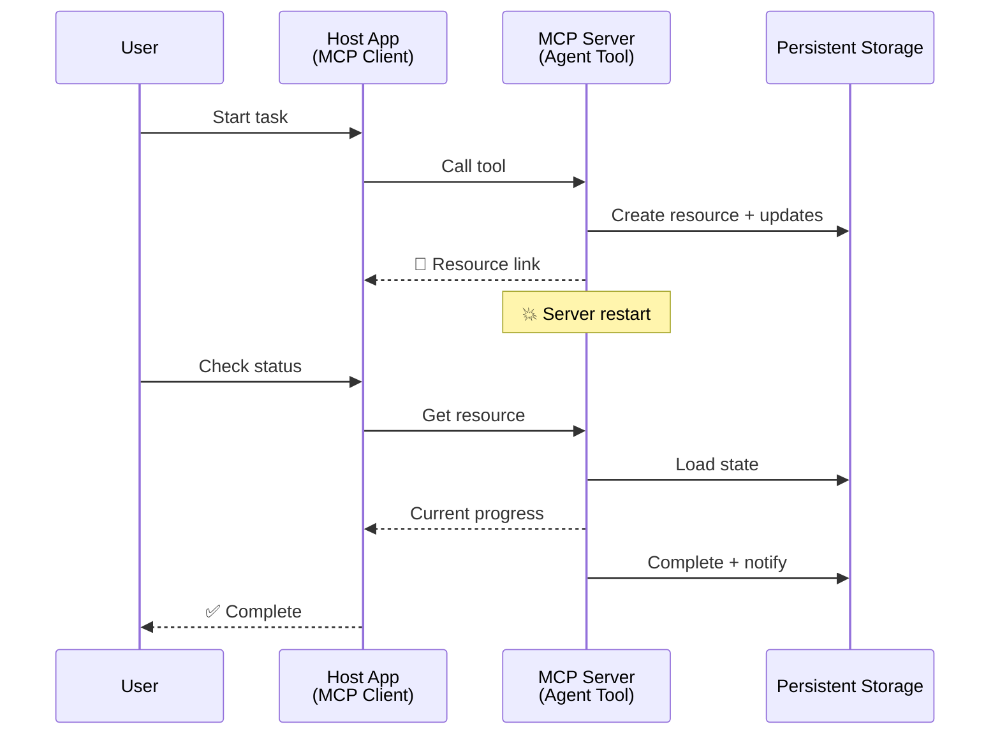
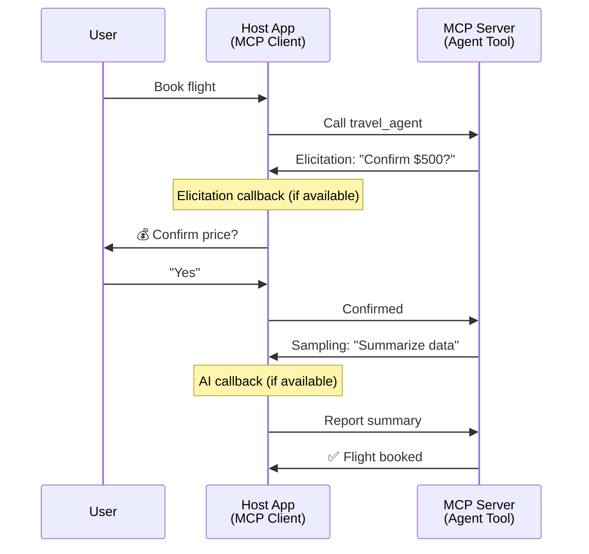
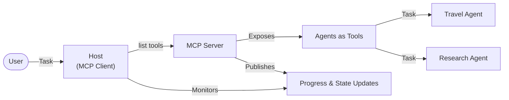

<!--
CO_OP_TRANSLATOR_METADATA:
{
  "original_hash": "5cc6836626047aa055e8960c8484a7d0",
  "translation_date": "2025-07-24T09:28:13+00:00",
  "source_file": "11-mcp/code_samples/mcp-agents/README.md",
  "language_code": "ur"
}
-->
# MCP کے ساتھ ایجنٹ سے ایجنٹ مواصلاتی نظام بنانا

> خلاصہ - کیا آپ MCP پر ایجنٹ2ایجنٹ مواصلات بنا سکتے ہیں؟ جی ہاں!

MCP نے اپنے ابتدائی مقصد "LLMs کو سیاق و سباق فراہم کرنے" سے کہیں زیادہ ترقی کی ہے۔ حالیہ اضافوں جیسے [resumable streams](https://modelcontextprotocol.io/docs/concepts/transports#resumability-and-redelivery)، [elicitation](https://modelcontextprotocol.io/specification/2025-06-18/client/elicitation)، [sampling](https://modelcontextprotocol.io/specification/2025-06-18/client/sampling)، اور اطلاعات ([progress](https://modelcontextprotocol.io/specification/2025-06-18/basic/utilities/progress) اور [resources](https://modelcontextprotocol.io/specification/2025-06-18/schema#resourceupdatednotification)) کے ساتھ، MCP اب پیچیدہ ایجنٹ سے ایجنٹ مواصلاتی نظام بنانے کے لیے ایک مضبوط بنیاد فراہم کرتا ہے۔

## ایجنٹ/ٹول کی غلط فہمی

جیسے جیسے زیادہ ڈویلپرز ایجنٹک رویوں والے ٹولز (طویل مدت تک چلتے ہیں، وسطی عمل کے دوران اضافی ان پٹ کی ضرورت ہو سکتی ہے، وغیرہ) کو دریافت کرتے ہیں، ایک عام غلط فہمی یہ ہے کہ MCP غیر موزوں ہے، خاص طور پر کیونکہ اس کے ٹولز کے ابتدائی نمونے سادہ درخواست-جواب کے نمونوں پر مرکوز تھے۔

یہ تصور پرانا ہو چکا ہے۔ MCP کی وضاحت حالیہ مہینوں میں نمایاں طور پر بہتر ہوئی ہے، جس میں طویل مدت تک ایجنٹک رویے کے لیے خلا کو بند کرنے کی صلاحیتیں شامل ہیں:

- **Streaming & Partial Results**: عمل کے دوران حقیقی وقت میں پیش رفت کی اپ ڈیٹس
- **Resumability**: کلائنٹس دوبارہ جڑ سکتے ہیں اور منقطع ہونے کے بعد جاری رکھ سکتے ہیں
- **Durability**: نتائج سرور ری اسٹارٹس کے بعد بھی برقرار رہتے ہیں (مثلاً، resource links کے ذریعے)
- **Multi-turn**: وسطی عمل کے دوران انٹرایکٹو ان پٹ elicitation اور sampling کے ذریعے

یہ خصوصیات پیچیدہ ایجنٹک اور ملٹی ایجنٹ ایپلیکیشنز کو فعال کرنے کے لیے ترتیب دی جا سکتی ہیں، جو سب MCP پروٹوکول پر تعینات ہیں۔

حوالے کے لیے، ہم ایک ایجنٹ کو "ٹول" کے طور پر حوالہ دیں گے جو MCP سرور پر دستیاب ہے۔ اس کا مطلب ہے کہ ایک میزبان ایپلیکیشن موجود ہے جو MCP کلائنٹ کو نافذ کرتی ہے، MCP سرور کے ساتھ سیشن قائم کرتی ہے، اور ایجنٹ کو کال کر سکتی ہے۔

## MCP ٹول کو "ایجنٹک" کیا بناتا ہے؟

عمل درآمد میں جانے سے پہلے، آئیے یہ قائم کریں کہ طویل مدت تک چلنے والے ایجنٹس کی حمایت کے لیے کون سی بنیادی ڈھانچے کی صلاحیتیں ضروری ہیں۔

> ہم ایک ایجنٹ کو ایک ایسی ہستی کے طور پر بیان کریں گے جو طویل مدت تک خود مختاری سے کام کر سکتی ہے، پیچیدہ کاموں کو سنبھالنے کی صلاحیت رکھتی ہے جنہیں حقیقی وقت کی رائے کی بنیاد پر متعدد تعاملات یا ایڈجسٹمنٹ کی ضرورت ہو سکتی ہے۔

### 1. Streaming & Partial Results

روایتی درخواست-جواب کے نمونے طویل مدت تک چلنے والے کاموں کے لیے کام نہیں کرتے۔ ایجنٹس کو فراہم کرنے کی ضرورت ہے:

- حقیقی وقت میں پیش رفت کی اپ ڈیٹس
- عبوری نتائج

**MCP سپورٹ**: Resource update notifications جزوی نتائج کو اسٹریم کرنے کے قابل بناتے ہیں، حالانکہ یہ JSON-RPC کے 1:1 درخواست/جواب ماڈل کے ساتھ تنازعات سے بچنے کے لیے محتاط ڈیزائن کی ضرورت ہوتی ہے۔

| خصوصیت                    | استعمال کا کیس                                                                                                                                                                       | MCP سپورٹ                                                                                |
| -------------------------- | ------------------------------------------------------------------------------------------------------------------------------------------------------------------------------ | ------------------------------------------------------------------------------------------ |
| حقیقی وقت میں پیش رفت کی اپ ڈیٹس | صارف کوڈ بیس مائیگریشن ٹاسک کی درخواست کرتا ہے۔ ایجنٹ پیش رفت کو اسٹریم کرتا ہے: "10% - dependencies کا تجزیہ کر رہا ہے... 25% - TypeScript فائلز کو تبدیل کر رہا ہے... 50% - imports کو اپ ڈیٹ کر رہا ہے..."          | ✅ Progress notifications                                                                  |
| جزوی نتائج            | "کتاب تیار کریں" ٹاسک جزوی نتائج کو اسٹریم کرتا ہے، مثلاً، 1) کہانی کا خاکہ، 2) ابواب کی فہرست، 3) ہر باب مکمل ہونے کے ساتھ۔ میزبان کسی بھی مرحلے پر معائنہ، منسوخ، یا redirect کر سکتا ہے۔ | ✅ Notifications کو "extended" کیا جا سکتا ہے جزوی نتائج شامل کرنے کے لیے، PR 383, 776 کی تجاویز دیکھیں |

<div align="center" style="font-style: italic; font-size: 0.95em; margin-bottom: 0.5em;">
<strong>شکل 1:</strong> یہ ڈایاگرام دکھاتا ہے کہ MCP ایجنٹ طویل مدت تک چلنے والے کام کے دوران میزبان ایپلیکیشن کو حقیقی وقت میں پیش رفت کی اپ ڈیٹس اور جزوی نتائج کیسے اسٹریم کرتا ہے، صارف کو عمل کی نگرانی کرنے کے قابل بناتا ہے۔
</div>



### 2. Resumability

ایجنٹس کو نیٹ ورک کی رکاوٹوں کو خوش اسلوبی سے سنبھالنا چاہیے:

- منقطع ہونے کے بعد دوبارہ جڑیں
- جہاں سے چھوڑا تھا وہاں سے جاری رکھیں (پیغام دوبارہ بھیجنا)

**MCP سپورٹ**: MCP StreamableHTTP transport آج سیشن resumption اور message redelivery کو session IDs اور last event IDs کے ساتھ سپورٹ کرتا ہے۔ یہاں اہم بات یہ ہے کہ سرور کو ایک EventStore نافذ کرنا چاہیے جو کلائنٹ کے دوبارہ جڑنے پر ایونٹ ری پلے کو فعال کرتا ہے۔  
نوٹ کریں کہ ایک کمیونٹی تجویز (PR #975) موجود ہے جو transport-agnostic resumable streams کو دریافت کرتی ہے۔

| خصوصیت      | استعمال کا کیس                                                                                                                                                   | MCP سپورٹ                                                                |
| ------------ | ---------------------------------------------------------------------------------------------------------------------------------------------------------- | -------------------------------------------------------------------------- |
| Resumability | کلائنٹ طویل مدت تک چلنے والے کام کے دوران منقطع ہو جاتا ہے۔ دوبارہ جڑنے پر، سیشن دوبارہ شروع ہوتا ہے، چھوٹے ہوئے ایونٹس کو دوبارہ چلایا جاتا ہے، اور بغیر کسی رکاوٹ کے وہیں سے جاری رہتا ہے جہاں سے چھوڑا تھا۔ | ✅ StreamableHTTP transport session IDs، ایونٹ ری پلے، اور EventStore کے ساتھ |

<div align="center" style="font-style: italic; font-size: 0.95em; margin-bottom: 0.5em;">
<strong>شکل 2:</strong> یہ ڈایاگرام دکھاتا ہے کہ MCP کا StreamableHTTP transport اور ایونٹ اسٹور کیسے بغیر کسی رکاوٹ کے سیشن resumption کو فعال کرتا ہے: اگر کلائنٹ منقطع ہو جائے، تو وہ دوبارہ جڑ سکتا ہے اور چھوٹے ہوئے ایونٹس کو دوبارہ چلا سکتا ہے، کام کو بغیر کسی پیش رفت کے نقصان کے جاری رکھ سکتا ہے۔
</div>



### 3. Durability

طویل مدت تک چلنے والے ایجنٹس کو مستقل حالت کی ضرورت ہوتی ہے:

- نتائج سرور ری اسٹارٹس کے بعد بھی برقرار رہتے ہیں
- اسٹیٹس کو آؤٹ آف بینڈ حاصل کیا جا سکتا ہے
- سیشنز کے درمیان پیش رفت کی ٹریکنگ

**MCP سپورٹ**: MCP اب ٹول کالز کے لیے Resource link return type کو سپورٹ کرتا ہے۔ آج، ایک ممکنہ نمونہ یہ ہے کہ ایک ٹول کو ڈیزائن کیا جائے جو ایک resource بناتا ہے اور فوری طور پر ایک resource link واپس کرتا ہے۔ ٹول پس منظر میں کام کو جاری رکھ سکتا ہے اور resource کو اپ ڈیٹ کر سکتا ہے۔ اس کے بدلے میں، کلائنٹ اس resource کی حالت کو پول کرنے کا انتخاب کر سکتا ہے تاکہ جزوی یا مکمل نتائج حاصل کیے جا سکیں (اس بنیاد پر کہ سرور کون سی resource اپ ڈیٹس فراہم کرتا ہے) یا resource کے لیے اپ ڈیٹ notifications کو سبسکرائب کر سکتا ہے۔

یہاں ایک حد یہ ہے کہ resources کو پول کرنا یا اپ ڈیٹس کے لیے سبسکرائب کرنا وسائل کو استعمال کر سکتا ہے، جس کے پیمانے پر اثرات ہو سکتے ہیں۔ ایک کھلی کمیونٹی تجویز (بشمول #992) موجود ہے جو webhooks یا triggers کو شامل کرنے کے امکان کو دریافت کرتی ہے جنہیں سرور کلائنٹ/میزبان ایپلیکیشن کو اپ ڈیٹس کی اطلاع دینے کے لیے کال کر سکتا ہے۔

| خصوصیت    | استعمال کا کیس                                                                                                                                        | MCP سپورٹ                                                        |
| ---------- | ----------------------------------------------------------------------------------------------------------------------------------------------- | ------------------------------------------------------------------ |
| Durability | سرور ڈیٹا مائیگریشن ٹاسک کے دوران کریش ہو جاتا ہے۔ نتائج اور پیش رفت ری اسٹارٹ کے بعد بھی برقرار رہتے ہیں، کلائنٹ اسٹیٹس چیک کر سکتا ہے اور مستقل resource سے جاری رکھ سکتا ہے۔ | ✅ Resource links مستقل اسٹوریج اور اسٹیٹس notifications کے ساتھ |

آج، ایک عام نمونہ یہ ہے کہ ایک ٹول کو ڈیزائن کیا جائے جو ایک resource بناتا ہے اور فوری طور پر ایک resource link واپس کرتا ہے۔ ٹول پس منظر میں کام کو جاری رکھ سکتا ہے، resource notifications جاری کر سکتا ہے جو پیش رفت کی اپ ڈیٹس کے طور پر کام کرتے ہیں یا جزوی نتائج شامل کرتے ہیں، اور ضرورت کے مطابق resource کے مواد کو اپ ڈیٹ کر سکتا ہے۔

<div align="center" style="font-style: italic; font-size: 0.95em; margin-bottom: 0.5em;">
<strong>شکل 3:</strong> یہ ڈایاگرام دکھاتا ہے کہ MCP ایجنٹس مستقل resources اور اسٹیٹس notifications کا استعمال کیسے کرتے ہیں تاکہ طویل مدت تک چلنے والے کام سرور ری اسٹارٹس کے بعد بھی برقرار رہیں، کلائنٹس کو پیش رفت چیک کرنے اور ناکامیوں کے بعد بھی نتائج حاصل کرنے کی اجازت دیتے ہیں۔
</div>



### 4. Multi-Turn Interactions

ایجنٹس کو اکثر وسطی عمل کے دوران اضافی ان پٹ کی ضرورت ہوتی ہے:

- انسانی وضاحت یا منظوری
- پیچیدہ فیصلوں کے لیے AI کی مدد
- متحرک پیرامیٹر ایڈجسٹمنٹ

**MCP سپورٹ**: مکمل طور پر sampling (AI ان پٹ کے لیے) اور elicitation (انسانی ان پٹ کے لیے) کے ذریعے سپورٹ کیا گیا۔

| خصوصیت                 | استعمال کا کیس                                                                                                                                     | MCP سپورٹ                                           |
| ----------------------- | -------------------------------------------------------------------------------------------------------------------------------------------- | ----------------------------------------------------- |
| Multi-Turn Interactions | ٹریول بکنگ ایجنٹ صارف سے قیمت کی تصدیق کی درخواست کرتا ہے، پھر AI سے ٹریول ڈیٹا کا خلاصہ کرنے کی درخواست کرتا ہے، اس سے پہلے کہ بکنگ کا لین دین مکمل کرے۔ | ✅ انسانی ان پٹ کے لیے elicitation، AI ان پٹ کے لیے sampling |

<div align="center" style="font-style: italic; font-size: 0.95em; margin-bottom: 0.5em;">
<strong>شکل 4:</strong> یہ ڈایاگرام دکھاتا ہے کہ MCP ایجنٹس وسطی عمل کے دوران انسانی ان پٹ کو انٹرایکٹو طور پر کیسے حاصل کر سکتے ہیں یا پیچیدہ، ملٹی ٹرن ورک فلو جیسے تصدیقات اور متحرک فیصلہ سازی کی حمایت کے لیے AI کی مدد کی درخواست کر سکتے ہیں۔
</div>



## MCP پر طویل مدت تک چلنے والے ایجنٹس کو نافذ کرنا - کوڈ کا جائزہ

اس مضمون کے حصے کے طور پر، ہم ایک [code repository](https://github.com/victordibia/ai-tutorials/tree/main/MCP%20Agents) فراہم کرتے ہیں جو MCP Python SDK کے ساتھ StreamableHTTP transport کا استعمال کرتے ہوئے طویل مدت تک چلنے والے ایجنٹس کے مکمل نفاذ پر مشتمل ہے، جو سیشن resumption اور message redelivery کو فعال کرتا ہے۔ نفاذ یہ ظاہر کرتا ہے کہ MCP کی صلاحیتوں کو ایجنٹ جیسے پیچیدہ رویے کو فعال کرنے کے لیے کیسے ترتیب دیا جا سکتا ہے۔

خاص طور پر، ہم ایک سرور کو دو بنیادی ایجنٹ ٹولز کے ساتھ نافذ کرتے ہیں:

- **Travel Agent** - قیمت کی تصدیق کے ذریعے ٹریول بکنگ سروس کی نقل کرتا ہے
- **Research Agent** - AI کی مدد سے خلاصوں کے ذریعے تحقیقی کام انجام دیتا ہے

دونوں ایجنٹس حقیقی وقت میں پیش رفت کی اپ ڈیٹس، انٹرایکٹو تصدیقات، اور مکمل سیشن resumption کی صلاحیتوں کا مظاہرہ کرتے ہیں۔

### کلیدی نفاذ کے تصورات

مندرجہ ذیل حصے ہر صلاحیت کے لیے سرور سائیڈ ایجنٹ نفاذ اور کلائنٹ سائیڈ میزبان ہینڈلنگ دکھاتے ہیں:

#### Streaming & Progress Updates - حقیقی وقت میں کام کی حیثیت

Streaming ایجنٹس کو طویل مدت تک چلنے والے کاموں کے دوران حقیقی وقت میں پیش رفت کی اپ ڈیٹس فراہم کرنے کے قابل بناتا ہے، صارفین کو کام کی حیثیت اور عبوری نتائج سے آگاہ رکھتا ہے۔

**سرور نفاذ (ایجنٹ پیش رفت notifications بھیجتا ہے):**

```python
# From server/server.py - Travel agent sending progress updates
for i, step in enumerate(steps):
    await ctx.session.send_progress_notification(
        progress_token=ctx.request_id,
        progress=i * 25,
        total=100,
        message=step,
        related_request_id=str(ctx.request_id)
    )
    await anyio.sleep(2)  # Simulate work

# Alternative: Log messages for detailed step-by-step updates
await ctx.session.send_log_message(
    level="info",
    data=f"Processing step {current_step}/{steps} ({progress_percent}%)",
    logger="long_running_agent",
    related_request_id=ctx.request_id,
)
```

**کلائنٹ نفاذ (میزبان پیش رفت کی اپ ڈیٹس وصول کرتا ہے):**

```python
# From client/client.py - Client handling real-time notifications
async def message_handler(message) -> None:
    if isinstance(message, types.ServerNotification):
        if isinstance(message.root, types.LoggingMessageNotification):
            console.print(f"📡 [dim]{message.root.params.data}[/dim]")
        elif isinstance(message.root, types.ProgressNotification):
            progress = message.root.params
            console.print(f"🔄 [yellow]{progress.message} ({progress.progress}/{progress.total})[/yellow]")

# Register message handler when creating session
async with ClientSession(
    read_stream, write_stream,
    message_handler=message_handler
) as session:
```

#### Elicitation - صارف انپٹ کی درخواست کرنا

Elicitation ایجنٹس کو وسطی عمل کے دوران صارف انپٹ کی درخواست کرنے کے قابل بناتا ہے۔ یہ طویل مدت تک چلنے والے کاموں کے دوران تصدیقات، وضاحتوں، یا منظوریوں کے لیے ضروری ہے۔

**سرور نفاذ (ایجنٹ تصدیق کی درخواست کرتا ہے):**

```python
# From server/server.py - Travel agent requesting price confirmation
elicit_result = await ctx.session.elicit(
    message=f"Please confirm the estimated price of $1200 for your trip to {destination}",
    requestedSchema=PriceConfirmationSchema.model_json_schema(),
    related_request_id=ctx.request_id,
)

if elicit_result and elicit_result.action == "accept":
    # Continue with booking
    logger.info(f"User confirmed price: {elicit_result.content}")
elif elicit_result and elicit_result.action == "decline":
    # Cancel the booking
    booking_cancelled = True
```

**کلائنٹ نفاذ (میزبان elicitation callback فراہم کرتا ہے):**

```python
# From client/client.py - Client handling elicitation requests
async def elicitation_callback(context, params):
    console.print(f"💬 Server is asking for confirmation:")
    console.print(f"   {params.message}")

    response = console.input("Do you accept? (y/n): ").strip().lower()

    if response in ['y', 'yes']:
        return types.ElicitResult(
            action="accept",
            content={"confirm": True, "notes": "Confirmed by user"}
        )
    else:
        return types.ElicitResult(
            action="decline",
            content={"confirm": False, "notes": "Declined by user"}
        )

# Register the callback when creating the session
async with ClientSession(
    read_stream, write_stream,
    elicitation_callback=elicitation_callback
) as session:
```

#### Sampling - AI کی مدد کی درخواست کرنا

Sampling ایجنٹس کو عمل کے دوران پیچیدہ فیصلوں یا مواد کی تخلیق کے لیے LLM کی مدد کی درخواست کرنے کے قابل بناتا ہے۔ یہ ہائبرڈ انسانی-AI ورک فلو کو فعال کرتا ہے۔

**سرور نفاذ (ایجنٹ AI کی مدد کی درخواست کرتا ہے):**

```python
# From server/server.py - Research agent requesting AI summary
sampling_result = await ctx.session.create_message(
    messages=[
        SamplingMessage(
            role="user",
            content=TextContent(type="text", text=f"Please summarize the key findings for research on: {topic}")
        )
    ],
    max_tokens=100,
    related_request_id=ctx.request_id,
)

if sampling_result and sampling_result.content:
    if sampling_result.content.type == "text":
        sampling_summary = sampling_result.content.text
        logger.info(f"Received sampling summary: {sampling_summary}")
```

**کلائنٹ نفاذ (میزبان sampling callback فراہم کرتا ہے):**

```python
# From client/client.py - Client handling sampling requests
async def sampling_callback(context, params):
    message_text = params.messages[0].content.text if params.messages else 'No message'
    console.print(f"🧠 Server requested sampling: {message_text}")

    # In a real application, this could call an LLM API
    # For demo purposes, we provide a mock response
    mock_response = "Based on current research, MCP has evolved significantly..."

    return types.CreateMessageResult(
        role="assistant",
        content=types.TextContent(type="text", text=mock_response),
        model="interactive-client",
        stopReason="endTurn"
    )

# Register the callback when creating the session
async with ClientSession(
    read_stream, write_stream,
    sampling_callback=sampling_callback,
    elicitation_callback=elicitation_callback
) as session:
```

#### Resumability - منقطع ہونے کے بعد سیشن کی تسلسل

Resumability اس بات کو یقینی بناتا ہے کہ طویل مدت تک چلنے والے ایجنٹ کے کام کلائنٹ کے منقطع ہونے کے بعد بھی برقرار رہیں اور دوبارہ جڑنے پر بغیر کسی رکاوٹ کے جاری رہیں۔ یہ ایونٹ اسٹورز اور resumption tokens کے ذریعے نافذ کیا جاتا ہے۔

**ایونٹ اسٹور نفاذ (سرور سیشن اسٹیٹ رکھتا ہے):**

```python
# From server/event_store.py - Simple in-memory event store
class SimpleEventStore(EventStore):
    def __init__(self):
        self._events: list[tuple[StreamId, EventId, JSONRPCMessage]] = []
        self._event_id_counter = 0

    async def store_event(self, stream_id: StreamId, message: JSONRPCMessage) -> EventId:
        """Store an event and return its ID."""
        self._event_id_counter += 1
        event_id = str(self._event_id_counter)
        self._events.append((stream_id, event_id, message))
        return event_id

    async def replay_events_after(self, last_event_id: EventId, send_callback: EventCallback) -> StreamId | None:
        """Replay events after the specified ID for resumption."""
        # Find events after the last known event and replay them
        for _, event_id, message in self._events[start_index:]:
            await send_callback(EventMessage(message, event_id))

# From server/server.py - Passing event store to session manager
def create_server_app(event_store: Optional[EventStore] = None) -> Starlette:
    server = ResumableServer()

    # Create session manager with event store for resumption
    session_manager = StreamableHTTPSessionManager(
        app=server,
        event_store=event_store,  # Event store enables session resumption
        json_response=False,
        security_settings=security_settings,
    )

    return Starlette(routes=[Mount("/mcp", app=session_manager.handle_request)])

# Usage: Initialize with event store
event_store = SimpleEventStore()
app = create_server_app(event_store)
```

**کلائنٹ میٹا ڈیٹا کے ساتھ resumption token (کلائنٹ محفوظ شدہ اسٹیٹ کا استعمال کرتے ہوئے دوبارہ جڑتا ہے):**

```python
# From client/client.py - Client resumption with metadata
if existing_tokens and existing_tokens.get("resumption_token"):
    # Use existing resumption token to continue where we left off
    metadata = ClientMessageMetadata(
        resumption_token=existing_tokens["resumption_token"],
    )
else:
    # Create callback to save resumption token when received
    def enhanced_callback(token: str):
        protocol_version = getattr(session, 'protocol_version', None)
        token_manager.save_tokens(session_id, token, protocol_version, command, args)

    metadata = ClientMessageMetadata(
        on_resumption_token_update=enhanced_callback,
    )

# Send request with resumption metadata
result = await session.send_request(
    types.ClientRequest(
        types.CallToolRequest(
            method="tools/call",
            params=types.CallToolRequestParams(name=command, arguments=args)
        )
    ),
    types.CallToolResult,
    metadata=metadata,
)
```

میزبان ایپلیکیشن مقامی طور پر session IDs اور resumption tokens کو برقرار رکھتی ہے، جو اسے موجودہ سیشنز سے دوبارہ جڑنے کے قابل بناتا ہے بغیر کسی پیش رفت یا اسٹیٹ کے نقصان کے۔

### کوڈ کی تنظیم

<div align="center" style="font-style: italic; font-size: 0.95em; margin-bottom: 0.5em;">
<strong>شکل 5:</strong> MCP پر مبنی ایجنٹ سسٹم کی آرکیٹیکچر
</div>



**کلیدی فائلز:**

- **`server/server.py`** - Resumable MCP سرور ٹریول اور ریسرچ ایجنٹس کے ساتھ جو elicitation، sampling، اور progress updates کا مظاہرہ کرتے ہیں
- **`client/client.py`** - انٹرایکٹو میزبان ایپلیکیشن resumption سپورٹ، callback handlers، اور token management کے ساتھ
- **`server/event_store.py`** - ایونٹ اسٹور نفاذ جو سیشن resumption اور message redelivery کو فعال کرتا ہے

## MCP پر ملٹی ایجنٹ مواصلات تک توسیع

اوپر دیا گیا نفاذ میزبان ایپلیکیشن کی ذہانت اور دائرہ کار کو بڑھا کر ملٹی ایجنٹ سسٹمز تک توسیع کیا جا سکتا ہے:

- **ذہین کام کی تقسیم**: میزبان پیچیدہ صارف درخواستوں کا تجزیہ کرتا ہے اور انہیں مختلف ماہر ایجنٹس کے لیے ذیلی کاموں میں تقسیم کرتا ہے
- **ملٹی سرور کوآرڈینیشن**: میزبان متعدد MCP سرورز کے ساتھ کنکشن برقرار رکھتا ہے، ہر ایک مختلف ایجنٹ کی صلاحیتوں کو ظاہر کرتا ہے
- **کام کی اسٹیٹ مینجمنٹ**: میزبان متعدد بیک وقت ایجنٹ کاموں کے درمیان پیش رفت کو ٹریک کرتا ہے، انحصار اور ترتیب کو سنبھالتا ہے
- **لچک اور دوبارہ کوششیں**: میزبان ناکامیوں کو سنبھالتا ہے، دوبارہ کوشش کرنے کی منطق کو نافذ کرتا ہے، اور جب ایجنٹس دستیاب نہیں ہوتے تو کاموں کو دوبارہ روٹ کرتا ہے
- **نتائج کی ترکیب**: میزبان متعدد ایجنٹس کے آؤٹ پٹس کو مربوط حتمی نتائج میں یکجا کرتا ہے

میزبان ایک سادہ کلائنٹ سے ایک ذہین آرکیسٹریٹر میں تبدیل ہوتا ہے، تقسیم شدہ ایجنٹ کی صلاحیتوں کو مربوط کرتے ہوئے، جبکہ وہی MCP پروٹوکول بنیاد برقرار رکھتا ہے۔

## نتیجہ

MCP کی بہتر صلاحیتیں - resource notifications، elicitation/sampling، resumable streams، اور persistent resources - پیچیدہ ایجنٹ سے ایجنٹ تعاملات کو فعال کرتی ہیں، جبکہ پروٹوکول کی سادگی کو برقرار رکھتی ہیں۔

## شروع کریں

اپنا ایجنٹ2ایجنٹ سسٹم بنانے کے لیے تیار ہیں؟ ان مراحل پر عمل کریں:

### 1. ڈیمو چلائیں

```bash
# Start the server with event store for resumption
python -m server.server --port 8006

# In another terminal, run the interactive client
python -m client.client --url http://127.0.0.1:8006/mcp
```

**انٹرایکٹو موڈ میں دستیاب کمانڈز:**

- `travel_agent` - قیمت کی تصدیق کے ذریعے ٹریول بکنگ
-

**ڈسکلیمر**:  
یہ دستاویز AI ترجمہ سروس [Co-op Translator](https://github.com/Azure/co-op-translator) کا استعمال کرتے ہوئے ترجمہ کی گئی ہے۔ ہم درستگی کے لیے کوشش کرتے ہیں، لیکن براہ کرم آگاہ رہیں کہ خودکار ترجمے میں غلطیاں یا عدم درستگی ہو سکتی ہیں۔ اصل دستاویز، جو اس کی مقامی زبان میں ہے، کو مستند ذریعہ سمجھا جانا چاہیے۔ اہم معلومات کے لیے، پیشہ ور انسانی ترجمہ کی سفارش کی جاتی ہے۔ اس ترجمے کے استعمال سے پیدا ہونے والی کسی بھی غلط فہمی یا غلط تشریح کے لیے ہم ذمہ دار نہیں ہیں۔