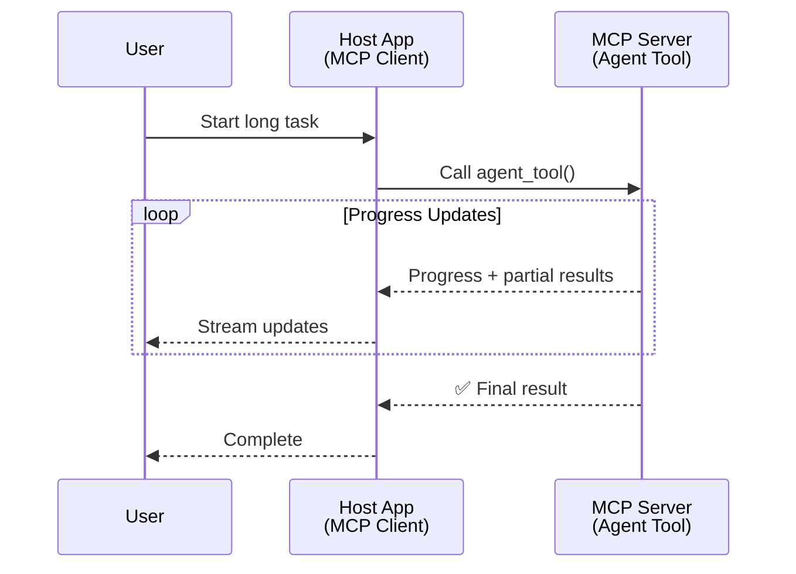
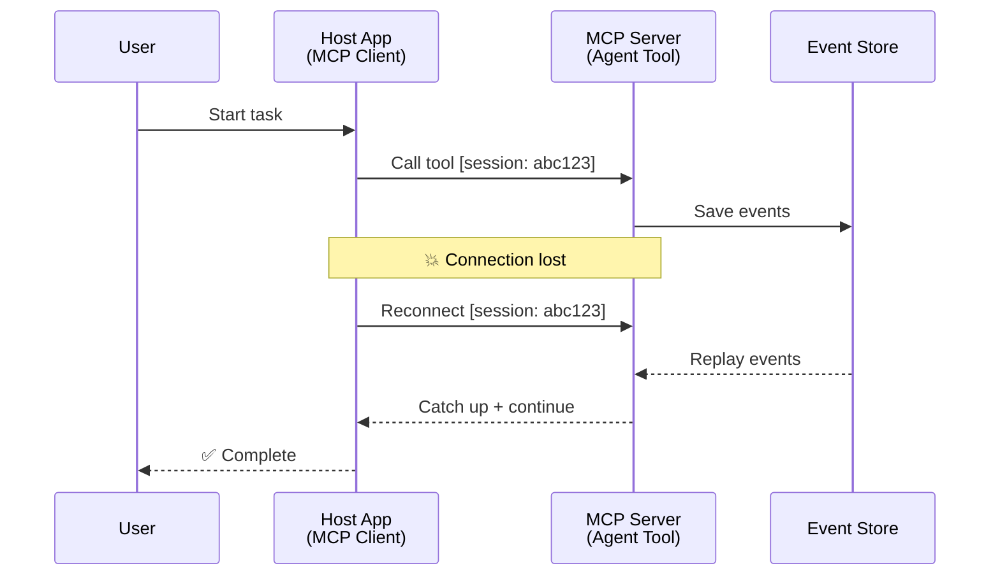
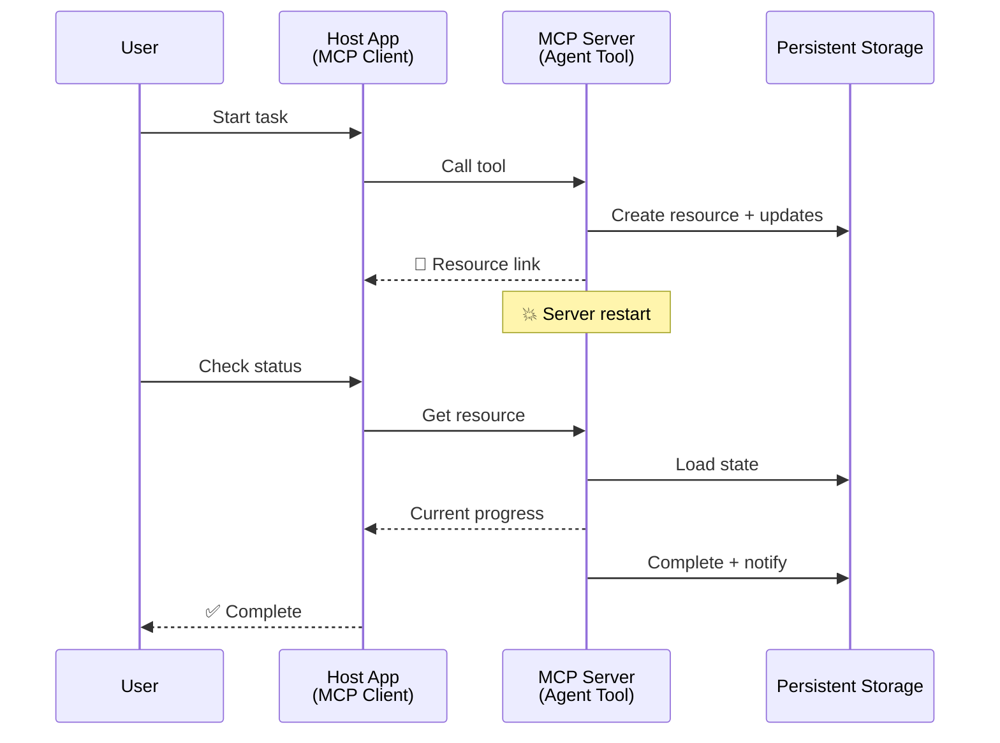
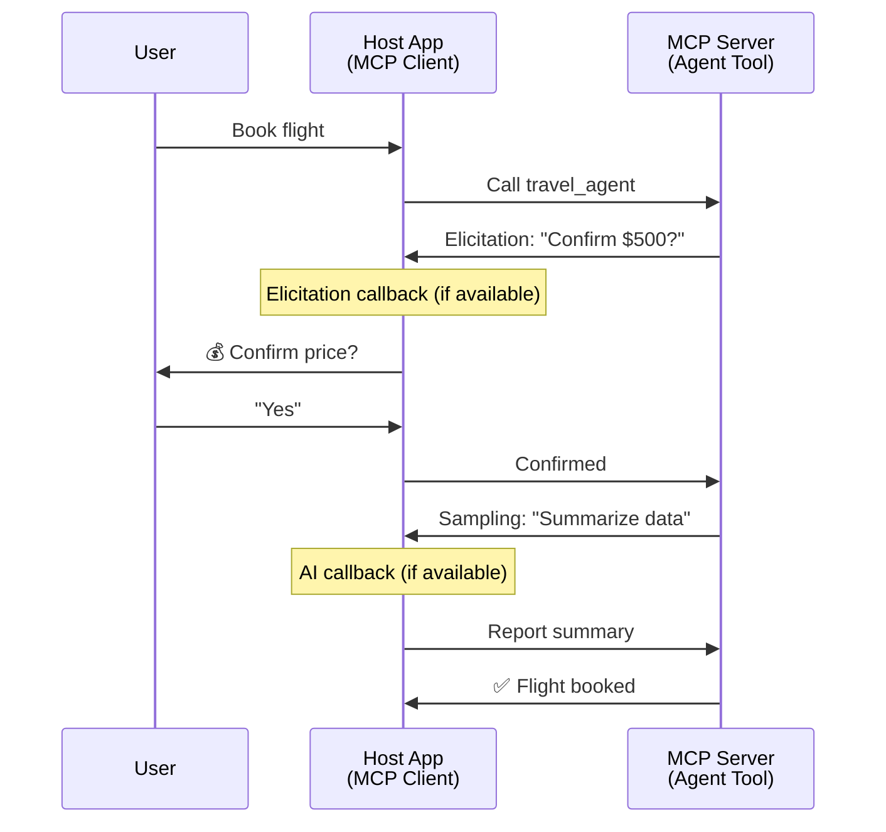
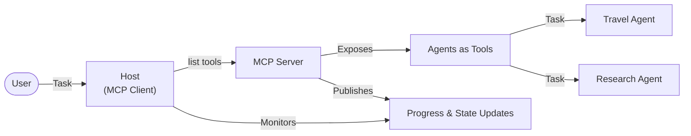

<!--
CO_OP_TRANSLATOR_METADATA:
{
  "original_hash": "5cc6836626047aa055e8960c8484a7d0",
  "translation_date": "2025-07-24T07:55:25+00:00",
  "source_file": "11-mcp/code_samples/mcp-agents/README.md",
  "language_code": "ur"
}
-->
# MCP کے ساتھ ایجنٹ سے ایجنٹ مواصلاتی نظام بنانا

> خلاصہ - کیا آپ MCP پر ایجنٹ2ایجنٹ مواصلات بنا سکتے ہیں؟ جی ہاں!

MCP نے اپنے ابتدائی مقصد "LLMs کو سیاق و سباق فراہم کرنا" سے کہیں آگے ترقی کی ہے۔ حالیہ اضافوں جیسے [resumable streams](https://modelcontextprotocol.io/docs/concepts/transports#resumability-and-redelivery)، [elicitation](https://modelcontextprotocol.io/specification/2025-06-18/client/elicitation)، [sampling](https://modelcontextprotocol.io/specification/2025-06-18/client/sampling)، اور اطلاعات ([progress](https://modelcontextprotocol.io/specification/2025-06-18/basic/utilities/progress) اور [resources](https://modelcontextprotocol.io/specification/2025-06-18/schema#resourceupdatednotification)) کے ساتھ، MCP اب پیچیدہ ایجنٹ سے ایجنٹ مواصلاتی نظام بنانے کے لیے ایک مضبوط بنیاد فراہم کرتا ہے۔

## ایجنٹ/ٹول کی غلط فہمی

جیسے جیسے زیادہ ڈویلپرز ایجنٹک رویوں والے ٹولز (طویل مدت تک چلتے ہیں، وسطی عمل کے دوران اضافی ان پٹ کی ضرورت ہو سکتی ہے، وغیرہ) کو دریافت کرتے ہیں، ایک عام غلط فہمی یہ ہے کہ MCP غیر موزوں ہے، بنیادی طور پر اس لیے کہ اس کے ٹولز کے ابتدائی نمونے سادہ درخواست-جواب کے نمونوں پر مرکوز تھے۔

یہ تصور پرانا ہو چکا ہے۔ MCP کی وضاحت کو حالیہ مہینوں میں نمایاں طور پر بہتر کیا گیا ہے، جس میں طویل مدت تک چلنے والے ایجنٹک رویے کے لیے خلا کو بند کرنے کی صلاحیتیں شامل ہیں:

- **Streaming & Partial Results**: عمل کے دوران حقیقی وقت میں پیش رفت کی اپ ڈیٹس
- **Resumability**: کلائنٹس منقطع ہونے کے بعد دوبارہ جڑ سکتے ہیں اور جاری رکھ سکتے ہیں
- **Durability**: نتائج سرور ری اسٹارٹ کے بعد بھی برقرار رہتے ہیں (مثلاً، وسائل کے لنکس کے ذریعے)
- **Multi-turn**: وسطی عمل کے دوران انٹرایکٹو ان پٹ، elicitation اور sampling کے ذریعے

یہ خصوصیات پیچیدہ ایجنٹک اور ملٹی ایجنٹ ایپلیکیشنز کو فعال کرنے کے لیے ترتیب دی جا سکتی ہیں، جو سب MCP پروٹوکول پر تعینات ہیں۔

حوالے کے لیے، ہم ایک ایجنٹ کو "ٹول" کے طور پر حوالہ دیں گے جو MCP سرور پر دستیاب ہے۔ اس کا مطلب ہے کہ ایک میزبان ایپلیکیشن موجود ہے جو MCP کلائنٹ کو نافذ کرتی ہے، MCP سرور کے ساتھ سیشن قائم کرتی ہے، اور ایجنٹ کو کال کر سکتی ہے۔

## کیا چیز MCP ٹول کو "ایجنٹک" بناتی ہے؟

عمل درآمد میں جانے سے پہلے، آئیے یہ قائم کریں کہ طویل مدت تک چلنے والے ایجنٹس کی حمایت کے لیے کون سی بنیادی ڈھانچے کی صلاحیتیں ضروری ہیں۔

> ہم ایک ایجنٹ کو ایک ایسی ہستی کے طور پر بیان کریں گے جو طویل مدت تک خود مختاری سے کام کر سکتی ہے، پیچیدہ کاموں کو سنبھالنے کی صلاحیت رکھتی ہے جنہیں حقیقی وقت کی رائے کی بنیاد پر متعدد تعاملات یا ایڈجسٹمنٹ کی ضرورت ہو سکتی ہے۔

### 1. Streaming & Partial Results

روایتی درخواست-جواب کے نمونے طویل مدت تک چلنے والے کاموں کے لیے کام نہیں کرتے۔ ایجنٹس کو فراہم کرنے کی ضرورت ہے:

- حقیقی وقت میں پیش رفت کی اپ ڈیٹس
- عبوری نتائج

**MCP سپورٹ**: وسائل کی اپ ڈیٹ کی اطلاعات جزوی نتائج کو اسٹریم کرنے کے قابل بناتی ہیں، حالانکہ یہ JSON-RPC کے 1:1 درخواست/جواب ماڈل کے ساتھ تنازعات سے بچنے کے لیے محتاط ڈیزائن کی ضرورت ہوتی ہے۔

| خصوصیت                    | استعمال کا کیس                                                                                                                                                                       | MCP سپورٹ                                                                                |
| -------------------------- | ------------------------------------------------------------------------------------------------------------------------------------------------------------------------------ | ------------------------------------------------------------------------------------------ |
| حقیقی وقت کی پیش رفت کی اپ ڈیٹس | صارف کوڈ بیس مائیگریشن کا کام درخواست کرتا ہے۔ ایجنٹ پیش رفت کو اسٹریم کرتا ہے: "10% - ڈیپینڈنسیز کا تجزیہ... 25% - ٹائپ اسکرپٹ فائلز کو تبدیل کرنا... 50% - امپورٹس کو اپ ڈیٹ کرنا..."          | ✅ پیش رفت کی اطلاعات                                                                  |
| جزوی نتائج            | "کتاب تیار کریں" کام جزوی نتائج کو اسٹریم کرتا ہے، مثلاً، 1) کہانی کا خاکہ، 2) ابواب کی فہرست، 3) ہر باب مکمل ہونے پر۔ میزبان کسی بھی مرحلے پر معائنہ، منسوخ، یا دوبارہ ہدایت دے سکتا ہے۔ | ✅ اطلاعات کو "توسیع" دی جا سکتی ہے تاکہ جزوی نتائج شامل ہوں، PR 383، 776 پر تجاویز دیکھیں |

<div align="center" style="font-style: italic; font-size: 0.95em; margin-bottom: 0.5em;">
<strong>شکل 1:</strong> یہ خاکہ دکھاتا ہے کہ MCP ایجنٹ طویل مدت تک چلنے والے کام کے دوران میزبان ایپلیکیشن کو حقیقی وقت میں پیش رفت کی اپ ڈیٹس اور جزوی نتائج کیسے اسٹریم کرتا ہے، صارف کو عمل کی نگرانی کرنے کے قابل بناتا ہے۔
</div>


```mermaid
sequenceDiagram
    participant User
    participant Host as Host App<br/>(MCP Client)
    participant Server as MCP Server<br/>(Agent Tool)

    User->>Host: Start long task
    Host->>Server: Call agent_tool()

    loop Progress Updates
        Server-->>Host: Progress + partial results
        Host-->>User: Stream updates
    end

    Server-->>Host: ✅ Final result
    Host-->>User: Complete
```

### 2. Resumability

ایجنٹس کو نیٹ ورک کی رکاوٹوں کو خوش اسلوبی سے سنبھالنا چاہیے:

- منقطع ہونے کے بعد دوبارہ جڑیں
- جہاں سے چھوڑا تھا وہاں سے جاری رکھیں (پیغام دوبارہ بھیجنا)

**MCP سپورٹ**: MCP StreamableHTTP ٹرانسپورٹ آج سیشن دوبارہ شروع کرنے اور پیغام دوبارہ بھیجنے کی حمایت کرتا ہے، سیشن IDs اور آخری ایونٹ IDs کے ساتھ۔ یہاں اہم بات یہ ہے کہ سرور کو ایک EventStore نافذ کرنا چاہیے جو کلائنٹ کے دوبارہ جڑنے پر ایونٹ ری پلے کو فعال کرتا ہے۔  
نوٹ کریں کہ ایک کمیونٹی تجویز (PR #975) موجود ہے جو ٹرانسپورٹ-اگناسٹک دوبارہ شروع ہونے والے اسٹریمز کو تلاش کرتی ہے۔

| خصوصیت      | استعمال کا کیس                                                                                                                                                   | MCP سپورٹ                                                                |
| ------------ | ---------------------------------------------------------------------------------------------------------------------------------------------------------- | -------------------------------------------------------------------------- |
| دوبارہ شروع ہونے کی صلاحیت | کلائنٹ طویل مدت تک چلنے والے کام کے دوران منقطع ہو جاتا ہے۔ دوبارہ جڑنے پر، سیشن دوبارہ شروع ہوتا ہے، چھوٹے ہوئے ایونٹس کو دوبارہ چلایا جاتا ہے، بغیر کسی رکاوٹ کے وہیں سے جاری رہتا ہے جہاں سے چھوڑا تھا۔ | ✅ StreamableHTTP ٹرانسپورٹ سیشن IDs، ایونٹ ری پلے، اور EventStore کے ساتھ |

<div align="center" style="font-style: italic; font-size: 0.95em; margin-bottom: 0.5em;">
<strong>شکل 2:</strong> یہ خاکہ دکھاتا ہے کہ MCP کا StreamableHTTP ٹرانسپورٹ اور ایونٹ اسٹور کیسے بغیر کسی رکاوٹ کے سیشن دوبارہ شروع کرنے کو فعال کرتا ہے: اگر کلائنٹ منقطع ہو جائے، تو وہ دوبارہ جڑ سکتا ہے اور چھوٹے ہوئے ایونٹس کو دوبارہ چلا سکتا ہے، کام کو بغیر کسی پیش رفت کے نقصان کے جاری رکھ سکتا ہے۔
</div>


```mermaid
sequenceDiagram
    participant User
    participant Host as Host App<br/>(MCP Client)
    participant Server as MCP Server<br/>(Agent Tool)
    participant Store as Event Store

    User->>Host: Start task
    Host->>Server: Call tool [session: abc123]
    Server->>Store: Save events

    Note over Host,Server: 💥 Connection lost

    Host->>Server: Reconnect [session: abc123]
    Store-->>Server: Replay events
    Server-->>Host: Catch up + continue
    Host-->>User: ✅ Complete
```

### 3. Durability

طویل مدت تک چلنے والے ایجنٹس کو مستقل حالت کی ضرورت ہوتی ہے:

- نتائج سرور ری اسٹارٹ کے بعد بھی برقرار رہتے ہیں
- حیثیت کو آؤٹ آف بینڈ حاصل کیا جا سکتا ہے
- سیشنز کے درمیان پیش رفت کی ٹریکنگ

**MCP سپورٹ**: MCP اب ٹول کالز کے لیے ایک Resource لنک ریٹرن ٹائپ کی حمایت کرتا ہے۔ آج، ایک ممکنہ نمونہ یہ ہے کہ ایک ٹول کو ڈیزائن کیا جائے جو ایک وسیلہ بناتا ہے اور فوری طور پر ایک وسیلہ لنک واپس کرتا ہے۔ ٹول پس منظر میں کام کو جاری رکھ سکتا ہے اور وسیلہ کو اپ ڈیٹ کر سکتا ہے۔ بدلے میں، کلائنٹ اس وسیلہ کی حالت کو پول کرنے کا انتخاب کر سکتا ہے تاکہ جزوی یا مکمل نتائج حاصل کیے جا سکیں (اس بنیاد پر کہ سرور کون سی وسیلہ اپ ڈیٹس فراہم کرتا ہے) یا اپ ڈیٹ کی اطلاعات کے لیے وسیلہ کو سبسکرائب کر سکتا ہے۔

یہاں ایک حد یہ ہے کہ وسائل کو پول کرنا یا اپ ڈیٹس کے لیے سبسکرائب کرنا وسائل کو استعمال کر سکتا ہے، جس کے پیمانے پر اثرات ہو سکتے ہیں۔ ایک کھلی کمیونٹی تجویز (بشمول #992) موجود ہے جو ویب ہکس یا ٹرگرز کو شامل کرنے کے امکان کو تلاش کرتی ہے جو سرور کلائنٹ/میزبان ایپلیکیشن کو اپ ڈیٹس کی اطلاع دینے کے لیے کال کر سکتا ہے۔

| خصوصیت    | استعمال کا کیس                                                                                                                                        | MCP سپورٹ                                                        |
| ---------- | ----------------------------------------------------------------------------------------------------------------------------------------------- | ------------------------------------------------------------------ |
| پائیداری | سرور ڈیٹا مائیگریشن کے کام کے دوران کریش ہو جاتا ہے۔ نتائج اور پیش رفت ری اسٹارٹ کے بعد بھی برقرار رہتی ہے، کلائنٹ حیثیت کو چیک کر سکتا ہے اور مستقل وسیلہ سے جاری رکھ سکتا ہے۔ | ✅ وسائل کے لنکس مستقل اسٹوریج اور حیثیت کی اطلاعات کے ساتھ |

آج، ایک عام نمونہ یہ ہے کہ ایک ٹول کو ڈیزائن کیا جائے جو ایک وسیلہ بناتا ہے اور فوری طور پر ایک وسیلہ لنک واپس کرتا ہے۔ ٹول پس منظر میں کام کو جاری رکھ سکتا ہے، وسائل کی اطلاعات جاری کر سکتا ہے جو پیش رفت کی اپ ڈیٹس کے طور پر کام کرتی ہیں یا جزوی نتائج شامل کرتی ہیں، اور ضرورت کے مطابق وسیلہ میں مواد کو اپ ڈیٹ کر سکتا ہے۔

<div align="center" style="font-style: italic; font-size: 0.95em; margin-bottom: 0.5em;">
<strong>شکل 3:</strong> یہ خاکہ دکھاتا ہے کہ MCP ایجنٹس مستقل وسائل اور حیثیت کی اطلاعات کا استعمال کیسے کرتے ہیں تاکہ طویل مدت تک چلنے والے کام سرور ری اسٹارٹ کے بعد بھی برقرار رہیں، کلائنٹس کو پیش رفت چیک کرنے اور ناکامیوں کے بعد بھی نتائج حاصل کرنے کی اجازت دیتے ہیں۔
</div>


```mermaid
sequenceDiagram
    participant User
    participant Host as Host App<br/>(MCP Client)
    participant Server as MCP Server<br/>(Agent Tool)
    participant DB as Persistent Storage

    User->>Host: Start task
    Host->>Server: Call tool
    Server->>DB: Create resource + updates
    Server-->>Host: 🔗 Resource link

    Note over Server: 💥 Server restart

    User->>Host: Check status
    Host->>Server: Get resource
    Server->>DB: Load state
    Server-->>Host: Current progress
    Server->>DB: Complete + notify
    Host-->>User: ✅ Complete
```

### 4. Multi-Turn Interactions

ایجنٹس کو اکثر وسطی عمل کے دوران اضافی ان پٹ کی ضرورت ہوتی ہے:

- انسانی وضاحت یا منظوری
- پیچیدہ فیصلوں کے لیے AI کی مدد
- متحرک پیرامیٹر ایڈجسٹمنٹ

**MCP سپورٹ**: مکمل طور پر sampling (AI انپٹ کے لیے) اور elicitation (انسانی انپٹ کے لیے) کے ذریعے سپورٹ کیا گیا۔

| خصوصیت                 | استعمال کا کیس                                                                                                                                     | MCP سپورٹ                                           |
| ----------------------- | -------------------------------------------------------------------------------------------------------------------------------------------- | ----------------------------------------------------- |
| ملٹی ٹرن تعاملات | سفر بکنگ ایجنٹ صارف سے قیمت کی تصدیق کی درخواست کرتا ہے، پھر AI سے سفر کے ڈیٹا کا خلاصہ کرنے کی درخواست کرتا ہے، اس سے پہلے کہ بکنگ کا لین دین مکمل کرے۔ | ✅ انسانی انپٹ کے لیے elicitation، AI انپٹ کے لیے sampling |

<div align="center" style="font-style: italic; font-size: 0.95em; margin-bottom: 0.5em;">
<strong>شکل 4:</strong> یہ خاکہ دکھاتا ہے کہ MCP ایجنٹس وسطی عمل کے دوران انٹرایکٹو طور پر انسانی انپٹ حاصل کرنے یا پیچیدہ، ملٹی ٹرن ورک فلو جیسے تصدیقات اور متحرک فیصلہ سازی کی حمایت کرتے ہوئے AI کی مدد کی درخواست کیسے کر سکتے ہیں۔
</div>


```mermaid
sequenceDiagram
    participant User
    participant Host as Host App<br/>(MCP Client)
    participant Server as MCP Server<br/>(Agent Tool)

    User->>Host: Book flight
    Host->>Server: Call travel_agent

    Server->>Host: Elicitation: "Confirm $500?"
    Note over Host: Elicitation callback (if available)
    Host->>User: 💰 Confirm price?
    User->>Host: "Yes"
    Host->>Server: Confirmed

    Server->>Host: Sampling: "Summarize data"
    Note over Host: AI callback (if available)
    Host->>Server: Report summary

    Server->>Host: ✅ Flight booked
```

## MCP پر طویل مدت تک چلنے والے ایجنٹس کو نافذ کرنا - کوڈ کا جائزہ

اس مضمون کے حصے کے طور پر، ہم ایک [کوڈ ریپوزٹری](https://github.com/victordibia/ai-tutorials/tree/main/MCP%20Agents) فراہم کرتے ہیں جو MCP Python SDK کے ساتھ StreamableHTTP ٹرانسپورٹ کا استعمال کرتے ہوئے طویل مدت تک چلنے والے ایجنٹس کے مکمل نفاذ پر مشتمل ہے، سیشن دوبارہ شروع کرنے اور پیغام دوبارہ بھیجنے کے لیے۔ نفاذ یہ ظاہر کرتا ہے کہ MCP کی صلاحیتوں کو ایجنٹ جیسے پیچیدہ رویے کو فعال کرنے کے لیے کیسے ترتیب دیا جا سکتا ہے۔

خاص طور پر، ہم ایک سرور کو دو بنیادی ایجنٹ ٹولز کے ساتھ نافذ کرتے ہیں:

- **سفر ایجنٹ** - قیمت کی تصدیق کے ذریعے سفر بکنگ سروس کی نقل کرتا ہے
- **ریسرچ ایجنٹ** - AI کی مدد سے خلاصوں کے ذریعے تحقیق کے کام انجام دیتا ہے

دونوں ایجنٹس حقیقی وقت کی پیش رفت کی اپ ڈیٹس، انٹرایکٹو تصدیقات، اور مکمل سیشن دوبارہ شروع کرنے کی صلاحیتوں کا مظاہرہ کرتے ہیں۔

### کلیدی نفاذ کے تصورات

مندرجہ ذیل حصے ہر صلاحیت کے لیے سرور سائیڈ ایجنٹ نفاذ اور کلائنٹ سائیڈ میزبان ہینڈلنگ دکھاتے ہیں:

#### Streaming & Progress Updates - حقیقی وقت میں کام کی حیثیت

اسٹریمنگ ایجنٹس کو طویل مدت تک چلنے والے کاموں کے دوران حقیقی وقت کی پیش رفت کی اپ ڈیٹس فراہم کرنے کے قابل بناتی ہے، صارفین کو کام کی حیثیت اور عبوری نتائج سے آگاہ رکھتی ہے۔

**سرور نفاذ (ایجنٹ پیش رفت کی اطلاعات بھیجتا ہے):**

```python
# From server/server.py - Travel agent sending progress updates
for i, step in enumerate(steps):
    await ctx.session.send_progress_notification(
        progress_token=ctx.request_id,
        progress=i * 25,
        total=100,
        message=step,
        related_request_id=str(ctx.request_id)
    )
    await anyio.sleep(2)  # Simulate work

# Alternative: Log messages for detailed step-by-step updates
await ctx.session.send_log_message(
    level="info",
    data=f"Processing step {current_step}/{steps} ({progress_percent}%)",
    logger="long_running_agent",
    related_request_id=ctx.request_id,
)
```

**کلائنٹ نفاذ (میزبان پیش رفت کی اپ ڈیٹس وصول کرتا ہے):**

```python
# From client/client.py - Client handling real-time notifications
async def message_handler(message) -> None:
    if isinstance(message, types.ServerNotification):
        if isinstance(message.root, types.LoggingMessageNotification):
            console.print(f"📡 [dim]{message.root.params.data}[/dim]")
        elif isinstance(message.root, types.ProgressNotification):
            progress = message.root.params
            console.print(f"🔄 [yellow]{progress.message} ({progress.progress}/{progress.total})[/yellow]")

# Register message handler when creating session
async with ClientSession(
    read_stream, write_stream,
    message_handler=message_handler
) as session:
```

#### Elicitation - صارف انپٹ کی درخواست کرنا

Elicitation ایجنٹس کو وسطی عمل کے دوران صارف انپٹ کی درخواست کرنے کے قابل بناتا ہے۔ یہ طویل مدت تک چلنے والے کاموں کے دوران تصدیقات، وضاحتوں، یا منظوریوں کے لیے ضروری ہے۔

**سرور نفاذ (ایجنٹ تصدیق کی درخواست کرتا ہے):**

```python
# From server/server.py - Travel agent requesting price confirmation
elicit_result = await ctx.session.elicit(
    message=f"Please confirm the estimated price of $1200 for your trip to {destination}",
    requestedSchema=PriceConfirmationSchema.model_json_schema(),
    related_request_id=ctx.request_id,
)

if elicit_result and elicit_result.action == "accept":
    # Continue with booking
    logger.info(f"User confirmed price: {elicit_result.content}")
elif elicit_result and elicit_result.action == "decline":
    # Cancel the booking
    booking_cancelled = True
```

**کلائنٹ نفاذ (میزبان elicitation کال بیک فراہم کرتا ہے):**

```python
# From client/client.py - Client handling elicitation requests
async def elicitation_callback(context, params):
    console.print(f"💬 Server is asking for confirmation:")
    console.print(f"   {params.message}")

    response = console.input("Do you accept? (y/n): ").strip().lower()

    if response in ['y', 'yes']:
        return types.ElicitResult(
            action="accept",
            content={"confirm": True, "notes": "Confirmed by user"}
        )
    else:
        return types.ElicitResult(
            action="decline",
            content={"confirm": False, "notes": "Declined by user"}
        )

# Register the callback when creating the session
async with ClientSession(
    read_stream, write_stream,
    elicitation_callback=elicitation_callback
) as session:
```

#### Sampling - AI کی مدد کی درخواست کرنا

Sampling ایجنٹس کو پیچیدہ فیصلوں یا مواد کی تخلیق کے لیے LLM کی مدد کی درخواست کرنے کے قابل بناتا ہے۔ یہ ہائبرڈ انسانی-AI ورک فلو کو فعال کرتا ہے۔

**سرور نفاذ (ایجنٹ AI کی مدد کی درخواست کرتا ہے):**

```python
# From server/server.py - Research agent requesting AI summary
sampling_result = await ctx.session.create_message(
    messages=[
        SamplingMessage(
            role="user",
            content=TextContent(type="text", text=f"Please summarize the key findings for research on: {topic}")
        )
    ],
    max_tokens=100,
    related_request_id=ctx.request_id,
)

if sampling_result and sampling_result.content:
    if sampling_result.content.type == "text":
        sampling_summary = sampling_result.content.text
        logger.info(f"Received sampling summary: {sampling_summary}")
```

**کلائنٹ نفاذ (میزبان sampling کال بیک فراہم کرتا ہے):**

```python
# From client/client.py - Client handling sampling requests
async def sampling_callback(context, params):
    message_text = params.messages[0].content.text if params.messages else 'No message'
    console.print(f"🧠 Server requested sampling: {message_text}")

    # In a real application, this could call an LLM API
    # For demo purposes, we provide a mock response
    mock_response = "Based on current research, MCP has evolved significantly..."

    return types.CreateMessageResult(
        role="assistant",
        content=types.TextContent(type="text", text=mock_response),
        model="interactive-client",
        stopReason="endTurn"
    )

# Register the callback when creating the session
async with ClientSession(
    read_stream, write_stream,
    sampling_callback=sampling_callback,
    elicitation_callback=elicitation_callback
) as session:
```

#### Resumability - منقطع ہونے کے بعد سیشن کی تسلسل

Resumability اس بات کو یقینی بناتی ہے کہ طویل مدت تک چلنے والے ایجنٹ کے کام کلائنٹ کے منقطع ہونے کے بعد بھی برقرار رہیں اور دوبارہ جڑنے پر بغیر کسی رکاوٹ کے جاری رہیں۔ یہ ایونٹ اسٹورز اور دوبارہ شروع ہونے والے ٹوکنز کے ذریعے نافذ کیا جاتا ہے۔

**ایونٹ اسٹور نفاذ (سرور سیشن کی حالت رکھتا ہے):**

```python
# From server/event_store.py - Simple in-memory event store
class SimpleEventStore(EventStore):
    def __init__(self):
        self._events: list[tuple[StreamId, EventId, JSONRPCMessage]] = []
        self._event_id_counter = 0

    async def store_event(self, stream_id: StreamId, message: JSONRPCMessage) -> EventId:
        """Store an event and return its ID."""
        self._event_id_counter += 1
        event_id = str(self._event_id_counter)
        self._events.append((stream_id, event_id, message))
        return event_id

    async def replay_events_after(self, last_event_id: EventId, send_callback: EventCallback) -> StreamId | None:
        """Replay events after the specified ID for resumption."""
        # Find events after the last known event and replay them
        for _, event_id, message in self._events[start_index:]:
            await send_callback(EventMessage(message, event_id))

# From server/server.py - Passing event store to session manager
def create_server_app(event_store: Optional[EventStore] = None) -> Starlette:
    server = ResumableServer()

    # Create session manager with event store for resumption
    session_manager = StreamableHTTPSessionManager(
        app=server,
        event_store=event_store,  # Event store enables session resumption
        json_response=False,
        security_settings=security_settings,
    )

    return Starlette(routes=[Mount("/mcp", app=session_manager.handle_request)])

# Usage: Initialize with event store
event_store = SimpleEventStore()
app = create_server_app(event_store)
```

**کلائنٹ میٹا ڈیٹا کے ساتھ دوبارہ شروع ہونے والا ٹوکن (کلائنٹ محفوظ شدہ حالت کا استعمال کرتے ہوئے دوبارہ جڑتا ہے):**

```python
# From client/client.py - Client resumption with metadata
if existing_tokens and existing_tokens.get("resumption_token"):
    # Use existing resumption token to continue where we left off
    metadata = ClientMessageMetadata(
        resumption_token=existing_tokens["resumption_token"],
    )
else:
    # Create callback to save resumption token when received
    def enhanced_callback(token: str):
        protocol_version = getattr(session, 'protocol_version', None)
        token_manager.save_tokens(session_id, token, protocol_version, command, args)

    metadata = ClientMessageMetadata(
        on_resumption_token_update=enhanced_callback,
    )

# Send request with resumption metadata
result = await session.send_request(
    types.ClientRequest(
        types.CallToolRequest(
            method="tools/call",
            params=types.CallToolRequestParams(name=command, arguments=args)
        )
    ),
    types.CallToolResult,
    metadata=metadata,
)
```

میزبان ایپلیکیشن مقامی طور پر سیشن IDs اور دوبارہ شروع ہونے والے ٹوکنز کو برقرار رکھتی ہے، اسے موجودہ سیشنز سے دوبارہ جڑنے کے قابل بناتی ہے بغیر کسی پیش رفت یا حالت کے نقصان کے۔

### کوڈ کی تنظیم

<div align="center" style="font-style: italic; font-size: 0.95em; margin-bottom: 0.5em;">
<strong>شکل 5:</strong> MCP پر مبنی ایجنٹ سسٹم کی فن تعمیر
</div>


```mermaid
graph LR
    User([User]) -->|"Task"| Host["Host<br/>(MCP Client)"]
    Host -->|list tools| Server[MCP Server]
    Server -->|Exposes| AgentsTools[Agents as Tools]
    AgentsTools -->|Task| AgentA[Travel Agent]
    AgentsTools -->|Task| AgentB[Research Agent]

    Host -->|Monitors| StateUpdates[Progress & State Updates]
    Server -->|Publishes| StateUpdates

    class User user;
    class AgentA,AgentB agent;
    class Host,Server,StateUpdates core;
```

**کلیدی فائلیں:**

- **`server/server.py`** - دوبارہ شروع ہونے والا MCP سرور سفر اور تحقیق کے ایجنٹس کے ساتھ جو elicitation، sampling، اور پیش رفت کی اپ ڈیٹس کا مظاہرہ کرتے ہیں
- **`client/client.py`** - انٹرایکٹو میزبان ایپلیکیشن دوبارہ شروع ہونے کی حمایت، کال بیک ہینڈلرز، اور ٹوکن مینجمنٹ کے ساتھ
- **`server/event_store.py`** - ایونٹ اسٹور نفاذ جو سیشن دوبارہ شروع کرنے اور پیغام دوبارہ بھیجنے کو فعال کرتا ہے

## MCP پر ملٹی ایجنٹ مواصلات تک توسیع

اوپر دیا گیا نفاذ میزبان ایپلیکیشن کی ذہانت اور دائرہ کار کو بڑھا کر ملٹی ایجنٹ سسٹمز تک توسیع کیا جا سکتا ہے:

- **ذہین کام کی تقسیم**: میزبان پیچیدہ صارف درخواستوں کا تجزیہ کرتا ہے اور انہیں مختلف ماہر ایجنٹس کے لیے ذیلی کاموں میں تقسیم کرتا ہے
- **ملٹی سرور کوآرڈینیشن**: میزبان متعدد MCP سرورز کے ساتھ کنکشن برقرار رکھتا ہے، ہر ایک مختلف ایجنٹ کی صلاحیتوں کو ظاہر کرتا ہے
- **کام کی حالت کا انتظام**: میزبان متعدد بیک وقت ایجنٹ کاموں کے درمیان پیش رفت کو ٹریک کرتا ہے، انحصار اور ترتیب کو سنبھالتا ہے
- **لچک اور دوبارہ کوششیں**: میزبان ناکامیوں کا انتظام کرتا ہے، دوبارہ کوشش کرنے کی منطق نافذ کرتا ہے، اور جب ایجنٹس دستیاب نہیں ہوتے تو کاموں کو دوبارہ روٹ کرتا ہے
- **نتائج کی ترکیب**: میزبان متعدد ایجنٹس کے آؤٹ پٹس کو مربوط حتمی نتائج میں یکجا کرتا ہے

میزبان ایک سادہ کلائنٹ سے ایک ذہین آرکیسٹریٹر میں تبدیل ہوتا ہے، تقسیم شدہ ایجنٹ کی صلاحیتوں کو مربوط کرتے ہوئے MCP پروٹوکول کی بنیاد کو برقرار رکھتا ہے۔

## نتیجہ

MCP کی بہتر صلاحیتیں - وسائل کی اطلاعات، elicitation/sampling، دوب

**ڈسکلیمر**:  
یہ دستاویز AI ترجمہ سروس [Co-op Translator](https://github.com/Azure/co-op-translator) کا استعمال کرتے ہوئے ترجمہ کی گئی ہے۔ ہم درستگی کے لیے کوشش کرتے ہیں، لیکن براہ کرم آگاہ رہیں کہ خودکار ترجمے میں غلطیاں یا غیر درستیاں ہو سکتی ہیں۔ اصل دستاویز کو اس کی اصل زبان میں مستند ذریعہ سمجھا جانا چاہیے۔ اہم معلومات کے لیے، پیشہ ور انسانی ترجمہ کی سفارش کی جاتی ہے۔ ہم اس ترجمے کے استعمال سے پیدا ہونے والی کسی بھی غلط فہمی یا غلط تشریح کے ذمہ دار نہیں ہیں۔