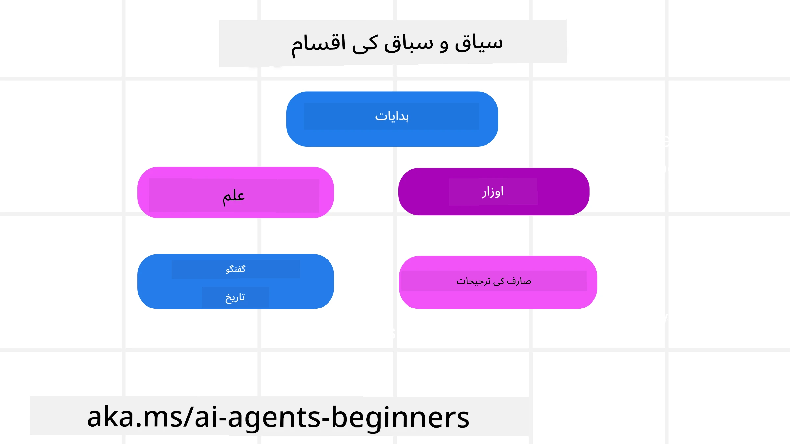
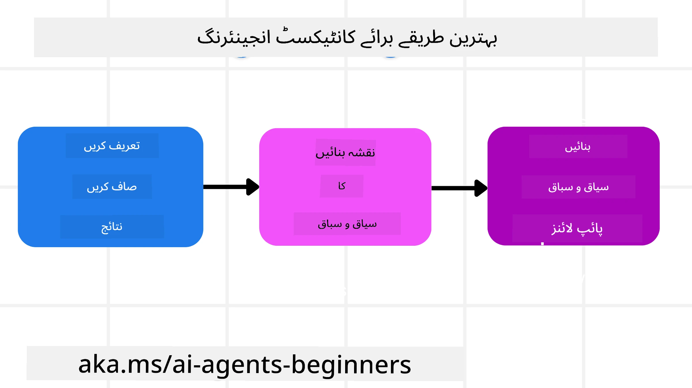

# AI ایجنٹس کے لیے کانٹیکسٹ انجینئرنگ

> _(اس سبق کی ویڈیو دیکھنے کے لیے اوپر دی گئی تصویر پر کلک کریں)_

اپلیکیشن کی پیچیدگی کو سمجھنا جس کے لیے آپ AI ایجنٹ بنا رہے ہیں، ایک قابلِ اعتماد ایجنٹ بنانے کے لیے ضروری ہے۔ ہمیں ایسے AI ایجنٹس بنانے کی ضرورت ہے جو معلومات کو مؤثر طریقے سے منظم کریں تاکہ پرامپٹ انجینئرنگ سے آگے بڑھ کر پیچیدہ ضروریات کو پورا کیا جا سکے۔

اس سبق میں، ہم دیکھیں گے کہ کانٹیکسٹ انجینئرنگ کیا ہے اور AI ایجنٹس کی تعمیر میں اس کا کردار کیا ہے۔

## تعارف

یہ سبق درج ذیل موضوعات پر محیط ہوگا:

• **کانٹیکسٹ انجینئرنگ کیا ہے** اور یہ پرامپٹ انجینئرنگ سے کیوں مختلف ہے۔

• **موثر کانٹیکسٹ انجینئرنگ کی حکمت عملی**، جس میں معلومات لکھنے، منتخب کرنے، کمپریس کرنے، اور علیحدہ کرنے کے طریقے شامل ہیں۔

• **عام کانٹیکسٹ کی ناکامیاں** جو آپ کے AI ایجنٹ کو متاثر کر سکتی ہیں اور انہیں کیسے درست کیا جائے۔

## تعلیمی اهداف

اس سبق کو مکمل کرنے کے بعد، آپ سمجھیں گے کہ کیسے:

• **کانٹیکسٹ انجینئرنگ کی تعریف کریں** اور اسے پرامپٹ انجینئرنگ سے ممتاز کریں۔

• **بڑے لسانی ماڈل (LLM) ایپلیکیشنز میں کانٹیکسٹ کے کلیدی اجزاء کی شناخت کریں۔**

• **کانٹیکسٹ لکھنے، منتخب کرنے، کمپریس کرنے، اور علیحدہ کرنے کی حکمت عملیوں کو لاگو کریں** تاکہ ایجنٹ کی کارکردگی بہتر ہو۔

• **عام کانٹیکسٹ کی ناکامیوں** جیسے زہر آلودگی، توجہ بھٹکانا، الجھن، اور تصادم کو پہچانیں اور تخفیفی تکنیکیں نافذ کریں۔

## کانٹیکسٹ انجینئرنگ کیا ہے؟

AI ایجنٹس کے لیے، کانٹیکسٹ وہ چیز ہے جو AI ایجنٹ کی کارروائیوں کی منصوبہ بندی کو چلتی ہے۔ کانٹیکسٹ انجینئرنگ اس بات کی مشق ہے کہ AI ایجنٹ کے پاس ٹاسک کے اگلے قدم کو مکمل کرنے کے لیے درست معلومات ہوں۔ کانٹیکسٹ ونڈو کی محدود جگہ ہوتی ہے، اس لیے ایجنٹ بنانے والوں کو ایسی نظامات اور عمل تیار کرنے کی ضرورت ہے جو کانٹیکسٹ ونڈو میں معلومات کو شامل کرنے، نکالنے، اور مختصر کرنے کو منظم کریں۔

### پرامپٹ انجینئرنگ بمقابلہ کانٹیکسٹ انجینئرنگ

پرامپٹ انجینئرنگ ایک جامد ہدایات کے سیٹ پر مرکوز ہوتا ہے تاکہ AI ایجنٹس کو موثر طریقے سے قواعد کے ایک سیٹ کے ساتھ رہنمائی کرے۔ کانٹیکسٹ انجینئرنگ ایک متحرک معلومات کے سیٹ کو منظم کرنے کا عمل ہے، جس میں ابتدائی پرامپٹ بھی شامل ہے، تاکہ یقینی بنایا جا سکے کہ وقت کے ساتھ AI ایجنٹ کے پاس جو کچھ چاہیے وہ موجود رہے۔ کانٹیکسٹ انجینئرنگ کا بنیادی خیال اس عمل کو دہرایا اور قابلِ اعتبار بنانا ہے۔

### کانٹیکسٹ کی اقسام

یہ یاد رکھنا ضروری ہے کہ کانٹیکسٹ صرف ایک چیز نہیں ہے۔ AI ایجنٹ کو درکار معلومات مختلف ذرائع سے آ سکتی ہے اور یہ ہم پر منحصر ہے کہ ایجنٹ کو ان ذرائع تک رسائی دی جائے:

کانٹیکسٹ کی اقسام جو AI ایجنٹ کو منظم کرنی پڑ سکتی ہیں، درج ذیل ہیں:

• **ہدایات:** یہ ایجنٹ کے "قواعد" کی طرح ہیں – پرامپٹس، سسٹم پیغامات، چند نمونہ مثالیں (جو AI کو کچھ کرنے کا طریقہ دکھاتی ہیں)، اور وہ آلات جنہیں وہ استعمال کر سکتا ہے کی تفصیلات۔ یہ وہ جگہ ہے جہاں پرامپٹ انجینئرنگ کا فوکس کانٹیکسٹ انجینئرنگ کے ساتھ ملتا ہے۔

• **علم:** اس میں حقائق، ڈیٹا بیس سے حاصل کردہ معلومات یا طویل مدتی یادیں شامل ہیں جو ایجنٹ نے جمع کی ہوں۔ اگر ایجنٹ کو مختلف علمی ذخائر اور ڈیٹا بیس تک رسائی چاہیے ہو تو ریٹریول آگمینٹڈ جنریشن (RAG) سسٹم کو شامل کرنا پڑتا ہے۔

• **آلات:** یہ خارجی فنکشنز کی تعریفیں، APIs اور MCP سرورز ہیں جنہیں ایجنٹ کال کر سکتا ہے، اور انہی کے استعمال کا فیڈ بیک (نتائج)۔

• **گفتگو کی تاریخ:** صارف کے ساتھ جاری گفت و شنید۔ وقت کے ساتھ ساتھ یہ گفتگو طویل اور پیچیدہ ہو جاتی ہے جس کا مطلب ہے کہ یہ کانٹیکسٹ ونڈو میں جگہ گھیرتی ہے۔

• **صارف کی پسندیدگیاں:** وقت کے ساتھ صارف کی پسند یا ناپسند کے بارے میں سیکھی گئی معلومات۔ یہ ذخیرہ کی جا سکتی ہیں اور کلیدی فیصلے کرتے وقت مدد کے لیے استعمال کی جا سکتی ہیں۔

## موثر کانٹیکسٹ انجینئرنگ کی حکمت عملی

### منصوبہ بندی کی حکمت عملی

اچھی کانٹیکسٹ انجینئرنگ اچھی منصوبہ بندی سے شروع ہوتی ہے۔ یہاں ایک طریقہ ہے جو آپ کو کانٹیکسٹ انجینئرنگ کے تصور کو اپنانے میں مدد دے گا:

1. **واضح نتائج کی تعریف کریں** – AI ایجنٹس کو دیے گئے ٹاسک کے نتائج واضح طور پر متعین ہونے چاہئیں۔ سوال کا جواب دیں – "جب AI ایجنٹ اپنا کام مکمل کر لے گا تو دنیا کیسی دکھائی دے گی؟" یعنی صارف کو AI ایجنٹ کے ساتھ تعامل کے بعد کیا تبدیلی، معلومات، یا جواب ملنا چاہیے۔
2. **کانٹیکسٹ کا نقشہ بنائیں** – جب آپ نے AI ایجنٹ کے نتائج کو متعین کر لیا، تو سوال کریں "AI ایجنٹ کو اس کام کو مکمل کرنے کے لیے کس معلومات کی ضرورت ہے؟" اس طرح آپ اس معلومات کے قابلِ حصول مقامات کا نقشہ بنا سکتے ہیں۔
3. **کانٹیکسٹ پائپ لائنز بنائیں** – اب جب آپ جانتے ہیں کہ معلومات کہاں ہے، تو سوال یہ ہے "ایجنٹ یہ معلومات کیسے حاصل کرے گا؟" یہ RAG، MCP سرورز، اور دیگر آلات کے استعمال سمیت مختلف طریقوں سے کیا جا سکتا ہے۔

### عملی حکمت عملی

منصوبہ بندی اہم ہے لیکن جب معلومات ہمارے ایجنٹ کے کانٹیکسٹ ونڈو میں آنا شروع ہو جائے، تو ہمیں اسے منظم کرنے کے لیے عملی حکمت عملیوں کی ضرورت ہوتی ہے:

#### کانٹیکسٹ کو منظم کرنا

جبکہ کچھ معلومات خود بخود کانٹیکسٹ ونڈو میں شامل ہو جاتی ہیں، کانٹیکسٹ انجینئرنگ زیادہ فعال کردار ادا کرنے کے بارے میں ہے جسے درج ذیل حکمت عملیوں سے کیا جا سکتا ہے:

 1. **ایجنٹ کا اسکریچ پیڈ**  
 یہ AI ایجنٹ کو اجازت دیتا ہے کہ وہ موجودہ کاموں اور صارف کے تعاملات کے متعلق اہم معلومات کے نوٹس ایک سیشن کے دوران لے سکے۔ یہ کانٹیکسٹ ونڈو کے باہر فائل یا رن ٹائم آبجیکٹ میں موجود ہونا چاہیے تاکہ ایجنٹ بعد میں اس سیشن میں ضرورت کے وقت اسے حاصل کر سکے۔

 2. **یادیں**  
 اسکریچ پیڈز ایک سیشن کے کانٹیکسٹ ونڈو سے باہر معلومات کو منظم کرنے کے لیے اچھے ہیں۔ یادیں ایجنٹ کو متعدد سیشنز میں متعلقہ معلومات ذخیرہ کرنے اور بازیافت کرنے کا موقع دیتی ہیں۔ اس میں خلاصے، صارف کی ترجیحات، اور مستقبل کی بہتری کے لیے فیڈ بیک شامل ہو سکتے ہیں۔

 3. **کانٹیکسٹ کو کمپریس کرنا**  
  جب کانٹیکسٹ ونڈو بڑھ جائے اور اس کی حد قریب ہو جائے، تو خلاصہ سازی اور تراش خراش جیسی تکنیکیں استعمال کی جا سکتی ہیں۔ یہ یا تو صرف سب سے متعلقہ معلومات رکھتی ہیں یا پرانی پیغامات کو حذف کر دیتی ہیں۔

 4. **کثیر ایجنٹ سسٹمز**  
  کثیر ایجنٹ نظام کی ترقی کانٹیکسٹ انجینئرنگ کی ایک شکل ہے کیونکہ ہر ایجنٹ کا اپنا کانٹیکسٹ ونڈو ہوتا ہے۔ یہ منصوبہ بندی کرنا ضروری ہے کہ یہ کانٹیکسٹ کس طرح مختلف ایجنٹس کے درمیان شیئر اور منتقل ہوتا ہے۔

 5. **سینڈباکس ماحول**  
 اگر ایجنٹ کو کچھ کوڈ چلانے یا کسی دستاویز میں بڑی مقدار میں معلومات پراسیس کرنے کی ضرورت ہو، تو یہ ٹوکنز کی بڑی مقدار خرچ کر سکتا ہے۔ اسے کانٹیکسٹ ونڈو میں ذخیرہ کرنے کے بجائے، ایجنٹ سینڈباکس ماحول استعمال کر سکتا ہے جو کوڈ چلا سکتا ہے اور صرف نتائج اور متعلقہ معلومات پڑھ سکتا ہے۔

 6. **رن ٹائم اسٹیٹ آبجیکٹس**  
 یہ معلومات کے کنٹینرز بنا کر کیا جاتا ہے تاکہ ایجنٹ کو مخصوص معلومات تک رسائی کا انتظام کیا جا سکے۔ پیچیدہ کام کے لیے، یہ ایجنٹ کو ہر ذیلی کام کے نتائج کو قدم بہ قدم ذخیرہ کرنے کی اجازت دیتا ہے، جس سے کانٹیکسٹ صرف اس خاص ذیلی کام کے ساتھ منسلک رہتی ہے۔

#### کانٹیکسٹ کا معائنہ کرنا

ان حکمت عملیوں میں سے کسی کو لاگو کرنے کے بعد، یہ جاننا مفید ہوتا ہے کہ اگلی ماڈل کال کو کیا واقعی ملا۔ ایک مفید اشکال پیدا کرنے والا سوال یہ ہے:

> کیا ایجنٹ نے زیادہ کانٹیکسٹ لوڈ کر لیا، غلط کانٹیکسٹ لوڈ کیا، یا ضروری کانٹیکسٹ چھوٹ گیا؟

اس سوال کا جواب دینے کے لیے آپ کو خام پرامپٹس، ٹول آؤٹ پٹ یا یادداشت کا مواد لاگ کرنے کی ضرورت نہیں۔ پروڈکشن میں چھوٹے کانٹیکسٹ معائنہ ریکارڈز کو ترجیح دیں جو کاؤنٹس، شناختی نمبرز، ہیشز، اور پالیسی لیبلز کو قید کریں:

- **انتخاب:** ٹریک کریں کہ کتنے امیدوار ٹکڑے، آلات، یا یادیں زیر غور آئیں، کتنے منتخب ہوئے، اور کون سا قاعدہ یا اسکور دیگر کو فلٹر کرنے کا سبب بنا۔
- **کمپریشن:** ماخذ رینج یا ٹریس آئی ڈی، سمری آئی ڈی، کمپریشن سے پہلے اور بعد کا اندازہ شدہ ٹوکن شمار، اور آیا خام مواد اگلی کال سے خارج کیا گیا یا نہیں۔
- **علیحدگی:** نوٹ کریں کہ کون سا ذیلی کام الگ ایجنٹ، سیشن، یا سینڈباکس میں چلایا گیا، کون سا بند سمری واپس آیا، اور کیا بڑے ٹول آؤٹ پٹ والدین ایجنٹ کانٹیکسٹ سے باہر رہا۔
- **میموری اور RAG:** مکمل بازیافت شدہ متن کے بجائے بازیافت دستاویز IDs، میموری IDs، اسکورز، منتخب IDs، اور ریڈیکشن اسٹیٹس کو ذخیرہ کریں۔
- **حفاظت اور پرائیویسی:** حساس پرامپٹ متن، ٹول دلائل، ٹول نتائج، یا صارف کی یادداشت کے مواد سے زیادہ ہیشز، IDs، ٹوکن بکٹ، اور پالیسی لیبلز کو ترجیح دیں۔

مقصد زیادہ کانٹیکسٹ رکھنا نہیں ہے بلکہ اتنا ثبوت چھوڑنا ہے کہ ڈویلپر بتا سکے کہ کونسی کانٹیکسٹ حکمت عملی چلائی گئی اور کیا اس نے اگلی ماڈل کال کو مطلوبہ انداز میں تبدیل کیا۔

### کانٹیکسٹ انجینئرنگ کی مثال

فرض کریں ہم چاہتے ہیں کہ AI ایجنٹ **"میرے لیے پیرس کا سفر بک کرے۔"**

• ایک سادہ ایجنٹ جو صرف پرامپٹ انجینئرنگ استعمال کرتا ہے ممکنہ طور پر جواب دے گا: **"ٹھیک ہے، آپ پیرس کب جانا چاہیں گے؟"** یہ صرف اس وقت آپ کے براہِ راست سوال کو پراسیس کرتا ہے جب صارف پوچھتا ہے۔

• ایک ایجنٹ جو اوپر دی گئی کانٹیکسٹ انجینئرنگ حکمت عملیوں کو استعمال کرتا ہے، بہت زیادہ کام کرے گا۔ جواب دینے سے پہلے، اس کا سسٹم ممکنہ طور پر:

  ◦ **آپ کے کیلنڈر کی جانچ کرے** (حقیقی وقت کا ڈیٹا بازیافت کر کے).

 ◦ **گزشتہ سفر کی ترجیحات کو یاد کرے** (طویل مدتی یادداشت سے) جیسے کہ پسندیدہ ایئر لائن، بجٹ، یا کیا آپ ڈائریکٹ فلائٹس کو ترجیح دیتے ہیں۔

 ◦ **پرواز اور ہوٹل بکنگ کے لیے دستیاب آلات کی شناخت کرے**۔

- پھر، ایک ممکنہ جواب ہو سکتا ہے: "ہیلو [آپ کا نام]! میں دیکھ رہا ہوں کہ آپ اکتوبر کے پہلے ہفتے فارغ ہیں۔ کیا میں آپ کے معمول کے بجٹ [بجٹ] میں [پسندیدہ ایئر لائن] کے ذریعے پیرس کے لیے ڈائریکٹ فلائٹس تلاش کروں؟" یہ بھرپور، کانٹیکسٹ سے آگاہ جواب کانٹیکسٹ انجینئرنگ کی طاقت کو ظاہر کرتا ہے۔

## عام کانٹیکسٹ ناکامیاں

### کانٹیکسٹ زہر آلودگی

**یہ کیا ہے:** جب ایک ہیلوسینیشن (LLM کی طرف سے پیدا کردہ غلط معلومات) یا خرابی کانٹیکسٹ میں داخل ہو جائے اور بار بار حوالہ دی جائے، جس سے ایجنٹ ناممکن مقاصد کا پیچھا کرتا ہے یا بے معنی حکمت عملیوں کو فروغ دیتا ہے۔

**کیا کریں:** **کانٹیکسٹ کی توثیق** اور **قرنطینہ** نافذ کریں۔ معلومات کو طویل مدتی یادداشت میں شامل کرنے سے پہلے اس کی جانچ کریں۔ اگر ممکنہ زہر آلودگی کا پتہ چلے تو خراب معلومات کے پھیلاؤ کو روکنے کے لیے نئی کانٹیکسٹ تھریڈز شروع کریں۔

**سفر کی بکنگ کی مثال:** آپ کا ایجنٹ ایک **چھوٹے مقامی ہوائی اڈے سے دور دراز عالمی شہر کے لیے براہِ راست پرواز** کا فرضی تصور کر لیتا ہے جو اصل میں بین الاقوامی پروازیں فراہم نہیں کرتا۔ یہ غیر موجودہ پرواز کی تفصیل کانٹیکسٹ میں محفوظ ہو جاتی ہے۔ بعد میں، جب آپ ایجنٹ سے بکنگ کے لیے کہتے ہیں، تو یہ ناممکن روٹ کے لیے ٹکٹ تلاش کرنے کی کوشش کرتا رہتا ہے، جس سے بار بار غلطیاں ہوتی ہیں۔

**حل:** ایک ایسا قدم نافذ کریں جو **فلائٹ کی موجودگی اور روٹ کو حقیقی وقت API کے ذریعے تصدیق کرے** _اس سے پہلے_ کہ پرواز کی تفصیل ایجنٹ کے فعال کانٹیکسٹ میں شامل کی جائے۔ اگر توثیق ناکام ہو، تو غلط معلومات کو "قرنطینہ" کیا جاتا ہے اور مزید استعمال نہیں کیا جاتا۔

### کانٹیکسٹ توجہ بھٹکانا

**یہ کیا ہے:** جب کانٹیکسٹ اتنا بڑا ہو جاتا ہے کہ ماڈل جمع شدہ تاریخ پر بہت زیادہ توجہ دیتا ہے اور تربیت کے دوران سیکھی گئی باتوں کا استعمال کم کرتا ہے، جس سے بار بار غیر مددگار عمل ہوتے ہیں۔ ماڈلز کانٹیکسٹ ونڈو بھرنے سے پہلے ہی غلطیاں شروع کر سکتے ہیں۔

**کیا کریں:** **کانٹیکسٹ خلاصہ سازی** استعمال کریں۔ وقتاً فوقتاً جمع کی گئی معلومات کو مختصر خلاصوں میں کمپریس کریں، اہم تفصیلات کو رکھتے ہوئے غیر ضروری تاریخ کو ہٹائیں۔ یہ توجہ کو "ری سیٹ" کرنے میں مدد دیتا ہے۔

**سفر کی بکنگ کی مثال:** آپ طویل عرصے سے مختلف خوابوں کے سفر کے مقامات پر بات کر رہے ہیں، بشمول دو سال پہلے کی آپ کی بیگ پیکنگ کی تفصیلی داستان۔ جب آپ آخرکار کہتے ہیں کہ **"میرے لیے اگلے مہینے سستی پرواز تلاش کرو,"** تو ایجنٹ پرانی، غیر متعلقہ تفصیلات میں الجھ جاتا ہے اور آپ کے بیگ پیکنگ کے ساز و سامان یا پچھلے سفر کی بابت بار بار سوالات کرتا رہتا ہے، آپ کی موجودہ درخواست کو نظر انداز کر دیتا ہے۔

**حل:** کچھ موڑوں کے بعد یا جب کانٹیکسٹ بہت زیادہ بڑھ جائے، ایجنٹ کو چاہیے کہ وہ **گفتگو کے حالیہ اور متعلقہ حصوں کا خلاصہ کرے** – جو آپ کی موجودہ سفری تاریخوں اور منزل پر توجہ دیتا ہو – اور اگلی LLM کال کے لیے اس مختصر خلاصے کو استعمال کرے، کم متعلقہ تاریخی بات چیت کو خارج کر دے۔

### کانٹیکسٹ الجھن

**یہ کیا ہے:** جب غیر ضروری کانٹیکسٹ، اکثر بہت زیادہ دستیاب ٹولز کی شکل میں ہو، تو ماڈل غلط جوابات پیدا کرتا ہے یا غیر متعلقہ ٹولز کال کرتا ہے۔ چھوٹے ماڈلز خاص طور پر اس کا شکار ہوتے ہیں۔

**کیا کریں:** RAG تکنیکوں کی مدد سے **ٹول لوڈ آؤٹ مینجمنٹ** نافذ کریں۔ ٹول کی تفصیلات کو ویکٹر ڈیٹا بیس میں محفوظ کریں اور ہر مخصوص ٹاسک کے لیے صرف سب سے متعلقہ ٹولز منتخب کریں۔ تحقیق سے پتہ چلتا ہے کہ ٹول انتخاب کو 30 سے کم رکھنے کا رجحان بہتر ہوتا ہے۔

**سفر کی بکنگ کی مثال:** آپ کے ایجنٹ کے پاس درجنوں ٹولز کی رسائی ہے: `book_flight`, `book_hotel`, `rent_car`, `find_tours`, `currency_converter`, `weather_forecast`, `restaurant_reservations` وغیرہ۔ آپ پوچھتے ہیں، **"پیرس میں گھومنے کا بہترین طریقہ کیا ہے؟"** ٹولز کی تعداد کی وجہ سے، ایجنٹ الجھ جاتا ہے اور `book_flight` کو پیرس میں کال کرنے کی کوشش کرتا ہے، یا `rent_car` بھی جب کہ آپ پبلک ٹرانسپورٹ کو ترجیح دیتے ہیں، کیونکہ ٹول کی تفصیلات اوورلیپ کر سکتی ہیں یا وہ بہترین ٹول کا تعین نہیں کر پاتا۔

**حل:** ٹول کی تفصیلات پر **RAG کا استعمال کریں**۔ جب آپ پیرس میں نقل و حمل کے بارے میں پوچھیں، تو سسٹم متحرک طور پر صرف سب سے متعلقہ ٹولز جیسے `rent_car` یا `public_transport_info` کو بازیافت کرتا ہے، اور LLM کے لیے ٹولز کا ایک مرکوز "لوڈ آؤٹ" پیش کرتا ہے۔

### کانٹیکسٹ تصادم

**یہ کیا ہے:** جب کانٹیکسٹ میں متضاد معلومات موجود ہوں، جس سے استدلال میں تضاد یا خراب حتمی جوابات پیدا ہوتے ہیں۔ یہ اکثر تب ہوتا ہے جب معلومات مرحلہ وار آتی ہو اور ابتدائی، غلط مفروضے کانٹیکسٹ میں باقی رہ جاتے ہوں۔

**کیا کریں:** **کانٹیکسٹ پلننگ** اور **آف لوڈنگ** کا استعمال کریں۔ پلننگ کا مطلب ہے پرانی یا متضاد معلومات کو نئے معلومات آنے پر ہٹانا۔ آف لوڈنگ ماڈل کو ایک علیحدہ "اسکریچ پیڈ" ورک اسپیس دیتی ہے تاکہ معلومات کا پراسیسنگ اصلی کانٹیکسٹ کو بھڑکائے بغیر ہو سکے۔
**سفر کی بکنگ کی مثال:** آپ ابتدائی طور پر اپنے ایجنٹ کو بتاتے ہیں، **"میں اکنامی کلاس میں پرواز کرنا چاہتا ہوں۔"** بعد میں گفتگو کے دوران، آپ اپنا ذہن بدل کر کہتے ہیں، **"اصل میں، اس سفر کے لیے، چلیں بزنس کلاس میں جاتے ہیں۔"** اگر دونوں ہدایات متن میں موجود رہتی ہیں، تو ایجنٹ کو متضاد تلاش کے نتائج مل سکتے ہیں یا یہ سمجھنے میں الجھن ہو سکتی ہے کہ کس ترجیح کو فوقیت دینی ہے۔

**حل:** **کانٹیکسٹ پروننگ** کو نافذ کریں۔ جب کوئی نئی ہدایت پرانی ہدایت کی مخالفت کرتی ہو، تو پرانی ہدایت کو متن سے حذف کر دیا جاتا ہے یا واضح طور پر اوور رائیڈ کر دیا جاتا ہے۔ متبادل طور پر، ایجنٹ متضاد ترجیحات کو حل کرنے کے لیے ایک **اسکریچ پیڈ** استعمال کر سکتا ہے تاکہ فیصلہ کرنے سے پہلے صرف آخری، مستقل ہدایت ہی اس کے اقدامات کی رہنمائی کرے۔

## کانٹیکسٹ انجینئرنگ کے بارے میں مزید سوالات ہیں؟

دوسرے سیکھنے والوں سے ملنے، دفتر کے اوقات میں شامل ہونے اور اپنے AI ایجنٹس کے سوالات کے جوابات حاصل کرنے کے لیے [Microsoft Foundry Discord](https://aka.ms/ai-agents/discord) میں شامل ہوں۔

---

<!-- CO-OP TRANSLATOR DISCLAIMER START -->
**ڈس کلیمر**:
یہ دستاویز AI ترجمہ سروس [Co-op Translator](https://github.com/Azure/co-op-translator) کے ذریعے ترجمہ کی گئی ہے۔ جبکہ ہم درستگی کے لیے کوشاں ہیں، براہ کرم اس بات سے آگاہ رہیں کہ خودکار ترجمے میں غلطیاں یا عدم درستیاں ہو سکتی ہیں۔ اصل دستاویز اپنے مادری زبان میں مستند ماخذ سمجھی جائے گی۔ حساس معلومات کے لیے پیشہ ور انسانی ترجمہ کی سفارش کی جاتی ہے۔ اس ترجمے کے استعمال سے پیدا ہونے والی کسی بھی غلط فہمی یا غلط تشریح کی ذمہ داری ہم قبول نہیں کرتے۔
<!-- CO-OP TRANSLATOR DISCLAIMER END -->