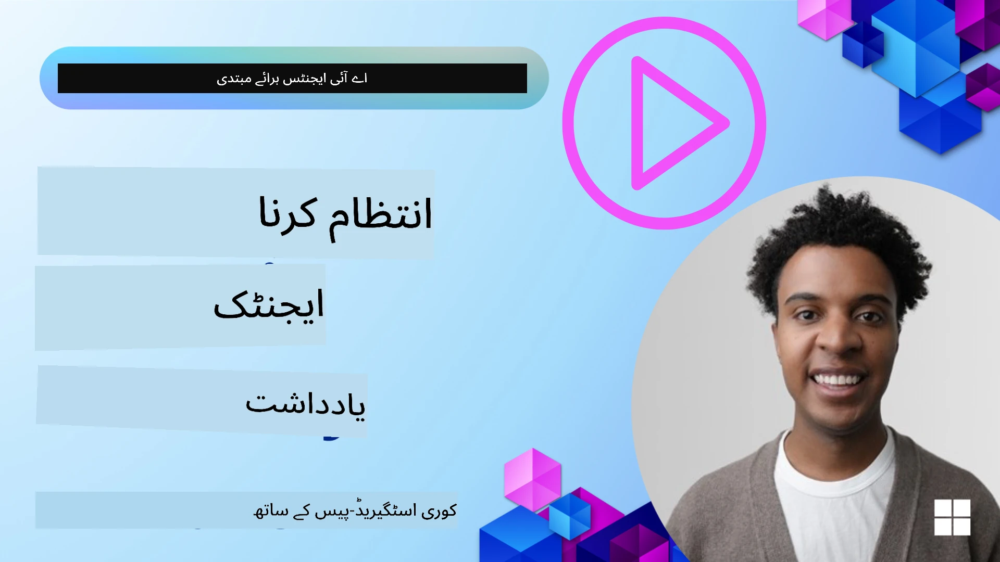

# AI ایجنٹس کے لیے میموری  

جب AI ایجنٹس بنانے کے منفرد فوائد پر بات کی جاتی ہے، تو دو چیزیں خاص طور پر زیرِ بحث آتی ہیں: کام مکمل کرنے کے لیے ٹولز کو کال کرنے کی صلاحیت اور وقت کے ساتھ بہتر بنانے کی صلاحیت۔ میموری خود کو بہتر بنانے والے ایجنٹ کو بنانے کی بنیاد ہے جو ہمارے صارفین کے لیے بہتر تجربات تخلیق کر سکے۔

اس سبق میں، ہم دیکھیں گے کہ AI ایجنٹس کے لیے میموری کیا ہے اور ہم اسے کس طرح سنبھال سکتے ہیں اور اپنی ایپلیکیشنز کے فائدے کے لیے استعمال کر سکتے ہیں۔

## تعارف  

اس سبق میں شامل ہیں:

• **AI ایجنٹ کی میموری کو سمجھنا**: میموری کیا ہے اور یہ ایجنٹس کے لیے کیوں ضروری ہے۔

• **میموری کا نفاذ اور ذخیرہ کرنا**: آپ کے AI ایجنٹس میں میموری کی صلاحیتیں شامل کرنے کے عملی طریقے، خاص طور پر قلیل مدتی اور طویل مدتی میموری پر توجہ۔

• **AI ایجنٹس کو خود کو بہتر بنانے والا بنانا**: کیسے میموری ایجنٹس کو ماضی کے تعاملات سے سیکھنے اور وقت کے ساتھ بہتر بنانے کے قابل بناتی ہے۔

## دستیاب نفاذ

اس سبق میں دو جامع نوٹ بک ٹیوٹوریلز شامل ہیں:

• **[13-agent-memory.ipynb](./13-agent-memory.ipynb)**: Microsoft Agent Framework کے ساتھ Mem0 اور Azure AI Search کا استعمال کرتے ہوئے میموری کا نفاذ

• **[13-agent-memory-cognee.ipynb](./13-agent-memory-cognee.ipynb)**: Cognee کا استعمال کرتے ہوئے ساختہ میموری کا نفاذ، ایمبیڈنگز سے پشت پناہی شدہ علم گراف کی خودکار تشکیل، گراف کی بصری نمائندگی، اور ذہین بازیابی

## سیکھنے کے مقاصد

اس سبق کو مکمل کرنے کے بعد، آپ جانیں گے کہ:

• **AI ایجنٹ کی مختلف اقسام کی میموری میں فرق کرنا**، بشمول ورکنگ، قلیل مدتی، طویل مدتی میموری، اور خاص اقسام جیسے پرسنہ اور قسط وار میموری۔

• **Microsoft Agent Framework استعمال کرتے ہوئے قلیل مدتی اور طویل مدتی میموری کو نافذ کرنا اور سنبھالنا**، Mem0، Cognee، Whiteboard میموری جیسے ٹولز کو استعمال کرنا، اور Azure AI Search کے ساتھ انضمام۔

• **خود کو بہتر بنانے والے AI ایجنٹس کے اصول کو سمجھنا** اور یہ کہ مضبوط میموری مینجمنٹ سسٹمز کس طرح مسلسل سیکھنے اور موافقت میں مدد دیتے ہیں۔

## AI ایجنٹ کی میموری کو سمجھنا

بنیادی طور پر، **AI ایجنٹس کے لیے میموری کا مطلب وہ میکانزم ہیں جو انہیں معلومات کو یاد رکھنے اور واپس بلانے کی اجازت دیتے ہیں**۔ یہ معلومات کسی گفتگو کے مخصوص تفصیلات، صارف کی ترجیحات، پچھلے اقدامات، یا حتیٰ کہ سیکھے گئے نمونے ہو سکتی ہیں۔

میموری کے بغیر، AI ایپلیکیشنز اکثر اسٹیٹ لیس ہوتی ہیں، یعنی ہر تعامل ابتدا سے شروع ہوتا ہے۔ اس سے ایک دہرائے جانے والا اور مایوس کن صارف تجربہ پیدا ہوتا ہے جہاں ایجنٹ پچھلے سیاق و سباق یا ترجیحات کو "بھول" جاتا ہے۔

### میموری کیوں اہم ہے؟  

ایک ایجنٹ کی ذہانت گہری طور پر اس کی پچھلی معلومات کو یاد کرنے اور استعمال کرنے کی صلاحیت سے جڑی ہے۔ میموری ایجنٹس کو قابل بناتی ہے کہ وہ:

• **عکاس ہوں**: ماضی کے اعمال اور نتائج سے سیکھنا۔

• **تعامل پذیر ہوں**: جاری گفتگو کے دوران سیاق و سباق کو برقرار رکھنا۔

• **پیش گی اور ردعمل ظاہر کریں**: تاریخی ڈیٹا کی بنیاد پر ضروریات کا اندازہ لگانا یا مناسب جواب دینا۔

• **خودمختار ہوں**: محفوظ کردہ علم پر انحصار کرتے ہوئے زیادہ آزادانہ طور پر کام کرنا۔

میموری نافذ کرنے کا مقصد ہے کہ ایجنٹس کو زیادہ **قابل اعتماد اور قابل بنایا جائے**۔

### میموری کی اقسام

#### ورکنگ میموری

اسے اسکرینچ پیپر سمجھیں جو ایجنٹ ایک جاری کام یا سوچ کے عمل کے دوران استعمال کرتا ہے۔ یہ فوری معلومات رکھتا ہے جو اگلے قدم کا حساب لگانے کے لیے ضروری ہوتی ہے۔

AI ایجنٹس کے لیے، ورکنگ میموری عام طور پر گفتگو سے سب سے متعلقہ معلومات کو پکڑتی ہے، چاہے پوری چیٹ کی تاریخ لمبی یا مختصر ہو۔ یہ اہم عناصر جیسے ضروریات، تجاویز، فیصلے، اور اقدامات نکالنے پر توجہ دیتی ہے۔

**ورکنگ میموری کی مثال**

ایک ٹریول بکنگ ایجنٹ میں، ورکنگ میموری صارف کی موجودہ درخواست جیسا کہ "میں پیرس کے لیے سفر بک کرنا چاہتا ہوں" کو پکڑ سکتی ہے۔ یہ مخصوص ضرورت ایجنٹ کے فوری سیاق و سباق میں رکھی جاتی ہے تاکہ موجودہ تعامل کی رہنمائی ہو سکے۔

#### قلیل مدتی میموری

اس قسم کی میموری ایک واحد گفتگو یا سیشن کے دوران معلومات کو برقرار رکھتی ہے۔ یہ موجودہ چیٹ کا سیاق و سباق ہے، جو ایجنٹ کو بات چیت میں پچھلے مرحلوں کا حوالہ دینے کی اجازت دیتی ہے۔

**قلیل مدتی میموری کی مثال**

اگر صارف پوچھے، "پیرس کے لیے فلائٹ کی کتنی قیمت ہوگی؟" اور پھر "وہاں رہائش کے بارے میں کیا خیال ہے؟"، تو قلیل مدتی میموری یقینی بناتی ہے کہ ایجنٹ جانتا ہے "وہاں" کا مطلب "پیرس" ہے اسی گفتگو میں۔

#### طویل مدتی میموری

یہ ایسی معلومات ہے جو متعدد گفتگوؤں یا سیشنز میں برقرار رہتی ہے۔ یہ ایجنٹس کو صارف کی ترجیحات، تاریخی تعاملات، یا عمومی علم کو طویل عرصے تک یاد رکھنے کی اجازت دیتی ہے۔ یہ شخصی بنانے کے لیے اہم ہے۔

**طویل مدتی میموری کی مثال**

طویل مدتی میموری میں یہ محفوظ ہو سکتا ہے کہ "بین کو اسکیئنگ اور باہر کی سرگرمیاں پسند ہیں، اسے پہاڑی منظر کے ساتھ کافی پسند ہے، اور وہ ماضی کی چوٹ کی وجہ سے پیچیدہ اسکی ڈھلوانوں سے بچنا چاہتا ہے"۔ یہ معلومات پچھلے تعاملات سے سیکھی جاتی ہے اور مستقبل کے ٹریول پلاننگ سیشنز میں سفارشات کو بہت زیادہ شخصی بناتی ہے۔

#### پرسنہ میموری

یہ خاص میموری قسم ایجنٹ کو ایک مستقل "شخصیت" یا "پرسنہ" تیار کرنے میں مدد دیتی ہے۔ یہ ایجنٹ کو اپنے یا اپنے متعین کردہ کردار کی تفصیلات یاد رکھنے کی اجازت دیتی ہے، جو تعاملات کو زیادہ روان اور مرکوز بناتی ہے۔

**پرسنہ میموری کی مثال**  
اگر ٹریول ایجنٹ کو "ماہر اسکی منصوبہ ساز" کے طور پر ڈیزائن کیا گیا ہے، تو پرسنہ میموری اس کردار کو مضبوط کر سکتی ہے، اور اس کے جوابات کو ایک ماہر کے لہجے اور علم کے مطابق بناتی ہے۔

#### ورک فلو / قسط وار میموری

یہ میموری ایک پیچیدہ کام کے دوران ایجنٹ کے کیے گئے اقدامات کے تسلسل کو محفوظ رکھتی ہے، جس میں کامیابیاں اور ناکامیاں شامل ہیں۔ یہ مخصوص "قسطوں" یا ماضی کے تجربات کو یاد رکھنے کی مانند ہے تاکہ سیکھا جا سکے۔

**قسط وار میموری کی مثال**

اگر ایجنٹ نے کسی خاص فلائٹ کو بک کرنے کی کوشش کی لیکن دستیاب نہ ہونے کی وجہ سے ناکام رہا، تو قسط وار میموری اس ناکامی کو ریکارڈ کر سکتی ہے، جس سے ایجنٹ دوسرے فلائٹس آزما سکتا ہے یا بعد میں کسی اور کوشش میں صارف کو بہتر طریقے سے مسئلہ بتا سکتا ہے۔

#### اینٹیٹی میموری

یہ میموری گفتگوؤں سے مخصوص افراد، مقامات، یا اشیاء اور واقعات کو نکالنے اور یاد رکھنے پر مرکوز ہے۔ یہ ایجنٹ کو کلیدی عناصر کی ساختی تفہیم بنانے کی اجازت دیتی ہے۔

**اینٹیٹی میموری کی مثال**

ماضی کے سفر کی گفتگو سے، ایجنٹ "پیرس"، "ایفل ٹاور" اور "Le Chat Noir ریسٹورنٹ میں عشائیہ" کو اینٹیٹیز کے طور پر نکال سکتا ہے۔ مستقبل کی بات چیت میں، ایجنٹ "Le Chat Noir" کو یاد کر کے وہاں نئی ریزرویشن کرنے کی پیشکش کر سکتا ہے۔

#### ساختہ RAG (ریٹریول آگمینٹڈ جنریشن)

اگرچہ RAG ایک وسیع تکنیک ہے، "ساختہ RAG" ایک طاقتور میموری ٹیکنالوجی کے طور پر نمایاں ہے۔ یہ مختلف ذرائع (گفتگوؤں، ای میلز، تصاویر) سے گہری، ساختہ معلومات نکالتی ہے اور اسے بہتر درستگی، یاد داشت، اور رفتار کے لیے استعمال کرتی ہے۔ کلاسیکی RAG کے برعکس جو صرف معنوی مماثلت پر انحصار کرتا ہے، ساختہ RAG معلومات کی اندرونی ساخت کے ساتھ کام کرتی ہے۔

**ساختہ RAG کی مثال**  
صرف کلیدی الفاظ سے ملانے کے بجائے، ساختہ RAG ای میل سے پرواز کی تفصیلات (منزل، تاریخ، وقت، ایئر لائن) نکال کر ساختہ انداز میں ذخیرہ کر سکتی ہے۔ یہ دقیق سوالات جیسے "میں نے منگل کو پیرس کے لیے کونسی فلائٹ بک کی تھی؟" کے جواب دینے میں مدد دیتی ہے۔

## میموری کا نفاذ اور ذخیرہ کرنا

AI ایجنٹس کے لیے میموری کا نفاذ ایک منظم عمل ہے جسے **میموری مینجمنٹ** کہتے ہیں، جو جنریشن، ذخیرہ، بازیابی، انضمام، تازہ کاری، اور یہاں تک کہ معلومات "بھولنے" (یا حذف کرنے) پر مشتمل ہے۔ بازیابی ایک خاص طور پر اہم پہلو ہے۔

### مخصوص میموری کے ٹولز

#### Mem0

میریمیوری ذخیرہ کرنے اور سنبھالنے کا ایک طریقہ مخصوص ٹولز جیسے Mem0 کا استعمال کرنا ہے۔ Mem0 مستقل میموری کی تہہ کی طرح کام کرتا ہے، جو ایجنٹس کو متعلقہ تعاملات یاد رکھنے، صارف کی ترجیحات اور حقائق کا سیاق و سباق ذخیرہ کرنے، اور وقت کے ساتھ کامیابیوں اور ناکامیوں سے سیکھنے کی اجازت دیتا ہے۔ یہاں تصور یہ ہے کہ بغیر ریاست والے ایجنٹس کو ریاست رکھنے والے میں تبدیل کرنا۔

یہ ایک **دو مرحلوں والے میموری پائپ لائن: استخراج اور تازہ کاری** کے ذریعہ کام کرتا ہے۔ پہلے، ایجنٹ کے تھریڈ میں شامل کردہ پیغامات Mem0 سروس کو بھیجے جاتے ہیں، جو ایک بڑا زبان ماڈل (LLM) استعمال کرکے گفتگو کی تاریخ کا خلاصہ کرتا ہے اور نئی یادیں نکالتا ہے۔ بعد میں، LLM-چلائے جانے والے تازہ کاری مرحلے میں طے کیا جاتا ہے کہ آیا ان یادوں کو شامل کرنا، ترمیم کرنا، یا حذف کرنا ہے، اور انہیں ایک ہائبرڈ ڈیٹا اسٹور میں محفوظ کرتا ہے جو ویکٹر، گراف، اور کی-ویلیو ڈیٹا بیس شامل کر سکتا ہے۔ یہ نظام مختلف میموری اقسام کی حمایت بھی کرتا ہے اور اینٹیٹیز کے درمیان تعلقات کے انتظام کے لیے گراف میموری شامل کر سکتا ہے۔

#### Cognee

ایک اور طاقتور طریقہ **Cognee** کا استعمال ہے، جو AI ایجنٹس کے لیے ایک اوپن سورس معنیاتی میموری ہے جو ساختی اور غیر ساختی ڈیٹا کو سوال پذیر نالج گرافز میں تبدیل کرتا ہے جن کی پشت پناہی ایمبیڈنگز کرتی ہیں۔ Cognee ایک **دوہری اسٹور فن تعمیر** فراہم کرتا ہے جو ویکٹر مماثلت تلاش کو گراف تعلقات کے ساتھ ملاتا ہے، جس سے ایجنٹس کو نہ صرف معلومات کی مماثلت سمجھنے بلکہ اس بات کا بھی پتہ چلتا ہے کہ تصورات ایک دوسرے سے کس طرح جڑے ہیں۔

یہ خام چنک لوک اپ سے لے کر گراف سے واقف سوال جواب تک **ہائبرڈ بازیابی** میں مہارت رکھتا ہے جو ویکٹر مماثلت، گرافی ساخت، اور LLM استدلال کو ملاسکتا ہے۔ نظام ایک **زندہ میموری** برقرار رکھتا ہے جو ترقی کرتی ہے اور بڑھتی ہے جبکہ ایک متصل گراف کے طور پر سوال کرنے کے قابل رہتی ہے، قلیل مدتی سیشن سیاق و سباق اور طویل مدتی مستقل میموری دونوں کی حمایت کرتی ہے۔

Cognee نوٹ بک ٹیوٹوریل ([13-agent-memory-cognee.ipynb](./13-agent-memory-cognee.ipynb)) اس متحدہ میموری تہہ کی تعمیر دکھاتا ہے، مختلف ڈیٹا ذرائع کو شامل کرنے، نالج گراف کو بصری بنانے، اور مخصوص ایجنٹ کی ضروریات کے مطابق مختلف تلاش حکمت عملیوں کے ساتھ سوال کرنے کے عملی مثالوں کے ساتھ۔

### RAG کے ساتھ میموری ذخیرہ کرنا

Mem0 جیسے مخصوص میموری ٹولز کے علاوہ، آپ مضبوط تلاش کی خدمات جیسے **Azure AI Search کو میموری ذخیرہ کرنے اور بازیافت کے لیے بیک اینڈ کے طور پر استعمال کر سکتے ہیں**، خاص طور پر ساختہ RAG کے لیے۔

یہ آپ کو اپنے ایجنٹ کے جوابات کو اپنے ڈیٹا کے ساتھ بنیاد فراہم کرنے کی اجازت دیتا ہے، تاکہ زیادہ متعلقہ اور درست جوابات حاصل کیے جا سکیں۔ Azure AI Search کو صارف کی مخصوص سفری یادوں، مصنوعات کے کیٹلاگز، یا کسی بھی دوسرے ڈومین مخصوص علم کو ذخیرہ کرنے کے لیے استعمال کیا جا سکتا ہے۔

Azure AI Search ایسی صلاحیتوں کی حمایت کرتا ہے جیسے **ساختہ RAG**، جو بڑے ڈیٹا سیٹس جیسے گفتگو کی تاریخ، ای میلز، یا یہاں تک کہ تصاویر سے گہری، ساختہ معلومات نکالنے اور بازیافت کرنے میں ماہر ہے۔ یہ روایتی ٹیکسٹ چنکنگ اور ایمبیڈنگ نقطہ نظر کے مقابلے میں "انسان سے بڑھ کر درستگی اور یادداشت" فراہم کرتا ہے۔

## AI ایجنٹس کو خود کو بہتر بنانے والا بنانا

خود کو بہتر بنانے والے ایجنٹس کا ایک عام نمونہ ایک **"نالج ایجنٹ"** متعارف کرانا ہے۔ یہ علیحدہ ایجنٹ صارف اور بنیادی ایجنٹ کے درمیان مرکزی گفتگو کا مشاہدہ کرتا ہے۔ اس کا کام ہے:

1. **قیمتی معلومات کی شناخت کرنا**: یہ تعین کرنا کہ گفتگو کا کوئی حصہ عمومی علم یا مخصوص صارف کی ترجیح کے طور پر قابل ذخیرہ ہے یا نہیں۔

2. **استخراج اور خلاصہ بنانا**: گفتگو سے اہم سیکھنے یا ترجیح کو نکالنا۔

3. **علم کے ذخیرے میں محفوظ کرنا**: اس استخراج شدہ معلومات کو محفوظ کرنا، اکثر ایک ویکٹر ڈیٹا بیس میں، تاکہ بعد میں بازیافت کی جا سکے۔

4. **مستقبل کے سوالات کو افزودہ کرنا**: جب صارف نیا سوال شروع کرے، تہذیب یافتہ معلومات کو بازیافت کرنا اور صارف کے پرامپٹ میں شامل کرنا، بنیادی ایجنٹ کو ضروری سیاق و سباق فراہم کرنا (جیسا کہ RAG میں ہوتا ہے)۔

### میموری کی اصلاحات

• **لاٹینسی مینجمنٹ**: صارف کے تعاملات کو سست کیے بغیر ایک سستا اور تیز ماڈل استعمال کیا جا سکتا ہے تاکہ جلدی یہ چیک کیا جا سکے کہ آیا معلومات ذخیرہ کرنے یا بازیافت کرنے کے قابل ہے، اور صرف ضرورت پڑنے پر زیادہ پیچیدہ استخراج/بازیابی عمل کو فعال کیا جائے۔

• **نالج بیس کی دیکھ بھال**: بڑھتی ہوئی نالج بیس کے لیے، کم استعمال ہونے والی معلومات کو لاگت کم کرنے کے لیے "کولڈ اسٹوریج" میں منتقل کیا جا سکتا ہے۔

## ایجنٹ میموری کے بارے میں مزید سوالات ہیں؟

[Microsoft Foundry Discord](https://aka.ms/ai-agents/discord) میں شامل ہوں تاکہ دیگر سیکھنے والوں سے ملیں، دفتر کے اوقات میں شرکت کریں اور اپنے AI ایجنٹس کے سوالات کے جواب حاصل کریں۔

---

<!-- CO-OP TRANSLATOR DISCLAIMER START -->
**دستخطی اعلان**:
یہ دستاویز AI ترجمہ سروس [Co-op Translator](https://github.com/Azure/co-op-translator) کے ذریعے ترجمہ کی گئی ہے۔ اگرچہ ہم درستگی کے لیے کوشاں ہیں، براہ کرم آگاہ رہیں کہ خودکار تراجم میں غلطیاں یا غیر درستیاں ہو سکتی ہیں۔ اصل دستاویز اپنی مادری زبان میں معتبر ماخذ سمجھی جاتی ہے۔ اہم معلومات کے لیے پیشہ ور انسانوں کے ذریعے ترجمہ تجویز کیا جاتا ہے۔ اس ترجمے کے استعمال سے پیدا ہونے والی کسی بھی غلط فہمی یا غلط تشریح کے لیے ہم ذمہ دار نہیں ہیں۔
<!-- CO-OP TRANSLATOR DISCLAIMER END -->