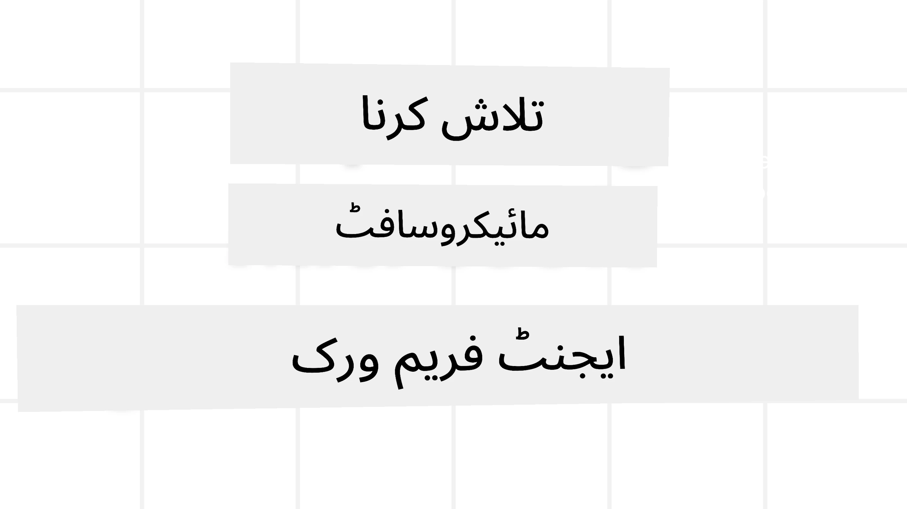

# مائیکروسافٹ ایجنٹ فریم ورک کا جائزہ



### تعارف

اس سبق میں یہ موضوعات شامل ہوں گے:

- مائیکروسافٹ ایجنٹ فریم ورک کو سمجھنا: کلیدی خصوصیات اور قدر  
- مائیکروسافٹ ایجنٹ فریم ورک کے کلیدی تصورات کی جانچ
- اعلیٰ سطحی MAF پیٹرنز: ورک فلو، مڈل ویئر، اور میموری

## سیکھنے کے اہداف

اس سبق کو مکمل کرنے کے بعد، آپ جان پائیں گے کہ کیسے:

- پروڈکشن کے لیے تیار AI ایجنٹس بنانا مائیکروسافٹ ایجنٹ فریم ورک استعمال کرتے ہوئے
- اپنے ایجینٹک استعمال کے معاملات میں مائیکروسافٹ ایجنٹ فریم ورک کی بنیادی خصوصیات کا اطلاق کرنا
- ورک فلو، مڈل ویئر، اور آبزرویبیلٹی سمیت اعلیٰ سطحی پیٹرنز کا استعمال

## کوڈ کے نمونے 

اس ریپوزیٹری میں [Microsoft Agent Framework (MAF)](https://aka.ms/ai-agents-beginners/agent-framewrok) کے کوڈ کے نمونے `xx-python-agent-framework` اور `xx-dotnet-agent-framework` فائلوں کے تحت مل سکتے ہیں۔

## مائیکروسافٹ ایجنٹ فریم ورک کو سمجھنا


[Microsoft Agent Framework (MAF)](https://aka.ms/ai-agents-beginners/agent-framewrok) مائیکروسافٹ کا ایک متحدہ فریم ورک ہے جو AI ایجنٹس بنانے کے لیے ہے۔ یہ پروڈکشن اور تحقیقاتی ماحول میں دیکھے جانے والے مختلف ایجنٹک استعمال کے معاملات کو حل کرنے کی لچک پیش کرتا ہے، بشمول:

- **ترتیبی ایجنٹ آرکیسٹریشن** ایسے منظرناموں میں جہاں قدم بہ قدم ورک فلو کی ضرورت ہو۔
- **ہم وقت ساز آرکیسٹریشن** ایسے منظرناموں میں جہاں ایجنٹس ایک ہی وقت میں کام مکمل کریں۔
- **گروپ چیٹ آرکیسٹریشن** ایسے منظرناموں میں جہاں ایجنٹس ایک ہی کام پر مل کر تعاون کر سکتے ہوں۔
- **ہینڈ آف آرکیسٹریشن** ایسے منظرناموں میں جہاں ذیلی کام مکمل ہونے پر ایجنٹس ایک دوسرے کو کام منتقل کریں۔
- **میگنیٹک آرکیسٹریشن** ایسے منظرناموں میں جہاں ایک مینیجر ایجنٹ ٹاسک لسٹ بناتا اور تبدیل کرتا ہے اور سب ایجنٹس کی ہم آہنگی کو سنبھالتا ہے تاکہ کام مکمل ہو۔

پروڈکشن میں AI ایجنٹس فراہم کرنے کے لیے، MAF میں درج ذیل خصوصیات بھی شامل ہیں:

- **آبزرویبیلٹی** OpenTelemetry کے استعمال کے ذریعے جہاں AI ایجنٹ کا ہر عمل، بشمول ٹول کال، آرکیسٹریشن مراحل، استدلال کے بہاؤ، اور Microsoft Foundry ڈیش بورڈز کے ذریعے کارکردگی کی نگرانی شامل ہے۔
- **سیکورٹی** Microsoft Foundry پر ایجنٹس کو مقامی طور پر ہوسٹ کر کے، جس میں رول بیسڈ ایکسس، نجی ڈیٹا کی ہینڈلنگ، اور بلٹ ان مواد کی حفاظت جیسے سیکیورٹی کنٹرولز شامل ہیں۔
- **دوامیّت** کیونکہ ایجنٹ تھریڈز اور ورک فلو وقفہ، بحال، اور غلطیوں سے بحالی کر سکتے ہیں، جو طویل عرصے تک چلنے والے عمل کو ممکن بناتا ہے۔
- **کنٹرول** چونکہ ہومن ان دی لوپ ورک فلو کو سپورٹ کیا جاتا ہے جہاں کاموں کو انسانی منظوری درکار نشان زد کیا جاتا ہے۔

مائیکروسافٹ ایجنٹ فریم ورک کا ایک اور اہم مقصد آپس میں انٹرآپریبل ہونا بھی ہے، جس کے ذریعے:

- **کلاؤڈ غیرجانبدار** - ایجنٹس کنٹینرز میں، آن-پریمائز اور مختلف کلاؤڈز میں چل سکتے ہیں۔
- **پروائیڈر غیرجانبدار** - ایجنٹس آپ کے پسندیدہ SDK کے ذریعے بنائے جا سکتے ہیں بشمول Azure OpenAI اور OpenAI
- **اوپن اسٹینڈرڈز کا انضمام** - ایجنٹس Agent-to-Agent(A2A) اور Model Context Protocol (MCP) جیسے پروٹوکول استعمال کر کے دوسرے ایجنٹس اور ٹولز کو دریافت اور استعمال کر سکتے ہیں۔
- **پلگ ان اور کنیکٹرز** - Microsoft Fabric، SharePoint، Pinecone اور Qdrant جیسے ڈیٹا اور میموری سروسز سے کنکشن بنائے جا سکتے ہیں۔

آئیں دیکھتے ہیں کہ یہ خصوصیات مائیکروسافٹ ایجنٹ فریم ورک کے کچھ بنیادی تصورات پر کیسے لاگو ہوتی ہیں۔

## مائیکروسافٹ ایجنٹ فریم ورک کے کلیدی تصورات

### ایجنٹس


**ایجنٹس بنانا**

ایجنٹ کی تخلیق inference service (LLM Provider)، AI ایجنٹ کے لیے پیروی کرنے کے لیے ہدایات کے ایک سیٹ، اور ایک مختص `name` کی تعریف کر کے کی جاتی ہے:

```python
agent = AzureOpenAIChatClient(credential=AzureCliCredential()).create_agent( instructions="You are good at recommending trips to customers based on their preferences.", name="TripRecommender" )
```

اوپر `Azure OpenAI` استعمال ہو رہا ہے لیکن ایجنٹس مختلف سروسز استعمال کر کے بنائے جا سکتے ہیں جن میں `Microsoft Foundry Agent Service` بھی شامل ہے:

```python
AzureAIAgentClient(async_credential=credential).create_agent( name="HelperAgent", instructions="You are a helpful assistant." ) as agent
```

OpenAI `Responses`, `ChatCompletion` APIs

```python
agent = OpenAIResponsesClient().create_agent( name="WeatherBot", instructions="You are a helpful weather assistant.", )
```

```python
agent = OpenAIChatClient().create_agent( name="HelpfulAssistant", instructions="You are a helpful assistant.", )
```

یا A2A پروٹوکول استعمال کرنے والے ریموٹ ایجنٹس:

```python
agent = A2AAgent( name=agent_card.name, description=agent_card.description, agent_card=agent_card, url="https://your-a2a-agent-host" )
```

**ایجنٹس چلانا**

ایجنٹس کو نان-اسٹریمنگ یا اسٹریمنگ جوابات کے لیے `.run` یا `.run_stream` میتھڈز استعمال کر کے چلایا جاتا ہے۔

```python
result = await agent.run("What are good places to visit in Amsterdam?")
print(result.text)
```

```python
async for update in agent.run_stream("What are the good places to visit in Amsterdam?"):
    if update.text:
        print(update.text, end="", flush=True)

```

ہر ایجنٹ رن میں آپشنز شامل ہو سکتے ہیں تاکہ ایسے پیرامیٹرز کی تخصیص کی جا سکے جیسے ایجنٹ کی جانب سے استعمال ہونے والا `max_tokens`، وہ `tools` جو ایجنٹ کال کر سکتا ہے، اور یہاں تک کہ ایجنٹ کے لیے استعمال ہونے والا `model` خود۔

یہ ان صورتوں میں مفید ہے جہاں کسی صارف کے کام کو مکمل کرنے کے لیے مخصوص ماڈلز یا ٹولز درکار ہوں۔

**ٹولز**

ٹولز کو ایجنٹ کی تعریف کے وقت بھی مقرر کیا جا سکتا ہے:

```python
def get_attractions( location: Annotated[str, Field(description="The location to get the top tourist attractions for")], ) -> str: """Get the top tourist attractions for a given location.""" return f"The top attractions for {location} are." 


# جب براہِ راست ChatAgent بناتے وقت

agent = ChatAgent( chat_client=OpenAIChatClient(), instructions="You are a helpful assistant", tools=[get_attractions]

```

اور ایجنٹ چلانے کے وقت بھی:

```python

result1 = await agent.run( "What's the best place to visit in Seattle?", tools=[get_attractions] # صرف اس رن کے لیے فراہم کردہ آلہ )
```

**ایجنٹ تھریڈز**

ایجنٹ تھریڈز ملٹی ٹرن گفتگو کو سنبھالنے کے لیے استعمال ہوتے ہیں۔ تھریڈز مندرجہ ذیل طریقوں سے بنائے جا سکتے ہیں:

- `get_new_thread()` کا استعمال جو تھریڈ کو وقت کے ساتھ محفوظ کرنے کے قابل بناتا ہے
- ایجنٹ چلانے پر خود بخود تھریڈ بنانا اور تھریڈ کو صرف موجودہ رن کے دوران برقرار رکھنا۔

تھریڈ بنانے کے لیے، کوڈ ایسا دکھتا ہے:

```python
# ایک نیا تھریڈ بنائیں۔
thread = agent.get_new_thread() # ایجنٹ کو تھریڈ کے ساتھ چلائیں۔
response = await agent.run("Hello, I am here to help you book travel. Where would you like to go?", thread=thread)

```

آپ پھر تھریڈ کو سیریلائز کر کے بعد ازاں استعمال کے لیے اسٹور کر سکتے ہیں:

```python
# ایک نیا تھریڈ بنائیں۔
thread = agent.get_new_thread() 

# ایجنٹ کو تھریڈ کے ساتھ چلائیں۔

response = await agent.run("Hello, how are you?", thread=thread) 

# تھریڈ کو ذخیرہ کے لیے سیریلائز کریں۔

serialized_thread = await thread.serialize() 

# ذخیرہ سے لوڈ کرنے کے بعد تھریڈ کی حالت کو ڈی سیریلائز کریں۔

resumed_thread = await agent.deserialize_thread(serialized_thread)
```

**ایجنٹ مڈل ویئر**

ایجنٹس ٹولز اور LLMs کے ساتھ بات چیت کرتے ہیں تاکہ صارف کے کام مکمل ہوں۔ بعض منظرناموں میں ہم ان تعاملات کے دوران کچھ عمل انجام دینا یا ٹریک کرنا چاہتے ہیں۔ ایجنٹ مڈل ویئر ہمیں یہ کرنے کے قابل بناتا ہے:

*فنکشن مڈل ویئر*

یہ مڈل ویئر ہمیں ایجنٹ اور اس فنکشن/ٹول کے درمیان کوئی عمل انجام دینے کی اجازت دیتا ہے جسے وہ کال کرے گا۔ اس کا ایک مثال جب استعمال ہوگا جب آپ فنکشن کال پر کچھ لاگنگ کرنا چاہیں۔

نیچے کے کوڈ میں `next` یہ متعین کرتا ہے کہ اگلا مڈل ویئر یا اصل فنکشن کال ہونا چاہیے۔

```python
async def logging_function_middleware(
    context: FunctionInvocationContext,
    next: Callable[[FunctionInvocationContext], Awaitable[None]],
) -> None:
    """Function middleware that logs function execution."""
    # پری-پروسیسنگ: فنکشن کے نفاذ سے پہلے لاگ کریں
    print(f"[Function] Calling {context.function.name}")

    # اگلے مڈل ویئر یا فنکشن کے نفاذ کی طرف آگے بڑھیں
    await next(context)

    # پوسٹ-پروسیسنگ: فنکشن کے نفاذ کے بعد لاگ کریں
    print(f"[Function] {context.function.name} completed")
```

*چیٹ مڈل ویئر*

یہ مڈل ویئر ایجنٹ اور LLM کے درمیان درخواستوں کے درمیان کوئی عمل انجام دینے یا لاگ کرنے کی اجازت دیتا ہے۔

اس میں ایسی اہم معلومات شامل ہوتی ہیں جیسے AI سروس کو بھیجے جانے والے `messages`۔

```python
async def logging_chat_middleware(
    context: ChatContext,
    next: Callable[[ChatContext], Awaitable[None]],
) -> None:
    """Chat middleware that logs AI interactions."""
    # پری پروسیسنگ: AI کال سے پہلے لاگ کریں
    print(f"[Chat] Sending {len(context.messages)} messages to AI")

    # اگلے مڈل ویئر یا AI سروس پر جاری رکھیں
    await next(context)

    # پوسٹ پروسیسنگ: AI کے جواب کے بعد لاگ کریں
    print("[Chat] AI response received")

```

**ایجنٹ میموری**

جیسا کہ `Agentic Memory` سبق میں بیان ہوا، میموری مختلف سیاق و سباق میں ایجنٹ کو کام کرنے کے قابل بنانے کے لیے ایک اہم عنصر ہے۔ MAF کئی مختلف قسم کی میموری پیش کرتا ہے:

*ان میموری اسٹوریج*

یہ وہ میموری ہے جو ایپلیکیشن کے رن ٹائم کے دوران تھریڈز میں محفوظ ہوتی ہے۔

```python
# ایک نیا تھریڈ بنائیں۔
thread = agent.get_new_thread() # ایجنٹ کو اس تھریڈ کے ساتھ چلائیں۔
response = await agent.run("Hello, I am here to help you book travel. Where would you like to go?", thread=thread)
```

*پائیدار پیغامات*

یہ میموری مختلف سیشنز کے ذریعے گفتگو کی تاریخ محفوظ کرنے کے لیے استعمال ہوتی ہے۔ اسے `chat_message_store_factory` کے ذریعے تعریف کیا جاتا ہے:

```python
from agent_framework import ChatMessageStore

# پیغامات کا حسبِ ضرورت ذخیرہ بنائیں
def create_message_store():
    return ChatMessageStore()

agent = ChatAgent(
    chat_client=OpenAIChatClient(),
    instructions="You are a Travel assistant.",
    chat_message_store_factory=create_message_store
)

```

*ڈائنامک میموری*

یہ میموری ایجنٹس چلانے سے پہلے کانٹیکسٹ میں شامل کی جاتی ہے۔ یہ میموریز بیرونی سروسز جیسے mem0 میں اسٹور کی جا سکتی ہیں:

```python
from agent_framework.mem0 import Mem0Provider

# پیشرفتہ میموری صلاحیتوں کے لیے Mem0 کا استعمال
memory_provider = Mem0Provider(
    api_key="your-mem0-api-key",
    user_id="user_123",
    application_id="my_app"
)

agent = ChatAgent(
    chat_client=OpenAIChatClient(),
    instructions="You are a helpful assistant with memory.",
    context_providers=memory_provider
)

```

**ایجنٹ آبزرویبیلٹی**

قابلِ مشاہدہ پن قابلِ اعتماد اور قابلِ برقرار رکھنے والے ایجنٹ نظام بنانے کے لیے اہم ہے۔ MAF بہتر آبزرویبیلٹی کے لیے ٹریسنگ اور میٹرز فراہم کرنے کے لیے OpenTelemetry کے ساتھ مربوط ہوتا ہے۔

```python
from agent_framework.observability import get_tracer, get_meter

tracer = get_tracer()
meter = get_meter()
with tracer.start_as_current_span("my_custom_span"):
    # کچھ کریں
    pass
counter = meter.create_counter("my_custom_counter")
counter.add(1, {"key": "value"})
```

### ورک فلو

MAF ایسے ورک فلو پیش کرتا ہے جو کسی کام کو مکمل کرنے کے لیے پہلے سے متعین شدہ مراحل ہوتے ہیں اور ان مراحل میں AI ایجنٹس کو بطور اجزاء شامل کیا جاتا ہے۔

ورک فلو مختلف اجزاء پر مشتمل ہوتے ہیں جو بہتر کنٹرول فلو کی اجازت دیتے ہیں۔ ورک فلو **ملٹی-ایجنٹ آرکیسٹریشن** اور ورک فلو حالتوں کو محفوظ کرنے کے لیے **چیک پوائنٹنگ** کو بھی ممکن بناتے ہیں۔

ورک فلو کے بنیادی اجزاء یہ ہیں:

**ایگزیکیٹرز**

ایگزیکیٹرز انپٹ پیغامات وصول کرتے ہیں، اپنے متعین کیے گئے کام انجام دیتے ہیں، اور پھر ایک آؤٹ پٹ پیغام پیدا کرتے ہیں۔ یہ ورک فلو کو بڑے کام کی تکمیل کی طرف آگے بڑھاتا ہے۔ ایگزیکیٹرز یا تو AI ایجنٹ ہو سکتے ہیں یا حسبِ ضرورت لاجک۔

**ایجز**

ایجز ورک فلو میں پیغامات کے بہاؤ کی تعریف کرنے کے لیے استعمال ہوتے ہیں۔ یہ درج ذیل ہو سکتے ہیں:

*ڈائریکٹ ایجز* - ایگزیکیٹرز کے درمیان سادہ ایک سے ایک کنکشن:

```python
from agent_framework import WorkflowBuilder

builder = WorkflowBuilder()
builder.add_edge(source_executor, target_executor)
builder.set_start_executor(source_executor)
workflow = builder.build()
```

*مشروط ایجز* - جب ایک خاص شرط پوری ہو تو فعال ہوتے ہیں۔ مثال کے طور پر، جب ہوٹل کے کمروں کی دستیابی نہ ہو تو ایک ایگزیکیٹر دیگر اختیارات تجویز کر سکتا ہے۔

*سوئچ-کیس ایجز* - پیغامات کو متعین کردہ شرائط کی بنیاد پر مختلف ایگزیکیٹرز کی طرف بھیجیں۔ مثال کے طور پر، اگر ٹریول کسٹمر کو ترجیحی رسائی ہے تو ان کے کام کسی اور ورک فلو کے ذریعے سنبھالے جائیں گے۔

*فین-آؤٹ ایجز* - ایک پیغام کو متعدد اہداف کو بھیجیں۔

*فین-اِن ایجز* - مختلف ایگزیکیٹرز سے متعدد پیغامات جمع کریں اور ایک ہدف کو بھیجیں۔

**ایونٹس**

ورک فلو میں بہتر آبزرویبیلٹی فراہم کرنے کے لیے، MAF عمل درآمد کے لیے بلٹ ان ایونٹس پیش کرتا ہے جن میں شامل ہیں:

- `WorkflowStartedEvent`  - ورک فلو کا عمل شروع ہوتا ہے
- `WorkflowOutputEvent` - ورک فلو ایک آؤٹ پٹ پیدا کرتا ہے
- `WorkflowErrorEvent` - ورک فلو کو ایک خرابی کا سامنا ہوتا ہے
- `ExecutorInvokeEvent`  - ایگزیکیٹر پروسیسنگ شروع کرتا ہے
- `ExecutorCompleteEvent`  -  ایگزیکیٹر پروسیسنگ مکمل کرتا ہے
- `RequestInfoEvent` - ایک درخواست جاری کی جاتی ہے

## اعلیٰ سطحی MAF پیٹرنز

اوپر کے حصے مائیکروسافٹ ایجنٹ فریم ورک کے کلیدی تصورات کا احاطہ کرتے ہیں۔ جب آپ مزید پیچیدہ ایجنٹس بنائیں گے، تو غور کے لیے یہاں کچھ اعلیٰ سطحی پیٹرنز ہیں:

- **مڈل ویئر کمپوزیشن**: فنکشن اور چیٹ مڈل ویئر استعمال کرتے ہوئے متعدد مڈل ویئر ہینڈلرز (لاگنگ، تصدیق، ریٹ-لیمٹنگ) چین کریں تاکہ ایجنٹ کے رویے پر نفیس کنٹرول حاصل ہو۔
- **ورک فلو چیک پوائنٹنگ**: ورک فلو ایونٹس اور سیریلائزیشن کا استعمال کر کے طویل عرصے تک چلنے والے ایجنٹ کے عمل کو محفوظ اور دوبارہ شروع کریں۔
- **ڈائنامک ٹول سلیکشن**: ٹول کی وضاحتوں پر RAG کو MAF کی ٹول رجسٹریشن کے ساتھ ملا کر ہر کوئری کے لیے صرف متعلقہ ٹولز پیش کریں۔
- **ملٹی-ایجنٹ ہینڈ آف**: مخصوص ایجنٹس کے درمیان ہینڈ آف کو منظم کرنے کے لیے ورک فلو ایجز اور مشروط روٹنگ کا استعمال کریں۔

## کوڈ کے نمونے 

اس ریپوزیٹری میں مائیکروسافٹ ایجنٹ فریم ورک کے کوڈ کے نمونے `xx-python-agent-framework` اور `xx-dotnet-agent-framework` فائلوں کے تحت مل سکتے ہیں۔

## کیا آپ کو مائیکروسافٹ ایجنٹ فریم ورک کے بارے میں مزید سوالات ہیں؟

دوسرے سیکھنے والوں سے ملنے، آفس آورز میں شرکت کرنے اور اپنے AI ایجنٹس کے سوالات کے جواب حاصل کرنے کے لیے [Microsoft Foundry Discord](https://aka.ms/ai-agents/discord) میں شامل ہوں۔

---

<!-- CO-OP TRANSLATOR DISCLAIMER START -->
دستبرداری:
یہ دستاویز AI ترجمہ سروس [Co-op Translator](https://github.com/Azure/co-op-translator) کے ذریعے ترجمہ کی گئی ہے۔ ہم درستگی کے لیے کوشاں ہیں، تاہم براہِ کرم نوٹ کریں کہ خودکار تراجم میں غلطیاں یا عدم درستیاں ہو سکتی ہیں۔ اصل دستاویز اس کی مادری زبان میں ہی معتبر ماخذ سمجھی جانی چاہیے۔ اہم معلومات کے لیے پیشہ ور انسانی ترجمانی کی سفارش کی جاتی ہے۔ اس ترجمے کے استعمال سے پیدا ہونے والی کسی بھی غلط فہمی یا غلط تعبیر کے لیے ہم ذمہ دار نہیں ہیں۔
<!-- CO-OP TRANSLATOR DISCLAIMER END -->