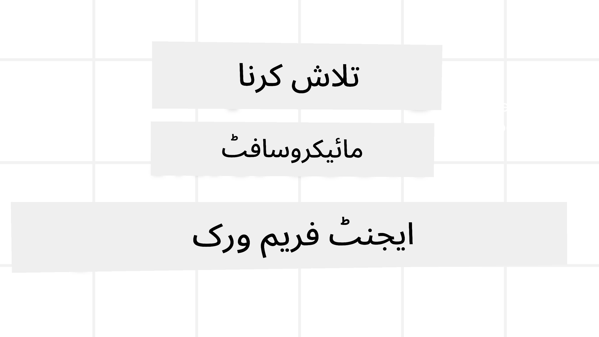
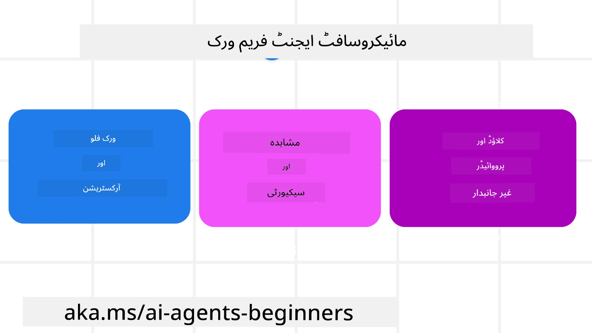
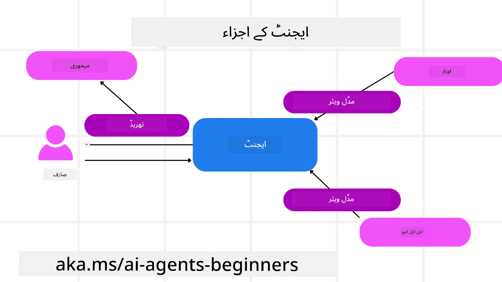

# مائیکروسافٹ ایجنٹ فریم ورک کی تلاش



### تعارف

یہ سبق درج ذیل موضوعات کا احاطہ کرے گا:

- مائیکروسافٹ ایجنٹ فریم ورک کو سمجھنا: اہم خصوصیات اور قدر  
- مائیکروسافٹ ایجنٹ فریم ورک کے کلیدی تصورات کی تلاش
- جدید MAF پیٹرن: ورک فلو، مڈل ویئر، اور میموری

## سیکھنے کے مقاصد

اس سبق کو مکمل کرنے کے بعد، آپ جان سکیں گے کہ:

- مائیکروسافٹ ایجنٹ فریم ورک کا استعمال کرتے ہوئے پروڈکشن کے لیے تیار AI ایجنٹس بنائیں
- مائیکروسافٹ ایجنٹ فریم ورک کی بنیادی خصوصیات کو اپنی ایجنٹک استعمال کے کیسز پر لاگو کریں
- ورک فلو، مڈل ویئر، اور آبزرویبلٹی جیسے جدید پیٹرن کا استعمال کریں

## کوڈ کے نمونے

[مائیکروسافٹ ایجنٹ فریم ورک (MAF)](https://learn.microsoft.com/en-us/agent-framework/overview/?wt.mc_id=youtube_26688_organicsocial_reactor&pivots=programming-language-python) کے کوڈ کے نمونے اس ریپوزٹری میں `xx-python-agent-framework` اور `xx-dotnet-agent-framework` فائلوں کے تحت مل سکتے ہیں۔

## مائیکروسافٹ ایجنٹ فریم ورک کو سمجھنا



[مائیکروسافٹ ایجنٹ فریم ورک (MAF)](https://learn.microsoft.com/en-us/agent-framework/overview/?wt.mc_id=youtube_26688_organicsocial_reactor&pivots=programming-language-python) مائیکروسافٹ کا متحدہ فریم ورک ہے جو AI ایجنٹس بنانے کے لیے ہے۔ یہ مختلف قسم کے ایجنٹک استعمال کے معاملات کو حل کرنے کے لیے لچک فراہم کرتا ہے جو پروڈکشن اور تحقیق دونوں ماحول میں دیکھے جاتے ہیں، جن میں شامل ہیں:

- **تسلسلی ایجنٹ کوآرڈینیشن** ایسے منظرناموں میں جہاں مرحلہ وار ورک فلو کی ضرورت ہو۔
- **ہم وقت سازی کوآرڈینیشن** ایسے منظرناموں میں جہاں ایجنٹس کو ایک ساتھ کام مکمل کرنا ہو۔
- **گروپ چیٹ کوآرڈینیشن** ایسے منظرناموں میں جہاں ایجنٹس ایک ساتھ مل کر ایک کام پر کام کر سکتے ہوں۔
- **ہینڈ آف کوآرڈینیشن** ایسے منظرناموں میں جہاں ایجنٹس ذیلی کام مکمل ہوتے ہی کام ایک دوسرے کو منتقل کرتے ہیں۔
- **مقناطیسی کوآرڈینیشن** ایسے منظرناموں میں جہاں ایک مینیجر ایجنٹ ٹاسک فہرست تیار اور ترمیم کرتا ہے اور ذیلی ایجنٹس کی ہم آہنگی کا انتظام کرتا ہے تاکہ کام مکمل ہو۔

پروڈکشن میں AI ایجنٹس فراہم کرنے کے لیے، MAF میں درج ذیل خصوصیات بھی شامل ہیں:

- **آبزرویبلٹی** اوپن ٹیلی میٹری کے استعمال کے ذریعے جہاں AI ایجنٹ کے ہر عمل بشمول ٹول کال، کوآرڈینیشن کے مراحل، معقولیت کے بہاؤ، اور مائیکروسافٹ فاؤنڈری ڈیش بورڈز کے ذریعے کارکردگی کی نگرانی شامل ہے۔
- **سیکورٹی** مائیکروسافٹ فاؤنڈری پر ایجنٹس کو مقامی طور پر ہوسٹ کر کے، جس میں رول پر مبنی رسائی، نجی ڈیٹا کی ہینڈلنگ، اور بلٹ ان مواد کی حفاظت جیسے سکیورٹی کنٹرولز شامل ہیں۔
- **دوام** کیونکہ ایجنٹ تھریڈز اور ورک فلو وقفہ، دوبارہ شروع اور غلطیوں سے بحالی کر سکتے ہیں جو طویل عرصے تک چلنے والے عمل کو ممکن بناتا ہے۔
- **کنٹرول** کیونکہ انسان کے مداخلتی ورک فلو کی حمایت کی جاتی ہے جہاں کام انسانی منظوری کی ضرورت کے طور پر نشان زد کیے جاتے ہیں۔

مائیکروسافٹ ایجنٹ فریم ورک انٹرآپریبل ہونے پر بھی مرکوز ہے:

- **کلاؤڈ سے آزاد** - ایجنٹس کنٹینرز میں، آن-پریم، اور متعدد مختلف کلاؤڈز پر چل سکتے ہیں۔
- **پرووائیڈر سے آزاد** - ایجنٹس آپ کی پسندیدہ SDK جیسے Azure OpenAI اور OpenAI کے ذریعے بنائے جا سکتے ہیں۔
- **اوپن اسٹینڈرڈز کو مربوط کرنا** - ایجنٹس پروٹوکولز جیسے Agent-to-Agent(A2A) اور Model Context Protocol (MCP) کا استعمال کر کے دوسرے ایجنٹس اور ٹولز کو دریافت اور استعمال کر سکتے ہیں۔
- **پلگ انز اور کنیکٹرز** - کنکشنز ڈیٹا اور میموری سروسز جیسے مائیکروسافٹ فیبرک، شیرپوائنٹ، پائنکون، اور کیوڈرانٹ سے بنائے جا سکتے ہیں۔

آئیے دیکھتے ہیں کہ یہ خصوصیات مائیکروسافٹ ایجنٹ فریم ورک کے کچھ کلیدی تصورات پر کیسے لاگو ہوتی ہیں۔

## مائیکروسافٹ ایجنٹ فریم ورک کے کلیدی تصورات

### ایجنٹس



**ایجنٹس بنانا**

ایجنٹ کی تخلیق اس بات کی تعریف کرنے سے ہوتی ہے کہ انفرنس سروس (LLM پرووائیڈر) کیا ہے، ایک ہدایتی سیٹ ہے جس پر AI ایجنٹ عمل کرے گا، اور ایک تفویض کردہ `name`:


```python
agent = AzureOpenAIChatClient(credential=AzureCliCredential()).create_agent( instructions="You are good at recommending trips to customers based on their preferences.", name="TripRecommender" )
```

اوپر Azure OpenAI کا استعمال دکھایا گیا ہے لیکن مختلف خدمات استعمال کر کے ایجنٹس بنائے جا سکتے ہیں جن میں `Microsoft Foundry Agent Service` شامل ہے:

```python
AzureAIAgentClient(async_credential=credential).create_agent( name="HelperAgent", instructions="You are a helpful assistant." ) as agent
```

OpenAI کے `Responses`, `ChatCompletion` APIs

```python
agent = OpenAIResponsesClient().create_agent( name="WeatherBot", instructions="You are a helpful weather assistant.", )
```

```python
agent = OpenAIChatClient().create_agent( name="HelpfulAssistant", instructions="You are a helpful assistant.", )
```

یا [MiniMax](https://platform.minimaxi.com/)، جو OpenAI-compatible API مہیا کرتا ہے جس میں بڑے کانٹیکسٹ ونڈوز (204K ٹوکن تک) شامل ہیں:

```python
agent = OpenAIChatClient(base_url="https://api.minimax.io/v1", api_key=os.environ["MINIMAX_API_KEY"], model_id="MiniMax-M3").create_agent( name="HelpfulAssistant", instructions="You are a helpful assistant.", )
```

یا A2A پروٹوکول کے ذریعے ریموٹ ایجنٹس:

```python
agent = A2AAgent( name=agent_card.name, description=agent_card.description, agent_card=agent_card, url="https://your-a2a-agent-host" )
```

**ایجنٹس چلانا**

ایجنٹس کو `.run` یا `.run_stream` میتھڈز کے ذریعے چلایا جاتا ہے، چاہے ان کا جواب غیر رسا یا رسا ہو۔

```python
result = await agent.run("What are good places to visit in Amsterdam?")
print(result.text)
```

```python
async for update in agent.run_stream("What are the good places to visit in Amsterdam?"):
    if update.text:
        print(update.text, end="", flush=True)

```

ہر ایجنٹ کے چلانے کے لیے آپشنز بھی ہو سکتے ہیں تاکہ ایجنٹ کے استعمال شدہ `max_tokens`، ایجنٹ کے قابل کال `tools`، اور یہاں تک کہ استعمال شدہ `model` کی تخصیص کی جا سکے۔

یہ ایسے معاملات میں مفید ہے جہاں صارف کا کام مکمل کرنے کے لیے مخصوص ماڈلز یا ٹولز کی ضرورت ہوتی ہے۔

**ٹولز**

ٹولز کو ایجنٹ کی تعریف کرتے وقت بھی مقرر کیا جا سکتا ہے:

```python
def get_attractions( location: Annotated[str, Field(description="The location to get the top tourist attractions for")], ) -> str: """Get the top tourist attractions for a given location.""" return f"The top attractions for {location} are." 


# جب براہ راست ChatAgent بنایا جائے

agent = ChatAgent( chat_client=OpenAIChatClient(), instructions="You are a helpful assistant", tools=[get_attractions]

```

اور ایجنٹ کو چلانے کے وقت بھی:

```python

result1 = await agent.run( "What's the best place to visit in Seattle?", tools=[get_attractions] # صرف اس چلانے کے لیے فراہم کردہ ٹول )
```

**ایجنٹ تھریڈز**

ایجنٹ تھریڈز متعدد چکر والی بات چیت کو سنبھالنے کے لیے استعمال ہوتے ہیں۔ تھریڈز کو یا تو اس طرح بنایا جا سکتا ہے:

- `get_new_thread()` کا استعمال جو وقت کے ساتھ تھریڈ کو محفوظ کرنے کی اجازت دیتا ہے
- ایجنٹ چلانے کے وقت خودکار طور پر تھریڈ بنانا جو صرف موجودہ رن کے دوران رہے۔

تھریڈ بنانے کے لیے کوڈ کچھ یوں ہوتا ہے:

```python
# نیا تھریڈ بنائیں۔
thread = agent.get_new_thread() # ایجنٹ کو تھریڈ کے ساتھ چلائیں۔
response = await agent.run("Hello, I am here to help you book travel. Where would you like to go?", thread=thread)

```

پھر آپ تھریڈ کو بعد میں استعمال کے لیے سیریلائز کر سکتے ہیں:

```python
# ایک نیا تھریڈ بنائیں۔
thread = agent.get_new_thread() 

# تھریڈ کے ساتھ ایجنٹ چلائیں۔

response = await agent.run("Hello, how are you?", thread=thread) 

# اسٹوریج کے لیے تھریڈ کو سیریلائز کریں۔

serialized_thread = await thread.serialize() 

# اسٹوریج سے لوڈ کرنے کے بعد تھریڈ کی حالت کو ڈی سیریلائز کریں۔

resumed_thread = await agent.deserialize_thread(serialized_thread)
```

**ایجنٹ مڈل ویئر**

ایجنٹس ٹولز اور LLMs کے ساتھ صارف کے کام مکمل کرنے کے لیے تعامل کرتے ہیں۔ بعض صورتوں میں، ہم چاہتے ہیں کہ ان تعاملات کے درمیان کچھ عمل یا ٹریکنگ ہو۔ ایجنٹ مڈل ویئر ہمیں یہ کرنے کے قابل بناتا ہے:

*فنکشن مڈل ویئر*

یہ مڈل ویئر ہمیں ایجنٹ اور کسی فنکشن/ٹول کے درمیان عمل کرنے کی اجازت دیتا ہے جسے ایجنٹ کال کرے گا۔ مثال کے طور پر، آپ فنکشن کال پر لاگنگ کرنا چاہیں۔

نیچے کوڈ میں `next` بتاتا ہے کہ اگلا مڈل ویئر کال کیا جائے یا اصل فنکشن۔

```python
async def logging_function_middleware(
    context: FunctionInvocationContext,
    next: Callable[[FunctionInvocationContext], Awaitable[None]],
) -> None:
    """Function middleware that logs function execution."""
    # پیش_عملی: فنکشن چلانے سے پہلے لاگ کریں
    print(f"[Function] Calling {context.function.name}")

    # اگلے مڈل ویئر یا فنکشن کے اجرا پر جاری رکھیں
    await next(context)

    # بعد_عملی: فنکشن چلانے کے بعد لاگ کریں
    print(f"[Function] {context.function.name} completed")
```

*چیٹ مڈل ویئر*

یہ مڈل ویئر ایجنٹ اور LLM کے درمیان درخواستوں کے درمیان عمل کرنے یا لاگ کرنے کی اجازت دیتا ہے۔

اس میں اہم معلومات شامل ہوتی ہیں جیسے AI سروس کو بھیجے جانے والے `messages`۔

```python
async def logging_chat_middleware(
    context: ChatContext,
    next: Callable[[ChatContext], Awaitable[None]],
) -> None:
    """Chat middleware that logs AI interactions."""
    # تیارکاری سے پہلے: AI کال سے پہلے لاگ کریں
    print(f"[Chat] Sending {len(context.messages)} messages to AI")

    # اگلے مڈل ویئر یا AI سروس پر جاری رکھیں
    await next(context)

    # بعد از عمل کاری: AI جواب کے بعد لاگ کریں
    print("[Chat] AI response received")

```

**ایجنٹ میموری**

جیسا کہ `Agentic Memory` سبق میں شامل کیا گیا ہے، یادداشت ایک اہم عنصر ہے جو ایجنٹ کو مختلف سیاق و سباق میں کام کرنے کے قابل بناتی ہے۔ MAF کئی قسم کی یادداشتیں فراہم کرتا ہے:

*میموری میں اسٹوریج*

یہ یادداشت ایپلیکیشن کے رن ٹائم کے دوران تھریڈز میں محفوظ ہوتی ہے۔

```python
# ایک نئی تھریڈ بنائیں۔
thread = agent.get_new_thread() # ایجنٹ کو تھریڈ کے ساتھ چلائیں۔
response = await agent.run("Hello, I am here to help you book travel. Where would you like to go?", thread=thread)
```

*مستقل پیغامات*

یہ یادداشت مختلف سیشنز میں گفتگو کی تاریخ محفوظ کرنے کے لیے استعمال ہوتی ہے۔ اسے `chat_message_store_factory` کے ذریعے متعین کیا جاتا ہے:

```python
from agent_framework import ChatMessageStore

# ایک حسب ضرورت پیغام اسٹور بنائیں
def create_message_store():
    return ChatMessageStore()

agent = ChatAgent(
    chat_client=OpenAIChatClient(),
    instructions="You are a Travel assistant.",
    chat_message_store_factory=create_message_store
)

```

*متحرک یادداشت*

یہ یادداشت سیاق و سباق میں شامل کی جاتی ہے اس سے پہلے کہ ایجنٹس چلائے جائیں۔ یہ یادداشت خارجی خدمات میں محفوظ کی جا سکتی ہے جیسے mem0:

```python
from agent_framework.mem0 import Mem0Provider

# Mem0 کا استعمال جدید میموری کی صلاحیتوں کے لئے
memory_provider = Mem0Provider(
    api_key="your-mem0-api-key",
    user_id="user_123",
    application_id="my_app"
)

agent = ChatAgent(
    chat_client=OpenAIChatClient(),
    instructions="You are a helpful assistant with memory.",
    context_providers=memory_provider
)

```

**ایجنٹ آبزرویبلٹی**

آبزرویبلٹی قابل اعتماد اور برقرار رکھنے والے ایجنٹک نظام بنانے کے لیے اہم ہے۔ MAF OpenTelemetry کے ساتھ انضمام کرتا ہے تاکہ بہتر آبزرویبلٹی کے لیے ٹریسنگ اور میٹر فراہم کی جا سکے۔

```python
from agent_framework.observability import get_tracer, get_meter

tracer = get_tracer()
meter = get_meter()
with tracer.start_as_current_span("my_custom_span"):
    # کچھ کرو
    pass
counter = meter.create_counter("my_custom_counter")
counter.add(1, {"key": "value"})
```

### ورک فلو

MAF ورک فلو فراہم کرتا ہے جو کہ پہلے سے متعین مرحلے ہوتے ہیں تاکہ ایک کام مکمل کیا جا سکے اور ان مراحل میں AI ایجنٹس کو جزو کی حیثیت سے شامل کیا جائے۔

ورک فلو مختلف اجزاء پر مشتمل ہوتے ہیں جو بہتر کنٹرول فلو کی اجازت دیتے ہیں۔ ورک فلو **کثیر ایجنٹ کوآرڈینیشن** اور **چیک پوائنٹنگ** کی سہولت بھی دیتے ہیں تاکہ ورک فلو کی حالتیں محفوظ کی جا سکیں۔

ورک فلو کے بنیادی اجزاء یہ ہیں:

**ایگزیکیوٹرز**

ایگزیکیوٹرز ان پٹ پیغامات وصول کرتے ہیں، اپنا تفویض شدہ کام انجام دیتے ہیں، اور پھر آؤٹ پٹ پیغام پیدا کرتے ہیں۔ یہ ورک فلو کو بڑے کام کی تکمیل کی طرف آگے بڑھاتا ہے۔ ایگزیکیوٹر یا تو AI ایجنٹ ہو سکتا ہے یا کسٹم لاجک۔

**ایجز**

ایجز ورک فلو میں پیغامات کے بہاؤ کی تعریف کے لیے استعمال ہوتے ہیں۔ یہ ہو سکتے ہیں:

*براہِ راست ایجز* - ایگزیکیوٹرز کے درمیان سادہ ایک سے ایک کنکشن:

```python
from agent_framework import WorkflowBuilder

builder = WorkflowBuilder()
builder.add_edge(source_executor, target_executor)
builder.set_start_executor(source_executor)
workflow = builder.build()
```

*شرطی ایجز* - جب کوئی شرط پوری ہو تو سرگرم ہوتے ہیں۔ مثلاً جب ہوٹل کے کمروں کی دستیابی نہ ہو تو ایک ایگزیکیوٹر دیگر آپشنز تجویز کر سکتا ہے۔

*سوئچ-کیس ایجز* - پیغامات کو مختلف ایگزیکیوٹرز کو بھیجنے کے لیے تعریف شدہ شرائط کی بنیاد پر روٹ کرتے ہیں۔ مثلاً اگر سفر کرنے والے صارف کو ترجیحی رسائی حاصل ہو تو ان کے کام کسی اور ورک فلو سے نمٹائے جائیں گے۔

*فین آؤٹ ایجز* - ایک پیغام کو متعدد ہدفوں کو بھیجیں۔

*فین اِن ایجز* - مختلف ایگزیکیوٹرز سے متعدد پیغامات جمع کریں اور ایک ہدف کو بھیجیں۔

**ایونٹس**

ورک فلو کی بہتر آبزرویبلٹی کے لیے، MAF عمل درآمد کے لیے بلٹ ان ایونٹس فراہم کرتا ہے جن میں شامل ہیں:

- `WorkflowStartedEvent`  - ورک فلو کا آغاز
- `WorkflowOutputEvent` - ورک فلو آؤٹ پٹ تیار کرتا ہے
- `WorkflowErrorEvent` - ورک فلو میں خرابی پیش آتی ہے
- `ExecutorInvokeEvent`  - ایگزیکیوٹر عمل شروع کرتا ہے
- `ExecutorCompleteEvent`  -  ایگزیکیوٹر عمل مکمل کرتا ہے
- `RequestInfoEvent` - درخواست جاری کی جاتی ہے

## جدید MAF پیٹرن

اوپر کے حصے مائیکروسافٹ ایجنٹ فریم ورک کے کلیدی تصورات کا احاطہ کرتے ہیں۔ جیسے جیسے آپ زیادہ پیچیدہ ایجنٹس بنائیں، غور کرنے کے لیے چند جدید پیٹرن درج ذیل ہیں:

- **مڈل ویئر کمپوزیشن**: مختلف مڈل ویئر ہینڈلرز (لاگنگ، تصدیق، شرح محدودیت) کو فنکشن اور چیٹ مڈل ویئر کے ذریعے جوڑیں تاکہ ایجنٹ کے رویے پر باریک نگرانی ہو۔
- **ورک فلو چیک پوائنٹنگ**: ورک فلو ایونٹس اور سیریلائزیشن کا استعمال کرتے ہوئے طویل چلنے والے ایجنٹ عمل کو محفوظ کریں اور دوبارہ شروع کریں۔
- **متحرک ٹولز کی منتخبگی**: MAF کے ٹول رجسٹریشن کے ساتھ RAG کو ٹولز کی تفصیل پر لاگو کریں تاکہ ہر استفسار کے لیے صرف متعلقہ ٹول دکھائے جائیں۔
- **کثیر ایجنٹ ہینڈ آف**: ورک فلو ایجز اور شرطی روٹنگ استعمال کریں تاکہ خصوصی ایجنٹس کے درمیان ہینڈ آف کو منظم کیا جا سکے۔

## Microsoft Foundry پر LangChain / LangGraph ایجنٹس کی میزبانی

مائیکروسافٹ ایجنٹ فریم ورک **فریم ورک-انٹرآپریبل** ہے — آپ صرف MAF کے ساتھ لکھے گئے ایجنٹس تک محدود نہیں ہیں۔ اگر آپ کے پاس پہلے سے LangChain یا LangGraph کے ساتھ بنایا گیا ایجنٹ ہے، تو آپ اسے ایک **Microsoft Foundry ہوسٹڈ ایجنٹ** کے طور پر چلا سکتے ہیں تاکہ Foundry رن ٹائم، سیشن، پیمائش، شناخت، اور پروٹوکول اینڈ پوائنٹس کا انتظام کرے، جبکہ آپ کی ایجنٹ لاجک LangGraph میں رہے۔

یہ `langchain_azure_ai.agents.hosting` پیکیج کے ساتھ کیا جاتا ہے، جو ایک مرتب کی گئی LangGraph گراف کو وہی پروٹوکولز استعمال کرتے ہوئے ظاہر کرتا ہے جو Foundry ہوسٹڈ ایجنٹ استعمال کرتے ہیں۔

**1. ہوسٹنگ اضافی انسٹال کریں:**

```bash
pip install -U "langchain-azure-ai[hosting]>=1.2.4" azure-identity
```

`hosting` اضافی Foundry پروٹوکول لائبریریاں انسٹال کرتا ہے: `azure-ai-agentserver-responses` (OpenAI-compatible `/responses` اینڈ پوائنٹ) اور `azure-ai-agentserver-invocations` (جنرل `/invocations` اینڈ پوائنٹ)۔

**2. ہوسٹنگ پروٹوکول منتخب کریں:**

| پروٹوکول | ہوسٹ کلاس | اینڈ پوائنٹ | کب استعمال کریں |
|----------|-----------|----------|----------|
| **Responses** | `ResponsesHostServer` | `/responses` | اگر آپ OpenAI-compatible چیٹ، سٹریمینگ، رسپانس ہسٹری، اور بات چیت کے تھریڈنگ چاہتے ہیں — جو کہ بات چیت والے ایجنٹس کے لیے تجویز کردہ ڈیفالٹ ہے۔ |
| **Invocations** | `InvocationsHostServer` | `/invocations` | اگر آپ کو کسٹم JSON شکل، ویب ہک طرز اینڈ پوائنٹ، یا غیر بات چیت عمل کاری کی ضرورت ہو۔ |

چونکہ **Responses API Foundry میں ایجنٹ انداز کی ترقی کے لیے بنیادی API ہے**، اس لیے زیادہ تر ایجنٹس کے لیے `ResponsesHostServer` کے ساتھ شروع کریں۔

**3. ماحولیاتی متغیرات مرتب کریں** (`az login` پہلے تاکہ `DefaultAzureCredential` توثیق کر سکے):

```bash
export FOUNDRY_PROJECT_ENDPOINT="https://<resource>.services.ai.azure.com/api/projects/<project>"
export FOUNDRY_MODEL_NAME="gpt-5-mini"
```

جب ایجنٹ بعد میں Foundry میں ہوسٹڈ ایجنٹ کے طور پر چلتا ہے، تو پلیٹ فارم خود بخود `FOUNDRY_PROJECT_ENDPOINT` ڈال دیتا ہے۔

**4. Responses پروٹوکول پر LangGraph ایجنٹ ظاہر کریں:**

```python
import os

from azure.ai.projects import AIProjectClient
from azure.identity import DefaultAzureCredential, get_bearer_token_provider
from langchain.agents import create_agent
from langchain_openai import ChatOpenAI
from langchain_azure_ai.agents.hosting import ResponsesHostServer

_AZURE_AI_SCOPE = "https://ai.azure.com/.default"


def build_chat_model() -> ChatOpenAI:
    project_endpoint = os.environ["FOUNDRY_PROJECT_ENDPOINT"].rstrip("/")
    deployment = os.environ.get("FOUNDRY_MODEL_NAME", "gpt-5-mini")
    credential = DefaultAzureCredential()
    project = AIProjectClient(endpoint=project_endpoint, credential=credential)
    openai_client = project.get_openai_client()
    token_provider = get_bearer_token_provider(credential, _AZURE_AI_SCOPE)

    # ChatOpenAI یہاں Foundry پراجیکٹ کے OpenAI-مطابق (Responses) اینڈپوائنٹ کو ہدف بناتا ہے۔
    return ChatOpenAI(
        model=deployment,
        base_url=str(openai_client.base_url),
        api_key=token_provider,
    )


def main() -> None:
    graph = create_agent(build_chat_model(), tools=[])
    port = int(os.environ.get("PORT", "8088"))
    ResponsesHostServer(graph).run(port=port)


if __name__ == "__main__":
    main()
```

اسے لوکل طور پر `python main.py` سے چلائیں، پھر `http://localhost:8088/responses` پر Responses درخواست بھیجیں۔

**اہم رویے:**

- **بات چیت**: کلائنٹس بات چیت جاری رکھتے ہیں `previous_response_id` یا `conversation` ID کے ذریعے۔ اگر آپ کا گراف LangGraph چیک پوائنٹر کے ساتھ مرتب ہے، تو Foundry بات چیت کی حالت کو چیک پوائنٹ سے جوڑتا ہے (پروڈکشن میں پائیدار چیک پوائنٹر استعمال کریں؛ `MemorySaver` مقامی جانچ کے لیے کافی ہے)۔
- **انسان مداخلتی لوپ میں**: اگر آپ کا گراف LangGraph `interrupt()` استعمال کرتا ہے، تو `ResponsesHostServer` زیر التواء مداخلت کو Responses `function_call` / `mcp_approval_request` آئٹم کے طور پر ظاہر کرتا ہے، اور کلائنٹس اس کا جواب `function_call_output` / `mcp_approval_response` کے ساتھ جاری رکھتے ہیں۔
- **Foundry پر تعینات کریں**: Azure Developer CLI استعمال کریں — `azd ext install azure.ai.agents`, `azd ai agent init -m <manifest>`, `azd ai agent run` (لوکل، Docke کی ضرورت ہے)، پھر `azd provision` اور `azd deploy`۔ ہوسٹڈ ایجنٹ کی تعیناتی کے لیے **Foundry Project Manager** کا کردار ضروری ہے۔

اس مثال کا چلنے والا ورژن [code-samples/14-langchain-hosted-agent.py](../../../14-microsoft-agent-framework/code-samples/14-langchain-hosted-agent.py) میں موجود ہے۔ مکمل ہدایات (Invocations پروٹوکول، کسٹم درخواست کے سکیمے، اور خرابیوں کا ازالہ) کے لیے دیکھیں [Host LangGraph agents as Foundry hosted agents](https://learn.microsoft.com/azure/foundry/how-to/develop/langchain-hosted-agents)۔

## کوڈ کے نمونے

مائیکروسافٹ ایجنٹ فریم ورک کے کوڈ کے نمونے اس ریپوزٹری میں `xx-python-agent-framework` اور `xx-dotnet-agent-framework` فائلوں کے تحت مل سکتے ہیں۔

## مائیکروسافٹ ایجنٹ فریم ورک کے بارے میں مزید سوالات؟

[Microsoft Foundry Discord](https://discord.com/invite/ATgtXmAS5D) میں شامل ہوں تاکہ دیگر سیکھنے والوں سے ملاقات کریں، آفس آورز میں شرکت کریں اور اپنے AI ایجنٹس کے سوالات کے جوابات حاصل کریں۔
## پچھلا سبق

[AI ایجنٹس کے لیے میموری](../13-agent-memory/README.md)

## اگلا سبق

[کمپیوٹر یوز ایجنٹس (CUA) بنانا](../15-browser-use/README.md)

---

<!-- CO-OP TRANSLATOR DISCLAIMER START -->
**ڈس کلیمر**:
یہ دستاویز AI ترجمہ سروس [Co-op Translator](https://github.com/Azure/co-op-translator) کے ذریعے ترجمہ کی گئی ہے۔ جبکہ ہم درستگی کے لیے کوشاں ہیں، براہ کرم اس بات سے آگاہ رہیں کہ خودکار ترجمے میں غلطیاں یا عدم درستیاں ہو سکتی ہیں۔ اصل دستاویز اپنے مادری زبان میں مستند ماخذ سمجھی جائے گی۔ حساس معلومات کے لیے پیشہ ور انسانی ترجمہ کی سفارش کی جاتی ہے۔ اس ترجمے کے استعمال سے پیدا ہونے والی کسی بھی غلط فہمی یا غلط تشریح کی ذمہ داری ہم قبول نہیں کرتے۔
<!-- CO-OP TRANSLATOR DISCLAIMER END -->