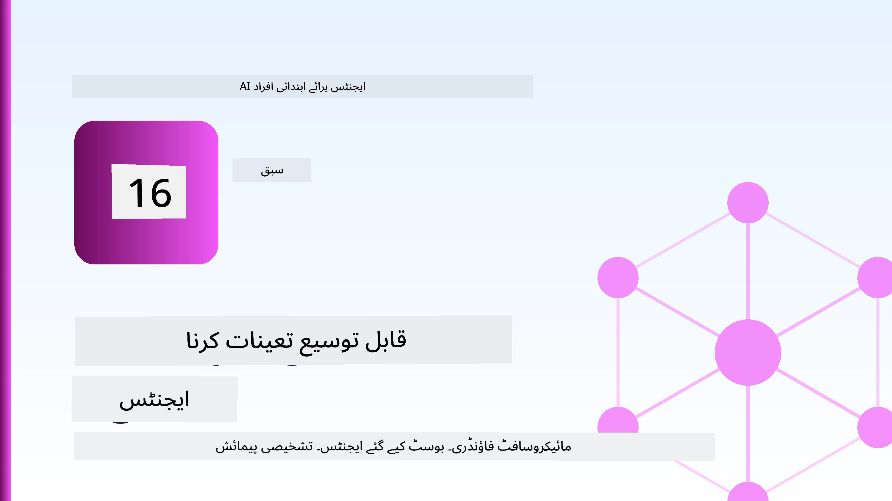
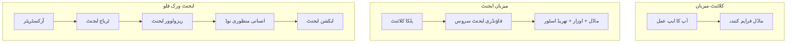
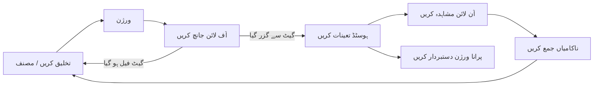
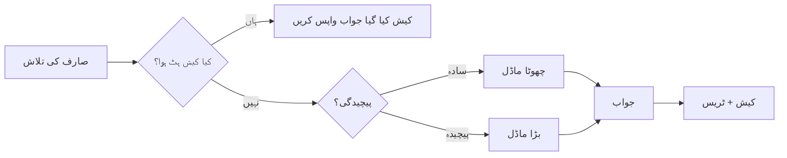
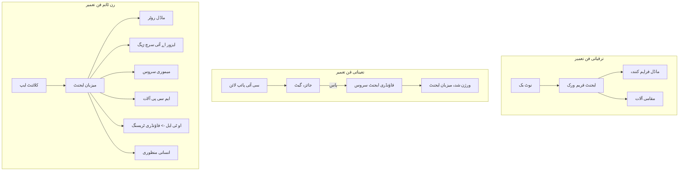

# مائیکروسافٹ فاؤنڈری کے ساتھ اسکیل ایبل ایجنٹس کی تعیناتی



اس کورس کے اس مقام تک آپ نے ایسے ایجنٹس بنائے ہیں جو آپ کے لیپ ٹاپ پر، نوٹ بک کے اندر چلتے ہیں، `az login` اور چند ماحولیاتی متغیرات کے ذریعے چلائے جاتے ہیں۔ یہ سیکھنے کا بالکل صحیح طریقہ ہے۔ وہ طریقہ نہیں جس سے ہزاروں صارفین پر انحصار کرنے والا ایجنٹ 3 بجے صبح چلایا جائے۔

یہ سبق "میرے مشین پر چلتا ہے" اور "یہ پروڈکشن میں قابل اعتماد اور معقول قیمت پر چلتا ہے" کے درمیان فاصلے کے بارے میں ہے۔ ہم اس فاصلے کو **مائیکروسافٹ فاؤنڈری** اور **مائیکروسافٹ فاؤنڈری ایجنٹ سروس** کا استعمال کرکے ختم کرتے ہیں، اور ہم ایک حقیقی کسٹمر سپورٹ ایجنٹ بنا کر کرتے ہیں جس کے پاس ٹولز، بازیافت، میموری، جائزہ، اور نگرانی ہوتی ہے۔

## تعارف

یہ سبق درج ذیل موضوعات کا احاطہ کرے گا:

- ایک **پروٹوٹائپ ایجنٹ** اور ایک **تعین شدہ ایجنٹ** کے درمیان فرق، اور کیوں تبدیلی زیادہ تر ماڈل کے *آس پاس* کے ہر چیز سے تعلق رکھتی ہے۔
- ایجنٹس کے لیے **تعیناتی کے نمونے**: کلائنٹ ہوسٹڈ، سروس ہوسٹڈ (ہوسٹڈ ایجنٹس)، اور ورک فلو آرکیسٹریٹڈ۔
- مائیکروسافٹ فاؤنڈری پر **ایجنٹ کا لائف سائیکل** — بنائیں، ورژن دیں، تعینات کریں، جائزہ لیں، مشاہدہ کریں، ریٹائر کریں۔
- **اسکیلنگ کی حکمت عملیاں**: ماڈل روٹنگ، کیشنگ، همکاری، اور اسٹیٹ لیس ڈیزائن۔
- OpenTelemetry اور Foundry ٹریسنگ کے ساتھ **مشاہدہ کاری**۔
- ماڈل کے انتخاب، روٹنگ اور جائزہ گزرگاہ کے ذریعے **لاگت کی بہتر کاری**۔
- **انٹرپرائز غور و فکر**: گورننس، انسانی منظوری، اور پروڈکشن میں MCP سرورز کو محفوظ طریقے سے چلانا۔

## سیکھنے کے اہداف

اس سبق کو مکمل کرنے کے بعد آپ جانیں گے کہ:

- ایک دیے گئے ایجنٹ کے کام کے بوجھ کے لیے صحیح تعیناتی کے نمونے کا انتخاب کیسے کریں۔
- ایجنٹ کو مائیکروسافٹ فاؤنڈری ایجنٹ سروس پر تعینات کریں تاکہ وہ ورژن کیا گیا، گورن کیا گیا اور قابل مشاہدہ ہو۔
- ایجنٹ کو ٹریسنگ کے لیے آلہ لگائیں اور ہر ریلیز سے پہلے چلنے والی جائزہ پائپ لائن کو منسلک کریں۔
- اسکیل پر تاخیر اور لاگت کو قابو میں رکھنے کے لیے ماڈل روٹنگ اور کیشنگ لاگو کریں۔
- اعلیٰ خطرے والے عمل کے لیے ایک انسانی منظوری کا گیٹ شامل کریں اور MCP سرور کو پروڈکشن-محفوظ طریقے سے مربوط کریں۔

## پیشگی تقاضے

یہ سبق فرض کرتا ہے کہ آپ نے پہلے کے اسباق مکمل کر لیے ہیں اور انہیں سمجھتے ہیں:

- [مائیکروسافٹ ایجنٹ فریم ورک](../14-microsoft-agent-framework/README.md) کے ساتھ ایجنٹس بنانا (سبق 14)۔
- [ٹول کا استعمال](../04-tool-use/README.md) (سبق 4) اور [ایجینٹک RAG](../05-agentic-rag/README.md) (سبق 5)۔
- [ایجنٹ میموری](../13-agent-memory/README.md) (سبق 13) اور [ایجنٹک پروٹوکولز / MCP](../11-agentic-protocols/README.md) (سبق 11)۔
- [مشاہدہ کاری اور جائزہ](../10-ai-agents-production/README.md) (سبق 10) — یہ سبق براہِ راست اس پر مبنی ہے۔

آپ کو درج ذیل کی بھی ضرورت ہوگی:

- ایک **Azure سبسکرپشن** اور ایک **مائیکروسافٹ فاؤنڈری پروجیکٹ** جس میں کم از کم ایک تعین شدہ چیٹ ماڈل ہو۔
- تصدیق شدہ **Azure CLI** (`az login`)۔
- Python 3.12+ اور ریپوزیٹری میں موجود پیکجز [`requirements.txt`](../../../requirements.txt)۔

## پروٹوٹائپ سے پروڈکشن تک: اصل میں کیا تبدیل ہوتا ہے

ایک پروٹوٹائپ ایجنٹ اور ایک پروڈکشن ایجنٹ ایک ہی بنیادی لوپ شیئر کرتے ہیں — سوچنا، ٹولز کال کرنا، جواب دینا۔ جو چیز بدلتی ہے وہ اس لوپ کے گرد لپٹی ہر چیز ہے۔ ماڈل شاید پروڈکشن ایجنٹ کا 20٪ ہو؛ باقی 80٪ آپرییشنل ڈھانچہ ہوتا ہے۔

| فکر | پروٹوٹائپ | پروڈکشن |
| --- | --- | --- |
| **ہوسٹنگ** | آپ کے نوٹ بک میں چلتا ہے | ہوسٹڈ سروس کی حیثیت سے چلتا ہے، ورژنڈ اور رول آؤٹ کیا جاتا ہے |
| **شناخت** | آپ کا `az login` ٹوکن | محدود کردہ RBAC کے ساتھ منیجڈ شناخت |
| **حالت** | یادداشت میں، ری اسٹارٹ پر ختم ہو جاتا ہے | بیرونی (تھریڈ اسٹور، میموری سروس) |
| **ناکامی** | آپ کو ٹریس بیک نظر آتا ہے | ریٹریز، فال بیک، ڈیڈ لیٹر، الرٹس |
| **لاگت** | "یہ چند سینٹس ہے" | ہر درخواست کی بنیاد پر ٹریک کی گئی، روٹ کی گئی، کیش کی گئی، بجٹ بنائی گئی |
| **معیار** | آپ خود نتیجہ دیکھتے ہیں | ہر ریلیز سے پہلے خودکار جائزہ لیا جاتا ہے |
| **اعتماد** | آپ ہر عمل کی منظوری دیتے ہیں | پالیسی + انسانی مداخلت پر مبنی خطروں والے عمل کے لیے |

اس جدول کو ذہن میں رکھیں۔ نیچے ہر سیکشن ان قطاروں میں سے ایک سے مماثل ہوتا ہے۔

## ایجنٹ تعیناتی کے نمونے

آپ تین نمونے استعمال کریں گے، اکثر امتزاج میں۔

### 1. کلائنٹ-ہوسٹڈ ایجنٹس

ایجنٹ آبجیکٹ آپ کی ایپلیکیشن پروسیس کے اندر رہتا ہے۔ آپ کا کوڈ ماڈل فراہم کنندہ کو براہ راست کال کرتا ہے؛ سوچنے کا لوپ آپ کی سروس میں چلتا ہے۔ یہی ہر پچھلے سبق نے کیا ہے۔

- **استعمال کریں جب** آپ کو لوپ پر مکمل کنٹرول، کسٹم میڈل ویئر، یا پہلے سے موجود بیک اینڈ میں ایجنٹ کو ایمبیڈ کرنے کی ضرورت ہو۔
- **تجارتی جھکاؤ**: آپ خود اسکیلنگ، حالت، اور مزاحمت کے مالک ہوتے ہیں۔

### 2. ہوسٹڈ ایجنٹس (فاؤنڈری ایجنٹ سروس)

ایجنٹ مائیکروسافٹ فاؤنڈری میں *بطور ریسورس رجسٹرڈ* ہوتا ہے۔ فاؤنڈری سوچنے کا لوپ ہوسٹ کرتا ہے، تھریڈز اسٹور کرتا ہے، مواد کی حفاظت اور RBAC کو نافذ کرتا ہے، اور ایجنٹ کو فاؤنڈری پورٹل میں نمایاں کرتا ہے۔ آپ کی ایپ ایک پتلی کلائنٹ ہو جاتی ہے جو تھریڈز بناتی ہے اور جوابات پڑھتی ہے۔

- **استعمال کریں جب** آپ کو پائیداری، بلٹ-ان مشاہدہ کاری، گورننس، اور کم آپریٹنگ سطح چاہیے۔
- **تجارتی جھکاؤ**: منظم چلانے کے وقت کے بدلے کم نچلی سطح کا کنٹرول۔

### 3. ایجنٹ ورک فلو

متعدد ایجنٹس (اور ٹولز) کو گراف میں مربوط کیا جاتا ہے جس کا واضح کنٹرول فلو ہوتا ہے — ترتیب وار مراحل، شاخیں، انسانی منظوری کے نوڈز، اور مستقل چیک پوائنٹس جو عارضی اور دوبارہ شروع ہو سکتے ہیں۔ یہ مائیکروسافٹ ایجنٹ فریم ورک کی **ورک فلو** صلاحیت ہے جو تعیناتی پیمانے پر لاگو کی گئی ہے۔

- **استعمال کریں جب** ایک کام متعدد مختص ایجنٹس پر محیط ہو یا درمیان میں منظوری کے مرحلے کی ضرورت ہو۔
- **تجارتی جھکاؤ**: زیادہ متحرک حصے؛ آرکیسٹریشن کی سطح کی مشاہدہ کاری کی ضرورت ہے۔



## مائیکروسافٹ فاؤنڈری پر ایجنٹ کے زندگی کے مرحلے

ایک ایجنٹ کی تعیناتی ایک بار کی `push` نہیں ہوتی۔ یہ ایک لوپ ہے، اور یہ بہت حد تک سافٹ ویئر ریلیز سائیکل جیسا دکھتا ہے کیونکہ حقیقت میں یہی ہوتا ہے۔



بنیادی خیال، جو [سبق 10](../10-ai-agents-production/README.md) سے آیا ہے: **آف لائن جائزہ ایک دروازہ ہے، آخری خیال نہیں۔** نیا ایجنٹ ورژن اس وقت تک روانہ نہیں ہوتا جب تک کہ وہ آپ کے جائزہ معیارات پر پورا نہ اترے۔ آن لائن مشاہدہ کاری پھر حقیقی دنیا کی ناکامیوں کو آپ کے آف لائن ٹیسٹ سیٹ میں واپس بھیجتی ہے۔ یہی مکمل لوپ ہے۔

## اسکیلنگ کی حکمت عملیاں

ایک ایجنٹ کو اسکیل کرنا ایک اسٹیٹ لیس ویب API کو اسکیل کرنے سے مختلف ہے، کیونکہ ہر درخواست کئی مہنگے ماڈل اور ٹول کالز کو متحرک کر سکتی ہے۔ چار تکنیک سب سے زیادہ بوجھ برداشت کرتی ہیں۔

**اسٹیٹ لیس درخواست ہینڈلنگ۔** اپنے پراسیس کی میموری میں صارف کی کوئی حالت محفوظ نہ رکھیں۔ مکالماتی تھریڈز کو فاؤنڈری تھریڈ اسٹور یا میموری سروس میں محفوظ کریں تاکہ کوئی بھی انسٹنس کوئی بھی درخواست سنبھال سکے۔ یہی آپ کو افقی طور پر اسکیل کرنے دیتا ہے — انسٹنسز شامل کریں، کوئی اسٹکی سیشنز نہیں۔

**ماڈل روٹنگ۔** ہر درخواست کو آپ کے سب سے قابل (اور مہنگے) ماڈل کی ضرورت نہیں ہوتی۔ سادہ درخواستوں — مقصد کی درجہ بندی، مختصر حقائق کے جوابات — کو ایک چھوٹے، تیز ماڈل کی طرف روٹ کریں، اور بڑے ماڈل کو اصل استدلال کے لیے محفوظ رکھیں۔ فاؤنڈری کا **ماڈل روٹر** یہ کام آپ کے لیے کر سکتا ہے، یا آپ خود ہلکا پھلکا درجہ بند بنانے کا فیچر بنا سکتے ہیں۔ آپ لیب میں DIY ورژن بنائیں گے۔

**ردعمل کیشنگ۔** بہت سے سپورٹ سوالات تقریباً ایک جیسے ہوتے ہیں ("میں اپنا پاس ورڈ کیسے ری سیٹ کروں؟")۔ عام سوالات کے جوابات کیش کریں اور انہیں ماڈل پر ضرب لگائے بغیر فراہم کریں۔ ایک معمولی کیش ہٹ ریٹ بھی لاگت اور تاخیر کو معنی خیز طور پر کم کرتا ہے۔

**ہم آہنگی اور بیک پریشر۔** ماڈل فراہم کنندگان کی ریٹ لمٹس ہوتی ہیں۔ اپنی ہم آہنگی کو محدود کریں، اسپورٹ بیک کے ساتھ ریٹریز استعمال کریں، اور نرم طریقے سے ناکامی کو ہینڈل کریں (ایک قطار میں "ہم کام کر رہے ہیں" جواب 500 کی غلطی سے بہتر ہے)۔



## پروڈکشن میں مشاہدہ کاری

آپ وہ نہیں چلا سکتے جو آپ دیکھ نہیں سکتے۔ سبق 10 میں احاطہ کیے گئے مطابق، مائیکروسافٹ ایجنٹ فریم ورک **OpenTelemetry** ٹریسز کو ماخذ طور پر خارج کرتا ہے — ہر ماڈل کال، ٹول کال، اور آرکیسٹریشن قدم ایک اسپین بن جاتا ہے۔ پروڈکشن میں آپ ان اسپینز کو مائیکروسافٹ فاؤنڈری (یا کسی OTel-مطابقت پذیر بیک اینڈ) کو برآمد کرتے ہیں تاکہ آپ:

- ہر کسٹمر کی شکایت کا اختتام سے اختتام تک ہر ماڈل اور ٹول کال کے ذریعے پتا لگا سکیں۔
- وقت کے ساتھ ہر درخواست کی p50/p95 تاخیر اور لاگت کا مشاہدہ کریں۔
- غلطی کی شرح میں اچانک اضافہ اور لاگت کی غیر معمولی صورتوں پر پہلے سے اطلاع دیں تاکہ آپ کے صارفین (یا آپ کی مالی ٹیم) کو پتہ چلے۔

```python
from agent_framework.observability import get_tracer

tracer = get_tracer()

with tracer.start_as_current_span("support_request") as span:
    span.set_attribute("customer.tier", "enterprise")
    span.set_attribute("routed.model", "gpt-5-nano")
    # ایجنٹ کی عملدرآمد خودبخود اس اسپین کے اندر ٹریس کی جاتی ہے
```

`customer.tier` اور `routed.model` جیسے صفات وہ سوالات بناتے ہیں جو ٹریسز کے انبوه کو جواب دے سکیں ("کیا انٹرپرائز صارفین بہت زیادہ چھوٹے ماڈل کی طرف روٹ ہو رہے ہیں؟")۔

## لاگت کی بہتر سازی

پروڈکشن ایجنٹس میں لاگت ٹوکنز کی غالب ہوتی ہے۔ تین لیورز، اثر کی ترتیب میں:

1. **ماڈل کا صحیح سائز منتخب کریں۔** ایک چھوٹا ماڈل جو آپ کے جائزے کے گیٹ سے گزرتا ہے، تقریباً ہمیشہ ایک بڑے ماڈل سے کم مہنگا ہوتا ہے جو بھی گزرتا ہے۔ جائزہ استعمال کریں تا کہ یہ *ثابت* کریں کہ چھوٹا ماڈل کافی اچھا ہے بجائے اس کے کہ سب سے بڑا ماڈل حفاظتی احتیاط کے طور پر منتخب کیا جائے۔
2. **پیچیدگی کے لحاظ سے روٹ کریں۔** جیسا کہ اوپر ذکر کیا گیا — صرف ان درخواستوں کے لیے بڑے ماڈل کی قیمت ادا کریں جنہیں بڑے ماڈل کی استدلال کی ضرورت ہو۔
3. **زور دار کیشنگ کریں۔** سب سے سستا ماڈل کال وہ ہوتا ہے جو آپ کبھی نہیں کرتے۔

جائزہ گزرگاہیں اور لاگت کا کنٹرول ایک ہی ضابطہ ہیں جو دو زاویوں سے دیکھا جاتا ہے: جائزہ آپ کو *معیار کی حد* بتاتا ہے، روٹنگ اور کیشنگ آپ کو اس حد کی *لاگت* کے قریب رکھتی ہیں۔

## انٹرپرائز تعیناتی کے پہلو

**گورننس۔** ہوسٹڈ ایجنٹس فاؤنڈری کے RBAC، مواد کی حفاظت، اور آڈٹ لاگنگ کو کماتے ہیں۔ ہر ایجنٹ کو منیجڈ شناخت دیں جس کے پاس کم سے کم درکار مراعات ہوں — نالج بیس کو صرف پڑھنے کی رسائی، ٹکٹنگ API تک محدود رسائی، اور کچھ نہیں۔

**انساني مداخلت۔** کچھ عمل اتنے اہم ہوتے ہیں کہ انہیں مکمل خودکار نہیں کیا جا سکتا — رقم کی واپسی جاری کرنا، اکاؤنٹ حذف کرنا، قانونی ٹیم کو بڑھانا۔ مائیکروسافٹ ایجنٹ فریم ورک **منظوری مطلوبہ** ٹولز کو سپورٹ کرتا ہے: ایجنٹ عمل تجویز کرتا ہے، عمل رکتا ہے، انسان منظوری دیتا ہے یا رد کرتا ہے، اور ورک فلو دوبارہ شروع ہوتا ہے۔ آپ نے یہ بنیادی بات [سبق 6](../06-building-trustworthy-agents/README.md) میں دیکھی تھی؛ یہاں آپ اسے تعینات کرتے ہیں۔

**پروڈکشن میں MCP۔** [MCP](../11-agentic-protocols/README.md) آپ کے ایجنٹ کو خارجی ٹولز ایک معیاری انٹرفیس کے ذریعے استعمال کرنے دیتا ہے۔ پروڈکشن میں، ہر MCP سرور کو غیر بھروسہ مند حد سمجھیں: سرور ورژن کو پن کریں، اسے محدود شناخت کے ساتھ چلائیں، اس کے نتائج کی تصدیق کریں، اور کبھی بھی اسے راز نہ دیں۔ MCP سرور ایک انحصار ہے، اور انحصارات کو پیچ کیا جاتا ہے، آڈٹ کیا جاتا ہے، اور ریٹ لمٹ کیا جاتا ہے۔



یہ تین خاکے — ترقی، تعیناتی، رن ٹائم — ایجنٹ کی زندگی کے تین مراحل میں ایک ہی ایجنٹ ہیں۔ نیچے دی گئی لیب آپ کو اسے بنانے کے عمل سے گزارتا ہے۔

## عملی لیب: پروڈکشن کے لیے تیار کسٹمر سپورٹ ایجنٹ

[`code_samples/16-python-agent-framework.ipynb`](./code_samples/16-python-agent-framework.ipynb) کھولیں اور اسے سرے سے آخر تک کریں۔ آپ ایک **Contoso کسٹمر سپورٹ ایجنٹ** تیار کریں گے جس میں ہر پروڈکشن فکر شامل ہو گی:

1. **ٹول کالنگ** — آرڈر کی حیثیت دیکھیں اور سپورٹ ٹکٹ کھولیں۔
2. **RAG** — نالج بیس (Azure AI Search، ایک ان میموری بیک اپ کے ساتھ تاکہ نوٹ بک سرچ ریسورس کے بغیر چل سکے) سے پالیسی سوالات کے جواب دیں۔
3. **میموری** — بات چیت کے دوران صارف کو یاد رکھیں۔
4. **ماڈل روٹنگ** — پیچیدگی کی درجہ بندی کرنے والا ہر درخواست کو چھوٹے یا بڑے ماڈل کی طرف روٹ کرتا ہے۔
5. **ردعمل کیشنگ** — دہرائے گئے سوالات کیش سے فراہم کیے جاتے ہیں۔
6. **انسانی منظوری** — ایک مقررہ حد سے زیادہ رقم کی واپسی انسانی منظوری کے لیے رکتی ہے۔
7. **جائزہ پائپ لائن** — ایک چھوٹا آف لائن ٹیسٹ سیٹ ایجنٹ کو اسکور کرتا ہے اور ریلیز گیٹ کا کام دیتا ہے۔
8. **مشاہدہ کاری** — ہر درخواست کے گرد OpenTelemetry ٹریسنگ۔

### وضاحت

نوٹ بک اس طرح منظم ہے کہ ہر پروڈکشن فکر ایک خود مختار، چلنے والا سیکشن ہے۔ اس کا مرکز روٹنگ اور کیشنگ کے ساتھ درخواست ہینڈلر ہے:

```python
async def handle_support_request(query: str, customer_id: str) -> str:
    # 1. جب ممکن ہو کیش سے فراہم کریں۔
    cached = response_cache.get(normalize(query))
    if cached:
        return cached

    # 2. لاگت کنٹرول کرنے کے لیے مشکلات کے مطابق راستہ مقرر کریں۔
    model = "gpt-5-nano" if is_simple(query) else "gpt-5-mini"

    # 3. مشاہدہ کے لیے ایجنٹ کو ٹریس اسپین کے اندر چلائیں۔
    with tracer.start_as_current_span("support_request") as span:
        span.set_attribute("routed.model", model)
        span.set_attribute("customer.id", customer_id)
        response = await support_agent.run(query, model=model)

    # 4. کیش کریں اور واپس کریں۔
    response_cache.set(normalize(query), response.text)
    return response.text
```

ریلیز کی حفاظت کرنے والا جائزہ گیٹ کچھ یوں دکھتا ہے:

```python
async def evaluation_gate(agent, test_cases, threshold: float = 0.8) -> bool:
    passed = 0
    for case in test_cases:
        result = await agent.run(case["input"])
        if score_response(result.text, case["expected"]) >= 0.8:
            passed += 1
    pass_rate = passed / len(test_cases)
    print(f"Evaluation pass rate: {pass_rate:.0%} (gate: {threshold:.0%})")
    return pass_rate >= threshold  # صرف اس صورت میں تعینات کریں جب دروازہ پاس ہو جائے
```

ہر سطر کو پڑھیں — نوٹ بک بنیادی عناصر کو جان بوجھ کر چھوٹا رکھتی ہے تاکہ کچھ بھی فریم ورک کال کے پیچھے چھپا نہ ہو۔

## تعینات ایجنٹ کی تصدیق کے لیے سموک ٹیسٹ

اوپر والا جائزہ گیٹ آپ کے ایجنٹ آبجیکٹ کے خلاف *آف لائن* چلتا ہے۔ جب ایجنٹ بطور ہوسٹڈ ایجنٹ تعینات ہو جائے، تو آپ کو ایک اور، اور بھی سستا چیک چاہیے: **کیا تعینات شدہ اینڈ پوائنٹ واقعی جواب دے رہا ہے؟**

"کامیابی کے ساتھ" تعیناتی صرف اس بات کا ثبوت ہے کہ کنٹرول پلین نے تعریف قبول کر لی ہے — یہ ثبوت نہیں کہ ایجنٹ جواب دیتا ہے۔ کوئی غائب انحصار، غلط ماڈل روٹنگ، یا ختم شدہ کنکشن ایک سبز تعیناتی چھوڑ سکتا ہے جو کچھ واپس نہیں کرتا۔ ایک **سموک ٹیسٹ** اسے سیکنڈوں میں، ہر تعیناتی پر، پوری جائزہ کی لاگت کے بغیر پکڑ لیتا ہے۔

یہ ریپوزیٹری تیار سموک ٹیسٹ پائپ لائن کے ساتھ آتی ہے جو [AI Smoke Test](https://github.com/marketplace/actions/ai-smoke-test) GitHub ایکشن پر مبنی ہے:

- **کیتلاگ** — [`tests/lesson-16-smoke-tests.json`](../../../tests/lesson-16-smoke-tests.json) میں Contoso سپورٹ ایجنٹ کے لیے پرامپٹس اور اثباتی جملے شامل ہیں (زمینی پالیسی جوابات، آرڈر دیکھنا، موضوع پر رہنا، اور کثیر مرحلوں کی تھریڈ تسلسل)۔ دیگر اسباق کے ایجنٹس کے کیتلاگ اس کے ساتھ موجود ہیں — دیکھیں [`tests/README.md`](../tests/README.md)۔
- **ورک فلو** — [`.github/workflows/smoke-test.yml`](../../../.github/workflows/smoke-test.yml) Azure OIDC کے ساتھ لاگ ان ہے اور ہر پرامپٹ کو ایجنٹ کے Responses اینڈ پوائنٹ پر POST کرتا ہے، کسی بھی اثباتی ناکامی پر جاب ناکام کرتا ہے۔

```yaml
- name: Smoke-test hosted agent
  uses: JFolberth/ai-smoketest@v1
  with:
    project_endpoint: ${{ inputs.project_endpoint }}
    agent_name: ContosoSupportAgent
    tests_file: tests/lesson-16-smoke-tests.json
```


اپنے ایجنٹ کے تعیناتی کے بعد اسے **Actions** ٹیب سے چلائیں، اپنا Foundry پروجیکٹ اینڈپوائنٹ اور ایجنٹ کا نام فراہم کرتے ہوئے۔ فیڈریٹڈ شناخت کو Foundry پروجیکٹ دائرہ کار میں **Azure AI User** کردار کی ضرورت ہوتی ہے۔ تہوں کو ایک ہرم کی طرح سمجھیں: اسموک ٹیسٹ (کیا پہنچا جا سکتا ہے اور جواب دے رہا ہے؟) ہر تعیناتی پر چلتے ہیں، آف لائن تشخیص (کیا شپ کرنے کے لیے کافی اچھا ہے؟) پروموشن سے پہلے چلتی ہے، اور آن لائن تشخیص (یہ جنگل میں کیسا کر رہا ہے؟) مسلسل چلتی رہتی ہے۔

## علم کا معائنہ

اسائنمنٹ پر جانے سے پہلے اپنی سمجھ کا جائزہ لیں۔

**1. ایک پروڈکشن ایجنٹ میں "ماڈل" کا تقریباً کتنا حصہ ہوتا ہے، اور باقی کیا ہوتا ہے؟**

<details>
<summary>جواب</summary>

ماڈل نظام کا اقلیت ہے — عام طور پر تقریباً 20% کے طور پر حوالہ دیا جاتا ہے۔ باقی حصہ عملیاتی ڈھانچہ ہے: ہوسٹنگ اور ورژننگ، شناخت اور RBAC، بیرونی ریاست، خرابی کا انتظام، لاگت کا سراغ لگانا، تشخیص، اور انسان کے شامل کنٹرول۔ پیداوار کی طرف منتقلی زیادہ تر منطق کے لوپ *کے گرد* سب کچھ بنانے کے بارے میں ہوتی ہے۔
</details>

**2. آپ کب کلائنٹ ہوسٹڈ ایجنٹ کے بجائے ہوسٹڈ ایجنٹ کا انتخاب کریں گے؟**

<details>
<summary>جواب</summary>

جب آپ کو ایک منظم رن ٹائم چاہیے جس میں داخلی استقامت (ایسے تھریڈ جو برقرار رہتے اور دوبارہ شروع ہو سکتے ہیں)، مشاہدہ کاری، مواد کی حفاظت، اور RBAC موجود ہو، اور آپ آپریشنل سطح کم کرنے کے لیے منطق کے لوپ کے کم درجے کے کنٹرول سے سمجھوتہ کرنے کو تیار ہوں۔ کلائنٹ ہوسٹڈ اس وقت ترجیحی ہوتا ہے جب آپ لوپ پر مکمل کنٹرول چاہتے ہوں یا ایجنٹ کو موجودہ بیک اینڈ میں ضم کر رہے ہوں۔
</details>

**3. ایک قابل توسیع ایجنٹ کو اپنے عمل کی میموری میں غیر ریاستی کیوں ہونا چاہیے؟**

<details>
<summary>جواب</summary>

تاکہ کوئی بھی مثال کسی بھی درخواست کو سنبھال سکے، جو چپکنے والے سیشن کے بغیر افقی توسیع کو ممکن بناتا ہے۔ ہر صارف کی گفتگو کی حالت کو تھریڈ اسٹور یا میموری سروس میں بیرون کیا جاتا ہے۔ اگر حالت عمل کی میموری میں ہوتی تو آپ اسے دوبارہ شروع کرنے پر کھو دیتے اور بوجھ کو آزادانہ طور پر تقسیم نہیں کر سکتے تھے۔
</details>

**4. ماڈل روٹنگ کون سا مسئلہ حل کرتا ہے، اور یہ تشخیص سے کیسے متعلق ہے؟**

<details>
<summary>جواب</summary>

روٹنگ سادہ درخواستوں کو ایک چھوٹے، سستے، تیز ماڈل تک بھیجتی ہے اور اصل منطق کے لیے بڑے ماڈل کو مخصوص رکھتی ہے، جس سے تاخیر اور لاگت دونوں کنٹرول ہوتے ہیں۔ یہ تشخیص سے متعلق ہے کیونکہ تشخیص وہ چیز ہے جو ثابت کرتی ہے کہ چھوٹا ماڈل کسی قسم کی درخواستوں کے لیے کافی اچھا ہے — بغیر تشخیص کے روٹنگ صرف قیاس آرائی ہے۔
</details>

**5. "تشخیصی گیٹ" کیا ہے اور یہ زندگی کے مرحلے میں کہاں واقع ہوتا ہے؟**

<details>
<summary>جواب</summary>

ایک تشخیصی گیٹ نئی ایجنٹ ورژن کے خلاف ایک آف لائن ٹیسٹ سیٹ چلاتا ہے اور تعیناتی کو روکتا ہے جب تک کہ پاس کی شرح کوئی حد عبور نہ کر لے۔ یہ زندگی کے مرحلے میں "ورژن" اور "ڈیپلائے" کے درمیان واقع ہوتا ہے، معیار کو ریلیز کا پیش شرط بناتا ہے بجائے اس کے کہ شپنگ کے بعد چیک کیا جائے۔
</details>

**6. پروڈکشن میں MCP سرور کو غیر قابل اعتماد حد کے طور پر کیوں سمجھنا چاہیے؟**

<details>
<summary>جواب</summary>

کیونکہ یہ ایک بیرونی انحصار ہے جسے آپ کا ایجنٹ کال کرتا ہے۔ آپ کو اس کا ورژن مقرر کرنا چاہیے، اسے محدود شناخت کے ساتھ چلانا چاہیے، اس کے آؤٹ پٹ کو جانچنا چاہیے، اس پر ریٹ لمٹ لگانا چاہیے، اور کبھی بھی اس کے لیے راز ظاہر نہیں کرنے چاہیے — وہی نظم و ضبط جو آپ کسی تیسرے فریق کے انحصار پر لاگو کرتے ہیں۔ اس کے آؤٹ پٹ آپ کے ایجنٹ کے منطق میں شامل ہوتے ہیں، اس لیے بغیر تصدیق کے اعتماد ایک سیکیورٹی خطرہ ہے۔
</details>

**7. عام طور پر کس واحد تبدیلی کا پروڈکشن ایجنٹ کی لاگت پر سب سے بڑا اثر ہوتا ہے، اور کیوں؟**

<details>
<summary>جواب</summary>

ماڈل کی درست سائزنگ — سب سے چھوٹا ماڈل استعمال کرنا جو آپ کے تشخیصی گیٹ کو پاس کرتا ہو۔ لاگت ٹوکنز پر غالب ہوتی ہے، اور ایک چھوٹا ماڈل جو معیار کے معیار پر پورا اترتا ہے، عموماً بڑے ماڈل سے سستا ہوتا ہے۔ کیشنگ اور روٹنگ لاگت کو مزید کم کرتے ہیں، لیکن صحیح بنیادی ماڈل کا انتخاب سب سے بڑا فوری اثر رکھتا ہے۔
</details>

**8. span attributes مثلاً `customer.tier` اور `routed.model` مشاہدہ کاری میں کیا کردار ادا کرتے ہیں؟**

<details>
<summary>جواب</summary>

یہ خام ٹریسس کو جوابدہ کاروباری سوالات میں تبدیل کرتے ہیں۔ بغیر attributes کے آپ کے پاس سپینز کی ایک دیوار ہوتی ہے؛ ان کے ساتھ آپ پوچھ سکتے ہیں "کیا کاروباری صارفین کو چھوٹے ماڈل کی طرف بہت زیادہ روٹ کیا جا رہا ہے؟" یا "کون سا ماڈل ہمارے سب سے سست درخواستوں کو سنبھالتا ہے؟" Attributes وہ طریقہ ہیں جن سے آپ آپریشن کے لیے اہم جہات کے مطابق ٹیلی میٹری کو تقسیم کرتے ہیں۔
</details>

## اسائنمنٹ

لیب سے کسٹمر سپورٹ ایجنٹ لیں اور اسے ایک مخصوص منظر کے لیے سخت بنائیں: **ایک SaaS کمپنی کے لیے سبسکرپشن بلنگ سپورٹ ایجنٹ۔**

آپ کی جمع کرائی گئی چیزوں میں شامل ہونا چاہیے:

1. **اوزاروں کو بدلیں** تاکہ وہ بلنگ سے متعلق ہوں: `get_subscription_status`, `get_invoice`, اور `issue_credit` (50$ سے زیادہ کریڈٹس کے لیے انسانی منظوری ضروری ہے)۔
2. **تین RAG دستاویزات شامل کریں** جو کمپنی کی ریفنڈ پالیسی، بلنگ سائیکل، اور منسوخی کی پالیسی پر محیط ہوں۔
3. **تشخیص کے سیٹ کو کم از کم آٹھ کیسز تک بڑھائیں،** جن میں کم از کم دو کیسز ایسے ہوں جو انسانی منظوری کا راستہ فعال کریں، اور اپنی تشخیصی گیٹ کی درست پاس یا فیل کی تصدیق کریں۔
4. **ایک لاگت کی رپورٹ شامل کریں:** ایجنٹ کے ذریعے دس مخلوط سوالات چلانے کے بعد، پرنٹ کریں کہ کتنے چھوٹے ماڈل کو گئے، کتنے بڑے ماڈل کو گئے، اور کتنے کیش سے فراہم کیے گئے۔

ایک مختصر پیراگراف لکھیں (مارک ڈاؤن سیل میں) جس میں وضاحت کریں کہ آپ نے کون سا ماڈل روٹنگ قاعدہ منتخب کیا اور آپ اسے حقیقی ٹریفک کے ساتھ کیسے تصدیق کریں گے۔ کوئی واحد درست جواب نہیں ہے — آپ کے اس بات پر جانچ کی جائے گی کہ آیا پروڈکشن کے مسائل کو مربوط طور پر جوڑا گیا ہے۔

## خلاصہ

اس سبق میں آپ نے Microsoft Foundry کے ساتھ ایک ایجنٹ کو پروٹوٹائپ سے پیداوار تک منتقل کیا:

- پیداوار پر جانا زیادہ تر ماڈل کے گرد **عملی ڈھانچہ** — ہوسٹنگ، شناخت، حالت، خرابی کا انتظام، لاگت، معیار، اور اعتماد — کے بارے میں ہے۔
- آپ نے تین **تعیناتی کے پیٹرنز** سیکھے — کلائنٹ ہوسٹڈ، ہوسٹڈ ایجنٹس، اور ایجنٹ ورک فلو — اور ہر ایک کب مناسب ہے۔
- آپ نے **ایجنٹ کی زندگی کے مرحلے** پر قدم رکھا، جہاں آف لائن **تشخیص ریلیز گیٹ کے طور پر کام کرتی ہے** اور آن لائن مشاہدہ کاری ناکامیوں کو ٹیسٹ سیٹ میں واپس بھیجتی ہے۔
- آپ نے **اسکیلنگ حکمت عملیاں** اپنائی — غیر ریاستی ڈیزائن، ماڈل روٹنگ، کیشنگ، اور محدود ہم عصر — اور انہیں **لاگت کی بہتری** سے جوڑا۔
- آپ نے **انٹرپرائز کنٹرولز** شامل کیے: RBAC، انسانی منظوری کے عمل، اور پروڈکشن-محفوظ MCP انٹیگریشن۔
- آپ نے ایک **پروڈکشن کے لیے تیار کسٹمر سپورٹ ایجنٹ** بنایا جو ان تمام مسائل کو چلنے والے کوڈ میں مربوط کرتا ہے۔

اگلا سبق مخالف سفر کرتا ہے: کلاؤڈ میں ایجنٹس کو اسکیل کرنے کے بجائے، آپ انہیں *نیچے* ایک واحد ڈویلپر مشین پر لائیں گے اور مکمل طور پر مقامی طور پر چلائیں گے۔

## اضافی وسائل

- <a href="https://learn.microsoft.com/azure/ai-foundry/what-is-azure-ai-foundry" target="_blank">Microsoft Foundry دستاویزات</a>
- <a href="https://learn.microsoft.com/azure/ai-foundry/agents/overview" target="_blank">Microsoft Foundry Agent Service کا جائزہ</a>
- <a href="https://learn.microsoft.com/en-us/agent-framework/overview/?wt.mc_id=youtube_26688_organicsocial_reactor&pivots=programming-language-python" target="_blank">Microsoft Agent Framework</a>
- <a href="https://learn.microsoft.com/azure/ai-foundry/concepts/model-router" target="_blank">Microsoft Foundry میں ماڈل روٹر</a>
- <a href="https://learn.microsoft.com/azure/search/search-what-is-azure-search" target="_blank">Azure AI سرچ</a>
- <a href="https://opentelemetry.io/" target="_blank">OpenTelemetry</a>
- <a href="https://github.com/marketplace/actions/ai-smoke-test" target="_blank">AI سموک ٹیسٹ GitHub ایکشن</a>
- <a href="https://modelcontextprotocol.io/" target="_blank">Model Context Protocol (MCP)</a>

## پچھلا سبق

[کمپیوٹر یوز ایجنٹس (CUA) کی تعمیر](../15-browser-use/README.md)

## اگلا سبق

[مقامی AI ایجنٹس کی تخلیق](../17-creating-local-ai-agents/README.md)

---

<!-- CO-OP TRANSLATOR DISCLAIMER START -->
**ڈس کلیمر**:
یہ دستاویز AI ترجمہ سروس [Co-op Translator](https://github.com/Azure/co-op-translator) کے ذریعے ترجمہ کی گئی ہے۔ جبکہ ہم درستگی کے لیے کوشاں ہیں، براہ کرم اس بات سے آگاہ رہیں کہ خودکار ترجمے میں غلطیاں یا عدم درستیاں ہو سکتی ہیں۔ اصل دستاویز اپنے مادری زبان میں مستند ماخذ سمجھی جائے گی۔ حساس معلومات کے لیے پیشہ ور انسانی ترجمہ کی سفارش کی جاتی ہے۔ اس ترجمے کے استعمال سے پیدا ہونے والی کسی بھی غلط فہمی یا غلط تشریح کی ذمہ داری ہم قبول نہیں کرتے۔
<!-- CO-OP TRANSLATOR DISCLAIMER END -->