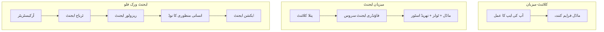
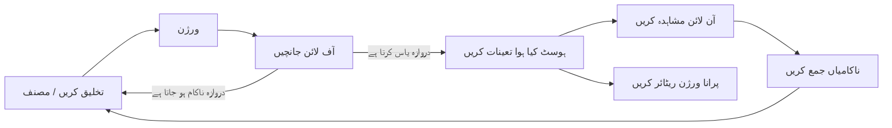
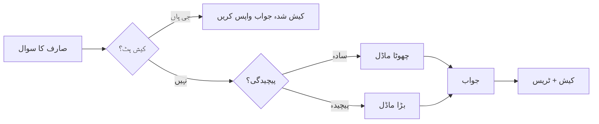
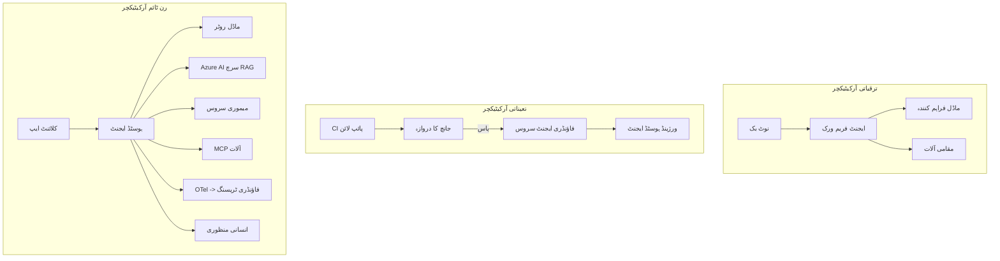

# مائیکروسافٹ فاؤنڈری کے ساتھ اسکیل ایبل ایجنٹس کی تعیناتی


اس کورس کے اب تک کے مراحل میں آپ نے ایسے ایجنٹس بنائے ہیں جو آپ کے لیپ ٹاپ پر، نوٹ بک کے اندر، `az login` اور چند ماحولیاتی متغیرات کے ذریعے چلتے ہیں۔ یہ سیکھنے کا بالکل درست طریقہ ہے۔ لیکن یہ صحیح طریقہ نہیں ہے کہ ہزاروں صارفین جن پر آپ کا ایجنٹ منحصر ہے، انہیں 3 بجے صبح چلنا چاہیے۔

یہ سبق "یہ میرے مشین پر چلتا ہے" اور "یہ قابل اعتماد اور معقول لاگت پر پروڈکشن میں چلتا ہے" کے درمیان خلیج کے بارے میں ہے۔ ہم اس خلیج کو **مائیکروسافٹ فاؤنڈری** اور **مائیکروسافٹ فاؤنڈری ایجنٹ سروس** کے ذریعے بند کرتے ہیں، اور ہم ایسا ایک حقیقی کسٹمر سپورٹ ایجنٹ بنا کر کرتے ہیں جس میں ٹولز، بازیافت، میموری، تشخیص، اور نگرانی شامل ہیں۔

## تعارف

یہ سبق مندرجہ ذیل موضوعات کا احاطہ کرے گا:

- ایک **پروٹوٹائپ ایجنٹ** اور ایک **تعینات ایجنٹ** کے درمیان فرق، اور کیوں یہ تبدیلی زیادہ تر ماڈل کے *آس پاس* سب کچھ ہے۔
- ایجنٹس کے لیے **تعیناتی کے نمونے**: کلائنٹ-ہوسٹڈ، سروس-ہوسٹڈ (ہوسٹڈ ایجنٹس)، اور ورک فلو-آرکیسٹریٹڈ۔
- مائیکروسافٹ فاؤنڈری پر **ایجنٹ کا لائف سائیکل** — تخلیق، ورژن، تعیناتی، تشخیص، مشاہدہ، ریٹائرمنٹ۔
- **اسکیلنگ کی حکمت عملی**: ماڈل راؤٹنگ، کیشنگ، ہم وقت سازی، اور بے ریاست ڈیزائن۔
- OpenTelemetry اور فاؤنڈری ٹریسنگ کے ساتھ **مشاہدہ پذیری**۔
- ماڈل انتخاب، راؤٹنگ، اور تشخیصی گیٹس کے ذریعے **لاگت کی اصلاح**۔
- **انٹرپرائز غور و فکر**: حکمرانی، انسانی منظوری، اور MCP سرورز کو محفوظ طریقے سے پروڈکشن میں چلانا۔

## سیکھنے کے اہداف

اس سبق مکمل کرنے کے بعد، آپ جانیں گے کہ کیسے:

- کسی مخصوص ایجنٹ ورک لوڈ کے لیے صحیح تعیناتی کا نمونہ منتخب کریں۔
- کسی ایجنٹ کو مائیکروسافٹ فاؤنڈری ایجنٹ سروس میں تعینات کریں تاکہ وہ ورژنڈ، حکمرانی شدہ، اور مشاہدہ پذیر ہو۔
- ایجنٹ کو ٹریسنگ کے لیے انسٹرومنٹ کریں اور ایک تشخیص پائپ لائن لگائیں جو ہر ریلیز سے پہلے چلتی ہے۔
- اسکیل پر تاخیر اور لاگت کو قابو میں رکھنے کے لیے ماڈل راؤٹنگ اور کیشنگ اپنائیں۔
- اعلیٰ خطرہ والے عمل کے لیے ایک انسانی منظوری کا گیٹ شامل کریں اور MCP سرور کو پروڈکشن میں محفوظ طریقے سے انٹیگریٹ کریں۔

## پیشگی ضروریات

یہ سبق فرض کرتا ہے کہ آپ نے پچھلے اسباق مکمل کر لیے ہیں اور آپ ان چیزوں میں آرام دہ ہیں:

- [Microsoft Agent Framework](../14-microsoft-agent-framework/README.md) کے ساتھ ایجنٹس بنانا (سبق 14).
- [ٹول کا استعمال](../04-tool-use/README.md) (سبق 4) اور [Agentic RAG](../05-agentic-rag/README.md) (سبق 5)۔
- [Agent Memory](../13-agent-memory/README.md) (سبق 13) اور [Agentic Protocols / MCP](../11-agentic-protocols/README.md) (سبق 11)۔
- [مشاہدہ پذیری اور تشخیص](../10-ai-agents-production/README.md) (سبق 10) — یہ سبق اس پر براہ راست مبنی ہے۔

آپ کو مزید ضرورت ہوگی:

- ایک **Azure سبسکرپشن** اور ایک **Microsoft Foundry پروجیکٹ** جس میں کم از کم ایک تعینات چیٹ ماڈل ہو۔
- **Azure CLI** جس میں لاگ ان کیا گیا ہو (`az login`)۔
- Python 3.12+ اور ریپوزٹری میں موجود پیکجز [`requirements.txt`](../../../requirements.txt)۔

## پروٹوٹائپ سے پروڈکشن تک: حقیقت میں کیا بدلتا ہے

ایک پروٹوٹائپ ایجنٹ اور ایک پروڈکشن ایجنٹ وہی بنیادی لوپ شیئر کرتے ہیں — سوچنا، ٹولز کال کرنا، جواب دینا۔ جو چیز بدلتی ہے وہ اس لوپ کے ارد گرد سب کچھ ہوتا ہے۔ ماڈل ممکنہ طور پر پروڈکشن ایجنٹ کا صرف 20٪ ہے؛ باقی 80٪ آپریشنل ڈھانچہ ہے۔

| تشویش | پروٹوٹائپ | پروڈکشن |
| --- | --- | --- |
| **ہوسٹنگ** | آپ کے نوٹ بک میں چلتا ہے | ہوسٹڈ سروس کے طور پر چلتا ہے، ورژنڈ اور رول آؤٹ کیا جاتا ہے |
| **شناخت** | آپ کا `az login` ٹوکن | منیجد شناخت جس میں محدود RBAC ہے |
| **حالت** | یادداشت میں، ری اسٹارٹ پر ختم | بیرونی (تھریڈ اسٹور، میموری سروس) |
| **ناکامی** | آپ کو ٹریسبیک نظر آتا ہے | ریٹریز، فال بیکس، ڈیڈ لیٹر، الرٹس |
| **لاگت** | "یہ چند سینٹس ہیں" | ہر درخواست کے حساب سے ٹریک کیا جاتا ہے، راؤٹ کیا جاتا ہے، کیش کیا جاتا ہے، بجٹ ہوتا ہے |
| **معیار** | آپ نتائج کا جائزہ لیتے ہیں | ہر ریلیز سے پہلے خودکار تشخیص کی جاتی ہے |
| **اعتماد** | آپ ہر عمل کی منظوری دیتے ہیں | پالیسی + انسانی مداخلت خاص خطرناک عمل کے لیے |

اس جدول کو ذہن میں رکھیں۔ نیچے ہر سیکشن ان روؤں میں سے ایک سے متعلق ہے۔

## ایجنٹ تعیناتی کے نمونے

آپ تین نمونے اکثر مل کر استعمال کریں گے۔

### 1. کلائنٹ-ہوسٹڈ ایجنٹس

ایجنٹ آبجیکٹ آپ کی درخواست کے عمل کے اندر رہتا ہے۔ آپ کا کوڈ براہ راست ماڈل فراہم کنندہ کو کال کرتا ہے؛ ریژنینگ لوپ آپ کی سروس میں چلتا ہے۔ یہی ہر پچھلے سبق کا طریقہ تھا۔

- **استعمال کریں جب** آپ کو لوپ پر مکمل کنٹرول، کسٹم مڈل ویئر، یا ایجنٹ کو موجودہ بیک اینڈ میں ایمبیڈ کرنے کی ضرورت ہو۔
- **ٹرید آف**: آپ اسکیلنگ، حالت، اور لچک خود سنبھالتے ہیں۔

### 2. ہوسٹڈ ایجنٹس (فاؤنڈری ایجنٹ سروس)

ایجنٹ *مائیکروسافٹ فاؤنڈری میں بطور ریسورس رجسٹر ہوتا ہے*. فاؤنڈری ریژنینگ لوپ کی میزبانی کرتا ہے، تھریڈز محفوظ کرتا ہے، مواد کی حفاظت اور RBAC نافذ کرتا ہے، اور ایجنٹ کو فاؤنڈری پورٹل میں ظاہر کرتا ہے۔ آپ کی ایپ ایک ہلکی کلائنٹ بن جاتی ہے جو تھریڈز بناتی ہے اور جوابات پڑھتی ہے۔

- **استعمال کریں جب** آپ کو پائیداری، بلٹ ان مشاہدہ پذیری، حکمرانی، اور کم عملیاتی علاقے کی ضرورت ہو۔
- **ٹرید آف**: کم تفصیلی کنٹرول کے بدلے میں ایک مینیجڈ رن ٹائم۔

### 3. ایجنٹ ورک فلو

متعدد ایجنٹس (اور ٹولز) کو ایک گراف میں جوڑا جاتا ہے جس میں واضح کنٹرول فلو ہوتا ہے — تسلسل کے مراحل، شاخ بندی، انسانی منظوری کے نودز، اور دیرپا چیک پوائنٹس جو رک سکتے ہیں اور دوبارہ شروع ہو سکتے ہیں۔ یہ مائیکروسافٹ ایجنٹ فریم ورک کی ورک فلو کی صلاحیت ہے جو تعیناتی کے اسکیل پر لاگو ہوتی ہے۔

- **استعمال کریں جب** ایک واحد کام کئی خصوصی ایجنٹس پر محیط ہو یا درمیان میں منظوری کا قدم درکار ہو۔
- **ٹرید آف**: زیادہ حرکات؛ آرکیسٹریشن سطح کی مشاہدہ پذیری کی ضرورت۔



## مائیکروسافٹ فاؤنڈری پر ایجنٹ کا لائف سائیکل

ایجنٹ کی تعیناتی ایک وقتی `push` نہیں بلکہ ایک لوپ ہے، اور یہ سافٹ ویئر ریلیز سائیکل جیسا لگتا ہے کیونکہ یہ بالکل وہی ہے۔



کلیدی خیال، جو [سبق 10](../10-ai-agents-production/README.md) سے لیا گیا ہے: **آف لائن تشخیص ایک گیٹ ہے، نہ کہ بعد کی سوچ۔** نیا ایجنٹ ورژن تبھی جاری ہوتا ہے جب وہ آپ کی تشخیصی حدوں کو پار کر لے۔ آن لائن مشاہدہ پذیری پھر حقیقی دنیا کی ناکامیاں آپ کے آف لائن ٹیسٹ سیٹ میں واپس بھیجتی ہے۔ یہ پورا لوپ ہے۔

## اسکیلنگ کی حکمت عملی

ایک ایجنٹ کا اسکیلنگ بے ریاست ویب API سے مختلف ہے، کیونکہ ہر درخواست متعدد مہنگے ماڈل اور ٹول کالز کر سکتی ہے۔ چار تکنیکیں زیادہ تر بوجھ اٹھاتی ہیں۔

**بے ریاست درخواست کی ہینڈلنگ۔** اپنے عمل کی میموری میں کسی صارف کی حالت نہ رکھیں۔ گفتگو کے تھریڈز کو فاؤنڈری تھریڈ اسٹور یا میموری سروس میں محفوظ کریں تاکہ کوئی بھی انسٹانس کسی بھی درخواست کو ہینڈل کر سکے۔ یہی آپ کو افقی پیمانے تک جانے دیتا ہے — انسٹانسز بڑھائیں، کوئی اسٹکی سیشن نہیں۔

**ماڈل راؤٹنگ۔** ہر درخواست کو آپ کے سب سے زیادہ قابل اور مہنگے ماڈل کی ضرورت نہیں ہوتی۔ آسان درخواستوں — ارادے کی درجہ بندی، مختصر حقائق کے جوابات — کو چھوٹے اور تیزی سے ماڈل کی طرف بھیجیں، اور بڑے ماڈل کو اصل استدلال کے لیے محفوظ رکھیں۔ فاؤنڈری کا **ماڈل راؤٹر** یہ آپ کے لیے کر سکتا ہے، یا آپ خود ایک ہلکا پھلکا کلاسفائر بنا سکتے ہیں۔ آپ لیب میں DIY ورژن بنائیں گے۔

**جواب کیشنگ۔** بہت سے سپورٹ سوالات قریب بالکل یکساں ہوتے ہیں ("میں اپنا پاس ورڈ کیسے ری سیٹ کروں؟")۔ عام سوالات کے جوابات کو کیش کریں اور بغیر ماڈل کو ہٹائے انہیں فراہم کریں۔ معمولی کیش ہٹ ریٹ بھی لاگت اور تاخیر کو نمایاں طور پر کم کرتی ہے۔

**ہم وقت سازی اور بیک پریشر۔** ماڈل فراہم کنندگان کی حدیں ہوتی ہیں۔ اپنی ہم وقت سازی کو محدود کریں، ایکسپونینشل بیک آف کے ساتھ ریٹریز کا استعمال کریں، اور خوبصورتی سے ناکام ہوں (قطار میں "ہم کام کر رہے ہیں" جواب 500 سے بہتر ہے)۔



## پروڈکشن میں مشاہدہ پذیری

آپ وہ نہیں چلا سکتے جو آپ نہیں دیکھ سکتے۔ سبق 10 میں بیان کیا گیا ہے، مائیکروسافٹ ایجنٹ فریم ورک **OpenTelemetry** ٹریسز قدرتی طور پر خارج کرتا ہے — ہر ماڈل کال، ٹول کال، اور آرکیسٹریشن کا مرحلہ ایک اسپین بن جاتا ہے۔ پروڈکشن میں آپ وہ اسپینز مائیکروسافٹ فاؤنڈری (یا کسی بھی OTel-مطابق بیک اینڈ) کو بھیجتے ہیں تاکہ آپ کر سکیں:

- ایک واحد صارف کی شکایت کو ہر ماڈل اور ٹول کال کے ذریعے آخر تک ٹریس کریں۔
- وقت کے ساتھ ہر درخواست کی p50/p95 تاخیر اور لاگت دیکھیں۔
- اپنی صارفین (یا آپ کی مالی ٹیم) کو معلوم ہونے سے پہلے خرابی کی شرح میں اضافے اور لاگتی بےقاعدگیوں پر الرٹ کریں۔

```python
from agent_framework.observability import get_tracer

tracer = get_tracer()

with tracer.start_as_current_span("support_request") as span:
    span.set_attribute("customer.tier", "enterprise")
    span.set_attribute("routed.model", "gpt-5-nano")
    # ایجنٹ کی عملداری خود بخود اس اسپین کے اندر ٹریس کی جاتی ہے
```

`customer.tier` اور `routed.model` جیسے خصائص ایک ٹریس کی دیوار کو سوالات کے قابل بناتے ہیں ("کیا انٹرپرائز صارفین کو بار بار چھوٹے ماڈل کی طرف بھیجا جا رہا ہے؟")۔

## لاگت کی اصلاح

پروڈکشن ایجنٹس میں لاگت ٹوکنز کی غالب ہوتی ہے۔ تین اقدامات سب سے زیادہ اثر رکھتے ہیں:

1. **ماڈل کا صحیح سائز منتخب کریں۔** ایک چھوٹا ماڈل جو آپ کے تشخیصی گیٹ سے گزرتا ہے تقریباً ہمیشہ بڑا ماڈل جو بھی گزرتا ہے سے سستا ہوتا ہے۔ تشخیص کا استعمال کریں تاکہ ثابت کریں کہ چھوٹا ماڈل کافی اچھا ہے، نہ کہ خطرہ لینے کے لیے سب سے بڑا ماڈل منتخب کریں۔
2. **پیچیدگی کی بنیاد پر راؤٹ کریں۔** جیسا کہ اوپر — صرف وہ درخواستیں جو بڑے ماڈل کی استدلال کی ضرورت رکھتی ہیں، ان کے لیے بڑے ماڈل کی قیمت ادا کریں۔
3. **کیشنگ کو مؤثر بنائیں۔** سب سے سستی ماڈل کال وہ ہے جو آپ کبھی نہیں کرتے۔

تشخیصی گیٹس اور لاگت کے کنٹرول ایک ہی ترتیب کو دو زاویوں سے دیکھتے ہیں: تشخیص آپ کو *معیار کی حد* بتاتی ہے، راؤٹنگ اور کیشنگ آپ کو اس حد کی *لاگت* کے قریب رکھتی ہے۔

## انٹرپرائز تعیناتی کے غور و فکر

**حکمرانی۔** ہوسٹڈ ایجنٹس فاؤنڈری کی RBAC، مواد کی حفاظت، اور آڈٹ لاگنگ وراثت میں لیتے ہیں۔ ہر ایجنٹ کو کم سے کم مراعات کے ساتھ ایک منیجد شناخت دیں — صرف نالج بیس پڑھنے کی اجازت، ٹکٹنگ API کا محدود استعمال، اس سے زیادہ کچھ نہیں۔

**انسانی مداخلت۔** کچھ عمل اتنے اہم ہوتے ہیں کہ انہیں مکمل خودکار نہیں کیا جا سکتا — ریفنڈ جاری کرنا، اکاؤنٹ حذف کرنا، قانونی ٹیم کو مسئلہ بڑھانا۔ مائیکروسافٹ ایجنٹ فریم ورک **منظوری مطلوبہ** ٹولز کی حمایت کرتا ہے: ایجنٹ عمل کی تجویز دیتا ہے، عمل رک جاتا ہے، انسان منظوری دیتا ہے یا رد کرتا ہے، اور ورک فلو دوبارہ شروع ہوتا ہے۔ آپ نے اس ابتدائی چیز کو [سبق 6](../06-building-trustworthy-agents/README.md) میں دیکھا تھا؛ یہاں آپ اسے تعینات کرتے ہیں۔

**پروڈکشن میں MCP۔** [MCP](../11-agentic-protocols/README.md) آپ کے ایجنٹ کو بیرونی ٹولز ایک معیاری انٹرفیس کے ذریعے استعمال کرنے دیتا ہے۔ پروڈکشن میں، ہر MCP سرور کو ایک غیر معتبر سرحد سمجھیں: سرور ورژن کو پِن کریں، اسے محدود شناخت کے ساتھ چلائیں، اس کے آؤٹ پٹس کی تصدیق کریں، اور کبھی بھی اس کے لیے خفیہ معلومات ظاہر نہ کریں۔ MCP سرور ایک انحصار ہے، اور انحصارات کو پیچ، آڈٹ، اور ریٹ محدود کیا جاتا ہے۔



یہ تین ڈایاگرامز — ترقی، تعیناتی، رن ٹائم — اسی ایجنٹ کے زندگی کے تین مراحل ہیں۔ اگلی لیب آپ کو اسے بنانے کے ذریعے لے کر جائے گی۔

## عملی لیب: پروڈکشن ریڈی کسٹمر سپورٹ ایجنٹ

کھولیں [`code_samples/16-python-agent-framework.ipynb`](./code_samples/16-python-agent-framework.ipynb) اور اسے ابتدا سے اختتام تک مکمل کریں۔ آپ ایک **Contoso کسٹمر سپورٹ ایجنٹ** اسمبلی کریں گے جس میں ہر پروڈکشن کا پہلو شامل ہوگا:

1. **ٹول کالنگ** — آرڈر کی حالت دیکھیں اور سپورٹ ٹکٹس کھولیں۔
2. **RAG** — نالج بیس سے پالیسی سوالات کے جواب (Azure AI سرچ، ایک یادداشت میں بیک اپ کے ساتھ تاکہ نوٹ بک سرچ ریسورس کے بغیر چل سکے)۔
3. **میموری** — گفتگو کے دوران صارف کو یاد رکھیں۔
4. **ماڈل راؤٹنگ** — ایک پیچیدگی کلاسیفائر ہر درخواست کو چھوٹے یا بڑے ماڈل کی طرف لے جاتا ہے۔
5. **جواب کیشنگ** — دہرائے گئے سوالات کیش سے فراہم کیے جاتے ہیں۔
6. **انسانی منظوری** — ایک حد سے زیادہ ریفنڈز انسانی منظوری کے لیے رکتے ہیں۔
7. **تشخیصی پائپ لائن** — ایک چھوٹا آف لائن ٹیسٹ سیٹ ایجنٹ کی درجہ بندی کرتا ہے اور ریلیز گیٹ کا کام دیتا ہے۔
8. **مشاہدہ پذیری** — ہر درخواست کے گرد OpenTelemetry ٹریسنگ۔

### وضاحت

نوٹ بک اس طرح منظم ہے کہ ہر پروڈکشن کا پہلو ایک خود مختار، چلنے والا سیکشن ہے۔ اس کا دل ہے راؤٹنگ پلس کیشنگ درخواست ہینڈلر:

```python
async def handle_support_request(query: str, customer_id: str) -> str:
    # 1. جب ممکن ہو کیش سے سروس فراہم کریں۔
    cached = response_cache.get(normalize(query))
    if cached:
        return cached

    # 2. لاگت کو کنٹرول کرنے کے لیے پیچیدگی کے حساب سے راستہ منتخب کریں۔
    model = "gpt-5-nano" if is_simple(query) else "gpt-5-mini"

    # 3. آبزرویبیلٹی کے لیے ایجنٹ کو ٹریس اسپین کے اندر چلائیں۔
    with tracer.start_as_current_span("support_request") as span:
        span.set_attribute("routed.model", model)
        span.set_attribute("customer.id", customer_id)
        response = await support_agent.run(query, model=model)

    # 4. کیش کریں اور واپس کریں۔
    response_cache.set(normalize(query), response.text)
    return response.text
```

وہ تشخیصی گیٹ جو ریلیز کی حفاظت کرتا ہے یوں دکھتا ہے:

```python
async def evaluation_gate(agent, test_cases, threshold: float = 0.8) -> bool:
    passed = 0
    for case in test_cases:
        result = await agent.run(case["input"])
        if score_response(result.text, case["expected"]) >= 0.8:
            passed += 1
    pass_rate = passed / len(test_cases)
    print(f"Evaluation pass rate: {pass_rate:.0%} (gate: {threshold:.0%})")
    return pass_rate >= threshold  # صرف اس صورت میں تعینات کریں جب گیٹ پاس ہو جائے
```

ہر لائن پڑھیں — نوٹ بک ابتدائی چیزوں کو جان بوجھ کر چھوٹا رکھتی ہے تاکہ کچھ بھی فریم ورک کال کے پیچھے چھپا نہ ہو۔

## تعینات ایجنٹ کی سموک ٹیسٹ سے تصدیق

اوپر دیا گیا تشخیصی گیٹ آپ کے ایجنٹ آبجیکٹ کے خلاف *آف لائن* چلتا ہے۔ ایک بار ایجنٹ کو ہوسٹڈ ایجنٹ کے طور پر تعینات کرنے کے بعد، آپ کو ایک اور، حتیٰ کہ سستا، چیک چاہیے: **کیا تعینات اینڈ پوائنٹ واقعی جواب دے رہا ہے؟**

"کامیابی کے ساتھ" تعیناتی صرف یہ ثابت کرتی ہے کہ کنٹرول پلیٹ نے تعریف قبول کر لی — یہ ثابت نہیں کرتی کہ ایجنٹ جواب دیتا ہے۔ کسی انحصار کا نہ ہونا، خراب ماڈل راؤٹنگ، یا میعاد ختم شدہ کنکشن سبز تعیناتی چھوڑ سکتے ہیں جو کچھ بھی واپس نہیں دیتی۔ ایک **سموک ٹیسٹ** سیکنڈوں میں یہ پکڑ لیتا ہے، ہر تعیناتی پر، مکمل تشخیص کی لاگت کے بغیر۔

یہ ریپوزٹری تیار شدہ سموک-ٹیسٹ پائپ لائن فراہم کرتی ہے جو [AI Smoke Test](https://github.com/marketplace/actions/ai-smoke-test) GitHub ایکشن پر مبنی ہے:

- **کیٹلاگ** — [`tests/lesson-16-smoke-tests.json`](../../../tests/lesson-16-smoke-tests.json) میں Contoso سپورٹ ایجنٹ کے لیے پرامپٹس اور دعوے شامل ہیں (زمینی پالیسی جوابات، آرڈر لوک اپ، موضوع پر رہنا، اور کثیر مرحلہ وار تھریڈ کنٹینیوٹی)۔ دیگر اسباق کے کیٹلاگ بھی اسی کے ساتھ موجود ہیں — دیکھیں [`tests/README.md`](../tests/README.md)۔
- **ورک فلو** — [`.github/workflows/smoke-test.yml`](../../../.github/workflows/smoke-test.yml) Azure OIDC سے لاگ ان کرتا ہے اور ہر پرامپٹ کو ایجنٹ کے ریسپانسز اینڈ پوائنٹ پر POST کرتا ہے، اور کسی بھی دعوے کی ناکامی پر کام کو ناکام کر دیتا ہے۔

```yaml
- name: Smoke-test hosted agent
  uses: JFolberth/ai-smoketest@v1
  with:
    project_endpoint: ${{ inputs.project_endpoint }}
    agent_name: ContosoSupportAgent
    tests_file: tests/lesson-16-smoke-tests.json
```


اپنا ایجنٹ تعینات کرنے کے بعد اسے **Actions** ٹیب سے چلائیں، اپنے Foundry پروجیکٹ اینڈپوائنٹ اور ایجنٹ کے نام کے ساتھ۔ فیڈریٹیڈ شناخت کو Foundry پروجیکٹ اسکوپ پر **Azure AI User** رول کی ضرورت ہوتی ہے۔ پرتوں کو اہرام کے طور پر سوچیں: دھواں ٹیسٹ (کیا پہنچا اور جواب دے رہا ہے؟) ہر تعیناتی پر چلتے ہیں، آف لائن تشخیص (کیا شپ کرنے کے لیے کافی اچھا ہے؟) فروغ سے پہلے چلتی ہے، اور آن لائن تشخیص (یہ جنگل میں کیسا کر رہا ہے؟) مسلسل چلتی رہتی ہے۔

## علم کی جانچ

اسائنمنٹ پر جانے سے پہلے اپنی سمجھ کی جانچ کریں۔

**1. ایک پروڈکشن ایجنٹ میں تقریباً کتنا 'ماڈل' ہوتا ہے، اور باقی کیا ہوتا ہے؟**

<details>
<summary>جواب</summary>

ماڈل نظام کا اقلیت ہوتا ہے — عام طور پر تقریباً 20% کے طور پر بیان کیا جاتا ہے۔ باقی آپریشنل ڈھانچہ ہوتا ہے: ہوسٹنگ اور ورژننگ، شناخت اور RBAC، خارجی حالت، ناکامی کے انتظام، لاگت کی نگرانی، تشخیص، اور انسانی نگرانی کے کنٹرولز۔ پروڈکشن میں جانا زیادہ تر منطق کے لوپ کے چاروں طرف سب کچھ بنانے کے بارے میں ہوتا ہے۔
</details>

**2. آپ کب کلائنٹ ہوسٹڈ ایجنٹ کے بجائے ہوسٹڈ ایجنٹ کو منتخب کریں گے؟**

<details>
<summary>جواب</summary>

جب آپ ایک منظم رن ٹائم چاہتے ہیں جس میں بلٹ ان استحکام (ایسے تھریڈز جو برقرار رہتے ہیں اور دوبارہ شروع ہو سکتے ہیں)، قابل مشاہدہ پن، مواد کی حفاظت، اور RBAC شامل ہو، اور آپ کچھ نچلے سطح کے کنٹرول کو کم کرنے کے لیے تیار ہوں۔ کلائنٹ ہوسٹڈ تب ترجیحی ہے جب آپ کو لوپ پر مکمل کنٹرول چاہیے یا آپ ایجنٹ کو موجودہ بیک اینڈ میں ضم کر رہے ہوں۔
</details>

**3. ایک قابل توسیع ایجنٹ کو اپنی پراسیس میموری میں بے حالت کیوں ہونا چاہیے؟**

<details>
<summary>جواب</summary>

تاکہ کوئی بھی انسٹینس کوئی بھی درخواست سنبھال سکے، جو افقی توسیع کو بغیر اسٹکی سیشنز کے ممکن بناتا ہے۔ یوزر کی گفتگو کی حالت کو تھریڈ اسٹور یا میموری سروس میں خارجی کیا جاتا ہے۔ اگر حالت پراسیس میموری میں ہوتی تو آپ اسے ری اسٹارٹ پر کھو دیتے اور لوڈ بلا روک ٹوک تقسیم نہیں کر سکتے تھے۔
</details>

**4. ماڈل راؤٹنگ کس مسئلے کو حل کرتی ہے، اور یہ تشخیص سے کیسے متعلق ہے؟**

<details>
<summary>جواب</summary>

راؤٹنگ آسان درخواستوں کو ایک چھوٹے، سستے، تیز ماڈل کی طرف بھیجتی ہے اور بڑے ماڈل کو حقیقی منطق کے لیے مخصوص کرتی ہے، تاخیر اور لاگت دونوں کو کنٹرول کرتی ہے۔ یہ تشخیص سے اس لیے متعلق ہے کیونکہ تشخیص یہ ثابت کرتی ہے کہ چھوٹا ماڈل کسی قسم کی درخواستوں کے لیے کافی اچھا ہے — بغیر تشخیص کے راؤٹنگ قیاس آرائی ہے۔
</details>

**5. "تشخیصی گیٹ" کیا ہے اور یہ لائف سائیکل میں کہاں آتا ہے؟**

<details>
<summary>جواب</summary>

ایک تشخیصی گیٹ نئے ایجنٹ ورژن کے خلاف آف لائن ٹیسٹ سیٹ چلاتا ہے اور تعیناتی کو اس وقت تک روکتا ہے جب تک پاس ریٹ آستانہ عبور نہ کرے۔ یہ لائف سائیکل میں "ورژن" اور "ڈیپلائے" کے درمیان ہوتا ہے، جس سے معیار کو ریلیز کا پیش شرط بنایا جاتا ہے بجائے اس کے کہ شپنگ کے بعد چیک کیا جائے۔
</details>

**6. پروڈکشن میں MCP سرور کو غیر معتبر حد کے طور پر کیوں ٹریٹ کیا جانا چاہیے؟**

<details>
<summary>جواب</summary>

کیونکہ یہ ایک خارجی انحصار ہے جسے آپ کا ایجنٹ کال کرتا ہے۔ آپ کو اس کا ورژن پن کرنا چاہیے، اسے ایک مخصوص شناخت کے ساتھ چلانا چاہیے، اس کے آؤٹ پٹ کو ویلیڈیٹ کرنا چاہیے، ریٹ-لمٹ کرنا چاہیے، اور اس کے ساتھ کبھی راز شیئر نہیں کرنے چاہیے — وہی نظم و ضبط جو آپ کسی تیسری پارٹی کی انحصار پر لگاتے ہیں۔ اس کی آؤٹ پٹ آپ کے ایجنٹ کی منطق میں جاتی ہے، اس لیے بغیر تصدیق کے اعتماد ایک سیکیورٹی خطرہ ہے۔
</details>

**7. کون سا واحد تبدیلی عموماً پروڈکشن ایجنٹ کی لاگت پر سب سے زیادہ اثر ڈالتی ہے، اور کیوں؟**

<details>
<summary>جواب</summary>

ماڈل کو صحیح سائز دینا — سب سے چھوٹے ماڈل کا استعمال کرنا جو آپ کے تشخیصی گیٹ کو پاس کرتا ہے۔ لاگت زیادہ تر ٹوکنز پر مبنی ہوتی ہے، اور ایک چھوٹا ماڈل جو معیار کی حد پوری کرتا ہے، عام طور پر بڑے ماڈل سے کم مہنگا ہوتا ہے۔ کیشنگ اور راؤٹنگ پھر لاگت کو مزید کم کرتے ہیں، لیکن درست بنیادی ماڈل کا انتخاب سب سے بڑا پہلا اثر رکھتا ہے۔
</details>

**8. span attributes جیسے `customer.tier` اور `routed.model` مشاہداتی صلاحیت میں کیا کردار ادا کرتے ہیں؟**

<details>
<summary>جواب</summary>

یہ خام ٹریسز کو جوابی کاروباری سوالات میں تبدیل کرتے ہیں۔ بغیر attributes کے آپ کے پاس اسپینز کی دیوار ہوتی ہے؛ ان کے ساتھ آپ پوچھ سکتے ہیں "کیا ادارہ جاتی صارفین کو چھوٹے ماڈل کی طرف بہت زیادہ بھیجا جا رہا ہے؟" یا "کون سا ماڈل ہمارے سب سے سست درخواستوں کو سنبھالتا ہے؟" Attributes وہ طریقہ ہیں جن سے آپ ٹیلِمیٹری کو آپریشن کے اہم ابعاد کے ذریعہ تقسیم کرتے ہیں۔
</details>

## اسائنمنٹ

لیب سے کسٹمر سپورٹ ایجنٹ لیں اور اسے ایک خاص صورتحال کے لیے مضبوط بنائیں: **ایک SaaS کمپنی کے لیے سبسکرپشن بلنگ سپورٹ ایجنٹ۔**

آپ کی جمع کرائی گئی چیز میں ہونا چاہیے:

1. **ٹولز کو** بلنگ سے متعلقہ ٹولز سے بدلیں: `get_subscription_status`, `get_invoice`, اور `issue_credit` (50 ڈالر سے زیادہ کریڈٹ کے لیے انسانی منظوری چاہیے)۔
2. **تین RAG دستاویزات شامل کریں** جو کمپنی کی ریفنڈ پالیسی، بلنگ سائیکل، اور کینسلیشن پالیسی کو کور کرتی ہوں۔
3. **تشخیصی سیٹ کو کم از کم آٹھ کیسز تک بڑھائیں،** جن میں کم از کم دو ایسے کیسز ہوں جو *انسانی منظوری کے راستے کو* ٹرگر کریں، اور تصدیق کریں کہ آپ کا تشخیصی گیٹ صحیح طریقے سے پاس یا فیل ہو رہا ہے۔
4. **ایک لاگت کی رپورٹ شامل کریں:** ایجنٹ کے ذریعے دس مکس کیوریز چلانے کے بعد، پرنٹ کریں کہ کتنے چھوٹے ماڈل کو گئے، کتنے بڑے ماڈل کو، اور کتنے کیش سے سرور کیے گئے۔

ایک مختصر پیراگراف (مارک ڈاؤن سیل میں) لکھیں جس میں وضاحت ہو کہ آپ نے کون سا ماڈل راؤٹنگ رول منتخب کیا اور آپ اسے حقیقی ٹریفک کے ساتھ کیسے ویلیڈیٹ کریں گے۔ ایک درست جواب نہیں ہے — آپ کا جائزہ اس بات پر لیا جا رہا ہے کہ کیا پروڈکشن کے معاملات منظم اور مربوط ہیں۔

## خلاصہ

اس سبق میں آپ نے ایجنٹ کو پروٹوٹائپ سے پروڈکشن میں مائیکروسافٹ Foundry کے ساتھ منتقل کیا:

- پروڈکشن کی طرف قدم زیادہ تر ماڈل کے اطراف کا **آپریشنل ڈھانچہ** ہے — ہوسٹنگ، شناخت، حالت، ناکامی کا انتظام، لاگت، معیار، اور اعتماد۔
- آپ نے تین **تعیناتی پیٹرنز** سیکھیے — کلائنٹ ہوسٹڈ، ہوسٹڈ ایجنٹس، اور ایجنٹ ورک فلو — اور کب کون سا موزوں ہے۔
- آپ نے **ایجنٹ لائف سائیکل** دیکھا، جہاں آف لائن **تشخیص ایک ریلیز گیٹ کے طور پر کام کرتی ہے** اور آن لائن مشاہداتی صلاحیت نقص کو ٹیسٹ سیٹ میں واپس بھیجتی ہے۔
- آپ نے **اسکیلنگ کی حکمت عملیوں** کو اپنایا — بے حالت ڈیزائن، ماڈل راؤٹنگ، کیشنگ، اور محدود ہم زمانی — اور انہیں **لاگت کی اصلاح** سے جوڑا۔
- آپ نے **انٹرپرائز کنٹرولز** جوڑے: RBAC، انسانی نگرانی کی منظوری، اور پروڈکشن محفوظ MCP انضمام۔
- آپ نے ایک **پروڈکشن کے لیے تیار کردہ کسٹمر سپورٹ ایجنٹ** بنایا جو ان تمام معاملات کو قابل عمل کوڈ میں مربوط کرتا ہے۔

اگلا سبق الٹ راستہ اختیار کرتا ہے: کلاؤڈ میں ایجنٹس کو بڑا کرنے کی بجائے، آپ انہیں *کم* کر کے ایک ہی ڈویلپر مشین پر پورے طور پر لوکل چلائیں گے۔

## اضافی ذرائع

- <a href="https://learn.microsoft.com/azure/ai-foundry/what-is-azure-ai-foundry" target="_blank">Microsoft Foundry documentation</a>
- <a href="https://learn.microsoft.com/azure/ai-foundry/agents/overview" target="_blank">Microsoft Foundry Agent Service overview</a>
- <a href="https://learn.microsoft.com/en-us/agent-framework/overview/?wt.mc_id=youtube_26688_organicsocial_reactor&pivots=programming-language-python" target="_blank">Microsoft Agent Framework</a>
- <a href="https://learn.microsoft.com/azure/ai-foundry/concepts/model-router" target="_blank">Model Router in Microsoft Foundry</a>
- <a href="https://learn.microsoft.com/azure/search/search-what-is-azure-search" target="_blank">Azure AI Search</a>
- <a href="https://opentelemetry.io/" target="_blank">OpenTelemetry</a>
- <a href="https://github.com/marketplace/actions/ai-smoke-test" target="_blank">AI Smoke Test GitHub Action</a>
- <a href="https://modelcontextprotocol.io/" target="_blank">Model Context Protocol (MCP)</a>

## پچھلا سبق

[Building Computer Use Agents (CUA)](../15-browser-use/README.md)

## اگلا سبق

[Creating Local AI Agents](../17-creating-local-ai-agents/README.md)

---

<!-- CO-OP TRANSLATOR DISCLAIMER START -->
**ڈس کلیمر**:
یہ دستاویز AI ترجمہ سروس [Co-op Translator](https://github.com/Azure/co-op-translator) کے ذریعے ترجمہ کی گئی ہے۔ جبکہ ہم درستگی کے لیے کوشاں ہیں، براہ کرم اس بات سے آگاہ رہیں کہ خودکار ترجمے میں غلطیاں یا عدم درستیاں ہو سکتی ہیں۔ اصل دستاویز اپنے مادری زبان میں مستند ماخذ سمجھی جائے گی۔ حساس معلومات کے لیے پیشہ ور انسانی ترجمہ کی سفارش کی جاتی ہے۔ اس ترجمے کے استعمال سے پیدا ہونے والی کسی بھی غلط فہمی یا غلط تشریح کی ذمہ داری ہم قبول نہیں کرتے۔
<!-- CO-OP TRANSLATOR DISCLAIMER END -->