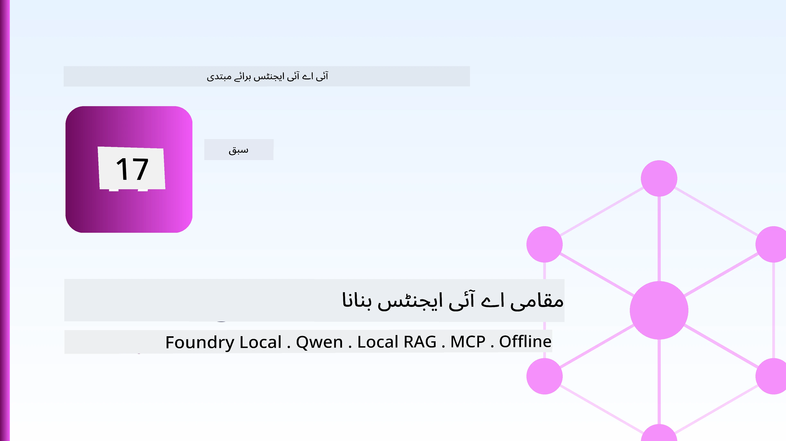
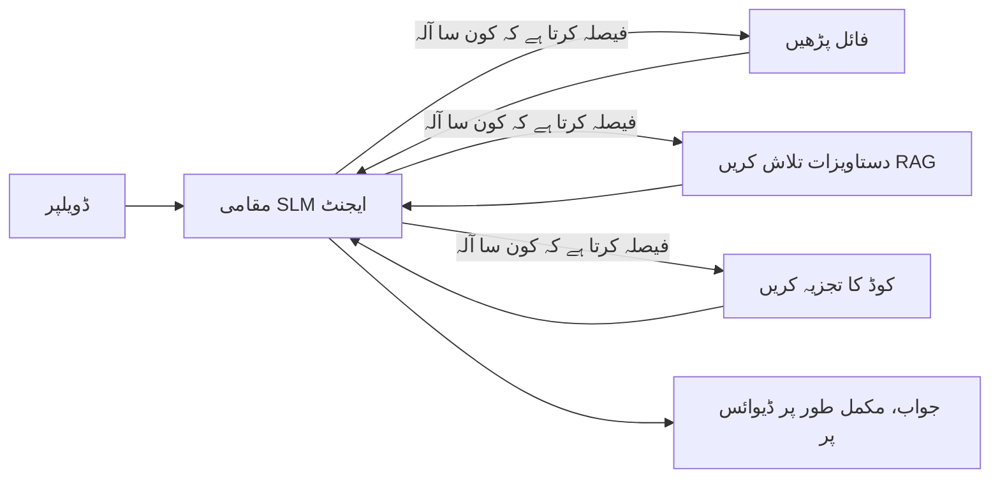
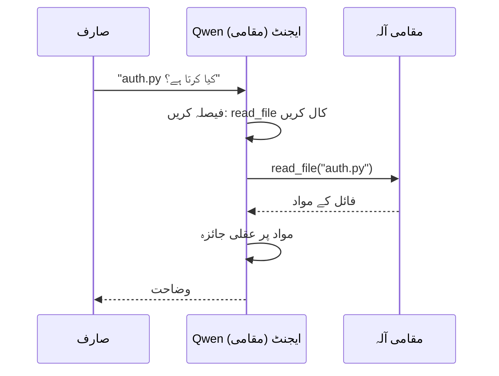
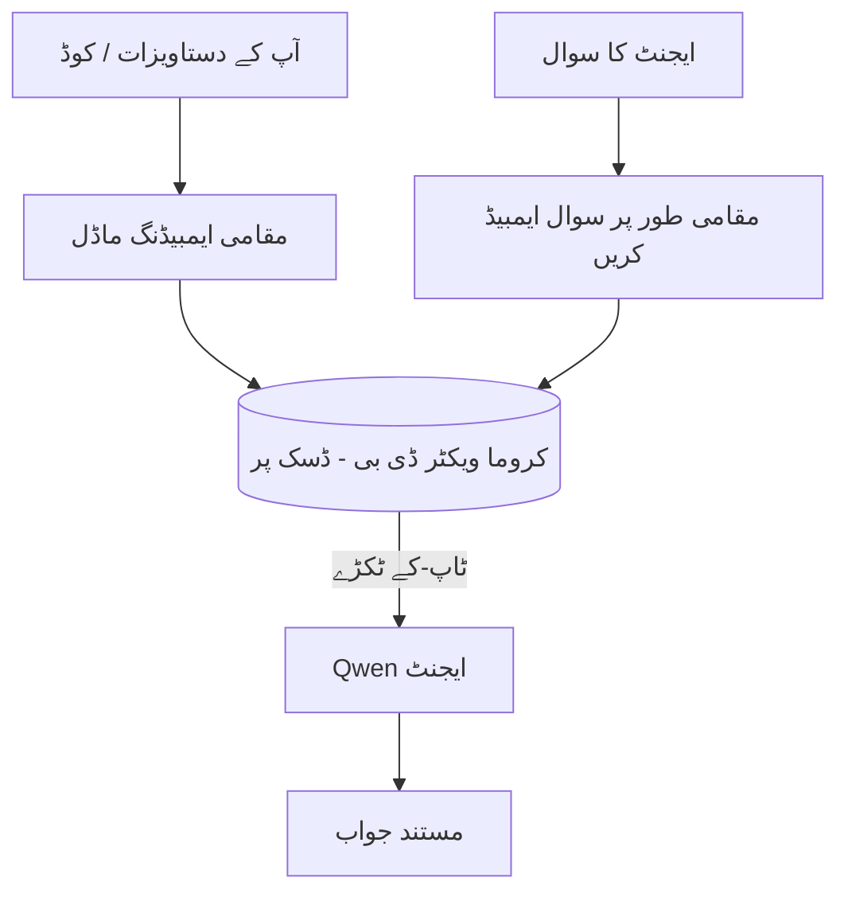
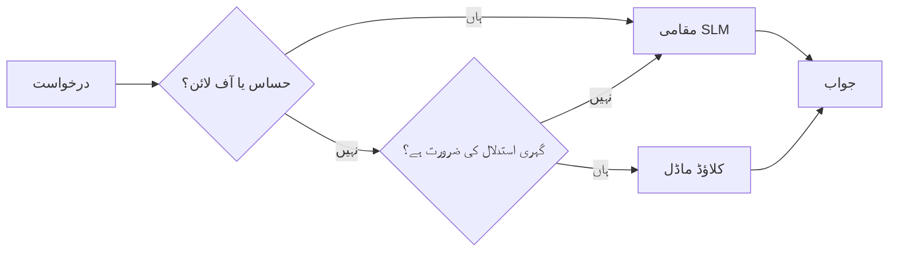

# مائیکروسافٹ فاؤنڈری لوکل اور قون کے ذریعے لوکل AI ایجنٹس بنانا



پچھلے سبق میں ایجنٹس کو کلاؤڈ میں *اوپر* بڑھایا گیا تھا۔ یہ سبق انہیں ایک واحد مشین پر *نیچے* لاتا ہے۔ آخر تک آپ کے پاس ایک کام کرنے والا انجینئرنگ اسسٹنٹ ہوگا جو منطقی فیصلے کرتا ہے، ٹولز کو کال کرتا ہے، آپ کی فائلیں پڑھتا ہے، اور آپ کی دستاویزات کو تلاش کرتا ہے — **بغیر کسی کلاؤڈ انفرنس کال کے۔**

آپ اسے کیوں چاہتے ہیں؟ تین وجوہات جو حقیقی انجینئرنگ کام میں بار بار سامنے آتی ہیں:

- **پرائیویسی۔** کوڈ اور دستاویزات کبھی مشین سے باہر نہیں جاتے۔ کوئی پرامپٹ، کوئی اسنیپٹ، کوئی صارف کا ڈیٹا نیٹ ورک کی حد کو عبور نہیں کرتا۔
- **لاگت۔** لوکل انفرنس کے لیے کوئی فی ٹوکن بل نہیں ہوتا۔ آپ بجلی کے خرچ پر پورا دن تکرار کر سکتے ہیں۔
- **آف لائن۔** ہوائی جہاز میں، محفوظ جگہ پر، یا بندش کے دوران، ایجنٹ پھر بھی کام کرتا ہے۔

مسئلہ یہ ہے کہ آپ ایک جدید کلاؤڈ ماڈل کے بدلے میں ایک **اسمال لینگویج ماڈل (SLM)** کا انتخاب کر رہے ہیں جو آپ کے CPU، GPU، یا NPU پر چلتا ہے۔ یہ سبق ایجنٹس بنانے کے بارے میں ہے جو اس پابندی کے اندر *اچھے* ہوں، نہ کہ یہ ظاہر کرنے کے کہ پابندی موجود نہیں ہے۔

## تعارف

یہ سبق درج ذیل موضوعات کا احاطہ کرے گا:

- **اسمال لینگویج ماڈلز (SLMs)** — یہ کیا ہیں، کہاں بہتر کام کرتے ہیں، اور کہاں نہیں کرتے۔
- **مائیکروسافٹ فاؤنڈری لوکل** — ایک رن ٹائم جو ماڈلز کو ڈاؤن لوڈ کرتا ہے اور ڈیوائس پر **OpenAI-مطابقت پذیر API** کے ذریعے سروس دیتا ہے۔
- **قون فنکشن کالنگ ماڈلز** — SLMs جو قابل اعتماد طریقے سے ٹول کالز پیدا کرتے ہیں، جو لوکل *ایجنٹس* (صرف لوکل چیٹ نہیں) کو ممکن بناتے ہیں۔
- **لوکل ٹولز، لوکل RAG، اور لوکل MCP** — بغیر کلاؤڈ کے ایجنٹ کو صلاحیت دینا۔
- **ہیبریڈ پیٹرنز** — کب چیزوں کو لوکل رکھنا ہے اور کب کلاؤڈ کا سہارا لینا ہے۔

## سیکھنے کے اہداف

اس سبق کے مکمل کرنے کے بعد، آپ جانیں گے کہ کیسے:

- SLMs کے فوائد اور نقصانات کی وضاحت کریں اور مناسب لوکل-ایجنٹ استعمال کے کیسز کا انتخاب کریں۔
- فاؤنڈری لوکل کے ذریعے قون ماڈل کو لوکل سرونگ کریں اور OpenAI-مطابقت پذیر اینڈ پوائنٹ کے ذریعے جڑیں۔
- ایک ٹول کالنگ ایجنٹ بنائیں جو مکمل طور پر آپ کے ورک سٹیشن پر چلتا ہو۔
- اپنی دستاویزات پر لوکل RAG شامل کریں ایک لوکل ویکٹر ڈیٹا بیس (Chroma) کا استعمال کرتے ہوئے۔
- ایجنٹ کو لوکل MCP سرور سے مربوط کریں اور هیبریڈ لوکل/کلاؤڈ ڈیزائنز کے بارے میں سوچیں۔

## پیشگی ضروریات

یہ سبق فرض کرتا ہے کہ آپ نے پچھلے اسباق مکمل کر لئے ہیں اور آپ کو درج ذیل میں مہارت حاصل ہے:

- [ٹول کا استعمال](../04-tool-use/README.md) (سبق 4) اور [ایجنٹک RAG](../05-agentic-rag/README.md) (سبق 5)۔
- [ایجنٹک پروٹوکولز / MCP](../11-agentic-protocols/README.md) (سبق 11)۔
- [مائیکروسافٹ ایجنٹ فریم ورک](../14-microsoft-agent-framework/README.md) (سبق 14)۔

آپ کو درج ذیل کی بھی ضرورت ہوگی:

- ایک ڈویلپر ورک سٹیشن۔ **8 جی بی ریم ایک حقیقت پسند کم از کم ہے**؛ 16 جی بی+ آرام دہ ہے۔ GPU یا NPU مددگار ہے لیکن ضروری نہیں۔
- **مائیکروسافٹ فاؤنڈری لوکل** انسٹال کیا ہوا (نیچے سیٹ اپ سیکشن دیکھیں)۔
- پائتھن 3.12+ اور ریپوزیٹری میں درج پیکیجز [`requirements.txt`](../../../requirements.txt)، اس سبق کے لیے `foundry-local-sdk`، `openai`، اور `chromadb`۔

## اسمال لینگویج ماڈلز: لوکل کام کے لیے صحیح ٹول


ایک فرنٹیئر کلاؤڈ ماڈل میں سیکڑوں بلینز پیرامیٹرز ہوتے ہیں اور اس کے پیچھے ایک ڈیٹا سینٹر ہوتا ہے۔ ایک ایس ایل ایم میں چند بلین پیرامیٹرز ہوتے ہیں اور یہ آپ کے لیپ ٹاپ کی ریم میں فٹ ہونا چاہیے۔ یہ فرق واضح توقعات قائم کرتا ہے۔

**ایس ایل ایمز اچھی ہیں:**

- منظم، محدود کام — درجہ بندی، استخراج، معلوم دستاویز کا خلاصہ۔
- **ٹول کالنگ** — فیصلہ کرنا کہ کون سا فنکشن کال کرنا ہے اور کن دلائل کے ساتھ۔
- آپ کے اپنے ڈیٹا پر تیز، سستا، نجی تکرار۔

**ایس ایل ایمز کمزور ہیں:**

- بڑی سیاق و سباق میں کھلے اختتام والے، کثیر مرحلتی استدلال۔
- وسیع عالمی علم (انہیں کم دیکھا ہے، اور وہ زیادہ بھولتے ہیں)۔

لہٰذا مقامی ایجنٹس کی جیت کی حکمت عملی ہے: **ایس ایل ایم کو آرکیسٹریٹ کرنے دو، اور آلات کو بھاری کام کرنے دو۔** ماڈل کو آپ کا کوڈ بیس *جاننے* کی ضرورت نہیں — اسے صرف یہ جاننے کی ضرورت ہے کہ `read_file` اور `search_docs` کب کال کرنا ہے۔ یہ براہ راست ایس ایل ایم کی طاقتوں سے میل کھاتا ہے۔



## مائیکروسافٹ فاؤنڈری لوکل

**مائیکروسافٹ فاؤنڈری لوکل** ایک ہلکا پھلکا رن ٹائم ہے جو ماڈلز کو مکمل طور پر آپ کے کمپیوٹر پر ڈاؤن لوڈ، منظم، اور سروس دیتا ہے۔ ہمارے لیے اس کی سب سے اہم خصوصیت یہ ہے کہ یہ **اوپن اے آئی-موافق HTTP اینڈ پوائنٹ** فراہم کرتا ہے — جس کا مطلب ہے کہ اوپن اے آئی ایس ڈی کے اور مائیکروسافٹ ایجنٹ فریم ورک کا اوپن اے آئی کلائنٹ صرف `base_url` کی تبدیلی کے ساتھ اس کے ساتھ کام کرتا ہے۔ آپ نے ایجنٹ بنانے کے بارے میں جو کچھ بھی سیکھا ہے وہ براہ راست منتقل ہوتا ہے؛ صرف اینڈ پوائنٹ کلاؤڈ سے `localhost` پر آ جاتا ہے۔

فاؤنڈری لوکل خود بخود آپ کے ہارڈ ویئر کے لیے بہترین ماڈل بلڈ منتخب کرتا ہے — ایک سی پی یو بلڈ، CUDA/GPU بلڈ، یا NPU بلڈ — تاکہ آپ ہر کمپیوٹر کے لیے ہاتھ سے اصلاح نہ کریں۔

### سیٹ اپ

فاؤنڈری لوکل انسٹال کریں (اپنے OS کے لیے [دستاویزات](https://learn.microsoft.com/azure/ai-foundry/foundry-local/) دیکھیں)، پھر تصدیق کریں کہ یہ کام کر رہا ہے:

```bash
# انسٹال کریں (مثال کے طور پر؛ اپنے پلیٹ فارم کے لئے دستاویزات کی پیروی کریں)
winget install Microsoft.FoundryLocal      # ونڈوز
# brew install microsoft/foundrylocal/foundrylocal   # میک او ایس

# ایک Qwen ماڈل ڈاؤن لوڈ کریں اور چلائیں، پھر مقامی سروس شروع کریں
foundry model run qwen2.5-7b-instruct
foundry service status
```

جب سروس چل رہی ہو تو آپ کے پاس ایک مقامی، اوپن اے آئی-موافق اینڈ پوائنٹ ہوتا ہے (عام طور پر `http://localhost:PORT/v1`)۔ نوٹ بک `foundry-local-sdk` استعمال کرتی ہے تاکہ خود بخود اینڈ پوائنٹ دریافت کرے، اس لیے آپ کو پورٹ کو ہارڈ کوڈ کرنے کی ضرورت نہیں۔

## قون فنکشن کالنگ: یہ کیوں اہم ہے

ایک ایجنٹ صرف تب ایجنٹ ہوتا ہے جب وہ ٹول کال کر سکے۔ بہت سے ایس ایل ایم چیٹ کر سکتے ہیں لیکن ناقابل اعتماد، غلط ساخت والے ٹول کالز بناتے ہیں۔ **قون** ماڈلز فنکشن کالنگ کے لیے تربیت یافتہ ہیں اور مسلسل اچھی طرح سے ساخت شدہ ٹول کال کے ڈھانچے جاری کرتے ہیں — جو بالکل وہ چیز ہے جو ایک مقامی چیٹ ماڈل کو ایک مقامی *ایجنٹ* میں بدل دیتا ہے۔

سلسلہ وہی معیاری ٹول کالنگ لوپ ہے جو آپ پہلے ہی جانتے ہیں، بس یہ ڈیوائس پر چل رہا ہے:



## مقامی RAG

دستاویزات کی تلاش وہ جگہ ہے جہاں مقامی ایجنٹس اپنی جگہ بناتے ہیں۔ اس کی بجائے کہ آپ کو امید ہو کہ ایس ایل ایم نے آپ کے فریم ورک کی دستاویزات یاد کر لی ہیں، آپ ان دستاویزات کو ایک **مقامی ویکٹر ڈیٹابیس** میں شامل کرتے ہیں اور ایجنٹ کو متعلقہ حصے طلب کرنے دیتے ہیں۔

ہم **Chroma** استعمال کرتے ہیں، ایک ایمبیڈڈ ویکٹر اسٹور جو بغیر سرور کے پراسیس میں چلتا ہے۔ پورا پائپ لائن مقامی ہے: مقامی ایمبیڈنگ ماڈل → مقامی ویکٹرز → مقامی بازیافت → مقامی ایس ایل ایم۔



یہ وہی Agentic RAG پیٹرن ہے جو سبق 5 سے ہے — واحد فرق یہ ہے کہ ہر جزو آپ کے کمپیوٹر پر چلتا ہے۔

## مقامی MCP سرورز


[MCP](../11-agentic-protocols/README.md) ایک ٹرانسپورٹ ہے، کلاؤڈ سروس نہیں۔ ایک MCP سرور `stdio` پر ایک مقامی پروسس کے طور پر چل سکتا ہے، جو آپ کے ایجنٹ کو معیاری پروٹوکول کے ذریعہ اوزار فراہم کرتا ہے۔ اس سے آپ MCP سرورز کے بڑھتے ہوئے ماحولیاتی نظام کو دوبارہ استعمال کر سکتے ہیں — فائل سسٹم تک رسائی، git آپریشنز، ڈیٹا بیس کی کوئریز — مکمل طور پر آف لائن۔

سیکیورٹی کا رویہ کلاؤڈ سے مختلف ہے، مگر غیر موجود نہیں: ایک مقامی MCP سرور اب بھی آپ کے صارف کی اجازتوں کے ساتھ چلتا ہے، اس لیے اس کی رسائی کو محدود کریں کہ یہ کیا چھو سکتا ہے (ایک پروجیکٹ ڈائریکٹری، پورے ہوم فولڈر نہیں) اور اس کی آؤٹ پٹس کو ان پٹس کے طور پر ویلیڈیٹ کریں۔

## ہائبرڈ کلاؤڈ اور مقامی پیٹرنز

لوکل-فرسٹ کا مطلب صرف مقامی نہیں ہے۔ پختہ نظام حساسیت اور مشکل کے مطابق روٹ کرتے ہیں:

| صورتحال | کہاں چلتا ہے |
| --- | --- |
| حساس کوڈ / ڈیٹا، یا آف لائن | **مقامی SLM** |
| سادہ، محدود کام | **مقامی SLM** (سستا، تیز) |
| غیر حساس ڈیٹا پر سخت ملٹی-ہاپ استدلال | **کلاؤڈ ماڈل** |
| بحران کے دوران سب کچھ | **مقامی SLM** (نرمی سے خراب ہونا) |

یہ **ماڈل روٹنگ** کے خیال کی عکاسی کرتا ہے جو سبق 16 میں تھا — سوائے اس کے کہ اب ان "ماڈلز" میں سے ایک آپ کی اپنی مشین ہے۔ ایک مضبوط ڈیزائن کلاؤڈ کے غیر دستیاب ہونے پر مقامی پر واپس آتا ہے، تاکہ ایجنٹ مکمل طور پر ناکام ہونے کی بجائے معیار میں کمی آئے۔



## عملی تجربہ: ایک مقامی انجینئرنگ اسسٹنٹ

[`code_samples/17-local-agent-foundry-local.ipynb`](./code_samples/17-local-agent-foundry-local.ipynb) کھولیں اور اسے مکمل کریں۔ آپ ایک **مقامی انجینئرنگ اسسٹنٹ** بنائیں گے جو مکمل طور پر آپ کے ورک سٹیشن پر چلتا ہے اور درج ذیل کر سکتا ہے:

1. **اوزار کال کریں** — Foundry Local کے ذریعے Qwen فنکشن کالنگ کے ذریعے۔
2. **مقامی فائل آپریشنز انجام دیں** — ایک پروجیکٹ ڈائریکٹری میں فائلیں لسٹ کریں اور پڑھیں۔
3. **کوڈ کا تجزیہ کریں** — ایک سورس فائل پر بنیادی میٹرکس رپورٹ کریں۔
4. **دستاویزات تلاش کریں** — Chroma کے ساتھ docs فولڈر پر مقامی RAG۔
5. **MCP استعمال کریں** — ایک مقامی MCP سرور سے کنیکٹ کریں (اگر کوئی کنفیگر نہ ہو تو نرم انداز میں اسپر کریں)۔

کسی بھی نقطہ پر کلاؤڈ انفرنس استعمال نہیں ہوتی۔

### رہنمائی

اسسٹنٹ Foundry Local سے OpenAI-مطابقت پذیر اینڈ پوائنٹ کے ذریعے کنیکٹ ہوتا ہے، اس لیے ایجنٹ کا کوڈ تقریباً کلاؤڈ سبق جیسا ہی نظر آتا ہے — صرف کلائنٹ مختلف ہوتا ہے:

```python
from foundry_local import FoundryLocalManager
from openai import OpenAI

# فاؤنڈری لوکل ماڈل کو دریافت کرتا ہے/ڈاؤن لوڈ کرتا ہے اور ہمیں ایک مقامی اینڈ پوائنٹ دیتا ہے۔
manager = FoundryLocalManager(\"qwen2.5-7b-instruct\")
client = OpenAI(base_url=manager.endpoint, api_key=manager.api_key)  # api_key ایک مقامی پلیس ہولڈر ہے
```

اوزار معمول کے Python فنکشنز ہوتے ہیں جو ایک پروجیکٹ ڈائریکٹری کے لئے محدود ہوتے ہیں:

```python
def read_file(path: str) -> str:
    \"\"\"Read a file, but only inside the sandboxed project directory.\"\"\"
    full = (PROJECT_ROOT / path).resolve()
    if PROJECT_ROOT not in full.parents and full != PROJECT_ROOT:
        return \"Access denied: path is outside the project directory.\"
    return full.read_text(encoding=\"utf-8\")
```

سائبنڈ باکس کی جانچ پر غور کریں — یہاں تک کہ مقامی طور پر بھی، ایسا ٹول جو بے ترتیب راستے پڑھتا ہے خطرناک ہے۔ نوٹ بک ہر ٹول کو ایک ہی پروجیکٹ روٹ تک محدود رکھتی ہے۔

## علم کی جانچ

اسائنمنٹ پر جانے سے پہلے اپنی سمجھ کا امتحان لیں۔

**1. دو واضح وجوہات دیں کہ ایجنٹ کو مقامی طور پر چلانا کلاؤڈ میں چلانے کے بجائے کیوں بہتر ہے۔**

<details>
<summary>جواب</summary>

کوئی بھی دو درج ذیل میں سے: **پرائیویسی** (کوڈ اور ڈیٹا کبھی مشین سے باہر نہیں جاتے)، **لاگت** (کوئی فی ٹوکن انفرنس بل نہیں)، اور **آف لائن صلاحیت** (نیٹ ورک کے بغیر کام کرتا ہے — طیارے میں، محفوظ جگہ پر، یا بحران کے دوران)۔ ایسی ضوابط/تعمیل جو ڈیٹا کو ڈیوائس سے باہر بھیجنے کی ممانعت کرتی ہے، پرائیویسی کی وجہ کی عام محرک ہیں۔
</details>

**2. مقامی ایجنٹ میں SLM اور اس کے اوزار کے درمیان محنت کی مثالی تقسیم کیا ہے، اور کیوں؟**

<details>
<summary>جواب</summary>

SLM کو **تنظیم کاری** (فیصلہ کرنا کہ کون سا ٹول کب اور کن دلائل کے ساتھ کال کرنا ہے) کی اجازت دیں اور **ٹولز کو بھاری کام کرنے دیں** (فائلیں پڑھنا، دستاویزات حاصل کرنا، نتائج کا حساب لگانا)۔ SLM محدود فیصلوں میں مضبوط ہوتے ہیں جیسے کہ ٹول چننا، مگر وسیع علم اور لمبے ملٹی-ہاپ استدلال میں کمزور، اس لیے ٹولز پر انحصار کرنا ان کی خوبیوں کو اجاگر کرتا ہے۔
</details>

**3. Foundry Local کے ساتھ کلاؤڈ ایجنٹ کوڈ کو دوبارہ استعمال کرنا ممکن بنانے والا کیا ہے؟**

<details>
<summary>جواب</summary>

Foundry Local ایک **OpenAI-مطابقت پذیر HTTP اینڈ پوائنٹ** فراہم کرتا ہے۔ OpenAI SDK اور ایجنٹ فریم ورک کا OpenAI کلائنٹ صرف `base_url` کو تبدیل کرکے (اور ایک مقامی پلیس ہولڈر API کی کے ساتھ) اس کے خلاف کام کرتے ہیں۔ ایجنٹ کے کوڈ کے باقی حصے وہی رہتے ہیں۔
</details>

**4. ہم خصوصی طور پر Qwen فنکشن کالنگ ماڈل کیوں استعمال کرتے ہیں بجائے کسی بھی SLM کے؟**

<details>
<summary>جواب</summary>

کیونکہ ایجنٹ کو قابل اعتماد، درست **ٹول کالز** پیدا کرنی ہوتی ہیں۔ بہت سے SLMs چیٹ کر سکتے ہیں مگر خراب یا غیر مستقل ٹول کال ساختیں پیدا کرتے ہیں۔ Qwen ماڈلز فنکشن کالنگ کے لیے تربیت یافتہ ہیں اور مستقل ٹول کالز فراہم کرتے ہیں، جو مقامی چیٹ ماڈل کو ایک کام کرنے والا مقامی ایجنٹ بناتا ہے۔
</details>

**5. مقامی RAG پائپ لائن میں، کون سے اجزاء مشین پر چلتے ہیں؟**

<details>
<summary>جواب</summary>

تمام: ایمبیڈنگ ماڈل، ویکٹر ڈیٹا بیس (Chroma، ڈسک پر)، بازیافت کا مرحلہ، اور SLM۔ دستاویزات مقامی طور پر ایمبیڈ اور محفوظ کی جاتی ہیں، مقامی طور پر بازیافت ہوتی ہیں، اور مقامی ماڈل کی طرف سے استدلال کی جاتی ہیں — کوئی جزو کلاؤڈ کو نہیں چھوتا۔
</details>

**6. ایک مقامی MCP سرور آپ کی مشین پر چل رہا ہے۔ کیا یہ خودبخود محفوظ بنا دیتا ہے؟ آپ کو کون سی احتیاط برتنی چاہیے؟**

<details>
<summary>جواب</summary>

نہیں۔ ایک مقامی MCP سرور آپ کے صارف کی اجازتوں کے ساتھ چلتا ہے، لہٰذا یہ وہ سب کچھ چھو سکتا ہے جو آپ کر سکتے ہیں۔ اسے صرف اس چیز تک محدود کریں جس کی اُس کو ضرورت ہے (مثلاً مکمل ہوم فولڈر کی بجائے ایک واحد پروجیکٹ ڈائریکٹری) اور اس کی آؤٹ پٹس کو عمل کرنے سے پہلے ان پٹس کے طور پر ویلیڈیٹ کریں۔
</details>

**7. ایک مناسب ہائبرڈ روٹنگ اصول بیان کریں جس میں ایک مقامی ماڈل شامل ہو۔**

<details>
<summary>جواب</summary>

حساس یا آف لائن درخواستوں کو مقامی SLM کو بھیجیں؛ سادہ محدود کام جلدی اور کم قیمت کے لیے مقامی SLM کو بھیجیں؛ غیر حساس ڈیٹا پر سخت ملٹی-ہاپ استدلال کو کلاؤڈ ماڈل کو بھیجیں؛ اور اگر کلاؤڈ دستیاب نہ ہو تو مقامی SLM پر واپس آ جائیں تاکہ ایجنٹ نرمی سے خراب ہو جائے بجائے اس کے کہ مکمل ناکام ہو۔ یہ ماڈل روٹنگ (سبق 16) ہے جس میں مقامی مشین ایک ماڈل کے طور پر ہے۔
</details>

**8. اس سبق میں مقامی ایجنٹ چلانے کے لیے حقیقت پسندانہ کم از کم RAM کتنی ہے، اور مزید RAM کیا فوائد دیتا ہے؟**

<details>
<summary>جواب</summary>

تقریباً **8 GB** حقیقت پسندانہ کم از کم ہے؛ 16 GB+ آرام دہ ہے۔ زیادہ RAM آپ کو بڑے، زیادہ قابل ماڈلز چلانے اور زیادہ سیاق و سباق میموری میں رکھنے دیتا ہے۔ GPU یا NPU انفرنس کی رفتار بڑھاتے ہیں مگر ضروری نہیں ہیں — Foundry Local جب کوئی ایکسیلیریٹر دستیاب نہ ہو تو CPU بیلڈ منتخب کرتا ہے۔
</details>

## اسائنمنٹ

مقامی انجینئرنگ اسسٹنٹ کو **مقامی دستاویزات کے جائزہ کار** میں بڑھائیں جو آپ کے منتخب کردہ ایک چھوٹے پروجیکٹ کے لیے ہو (اگر چاہیں تو اس ریپو کے کسی سبق کے فولڈر کا استعمال کریں)۔

آپ کی فائل درج ذیل ہونی چاہیے:

1. Chroma میں ایک حقیقی docs/code فولڈر کی انڈیکسنگ (کم از کم پانچ فائلیں)۔

2. **ایک `find_todos` ٹول شامل کریں** جو پروجیکٹ میں `TODO`/`FIXME` تبصرے اسکین کرے اور فائل اور لائن نمبر کے ساتھ انہیں واپس کرے — `read_file` جیسا ہی سینڈ باکس چیک برقرار رکھتے ہوئے۔

3. **ایجنٹ سے تین سوالات کریں** جو اسے ٹولز کو ملانے پر مجبور کریں: ایک خالص RAG سوال، ایک جو مخصوص فائل پڑھنے کا تقاضا کرتا ہو، اور ایک جو TODOs تلاش کرنے کا تقاضا کرتا ہو۔
4. **اس کی پیمائش کریں**: تینوں جوابات کے اوقات ناپیں اور انہیں مارک ڈاؤن سیل میں نوٹ کریں۔ تبصرہ کریں کہ آیا تاخیر آپ کے متوقع ورک فلو کے لیے قابل قبول ہے یا نہیں۔

پھر ایک مختصر پیراگراف لکھیں کہ **آپ کیا کلاؤڈ پر منتقل کریں گے اور کیا مقامی رکھیں گے** اس ریویور کے لیے، اور کیوں۔ آپ کی تشخیص اس بات پر ہوتی ہے کہ کیا مقامی اجزاء کو صحیح طریقے سے جوڑا گیا ہے اور کیا آپ کی ہائبرڈ استدلال درست ہے — ماڈل کی کوالٹی پر نہیں۔

## خلاصہ

اس سبق میں آپ نے ایک ایجنٹ بنایا جو مکمل طور پر آپ کی اپنی مشین پر چلتا ہے:

- **SLMs** پرائیویسی، لاگت، اور آف لائن آپریشن کے لیے وسعت کی قربانی دیتے ہیں — اور تب چمکتے ہیں جب وہ **ٹولز کو منظم کرتے ہیں** بجائے خود سارا علم رکھنے کے۔
- **Foundry Local** ایک OpenAI-مطابق اینڈپوائنٹ کے پیچھے ڈیوائس پر ماڈلز کی خدمت کرتا ہے، جس سے آپ کا کلاؤڈ ایجنٹ کوڈ ایک لائن کی تبدیلی کے ساتھ منتقل ہوتا ہے۔
- **Qwen function-calling models** قابل اعتماد مقامی ٹول کالنگ ممکن بناتے ہیں — اور اس لیے مقامی *ایجنٹس* بھی۔
- **Local RAG** (Chroma) اور **local MCP** ایجنٹ کو مشین چھوڑے بغیر صلاحیت دیتے ہیں۔
- **Hybrid patterns** آپ کو حساسیت اور مشکل کے حساب سے راستہ دینے دیتے ہیں، مقامی کو ایک شائستہ بیک اپ کے طور پر۔

یہ تعیناتی کا سلسلہ مکمل کرتا ہے: سبق 16 نے ایجنٹس کو Microsoft Foundry میں بڑھایا، اور یہ سبق انہیں ایک واحد ورک سٹیشن پر کم کرتا ہے۔ اگلا سبق تعینات کیے گئے ایجنٹس کو محفوظ رکھنے پر توجہ دیتا ہے۔

## اضافی وسائل

- <a href="https://learn.microsoft.com/azure/ai-foundry/foundry-local/" target="_blank">Microsoft Foundry Local دستاویزات</a>
- <a href="https://learn.microsoft.com/azure/ai-foundry/what-is-azure-ai-foundry" target="_blank">Microsoft Foundry دستاویزات</a>
- <a href="https://learn.microsoft.com/en-us/agent-framework/overview/?wt.mc_id=youtube_26688_organicsocial_reactor&pivots=programming-language-python" target="_blank">Microsoft Agent Framework</a>
- <a href="https://qwen.readthedocs.io/en/latest/framework/function_call.html" target="_blank">Qwen function calling دستاویزات</a>
- <a href="https://modelcontextprotocol.io/" target="_blank">ماڈل کانٹیکسٹ پروٹوکول (MCP)</a>
- <a href="https://docs.trychroma.com/" target="_blank">Chroma ویکٹر ڈیٹا بیس</a>

## پچھلا سبق

[Deploying Scalable Agents](../16-deploying-scalable-agents/README.md)

## اگلا سبق

[Securing AI Agents](../18-securing-ai-agents/README.md)

---

<!-- CO-OP TRANSLATOR DISCLAIMER START -->
**ڈس کلیمر**:
یہ دستاویز AI ترجمہ سروس [Co-op Translator](https://github.com/Azure/co-op-translator) کے ذریعے ترجمہ کی گئی ہے۔ جبکہ ہم درستگی کے لیے کوشاں ہیں، براہ کرم اس بات سے آگاہ رہیں کہ خودکار ترجمے میں غلطیاں یا عدم درستیاں ہو سکتی ہیں۔ اصل دستاویز اپنے مادری زبان میں مستند ماخذ سمجھی جائے گی۔ حساس معلومات کے لیے پیشہ ور انسانی ترجمہ کی سفارش کی جاتی ہے۔ اس ترجمے کے استعمال سے پیدا ہونے والی کسی بھی غلط فہمی یا غلط تشریح کی ذمہ داری ہم قبول نہیں کرتے۔
<!-- CO-OP TRANSLATOR DISCLAIMER END -->