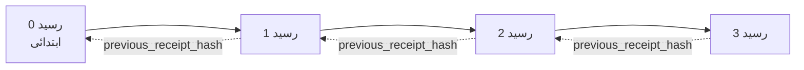

[سبق ویڈیو دیکھیں: کریپٹوگرافک رسیدوں کے ساتھ AI ایجنٹس کو محفوظ بنانا](https://youtu.be/PLACEHOLDER_VIDEO_ID)

> _(سبق ویڈیو اور تھمب نیل کو Microsoft مواد کی ٹیم مرجر کے بعد شامل کرے گی، سبق 14 / 15 کے نمونے کے مطابق)_ 

# کریپٹوگرافک رسیدوں کے ساتھ AI ایجنٹس کو محفوظ بنانا

## تعارف

اس سبق میں شامل ہوں گے:

- کیوں AI ایجنٹس کے لیے آڈٹ ٹریل تعمیل، ڈی بگنگ، اور اعتماد کے لیے اہم ہے۔
- کریپٹوگرافک رسید کیا ہے اور یہ غیر دستخط شدہ لاگ لائن سے کیسے مختلف ہے۔
- ایجنٹ کے ٹول کال کے لیے سادہ پائتھون میں دستخط شدہ رسید کیسے بنائیں۔
- رسید کو آف لائن کیسے تصدیق کریں اور چالاکی کو کیسے پکڑیں۔
- رسیدوں کو چین کیسے کریں تاکہ کسی رسید کو ہٹانا یا ترتیب بدلنا چین کو توڑ دے۔
- رسیدیں کیا ثابت کرتی ہیں اور وہ واضح طور پر کیا ثابت نہیں کرتیں۔

## سیکھنے کے اہداف

اس سبق کے مکمل ہونے پر، آپ جانیں گے کہ کیسے:

- فیلئیر موڈز کی شناخت کریں جو ایجنٹ کے عمل کے لیے کریپٹوگرافک پروونینس کو مجبور کرتے ہیں۔
- ایڈ25519 کی دستخط شدہ رسید ایک Canonical JSON پے لوڈ پر بنائیں۔
- رسید کو آزادانہ طور پر صرف دستخط کنندہ کی پبلک کی سے تصدیق کریں۔
- رسید میں چالاکی پکڑنے کے لیے ترمیم شدہ رسید پر دوبارہ تصدیق چلائیں۔
- رسیدوں کی ہیش چینڈ ترتیب بنائیں اور سمجھائیں کہ یہ چین کیوں اہم ہے۔
- پہنچانیں کہ رسیدیں کیا ثابت کرتی ہیں (تعلق، سالمیت، ترتیب) اور کیا نہیں کرتیں (عمل کی درستگی، پالیسی کی ساؤنڈنیس)۔

## مسئلہ: آپ کے ایجنٹ کا آڈٹ ٹریل

فرض کریں کہ آپ نے Contoso Travel کے لیے ایک AI ایجنٹ تعینات کیا ہے۔ ایجنٹ کسٹمر کی درخواستیں پڑھتا ہے، فلائٹس API کو کال کرکے اختیارات تلاش کرتا ہے، اور کسٹمر کی طرف سے نشستیں بک کرتا ہے۔ پچھلے کوارٹر میں، ایجنٹ نے 50,000 بکنگز کیں۔

آج ایک آڈیٹر آتا ہے۔ وہ ایک سادہ سوال پوچھتا ہے: "مجھے دکھائیں کہ آپ کا ایجنٹ کیا کیا۔"

آپ اپنے لاگ فائلز دے دیتے ہیں۔ آڈیٹر انہیں دیکھتا ہے اور مشکل سوال پوچھتا ہے: "مجھے کیسے پتہ چلے کہ ان لاگز میں کوئی ترمیم نہیں ہوئی؟"

یہی آڈٹ ٹریل کا مسئلہ ہے۔ آج کل کے زیادہ تر ایجنٹ تعیناتیاں درج ذیل پر انحصار کرتی ہیں:

- **ایپلیکیشن لاگز**: جو ایجنٹ خود لکھتا ہے، جنہیں فائل سسٹم تک رسائی رکھنے والا کوئی بھی ایڈٹ کر سکتا ہے۔
- **کلاوڈ لاگنگ سروسز**: پلیٹ فارم کی سطح پر چالاکی واضح ہوتی ہے لیکن صرف اگر آڈیٹر پلیٹ فارم آپریٹر پر اعتماد کرتا ہو۔
- **ڈیٹابیس ٹرانزیکشن لاگز**: ڈیٹابیس تبدیلیوں کے لیے موزوں لیکن عشوائی ٹول کالز کے لیے نہیں۔

یہ میں سے کوئی بھی آڈیٹر کے سوال کا جواب ایسے نہیں دے سکتا کہ اسے کسی پر اعتماد کرنا نہ پڑے (آپ پر، آپ کے کلاوڈ پرووائیڈر پر، یا ڈیٹابیس وینڈر پر)۔ اندرونی استعمال کے لیے یہ اعتماد قابل قبول ہوتا ہے، لیکن منظم کاموں (فنانس، ہیلتھ کیئر، یا EU AI Act کے تابع) کے لیے نہیں۔

کریپٹوگرافک رسیدیں یہ مسئلہ حل کرتی ہیں کیونکہ ہر ایجنٹ کے عمل کی آزادانہ تصدیق ممکن ہوتی ہے۔ آڈیٹر کو آپ پر اعتماد کرنے کی ضرورت نہیں، صرف آپ کی پبلک کی اور خود رسید کی ضرورت ہے۔

## کریپٹوگرافک رسید کیا ہے؟

رسید ایک JSON آبجیکٹ ہے جو یہ ریکارڈ کرتا ہے کہ ایجنٹ نے کیا کیا، اور اسے ڈیجیٹل دستخط سے دستخط کیا گیا ہے۔


ایک کم از کم رسید اس طرح نظر آتی ہے:

```json
{
  "type": "agent.tool_call.v1",
  "agent_id": "contoso-travel-bot",
  "tool_name": "lookup_flights",
  "tool_args_hash": "sha256:a3f9c1...",
  "result_hash": "sha256:7b2e1d...",
  "policy_id": "contoso-travel-policy-v3",
  "timestamp": "2026-04-25T14:30:00Z",
  "sequence": 47,
  "previous_receipt_hash": "sha256:9d4e6a...",
  "signature": {
    "alg": "EdDSA",
    "sig": "c5af83...",
    "public_key": "8f3b2c..."
  }
}
```

تین خواص کام کر رہی ہیں:

1. **دستخط**۔ رسید ایجنٹ کے گیٹ وے کی طرف سے Ed25519 پرائیویٹ کی کے ساتھ دستخط کی جاتی ہے۔ جو بھی متعلقہ پبلک کی رکھتا ہے وہ دستخط کو آف لائن تصدیق کر سکتا ہے۔ کسی بھی فیلڈ میں چالاکی دستخط کو کالعدم کر دیتی ہے۔

2. **کینونیکل انکوڈنگ**۔ دستخط کرنے سے پہلے، رسید JSON Canonicalization Scheme (JCS, RFC 8785) کا استعمال کرتے ہوئے سیریلائز کی جاتی ہے۔ یہ یقینی بناتا ہے کہ دو الگ الگ اطلاقات جو ایک ہی منطقی رسید بناتے ہیں، بائٹ کی سطح پر ایک جیسا آؤٹ پٹ دیتے ہیں۔ بغیر کینونیکلائزیشن کے، مختلف JSON سیریلائزرز ایک ہی مواد کے لیے مختلف دستخط بنائیں گے۔

3. **ہیش چیننگ**۔ `previous_receipt_hash` فیلڈ ہر رسید کو اس سے پہلے کی رسید سے جوڑتی ہے۔ کسی رسید کو ہٹانا یا ترتیب بدلنا ہر اس رسید کو جو بعد میں آتی ہے توڑ دیتا ہے۔ چالاکی چین کی سطح پر ظاہر ہوتی ہے چاہے فرداً فرداً دستخط چھپائے جائیں۔

یہ خصوصیات مل کر تین ضمانتیں فراہم کرتی ہیں:

- **تعلق**: یہ کی اس مواد پر دستخط کر چکی ہے۔
- **سالمیت**: دستخط کے بعد سے مواد تبدیل نہیں ہوا۔
- **ترتیب**: یہ رسید اس رسید کے بعد آتی ہے۔

## پائتھون میں رسید بنانا

رسید بنانے کے لیے آپ کو کوئی خاص لائبریری نہیں چاہیے۔ کریپٹوگرافک پرمیٹوز عام دستیاب ہیں اور منطق چند درجن لائنوں کی پائتھون ہے۔

`code_samples/18-signed-receipts.ipynb` میں عملی مشقیں مکمل عمل کو قدم بہ قدم سمجھاتی ہیں۔ خلاصہ ورژن:

```python
import json
import hashlib
import base64
from nacl import signing
from jcs import canonicalize  # آر ایف سی 8785 معیاری JSON

def b64url_nopad(data: bytes) -> str:
    return base64.urlsafe_b64encode(data).decode("ascii").rstrip("=")

def sha256_canonical(obj) -> str:
    """SHA-256 of a Python object's JCS-canonical JSON form."""
    return f"sha256:{hashlib.sha256(canonicalize(obj)).hexdigest()}"

# ایک دستخطی کلید بنائیں یا لوڈ کریں (پیداوار میں، اسے ایک کلید والیٹ میں محفوظ کریں)
signing_key = signing.SigningKey.generate()
verify_key = signing_key.verify_key

# رسید کا مواد تیار کریں (ابھی دستخط نہیں)
tool_args = {"origin": "SYD", "destination": "LAX"}
tool_result = [{"flight": "QF11", "price": 1850, "stops": 0}]

payload = {
    "type": "agent.tool_call.v1",
    "agent_id": "contoso-travel-bot",
    "tool_name": "lookup_flights",
    "tool_args_hash": sha256_canonical(tool_args),
    "result_hash": sha256_canonical(tool_result),
    "policy_id": "contoso-travel-policy-v3",
    "timestamp": "2026-04-25T14:30:00Z",
    "sequence": 0,
    "previous_receipt_hash": None,
}

# معیاری بنائیں، ہیش کریں، دستخط کریں۔
canonical_bytes = canonicalize(payload)
message_hash = hashlib.sha256(canonical_bytes).digest()
signature_bytes = signing_key.sign(message_hash).signature

# ایک منظم دستخطی شے منسلک کریں۔
receipt = {
    **payload,
    "signature": {
        "alg": "EdDSA",
        "sig": b64url_nopad(signature_bytes),
        "public_key": b64url_nopad(bytes(verify_key)),
    },
}
```

یہ پورا دستخطی عمل ہے۔ نوٹ بک کے مشقیں ہر قدم کو تفصیل سے بیان کرتی ہیں۔

## رسید کی تصدیق اور چالاکی کا پتہ لگانا

تصدیق الٹ عمل ہے:

```python
import base64
import hashlib
from nacl import signing
from nacl.exceptions import BadSignatureError
from jcs import canonicalize

def b64url_decode(s: str) -> bytes:
    padding = "=" * ((4 - len(s) % 4) % 4)
    return base64.urlsafe_b64decode(s + padding)

def verify_receipt(receipt: dict) -> bool:
    # دستخط ایک مرتب شدہ شئے ہے: {"alg", "sig", "public_key"}۔
    sig_obj = receipt.get("signature")
    if not sig_obj or sig_obj.get("alg") != "EdDSA":
        return False

    # وہ پے لوڈ دوبارہ بنائیں جو واقعی دستخط کیا گیا تھا (دستخط کو چھوڑ کر سب کچھ)۔
    payload = {k: v for k, v in receipt.items() if k != "signature"}

    canonical_bytes = canonicalize(payload)
    message_hash = hashlib.sha256(canonical_bytes).digest()

    try:
        verify_key = signing.VerifyKey(b64url_decode(sig_obj["public_key"]))
        verify_key.verify(message_hash, b64url_decode(sig_obj["sig"]))
        return True
    except BadSignatureError:
        return False
```

یہ فنکشن رسید لیتا ہے اور اگر دستخط درست ہے تو `True` واپس کرتا ہے، ورنہ `False`۔ کوئی نیٹ ورک کال نہیں، کوئی سروس پر انحصار نہیں، اور کوئی تیسرے فریق پر اعتماد درکار نہیں۔

چالاکی کی نشاندہی کو دیکھنے کے لیے، نوٹ بک درج ذیل پر غور کرتا ہے:

1. ایک درست رسید بنائیں اور تصدیق کی تصدیق کریں۔
2. `tool_args_hash` فیلڈ کے ایک بائٹ میں ترمیم کریں۔
3. دوبارہ تصدیق چلائیں اور ناکامی دیکھیں۔

یہ عملی مظاہرہ ہے کہ رسیدیں چالاکی کے خلاف نمایاں ہیں: کوئی بھی معمولی ترمیم دستخط کو توڑ دیتی ہے۔

## کثیر مرحلہ ایجنٹس کے لیے رسیدوں کی چیننگ

ایک دستخط شدہ رسید ایک عمل کو محفوظ بناتی ہے۔ رسیدوں کی ایک چین ایک سلسلے کو محفوظ کرتی ہے۔



ہر رسید اس سے پہلے والی رسید کے ہیش کو ریکارڈ کرتی ہے۔ رسید 2 کو خاموشی سے ہٹانے کے لیے، حملہ آور کو چاہیے:

- رسید 3 کے `previous_receipt_hash` فیلڈ میں ترمیم کرے (رسید 3 کے دستخط کو توڑ دیتا ہے)، یا
- ترمیم شدہ رسید 3 پر نیا دستخط جعلسازی کرے (ایجنٹ کی پرائیویٹ کی کی ضرورت ہے)۔

اگر پرائیویٹ کی ہارڈویئر کی ویولٹ میں ہے اور آپ ہر رسید کے ساتھ پبلک کی شائع کرتے ہیں، تو کوئی بھی حملہ دریافت کیے بغیر ممکن نہیں۔

نوٹ بک درج ذیل پر عمل کرتی ہے:

1. تین رسیدوں کی چین بنانا۔
2. ہر رسید کے `previous_receipt_hash` کی تصدیق کرنا کہ یہ حقیقی پچھلی رسید کے ہیش سے میل کھاتا ہے۔
3. درمیان کی ایک رسید میں چالاکی کرنا اور چین کو بالکل اسی مقام پر ٹوٹتے دیکھنا۔

یہ آپ کا جائزہ ٹریل بناتا ہے جسے بیرونی آڈیٹر آپ پر اعتماد کیے بغیر تصدیق کر سکتا ہے۔

## رسیدیں کیا ثابت کرتی ہیں (اور کیا نہیں)

یہ سبق کا سب سے اہم حصہ ہے۔ رسیدیں طاقتور ہیں مگر ان کی طاقت محدود ہے۔

**رسیدیں تین چیزیں ثابت کرتی ہیں:**

1. **تعلق**: ایک مخصوص کی نے مخصوص پے لوڈ پر دستخط کیا۔
2. **سالمیت**: پے لوڈ دستخط کے بعد تبدیل نہیں ہوا۔
3. **ترتیب**: یہ رسید اس رسید کے بعد آئی جو چین میں ہے۔

**رسیدیں یہ ثابت نہیں کرتیں:**

1. **درستگی**: کہ ایجنٹ کا عمل درست تھا۔ ایک رسید غلط جواب کے لیے بھی اتنی ہی آسانی سے دستخط ہو سکتی ہے جتنی کہ درست جواب کے لیے۔
2. **پالیسی کی تعمیل**: کہ `policy_id` میں درج پالیسی واقعی پرکشش کی گئی یا اگر چیک کی گئی تو اجازت دیتی۔ رسید صرف دعویٰ کرتی ہے، عمل کو نہیں۔
3. **چابی سے آگے شناخت**: رسید کہتی ہے "یہ کی نے یہ مواد دستخط کیا" مگر نہیں کہتی "یہ انسان نے اجازت دی"۔ کی کو شخص یا تنظیم سے جوڑنے کے لیے الگ شناختی انفراسٹرکچر درکار ہوتا ہے (ڈائرکٹری، پبلک کی رجسٹری وغیرہ)۔
4. **ان پٹس کی صداقت**: اگر ایجنٹ کو چالاکی سے تیار کردہ پرامپٹ ملے اور اس پر عمل کرے، تو رسید عمل کو صحیح طرح ریکارڈ کرے گی۔ رسیدیں ان پٹ ویلیڈیشن کی جگہ نہیں، بلکہ اس کے بعد کی چیز ہیں۔

یہ حد دو وجوہات کے لیے اہم ہے:

- یہ بتاتی ہے کہ رسیدیں کس لیے مفید ہیں: ایجنٹ کے برتاؤ کو آڈٹیبل اور چالاکی واضح بنانا، حتیٰ کہ تنظیمی سرحدوں کے پار۔
- یہ بتاتی ہے کہ آپ کو مزید کونسی تہہ درکار ہے: ان پٹ ویلیڈیشن (سبق 6)، پالیسی نفاذ (نیچے مختصراً)، اور شناختی انفراسٹرکچر (اس سبق میں موضوع سے باہر)۔

ایک عام غلطی یہ ہے کہ "ہمارے پاس رسیدیں ہیں" کا مطلب لیا جائے "ہم حکمرانی کر رہے ہیں"۔ ایسا نہیں ہے۔ رسیدیں ایک بنیاد ہیں۔ حکمرانی وہ نظام ہے جو آپ اس بنیاد پر بناتے ہیں۔

## پیداوار کے حوالے

اس سبق میں پائتھون کوڈ جان بوجھ کر مختصر رکھا گیا ہے تاکہ آپ ہر لائن پڑھ کر ٹھیک سمجھ سکیں کہ کیا ہو رہا ہے۔ پیداوار میں آپ کے پاس دو اختیارات ہیں:

1. **کریپٹوگرافک پرمیٹوز پر براہ راست تعمیر کریں۔** اوپر نظر آنے والی 50 لائنیں کئی استعمالات کے لیے کافی ہیں۔ PyNaCl (Ed25519) اور `jcs` پیکیج (کینونیکل JSON) اچھی طرح برقرار اور آڈٹ کی گئی لائبریریاں ہیں۔

2. **پیداواری رسید کی لائبریری استعمال کریں۔** کئی اوپن سورس پروجیکٹس اضافی خصوصیات (کی روٹیشن، بیچ تصدیق، JWK سیٹ تقسیم، پالیسی انجنز کے ساتھ ایک انٹیگریشن) کے ساتھ یہی نمونہ نافذ کرتے ہیں:
   - اس سبق میں استعمال ہونے والا رسید فارم IETF Internet-Draft (`draft-farley-acta-signed-receipts`) کے تحت ہے جو معیارات کے عمل میں ہے۔
   - Microsoft Agent Governance Toolkit رسیدوں کو Cedar پر مبنی پالیسی فیصلوں کے ساتھ جوڑتا ہے؛ اس کا ایک مکمل مثال Tutorial 33 میں دستیاب ہے۔
   - `protect-mcp` (npm) اور `@veritasacta/verify` (npm) پیکیجز رسید دستخط اور آف لائن تصدیق کے لیے نوڈ بیسڈ نفاذ فراہم کرتے ہیں، جو کسی بھی MCP سرور کو چالاکی واضح آڈٹ ٹریل سے لپیٹنے کے لیے بنائے گئے ہیں۔

اپنی JWT لائبریری لکھنے اور ایک آزمودہ لائبریری استعمال کرنے کے درمیان فیصلہ جتنا ہے، اتنا ہی یہ فیصلہ لائبریری بنانے یا خود سے کرنے میں ہوتا ہے: دونوں معقول ہیں؛ لائبریری وقت بچاتی ہے اور آڈٹ کا دائرہ کم کرتی ہے؛ خود ساختہ راستہ آپ کو ہر پرمیٹو سمجھنے پر مجبور کرتا ہے۔ یہ سبق خود ساختہ راستہ سکھاتا ہے تاکہ آپ دونوں میں سے کسی کے لیے بنیاد رکھ سکیں۔

## علم کی جانچ

عملی مشق پر جانے سے پہلے اپنی سمجھ کو آزمائیں۔

**1. رسید ایجنٹ کی پرائیویٹ Ed25519 کی کے ساتھ دستخط کی گئی ہے۔ آڈیٹر کے پاس صرف پبلک کی ہے۔ کیا آڈیٹر رسید کو آف لائن تصدیق کر سکتا ہے؟**

<details>
<summary>جواب</summary>

جی ہاں۔ Ed25519 کی تصدیق کے لیے صرف پبلک کی اور دستخط شدہ بائٹس کی ضرورت ہوتی ہے۔ کوئی نیٹ ورک کال یا سروس کا انحصار نہیں۔ یہی خاصیت رسیدوں کو ہوا سے کٹی، کثیر تنظیمی، یا کم اعتماد والے آڈٹ ماحول میں مفید بناتی ہے۔
</details>

**2. ایک حملہ آور رسید کے `policy_id` فیلڈ میں ترمیم کرتا ہے تاکہ دعویٰ کرے کہ یہ زیادہ نرم پالیسی کے تحت حکمرانی ہوئی۔ دستخط اصل پے لوڈ پر تھے۔ تصدیق کے دوران کیا ہوتا ہے؟**

<details>
<summary>جواب</summary>

تصدیق ناکام ہوتی ہے۔ دستخط اصل پے لوڈ کی Canonical bytes پر مبنی ہے؛ کسی بھی فیلڈ میں ترمیم canonical bytes کو بدل دیتی ہے، جو SHA-256 ہیش بدل دیتا ہے، اور دستخط کو غیر معتبر بنا دیتا ہے۔ حملہ آور کو ایک نیا درست دستخط بنانے کے لیے پرائیویٹ کی درکار ہوگی، جو اس کے پاس نہیں۔
</details>

**3. رسید میں `tool_args_hash` اور `result_hash` شامل ہیں نہ کہ اصل دلائل اور نتائج۔ کیوں؟**

<details>
<summary>جواب</summary>

دو وجوہات۔ پہلے، رسید کو ایسے ماحول میں محفوظ یا منتقل کیا جا سکتا ہے جہاں اصل مواد (ذاتی معلومات، کاروباری ڈیٹا) کا افشاء مسئلہ ہو۔ ہیشنگ رسید کو چھوٹا رکھتی ہے اور مواد کو نجی بناتی ہے؛ آڈیٹر تصدیق کرتا ہے کہ ہیش اصل مواد کی علیحدہ محفوظ شدہ کاپی سے میل کھاتا ہے۔ دوسری، ہیشز کا سائز مقرر ہوتا ہے؛ چاہے ان پٹس اور آؤٹ پٹس کتنا بھی بڑا ہو، ہیش شدہ رسید کا سائز محدود ہوتا ہے۔
</details>

**4. `previous_receipt_hash` فیلڈ ہر رسید کو اس کے پیش رو سے جوڑتا ہے۔ اگر حملہ آور چین کے درمیان سے ایک رسید کو خاموشی سے حذف کردے تو کیا غیر معتبر ہو جائے گا؟**

<details>
<summary>جواب</summary>

ہر رسید جو حذف کی گئی رسید کے بعد آتی ہے۔ ان کے `previous_receipt_hash` فیلڈز اب اصل چین سے میل نہیں کھاتے (کیونکہ وہ رسید موجود نہیں ہے یا چین اب کسی مختلف پیش رو کی طرف اشارہ کرتی ہے)۔ حذف چھپانے کے لیے، حملہ آور کو ہر بعد کی رسید کو دوبارہ دستخط کرنا ہوگا، جس کے لیے پرائیویٹ کی درکار ہے۔
</details>

**5. رسید صاف طور پر تصدیق ہو جاتی ہے۔ کیا یہ ثابت کرتا ہے کہ ایجنٹ کا عمل درست، معقول، یا پالیسی کے مطابق تھا؟**

<details>
<summary>جواب</summary>

نہیں۔ ایک درست رسید تین چیزیں ثابت کرتی ہے: تعلق (یہ کی نے یہ مواد دستخط کیا)، سالمیت (مواد تبدیل نہیں ہوا)، اور ترتیب (یہ رسید اس رسید کے بعد آئی)۔ یہ ثابت نہیں کرتی کہ عمل درست تھا، کہ `policy_id` میں دی گئی پالیسی واقعی پرکشش ہوئی، یا کہ ایجنٹ نے ہر قاعدہ کی پیروی کی۔ رسیدیں ایجنٹ کے برتاؤ کو آڈٹیبل بناتی ہیں، ضروری نہیں کہ درست۔
</details>

## عملی مشق

`code_samples/18-signed-receipts.ipynb` کھولیں اور چاروں سیکشن مکمل کریں:

1. **سیکشن 1**: اپنی پہلی رسید دستخط کریں اور تصدیق کریں۔
2. **سیکشن 2**: رسید میں چالاکی کریں اور تصدیق کی ناکامی کو دیکھیں۔
3. **سیکشن 3**: تین رسیدوں کی چین بنائیں اور چین کی سالمیت کی تصدیق کریں۔
4. **سیکشن 4**: Microsoft Agent Framework کے ساتھ بنے ایجنٹ پر نمونہ لگائیں: ٹول کال کو رسید دستخط کے ساتھ لپیٹیں، پھر رسید کو آزادانہ تصدیق کریں۔

**چیلنج 1:** اپنی پسند کا ایک اضافی فیلڈ شامل کرکے رسید اسکیمہ کو بڑھائیں (مثلاً، ٹریسنگ کے لیے درخواست ID)، canonical دستخطی منطق کو اپ ڈیٹ کریں تاکہ اس میں شامل ہو، اور تصدیق کریں کہ رسید اب بھی صحیح طور پر چیک ہوتی ہے۔ پھر دستخط کے بعد فیلڈ کو تبدیل کریں اور تصدیق ناکام ہو جائے۔ یہ آپ کو سکھاتا ہے کہ کینونیکل انکوڈنگ کے ہر بائٹ کا دستخط میں کیا کردار ہے۔
**اسٹریچ چیلنج 2:** اپنے دو رسیدوں کو SHA-256 سے ہیش کریں (ان کے کینونیکل بائٹس کو ایک متعین ترتیب میں جوڑیں) اور حاصل کردہ ڈائجسٹ کو کسی تیسرے رسید کے نئے فیلڈ کے طور پر ایمبیڈ کریں اس سے پہلے کہ اسے دستخط کیا جائے۔ تصدیق کریں کہ تمام تین رسیدیں اب بھی راؤنڈ ٹرپ کر سکتی ہیں۔ آپ نے ابھی ایک قدمی انکلوژن پروف بنایا ہے: جو کوئی تیسرے رسید کو رکھتا ہے وہ ثابت کر سکتا ہے کہ پہلے دو رسید دستخط کے وقت موجود تھے، بغیر ان کی محتویات ظاہر کیے۔ یہی وہ پیٹرن ہے جو سیلیکٹو-ڈسکلوژن رسیدیں بڑی سطح پر استعمال کرتی ہیں (مرکل کمیٹمنٹس، RFC 6962)۔

## نتیجہ

کریپٹوگرافک رسیدیں AI ایجنٹس کو ایک آڈٹ ٹریل دیتی ہیں جو کہ:

- **خود مختار تصدیق کے قابل**: کوئی بھی فریق جس کے پاس پبلک کی ہو، تصدیق کر سکتا ہے، کوئی سروس انحصار نہیں۔
- **چالاکی کی نشاندہی کرنے والی**: کسی بھی ترمیم سے دستخط کالعدم ہو جاتے ہیں۔
- **قابلِ منتقلی**: رسید ایک چھوٹا سا JSON فائل ہے؛ اسے محفوظ کیا جا سکتا ہے، منتقل کیا جا سکتا ہے، اور کہیں بھی تصدیق کیا جا سکتا ہے۔
- **معیاری اصولوں کے مطابق**: Ed25519 (RFC 8032)، JCS (RFC 8785)، اور SHA-256 پر مبنی، جو سب بڑے پیمانے پر استعمال ہونے والے پرمیٹیوز ہیں۔

یہ ان پٹ ویلیڈیشن، پالیسی نفاذ، یا شناختی انفراسٹرکچر کا نعم البدل نہیں ہیں۔ یہ ان تہوں کی بنیاد ہیں۔ جب آپ ایجنٹس کو منظم کردہ کاموں، کثیر تنظیمی ورک فلو، یا کسی بھی ایسی جگہ تعینات کر رہے ہوں جہاں مستقبل کا آڈیٹر آپ پر بھروسہ کرنے کا مفروضہ نہیں رکھتا، تو رسیدیں وہ ذریعہ ہیں جس سے آپ آڈٹ ٹریل کو ایماندار بناتے ہیں۔

سب سے اہم بات یہ ہے: رسیدیں ثابت کرتی ہیں کہ کس نے کیا کہا، اور کب۔ یہ ثابت نہیں کرتیں کہ جو کہا گیا وہ درست یا صحیح تھا۔ اس فرق کو سختی سے یاد رکھیں۔ یہ ایک ایماندار ماخذ نظام اور گمراہ کن نظام میں فرق ہے۔

## پروڈکشن چیک لسٹ

جب آپ اس سبق سے فارغ ہو کر رسید دستخط شدہ ایجنٹس کو حقیقی ماحول میں تعینات کرنے کے لیے تیار ہوں:

- [ ] **دستخط کی کلید کو ڈویلپر لیپ ٹاپ سے نکالیں۔** Azure Key Vault، AWS KMS، یا ہارڈ ویئر سیکیورٹی ماڈیول استعمال کریں۔ آپ کی رسیدوں پر دستخط کرنے والی پرائیویٹ کلید کو کبھی بھی سورس کنٹرول یا ایپلیکیشن مشینوں پر سادہ متن میں نہیں رکھنا چاہیے۔
- [ ] **تصدیقی پبلک کی کو شائع کریں۔** آڈیٹرز کو آف لائن تصدیق کے لیے اس کی ضرورت ہوتی ہے۔ معیاری پیٹرن JWK سیٹ ہے جو کسی معروف URL پر دستیاب ہو (RFC 7517)، مثلاً `https://your-org.example.com/.well-known/agent-keys.json`۔
- [ ] **چین کو بیرونی طور پر اینکر کریں۔** وقفے وقفے سے تازہ ترین چین سر کے ہیش کو شفافیت لاگ (Sigstore Rekor، RFC 3161 ٹائم اسٹیمپ اتھارٹی، یا دوسرا اندرونی نظام) میں لکھیں تاکہ کوئی بیرونی فریق تصدیق کر سکے "یہ چین اس وقت موجود تھی۔"
- [ ] **رسیدوں کو غیر متغیر ذخیرہ کریں۔** صرف ضم کرنے والی بلب اسٹوریج (Azure Storage immutability پالیسیوں کے ساتھ، AWS S3 Object Lock) اسٹوریج کی سطح پر کسی اندرونی شخص کو تاریخ کو دوبارہ لکھنے سے روکتی ہے۔
- [ ] **احتفاظ کا فیصلہ کریں۔** بہت سے تعمیل کے قواعد و ضوابط سالوں کے لیے محفوظ رکھنے کا تقاضا کرتے ہیں۔ رسید کی بڑھوتری کے لیے منصوبہ بندی کریں (ہر رسید تقریباً 500 بائٹس ہے؛ ایک ایجنٹ جو روزانہ 10 ہزار کالز کرتا ہے سالانہ تقریباً 1.8 جی بی تیار کرتا ہے)۔
- [ ] **دستاویز کریں کہ رسیدیں کیا نہیں کور کرتی۔** رسیدیں نسبت، سالمیت، اور ترتیب کو ثابت کرتی ہیں۔ آپ کا رن بک واضح طور پر درج کرنا چاہیے کہ کون سے اضافی کنٹرولز (ان پٹ ویلیڈیشن، پالیسی نفاذ، ریٹ لمٹنگ، شناختی انفراسٹرکچر) رسیدوں کے ساتھ آپ کی گورننس پوزیشن میں شامل ہیں۔

### کیا آپ کے پاس AI ایجنٹس کی سیکورٹی کے بارے میں مزید سوالات ہیں؟

[Microsoft Foundry Discord](https://aka.ms/ai-agents/discord) میں شامل ہوں تاکہ دوسرے سیکھنے والوں سے ملیں، آفس آورز میں شرکت کریں، اور اپنے AI ایجنٹس کے سوالات کا جواب حاصل کریں۔

## اس سبق سے آگے

یہ سبق سنگل رسید دستخط اور ہیش چینڈ سلسلے کا احاطہ کرتا ہے۔ یہ ہی پرمیٹیوز کئی زیادہ جدید پیٹرنز میں مل کر بنتے ہیں جو آپ کے گورننس سلوک کے بہتر ہونے پر آپ کو مل سکتے ہیں:

- **سیلیکٹو ڈسکلوژن۔** جب رسید کے فیلڈز آزادانہ طور پر کمیٹ کیے جائیں (RFC 6962 طرز کے مرکل درخت)، آپ مخصوص آڈیٹرز کو مخصوص فیلڈز ظاہر کر سکتے ہیں اور بقیہ کو بغیر ظاہر کیے برقرار ثابت کر سکتے ہیں۔ یہ تب مفید ہے جب ایک ہی رسید کو جامع آڈٹ (جو مکملات چاہتا ہے) اور ڈیٹا-کم از کم پالیسیوں جیسے GDPR کی تکمیل کرنی ہو (جو آڈیٹر کو جتنا ممکن ہو کم دکھانا چاہتے ہیں)۔
- **رسید کی منسوخی۔** اگر دستخط کی کلید متاثر ہو جائے تو آپ کو طریقہ چاہیے کہ اس کلید سے دستخط شدہ تمام رسیدوں کو کسی مخصوص وقت کے بعد غیر معتبر قرار دیا جا سکے۔ معیاری پیٹرن: مختصر مدت کی دستخطی چابیاں ساتھ شائع شدہ منسوخی فہرست یا منسوخی اندراجات کے ساتھ شفافیت لاگ۔
- **دوطرفہ / تقسیم دستخط رسیدیں۔** کچھ اطلاقات دستخط شدہ مواد کو پیش از عمل (authorization_*) اور بعد از عمل (result_*) حصوں میں تقسیم کرتے ہیں، ہر ایک کا الگ دستخط ہوتا ہے، جو مفید ہے جب اجازت دینے اور مشاہدہ شدہ نتائج مختلف اداکاروں یا مختلف اوقات میں بنائے گئے ہوں۔ یہ اس سبق میں سکھائے گئے رسید کے فارمیٹ پر اضافی طور پر لاگو ہوتا ہے۔
- **مواد کی ترکیب۔** ایک رسید `result_hash` میں دیے گئے بائٹس کو سیل کرتی ہے۔ حقیقی دنیا کے مواد اکثر ایک ٹول کال کے نتیجے سے زیادہ جامع ہوتے ہیں: پیشگی فیصلہ سازی (ماڈل کی پیشن گوئی، زیر غور اختیارات، ثبوت اور اس کی مکملت، خطرات کی صورتحال، جوابدہی چین، دروازے کا نتیجہ) سب مواد میں شامل ہو سکتے ہیں، جسے ایک واحد رسید سیل کرتی ہے۔ یہ رسید کے فارمیٹ کو کم از کم رکھتا ہے جبکہ مواد کے اسکیما کو شعبہ بہ شعبہ ترقی دینے دیتا ہے۔
- **کراس-امپلیمینٹیشن مطابقت۔** ایک ہی رسید کے فارمیٹ کی متعدد خودمختار اطلاقات (Python، TypeScript، Rust، Go) مشترکہ ٹیسٹ ویژرز کے خلاف باہمی تصدیق کرتے ہیں۔ اگر آپ اپنی امپلیمینٹیشن بناتے ہیں تو شائع شدہ ویژرز کے خلاف تصدیق وائر مطابقت کی تصدیق کرتی ہے۔
- **بعدی-کوانٹم مائیگریشن۔** Ed25519 آج وسیع پیمانے پر استعمال ہوتا ہے مگر کوانٹم ریسیسٹنٹ نہیں ہے۔ رسید کا فارمیٹ الگورتھم-لچکدار ہے: `signature.alg` فیلڈ `ML-DSA-65` (NIST بعدی-کوانٹم دستخط کا معیار) رکھ سکتی ہے جب آپ کو مائیگریٹ کرنا ہو۔ ایک عبوری دور کے لیے منصوبہ بندی کریں جہاں رسیدیں دوہری دستخط شدہ ہوں۔

## اضافی وسائل

- <a href="https://datatracker.ietf.org/doc/draft-farley-acta-signed-receipts/" target="_blank">IETF انٹرنیٹ-ڈرافٹ: مشین سے مشین رسائی کنٹرول کے لیے دستخط شدہ فیصلہ رسیدیں</a>
- <a href="https://learn.microsoft.com/azure/ai-studio/responsible-use-of-ai-overview" target="_blank">ذمہ دار AI کا جائزہ (Azure AI)</a>
- <a href="https://datatracker.ietf.org/doc/html/rfc8032" target="_blank">RFC 8032: ایڈورڈز-کرور ڈجیٹل دستخط الگورتھم (EdDSA)</a>
- <a href="https://datatracker.ietf.org/doc/html/rfc8785" target="_blank">RFC 8785: JSON کینونیکلائزیشن اسکیم (JCS)</a>
- <a href="https://datatracker.ietf.org/doc/html/rfc6962" target="_blank">RFC 6962: سرٹیفکیٹ شفافیت</a> (مرکل-درخت کی تعمیر جو سیلیکٹو-ڈسکلوژن رسیدوں میں استعمال ہوتی ہے)
- <a href="https://github.com/microsoft/agent-governance-toolkit/blob/main/docs/tutorials/33-offline-verifiable-receipts.md" target="_blank">Microsoft Agent Governance Toolkit، ٹیوٹوریل 33: آف لائن تصدیق شدہ فیصلہ رسیدیں</a>
- <a href="https://github.com/ScopeBlind/agent-governance-testvectors" target="_blank">کراس-امپلیمینٹیشن مطابقت ٹیسٹ ویژرز</a> اس سبق میں استعمال شدہ رسید کے فارمیٹ کے لئے (Apache-2.0)
- <a href="https://pynacl.readthedocs.io/" target="_blank">PyNaCl دستاویزات</a> (Python میں Ed25519)

## پچھلا سبق

[کمپیوٹر یوز ایجنٹس بنانا (CUA)](../15-browser-use/README.md)

## اگلا سبق

_(نصاب کے منتظمین کے ذریعے طے کیا جائے گا)_

---

<!-- CO-OP TRANSLATOR DISCLAIMER START -->
**ڈس کلیمر**:
یہ دستاویز AI ترجمہ سروس [Co-op Translator](https://github.com/Azure/co-op-translator) کے ذریعے ترجمہ کی گئی ہے۔ جبکہ ہم درستگی کے لیے کوشاں ہیں، براہ کرم اس بات سے آگاہ رہیں کہ خودکار ترجمے میں غلطیاں یا عدم درستیاں ہو سکتی ہیں۔ اصل دستاویز اپنے مادری زبان میں مستند ماخذ سمجھی جائے گی۔ حساس معلومات کے لیے پیشہ ور انسانی ترجمہ کی سفارش کی جاتی ہے۔ اس ترجمے کے استعمال سے پیدا ہونے والی کسی بھی غلط فہمی یا غلط تشریح کی ذمہ داری ہم قبول نہیں کرتے۔
<!-- CO-OP TRANSLATOR DISCLAIMER END -->