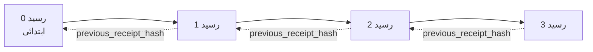

[سبق ویڈیو دیکھیں: کریپٹوگرافک رسیدوں کے ساتھ AI ایجنٹس کی حفاظت](https://youtu.be/PLACEHOLDER_VIDEO_ID)

> _(سبق ویڈیو اور تھمبنیل کو Microsoft مواد ٹیم جانب سے مرج کے بعد شامل کیا جائے گا، سبق 14 / 15 کے نمونہ کے مطابق۔)_

# کریپٹوگرافک رسیدوں کے ساتھ AI ایجنٹس کی حفاظت

## تعارف

یہ سبق درج ذیل موضوعات کا احاطہ کرے گا:

- AI ایجنٹس کے لئے آڈٹ ٹریل کیوں تعمیل، ڈیبگنگ، اور اعتماد کے لیے اہم ہے۔
- کریپٹوگرافک رسید کیا ہے اور یہ بغیر دستخط کی گئی لاگ لائن سے کیسے مختلف ہے۔
- ایک ایجنٹ کے ٹول کال کے لئے سادہ Python میں دستخط شدہ رسید کیسے تیار کی جائے۔
- آف لائن رسید کو کیسے تصدیق کیا جائے اور جعلسازی کی نشاندہی کیسے کی جائے۔
- رسیدوں کو چین میں کیسے جوڑا جائے تاکہ ایک کو ہٹانے یا ترتیب بدلنے سے چین ٹوٹ جائے۔
- رسیدیں کیا ثابت کرتی ہیں اور واضح طور پر کیا ثابت نہیں کرتیں۔

## تعلیمی مقاصد

اس سبق کو مکمل کرنے کے بعد، آپ جانیں گے کہ کیسے:

- ایجنٹ کے اعمال کے لیے کریپٹوگرافک پروویننس کی ترغیب دینے والے ناکامی کے طریقوں کی شناخت کریں۔
- Ed25519 سے دستخط شدہ رسید ایک معیاری JSON پے لوڈ پر تیار کریں۔
- صرف دستخط کنندہ کی پبلک کی کا استعمال کرکے رسید کی آزادانہ تصدیق کریں۔
- ترمیم شدہ رسید پر دوبارہ تصدیق کرنے سے جعلسازی کو دریافت کریں۔
- رسیدوں کے ہیش چین شدہ سلسلے کو بنائیں اور بیان کریں کہ یہ چین کیوں اہم ہے۔
- ان حدود کو پہچانیں جن میں رسیدیں کیا ثابت کرتی ہیں (منسوبیت، سالمیت، ترتیب) اور کیا ثابت نہیں کرتیں (عمل کی درستگی، پالیسی کی صحت مندی)۔

## مسئلہ: آپ کے ایجنٹ کا آڈٹ ٹریل

تصور کریں کہ آپ نے Contoso Travel کے لیے ایک AI ایجنٹ تعینات کیا ہے۔ ایجنٹ صارف کی درخواستیں پڑھتا ہے، فلائٹس API کو کال کرکے اختیارات دیکھتا ہے، اور صارف کی جانب سے سیٹیں بک کرتا ہے۔ پچھلے سہ ماہی میں، ایجنٹ نے 50,000 بکنگز کی پروسیسنگ کی۔

آج ایک آڈیٹر آتا ہے۔ وہ ایک آسان سوال پوچھتا ہے: "بتائیں آپ کا ایجنٹ نے کیا کیا۔"

آپ اپنی لاگ فائلز دے دیتے ہیں۔ آڈیٹر انہیں دیکھتا ہے اور ایک مشکل سوال پوچھتا ہے: "میں کیسے جانوں کہ ان لاگز میں کوئی ترمیم نہیں ہوئی؟"

یہ آڈٹ ٹریل کا مسئلہ ہے۔ آج کل زیادہ تر ایجنٹ تعیناتیوں پر انحصار ہوتا ہے:

- **اپلیکیشن لاگز**: ایجنٹ خود لکھتا ہے، فائل سسٹم کی رسائی رکھنے والا کوئی بھی ایڈیٹ کر سکتا ہے۔
- **کلاؤڈ لاگنگ سروسز**: پلیٹ فارم کی سطح پر جعلسازی کو ظاہر کرتے ہیں مگر صرف اس وقت جب آڈیٹر پلیٹ فارم آپریٹر پر اعتماد کرے۔
- **ڈیٹا بیس ٹرانزیکشن لاگز**: ڈیٹا بیس تبدیلیوں کے لیے مناسب مگر arbitrary ٹول کالز کے لیے نہیں۔

ان میں سے کوئی بھی آڈیٹر کے سوال کا جواب نہیں دے سکتا بغیر اس کے کہ آڈیٹر کسی پر اعتماد کرے (آپ، آپ کا کلاؤڈ فراہم کنندہ، آپ کا ڈیٹا بیس فروش)۔ داخلی استعمال کے لیے یہ اعتماد قابل قبول ہوتا ہے۔ ریگولیٹڈ کام (فائنانس، صحت کی دیکھ بھال، EU AI Act کے تابع کچھ بھی) میں ایسا نہیں ہوتا۔

کریپٹوگرافک رسیدیں یہ مسئلہ حل کرتی ہیں کیونکہ ہر ایجنٹ کے عمل کی آزادانہ تصدیق ممکن ہوتی ہے۔ آڈیٹر کو آپ پر اعتماد کرنے کی ضرورت نہیں۔ انہیں صرف آپ کی پبلک کی اور رسید کی ضرورت ہوتی ہے۔

## کریپٹوگرافک رسید کیا ہے؟

رسید ایک JSON آبجیکٹ ہے جو ایجنٹ کے کیے گئے عمل کو ریکارڈ کرتا ہے، جس پر ڈیجیٹل دستخط کیے گئے ہیں۔


ایک مختصر رسید اس طرح نظر آتی ہے:

```json
{
  "type": "agent.tool_call.v1",
  "agent_id": "contoso-travel-bot",
  "tool_name": "lookup_flights",
  "tool_args_hash": "sha256:a3f9c1...",
  "result_hash": "sha256:7b2e1d...",
  "policy_id": "contoso-travel-policy-v3",
  "timestamp": "2026-04-25T14:30:00Z",
  "sequence": 47,
  "previous_receipt_hash": "sha256:9d4e6a...",
  "signature": {
    "alg": "EdDSA",
    "sig": "c5af83...",
    "public_key": "8f3b2c..."
  }
}
```

تین خصوصیات کام کر رہی ہیں:

1. **دستخط**۔ رسید ایجنٹ کے گیٹ وے کی طرف سے Ed25519 پرائیویٹ کی سے دستخط کی جاتی ہے۔ کسی بھی شخص کے پاس متعلقہ پبلک کی کے ذریعے دستخط کو آف لائن تصدیق کیا جا سکتا ہے۔ کسی بھی فیلڈ میں جعلسازی دستخط کو غیر معتبر بنا دیتی ہے۔

2. **معیاری انکوڈنگ**۔ دستخط سے پہلے، رسید JSON Canonicalization Scheme (JCS، RFC 8785) کا استعمال کرتے ہوئے سیریلائز کی جاتی ہے۔ یہ یقینی بناتا ہے کہ دو مختلف نفاذات جو وہی منطقی رسید تیار کرتے ہیں، بائٹ کی حد تک ایک جیسا آؤٹ پٹ دیں۔ بغیر معیاری بنانے کے، مختلف JSON سیریلائزرز ایک ہی مواد کے لیے مختلف دستخط پیدا کرتے۔

3. **ہیش چیننگ**۔ `previous_receipt_hash` فیلڈ ہر رسید کو اس سے پہلے والی رسید سے جوڑتی ہے۔ ایک رسید کو ہٹانے یا ترتیب بدلنے سے ہر اس کے بعد آنے والی رسید متاثر ہوتی ہے۔ اگرچہ انفرادی دستخطوں کو نظر انداز کر دیا جائے، جعلی کاری چین کے سطح پر ظاہر ہو جاتی ہے۔

یہ خصوصیات مل کر تین ضمانتیں دیتی ہیں:

- **منسوبیت**: اس کی کے ذریعے اس مواد پر دستخط ہوا۔
- **سالمیت**: دستخط کے بعد سے مواد میں کوئی تبدیلی نہیں ہوئی۔
- **ترتیب**: یہ رسید اس چین میں اس سے پہلے والی رسید کے بعد آئی۔

## Python میں رسید تیار کرنا

رسید تیار کرنے کے لیے کسی خاص لائبریری کی ضرورت نہیں۔ کرپٹوگرافک بنیادیات عام دستیاب ہیں اور منطق چند عشرہ لائنز Python کی ہے۔

`code_samples/18-signed-receipts.ipynb` میں ہاتھوں سے کام کرنے کی مشقیں مکمل عمل کے ذریعے چلتی ہیں۔ خلاصہ شکل:

```python
import json
import hashlib
import base64
from nacl import signing
from jcs import canonicalize  # آر ایف سی 8785 معیاری جیسن

def b64url_nopad(data: bytes) -> str:
    return base64.urlsafe_b64encode(data).decode("ascii").rstrip("=")

def sha256_canonical(obj) -> str:
    """SHA-256 of a Python object's JCS-canonical JSON form."""
    return f"sha256:{hashlib.sha256(canonicalize(obj)).hexdigest()}"

# دستخط کی کلید تیار کریں یا لوڈ کریں (پیداوار میں، اسے کی وولٹ میں محفوظ کریں)
signing_key = signing.SigningKey.generate()
verify_key = signing_key.verify_key

# رسیدی مواد تیار کریں (ابھی دستخط نہیں ہے)
tool_args = {"origin": "SYD", "destination": "LAX"}
tool_result = [{"flight": "QF11", "price": 1850, "stops": 0}]

payload = {
    "type": "agent.tool_call.v1",
    "agent_id": "contoso-travel-bot",
    "tool_name": "lookup_flights",
    "tool_args_hash": sha256_canonical(tool_args),
    "result_hash": sha256_canonical(tool_result),
    "policy_id": "contoso-travel-policy-v3",
    "timestamp": "2026-04-25T14:30:00Z",
    "sequence": 0,
    "previous_receipt_hash": None,
}

# معیاری بنائیں، ہیش کریں، دستخط کریں۔
canonical_bytes = canonicalize(payload)
message_hash = hashlib.sha256(canonical_bytes).digest()
signature_bytes = signing_key.sign(message_hash).signature

# ایک منظم دستخطی آبجیکٹ منسلک کریں۔
receipt = {
    **payload,
    "signature": {
        "alg": "EdDSA",
        "sig": b64url_nopad(signature_bytes),
        "public_key": b64url_nopad(bytes(verify_key)),
    },
}
```

یہ پورا دستخطی عمل ہے۔ نوٹ بک میں ہر قدم کی وضاحت کی گئی ہے۔

## رسید کی توثیق اور جعلسازی کی نشاندہی

تصدیق معکوس عمل ہے:

```python
import base64
import hashlib
from nacl import signing
from nacl.exceptions import BadSignatureError
from jcs import canonicalize

def b64url_decode(s: str) -> bytes:
    padding = "=" * ((4 - len(s) % 4) % 4)
    return base64.urlsafe_b64decode(s + padding)

def verify_receipt(receipt: dict) -> bool:
    # دستخط ایک منظم شے ہے: {"alg", "sig", "public_key"}۔
    sig_obj = receipt.get("signature")
    if not sig_obj or sig_obj.get("alg") != "EdDSA":
        return False

    # اصل میں دستخط شدہ پیلوڈ کو دوبارہ تشکیل دیں (دستخط کے علاوہ سب کچھ)۔
    payload = {k: v for k, v in receipt.items() if k != "signature"}

    canonical_bytes = canonicalize(payload)
    message_hash = hashlib.sha256(canonical_bytes).digest()

    try:
        verify_key = signing.VerifyKey(b64url_decode(sig_obj["public_key"]))
        verify_key.verify(message_hash, b64url_decode(sig_obj["sig"]))
        return True
    except BadSignatureError:
        return False
```

یہ فنکشن ایک رسید لیتا ہے اور `True` لوٹاتا ہے اگر دستخط درست ہو، ورنہ `False`۔ کوئی نیٹ ورک کال نہیں، کوئی سروس انحصار نہیں، کسی تیسرے فریق پر اعتماد کی ضرورت نہیں۔

جعلی کاری کا پتہ چلانے کے لیے نوٹ بک میں دکھایا جاتا ہے:

1. ایک درست رسید تیار کرنا اور اس کی تصدیق کی تصدیق کرنا۔
2. `tool_args_hash` فیلڈ میں ایک بائٹ کی ترمیم کرنا۔
3. دوبارہ تصدیق کی کوشش کرنا اور ناکامی دیکھنا۔

یہ عملی مظاہرہ ہے کہ رسیدیں جعلسازی ظاہر کرتی ہیں: کوئی بھی معمولی تبدیلی دستخط کو توڑ دیتی ہے۔

## ملٹی-اسٹیپ ایجنٹس کے لیے رسیدوں کا سلسلہ

ایک واحد دستخط شدہ رسید ایک عمل کی حفاظت کرتی ہے۔ رسیدوں کی چین عملوں کے سلسلے کی حفاظت کرتی ہے۔



ہر رسید اس سے پہلے والی رسید کے ہیش کو ریکارڈ کرتی ہے۔ اگر حملہ آور چین کے درمیان سے رسید 2 کو چپکے سے نکالنا چاہتا ہے، تو اسے یا تو:

- رسید 3 کے `previous_receipt_hash` فیلڈ میں ترمیم کرنی ہوگی (جس سے رسید 3 کے دستخط ٹوٹ جاتے ہیں)، یا
- ترمیم شدہ رسید 3 پر نیا دستخط جعلساز کی طرف سے تیار کرنا ہوگا (جو ایجنٹ کی پرائیویٹ کی چاہتا ہے)۔

اگر پرائیویٹ کی ہارڈویئر کی والٹ میں محفوظ ہے اور آپ ہر رسید کے ساتھ پبلک کی شائع کرتے ہیں، تو کوئی بھی حملہ بغیر پکڑے ممکن نہیں۔

نوٹ بک میں یہ دکھایا گیا ہے:

1. تین رسیدوں کی چین بنانا۔
2. تصدیق کرنا کہ ہر رسید کا `previous_receipt_hash` اصل رسید کے ہیش سے میل کھاتا ہے۔
3. درمیان میں ایک رسید کو جعلسازی کرنا اور دیکھنا کہ چین اسی جگہ پر ٹوٹتی ہے۔

یہی وہ طریقہ ہے جس سے آپ ایک ایسا آڈٹ ٹریل فراہم کرتے ہیں جسے بیرونی آڈیٹر آپ پر اعتماد کیے بغیر تصدیق کر سکتا ہے۔

## رسیدیں کیا ثابت کرتی ہیں (اور کیا نہیں)

یہ سبق کا سب سے اہم حصہ ہے۔ رسیدیں طاقتور ہیں مگر ان کی طاقت محدود ہے۔

**رسیدیں تین چیزیں ثابت کرتی ہیں:**

1. **منسوبیت**: ایک مخصوص کی نے مخصوص پے لوڈ پر دستخط کیا۔
2. **سالمیت**: پے لوڈ دستخط کے بعد تبدیل نہیں ہوا۔
3. **ترتیب**: یہ رسید اس رسید کے بعد آئی جو چین میں پہلے تھی۔

**رسیدیں ثابت نہیں کرتیں:**

1. **درستی**: کہ ایجنٹ کا عمل درست تھا۔ غلط جواب کے لیے بھی رسید دستخط کی جا سکتی ہے ویسے ہی جیسے درست جواب کے لیے۔
2. **پالیسی کی تعمیل**: کہ `policy_id` میں درج پالیسی واقعی پرکھی گئی یا یہ کہ اگر پرکھی جاتی تو یہ عمل ممکن ہوتا۔ رسید صرف دعوے ریکارڈ کرتی ہے، نافذ نہیں۔
3. **کی سے آگے شناخت**: رسید کہتی ہے "یہ کی نے یہ مواد دستخط کیا۔" یہ نہیں کہتی "اس شخص نے اجازت دی۔" کی کو کسی شخص یا ادارے سے منسلک کرنے کے لیے الگ شناخت کا نظام چاہیے۔
4. **ان پٹ کی صداقت**: اگر ایجنٹ کو غلط پرامپٹ ملے اور وہ عمل کرے، رسید عمل کو درست ریکارڈ کرتی ہے۔ رسید ان پٹ کی تصدیق کی جگہ نہیں بلکہ ان پٹ ویلیڈیشن کے بعد ہوتی ہے۔

یہ حد درج ذیل دو وجوہات کے لیے اہم ہے:

- یہ بتاتی ہے کہ رسیدیں کن کاموں کے لیے مفید ہیں: ایجنٹ کے رویے کی آڈیٹیبل اور جعلسازی ظاہر کرنے والی بنانا، حتیٰ کہ تنظیمی حدود کے پار۔
- یہ بتاتی ہے کہ آپ کو مزید کون سی تہیں درکار ہیں: ان پٹ ویلیڈیشن (سبق 6)، پالیسی نفاذ (نیچے مختصراً)، اور شناختی نظام (اس سبق سے باہر)۔

ایک عام غلط فہمی یہ ہے کہ "ہمارے پاس رسیدیں ہیں" مطلب "ہم ضابطہ کے پابند ہیں۔" یہ درست نہیں۔ رسیدیں بنیاد فراہم کرتی ہیں۔ ضابطہ وہ نظام ہے جو آپ اس بنیاد پر بناتے ہیں۔

## پیداوار کے حوالے

اس سبق کا Python کوڈ جان بوجھ کر بہت مختصر ہے تاکہ آپ ہر لائن پڑھ کر بالکل سمجھ سکیں کہ کیا ہو رہا ہے۔ پیداوار میں، آپ کے پاس دو اختیارات ہیں:

1. **کریپٹوگرافک بنیادیات پر براہ راست تعمیر کریں۔** اوپر دسی گئی 50 لائنز بہت سے استعمالات کے لیے کافی ہیں۔ PyNaCl (Ed25519) اور `jcs` پیکج (معیاری JSON) اچھی طرح سے دیکھ بھال شدہ اور آڈٹ شدہ لائبریریاں ہیں۔

2. **پیداواری رسید لائبریری استعمال کریں۔** کئی اوپن سورس پروجیکٹس اسی پیٹرن کو اضافی خصوصیات کے ساتھ نافذ کرتے ہیں (کی روٹیشن، بیچ تصدیق، JWK سیٹ کی تقسیم، پالیسی انجنز کے ساتھ انضمام):
   - اس سبق میں استعمال شدہ رسید فارمیٹ IETF انٹرنیٹ-ڈرافٹ (`draft-farley-acta-signed-receipts`) کے مطابق ہے جو اس وقت معیارات کی عمل میں ہے۔
   - Microsoft Agent Governance Toolkit رسیدوں کو Cedar-based پالیسی فیصلوں کے ساتھ کمپوز کرتا ہے؛ اس ریپوزٹری میں ٹیوٹوریل 33 میں اختتام سے اختتام کی مثال دیکھیں۔
   - `protect-mcp` (npm) اور `@veritasacta/verify` (npm) پیکجز رسید دستخط اور آف لائن تصدیق کی Node-based عمل درآمد فراہم کرتے ہیں، جو MCP سرور کو جعلسازی ظاہر کرنے والے آڈٹ ٹریل سے لپیٹنے کے لئے ہیں۔
   - **[nobulex](https://github.com/arian-gogani/nobulex)** Python SDK (`pip install nobulex`) Python میں LangChain اور CrewAI انضمام کے ساتھ وہی Ed25519 + JCS دستخطی پیٹرن فراہم کرتا ہے، بشمول شائع شدہ کراس-ویلیڈیشن ٹیسٹ ویکٹرز اور [OWASP PR #2210](https://github.com/OWASP/CheatSheetSeries/pull/2210) کے ذریعے تعاون شدہ تعمیل میپنگ۔

اپنا JWT لائبریری لکھنے اور ٹیسٹ شدہ لائبریری استعمال کرنے کے درمیان فیصلہ اسی طرح ہے: دونوں معقول ہیں؛ لائبریری وقت بچاتی ہے اور آڈٹ سطح کم کرتی ہے؛ خود سے بنانے کا طریقہ ہر بنیادی جز کو سمجھنے پر مجبور کرتا ہے۔ یہ سبق خود سے بنانے کا راستہ سکھاتا ہے تاکہ آپ کے پاس دونوں انتخابوں کے لیے بنیاد ہو۔

## علم کی جانچ

عملی مشق پر جانے سے پہلے اپنی سمجھ کو جانچیں۔

**1. رسید ایجنٹ کی پرائیویٹ Ed25519 کی سے دستخط کی جاتی ہے۔ آڈیٹر کے پاس صرف پبلک کی ہے۔ کیا آڈیٹر آف لائن رسید کی تصدیق کر سکتا ہے؟**

<details>
<summary>جواب</summary>

ہاں۔ Ed25519 کی تصدیق کے لیے صرف پبلک کی اور دستخط شدہ بائٹس درکار ہیں۔ کوئی نیٹ ورک کال، کوئی سروس انحصار نہیں۔ یہ وہ خصوصیت ہے جو رسیدوں کو ایئر-گیپڈ، کثیر تنظیمی، یا کم اعتماد والے آڈٹ ماحول میں مفید بناتی ہے۔
</details>

**2. ایک حملہ آور نے رسید کے `policy_id` فیلڈ میں ترمیم کرکے دعوی کیا کہ یہ زیادہ اجازت دینے والی پالیسی کے تابع تھا۔ دستخط اصل پے لوڈ پر تھی۔ تصدیق دوران کیا ہوتا ہے؟**

<details>
<summary>جواب</summary>

تصدیق ناکام ہو جاتی ہے۔ دستخط اصل پے لوڈ کے معیاری بائٹس پر کی گئی تھی؛ کسی بھی فیلڈ میں ترمیم معیاری بائٹس کو بدل دیتی ہے، جو SHA-256 ہیش کو بدلتی ہے، اور دستخط کو غلط بنا دیتی ہے۔ حملہ آور کو ایسی دستخط بنانے کے لیے پرائیویٹ کی درکار ہوگی، جو اس کے پاس نہیں ہے۔
</details>

**3. رسید میں `tool_args_hash` اور `result_hash` شامل ہیں، بجائے کہ خام دلائل اور نتائج کے۔ کیوں؟**

<details>
<summary>جواب</summary>

دو وجوہات۔ پہلی، رسید کو ایسے ماحول میں آرکائیو یا منتقل کرنا ہوتا ہے جہاں خام مواد (جیسے PII، تجارتی ڈیٹا) کا افشا مسئلہ ہو۔ ہیشنگ رسید کو چھوٹا اور مواد کو نجی رکھتی ہے؛ آڈیٹر ہیش کی مماثلت الگ محفوظ شدہ اصل مواد کے ساتھ چیک کرتا ہے۔ دوسری، ہیش کا حجم مقررہ ہوتا ہے؛ کچے ان پٹ اور آؤٹ پٹ کی بڑی مقدار کے باوجود رسید کا حجم محدود رہتا ہے۔
</details>

**4. `previous_receipt_hash` فیلڈ ہر رسید کو اس کے پیش رو سے جوڑتا ہے۔ اگر حملہ آور چین کے بیچ سے ایک رسید چپکے سے حذف کر دے تو کیا غلط ہو جاتا ہے؟**

<details>
<summary>جواب</summary>

ہر وہ رسید جو حذف شدہ رسید کے بعد آئی تھی۔ ان کے `previous_receipt_hash` اب اصل چین سے مطابقت نہیں رکھتے (کیونکہ وہ رسید جسے حوالہ دیا گیا تھا وہ موجود نہیں یا چین اب مختلف پیش رو کی طرف اشارہ کرتی ہے)۔ حذف چھپانے کے لئے، حملہ آور کو ہر بعد کی رسید کو دوبارہ دستخط کرنا ہوگا، جس کے لیے پرائیویٹ کی درکار ہوگی۔
</details>

**5. رسید کی تصدیق کامیاب ہو گئی۔ کیا یہ ثابت کرتا ہے کہ ایجنٹ کا عمل درست، صحیح، یا پالیسی کے مطابق تھا؟**

<details>
<summary>جواب</summary>

نہیں۔ درست رسید تین چیزیں ثابت کرتی ہے: منسوبیت (یہ کی نے یہ مواد دستخط کیا)، سالمیت (مواد بدلا نہیں گیا)، اور ترتیب (یہ رسید اس رسید کے بعد آئی)۔ یہ ثابت نہیں کرتی کہ عمل درست تھا، `policy_id` میں دی گئی پالیسی واقعی پرکھی گئی، یا ایجنٹ نے ہر قاعدے کی پاسداری کی۔ رسیدیں ایجنٹ کے رویے کی آڈیٹیبل بناتی ہیں، ضروری نہیں کہ درست۔ یہ سبق کی سب سے اہم حد ہے۔
</details>

## عملی مشق

`code_samples/18-signed-receipts.ipynb` کھولیں اور چاروں حصے مکمل کریں:

1. **حصہ 1**: اپنی پہلی رسید پر دستخط کریں اور اس کی تصدیق کریں۔
2. **حصہ 2**: رسید میں جعلسازی کریں اور تصدیق کے ناکام ہونے کا مشاہدہ کریں۔
3. **حصہ 3**: تین رسیدوں کی چین بنائیں اور چین کی سالمیت کی تصدیق کریں۔
4. **حصہ 4**: Microsoft Agent Framework سے بنے ایجنٹ پر پیٹرن کو لگائیں: رسید دستخط کے ساتھ ٹول کال لپیٹیں، پھر رسید کی آزادانہ تصدیق کریں۔
**اسٹریچ چیلنج 1:** رسید کے اسکیما میں ایک اضافی فیلڈ شامل کریں جو آپ خود منتخب کریں (مثلاً، ٹریسنگ کے لیے ایک درخواست شناختی نمبر)، قواعدی دستخطی منطق کو اپ ڈیٹ کریں تاکہ اسے شامل کیا جا سکے، اور اس بات کی تصدیق کریں کہ رسید تصدیق کے عمل سے گزرنے کے بعد بھی درست رہتی ہے۔ پھر دستخط کے بعد اس فیلڈ کو تبدیل کریں اور تصدیق کے ناکام ہونے کی تصدیق کریں۔ یہ عمل آپ کو یہ سمجھنے پر مجبور کرتا ہے کہ قواعدی اینکوڈنگ کے ہر بائٹ کا دستخط پر کس طرح اثر پڑتا ہے۔

**اسٹریچ چیلنج 2:** اپنی دو رسیدوں کو SHA-256 کے ذریعے ہیش کریں (ان کے قواعدی بائٹس کو متعین ترتیب میں جوڑیں) اور حاصل ہونے والے خلاصے کو تیسری رسید پر ایک نئے فیلڈ کے طور پر ڈالیں اس سے پہلے کہ اسے دستخط کیا جائے۔ تصدیق کریں کہ تینوں رسیدیں اب بھی درست ہیں۔ آپ نے ابھی ایک قدمی شمولیت کا ثبوت تیار کیا ہے: جو بھی تیسری رسید رکھتا ہے وہ ثابت کر سکتا ہے کہ پہلی دو رسیدیں دستخط کے وقت موجود تھیں، بغیر ان کے مواد کو ظاہر کیے۔ یہی پیٹرن اسکیل پر منتخب انکشاف رسیدوں میں استعمال ہوتا ہے (مرکل کمیٹمنٹس، RFC 6962)۔

## نتیجہ

کریپٹوگرافک رسیدیں AI ایجنٹس کو ایک آڈٹ ٹریل دیتی ہیں جو:

- **آزادانہ تصدیق ہو سکنے والی:** عوامی کلید رکھنے والا کوئی بھی فریق تصدیق کر سکتا ہے، کوئی سروس انحصار نہیں۔
- **چالاکی کے ثبوت کے ساتھ:** کوئی بھی تبدیلی دستخط کو باطل کر دیتی ہے۔
- **قابلِ منتقلی:** رسید ایک چھوٹا JSON فائل ہوتا ہے؛ اسے کہیں بھی محفوظ، منتقل اور تصدیق کیا جا سکتا ہے۔
- **معیاریوں کے مطابق:** Ed25519 (RFC 8032)، JCS (RFC 8785)، اور SHA-256 پر مبنی، جو سب بڑے پیمانے پر استعمال ہونے والے پرمیٹیوز ہیں۔

یہ ان پٹ کی تصدیق، پالیسی کے نفاذ، یا شناخت کے انفراسٹرکچر کا متبادل نہیں ہیں۔ یہ ان پرتوں کے لیے بنیاد ہیں۔ جب آپ ایجنٹس کو منظم شدہ کاموں، متعدد تنظیمی ورک فلو، یا کسی ایسی جگہ پر تعینات کر رہے ہوں جہاں مستقبل کا آڈیٹر آپ پر اعتماد کرنے کا مفروضہ نہ رکھتا ہو، رسیدیں وہ طریقہ ہیں جن سے آپ آڈٹ ٹریل کو ایماندار بناتے ہیں۔

سب سے اہم نکتہ: رسیدیں ثابت کرتی ہیں کہ کس نے کیا کہا اور کب کہا۔ وہ یہ نہیں ثابت کرتیں کہ جو کہا گیا وہ درست یا سچ تھا۔ اس فرق کو سختی سے مدنظر رکھیں۔ یہی فرق ایک ایماندار پرووینینس سسٹم اور گمراہ کن سسٹم کے مابین ہوتا ہے۔

## پروڈکشن چیک لسٹ

جب آپ اس سبق سے فارغ ہو کر رسید دستخط شدہ ایجنٹس کو حقیقی ماحول میں تعینات کرنے کے لیے تیار ہوں:

- [ ] **دستخطی کلید کو ڈویلپر لیپ ٹاپ سے ہٹا دیں۔** Azure Key Vault، AWS KMS، یا ہارڈویئر سیکیورٹی ماڈیول استعمال کریں۔ آپ کی نجی کلید جو رسیدوں پر دستخط کرتی ہے کبھی بھی سورس کنٹرول یا ایپلیکیشن مشینوں پر سادہ متن میں محفوظ نہیں ہونی چاہیے۔
- [ ] **تصدیق کرنے والی عوامی کلید شائع کریں۔** آڈیٹرز کو آف لائن تصدیق کے لیے ضرورت ہوتی ہے۔ معیار کے مطابق طریقہ ایک JWK سیٹ ہے جو کسی معروف URL پر موجود ہو (RFC 7517)، مثلاً `https://your-org.example.com/.well-known/agent-keys.json`۔
- [ ] **چین کو بیرونی طور پر اینکر کریں۔** وقفے وقفے سے تازہ ترین چین ہیڈ ہیش کو شفافیت لاگ میں لکھیں (Sigstore Rekor، RFC 3161 ٹائم اسٹیمپ اتھارٹی، یا دوسرا اندرونی نظام) تاکہ کوئی بیرونی فریق تصدیق کر سکے "یہ چین اس وقت موجود تھی"۔
- [ ] **رسیدوں کو ناقابل تبدیلی ذخیرہ میں رکھیں۔** Append-only blob اسٹوریج (Azure Storage بشمول امیوٹابیلیٹی پالیسیز، AWS S3 آبجیکٹ لاک) داخلی صارف کو ذخیرہ کی تہہ پر تاریخ کو دوبارہ لکھنے سے روکتا ہے۔
- [ ] **رکھاوٹ کا فیصلہ کریں۔** کئی تعمیل کے نظام کئی سالوں تک رکھنے کی ضرورت رکھتے ہیں۔ رسیدوں کی بڑھوتری کے لیے منصوبہ بندی کریں (ہر رسید تقریباً 500 بائٹس کا ہوتا ہے؛ ایک ایجنٹ جو روزانہ 10,000 کالز کرتا ہے سالانہ تقریباً 1.8 جی بی پیدا کرتا ہے)۔
- [ ] **دستاویز کریں کہ رسیدیں کیا شامل نہیں ہوتیں۔** رسیدیں نسبت، سالمیت، اور ترتیب کا ثبوت دیتی ہیں۔ آپ کا رن بک واضح طور پر بیان کرے کہ کون سے اضافی کنٹرولز (ان پٹ ویلیڈیشن، پالیسی نفاذ، ریٹ لمٹنگ، شناخت انفراسٹرکچر) رسیدوں کے ساتھ آپ کی گورننس پوزیشن میں شامل ہیں۔

### AI ایجنٹس کی سیکورٹی پر مزید سوالات ہیں؟

[Microsoft Foundry Discord](https://aka.ms/ai-agents/discord) میں شامل ہوں جہاں آپ دیگر سیکھنے والوں سے ملاقات کر سکتے ہیں، آفس آورز میں شرکت کر سکتے ہیں، اور اپنے AI ایجنٹس کے سوالات کے جوابات حاصل کر سکتے ہیں۔

## اس سبق سے آگے

یہ سبق سنگل رسید دستخط اور ہیش چینڈ سلسلوں کا احاطہ کرتا ہے۔ وہی پرمیٹیوز کئی مزید جدید پیٹرنز میں مل کر ایسے طاقت ور نمونے بناتے ہیں جن سے آپ اپنی گورننس پوزیشن کی ترقی کے دوران مل سکتے ہیں:

- **منتخب انکشاف۔** جب رسید کے فیلڈز آزادانہ طور پر کمیٹ کیے جاتے ہیں (RFC 6962 طرز کا مرکل درخت)، آپ مخصوص آڈیٹروں کو مخصوص فیلڈز ظاہر کر سکتے ہیں اور باقی فیلڈز کو بغیر ظاہر کیے ثابت کر سکتے ہیں کہ وہ تبدیل نہیں ہوئے۔ یہ تب مفید ہوتا ہے جب ایک ہی رسید کو ایک جامع آڈٹ (جو مکملات چاہتا ہے) اور ڈیٹا کم از کم کرنے والے ضوابط جیسے GDPR (جو آڈیٹر کو صرف جتنا ضروری ہو دکھانا چاہتا ہے) دونوں کو پورا کرنا ہو۔
- **رسید منسوخی۔** اگر دستخطی کلید متاثر ہو جائے تو آپ کو اس کلید سے دستخط کی گئی تمام رسیدوں کو ایک نقطہ وقت سے غیر معتبر قرار دینے کا طریقہ چاہیے۔ عام طریقے: قلیل مدت دستخطی کلیدیں اور شائع شدہ منسوخی فہرست، یا شفافیت لاگ میں منسوخی درج۔
- **دوطرفہ / تقسیم شدہ دستخط رسیدیں۔** کچھ نفاذ شدہ نظام دستخط شدہ مواد کو اجرا سے پہلے (`authorization_*`) اور اجرا کے بعد (`result_*`) نصفوں میں تقسیم کرتے ہیں، ہر ایک کا الگ دستخط ہوتا ہے، یہ اس وقت مفید ہوتا ہے جب اجازت کا فیصلہ اور مشاہد شدہ نتیجہ مختلف فریقوں یا مختلف اوقات میں تیار ہوں۔ یہ سبق میں سکھائے گئے رسید فارمیٹ پر اضافی طور پر مرکب کیا جا سکتا ہے۔
- **مواد کی ترتیب۔** رسید اس کی سچویشن کو مہر بند کرتی ہے جو آپ `result_hash` میں رکھتے ہیں۔ حقیقی دنیا کے مواد اکثر ایک سادہ ٹول کال کے نتیجے سے زیادہ پیچیدہ ہوتے ہیں: فیصلے سے پہلے کی منطق (ماڈل کی پیشگوئی، زیر غور اختیارات، ثبوت اور اس کی مکملات، خطرے کی پوزیشن، احتساب چین، گيٹ آؤٹ کم) سب مواد کے اندر ہو سکتے ہیں جو ایک رسید سے مہر بند ہوئے ہوتے ہیں۔ اس سے رسید کی ترتیب سادہ رہتی ہے جبکہ مواد کے اسکیما ڈومین بہ ڈومین ترقی کرتے رہتے ہیں۔
- **کراس-نفاذ تعمیل۔** متعدد آزاد نفاذ شدہ نظام ایک ہی رسید فارمیٹ کو (Python، TypeScript، Rust، Go) استعمال کر کے مشترکہ ٹیسٹ ویکٹروں کے خلاف خود کو چیک کرتے ہیں۔ اگر آپ اپنا نفاذ بنائیں تو شائع شدہ ویکٹرز کے خلاف تصدیق وائر مطابقت کی تصدیق کرتی ہے۔
- **بعد از کوانٹم منتقلی۔** Ed25519 آج کل بڑے پیمانے پر استعمال ہوتا ہے لیکن کوانٹم مخالف نہیں ہے۔ رسید فارمیٹ الگوردمی لچکدار ہے: `signature.alg` فیلڈ `ML-DSA-65` (NIST کا بعد از کوانٹم دستخط معیار) لے سکتا ہے جب آپ کو منتقلی کی ضرورت ہو۔ ایک عارضی مدت کے لیے منصوبہ بندی کریں جہاں رسیدیں دوہری دستخط ہوتی ہیں۔

## اضافی وسائل

- <a href="https://datatracker.ietf.org/doc/draft-farley-acta-signed-receipts/" target="_blank">IETF انٹرنیٹ ڈرافٹ: مشین ٹو مشین رسائی کنٹرول کے لیے دستخط شدہ فیصلہ رسیدیں</a>
- <a href="https://learn.microsoft.com/azure/ai-studio/responsible-use-of-ai-overview" target="_blank">ذمہ دار AI کا جائزہ (Azure AI)</a>
- <a href="https://datatracker.ietf.org/doc/html/rfc8032" target="_blank">RFC 8032: ایڈورڈز کرور ڈیجیٹل سائنچر الگورتھم (EdDSA)</a>
- <a href="https://datatracker.ietf.org/doc/html/rfc8785" target="_blank">RFC 8785: JSON Canonicalization اسکیم (JCS)</a>
- <a href="https://datatracker.ietf.org/doc/html/rfc6962" target="_blank">RFC 6962: سرٹیفکیٹ ٹرانسپیرنسی</a> (منتخب انکشاف رسیدوں میں استعمال ہونے والا مرکل درخت)
- <a href="https://github.com/microsoft/agent-governance-toolkit/blob/main/docs/tutorials/33-offline-verifiable-receipts.md" target="_blank">Microsoft Agent Governance Toolkit، سبق 33: آف لائن تصدیق پذیر فیصلہ رسیدیں</a>
- <a href="https://github.com/ScopeBlind/agent-governance-testvectors" target="_blank">کراس-نفاذ تعمیل کے ٹیسٹ ویکٹرز</a> اس سبق میں استعمال ہونے والے رسید فارمیٹ کے لیے (Apache-2.0)
- <a href="https://pynacl.readthedocs.io/" target="_blank">PyNaCl دستاویزات</a> (Python میں Ed25519)

## پچھلا سبق

[کمپیوٹر یوز ایجنٹس بنانا (CUA)](../15-browser-use/README.md)

## اگلا سبق

_(نصاب منتظمین کے ذریعہ طے کیا جائے گا)_

---

<!-- CO-OP TRANSLATOR DISCLAIMER START -->
**ڈس کلیمر**:
یہ دستاویز AI ترجمہ سروس [Co-op Translator](https://github.com/Azure/co-op-translator) کے ذریعے ترجمہ کی گئی ہے۔ جبکہ ہم درستگی کے لیے کوشاں ہیں، براہ کرم اس بات سے آگاہ رہیں کہ خودکار ترجمے میں غلطیاں یا عدم درستیاں ہو سکتی ہیں۔ اصل دستاویز اپنے مادری زبان میں مستند ماخذ سمجھی جائے گی۔ حساس معلومات کے لیے پیشہ ور انسانی ترجمہ کی سفارش کی جاتی ہے۔ اس ترجمے کے استعمال سے پیدا ہونے والی کسی بھی غلط فہمی یا غلط تشریح کی ذمہ داری ہم قبول نہیں کرتے۔
<!-- CO-OP TRANSLATOR DISCLAIMER END -->