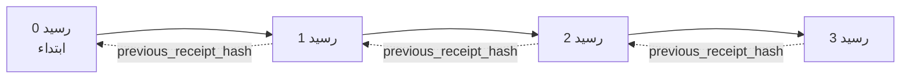

[سبق کا ویڈیو دیکھیں: کریپٹوگرافک رسیدوں کے ساتھ AI ایجنٹس کی حفاظت](https://youtu.be/PLACEHOLDER_VIDEO_ID)

> _(سبق کا ویڈیو اور تھمب نیل مائیکروسافٹ مواد ٹیم کے ذریعہ مرج کے بعد شامل کیا جائے گا، سبق 14 / 15 کے پیٹرن سے میل کھاتا ہے۔)_

# کریپٹوگرافک رسیدوں کے ساتھ AI ایجنٹس کی حفاظت

## تعارف

یہ سبق شامل کرے گا:

- AI ایجنٹس کے آڈٹ ٹریلز کی اہمیت موافقت، ڈیبگنگ، اور اعتماد کے لیے۔
- کریپٹوگرافک رسید کیا ہے اور یہ غیر دستخط شدہ لاگ لائن سے کیسے مختلف ہے۔
- کسی ایجنٹ کے ٹول کال کے لیے دستخط شدہ رسید کو سادہ Python میں کیسے تیار کیا جائے۔
- اسے آف لائن کیسے تصدیق کریں اور چالاکی کی پہچان کریں۔
- رسیدوں کو چین کرنے کا طریقہ تاکہ ایک کو ہٹانے یا ترتیب بدلنے سے چین ٹوٹ جائے۔
- رسید کیا ثابت کرتی ہیں اور وہ صراحتاً کیا نہیں ثابت ہوتیں۔

## سیکھنے کے اہداف

اس سبق کو مکمل کرنے کے بعد، آپ جان سکیں گے کہ کیسے:

- ناکامی کے ایسے طریقے شناخت کریں جو ایجنٹ کے اعمال کے لیے کریپٹوگرافک ماخذ کی حوصلہ افزائی کرتے ہیں۔
- Ed25519 دستخط شدہ رسید تیار کریں جس میں ایک canonical JSON پیلوڈ شامل ہو۔
- وصول کنندہ کی عوامی کلید استعمال کرتے ہوئے رسید کی آزادانہ تصدیق کریں۔
- کسی ترمیم شدہ رسید پر دوبارہ تصدیق کرکے چالاکی کا پتہ لگائیں۔
- رسیدوں کی ایک ہیش-چین شدہ ترتیب بنائیں اور وضاحت کریں کہ چین کیوں اہم ہے۔
- یہ پہچانیں کہ رسید کیا ثابت کرتی ہیں (منصوبہ بندی، سالمیت، ترتیب) اور وہ کیا نہیں ثابت کرتیں (عمل کی درستگی، پالیسی کی مضبوطی)۔

## مسئلہ: آپ کے ایجنٹ کا آڈٹ ٹریل

تصور کریں کہ آپ نے Contoso Travel کے لیے ایک AI ایجنٹ تیا ر کیا ہے۔ یہ ایجنٹ صارفین کی درخواستیں پڑھتا ہے، فلائٹس API کال کرتا ہے آپشنز دیکھنے کے لیے، اور صارف کی طرف سے نشستیں بک کرتا ہے۔ پچھلے کوارٹر میں، یہ ایجنٹ 50,000 بکنگز پراسیس کر چکا ہے۔

آج ایک آڈیٹر آتا ہے۔ وہ ایک سادہ سوال پوچھتا ہے: "مجھے دکھائیں کہ آپ کا ایجنٹ کیا کیا۔"

آپ اپنے لاگ فائلز دے دیتے ہیں۔ آڈیٹر دیکھتا ہے اور مشکل سوال پوچھتا ہے: "میں کیسے جانوں کہ یہ لاگز ترمیم نہیں کیے گئے؟"

یہ آڈٹ ٹریل کا مسئلہ ہے۔ آج اکثر ایجنٹ ڈپلائمنٹ ان پر انحصار کرتے ہیں:

- **ایپلیکیشن لاگز**: ایجنٹ خود لکھتا ہے، فائل سسٹم تک رسائی رکھنے والا کوئی بھی ترمیم کر سکتا ہے۔
- **کلاؤڈ لاگنگ سروسز**: پلیٹ فارم سطح پر چالاکی کا پتہ چلتا ہے مگر صرف اگر آڈیٹر پلیٹ فارم آپریٹر پر بھروسہ کرتا ہو۔
- **ڈیٹا بیس ٹرانزیکشن لاگز**: ڈیٹا بیس تبدیلیوں کے لیے موزوں مگر عام ٹول کالز کے لیے نہیں۔

ان میں سے کوئی بھی آڈیٹر کے سوال کا جواب نہیں دے سکتا بغیر آڈیٹر کو کسی پر اعتماد کرنے کی ضرورت کے (آپ، آپ کا کلاؤڈ فراہم کنندہ، آپ کے ڈیٹا بیس فروخت کنندہ)۔ اندرونی استعمال کے لیے، یہ اعتماد اکثر قابل قبول ہوتا ہے۔ ریگولیٹڈ ورک لوڈز (مالیاتی، صحت کی دیکھ بھال، EU AI ایکٹ کے تحت) کے لیے نہیں۔

کریپٹوگرافک رسیدیں ہر ایجنٹ کے عمل کو آزادانہ طور پر قابل تصدیق بنا کر اس مسئلے کو حل کرتی ہیں۔ آڈیٹر کو آپ پر بھروسہ کرنے کی ضرورت نہیں۔ اسے صرف آپ کی عوامی کلید اور رسید چاہیے۔

## کریپٹوگرافک رسید کیا ہے؟

رسید ایک JSON آبجیکٹ ہے جو بتاتا ہے کہ ایجنٹ نے کیا کیا، اور اسے ڈیجیٹل دستخط کے ساتھ دستخط کیا گیا ہے۔


```mermaid
flowchart LR
    A[ایجنٹ ایک ٹول کو استعمال کرتا ہے] --> B[رسید کا پیلوڈ تیار کریں]
    B --> C[JSON کو RFC 8785 کے مطابق معیاری بنائیں]
    C --> E[Ed25519 کنونیکل بائٹس پر دستخط کریں]
    E --> F[دستخط کے ساتھ رسید]
    F --> G[آڈیٹر آف لائن تصدیق کرتا ہے]
    G --> H{کیا دستخط درست ہے؟}
    H -- yes --> I[معروضی ثبوت جو تبدیلی کو ظاہر کرے]
    H -- no --> J[رسید مسترد کردی گئی]
```

ایک سادہ رسید ایسا دکھتی ہے:

```json
{
  "type": "agent.tool_call.v1",
  "agent_id": "contoso-travel-bot",
  "tool_name": "lookup_flights",
  "tool_args_hash": "sha256:a3f9c1...",
  "result_hash": "sha256:7b2e1d...",
  "policy_id": "contoso-travel-policy-v3",
  "timestamp": "2026-04-25T14:30:00Z",
  "sequence": 47,
  "previous_receipt_hash": "sha256:9d4e6a...",
  "signature": {
    "alg": "EdDSA",
    "sig": "c5af83...",
    "public_key": "8f3b2c..."
  }
}
```

تین خصوصیات کام کر رہی ہیں:

1. **دستخط**۔ رسید ایجنٹ کے گیٹ وے کے ذریعہ Ed25519 پرائیویٹ کی سے دستخط کی جاتی ہے۔ جس کے پاس متعلقہ عوامی کلید ہو وہ آف لائن دستخط کی تصدیق کر سکتا ہے۔ کسی بھی فیلڈ میں چالاکی دستخط کو کالعدم کر دیتی ہے۔

2. **کینیونیکل اینکوڈنگ**۔ دستخط کرنے سے پہلے، رسید JSON Canonicalization Scheme (JCS، RFC 8785) استعمال کرتے ہوئے سیریلائز کی جاتی ہے۔ یہ یقینی بناتا ہے کہ دو الگ الگ نفاذات جو ایک ہی منطقی رسید بناتے ہیں، بائٹ کی سطح پر بالکل وہی آؤٹ پٹ بنائیں۔ بغیر کینیونیکلائزیشن کے، مختلف JSON سیریلائزرز ایک ہی مواد کے لیے مختلف دستخط بنائیں گے۔

3. **ہیش چیننگ**۔ `previous_receipt_hash` فیلڈ ہر رسید کو اس سے پہلے والی رسید سے جوڑتی ہے۔ ایک رسید کو ہٹانے یا ترتیب بدلنے سے اس کے بعد کی تمام رسیدیں ٹوٹ جاتی ہیں۔ چالاکی چین کی سطح پر بھی نظر آ جاتی ہے چاہے انفرادی دستخط کو عبور کیا جائے۔

یہ خصوصیات مل کر تین یقین دہانیاں فراہم کرتی ہیں:

- **منصوبہ بندی**: اس کلید نے اس مواد پر دستخط کیا۔
- **سالمیت**: دستخط کے بعد سے مواد میں کوئی تبدیلی نہیں ہوئی۔
- **ترتیب**: یہ رسید اس چین میں اس رسید کے بعد آئی۔

## Python میں رسید تیار کرنا

رسید تیار کرنے کے لیے کسی خاص لائبریری کی ضرورت نہیں۔ کریپٹوگرافک بنیادی اجزاء وسیع پیمانے پر دستیاب ہیں اور منطق چند درجن Python لائنوں پر مشتمل ہے۔

`code_samples/18-signed-receipts.ipynb` میں عملی مشقیں مکمل کراس کی مکمل رہنمائی کرتی ہیں۔ خلاصہ ورژن:

```python
import json
import hashlib
import base64
from nacl import signing
from jcs import canonicalize  # آر ایف سی 8785 معیاری JSON

def b64url_nopad(data: bytes) -> str:
    return base64.urlsafe_b64encode(data).decode("ascii").rstrip("=")

def sha256_canonical(obj) -> str:
    """SHA-256 of a Python object's JCS-canonical JSON form."""
    return f"sha256:{hashlib.sha256(canonicalize(obj)).hexdigest()}"

# دستخطی کلید تیار کریں یا لوڈ کریں (پیداوار میں، اسے کی والٹ میں محفوظ کریں)
signing_key = signing.SigningKey.generate()
verify_key = signing_key.verify_key

# رسید کا مواد تیار کریں (ابھی کوئی دستخط نہیں)
tool_args = {"origin": "SYD", "destination": "LAX"}
tool_result = [{"flight": "QF11", "price": 1850, "stops": 0}]

payload = {
    "type": "agent.tool_call.v1",
    "agent_id": "contoso-travel-bot",
    "tool_name": "lookup_flights",
    "tool_args_hash": sha256_canonical(tool_args),
    "result_hash": sha256_canonical(tool_result),
    "policy_id": "contoso-travel-policy-v3",
    "timestamp": "2026-04-25T14:30:00Z",
    "sequence": 0,
    "previous_receipt_hash": None,
}

# JCS بائٹس کو براہ راست معیاری اور دستخط کریں۔ PureEdDSA اندرونی طور پر ہیش کرتا ہے۔
canonical_bytes = canonicalize(payload)
signature_bytes = signing_key.sign(canonical_bytes).signature

# ایک منظم دستخطی آبجیکٹ منسلک کریں۔
receipt = {
    **payload,
    "signature": {
        "alg": "EdDSA",
        "sig": b64url_nopad(signature_bytes),
        "public_key": b64url_nopad(bytes(verify_key)),
    },
}
```

یہی دستخط کا مکمل عمل ہے۔ نوٹ بک میں ہر قدم کی رہنمائی ہے۔

## رسید کی تصدیق اور چالاکی کا پتہ لگانا

تصدیق الٹی کارروائی ہے:

```python
import base64
import hashlib
from nacl import signing
from nacl.exceptions import BadSignatureError
from jcs import canonicalize

def b64url_decode(s: str) -> bytes:
    padding = "=" * ((4 - len(s) % 4) % 4)
    return base64.urlsafe_b64decode(s + padding)

def verify_receipt(receipt: dict) -> bool:
    # دستخط ایک منظم شے ہے: {"alg", "sig", "public_key"}.
    sig_obj = receipt.get("signature")
    if not sig_obj or sig_obj.get("alg") != "EdDSA":
        return False

    # اصل میں دستخط کی گئی مواد کو دوبارہ بنائیں (دستخط کے علاوہ سب کچھ).
    payload = {k: v for k, v in receipt.items() if k != "signature"}

    canonical_bytes = canonicalize(payload)

    try:
        verify_key = signing.VerifyKey(b64url_decode(sig_obj["public_key"]))
        verify_key.verify(canonical_bytes, b64url_decode(sig_obj["sig"]))
        return True
    except BadSignatureError:
        return False
```

یہ فنکشن رسید لیتا ہے اور اگر دستخط درست ہو تو `True` واپس کرتا ہے، ورنہ `False`۔ کوئی نیٹ ورک کال نہیں، کوئی سروس انحصار نہیں، کسی تیسرے فریق پر اعتماد کی ضرورت نہیں۔

چالاکی کی شناخت دیکھنے کے لیے، نوٹ بک مندرجہ ذیل کا احاطہ کرتی ہے:

1. ایک صحیح رسید تیار کرنا اور اس کی تصدیق کی تصدیق کرنا۔
2. `tool_args_hash` فیلڈ کے ایک بائٹ میں تبدیلی۔
3. دوبارہ تصدیق کرنا اور اسے ناکام دیکھنا۔

یہ عملی مظاہرہ ہے کہ رسیدیں چالاکی کی نشاندہی کرتی ہیں: کسی بھی قسم کی ترمیم، چاہے کتنی ہی چھوٹی ہو، دستخط کو توڑ دیتی ہے۔

## ملٹی اسٹیپ ایجنٹس کے لیے رسیدوں کی چیننگ

ایک دستخط شدہ رسید ایک عمل کو محفوظ رکھتی ہے۔ رسیدوں کی چین ایک ترتیب کو محفوظ رکھتی ہے۔


```mermaid
flowchart LR
    R0[رسید 0<br/>ابتداء] --> R1[رسید 1]
    R1 --> R2[رسید 2]
    R2 --> R3[رسید 3]
    R1 -. previous_receipt_hash .-> R0
    R2 -. previous_receipt_hash .-> R1
    R3 -. previous_receipt_hash .-> R2
```

ہر رسید اس سے پہلے والی رسید کے ہیش کو ریکارڈ کرتی ہے۔ رسید 2 کو خاموشی سے ہٹانے کے لیے، حملہ آور کو لازماً یہ کرنا ہوگا:

- رسید 3 کے `previous_receipt_hash` فیلڈ کو تبدیل کرنا (رسید 3 کے دستخط کو توڑ دیتا ہے)، یا
- کسی ترمیم شدہ رسید 3 پر نیا دستخط جعلی طور پر بنانا (ایجنٹ کی پرائیویٹ کی کی ضرورت)۔

اگر پرائیویٹ کی ہارڈویئر کلید والٹ میں ہو اور آپ ہر رسید کے ساتھ عوامی کلید شائع کریں، تو دونوں حملے پتہ لگائے بغیر ممکن نہیں۔

نوٹ بک میں:

1. تین رسیدوں کی چین بنانے کا عمل۔
2. تصدیق کرنا کہ ہر رسید کے `previous_receipt_hash` کا حقیقی ہیش سے میل کھاتا ہے۔
3. درمیان میں ایک رسید میں چالاکی کرنا اور چین اسی جگہ ٹوٹنا۔

یہی طریقہ ہے کہ آپ ایک ایسا آڈٹ ٹریل بنائیں جو بیرونی آڈیٹر بغیر آپ پر اعتماد کیے تصدیق کر سکے۔

## رسید کیا ثابت کرتی ہیں (اور کیا نہیں)

یہ سبق کا سب سے اہم حصہ ہے۔ رسیدیں طاقتور ہیں لیکن ان کی طاقت محدود ہے۔

**رسید تین چیزیں ثابت کرتی ہیں:**

1. **منصوبہ بندی**: ایک مخصوص کلید نے مخصوص پیلوڈ کو دستخط کیا۔
2. **سالمیت**: پیلوڈ دستخط کے بعد تبدیل نہیں ہوا۔
3. **ترتیب**: یہ رسید چین میں اس رسید کے بعد آئی۔

**رسید نہیں ثابت کرتیں:**

1. **درستگی**: کہ ایجنٹ کا عمل صحیح تھا۔ ایک غلط جواب پر بھی صاف دستخط کیا جا سکتا ہے درست جواب کی طرح۔
2. **پالیسی کی تعمیل**: `policy_id` میں دی گئی پالیسی کا واقعی جائزہ لیا گیا تھا یا یہ عمل اس کی منظوری کے بغیر بھی ممکن تھا۔ رسید صرف دعویٰ کردہ ریکارڈ کرتی ہے، نافذ کی گئی نہیں۔
3. **کلید سے آگے شناخت**: رسید کہتی ہے "یہ کلید نے یہ مواد دستخط کیا"۔ یہ نہیں کہتی "یہ انسان نے اجازت دی"۔ ایک کلید کو انسان یا تنظیم سے منسلک کرنے کے لیے علیحدہ شناختی نظام (ڈائریکٹری، عوامی کلید رجسٹری، وغیرہ) چاہیے۔
4. **انپوٹ کی سچائی**: اگر ایجنٹ کو ایک تبدیل کیا گیا پرامپٹ ملتا ہے اور وہ اسی پر عمل کرتا ہے، رسید عمل کو وفاداری سے ریکارڈ کرتا ہے۔ رسیدیں انپوٹ کی تصدیق کی جگہ نہیں، بلکہ اس کے بعد آتی ہیں۔

یہ حد دو وجوہات سے اہم ہے:

- یہ بتاتی ہے کہ رسید کس چیز کے لیے مفید ہیں: ایجنٹ کے رویے کو آڈیٹ ایبل اور چالاکی کا پتہ چلنے والا بنانا، یہاں تک کہ تنظیمی حدود کے پار بھی۔
- یہ بتاتی ہے کہ آپ کو کون سی اضافی پرتیں ابھی بھی درکار ہیں: انپوٹ کی تصدیق (سبق 6)، پالیسی کا نفاذ (نیچے مختصر طور پر بیان کیا گیا)، اور شناختی نظام (اس سبق کا موضوع نہیں)۔

ایک عام غلط فہمی یہ ہے کہ "ہمارے پاس رسیدیں ہیں" مطلب "ہم حکومت کر رہے ہیں"۔ ایسا نہیں ہے۔ رسیدیں ایک بنیاد ہیں۔ حکمرانی وہ نظام ہے جو آپ اس بنیاد پر بناتے ہیں۔

## انسانی منظوری کا ثبوت دینا کہ بالکل یہی عمل ہوا

اوپر آئٹم 3 اہم ہے: ایک عمل کی رسید کہتی ہے "یہ کلید نے یہ مواد دستخط کیا"، کبھی نہیں "انسان نے اجازت دی"۔ اعلی خطرے والے اعمال (رقم کی واپسی، حذفیاں، وائر ٹرانسفرز) کے لیے، حکمرانی کے فریم ورک زیادہ سے زیادہ اس غائب بیان کی ضرورت رکھتے ہیں، اور یہ بالکل وہی بنیادی اجزاء استعمال کرتے ہوئے تیار کیا جا سکتا ہے جو آپ نے اس سبق میں بنائے ہیں۔

تسلسل کی نوٹ بک `code_samples/human-authorization-receipts.ipynb` دوسرے قسم کی رسید شامل کرتی ہے، `human.approval.v1`، جو سبق کی رسیدوں کی طرحی کھوپڑی میں ہے (ایڈ25519 کے ساتھ دستخط شدہ ٹائپڈ پیلوڈ، کاننیکل JCS بائٹس کے اوپر، دستخطیں بائٹس کے باہر باکس میں)۔ ایک نامزد منظِر پورے کاننیکل عمل اور اس کا ہیش دستخط کرتا ہے قبل از عمل؛ ایجنٹ کی عمل کی رسید اسی عمل کے ہیش کو وہ لیتی ہے اور والدین کی منظوری کا حوالہ دیتی ہے، جو منظوری کی رسید کا ہیش ہے، ویسا ہی کلچر جیسے آپ نے اوپر چین میں `previous_receipt_hash` کے لیے کیا۔ ایک `verify_chain` دونوں کو الگ الگ کلید کی رجسٹریز کے تحت چلاتا ہے (منظِر کلید بمقابلہ ایجنٹ کلید)، اس لیے کوڈ کا راستہ مشترک ہے لیکن اختیارات کبھی بھی مشترک نہیں ہوتے۔

اس خصوصیت کو احتیاط سے بیان کیا گیا ہے: *انسان نے بالکل یہی عمل منظور کیا، اور ایجنٹ نے بالکل وہی منظور شدہ عمل انجام دیا۔* نوٹ بک کی ریفیوزل فکسچر وہ چیزیں ہیں جو خصوصیت کو محض دعوی نہیں بلکہ حقیقت بناتی ہیں:

- کلاسیکی مسائل: چالاکی، متضاد نائب، ری پلے، دونوں طرف جعلی کلیدیں، خراب انپٹ؛
- **پرانا اختیار**: ایسا دستخط جو ابھی بھی تصدیق ہوتا ہے مگر مسترد کیا جاتا ہے کیونکہ پالیسی کا ورژن بدل گیا، منظِر کی چابی رجسٹری سے نکال دی گئی، یا منظوری عمل سے پہلے ختم ہو گئی؛
- **ڈائجیسٹ تبدیلی**: ایک صحیح طور پر دستخط شدہ عمل کی رسید جو ایک *حقیقی* منظوری کی طرف اشارہ کرتی ہے جو ایک *مختلف* کاننیکل عمل سے منسلک ہے۔

ہر ناکامی الگ وجہ بتاتی ہے، تاکہ ایک آڈیٹر پڑھ کر فیصلہ کر سکے کہ اختیار پرانا ہوا یا انجام دیا گیا عمل بدل گیا۔ نوٹ بک جو اصول سکھاتی ہے: دستخط شدہ منظوری خود اختیار نہیں ہے۔ اختیار صرف اس وقت ہوتا ہے جب دونوں رسیدیں عمل کی ایک ہی کاننیکل شکل سے اب بھی جُڑی ہوں۔ انسانی منظوری کی رسید اس سبق کی تعلیمی ترکیب ہے، `draft-farley-acta-signed-receipts` کی رسید کی قسم نہیں۔

## پیداوار کے حوالہ جات

اس سبق کا Python کوڈ جان بوجھ کر مختصر رکھا گیا ہے تاکہ آپ ہر لائن پڑھ کر سمجھ سکیں کہ کیا ہو رہا ہے۔ پیداوار میں آپ کے دو اختیارات ہیں:

1. **کریپٹوگرافک بنیادی اجزاء پر براہ راست کام کریں۔** اوپر دکھائی گئی 50 لائنیں کئی استعمالات کے لیے کافی ہیں۔ PyNaCl (Ed25519) اور `jcs` پیکیج (کینونیکل JSON) اچھی طرح دیکھ بھال اور آڈٹ شدہ لائبریریاں ہیں۔

2. **ایک پیداوار رسید لائبریری استعمال کریں۔** کئی اوپن سورس پروجیکٹس وہی پیٹرن اضافی خصوصیات کے ساتھ نافذ کرتے ہیں (کلید کی گردش، بیچ تصدیق، JWK سیٹ کی تقسیم، پالیسی انجنز کے ساتھ انضمام):
   - دستخط کا عمل JCS اور دستخط کے دائرہ کار کے اصول IETF Internet-Draft ([`draft-farley-acta-signed-receipts`](https://datatracker.ietf.org/doc/draft-farley-acta-signed-receipts/), revision 02) میں استعمال کرتا ہے۔ سبق کی سادہ تعلیمی رسید ڈرافٹ کے `{payload, signature}` لفافے سے مختلف ہے اور اسے مکمل عمل درآمد کے طور پر پیش نہیں کیا گیا۔ ڈرافٹ مشترکہ تعمیل سوٹ بھی شائع کرتا ہے ([agent-governance-testvectors](https://github.com/ScopeBlind/agent-governance-testvectors)) جو اس کی وائر فارمیٹ کو ہدف بناتی ہیں۔
   - Microsoft Agent Governance Toolkit رسیدوں کو Cedar-based پالیسی فیصلوں کے ساتھ مرکب کرتا ہے؛ اس ریپوزیٹری کے Tutorial 33 میں مکمل مثال دیکھیں۔
   - `protect-mcp` (npm) اور `@veritasacta/verify` (npm) پیکیجز نوڈ پر مبنی رسید دستخط اور آف لائن تصدیق کی عمل درآمد فراہم کرتے ہیں، جو MCP سرور کو چالاکی ظاہر کرنے والے آڈٹ ٹریل کے ساتھ لپیٹنے کے لیے ہیں، بشمول ایک ہولڈ-فار-کو-سائن فلو جس میں رکا ہوا عمل منظوری رسید چھوڑتا ہے جو عمل کے ہیش سے جڑا ہوتا ہے (ڈیسک ٹاپ فلو میں WebAuthn سے پشت پناہی)، انسانی اجازت کی رسید کا وہی پیٹرن جیسا اوپر ہے۔
   - **[nobulex](https://github.com/arian-gogani/nobulex)** Python SDK (`pip install nobulex`) Python میں وہی Ed25519 + JCS دستخطی پیٹرن LangChain اور CrewAI انضمام کے ساتھ فراہم کرتا ہے، شائع شدہ کراس-ویلیڈیشن ٹیسٹ ویکٹرز اور ایک مطابقت نقشہ کے ساتھ جو [OWASP PR #2210](https://github.com/OWASP/CheatSheetSeries/pull/2210) کے ذریعے تعاون یافتہ ہے۔

اپنا خود کا کوڈ لکھنے اور لائبریری استعمال کرنے کا فیصلہ JWT لائبریری خود لکھنے اور ٹیسٹ شدہ لائبریری استعمال کرنے کے فیصلے جیسا ہے: دونوں معقول ہیں؛ لائبریری وقت بچاتی ہے اور آڈٹ کی سطح کم کرتی ہے؛ خود شروع سے لکھنا ہر بنیادی جزو کو سمجھنے پر مجبور کرتا ہے۔ یہ سبق خود شروع سے راستہ سکھاتا ہے تاکہ آپ کو دونوں انتخابوں کی بنیاد ہو۔

## علم کی جانچ

عملی مشق شروع کرنے سے پہلے اپنی سمجھ کا امتحان لیں۔

**1۔ ایک رسید ایجنٹ کی پرائیویٹ Ed25519 کی سے دستخط کی گئی ہے۔ آڈیٹر کے پاس صرف عوامی کلید ہے۔ کیا آڈیٹر رسید کو آف لائن تصدیق کر سکتا ہے؟**

<details>
<summary>جواب</summary>

جی ہاں۔ Ed25519 کی تصدیق کے لیے صرف عوامی کلید اور دستخط شدہ بائٹس کی ضرورت ہوتی ہے۔ کوئی نیٹ ورک کال نہیں، کوئی سروس انحصار نہیں۔ یہی خاصیت رسیدوں کو ایئر-گیپڈ، کثیر تنظیمی، یا کم اعتماد والے آڈٹ ماحول میں مفید بناتی ہے۔
</details>

**2۔ ایک حملہ آور رسید کے `policy_id` فیلڈ میں ترمیم کر کے دعوی کرتا ہے کہ اسے زیادہ نرم پالیسی کے تحت چلایا گیا تھا۔ دستخط اصل پیلوڈ پر کیا گیا تھا۔ تصدیق کے دوران کیا ہوگا؟**

<details>
<summary>جواب</summary>


تصدیق ناکام ہو گئی۔ دستخط اصل نتیجے کے canonical بائٹس پر مبنی ہوتا ہے؛ کسی بھی فیلڈ میں تبدیلی ان بائٹس کو تبدیل کر دیتی ہے، جس سے دستخط غیر معتبر ہو جاتا ہے۔ حملہ آور کو ایک نیا درست دستخط بنانے کے لیے نجی کلید کی ضرورت ہوگی، جو ان کے پاس نہیں ہے۔
</details>

**3. رسٹ میں `tool_args_hash` اور `result_hash` شامل کرنے کی بجائے خام دلائل اور نتیجہ کیوں شامل نہیں کیے جاتے؟**

<details>
<summary>جواب</summary>

دو وجوہات ہیں۔ سب سے پہلے، رسٹ کو محفوظ یا منتقل کرنے کی ضرورت ہو سکتی ہے جہاں خام مواد (PII، کاروباری ڈیٹا) کا افشاء مسئلہ ہو۔ ہیشنگ رسٹ کو چھوٹا اور مواد کو خفیہ رکھتی ہے؛ آڈیٹر اس بات کی تصدیق کرتا ہے کہ ہیش ایک علیحدہ محفوظ شدہ اصل مواد سے میل کھاتی ہے۔ دوسرا، ہیشز کا سائز مقرر ہوتا ہے؛ ہیشز کے ساتھ رسٹ کا سائز محدود رہتا ہے خواہ ان پٹ اور آؤٹ پٹ کتنے بھی بڑے ہوں۔
</details>

**4. `previous_receipt_hash` فیلڈ ہر رسٹ کو اس کے سابق سے جوڑتا ہے۔ اگر حملہ آور چین کے درمیان ایک رسٹ کو خاموشی سے حذف کر دے، تو کیا غیر معتبر ہو جائے گا؟**

<details>
<summary>جواب</summary>

حذف کیے گئے رسٹ کے بعد والا ہر رسٹ۔ ان کے `previous_receipt_hash` فیلڈز اب اصل چین سے مطابقت نہیں رکھتے (کیونکہ جس رسٹ کی طرف وہ اشارہ کر رہے تھے وہ اب موجود نہیں ہے، یا چین اب کسی مختلف سابق کی طرف اشارہ کر رہی ہے)۔ حذف چھپانے کے لیے حملہ آور کو ہر بعد والے رسٹ پر دوبارہ دستخط کرنا پڑے گا، جس کے لیے نجی کلید درکار ہے۔
</details>

**5. ایک رسٹ کی تصدیق صاف طور پر ہوتی ہے۔ کیا یہ ثابت کرتا ہے کہ ایجنٹ کا عمل درست، معقول یا پالیسی کے مطابق تھا؟**

<details>
<summary>جواب</summary>

نہیں۔ ایک درست رسٹ تین چیزیں ثابت کرتا ہے: نسبت (یہ کلید اس مواد پر دستخط کر رہی ہے)، سالمیت (مواد تبدیل نہیں ہوا)، اور ترتیب (یہ رسٹ اس کے بعد آیا ہے)۔ یہ ثابت نہیں کرتا کہ عمل درست تھا، `policy_id` میں نامزد پالیسی واقعی پرکھی گئی، یا ایجنٹ نے ہر قاعدہ کا اتباع کیا۔ رسٹس ایجنٹ کے رویے کو آڈٹ کے قابل بناتے ہیں، ضروری نہیں کہ درست۔ یہ سبق کا سب سے اہم حد بند ہے۔
</details>

## عملی مشق

`code_samples/18-signed-receipts.ipynb` کھولیں اور چاروں حصے مکمل کریں:

1. **حصہ 1**: اپنا پہلا رسٹ دستخط کریں اور اسے تصدیق کریں۔
2. **حصہ 2**: رسٹ میں تبدیلی کریں اور تصدیق ناکامی دیکھیں۔
3. **حصہ 3**: تین رسٹس کی چین بنائیں اور چین کی سالمیت کی تصدیق کریں۔
4. **حصہ 4**: مائیکروسافٹ ایجنٹ فریم ورک کے ساتھ بنائے گئے ایجنٹ پر نمونہ لگائیں: ٹول کال کو رسٹ دستخط کے ساتھ لپیٹیں، پھر رسٹ کو آزادانہ طور پر تصدیق کریں۔

**ایکسٹینشن چیلنج 1:** رسٹ کے اسکیمہ میں اپنا ایک اضافی فیلڈ شامل کریں (مثلاً، ٹریسنگ کے لیے درخواست کا شناختی نمبر)، canonical دستخطی منطق کو اسے شامل کرنے کے لیے اپ ڈیٹ کریں، اور تصدیق کریں کہ رسٹ اب بھی درست چکر مکمل کرتا ہے۔ پھر دستخط کے بعد فیلڈ کو تبدیل کریں اور تصدیق ناکامی کی تصدیق کریں۔ یہ آپ کو ہر بائٹ کے کردار کو سمجھنے پر مجبور کر دیتا ہے۔

**ایکسٹینشن چیلنج 2:** دو رسٹس کو SHA-256 کے ذریعہ ملائیں (ان کے canonical بائٹس کو تعین شدہ ترتیب میں جوڑیں) اور نتیجے کے ہیش کو تیسرے رسٹ میں ایک نئے فیلڈ کے طور پر شامل کریں، پھر دستخط کریں۔ تصدیق کریں کہ تینوں رسٹس اب بھی صحیح ہیں۔ آپ نے ایک مرحلہ انضمام کا ثبوت بنایا ہے: جو بھی تیسرا رسٹ رکھتا ہے وہ ثابت کر سکتا ہے کہ پہلے دو دستخط ہونے کے وقت موجود تھے، بغیر مواد ظاہر کیے۔ یہ وہ نمونہ ہے جو سلیکٹو-ڈسکلوزر رسٹس بڑے پیمانے پر استعمال کرتے ہیں (مرکل کمٹمنٹس، RFC 6962)۔

## نتیجہ

کرپٹوگرافک رسٹس AI ایجنٹس کو ایک آڈٹ ٹریل فراہم کرتے ہیں جو:

- **آزادانہ طور پر تصدیق کرنے کے قابل**: کوئی بھی پارٹی جس کے پاس پبلک کی ہو تصدیق کر سکتی ہے، بغیر کسی سروس کی dependency کے۔
- **تبدیلی کا ثبوت دینے والے**: کوئی بھی ترمیم دستخط کو غیر معتبر بناتی ہے۔
- **قابل حمل**: رسٹ ایک چھوٹا JSON فائل ہے؛ اسے کہیں بھی محفوظ، منتقل، اور تصدیق کیا جا سکتا ہے۔
- **معیاری مطابقت رکھنے والے**: Ed25519 (RFC 8032)، JCS (RFC 8785)، اور SHA-256 پر مبنی، سبھی وسیع پیمانے پر استعمال ہونے والے پرمیٹیوز۔

یہ ان پٹ ویلیڈیشن، پالیسی نفاذ، یا شناختی انفراسٹرکچر کا نعم البدل نہیں ہیں۔ یہ ان تہوں کی بنیاد ہیں۔ جب آپ ایجنٹس کو ریگولیٹڈ ورک لوڈز، متعدد تنظیمی ورک فلو، یا ایسے ماحول میں تعینات کر رہے ہیں جہاں مستقبل کا آڈیٹر آپ پر اعتماد نہیں کرے گا، تو رسٹس وہ طریقہ ہیں جس سے آپ آڈٹ ٹریل کو دیانتدار بناتے ہیں۔

سب سے اہم بات: رسٹس یہ ثابت کرتے ہیں کہ کس نے کیا کہا اور کب کہا۔ یہ ثابت نہیں کرتے کہ جو کہا گیا وہ صحیح یا درست تھا۔ اس فرق کو مضبوطی سے پکڑیں۔ یہ ایک دیانتدار ماخذ نظام اور ایک گمراہ کن نظام کے درمیان فرق ہے۔

## پیداواری چیک لسٹ

جب آپ اس سبق سے فارغ ہو کر رسٹ دستخط شدہ ایجنٹس کو حقیقی ماحول میں لگانے کے لیے تیار ہوں:

- [ ] **دستخطی کلید کو ڈویلپر لپ ٹاپ سے ہٹا دیں۔** Azure Key Vault، AWS KMS، یا ہارڈ ویئر سیکیورٹی ماڈیول استعمال کریں۔ نجی کلید جو آپ کے رسٹس پر دستخط کرتی ہے، وہ کبھی سورس کنٹرول یا ایپلیکیشن مشینوں پر سادہ متن میں نہیں ہونی چاہیے۔
- [ ] **تصدیقی عوامی کلید شائع کریں۔** آڈیٹرز کو آف لائن تصدیق کے لیے چاہیے۔ معیاری نمونہ ایک JWK Set ہے، ایک معروف URL پر (RFC 7517)، مثلاً `https://your-org.example.com/.well-known/agent-keys.json`۔
- [ ] **چین کو بیرونی طور پر انکر کریں۔** وقفے وقفے سے تازہ ترین چین ہیڈ ہیش کو ایک ٹرانسپیرنسی لاگ (Sigstore Rekor، RFC 3161 ٹائم اسٹیمپ اتھارٹی، یا کوئی دوسرا داخلی نظام) پر لکھیں تاکہ بیرونی پارٹی تصدیق کر سکے "یہ چین اس وقت موجود تھا۔"
- [ ] **رسٹس کو ناقابل تغیر ذخیرہ کریں۔** صرف اضافہ پذیرا بلاک اسٹوریج (Azure Storage کی ناقابل تبدیلی پالیسیاں، AWS S3 Object Lock) ذخیرہ کی سطح پر اندرونی شخص کو تاریخ دوبارہ لکھنے سے روکتی ہے۔
- [ ] **احتفاظ کا فیصلہ کریں۔** بہت سے تعمیل کے قواعد چند سال کی ضبطگی کا تقاضا کرتے ہیں۔ رسٹس کی بڑھوتری کا منصوبہ بنائیں (ہر رسٹ تقریباً 500 بائٹس ہے؛ ایک ایجنٹ جو روزانہ 10 ہزار کالز کرتا ہے وہ سال بھر میں تقریباً 1.8 جی بی ڈیٹا پیدا کرے گا)۔
- [ ] **یہ دستاویز کریں کہ رسٹس کیا احاطہ نہیں کرتے۔** رسٹس نسبت، سالمیت، اور ترتیب ثابت کرتے ہیں۔ آپ کی رن بک میں واضح طور پر بیان ہونا چاہیے کہ اضافی کنٹرولز (ان پٹ ویلیڈیشن، پالیسی نفاذ، ریٹ لمٹنگ، شناختی انفراسٹرکچر) آپ کی حکومت کی پوزیشن میں رسٹس کے ساتھ کس طرح شامل ہیں۔

### AI ایجنٹس کی سیکیورٹی کے بارے میں مزید سوالات ہیں؟

[Microsoft Foundry Discord](https://aka.ms/ai-agents/discord) میں شامل ہوں تاکہ دوسرے سیکھنے والوں سے ملاقات کریں، آفس اوقات میں شریک ہوں، اور اپنے AI ایجنٹس کے سوالات کے جوابات حاصل کریں۔

## اس سبق سے آگے

یہ سبق واحد رسٹ دستخط اور ہیش چین پر مبنی سلسلے کا احاطہ کرتا ہے۔ یہی بنیادی عناصر مختلف زیادہ جدید نمونوں میں بنتے ہیں جو آپ کی حکومتی پوزیشن کے بہتر ہوتے ہوئے سامنے آ سکتے ہیں:

- **منتخب انکشاف۔** جب رسٹ کے فیلڈز آزادانہ طور پر وعدہ کیے جاتے ہیں (RFC 6962 اسٹائل مرکل درخت)، تو آپ مخصوص فیلڈز کو مخصوص آڈیٹرز کو ظاہر کر سکتے ہیں اور ثابت کر سکتے ہیں کہ باقی غیر تبدیل شدہ ہیں بغیر انہیں ظاہر کیے۔ کارآمد جب ایک ہی رسٹ کو جامع آڈٹ (جو مکمل ہونا چاہتا ہے) اور ڈیٹا کم سے کم کرنے والے قوانین جیسے GDPR دونوں کو پورا کرنا ہو۔
- **رسٹ کی منسوخی۔** اگر دستخط کی کلید سمجھوتہ شدہ ہو، تو آپ کو ایک طریقہ چاہیے تاکہ اس کلید سے دستخط شدہ تمام رسٹس کو کسی خاص وقت کے بعد غیر معتبر کے طور پر نشانزد کیا جا سکے۔ معیاری نمونے: مختصر مدت کی دستخط کی کلیدیں اور شائع شدہ منسوخی فہرست، یا شفافیت لاگ کے ساتھ منسوخی اندراجات۔
- **دو طرفہ / تقسیم دستخط والے رسٹس۔** بعض اطلاقات دستخط شدہ مواد کو قبل از اجرا (`authorization_*`) اور بعد از اجرا (`result_*`) حصوں میں تقسیم کرتے ہیں، ہر ایک کے آزاد دستخط کے ساتھ، مفید جب اجازت کا فیصلہ اور مشاہدہ شدہ نتیجہ مختلف اداکاروں یا وقتوں پر بنائے جائیں۔ یہ سبق سکھائی گئی رسٹ فارمیٹ پر اضافی طور پر بنتا ہے۔
- **مواد کا امتزاج۔** رسٹ میں جو بھی بائٹس `result_hash` میں ڈالیں اس کو سیل کیا جاتا ہے۔ حقیقی دنیا کے مواد اکثر ایک ٹول کال کے نتیجے سے زیادہ پیچیدہ ہوتے ہیں: فیصلہ سازی کی پیشگی منطق (ماڈل کی پیش گوئی، زیر غور متبادل، ثبوت اور اس کی مکملت، خطرے کی پیش بندی، جوابدہی چین، گیٹ کا نتیجہ) سب مواد کے اندر ہو سکتے ہیں، جسے ایک واحد رسٹ سیل کرتا ہے۔ یہ رسٹ فارمیٹ کو مختصر رکھتا ہے اور مواد کی اسکیموں کو ہر شعبے میں ترقی کرنے دیتا ہے۔
- **متعدد اطلاقات کی مطابقت۔** ایک ہی رسٹ فارمیٹ کے کئی آزاد اطلاقات (Python، TypeScript، Rust، Go) مشترکہ ٹیسٹ ویکٹرز کے خلاف باہمی تصدیق کرتے ہیں۔ اگر آپ اپنی خود کی اطلاق بناتے ہیں، تو شائع شدہ ویکٹرز کے خلاف تصدیق وائر مطابقت کو ثابت کرتی ہے۔
- **بعد از کوانٹم منتقلی۔** Ed25519 آج وسیع پیمانے پر استعمال ہوتا ہے لیکن کوانٹم مزاحم نہیں ہے۔ رسٹ فارمیٹ الگورتھم میں لچکدار ہے: `signature.alg` فیلڈ جب ضرورت ہو تو `ML-DSA-65` (NIST بعد از کوانٹم دستخط کا معیار) رکھ سکتی ہے۔ منتقلی کے دوران رسٹس دوہری دستخط شدہ ہو سکتے ہیں۔

## اضافی وسائل

- <a href="https://datatracker.ietf.org/doc/draft-farley-acta-signed-receipts/" target="_blank">IETF انٹرنیٹ-ڈرافٹ: مشین سے مشین رسائی کنٹرول کے لیے دستخط شدہ فیصلہ رسٹس</a>
- <a href="https://learn.microsoft.com/azure/ai-studio/responsible-use-of-ai-overview" target="_blank">ذمہ دار AI کا جائزہ (Azure AI)</a>
- <a href="https://datatracker.ietf.org/doc/html/rfc8032" target="_blank">RFC 8032: ایڈورڈز کرور ڈجیٹل دستخطی الگورتھم (EdDSA)</a>
- <a href="https://datatracker.ietf.org/doc/html/rfc8785" target="_blank">RFC 8785: JSON canonicalization سکیم (JCS)</a>
- <a href="https://datatracker.ietf.org/doc/html/rfc6962" target="_blank">RFC 6962: سرٹیفکیٹ ٹرانسپیرنسی</a> (مرکل ٹیٹری تعمیر جسے منتخب انکشاف رسٹس استعمال کرتے ہیں)
- <a href="https://github.com/microsoft/agent-governance-toolkit/blob/main/docs/tutorials/33-offline-verifiable-receipts.md" target="_blank">Microsoft Agent Governance Toolkit، سبق 33: آف لائن تصدیق کے قابل فیصلہ رسٹس</a>
- <a href="https://github.com/ScopeBlind/agent-governance-testvectors" target="_blank">رسٹ فارمیٹ کے کراس-اطلاقی مطابقتی ٹیسٹ ویکٹرز (Apache-2.0)</a>
- <a href="https://pynacl.readthedocs.io/" target="_blank">PyNaCl دستاویزات</a> (Python میں Ed25519)

## پچھلا سبق

[مقامی AI ایجنٹس کی تخلیق](../17-creating-local-ai-agents/README.md)

---

<!-- CO-OP TRANSLATOR DISCLAIMER START -->
**ڈس کلیمر**:
یہ دستاویز AI ترجمہ سروس [Co-op Translator](https://github.com/Azure/co-op-translator) کے ذریعے ترجمہ کی گئی ہے۔ جبکہ ہم درستگی کے لیے کوشاں ہیں، براہ کرم اس بات سے آگاہ رہیں کہ خودکار ترجمے میں غلطیاں یا عدم درستیاں ہو سکتی ہیں۔ اصل دستاویز اپنے مادری زبان میں مستند ماخذ سمجھی جائے گی۔ حساس معلومات کے لیے پیشہ ور انسانی ترجمہ کی سفارش کی جاتی ہے۔ اس ترجمے کے استعمال سے پیدا ہونے والی کسی بھی غلط فہمی یا غلط تشریح کی ذمہ داری ہم قبول نہیں کرتے۔
<!-- CO-OP TRANSLATOR DISCLAIMER END -->