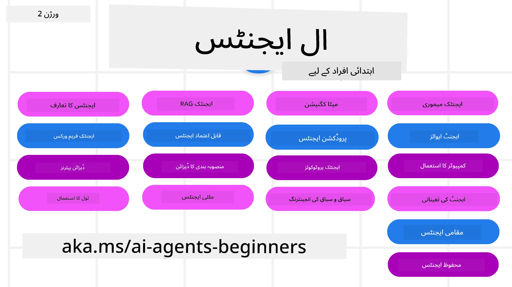

# AI ایجنٹس برائے مبتدی - ایک کورس



## ایک کورس جو آپ کو AI ایجنٹس بنانے کے آغاز کے لیے درکار تمام معلومات سکھاتا ہے

[](https://github.com/microsoft/ai-agents-for-beginners/blob/master/LICENSE?WT.mc_id=academic-105485-koreyst)
[](https://GitHub.com/microsoft/ai-agents-for-beginners/graphs/contributors/?WT.mc_id=academic-105485-koreyst)
[](https://GitHub.com/microsoft/ai-agents-for-beginners/issues/?WT.mc_id=academic-105485-koreyst)
[](https://GitHub.com/microsoft/ai-agents-for-beginners/pulls/?WT.mc_id=academic-105485-koreyst)
[](http://makeapullrequest.com?WT.mc_id=academic-105485-koreyst)

### 🌐 کثیرالزبانی معاونت

#### GitHub ایکشن کے ذریعے معاونت (خودکار اور ہمیشہ تازہ ترین)

<!-- CO-OP TRANSLATOR LANGUAGES TABLE START -->
[عربی](../ar/README.md) | [بنگالی](../bn/README.md) | [بلغاریائی](../bg/README.md) | [برمی (میانمار)](../my/README.md) | [چینی (سادہ)](../zh-CN/README.md) | [چینی (روایتی، ہانگ کانگ)](../zh-HK/README.md) | [چینی (روایتی، میکاؤ)](../zh-MO/README.md) | [چینی (روایتی، تائیوان)](../zh-TW/README.md) | [کروشیاوی](../hr/README.md) | [چیک](../cs/README.md) | [ڈینش](../da/README.md) | [ڈچ](../nl/README.md) | [ایسٹونین](../et/README.md) | [فننش](../fi/README.md) | [فرانسیسی](../fr/README.md) | [جرمن](../de/README.md) | [یونانی](../el/README.md) | [عبرانی](../he/README.md) | [ہندی](../hi/README.md) | [ہنگیرین](../hu/README.md) | [انڈونیشین](../id/README.md) | [اطالوی](../it/README.md) | [جاپانی](../ja/README.md) | [کنڑا](../kn/README.md) | [خمیری](../km/README.md) | [کوریائی](../ko/README.md) | [لتھوانین](../lt/README.md) | [ملائی](../ms/README.md) | [مالیالم](../ml/README.md) | [مراٹھائی](../mr/README.md) | [نیپالی](../ne/README.md) | [نائجیریائی پیڈگن](../pcm/README.md) | [ناروے](../no/README.md) | [فارسی (فارس)](../fa/README.md) | [پولش](../pl/README.md) | [پرتگالی (برازیل)](../pt-BR/README.md) | [پرتگالی (پرتگال)](../pt-PT/README.md) | [پنجابی (گرو مکھی)](../pa/README.md) | [رومانیائی](../ro/README.md) | [روسی](../ru/README.md) | [سربی (سیرلیک)](../sr/README.md) | [سلوواکی](../sk/README.md) | [سلووینیائی](../sl/README.md) | [ہسپانوی](../es/README.md) | [سواحلی](../sw/README.md) | [سویڈش](../sv/README.md) | [ٹاگالوگ (فلپائنی)](../tl/README.md) | [تمل](../ta/README.md) | [ٹیلغو](../te/README.md) | [تھائی](../th/README.md) | [ترکی](../tr/README.md) | [یوکرینیائی](../uk/README.md) | [اردو](./README.md) | [ویتنامی](../vi/README.md)

> **کیا آپ مقامی طور پر کلون کرنا پسند کریں گے؟**
>
> یہ ذخیرہ 50+ زبانوں کے تراجم شامل کرتا ہے جو ڈاؤن لوڈ کا حجم بہت بڑھا دیتا ہے۔ ترجمے کے بغیر کلون کرنے کے لیے اسپارس چیک آؤٹ استعمال کریں:
>
> **بش / macOS / لینکس:**
> ```bash
> git clone --filter=blob:none --sparse https://github.com/microsoft/ai-agents-for-beginners.git
> cd ai-agents-for-beginners
> git sparse-checkout set --no-cone '/*' '!translations' '!translated_images'
> ```
>
> **CMD (ونڈوز):**
> ```cmd
> git clone --filter=blob:none --sparse https://github.com/microsoft/ai-agents-for-beginners.git
> cd ai-agents-for-beginners
> git sparse-checkout set --no-cone "/*" "!translations" "!translated_images"
> ```
>
> اس سے آپ کو کورس مکمل کرنے کے لیے ہر چیز مل جائے گی اور ڈاؤن لوڈ بہت تیز ہوگی۔
<!-- CO-OP TRANSLATOR LANGUAGES TABLE END -->

**اگر آپ چاہتے ہیں کہ مزید ترجمہ شدہ زبانوں کی حمایت کی جائے تو یہ [یہاں](https://github.com/Azure/co-op-translator/blob/main/getting_started/supported-languages.md) پر دیکھی جا سکتی ہے**

[](https://GitHub.com/microsoft/ai-agents-for-beginners/watchers/?WT.mc_id=academic-105485-koreyst)
[](https://GitHub.com/microsoft/ai-agents-for-beginners/network/?WT.mc_id=academic-105485-koreyst)
[](https://GitHub.com/microsoft/ai-agents-for-beginners/stargazers/?WT.mc_id=academic-105485-koreyst)

[](https://discord.gg/nTYy5BXMWG)


## 🌱 شروع کرتے ہیں

یہ کورس AI ایجنٹس بنانے کے بنیادی اصولوں پر اسباق دیتا ہے۔ ہر سبق کا اپنا موضوع ہوتا ہے، لہٰذا جہاں چاہیں شروع کریں!

اس کورس کے لیے کثیرالزبانی معاونت موجود ہے۔ ہماری [دستیاب زبانیں یہاں دیکھیں](#-multi-language-support)۔

اگر آپ پہلی بار Generative AI ماڈلز کے ساتھ کام کر رہے ہیں، تو ہمارا [Generative AI For Beginners](https://aka.ms/genai-beginners) کورس دیکھیں، جس میں GenAI کے ساتھ بنانے پر 21 اسباق شامل ہیں۔

اس ریپوزٹری کو [ستارہ (🌟) دیں](https://docs.github.com/en/get-started/exploring-projects-on-github/saving-repositories-with-stars?WT.mc_id=academic-105485-koreyst) اور [فورک کریں](https://github.com/microsoft/ai-agents-for-beginners/fork) تاکہ کوڈ چلایا جا سکے۔

### دوسرے سیکھنے والوں سے ملیں، اپنے سوالات کے جوابات حاصل کریں

اگر آپ پھنس جائیں یا AI ایجنٹس بنانے کے حوالے سے کوئی سوال ہو تو ہمارے مخصوص Discord چینل میں شامل ہوں [Microsoft Foundry Discord](https://aka.ms/ai-agents/discord) پر۔

### آپ کو کیا چاہیے

اس کورس کے ہر اسباق میں کوڈ کی مثالیں شامل ہیں، جو code_samples فولڈر میں پائی جا سکتی ہیں۔ آپ اپنا نسخہ بنانے کے لیے [اس ریپوزٹری کو فورک کر سکتے ہیں](https://github.com/microsoft/ai-agents-for-beginners/fork)۔

ان مشقوں میں دی گئی کوڈ مثالیں Microsoft Agent Framework کو Azure AI Foundry Agent Service V2 کے ساتھ استعمال کرتی ہیں:

- [Microsoft Foundry](https://aka.ms/ai-agents-beginners/ai-foundry) - Azure اکاؤنٹ ضروری ہے

یہ کورس Microsoft کے مندرجہ ذیل AI Agent فریم ورکس اور سروسز استعمال کرتا ہے:

- [Microsoft Agent Framework (MAF)](https://aka.ms/ai-agents-beginners/agent-framework)
- [Azure AI Foundry Agent Service V2](https://aka.ms/ai-agents-beginners/ai-agent-service)

کچھ کوڈ نمونے متبادل OpenAI-مطابق فراہم کنندگان کو بھی سپورٹ کرتے ہیں جیسے [MiniMax](https://platform.minimaxi.com/)، جو بڑے کانٹیکسٹ ماڈلز (204K ٹوکن تک) پیش کرتا ہے۔ تفصیلات کے لیے [Course Setup](./00-course-setup/README.md) دیکھیں۔

اس کورس کے کوڈ چلانے کی مزید معلومات کے لیے [Course Setup](./00-course-setup/README.md) ملاحظہ کریں۔

## 🙏 مدد کرنا چاہتے ہیں؟

کیا آپ کے پاس تجاویز ہیں یا نسخہ یا کوڈ کی غلطیاں ملی ہیں؟ [مسئلہ اٹھائیں](https://github.com/microsoft/ai-agents-for-beginners/issues?WT.mc_id=academic-105485-koreyst) یا [پل-ریکویسٹ بنائیں](https://github.com/microsoft/ai-agents-for-beginners/pulls?WT.mc_id=academic-105485-koreyst)


## 📂 ہر سبق میں شامل ہیں

- README میں تحریری سبق اور ایک مختصر ویڈیو
- Microsoft Agent Framework کے ساتھ Azure AI Foundry استعمال کرتے ہوئے Python کوڈ کی مثالیں
- مزید سیکھنے کے لیے اضافی وسائل کے لنکس


## 🗃️ اسباق

| **سبق**                                   | **متن اور کوڈ**                                    | **ویڈیو**                                                  | **مزید سیکھنے کے مواد**                                                                     |
|----------------------------------------------|----------------------------------------------------|------------------------------------------------------------|----------------------------------------------------------------------------------------|
| AI ایجنٹس اور ایجنٹس کے استعمالات کا تعارف       | [لنک](./01-intro-to-ai-agents/README.md)          | [ویڈیو](https://youtu.be/3zgm60bXmQk?si=z8QygFvYQv-9WtO1)  | [لنک](https://aka.ms/ai-agents-beginners/collection?WT.mc_id=academic-105485-koreyst) |
| AI ایجنٹک فریم ورکس کی تلاش              | [لنک](./02-explore-agentic-frameworks/README.md)  | [ویڈیو](https://youtu.be/ODwF-EZo_O8?si=Vawth4hzVaHv-u0H)  | [لنک](https://aka.ms/ai-agents-beginners/collection?WT.mc_id=academic-105485-koreyst) |
| AI ایجنٹک ڈیزائن پیٹرنز کو سمجھنا     | [لنک](./03-agentic-design-patterns/README.md)     | [ویڈیو](https://youtu.be/m9lM8qqoOEA?si=BIzHwzstTPL8o9GF)  | [لنک](https://aka.ms/ai-agents-beginners/collection?WT.mc_id=academic-105485-koreyst) |
| ٹول استعمال کرنے کا ڈیزائن پیٹرن                      | [لنک](./04-tool-use/README.md)                    | [ویڈیو](https://youtu.be/vieRiPRx-gI?si=2z6O2Xu2cu_Jz46N)  | [لنک](https://aka.ms/ai-agents-beginners/collection?WT.mc_id=academic-105485-koreyst) |
| ایجنٹک RAG                                  | [لنک](./05-agentic-rag/README.md)                 | [ویڈیو](https://youtu.be/WcjAARvdL7I?si=gKPWsQpKiIlDH9A3)  | [لنک](https://aka.ms/ai-agents-beginners/collection?WT.mc_id=academic-105485-koreyst) |
| قابل اعتماد AI ایجنٹس کی تعمیر               | [لنک](./06-building-trustworthy-agents/README.md) | [ویڈیو](https://youtu.be/iZKkMEGBCUQ?si=jZjpiMnGFOE9L8OK ) | [لنک](https://aka.ms/ai-agents-beginners/collection?WT.mc_id=academic-105485-koreyst) |
| منصوبہ بندی کا ڈیزائن پیٹرن                      | [لنک](./07-planning-design/README.md)             | [ویڈیو](https://youtu.be/kPfJ2BrBCMY?si=6SC_iv_E5-mzucnC)  | [لنک](https://aka.ms/ai-agents-beginners/collection?WT.mc_id=academic-105485-koreyst) |
| کثیر ایجنٹ کا ڈیزائن پیٹرن                   | [لنک](./08-multi-agent/README.md)                 | [ویڈیو](https://youtu.be/V6HpE9hZEx0?si=rMgDhEu7wXo2uo6g)  | [لنک](https://aka.ms/ai-agents-beginners/collection?WT.mc_id=academic-105485-koreyst) |
| میٹا کگنیشن ڈیزائن پیٹرن                 | [Link](./09-metacognition/README.md)               | [Video](https://youtu.be/His9R6gw6Ec?si=8gck6vvdSNCt6OcF)  | [Link](https://aka.ms/ai-agents-beginners/collection?WT.mc_id=academic-105485-koreyst) |
| پیداوار میں AI ایجنٹس                      | [Link](./10-ai-agents-production/README.md)        | [Video](https://youtu.be/l4TP6IyJxmQ?si=31dnhexRo6yLRJDl)  | [Link](https://aka.ms/ai-agents-beginners/collection?WT.mc_id=academic-105485-koreyst) |
| ایجنٹک پروٹوکولز کا استعمال (MCP, A2A اور NLWeb) | [Link](./11-agentic-protocols/README.md)           | [Video](https://youtu.be/X-Dh9R3Opn8)                                 | [Link](https://aka.ms/ai-agents-beginners/collection?WT.mc_id=academic-105485-koreyst) |
| AI ایجنٹس کے لیے کانٹیکسٹ انجینیئرنگ            | [Link](./12-context-engineering/README.md)         | [Video](https://youtu.be/F5zqRV7gEag)                                 | [Link](https://aka.ms/ai-agents-beginners/collection?WT.mc_id=academic-105485-koreyst) |
| ایجنٹک میموری کا انتظام                      | [Link](./13-agent-memory/README.md)     |      [Video](https://youtu.be/QrYbHesIxpw?si=vZkVwKrQ4ieCcIPx)                                                      |                                                                                        |
| مائیکروسافٹ ایجنٹ فریم ورک کی کھوج                         | [Link](./14-microsoft-agent-framework/README.md)                            |                                                            |                                                                                        |
| کمپیوٹر یوز ایجنٹس (CUA) کی بلڈنگ           | [Link](./15-browser-use/README.md)     |                                                            | [Link](https://docs.browser-use.com/examples/templates/playwright-integration)         |
| اسکیل ایبل ایجنٹس کی تعیناتی                    | جلد آ رہا ہے                            |                                                            |                                                                                        |
| مقامی AI ایجنٹس کی تخلیق                     | جلد آ رہا ہے                               |                                                            |                                                                                        |
| AI ایجنٹس کا تحفظ                           | [Link](./18-securing-ai-agents/README.md)  |                                                            | [Link](https://aka.ms/ai-agents-beginners/collection?WT.mc_id=academic-105485-koreyst) |

## 🎒 دیگر کورسز

ہماری ٹیم دیگر کورسز بھی بناتی ہے! دیکھیں:

<!-- CO-OP TRANSLATOR OTHER COURSES START -->
### LangChain
[](https://aka.ms/langchain4j-for-beginners)
[](https://aka.ms/langchainjs-for-beginners?WT.mc_id=m365-94501-dwahlin)
[](https://github.com/microsoft/langchain-for-beginners?WT.mc_id=m365-94501-dwahlin)
---

### Azure / Edge / MCP / Agents
[](https://github.com/microsoft/AZD-for-beginners?WT.mc_id=academic-105485-koreyst)
[](https://github.com/microsoft/edgeai-for-beginners?WT.mc_id=academic-105485-koreyst)
[](https://github.com/microsoft/mcp-for-beginners?WT.mc_id=academic-105485-koreyst)
[](https://github.com/microsoft/ai-agents-for-beginners?WT.mc_id=academic-105485-koreyst)

---
 
### جنریٹیو AI سیریز
[](https://github.com/microsoft/generative-ai-for-beginners?WT.mc_id=academic-105485-koreyst)
[-9333EA?style=for-the-badge&labelColor=E5E7EB&color=9333EA)](https://github.com/microsoft/Generative-AI-for-beginners-dotnet?WT.mc_id=academic-105485-koreyst)
[-C084FC?style=for-the-badge&labelColor=E5E7EB&color=C084FC)](https://github.com/microsoft/generative-ai-for-beginners-java?WT.mc_id=academic-105485-koreyst)
[-E879F9?style=for-the-badge&labelColor=E5E7EB&color=E879F9)](https://github.com/microsoft/generative-ai-with-javascript?WT.mc_id=academic-105485-koreyst)

---
 
### بنیادی تعلیم
[](https://aka.ms/ml-beginners?WT.mc_id=academic-105485-koreyst)
[](https://aka.ms/datascience-beginners?WT.mc_id=academic-105485-koreyst)
[](https://aka.ms/ai-beginners?WT.mc_id=academic-105485-koreyst)
[](https://github.com/microsoft/Security-101?WT.mc_id=academic-96948-sayoung)
[](https://aka.ms/webdev-beginners?WT.mc_id=academic-105485-koreyst)
[](https://aka.ms/iot-beginners?WT.mc_id=academic-105485-koreyst)
[](https://github.com/microsoft/xr-development-for-beginners?WT.mc_id=academic-105485-koreyst)

---
 
### کوپائلٹ سیریز
[](https://aka.ms/GitHubCopilotAI?WT.mc_id=academic-105485-koreyst)
[](https://github.com/microsoft/mastering-github-copilot-for-dotnet-csharp-developers?WT.mc_id=academic-105485-koreyst)
[](https://github.com/microsoft/CopilotAdventures?WT.mc_id=academic-105485-koreyst)
<!-- CO-OP TRANSLATOR OTHER COURSES END -->

## 🌟 کمیونٹی کا شکریہ

[Shivam Goyal](https://www.linkedin.com/in/shivam2003/) کا شکریہ جو Agentic RAG کی اہم کوڈ مثالیں فراہم کر کے تعاون کر رہے ہیں۔

## تعاون کرنا

یہ منصوبہ تعاون اور تجاویز کا خیرمقدم کرتا ہے۔ زیادہ تر تعاون کے لیے آپ کو ایک
Contributor License Agreement (CLA) پر رضامندی دینی ہوتی ہے جس میں آپ یہ اعلان کرتے ہیں کہ آپ کے پاس حقوق ہیں، اور آپ واقعی ہمیں
آپ کے تعاون کو استعمال کرنے کے حقوق دیتے ہیں۔ تفصیلات کے لیے ملاحظہ کریں: <https://cla.opensource.microsoft.com>۔

جب آپ ایک پل ریکویسٹ جمع کرواتے ہیں، تو CLA بوٹ خودکار طور پر فیصلہ کرے گا کہ آیا آپ کو CLA فراہم کرنا ہے اور PR کو مناسب طریقے سے
چاہئے (جیسے، اسٹیٹس چیک، تبصرہ)۔ بس بوٹ کی دی ہوئی ہدایات پر عمل کریں۔ آپ کو یہ پوری ریپو میں صرف ایک بار کرنا ہوگا جہاں ہماری CLA استعمال ہوتی ہے۔

اس منصوبے نے [Microsoft Open Source Code of Conduct](https://opensource.microsoft.com/codeofconduct/) کو اپنایا ہے۔
مزید معلومات کے لیے دیکھیں [Code of Conduct FAQ](https://opensource.microsoft.com/codeofconduct/faq/) یا
کسی بھی اضافی سوالات یا تبصروں کے لیے رابطہ کریں: [opencode@microsoft.com](mailto:opencode@microsoft.com)۔

## ٹریڈ مارکس

اس منصوبے میں پروجیکٹس، مصنوعات، یا خدمات کے ٹریڈ مارکس یا لوگوز شامل ہو سکتے ہیں۔ مائیکروسافٹ
ٹریڈ مارکس یا لوگوز کا مجاز استعمال [Microsoft's Trademark & Brand Guidelines](https://www.microsoft.com/legal/intellectualproperty/trademarks/usage/general) کے تابع ہوتا ہے اور اس کی پیروی کرنی چاہیے۔
ترمیم شدہ ورژنز میں مائیکروسافٹ ٹریڈ مارکس یا لوگوز کے استعمال سے کوئی الجھن یا مائیکروسافٹ کی سرپرستی کا تاثر نہیں پیدا ہونا چاہیے۔
تیسری پارٹی کے ٹریڈ مارکس یا لوگوز کا استعمال ان پارٹیوں کی پالیسیوں کے تابع ہے۔

## مدد حاصل کرنا

اگر آپ پھنس جائیں یا AI ایپس بنانے کے حوالے سے کوئی سوال ہو، تو شامل ہوں:

[](https://aka.ms/foundry/discord)

اگر آپ پروڈکٹ فیڈبیک یا تعمیر کے دوران خرابیوں کی رپورٹ کرنا چاہتے ہیں تو ملاحظہ کریں:

[](https://aka.ms/foundry/forum)

---

<!-- CO-OP TRANSLATOR DISCLAIMER START -->
**ڈس کلیمر**:
یہ دستاویز AI ترجمہ سروس [Co-op Translator](https://github.com/Azure/co-op-translator) کے ذریعے ترجمہ کی گئی ہے۔ جبکہ ہم درستگی کے لیے کوشاں ہیں، براہ کرم اس بات سے آگاہ رہیں کہ خودکار ترجمے میں غلطیاں یا عدم درستیاں ہو سکتی ہیں۔ اصل دستاویز اپنے مادری زبان میں مستند ماخذ سمجھی جائے گی۔ حساس معلومات کے لیے پیشہ ور انسانی ترجمہ کی سفارش کی جاتی ہے۔ اس ترجمے کے استعمال سے پیدا ہونے والی کسی بھی غلط فہمی یا غلط تشریح کی ذمہ داری ہم قبول نہیں کرتے۔
<!-- CO-OP TRANSLATOR DISCLAIMER END -->