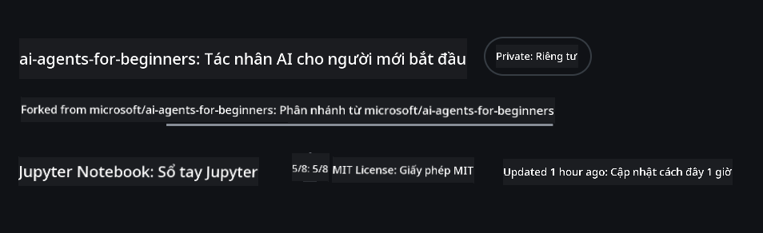
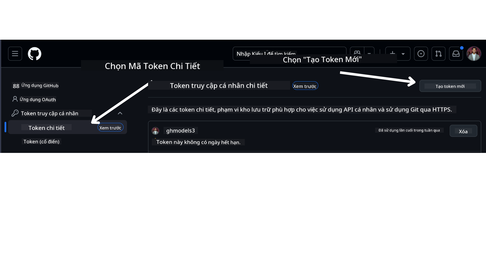
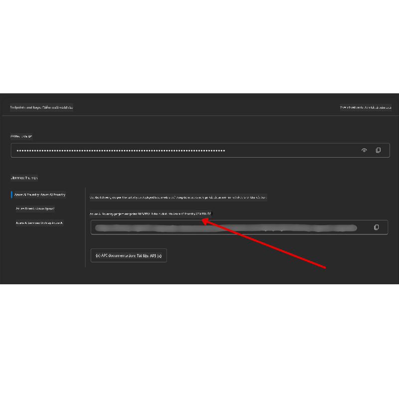

<!--
CO_OP_TRANSLATOR_METADATA:
{
  "original_hash": "76945069b52a49cd0432ae3e0b0ba22e",
  "translation_date": "2025-07-12T07:53:36+00:00",
  "source_file": "00-course-setup/README.md",
  "language_code": "vi"
}
-->
# Cài Đặt Khóa Học

## Giới Thiệu

Bài học này sẽ hướng dẫn bạn cách chạy các mẫu mã của khóa học này.

## Sao Chép hoặc Fork Kho Lưu Trữ Này

Để bắt đầu, vui lòng sao chép hoặc fork kho lưu trữ GitHub. Điều này sẽ tạo ra phiên bản riêng của bạn về tài liệu khóa học để bạn có thể chạy, kiểm tra và chỉnh sửa mã!

Bạn có thể thực hiện điều này bằng cách nhấp vào liên kết để

Bạn sẽ có phiên bản fork của khóa học này tại liên kết sau:



## Chạy Mã

Khóa học này cung cấp một loạt các Jupyter Notebooks mà bạn có thể chạy để trải nghiệm thực hành xây dựng các AI Agents.

Các mẫu mã sử dụng một trong các công cụ sau:

**Yêu cầu tài khoản GitHub - Miễn phí**:

1) Semantic Kernel Agent Framework + GitHub Models Marketplace. Được gắn nhãn là (semantic-kernel.ipynb)  
2) AutoGen Framework + GitHub Models Marketplace. Được gắn nhãn là (autogen.ipynb)  

**Yêu cầu đăng ký Azure**:  
3) Azure AI Foundry + Azure AI Agent Service. Được gắn nhãn là (azureaiagent.ipynb)  

Chúng tôi khuyến khích bạn thử cả ba loại ví dụ để xem loại nào phù hợp nhất với bạn.

Dù bạn chọn phương án nào, nó sẽ quyết định các bước thiết lập bạn cần làm theo bên dưới:

## Yêu Cầu

- Python 3.12+  
  - **LƯU Ý**: Nếu bạn chưa cài đặt Python 3.12, hãy đảm bảo cài đặt nó. Sau đó, tạo môi trường ảo (venv) bằng python3.12 để đảm bảo các phiên bản chính xác được cài đặt từ tệp requirements.txt.  
- Tài khoản GitHub - Để truy cập GitHub Models Marketplace  
- Đăng ký Azure - Để truy cập Azure AI Foundry  
- Tài khoản Azure AI Foundry - Để truy cập Azure AI Agent Service  

Chúng tôi đã bao gồm file `requirements.txt` ở thư mục gốc của kho lưu trữ này chứa tất cả các gói Python cần thiết để chạy các mẫu mã.

Bạn có thể cài đặt chúng bằng cách chạy lệnh sau trong terminal tại thư mục gốc của kho lưu trữ:

```bash
pip install -r requirements.txt
```  
Chúng tôi khuyến nghị tạo một môi trường ảo Python để tránh xung đột và các vấn đề khác.

## Cài Đặt VSCode  
Đảm bảo rằng bạn đang sử dụng đúng phiên bản Python trong VSCode.


## Thiết Lập cho Mẫu sử dụng GitHub Models

Khóa học này sử dụng GitHub Models Marketplace, cung cấp quyền truy cập miễn phí vào các Mô hình Ngôn ngữ Lớn (LLMs) mà bạn sẽ sử dụng để xây dựng AI Agents.

Để sử dụng GitHub Models, bạn cần tạo một [GitHub Personal Access Token](https://docs.github.com/en/authentication/keeping-your-account-and-data-secure/managing-your-personal-access-tokens).

Bạn có thể thực hiện điều này bằng cách truy cập tài khoản GitHub của mình.

Điều này có thể thực hiện bằng cách vào tài khoản GitHub của bạn.

1. Chọn tùy chọn `Fine-grained tokens` ở phía bên trái màn hình.

    Sau đó chọn `Generate new token`.



Bạn sẽ được yêu cầu nhập tên cho token, chọn ngày hết hạn (Khuyến nghị: 30 ngày), và chọn phạm vi cho token (Public Repositories).

Bạn cũng cần chỉnh sửa quyền của token này: Permissions -> Models -> Cho phép truy cập GitHub Models

Sao chép token mới bạn vừa tạo. Bây giờ bạn sẽ thêm token này vào file `.env` đi kèm trong khóa học này.

### Bước 2: Tạo Tệp `.env`

Để tạo tệp `.env`, chạy lệnh sau trong terminal của bạn.

```bash
cp .env.example .env
```

Lệnh này sẽ sao chép tệp ví dụ và tạo một tệp `.env` trong thư mục của bạn, nơi bạn điền các giá trị cho các biến môi trường.

Với token đã sao chép, mở tệp `.env` trong trình soạn thảo văn bản yêu thích của bạn và dán token vào trường `GITHUB_TOKEN`.

Bây giờ bạn đã có thể chạy các mẫu mã của khóa học này.

## Thiết Lập cho Mẫu sử dụng Azure AI Foundry và Azure AI Agent Service

### Bước 1: Lấy Endpoint Dự Án Azure  

Thực hiện các bước để tạo hub và dự án trong Azure AI Foundry tại đây: [Hub resources overview](https://learn.microsoft.com/en-us/azure/ai-foundry/concepts/ai-resources)

Sau khi tạo dự án, bạn cần lấy chuỗi kết nối cho dự án.

Điều này có thể thực hiện bằng cách truy cập trang **Overview** của dự án trong cổng Azure AI Foundry.



### Bước 2: Tạo Tệp `.env`

Để tạo tệp `.env`, chạy lệnh sau trong terminal của bạn.

```bash
cp .env.example .env
```

Lệnh này sẽ sao chép tệp ví dụ và tạo một tệp `.env` trong thư mục của bạn, nơi bạn điền các giá trị cho các biến môi trường.

Với token đã sao chép, mở tệp `.env` trong trình soạn thảo văn bản yêu thích của bạn và dán token vào trường `PROJECT_ENDPOINT`.

### Bước 3: Đăng Nhập Azure  

Theo thực hành bảo mật tốt, chúng ta sẽ sử dụng [xác thực không cần khóa](https://learn.microsoft.com/azure/developer/ai/keyless-connections?tabs=csharp%2Cazure-cli?WT.mc_id=academic-105485-koreyst) để xác thực với Azure OpenAI qua Microsoft Entra ID. Trước tiên, bạn cần cài đặt **Azure CLI** theo [hướng dẫn cài đặt](https://learn.microsoft.com/cli/azure/install-azure-cli?WT.mc_id=academic-105485-koreyst) phù hợp với hệ điều hành của bạn.

Tiếp theo, mở terminal và chạy `az login --use-device-code` để đăng nhập vào tài khoản Azure của bạn.

Sau khi đăng nhập, chọn đăng ký của bạn trong terminal.

## Các Biến Môi Trường Bổ Sung - Azure Search và Azure OpenAI  

Đối với bài học Agentic RAG - Bài 5 - có các mẫu sử dụng Azure Search và Azure OpenAI.

Nếu bạn muốn chạy các mẫu này, bạn cần thêm các biến môi trường sau vào tệp `.env` của mình:

### Trang Tổng Quan (Dự Án)

- `AZURE_SUBSCRIPTION_ID` - Kiểm tra **Chi tiết dự án** trên trang **Overview** của dự án.

- `AZURE_AI_PROJECT_NAME` - Xem phía trên cùng trang **Overview** của dự án.

- `AZURE_OPENAI_SERVICE` - Tìm trong tab **Included capabilities** cho **Azure OpenAI Service** trên trang **Overview**.  

### Trung Tâm Quản Lý  

- `AZURE_OPENAI_RESOURCE_GROUP` - Vào **Thuộc tính dự án** trên trang **Overview** của **Trung tâm quản lý**.

- `GLOBAL_LLM_SERVICE` - Dưới **Connected resources**, tìm tên kết nối **Azure AI Services**. Nếu không có, kiểm tra trong **Azure portal** ở nhóm tài nguyên của bạn cho tên dịch vụ AI.

### Trang Models + Endpoints  

- `AZURE_OPENAI_EMBEDDING_DEPLOYMENT_NAME` - Chọn mô hình embedding (ví dụ: `text-embedding-ada-002`) và ghi lại **Deployment name** từ chi tiết mô hình.

- `AZURE_OPENAI_CHAT_DEPLOYMENT_NAME` - Chọn mô hình chat (ví dụ: `gpt-4o-mini`) và ghi lại **Deployment name** từ chi tiết mô hình.

### Cổng Azure  

- `AZURE_OPENAI_ENDPOINT` - Tìm **Azure AI services**, nhấp vào, vào **Resource Management**, **Keys and Endpoint**, cuộn xuống phần "Azure OpenAI endpoints", sao chép endpoint ghi "Language APIs".

- `AZURE_OPENAI_API_KEY` - Từ cùng màn hình, sao chép KEY 1 hoặc KEY 2.  

- `AZURE_SEARCH_SERVICE_ENDPOINT` - Tìm tài nguyên **Azure AI Search**, nhấp vào và xem **Overview**.

- `AZURE_SEARCH_API_KEY` - Vào **Settings** rồi **Keys** để sao chép khóa quản trị chính hoặc phụ.

### Trang Web Bên Ngoài  

- `AZURE_OPENAI_API_VERSION` - Truy cập trang [vòng đời phiên bản API](https://learn.microsoft.com/en-us/azure/ai-services/openai/api-version-deprecation#latest-ga-api-release) dưới phần **Latest GA API release**.

### Cài Đặt Xác Thực Không Cần Khóa  

Thay vì mã hóa cứng thông tin đăng nhập, chúng ta sẽ dùng kết nối không cần khóa với Azure OpenAI. Để làm điều này, ta sẽ import `DefaultAzureCredential` và gọi hàm `DefaultAzureCredential` để lấy thông tin xác thực.

```python
from azure.identity import DefaultAzureCredential, InteractiveBrowserCredential
```

## Gặp Vấn Đề Ở Đâu?

Nếu bạn gặp bất kỳ vấn đề nào khi chạy thiết lập này, hãy tham gia vào cộng đồng của chúng tôi

hoặc

.

## Bài Học Tiếp Theo  

Bây giờ bạn đã sẵn sàng để chạy mã cho khóa học này. Chúc bạn học tập vui vẻ và khám phá thêm về thế giới AI Agents!  

[Giới Thiệu về AI Agents và Các Trường Hợp Sử Dụng](../01-intro-to-ai-agents/README.md)  

**Tuyên bố từ chối trách nhiệm**:  
Tài liệu này đã được dịch bằng dịch vụ dịch thuật AI [Co-op Translator](https://github.com/Azure/co-op-translator). Mặc dù chúng tôi cố gắng đảm bảo độ chính xác, xin lưu ý rằng các bản dịch tự động có thể chứa lỗi hoặc không chính xác. Tài liệu gốc bằng ngôn ngữ gốc của nó nên được coi là nguồn chính xác và đáng tin cậy. Đối với các thông tin quan trọng, nên sử dụng dịch vụ dịch thuật chuyên nghiệp do con người thực hiện. Chúng tôi không chịu trách nhiệm về bất kỳ sự hiểu lầm hoặc giải thích sai nào phát sinh từ việc sử dụng bản dịch này.