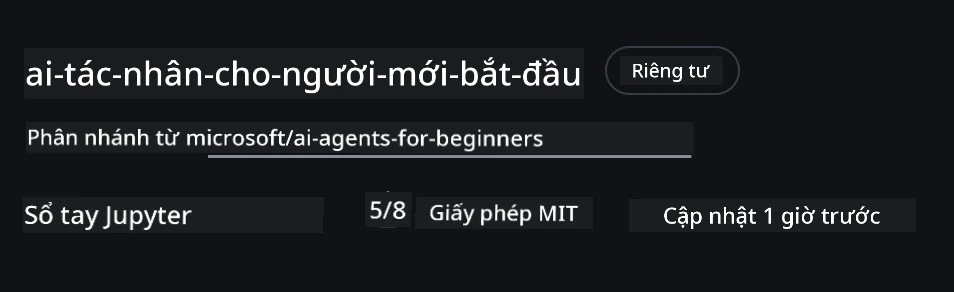
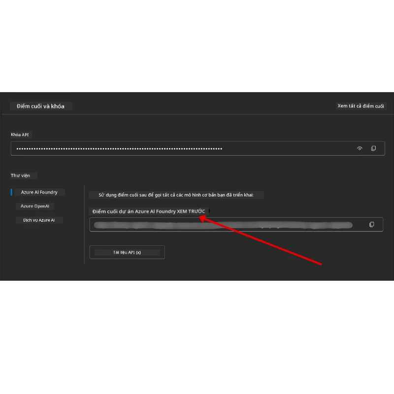

# Thiết lập Khóa học

## Giới thiệu

Bài học này sẽ hướng dẫn cách chạy các mẫu mã code của khóa học này.

## Tham gia cùng những người học khác và nhận trợ giúp

Trước khi bạn bắt đầu sao chép repo của mình, hãy tham gia [kênh Discord AI Agents For Beginners](https://aka.ms/ai-agents/discord) để nhận bất kỳ trợ giúp nào về thiết lập, câu hỏi liên quan đến khóa học, hoặc để kết nối với những người học khác.

## Sao chép hoặc Fork repo này

Để bắt đầu, vui lòng sao chép hoặc fork kho lưu trữ GitHub. Điều này sẽ tạo ra phiên bản riêng của bạn về tài liệu khóa học để bạn có thể chạy, kiểm tra và điều chỉnh mã code!

Việc này có thể thực hiện bằng cách nhấn vào liên kết <a href="https://github.com/microsoft/ai-agents-for-beginners/fork" target="_blank">fork repo</a>

Bây giờ bạn sẽ có phiên bản fork riêng của khóa học này tại liên kết sau:



### Sao chép nông (được khuyến nghị cho workshop / Codespaces)

  >Kho lưu trữ đầy đủ có thể lớn (~3 GB) khi bạn tải xuống lịch sử đầy đủ và tất cả các file. Nếu bạn chỉ tham dự workshop hoặc chỉ cần một vài thư mục bài học, sao chép nông (hoặc sao chép thưa) sẽ tải xuống ít hơn nhiều.

#### Sao chép nông nhanh — lịch sử tối thiểu, tất cả các file

Thay thế `<your-username>` trong các lệnh dưới đây bằng URL fork của bạn (hoặc URL upstream nếu bạn thích).

Để sao chép chỉ lịch sử commit mới nhất (tải về nhỏ):

```bash
git clone --depth 1 https://github.com/<your-username>/ai-agents-for-beginners.git
```

Để sao chép một nhánh cụ thể:

```bash
git clone --depth 1 --branch <branch-name> https://github.com/<your-username>/ai-agents-for-beginners.git
```

#### Sao chép một phần (thưa) — chỉ tải các blobs tối thiểu + các thư mục được chọn

Điều này dùng sao chép một phần và sparse-checkout (yêu cầu Git 2.25+ và Git hiện đại với hỗ trợ sao chép một phần):

```bash
git clone --depth 1 --filter=blob:none --sparse https://github.com/<your-username>/ai-agents-for-beginners.git
```

Điều hướng vào thư mục repo:

```bash
cd ai-agents-for-beginners
```

Sau đó chỉ định các thư mục bạn muốn (ví dụ dưới đây cho hai thư mục):

```bash
git sparse-checkout set 00-course-setup 01-intro-to-ai-agents
```

Sau khi sao chép và kiểm tra file, nếu bạn chỉ cần file và muốn giải phóng không gian (không cần lịch sử git), vui lòng xóa metadata của repo (💀không thể phục hồi — bạn sẽ mất toàn bộ chức năng Git):

```bash
# zsh/bash
rm -rf .git
```

```powershell
# PowerShell
Remove-Item -Recurse -Force .git
```

#### Sử dụng GitHub Codespaces (khuyến nghị để tránh tải xuống cục bộ quá lớn)

- Tạo một Codespace mới cho repo này qua [GitHub UI](https://github.com/codespaces).  

- Trong terminal của codespace mới tạo, chạy một trong các lệnh sao chép nông/thưa phía trên để chỉ mang các thư mục bài học bạn cần vào workspace Codespace.
- Tùy chọn: sau khi sao chép trong Codespaces, xóa .git để thu hồi thêm không gian (xem lệnh xóa phía trên).
- Lưu ý: Nếu bạn thích mở repo trực tiếp trong Codespaces (không sao chép thêm), hãy biết Codespaces sẽ xây dựng môi trường devcontainer và có thể vẫn cung cấp nhiều hơn bạn cần.

#### Mẹo

- Luôn thay URL sao chép bằng fork của bạn nếu bạn muốn chỉnh sửa/cam kết.
- Nếu sau này bạn cần thêm lịch sử hoặc file, bạn có thể fetch chúng hoặc điều chỉnh sparse-checkout để bao gồm thêm thư mục.

## Chạy Mã Code

Khóa học này cung cấp một loạt các Jupyter Notebooks mà bạn có thể chạy để có trải nghiệm thực tế xây dựng AI Agents.

Các mẫu mã code sử dụng **Microsoft Agent Framework (MAF)** với `FoundryChatClient`, kết nối tới **Microsoft Foundry Agent Service V2** (API Responses) qua **Microsoft Foundry**.

Tất cả notebook Python đều được gắn nhãn `*-python-agent-framework.ipynb`.

## Yêu cầu

- Python 3.12+
  - **LƯU Ý**: Nếu bạn chưa cài Python3.12, hãy chắc chắn cài đặt nó. Sau đó tạo venv sử dụng python3.12 để đảm bảo các phiên bản đúng được cài từ file requirements.txt.
  
    >Ví dụ

    Tạo thư mục Python venv:

    ```bash
    python -m venv venv
    ```

    Sau đó kích hoạt môi trường venv cho:

    ```bash
    # zsh/bash
    source venv/bin/activate
    ```
  
    ```dos
    # Command Prompt for Windows
    venv\Scripts\activate
    ```

- .NET 10+: Với các mã mẫu dùng .NET, đảm bảo bạn cài [.NET 10 SDK](https://dotnet.microsoft.com/download/dotnet/10.0) hoặc mới hơn. Sau đó kiểm tra phiên bản SDK .NET đã cài:

    ```bash
    dotnet --list-sdks
    ```

- **Azure CLI** — Yêu cầu cho xác thực. Cài đặt tại [aka.ms/installazurecli](https://aka.ms/installazurecli).
- **Azure Subscription** — Để truy cập Microsoft Foundry và Microsoft Foundry Agent Service.
- **Microsoft Foundry Project** — Một dự án có mô hình đã được triển khai (ví dụ, `gpt-5-mini`). Xem [Bước 1](#bước-1-tạo-dự-án-microsoft-foundry) bên dưới.

Chúng tôi có file `requirements.txt` trong thư mục gốc repo này chứa tất cả các gói Python cần thiết để chạy các mẫu code.

Bạn có thể cài chúng bằng cách chạy lệnh sau trong terminal tại thư mục gốc repo:

```bash
pip install -r requirements.txt
```

Chúng tôi khuyên bạn tạo môi trường ảo Python để tránh xung đột và lỗi.

## Thiết lập VSCode

Đảm bảo bạn đang sử dụng đúng phiên bản Python trong VSCode.


## Thiết lập Microsoft Foundry và Microsoft Foundry Agent Service

### Bước 1: Tạo Dự án Microsoft Foundry

Bạn cần một **hub** và **dự án** Microsoft Foundry với một mô hình đã được triển khai để chạy các notebook.

1. Truy cập [ai.azure.com](https://ai.azure.com) và đăng nhập bằng tài khoản Azure của bạn.
2. Tạo một **hub** (hoặc dùng hub có sẵn). Xem: [Tổng quan tài nguyên hub](https://learn.microsoft.com/azure/ai-foundry/concepts/ai-resources).
3. Trong hub, tạo một **dự án**.
4. Triển khai một mô hình (ví dụ, `gpt-5-mini`) từ **Models + Endpoints** → **Deploy model**.

### Bước 2: Lấy endpoint dự án và tên triển khai mô hình

Từ dự án của bạn trong cổng Microsoft Foundry:

- **Project Endpoint** — Vào trang **Overview** và sao chép URL endpoint.



- **Model Deployment Name** — Vào **Models + Endpoints**, chọn mô hình đã triển khai, và ghi lại **Deployment name** (ví dụ, `gpt-5-mini`).

### Bước 3: Đăng nhập Azure bằng `az login`

Hầu hết notebook xác thực thông qua **đăng nhập Azure CLI** — sử dụng `AzureCliCredential` hoặc `DefaultAzureCredential` (cả hai lấy phiên đăng nhập `az login` của bạn) từ gói `azure-identity` — vì vậy không cần API keys. Một số bài học và tích hợp tùy chọn dùng API keys; kiểm tra yêu cầu của từng bài học cho biến môi trường thêm. Việc này yêu cầu bạn phải đăng nhập qua Azure CLI.

1. **Cài đặt Azure CLI** nếu bạn chưa có: [aka.ms/installazurecli](https://aka.ms/installazurecli)

2. **Đăng nhập** bằng cách chạy:

    ```bash
    az login
    ```

    Hoặc nếu bạn đang ở môi trường remote/Codespace không có trình duyệt:

    ```bash
    az login --use-device-code
    ```

3. **Chọn subscription** nếu được yêu cầu — chọn subscription có dự án Foundry của bạn.

4. **Kiểm tra** bạn đã đăng nhập:

    ```bash
    az account show
    ```

> **Tại sao `az login`?** Các notebook xác thực dùng `AzureCliCredential` (hoặc `DefaultAzureCredential`, cũng lấy đăng nhập Azure CLI của bạn) từ gói `azure-identity`. Điều này có nghĩa phiên Azure CLI của bạn cung cấp thông tin xác thực — không cần API keys hay secrets trong file `.env`. Đây là [thực hành bảo mật tốt nhất](https://learn.microsoft.com/azure/developer/ai/keyless-connections).

### Bước 4: Tạo file `.env`

Sao chép file mẫu:

```bash
# zsh/bash
cp .env.example .env
```

```powershell
# PowerShell
Copy-Item .env.example .env
```

Mở `.env` và điền hai giá trị này:

```env
AZURE_AI_PROJECT_ENDPOINT=https://<your-project>.services.ai.azure.com/api/projects/<your-project-id>
AZURE_AI_MODEL_DEPLOYMENT_NAME=gpt-5-mini
```

| Biến | Vị trí tìm |
|----------|-----------------|
| `AZURE_AI_PROJECT_ENDPOINT` | Cổng Foundry → dự án của bạn → trang **Overview** |
| `AZURE_AI_MODEL_DEPLOYMENT_NAME` | Cổng Foundry → **Models + Endpoints** → tên mô hình đã triển khai |

Đó là tất cả cho hầu hết các bài học! Các notebook sẽ tự động xác thực qua phiên `az login`.

### Bước 5: Cài đặt phụ thuộc Python

```bash
pip install -r requirements.txt
```

Khuyên bạn chạy lệnh này bên trong môi trường ảo bạn đã tạo trước đó.

## Thiết lập tùy chọn: Azure AI Search (Bài học 5 và 16)

Các notebook Bài 5 (Agentic RAG) và Bài 16 chạy ngay với **cơ sở tri thức trong bộ nhớ** — không cần tài nguyên Azure bổ sung. Nếu bạn muốn dựa vào chỉ mục **Azure AI Search** thật, lưu ý rằng **notebook Bài 16 hiện sử dụng xác thực bằng key:** chuyển từ tìm kiếm trong bộ nhớ sang Azure AI Search chỉ khi **cả hai** `AZURE_SEARCH_SERVICE_ENDPOINT` **và** `AZURE_SEARCH_API_KEY` được đặt, còn không vẫn dùng tìm kiếm trong bộ nhớ — vì vậy để chạy với chỉ mục thật bạn phải đặt key admin. Xác thực không dùng key với Microsoft Entra ID (RBAC) là cách khuyến nghị cho code sản xuất của bạn, đồng bộ với quy trình `az login` dùng ở các phần khác của khóa học.

Các bước RBAC dưới đây áp dụng cho các ví dụ hướng dẫn thiết lập và code riêng của bạn. Chúng không kích hoạt xác thực không key trong notebook Bài 16; Bài 16 vẫn cần cả endpoint và key admin để dùng Azure AI Search.

1. **Kích hoạt truy cập theo vai trò** trên dịch vụ tìm kiếm của bạn:

    ```bash
    az search service update --name <service-name> --resource-group <resource-group> --auth-options aadOrApiKey
    ```

2. **Gán cho bạn các vai trò cần thiết** (tạo/tải chỉ mục và truy vấn):

    ```bash
    az role assignment create --assignee <your-user-or-principal-id> --role "Search Service Contributor" --scope $(az search service show -g <resource-group> -n <service-name> --query id -o tsv)
    az role assignment create --assignee <your-user-or-principal-id> --role "Search Index Data Contributor" --scope $(az search service show -g <resource-group> -n <service-name> --query id -o tsv)
    ```

3. **Thêm endpoint** vào file `.env` của bạn:

| Biến | Vị trí tìm |
|----------|-----------------|
| `AZURE_SEARCH_SERVICE_ENDPOINT` | Azure portal → tài nguyên **Azure AI Search** của bạn → **Overview** → URL |
| `AZURE_SEARCH_API_KEY` | Yêu cầu (kèm endpoint) để kích hoạt Azure AI Search trong notebook Bài 16, dùng xác thực key. Azure portal → **Settings** → **Keys** → key admin chính |

> **Tại sao không dùng key?** Key admin cấp quyền ghi đầy đủ vào dịch vụ tìm kiếm của bạn và có thể bị rò rỉ qua file `.env`. Với RBAC, danh tính `az login` của bạn sẽ được dùng thay thế — cùng mẫu Entra ID không key mà các notebook khóa học dùng (qua `AzureCliCredential` / `DefaultAzureCredential`). Xem [Kết nối Azure AI Search dùng vai trò](https://learn.microsoft.com/azure/search/search-security-rbac).

Xem thêm [hướng dẫn thiết lập Azure AI Search](./AzureSearch.md) cho các ví dụ tạo chỉ mục đầy đủ bằng Python và .NET.

## Thiết lập bổ sung cho các bài học gọi Azure OpenAI trực tiếp (Bài 6 và 8)

Một số notebook ở bài 6 và 8 gọi trực tiếp **Azure OpenAI** (dùng **Responses API**) thay vì qua dự án Microsoft Foundry. Các mẫu này trước đây dùng GitHub Models, hiện đã ngừng hỗ trợ và không hỗ trợ Responses API. Thêm các biến này vào file `.env` của bạn:

| Biến | Vị trí tìm |
|----------|-----------------|
| `AZURE_OPENAI_ENDPOINT` | Azure portal → tài nguyên **Azure OpenAI** của bạn → **Keys and Endpoint** → Endpoint (ví dụ `https://<your-resource>.openai.azure.com`) |
| `AZURE_OPENAI_DEPLOYMENT` | Tên mô hình đã triển khai của bạn (ví dụ `gpt-5-mini`) hỗ trợ Responses API |
| `AZURE_OPENAI_API_KEY` | Tùy chọn — chỉ nếu bạn dùng xác thực key thay vì `az login` / Entra ID |

> Responses API dùng endpoint ổn định `/openai/v1/`, nên không cần `api-version`. Đăng nhập với `az login` để dùng xác thực Entra ID không key.

## Nhà cung cấp thay thế: MiniMax (Tương thích OpenAI)

[MiniMax](https://platform.minimaxi.com/) cung cấp các mô hình ngữ cảnh lớn (tối đa 204K tokens) qua API tương thích OpenAI. Vì Microsoft Agent Framework `OpenAIChatClient` hoạt động với mọi endpoint tương thích OpenAI, bạn có thể dùng MiniMax như một lựa chọn thay thế cho các bài học dùng `OpenAIChatClient`.

Thêm các biến này vào file `.env` của bạn:

| Biến | Vị trí tìm |
|----------|-----------------|
| `MINIMAX_API_KEY` | [MiniMax Platform](https://platform.minimaxi.com/) → API Keys |
| `MINIMAX_BASE_URL` | Dùng `https://api.minimax.io/v1` (giá trị mặc định) |
| `MINIMAX_MODEL_ID` | Tên mô hình dùng (ví dụ, `MiniMax-M3`) |

**Ví dụ mô hình**: `MiniMax-M3` (khuyến nghị), `MiniMax-M2.7`, `MiniMax-M2.7-highspeed` (phản hồi nhanh hơn). Tên và khả dụng của mô hình có thể thay đổi theo thời gian, và quyền truy cập vào mô hình cụ thể phụ thuộc tài khoản của bạn.

Các mẫu mã dùng `OpenAIChatClient` (ví dụ, quy trình đặt phòng khách sạn Bài 14) sẽ tự động phát hiện và dùng cấu hình MiniMax khi `MINIMAX_API_KEY` được đặt.


## Nhà cung cấp thay thế: Foundry Local (Chạy mô hình trên thiết bị)

[Foundry Local](https://foundrylocal.ai) là một môi trường chạy nhẹ cho phép tải về, quản lý và phục vụ các mô hình ngôn ngữ **hoàn toàn trên máy của bạn** thông qua API tương thích với OpenAI — không cần đám mây.

Bởi vì `OpenAIChatClient` trong Microsoft Agent Framework hoạt động với bất kỳ điểm cuối tương thích OpenAI nào, Foundry Local là lựa chọn thay thế địa phương thay thế cho Azure OpenAI.

**1. Cài đặt Foundry Local**

```bash
# Windows
winget install Microsoft.FoundryLocal

# macOS
brew install foundrylocal
```

**2. Tải xuống và chạy một mô hình** (điều này cũng khởi động dịch vụ địa phương):

```bash
foundry model list          # xem các mô hình có sẵn
foundry model run phi-4-mini
```

**3. Cài đặt SDK Python** được sử dụng để khám phá điểm cuối địa phương:

```bash
pip install foundry-local-sdk
```

**4. Trỏ Microsoft Agent Framework tới mô hình địa phương của bạn:**

```python
from foundry_local import FoundryLocalManager
from agent_framework.openai import OpenAIChatClient

# Tải xuống (nếu cần) và phục vụ mô hình cục bộ, sau đó phát hiện điểm cuối/cổng.
manager = FoundryLocalManager("phi-4-mini")

chat_client = OpenAIChatClient(
    base_url=manager.endpoint,      # ví dụ http://localhost:<port>/v1
    api_key=manager.api_key,        # luôn là "không cần thiết" cho Foundry Local
    model_id=manager.get_model_info("phi-4-mini").id,
)

agent = chat_client.as_agent(
    name="LocalAgent",
    instructions="You are a helpful assistant running fully on-device.",
)
```

> **Lưu ý:** Foundry Local cung cấp điểm cuối **Chat Completions** tương thích với OpenAI. Dùng nó cho phát triển cục bộ và các kịch bản ngoại tuyến. Để có đầy đủ tính năng **Responses API** (các cuộc hội thoại có trạng thái, v.v.), hãy dùng Azure OpenAI hoặc dự án Microsoft Foundry.

## Thiết lập thêm cho Bài 8 (Quy trình làm việc gắn với Bing)

Sổ tay quy trình làm việc có điều kiện trong bài 8 sử dụng **gắn với Bing** thông qua Microsoft Foundry. Nếu bạn định chạy mẫu này, hãy thêm biến này vào tập tin `.env` của bạn:

| Biến | Tìm ở đâu |
|----------|-----------------|
| `BING_CONNECTION_ID` | Cổng Microsoft Foundry → dự án của bạn → **Management** → **Connected resources** → kết nối Bing của bạn → sao chép ID kết nối |

## Khắc phục sự cố

### Lỗi xác minh chứng chỉ SSL trên macOS

Nếu bạn dùng macOS và gặp lỗi như sau:

```plaintext
ssl.SSLCertVerificationError: [SSL: CERTIFICATE_VERIFY_FAILED] certificate verify failed: self-signed certificate in certificate chain
```

Đây là vấn đề đã biết với Python trên macOS khi các chứng chỉ SSL của hệ thống không được tin tưởng tự động. Hãy thử các giải pháp sau theo thứ tự:

**Tùy chọn 1: Chạy script Cài đặt Chứng chỉ của Python (khuyến nghị)**

```bash
# Thay 3.XX bằng phiên bản Python bạn đã cài đặt (ví dụ: 3.12 hoặc 3.13):
/Applications/Python\ 3.XX/Install\ Certificates.command
```

**Tùy chọn 2: Dùng `connection_verify=False` trong sổ tay của bạn (chỉ dành cho các sổ tay GitHub Models)**

Trong sổ tay bài 6 (`06-building-trustworthy-agents/code_samples/06-system-message-framework.ipynb`), có giải pháp khắc phục được chú thích sẵn. Bỏ chú thích `connection_verify=False` khi bạn gặp lỗi chứng chỉ:

```python
client = ChatCompletionsClient(
    endpoint=endpoint,
    credential=AzureKeyCredential(token),
    connection_verify=False,  # Vô hiệu hóa xác minh SSL nếu bạn gặp lỗi chứng chỉ
)
```

> **⚠️ Cảnh báo:** Vô hiệu hóa xác minh SSL (`connection_verify=False`) sẽ giảm độ bảo mật bằng cách bỏ qua kiểm tra chứng chỉ. Chỉ dùng tạm thời trong môi trường phát triển. Không bao giờ dùng trong sản xuất.

**Tùy chọn 3: Cài đặt và dùng `truststore`**

```bash
pip install truststore
```

Sau đó thêm đoạn sau lên đầu sổ tay hoặc tập lệnh của bạn trước khi thực hiện các cuộc gọi mạng:

```python
import truststore
truststore.inject_into_ssl()
```

## Bị kẹt ở đâu đó?

Nếu bạn gặp sự cố chạy thiết lập này, hãy tham gia <a href="https://discord.gg/kzRShWzttr" target="_blank">Discord Cộng đồng Azure AI</a> hoặc <a href="https://github.com/microsoft/ai-agents-for-beginners/issues?WT.mc_id=academic-105485-koreyst" target="_blank">tạo một issue</a>.

## Bài học tiếp theo

Bạn đã sẵn sàng chạy mã cho khóa học này. Chúc bạn học tốt về thế giới AI Agents!

[Giới thiệu về AI Agents và các trường hợp sử dụng Agent](../01-intro-to-ai-agents/README.md)

---

<!-- CO-OP TRANSLATOR DISCLAIMER START -->
**Tuyên bố miễn trừ trách nhiệm**:
Tài liệu này đã được dịch bằng dịch vụ dịch thuật AI [Co-op Translator](https://github.com/Azure/co-op-translator). Mặc dù chúng tôi cố gắng đảm bảo độ chính xác, xin lưu ý rằng bản dịch tự động có thể chứa lỗi hoặc sai sót. Tài liệu gốc bằng ngôn ngữ gốc nên được coi là nguồn tin chính thức. Đối với thông tin quan trọng, nên sử dụng dịch vụ dịch thuật chuyên nghiệp bởi con người. Chúng tôi không chịu trách nhiệm về bất kỳ hiểu lầm hoặc giải thích sai nào phát sinh từ việc sử dụng bản dịch này.
<!-- CO-OP TRANSLATOR DISCLAIMER END -->