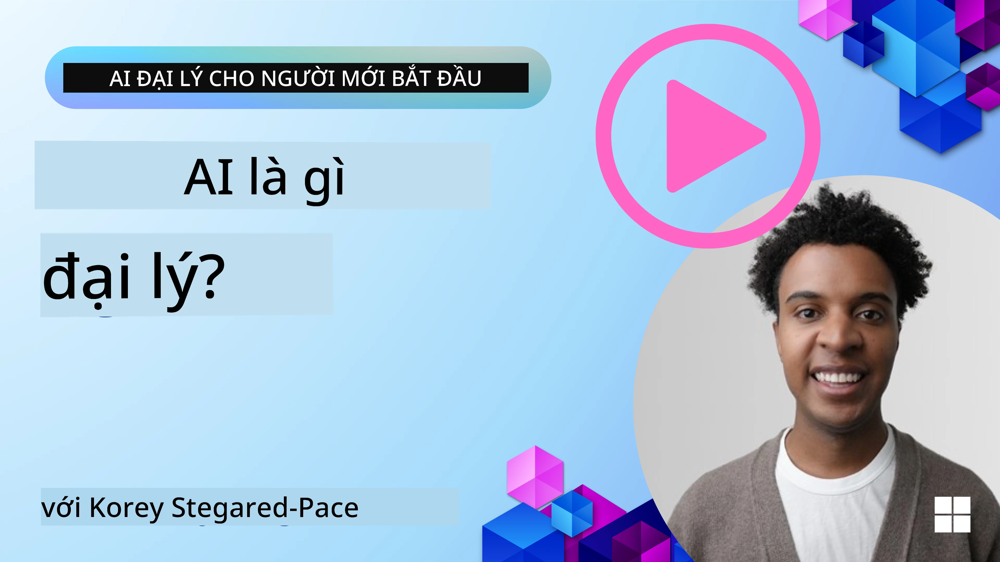
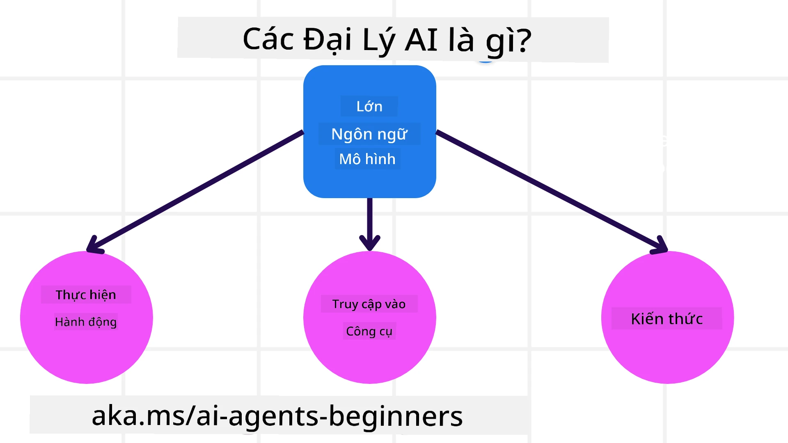
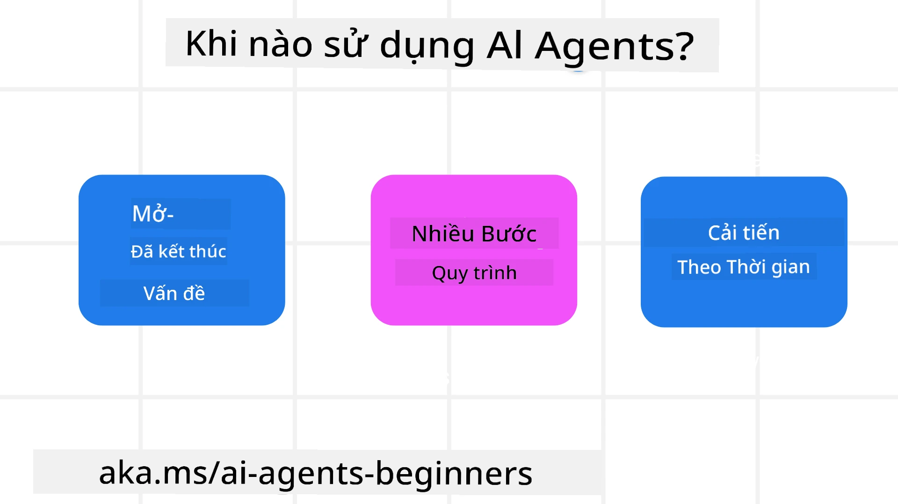

> _(Nhấp vào hình ở trên để xem video của bài học này)_

# Giới thiệu về Tác nhân AI và Các Trường hợp Sử dụng Tác nhân

Chào mừng bạn đến với khóa học "AI Agents for Beginners"! Khóa học này cung cấp kiến thức cơ bản và các ví dụ áp dụng để xây dựng Tác nhân AI.

Tham gia <a href="https://discord.gg/kzRShWzttr" target="_blank">Cộng đồng Azure AI trên Discord</a> để gặp gỡ những người học khác và những Nhà xây dựng Tác nhân AI và đặt bất kỳ câu hỏi nào bạn có về khóa học này.

Để bắt đầu khóa học này, chúng ta sẽ bắt đầu bằng cách hiểu rõ hơn Tác nhân AI là gì và cách chúng ta có thể sử dụng chúng trong các ứng dụng và quy trình làm việc mà chúng ta xây dựng.

## Giới thiệu

Bài học này bao gồm:

- Tác nhân AI là gì và có những loại tác nhân nào?
- Những trường hợp sử dụng nào phù hợp nhất với Tác nhân AI và chúng có thể giúp chúng ta như thế nào?
- Một số thành phần cơ bản khi thiết kế Giải pháp theo tác nhân là gì?

## Mục tiêu học tập
Sau khi hoàn thành bài học này, bạn nên có khả năng:

- Hiểu các khái niệm về Tác nhân AI và cách chúng khác với các giải pháp AI khác.
- Áp dụng Tác nhân AI một cách hiệu quả nhất.
- Thiết kế các giải pháp theo tác nhân một cách năng suất cho cả người dùng và khách hàng.

## Định nghĩa Tác nhân AI và Các loại Tác nhân AI

### Tác nhân AI là gì?

Tác nhân AI là **hệ thống** cho phép **Large Language Models(LLMs)** **thực hiện hành động** bằng cách mở rộng khả năng của chúng bằng cách cung cấp cho LLMs **quyền truy cập vào công cụ** và **kiến thức**.

Hãy phân tách định nghĩa này thành các phần nhỏ hơn:

- **System** - Điều quan trọng là nghĩ về các tác nhân không chỉ là một thành phần đơn lẻ mà là một hệ thống gồm nhiều thành phần. Ở mức cơ bản, các thành phần của một Tác nhân AI là:
  - **Environment** - Không gian được xác định nơi Tác nhân AI hoạt động. Ví dụ, nếu chúng ta có một tác nhân đặt vé du lịch, môi trường có thể là hệ thống đặt vé du lịch mà Tác nhân AI sử dụng để hoàn thành nhiệm vụ.
  - **Sensors** - Môi trường có thông tin và cung cấp phản hồi. Tác nhân AI sử dụng cảm biến để thu thập và diễn giải thông tin này về trạng thái hiện tại của môi trường. Trong ví dụ Tác nhân Đặt vé Du lịch, hệ thống đặt vé có thể cung cấp thông tin như tình trạng phòng khách sạn hoặc giá vé máy bay.
  - **Actuators** - Khi Tác nhân AI nhận được trạng thái hiện tại của môi trường, đối với nhiệm vụ hiện tại, tác nhân xác định hành động cần thực hiện để thay đổi môi trường. Đối với tác nhân đặt vé du lịch, đó có thể là đặt một phòng còn trống cho người dùng.

**Mô hình ngôn ngữ lớn** - Khái niệm về tác nhân tồn tại trước khi có LLM. Lợi thế của việc xây dựng Tác nhân AI với LLM là khả năng diễn giải ngôn ngữ con người và dữ liệu. Khả năng này cho phép LLM diễn giải thông tin môi trường và xác định kế hoạch để thay đổi môi trường.

**Thực hiện hành động** - Bên ngoài hệ thống Tác nhân AI, LLM bị giới hạn ở các tình huống mà hành động là tạo nội dung hoặc thông tin dựa trên lời nhắc của người dùng. Bên trong hệ thống Tác nhân AI, LLM có thể hoàn thành nhiệm vụ bằng cách diễn giải yêu cầu của người dùng và sử dụng các công cụ có trong môi trường của chúng.

**Truy cập Công cụ** - Những công cụ mà LLM được truy cập được xác định bởi 1) môi trường mà nó đang hoạt động và 2) nhà phát triển của Tác nhân AI. Trong ví dụ tác nhân du lịch của chúng ta, công cụ của tác nhân bị giới hạn bởi các thao tác có trong hệ thống đặt vé, và/hoặc nhà phát triển có thể giới hạn quyền truy cập công cụ của tác nhân chỉ vào vé máy bay.

**Bộ nhớ+Kiến thức** - Bộ nhớ có thể là ngắn hạn trong bối cảnh cuộc hội thoại giữa người dùng và tác nhân. Về dài hạn, ngoài thông tin do môi trường cung cấp, Tác nhân AI cũng có thể truy xuất kiến thức từ các hệ thống, dịch vụ, công cụ khác và thậm chí từ các tác nhân khác. Trong ví dụ tác nhân du lịch, kiến thức này có thể là thông tin về sở thích du lịch của người dùng được lưu trong cơ sở dữ liệu khách hàng.

### Các loại tác nhân

Bây giờ chúng ta đã có định nghĩa chung về Tác nhân AI, hãy xem một số loại tác nhân cụ thể và cách chúng được áp dụng cho một tác nhân đặt vé du lịch.

| **Loại Tác nhân**                | **Mô tả**                                                                                                                       | **Ví dụ**                                                                                                                                                                                                                   |
| ----------------------------- | ------------------------------------------------------------------------------------------------------------------------------------- | ----------------------------------------------------------------------------------------------------------------------------------------------------------------------------------------------------------------------------- |
| **Simple Reflex Agents**      | Thực hiện hành động ngay lập tức dựa trên các quy tắc định sẵn.                                                                                  | Tác nhân du lịch diễn giải nội dung email và chuyển các phản hồi khiếu nại về du lịch đến bộ phận chăm sóc khách hàng.                                                                                                                          |
| **Model-Based Reflex Agents** | Thực hiện hành động dựa trên một mô hình của thế giới và các thay đổi đối với mô hình đó.                                                              | Tác nhân du lịch ưu tiên các tuyến có biến động giá đáng kể dựa trên việc truy cập dữ liệu giá lịch sử.                                                                                                             |
| **Goal-Based Agents**         | Tạo kế hoạch để đạt được các mục tiêu cụ thể bằng cách diễn giải mục tiêu và xác định các hành động để đạt được nó.                                  | Tác nhân du lịch đặt một hành trình bằng cách xác định các sắp xếp du lịch cần thiết (ô tô, phương tiện công cộng, chuyến bay) từ vị trí hiện tại đến điểm đến.                                                                                |
| **Utility-Based Agents**      | Xem xét các sở thích và đánh đổi một cách số hóa để xác định cách đạt được mục tiêu.                                               | Tác nhân du lịch tối đa hóa lợi ích bằng cách đánh giá sự tiện lợi so với chi phí khi đặt chuyến đi.                                                                                                                                          |
| **Learning Agents**           | Cải thiện theo thời gian bằng cách phản hồi lại phản hồi và điều chỉnh hành động cho phù hợp.                                                        | Tác nhân du lịch cải thiện bằng cách sử dụng phản hồi của khách hàng từ khảo sát sau chuyến đi để điều chỉnh các đặt trước trong tương lai.                                                                                                               |
| **Hierarchical Agents**       | Có nhiều tác nhân trong một hệ thống phân tầng, với các tác nhân cấp cao hơn chia nhỏ nhiệm vụ thành các nhiệm vụ phụ cho các tác nhân cấp thấp hoàn thành. | Tác nhân du lịch hủy một chuyến đi bằng cách chia nhiệm vụ thành các nhiệm vụ phụ (ví dụ, hủy các đặt chỗ cụ thể) và giao cho các tác nhân cấp thấp hoàn thành chúng, báo cáo lại cho tác nhân cấp cao hơn.                                     |
| **Multi-Agent Systems (MAS)** | Các tác nhân hoàn thành nhiệm vụ độc lập, có thể hợp tác hoặc cạnh tranh.                                                           | Hợp tác: Nhiều tác nhân đặt các dịch vụ du lịch cụ thể như khách sạn, chuyến bay và giải trí. Cạnh tranh: Nhiều tác nhân quản lý và cạnh tranh trên một lịch đặt phòng khách sạn chung để book khách hàng vào khách sạn. |

## Khi nào nên sử dụng Tác nhân AI

Ở phần trước, chúng ta đã sử dụng trường hợp sử dụng Tác nhân Du lịch để giải thích cách các loại tác nhân khác nhau có thể được dùng trong các kịch bản đặt vé du lịch khác nhau. Chúng ta sẽ tiếp tục sử dụng ứng dụng này xuyên suốt khóa học.

Hãy xem các loại trường hợp sử dụng mà Tác nhân AI phù hợp nhất:

- **Vấn đề mở** - cho phép LLM xác định các bước cần thiết để hoàn thành nhiệm vụ vì điều này không phải lúc nào cũng có thể mã hóa cứng vào một quy trình.
- **Quy trình nhiều bước** - nhiệm vụ yêu cầu mức độ phức tạp trong đó Tác nhân AI cần sử dụng công cụ hoặc thông tin qua nhiều lượt thay vì truy xuất một lần.  
- **Cải thiện theo thời gian** - nhiệm vụ mà tác nhân có thể cải thiện theo thời gian bằng cách nhận phản hồi từ môi trường hoặc người dùng để cung cấp tiện ích tốt hơn.

Chúng tôi đề cập thêm các cân nhắc khi sử dụng Tác nhân AI trong bài học Xây dựng Tác nhân AI Đáng tin cậy.

## Cơ bản về Giải pháp Agentic

### Phát triển Tác nhân

Bước đầu tiên trong việc thiết kế một hệ thống Tác nhân AI là xác định các công cụ, hành động và hành vi. Trong khóa học này, chúng tôi tập trung vào việc sử dụng **Azure AI Agent Service** để định nghĩa các Tác nhân của mình. Nó cung cấp các tính năng như:

- Lựa chọn các Mô hình mở như OpenAI, Mistral và Llama
- Sử dụng Dữ liệu được cấp phép thông qua các nhà cung cấp như Tripadvisor
- Sử dụng các công cụ OpenAPI 3.0 chuẩn hóa

### Mẫu Agentic

Giao tiếp với LLM thông qua lời nhắc. Với bản chất bán tự động của Tác nhân AI, không phải lúc nào cũng có thể hoặc cần thiết để yêu cầu LLM bằng tay sau khi có thay đổi trong môi trường. Chúng tôi sử dụng **Agentic Patterns** cho phép chúng ta nhắc LLM qua nhiều bước theo cách có thể mở rộng hơn.

Khóa học này được chia theo một số mẫu Agentic đang phổ biến hiện nay.

### Khung Agentic

Khung Agentic cho phép nhà phát triển triển khai các mẫu theo tác nhân thông qua mã. Các khung này cung cấp các mẫu, plugin và công cụ để cộng tác Tác nhân AI tốt hơn. Những lợi ích này cung cấp khả năng quan sát và xử lý sự cố tốt hơn cho các hệ thống Tác nhân AI.

Trong khóa học này, chúng ta sẽ khám phá Microsoft Agent Framework (MAF) để xây dựng các tác nhân AI sẵn sàng đưa vào sản xuất.

## Mã mẫu

- Python: [Agent Framework](./code_samples/01-python-agent-framework.ipynb)
- .NET: [Agent Framework](./code_samples/01-dotnet-agent-framework.md)

## Còn thắc mắc về Tác nhân AI?

Tham gia [Microsoft Foundry Discord](https://aka.ms/ai-agents/discord) để gặp gỡ những người học khác, tham dự giờ hỗ trợ và nhận câu trả lời cho các câu hỏi về Tác nhân AI của bạn.

## Bài học trước

[Course Setup](../00-course-setup/README.md)

## Bài học tiếp theo

[Exploring Agentic Frameworks](../02-explore-agentic-frameworks/README.md)

---

<!-- CO-OP TRANSLATOR DISCLAIMER START -->
Miễn trừ trách nhiệm:

Tài liệu này đã được dịch bằng dịch vụ dịch thuật AI Co-op Translator (https://github.com/Azure/co-op-translator). Mặc dù chúng tôi nỗ lực để đảm bảo độ chính xác, xin lưu ý rằng các bản dịch tự động có thể chứa sai sót hoặc không chính xác. Văn bản gốc bằng ngôn ngữ gốc của tài liệu nên được coi là nguồn có thẩm quyền. Đối với thông tin quan trọng, khuyến nghị sử dụng dịch vụ dịch thuật chuyên nghiệp do con người thực hiện. Chúng tôi không chịu trách nhiệm về bất kỳ hiểu lầm hoặc diễn giải sai nào phát sinh từ việc sử dụng bản dịch này.
<!-- CO-OP TRANSLATOR DISCLAIMER END -->