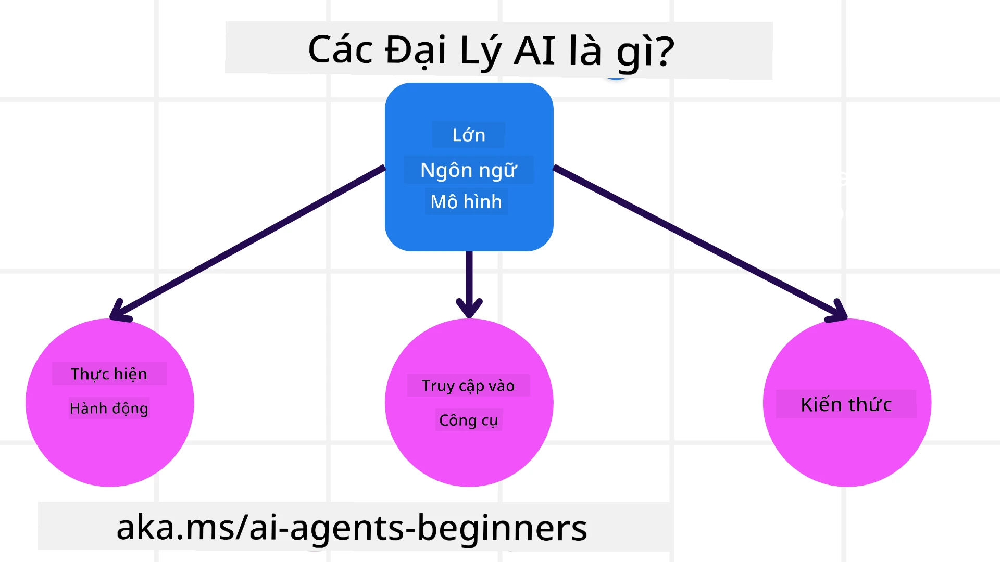
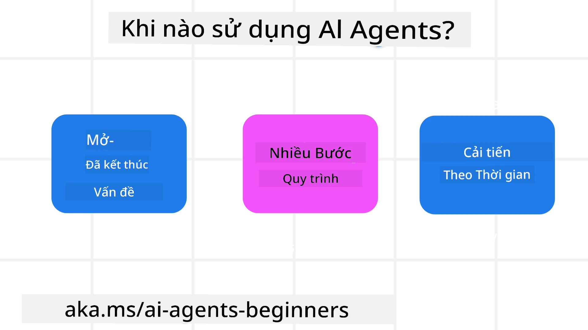

> _(Nhấp vào hình ảnh trên để xem video cho bài học này)_

# Giới thiệu về AI Agents và Các trường hợp sử dụng Agent

Chào mừng bạn đến với khóa học **AI Agents cho Người mới bắt đầu**! Khóa học này cung cấp cho bạn kiến thức nền tảng — và mã nguồn thực tế — để bắt đầu xây dựng AI Agents từ đầu.

Hãy đến chào hỏi trong <a href="https://discord.gg/kzRShWzttr" target="_blank">Cộng đồng Azure AI trên Discord</a> — nơi đây đầy ắp những người học và nhà xây dựng AI sẵn sàng trả lời các câu hỏi.

Trước khi bắt tay xây dựng, hãy chắc chắn rằng chúng ta thực sự hiểu AI Agent *là gì* và khi nào nên sử dụng nó.

---

## Giới thiệu

Bài học này bao gồm:

- AI Agents là gì, và những loại khác nhau tồn tại
- Các loại công việc mà AI Agents phù hợp nhất để thực hiện
- Các thành phần cơ bản bạn sẽ sử dụng khi thiết kế giải pháp Agentic

## Mục tiêu học tập

Đến cuối bài học này, bạn sẽ có thể:

- Giải thích AI Agent là gì và cách nó khác với giải pháp AI thông thường
- Biết khi nào nên sử dụng AI Agent (và khi nào không nên)
- Phác thảo thiết kế giải pháp Agentic cơ bản cho một vấn đề thực tế

---

## Định nghĩa AI Agents và Các loại AI Agents

### AI Agents là gì?

Đây là cách đơn giản để suy nghĩ về nó:

> **AI Agents là các hệ thống cho phép Mô Hình Ngôn Ngữ Lớn (LLMs) thực sự *làm việc* — bằng cách cung cấp cho chúng công cụ và kiến thức để tác động đến thế giới, không chỉ phản hồi lời nhắc.**

Hãy phân tích một chút:

- **Hệ thống** — Một AI Agent không chỉ là một thứ. Nó là một tập hợp các phần làm việc với nhau. Cốt lõi, mỗi agent có ba phần:
  - **Môi trường** — Không gian mà agent hoạt động. Với agent đặt vé du lịch, đây sẽ là nền tảng đặt vé.
  - **Cảm biến** — Cách agent đọc trạng thái hiện tại của môi trường. Agent du lịch có thể kiểm tra tình trạng phòng khách sạn hoặc giá vé máy bay.
  - **Bộ chấp hành** — Cách agent thực hiện hành động. Agent du lịch có thể đặt phòng, gửi xác nhận hoặc hủy đặt chỗ.

- **Mô hình Ngôn ngữ Lớn** — Các agent tồn tại trước LLM, nhưng LLM tạo ra sức mạnh cho các agent hiện đại. Chúng có thể hiểu ngôn ngữ tự nhiên, lập luận theo ngữ cảnh và chuyển đổi yêu cầu mơ hồ của người dùng thành kế hoạch hành động cụ thể.

- **Thực hiện hành động** — Không có hệ thống agent, LLM chỉ tạo ra văn bản. Trong hệ thống agent, LLM có thể *thực thi* các bước — tìm kiếm cơ sở dữ liệu, gọi API, gửi tin nhắn.

- **Truy cập Công cụ** — Các công cụ agent sử dụng phụ thuộc vào (1) môi trường nó chạy và (2) những gì nhà phát triển cung cấp. Agent du lịch có thể tìm kiếm chuyến bay nhưng không thể chỉnh sửa hồ sơ khách hàng — tất cả phụ thuộc vào cách bạn kết nối.

- **Bộ nhớ + Kiến thức** — Các agent có thể có bộ nhớ ngắn hạn (cuộc trò chuyện hiện tại) và bộ nhớ dài hạn (cơ sở dữ liệu khách hàng, các tương tác trước). Agent du lịch có thể "nhớ" rằng bạn thích chỗ ngồi gần cửa sổ.

---

### Các loại AI Agents khác nhau

Không phải tất cả các agent đều được xây dựng giống nhau. Đây là phân loại các loại chính, dùng ví dụ agent đặt vé du lịch:

| **Loại Agent** | **Chức năng** | **Ví dụ Agent Du Lịch** |
|---|---|---|
| **Simple Reflex Agents** | Tuân theo quy tắc cứng nhắc — không có bộ nhớ, không có lập kế hoạch. | Thấy email phàn nàn → chuyển tiếp cho bộ phận chăm sóc khách hàng. Chỉ vậy thôi. |
| **Model-Based Reflex Agents** | Giữ mô hình nội bộ về thế giới và cập nhật khi có thay đổi. | Theo dõi giá vé lịch sử và cảnh báo các tuyến đường đột ngột tăng giá. |
| **Goal-Based Agents** | Có mục tiêu và tìm cách đạt được mục tiêu từng bước. | Đặt chuyến đi đầy đủ (bay, xe, khách sạn) từ vị trí hiện tại đến điểm đến. |
| **Utility-Based Agents** | Không chỉ tìm một giải pháp — mà tìm giải pháp *tốt nhất* bằng cách cân nhắc các đánh đổi. | Cân bằng chi phí và tiện lợi để tìm chuyến đi đáp ứng ưu tiên của bạn nhất. |
| **Learning Agents** | Cải thiện theo thời gian bằng cách học từ phản hồi. | Điều chỉnh đề xuất đặt vé dựa trên khảo sát sau chuyến đi. |
| **Hierarchical Agents** | Agent cấp cao chia công việc thành các nhiệm vụ con và giao cho các agent cấp thấp hơn. | Yêu cầu "hủy chuyến đi" được chia thành: hủy vé máy bay, hủy khách sạn, hủy thuê xe — mỗi phần do agent phụ xử lý. |
| **Hệ thống đa Agent (MAS)** | Nhiều agent độc lập làm việc cùng nhau (hoặc cạnh tranh). | Hợp tác: các agent riêng biệt xử lý khách sạn, chuyến bay và giải trí. Cạnh tranh: nhiều agent tranh giành chỗ khách sạn với giá tốt nhất. |

---

## Khi nào nên sử dụng AI Agents

Chỉ vì bạn *có thể* dùng AI Agent không có nghĩa lúc nào cũng *nên*. Đây là những tình huống agent thực sự phát huy:

- **Vấn đề mở** — Khi các bước giải quyết không thể lập trình trước. Bạn cần LLM tự tìm đường đi động.
- **Quy trình nhiều bước** — Công việc cần dùng công cụ qua nhiều lượt, không chỉ tra cứu hoặc tạo ra một lần.
- **Cải thiện theo thời gian** — Khi bạn muốn hệ thống trở nên thông minh hơn dựa trên phản hồi người dùng hoặc tín hiệu môi trường.

Chúng ta sẽ đi sâu hơn vào khi nào (và khi nào *không*) nên dùng AI Agents trong bài **Xây dựng AI Agents Đáng tin cậy** sau này trong khóa học.

---

## Kiến thức cơ bản về Giải pháp Agentic

### Phát triển Agent

Điều đầu tiên bạn làm khi xây dựng một agent là xác định *nó có thể làm gì* — các công cụ, hành động và hành vi.

Trong khóa học này, chúng tôi sử dụng **Dịch vụ Agent Microsoft Foundry** làm nền tảng chính. Nó hỗ trợ:

- Các mô hình từ nhà cung cấp như OpenAI, Mistral, và Meta (Llama)
- Dữ liệu có bản quyền từ nhà cung cấp như Tripadvisor
- Định nghĩa công cụ OpenAPI 3.0 tiêu chuẩn

### Các mẫu Agentic

Bạn giao tiếp với LLM thông qua các lời nhắc. Với các agent, bạn không thể tự tay tạo từng lời nhắc thủ công — agent cần thực hiện hành động qua nhiều bước. Đây là lúc **Các mẫu Agentic** xuất hiện. Đây là các chiến lược tái sử dụng để nhắc và điều phối LLM theo cách có thể mở rộng và đáng tin cậy hơn.

Khóa học này được cấu trúc xoay quanh các mẫu agentic phổ biến và hữu ích nhất.

### Các khung Agentic

Các khung Agentic cung cấp cho nhà phát triển các mẫu có sẵn, công cụ, và hạ tầng để xây dựng agent. Chúng giúp:

- Kết nối công cụ và khả năng
- Quan sát những gì agent đang làm (và gỡ lỗi khi có vấn đề)
- Hợp tác giữa nhiều agent

Trong khóa học này, chúng ta tập trung vào **Khung Agent Microsoft (MAF)** để xây dựng các agent sẵn sàng sản xuất.

---

## Mẫu mã nguồn

Sẵn sàng xem nó hoạt động? Đây là các mẫu mã nguồn cho bài học này:

- 🐍 Python: [Agent Framework](./code_samples/01-python-agent-framework.ipynb)
- 🔷 .NET: [Agent Framework](./code_samples/01-dotnet-agent-framework.md)

---

## Có câu hỏi?

Tham gia [Microsoft Foundry Discord](https://discord.com/invite/ATgtXmAS5D) để kết nối với các học viên khác, tham dự giờ làm việc, và nhận được câu trả lời cho các câu hỏi về AI Agent từ cộng đồng.

---

## Bài học trước

[Cài đặt khóa học](../00-course-setup/README.md)

## Bài học tiếp theo

[Khám phá các khung Agentic](../02-explore-agentic-frameworks/README.md)

---

<!-- CO-OP TRANSLATOR DISCLAIMER START -->
**Tuyên bố miễn trừ trách nhiệm**:
Tài liệu này đã được dịch bằng dịch vụ dịch thuật AI [Co-op Translator](https://github.com/Azure/co-op-translator). Mặc dù chúng tôi cố gắng đảm bảo độ chính xác, xin lưu ý rằng bản dịch tự động có thể chứa lỗi hoặc sai sót. Tài liệu gốc bằng ngôn ngữ gốc nên được coi là nguồn tin chính thức. Đối với thông tin quan trọng, nên sử dụng dịch vụ dịch thuật chuyên nghiệp bởi con người. Chúng tôi không chịu trách nhiệm về bất kỳ hiểu lầm hoặc giải thích sai nào phát sinh từ việc sử dụng bản dịch này.
<!-- CO-OP TRANSLATOR DISCLAIMER END -->