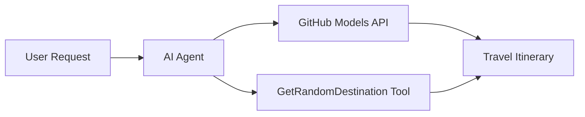

<!--
CO_OP_TRANSLATOR_METADATA:
{
  "original_hash": "23afd9be7b6ba5b69a44c3b6a78e07f6",
  "translation_date": "2025-11-06T10:05:23+00:00",
  "source_file": "01-intro-to-ai-agents/code_samples/01-dotnet-agent-framework.md",
  "language_code": "vi"
}
-->
# 🌍 Đại lý Du lịch AI với Microsoft Agent Framework (.NET)

## 📋 Tổng quan Kịch bản

Notebook này hướng dẫn cách xây dựng một đại lý du lịch thông minh sử dụng Microsoft Agent Framework cho .NET. Đại lý có thể tự động tạo lịch trình du lịch cá nhân hóa cho các điểm đến ngẫu nhiên trên toàn thế giới.

**Các khả năng chính:**
- 🎲 **Chọn điểm đến ngẫu nhiên**: Sử dụng công cụ tùy chỉnh để chọn địa điểm nghỉ dưỡng
- 🗺️ **Lập kế hoạch du lịch thông minh**: Tạo lịch trình chi tiết từng ngày
- 🔄 **Phát trực tiếp theo thời gian thực**: Hỗ trợ cả phản hồi ngay lập tức và phát trực tiếp
- 🛠️ **Tích hợp công cụ tùy chỉnh**: Minh họa cách mở rộng khả năng của đại lý

## 🔧 Kiến trúc Kỹ thuật

### Công nghệ cốt lõi
- **Microsoft Agent Framework**: Phiên bản .NET mới nhất dành cho phát triển đại lý AI
- **Tích hợp Mô hình GitHub**: Sử dụng dịch vụ suy luận mô hình AI của GitHub
- **Tương thích API OpenAI**: Tận dụng thư viện khách hàng của OpenAI với các điểm cuối tùy chỉnh
- **Cấu hình bảo mật**: Quản lý khóa API dựa trên môi trường

### Các thành phần chính
1. **AIAgent**: Bộ điều phối chính của đại lý xử lý luồng hội thoại
2. **Công cụ tùy chỉnh**: Hàm `GetRandomDestination()` có sẵn cho đại lý
3. **Chat Client**: Giao diện hội thoại hỗ trợ mô hình GitHub
4. **Hỗ trợ phát trực tiếp**: Khả năng tạo phản hồi theo thời gian thực

### Mô hình tích hợp


## 🚀 Bắt đầu

**Yêu cầu:**
- .NET 10.0 hoặc cao hơn
- Token truy cập API của GitHub Models
- Biến môi trường được cấu hình trong tệp `.env`

**Biến môi trường cần thiết:**
```env
GITHUB_TOKEN=your_github_token
GITHUB_ENDPOINT=https://models.inference.ai.azure.com
GITHUB_MODEL_ID=gpt-4o-mini
```

Chạy mẫu mã dưới đây theo thứ tự để xem đại lý du lịch hoạt động!

---

## Ứng dụng Đơn File .NET: Ví dụ về Đại lý Du lịch AI

Xem `01-dotnet-agent-framework.cs` để có mẫu mã hoàn chỉnh có thể chạy.

```bash
dotnet run 01-dotnet-agent-framework.cs
```

### Mẫu mã

```csharp
static string GetRandomDestination()
{
    var destinations = new List<string>
    {
        "Paris, France",
        "Tokyo, Japan",
        "New York City, USA",
        "Sydney, Australia",
        "Rome, Italy",
        "Barcelona, Spain",
        "Cape Town, South Africa",
        "Rio de Janeiro, Brazil",
        "Bangkok, Thailand",
        "Vancouver, Canada"
    };
    var random = new Random();
    int index = random.Next(destinations.Count);
    return destinations[index];
}

// Extract configuration from environment variables
var github_endpoint = Environment.GetEnvironmentVariable("GITHUB_ENDPOINT") ?? throw new InvalidOperationException("GITHUB_ENDPOINT is not set.");
var github_model_id = Environment.GetEnvironmentVariable("GITHUB_MODEL_ID") ?? "gpt-4o-mini";
var github_token = Environment.GetEnvironmentVariable("GITHUB_TOKEN") ?? throw new InvalidOperationException("GITHUB_TOKEN is not set.");

// Configure OpenAI Client Options
var openAIOptions = new OpenAIClientOptions()
{
    Endpoint = new Uri(github_endpoint)
};

// Initialize OpenAI Client with GitHub Models Configuration
var openAIClient = new OpenAIClient(new ApiKeyCredential(github_token), openAIOptions);

// Create AI Agent with Travel Planning Capabilities
AIAgent agent = openAIClient
    .GetChatClient(github_model_id)
    .CreateAIAgent(
        instructions: "You are a helpful AI Agent that can help plan vacations for customers at random destinations",
        tools: [AIFunctionFactory.Create(GetRandomDestination)]
    );

// Execute Agent: Plan a Day Trip (Non-Streaming)
Console.WriteLine(await agent.RunAsync("Plan me a day trip"));

// Execute Agent: Plan a Day Trip (Streaming Response)
await foreach (var update in agent.RunStreamingAsync("Plan me a day trip"))
{
    Console.Write(update);
}
```

---

**Tuyên bố miễn trừ trách nhiệm**:  
Tài liệu này đã được dịch bằng dịch vụ dịch thuật AI [Co-op Translator](https://github.com/Azure/co-op-translator). Mặc dù chúng tôi cố gắng đảm bảo độ chính xác, xin lưu ý rằng các bản dịch tự động có thể chứa lỗi hoặc không chính xác. Tài liệu gốc bằng ngôn ngữ bản địa nên được coi là nguồn thông tin chính thức. Đối với thông tin quan trọng, nên sử dụng dịch vụ dịch thuật chuyên nghiệp bởi con người. Chúng tôi không chịu trách nhiệm cho bất kỳ sự hiểu lầm hoặc diễn giải sai nào phát sinh từ việc sử dụng bản dịch này.