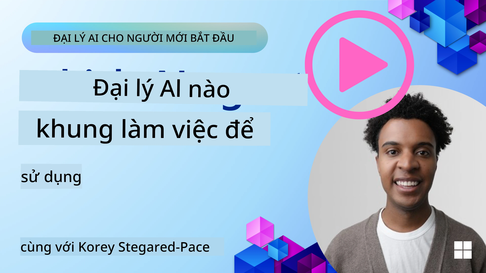

[](https://youtu.be/ODwF-EZo_O8?si=1xoy_B9RNQfrYdF7)

> _(Nhấp vào hình ảnh ở trên để xem video của bài học này)_

# Khám phá các khung tác nhân AI

Các khung tác nhân AI là các nền tảng phần mềm được thiết kế để đơn giản hóa việc tạo, triển khai và quản lý các tác nhân AI. Các khung này cung cấp cho nhà phát triển các thành phần, trừu tượng và công cụ đã được xây dựng sẵn giúp tinh gọn việc phát triển các hệ thống AI phức tạp.

Những khung này giúp các nhà phát triển tập trung vào các khía cạnh độc đáo của ứng dụng bằng cách cung cấp các cách tiếp cận tiêu chuẩn cho các thách thức phổ biến trong phát triển tác nhân AI. Chúng cải thiện tính mở rộng, khả năng tiếp cận và hiệu quả trong việc xây dựng hệ thống AI.

## Giới thiệu 

Bài học này sẽ bao quát:

- Khung tác nhân AI là gì và chúng cho phép các nhà phát triển đạt được điều gì?
- Các nhóm có thể sử dụng chúng như thế nào để nhanh chóng phác thảo nguyên mẫu, lặp lại và cải thiện khả năng của tác nhân?
- Sự khác biệt giữa các khung và công cụ do Microsoft tạo ra ( <a href="https://aka.ms/ai-agents-beginners/ai-agent-service" target="_blank">Dịch vụ Azure AI Agent</a> và <a href="https://learn.microsoft.com/azure/ai-services/openai/how-to/responses" target="_blank">Khung tác nhân Microsoft</a>) là gì?
- Tôi có thể tích hợp trực tiếp các công cụ trong hệ sinh thái Azure hiện tại của mình, hay tôi cần các giải pháp độc lập?
- Dịch vụ Azure AI Agents là gì và điều này đang giúp tôi như thế nào?

## Mục tiêu học tập

Mục tiêu của bài học này là giúp bạn hiểu:

- Vai trò của các khung tác nhân AI trong phát triển AI.
- Cách tận dụng các khung tác nhân AI để xây dựng các tác nhân thông minh.
- Các khả năng chính được bật bởi các khung tác nhân AI.
- Sự khác biệt giữa Khung tác nhân Microsoft và Dịch vụ Azure AI Agent.

## Khung tác nhân AI là gì và chúng cho phép các nhà phát triển làm gì?

Các Khung AI truyền thống có thể giúp bạn tích hợp AI vào ứng dụng và làm cho các ứng dụng này tốt hơn theo những cách sau:

- **Cá nhân hóa**: AI có thể phân tích hành vi và sở thích của người dùng để cung cấp đề xuất, nội dung và trải nghiệm cá nhân hóa.
Ví dụ: Các dịch vụ phát trực tuyến như Netflix sử dụng AI để gợi ý phim và chương trình dựa trên lịch sử xem, tăng mức độ tương tác và hài lòng của người dùng.
- **Tự động hóa và Hiệu quả**: AI có thể tự động hóa các tác vụ lặp đi lặp lại, tinh gọn quy trình làm việc và cải thiện hiệu quả vận hành.
Ví dụ: Ứng dụng dịch vụ khách hàng sử dụng chatbot được hỗ trợ bởi AI để xử lý các câu hỏi phổ biến, giảm thời gian phản hồi và giải phóng nhân viên cho các vấn đề phức tạp hơn.
- **Cải thiện Trải nghiệm Người dùng**: AI có thể nâng cao trải nghiệm tổng thể của người dùng bằng cách cung cấp các tính năng thông minh như nhận dạng giọng nói, xử lý ngôn ngữ tự nhiên và gợi ý văn bản.
Ví dụ: Trợ lý ảo như Siri và Google Assistant sử dụng AI để hiểu và phản hồi các lệnh bằng giọng nói, giúp người dùng tương tác dễ dàng hơn với thiết bị.

### Nghe có vẻ tuyệt vời, vậy tại sao chúng ta cần Khung tác nhân AI?

Các khung tác nhân AI đại diện cho nhiều hơn là chỉ các khung AI thông thường. Chúng được thiết kế để cho phép tạo ra các tác nhân thông minh có thể tương tác với người dùng, các tác nhân khác và môi trường để đạt được các mục tiêu cụ thể. Những tác nhân này có thể biểu hiện hành vi tự chủ, đưa ra quyết định và thích nghi với các điều kiện thay đổi. Hãy xem một số khả năng chính được cung cấp bởi các khung tác nhân AI:

- **Hợp tác và Phối hợp giữa các tác nhân**: Cho phép tạo nhiều tác nhân AI có thể làm việc cùng nhau, giao tiếp và phối hợp để giải quyết các nhiệm vụ phức tạp.
- **Tự động hóa và Quản lý tác vụ**: Cung cấp cơ chế tự động hóa các luồng công việc nhiều bước, phân công tác vụ và quản lý tác vụ động giữa các tác nhân.
- **Hiểu bối cảnh và Thích ứng**: Trang bị cho tác nhân khả năng hiểu bối cảnh, thích ứng với môi trường thay đổi và đưa ra quyết định dựa trên thông tin thời gian thực.

Tóm lại, các tác nhân cho phép bạn làm nhiều hơn, đưa tự động hóa lên cấp độ cao hơn, tạo ra các hệ thống thông minh hơn có thể thích nghi và học hỏi từ môi trường của chúng.

## Làm thế nào để nhanh chóng phác thảo nguyên mẫu, lặp lại và cải thiện khả năng của tác nhân?

Đây là một lĩnh vực phát triển nhanh, nhưng có một số yếu tố phổ biến trong hầu hết các Khung tác nhân AI có thể giúp bạn nhanh chóng phác thảo nguyên mẫu và lặp lại, cụ thể là các thành phần mô-đun, công cụ cộng tác và học theo thời gian thực. Hãy đi sâu vào các điều này:

- **Sử dụng các Thành phần Mô-đun**: Các SDK AI cung cấp các thành phần dựng sẵn như bộ kết nối AI và Memory, gọi hàm bằng ngôn ngữ tự nhiên hoặc plugin mã, mẫu prompt, và nhiều hơn nữa.
- **Tận dụng Công cụ Hợp tác**: Thiết kế các tác nhân với vai trò và nhiệm vụ cụ thể, cho phép họ kiểm thử và tinh chỉnh luồng công việc cộng tác.
- **Học theo Thời gian thực**: Triển khai các vòng phản hồi nơi các tác nhân học từ tương tác và điều chỉnh hành vi của họ một cách động.

### Sử dụng các Thành phần Mô-đun

Các SDK như Khung tác nhân Microsoft cung cấp các thành phần dựng sẵn như bộ kết nối AI, định nghĩa công cụ, và quản lý tác nhân.

**Các nhóm có thể sử dụng chúng như thế nào**: Các nhóm có thể nhanh chóng lắp ráp các thành phần này để tạo một nguyên mẫu chức năng mà không cần bắt đầu từ con số không, cho phép thử nghiệm và lặp lại nhanh.

**Cách thức hoạt động trong thực tế**: Bạn có thể sử dụng một bộ phân tích dựng sẵn để trích xuất thông tin từ đầu vào của người dùng, một mô-đun bộ nhớ để lưu trữ và truy xuất dữ liệu, và một trình tạo prompt để tương tác với người dùng, tất cả mà không cần phải xây dựng các thành phần này từ đầu.

**Ví dụ mã**. Hãy xem một ví dụ về cách bạn có thể sử dụng Khung tác nhân Microsoft với `AzureAIProjectAgentProvider` để cho mô hình phản hồi đầu vào của người dùng với việc gọi công cụ:

``` python
# Ví dụ Python về Microsoft Agent Framework

import asyncio
import os
from typing import Annotated

from agent_framework.azure import AzureAIProjectAgentProvider
from azure.identity import AzureCliCredential


# Định nghĩa một hàm công cụ mẫu để đặt chuyến đi
def book_flight(date: str, location: str) -> str:
    """Book travel given location and date."""
    return f"Travel was booked to {location} on {date}"


async def main():
    provider = AzureAIProjectAgentProvider(credential=AzureCliCredential())
    agent = await provider.create_agent(
        name="travel_agent",
        instructions="Help the user book travel. Use the book_flight tool when ready.",
        tools=[book_flight],
    )

    response = await agent.run("I'd like to go to New York on January 1, 2025")
    print(response)
    # Ví dụ đầu ra: Chuyến bay của bạn đến New York vào ngày 1 tháng 1 năm 2025 đã được đặt thành công. Chúc bạn đi lại an toàn! ✈️🗽


if __name__ == "__main__":
    asyncio.run(main())
```

Những gì bạn có thể thấy từ ví dụ này là cách bạn có thể tận dụng một bộ phân tích dựng sẵn để trích xuất thông tin chính từ đầu vào của người dùng, chẳng hạn như điểm khởi hành, điểm đến và ngày của yêu cầu đặt chỗ chuyến bay. Cách tiếp cận mô-đun này cho phép bạn tập trung vào logic cấp cao.

### Tận dụng Công cụ Hợp tác

Các khung như Khung tác nhân Microsoft tạo điều kiện cho việc tạo nhiều tác nhân có thể làm việc cùng nhau.

**Các nhóm có thể sử dụng chúng như thế nào**: Các nhóm có thể thiết kế tác nhân với vai trò và nhiệm vụ cụ thể, cho phép họ kiểm thử và tinh chỉnh luồng công việc cộng tác và cải thiện hiệu quả hệ thống tổng thể.

**Cách thức hoạt động trong thực tế**: Bạn có thể tạo một nhóm tác nhân trong đó mỗi tác nhân có một chức năng chuyên môn, chẳng hạn như truy xuất dữ liệu, phân tích hoặc ra quyết định. Các tác nhân này có thể giao tiếp và chia sẻ thông tin để đạt được một mục tiêu chung, chẳng hạn như trả lời một truy vấn của người dùng hoặc hoàn thành một nhiệm vụ.

**Ví dụ mã (Khung tác nhân Microsoft)**:

```python
# Tạo nhiều đại lý làm việc cùng nhau sử dụng Microsoft Agent Framework

import os
from agent_framework.azure import AzureAIProjectAgentProvider
from azure.identity import AzureCliCredential

provider = AzureAIProjectAgentProvider(credential=AzureCliCredential())

# Đại lý lấy dữ liệu
agent_retrieve = await provider.create_agent(
    name="dataretrieval",
    instructions="Retrieve relevant data using available tools.",
    tools=[retrieve_tool],
)

# Đại lý phân tích dữ liệu
agent_analyze = await provider.create_agent(
    name="dataanalysis",
    instructions="Analyze the retrieved data and provide insights.",
    tools=[analyze_tool],
)

# Chạy các đại lý theo tuần tự trên một nhiệm vụ
retrieval_result = await agent_retrieve.run("Retrieve sales data for Q4")
analysis_result = await agent_analyze.run(f"Analyze this data: {retrieval_result}")
print(analysis_result)
```

Những gì bạn thấy trong đoạn mã trước là cách bạn có thể tạo một tác vụ bao gồm nhiều tác nhân làm việc cùng nhau để phân tích dữ liệu. Mỗi tác nhân thực hiện một chức năng cụ thể, và tác vụ được thực thi bằng cách phối hợp các tác nhân để đạt được kết quả mong muốn. Bằng cách tạo các tác nhân chuyên biệt với vai trò chuyên môn, bạn có thể cải thiện hiệu quả và hiệu suất của tác vụ.

### Học theo Thời gian thực

Các khung tiên tiến cung cấp khả năng hiểu bối cảnh và thích ứng theo thời gian thực.

**Các nhóm có thể sử dụng chúng như thế nào**: Các nhóm có thể triển khai các vòng phản hồi nơi các tác nhân học từ các tương tác và điều chỉnh hành vi một cách động, dẫn đến cải thiện liên tục và tinh chỉnh khả năng.

**Cách thức hoạt động trong thực tế**: Các tác nhân có thể phân tích phản hồi của người dùng, dữ liệu môi trường và kết quả nhiệm vụ để cập nhật cơ sở tri thức của họ, điều chỉnh thuật toán ra quyết định và cải thiện hiệu suất theo thời gian. Quá trình học lặp đi lặp lại này cho phép các tác nhân thích nghi với các điều kiện và sở thích người dùng thay đổi, nâng cao hiệu quả tổng thể của hệ thống.

## Sự khác biệt giữa Khung tác nhân Microsoft và Dịch vụ Azure AI Agent là gì?

Có nhiều cách để so sánh các phương pháp tiếp cận này, nhưng hãy xem một số khác biệt chính về thiết kế, khả năng và trường hợp sử dụng mục tiêu:

## Khung tác nhân Microsoft (MAF)

Khung tác nhân Microsoft cung cấp một SDK tinh gọn để xây dựng các tác nhân AI sử dụng `AzureAIProjectAgentProvider`. Nó cho phép các nhà phát triển tạo các tác nhân tận dụng các mô hình Azure OpenAI với khả năng gọi công cụ tích hợp, quản lý hội thoại và bảo mật cấp doanh nghiệp thông qua danh tính Azure.

**Trường hợp sử dụng**: Xây dựng các tác nhân AI sẵn sàng cho sản xuất với việc sử dụng công cụ, các luồng công việc nhiều bước và các kịch bản tích hợp doanh nghiệp.

Dưới đây là một số khái niệm cốt lõi quan trọng của Khung tác nhân Microsoft:

- **Tác nhân**. Một tác nhân được tạo thông qua `AzureAIProjectAgentProvider` và được cấu hình với tên, hướng dẫn và công cụ. Tác nhân có thể:
  - **Xử lý các tin nhắn của người dùng** và tạo phản hồi bằng cách sử dụng các mô hình Azure OpenAI.
  - **Gọi công cụ** tự động dựa trên ngữ cảnh hội thoại.
  - **Duy trì trạng thái hội thoại** qua nhiều tương tác.

  Đây là một đoạn mã minh họa cách tạo một tác nhân:

    ```python
    import os
    from agent_framework.azure import AzureAIProjectAgentProvider
    from azure.identity import AzureCliCredential

    provider = AzureAIProjectAgentProvider(credential=AzureCliCredential())
    agent = await provider.create_agent(
        name="my_agent",
        instructions="You are a helpful assistant.",
    )

    response = await agent.run("Hello, World!")
    print(response)
    ```

- **Công cụ**. Khung hỗ trợ định nghĩa công cụ như các hàm Python mà tác nhân có thể gọi tự động. Các công cụ được đăng ký khi tạo tác nhân:

    ```python
    def get_weather(location: str) -> str:
        """Get the current weather for a location."""
        return f"The weather in {location} is sunny, 72\u00b0F."

    agent = await provider.create_agent(
        name="weather_agent",
        instructions="Help users check the weather.",
        tools=[get_weather],
    )
    ```

- **Phối hợp Đa tác nhân**. Bạn có thể tạo nhiều tác nhân với các chuyên môn khác nhau và phối hợp công việc của họ:

    ```python
    planner = await provider.create_agent(
        name="planner",
        instructions="Break down complex tasks into steps.",
    )

    executor = await provider.create_agent(
        name="executor",
        instructions="Execute the planned steps using available tools.",
        tools=[execute_tool],
    )

    plan = await planner.run("Plan a trip to Paris")
    result = await executor.run(f"Execute this plan: {plan}")
    ```

- **Tích hợp Danh tính Azure**. Khung sử dụng `AzureCliCredential` (hoặc `DefaultAzureCredential`) cho xác thực an toàn, không cần khoá, loại bỏ nhu cầu quản lý trực tiếp các API key.

## Dịch vụ Azure AI Agent

Dịch vụ Azure AI Agent là một bổ sung gần đây hơn, được giới thiệu tại Microsoft Ignite 2024. Nó cho phép phát triển và triển khai các tác nhân AI với các mô hình linh hoạt hơn, chẳng hạn như gọi trực tiếp các LLM mã nguồn mở như Llama 3, Mistral và Cohere.

Dịch vụ Azure AI Agent cung cấp các cơ chế bảo mật doanh nghiệp mạnh mẽ và phương pháp lưu trữ dữ liệu, khiến nó phù hợp cho các ứng dụng doanh nghiệp.

Nó hoạt động ngay lập tức với Khung tác nhân Microsoft để xây dựng và triển khai các tác nhân.

Dịch vụ này hiện đang ở Giai đoạn Public Preview và hỗ trợ Python và C# để xây dựng tác nhân.

Sử dụng SDK Python của Dịch vụ Azure AI Agent, chúng ta có thể tạo một tác nhân với một công cụ do người dùng định nghĩa:

```python
import asyncio
from azure.identity import DefaultAzureCredential
from azure.ai.projects import AIProjectClient

# Định nghĩa các chức năng công cụ
def get_specials() -> str:
    """Provides a list of specials from the menu."""
    return """
    Special Soup: Clam Chowder
    Special Salad: Cobb Salad
    Special Drink: Chai Tea
    """

def get_item_price(menu_item: str) -> str:
    """Provides the price of the requested menu item."""
    return "$9.99"


async def main() -> None:
    credential = DefaultAzureCredential()
    project_client = AIProjectClient.from_connection_string(
        credential=credential,
        conn_str="your-connection-string",
    )

    agent = project_client.agents.create_agent(
        model="gpt-4o-mini",
        name="Host",
        instructions="Answer questions about the menu.",
        tools=[get_specials, get_item_price],
    )

    thread = project_client.agents.create_thread()

    user_inputs = [
        "Hello",
        "What is the special soup?",
        "How much does that cost?",
        "Thank you",
    ]

    for user_input in user_inputs:
        print(f"# User: '{user_input}'")
        message = project_client.agents.create_message(
            thread_id=thread.id,
            role="user",
            content=user_input,
        )
        run = project_client.agents.create_and_process_run(
            thread_id=thread.id, agent_id=agent.id
        )
        messages = project_client.agents.list_messages(thread_id=thread.id)
        print(f"# Agent: {messages.data[0].content[0].text.value}")


if __name__ == "__main__":
    asyncio.run(main())
```

### Khái niệm cốt lõi

Dịch vụ Azure AI Agent có các khái niệm cốt lõi sau:

- **Tác nhân**. Dịch vụ Azure AI Agent tích hợp với Microsoft Foundry. Trong AI Foundry, một Tác nhân AI hoạt động như một "microservice" thông minh có thể được sử dụng để trả lời câu hỏi (RAG), thực hiện hành động, hoặc tự động hóa hoàn toàn các luồng công việc. Nó đạt được điều này bằng cách kết hợp sức mạnh của các mô hình sinh tạo với các công cụ cho phép truy cập và tương tác với các nguồn dữ liệu thực tế. Đây là một ví dụ về một tác nhân:

    ```python
    agent = project_client.agents.create_agent(
        model="gpt-4o-mini",
        name="my-agent",
        instructions="You are helpful agent",
        tools=code_interpreter.definitions,
        tool_resources=code_interpreter.resources,
    )
    ```

    Trong ví dụ này, một tác nhân được tạo với mô hình `gpt-4o-mini`, tên `my-agent`, và hướng dẫn `You are helpful agent`. Tác nhân được trang bị các công cụ và tài nguyên để thực hiện các nhiệm vụ thông dịch mã.

- **Chuỗi (Thread) và tin nhắn**. Chuỗi là một khái niệm quan trọng khác. Nó đại diện cho một cuộc trò chuyện hoặc tương tác giữa một tác nhân và một người dùng. Các chuỗi có thể được sử dụng để theo dõi tiến trình của một cuộc trò chuyện, lưu trữ thông tin ngữ cảnh và quản lý trạng thái của tương tác. Đây là một ví dụ về một chuỗi:

    ```python
    thread = project_client.agents.create_thread()
    message = project_client.agents.create_message(
        thread_id=thread.id,
        role="user",
        content="Could you please create a bar chart for the operating profit using the following data and provide the file to me? Company A: $1.2 million, Company B: $2.5 million, Company C: $3.0 million, Company D: $1.8 million",
    )
    
    # Ask the agent to perform work on the thread
    run = project_client.agents.create_and_process_run(thread_id=thread.id, agent_id=agent.id)
    
    # Fetch and log all messages to see the agent's response
    messages = project_client.agents.list_messages(thread_id=thread.id)
    print(f"Messages: {messages}")
    ```

    Trong đoạn mã trước, một chuỗi được tạo. Sau đó, một tin nhắn được gửi tới chuỗi. Bằng cách gọi `create_and_process_run`, tác nhân được yêu cầu thực hiện công việc trên chuỗi. Cuối cùng, các tin nhắn được truy xuất và ghi log để xem phản hồi của tác nhân. Các tin nhắn cho thấy tiến trình của cuộc trò chuyện giữa người dùng và tác nhân. Cũng quan trọng để hiểu rằng các tin nhắn có thể thuộc các loại khác nhau như văn bản, hình ảnh hoặc tệp, tức là công việc của các tác nhân đã tạo ra chẳng hạn như một hình ảnh hoặc một phản hồi văn bản. Là một nhà phát triển, bạn có thể sử dụng thông tin này để xử lý thêm phản hồi hoặc trình bày cho người dùng.

- **Tích hợp với Khung tác nhân Microsoft**. Dịch vụ Azure AI Agent hoạt động liền mạch với Khung tác nhân Microsoft, có nghĩa là bạn có thể xây dựng tác nhân sử dụng `AzureAIProjectAgentProvider` và triển khai chúng thông qua Agent Service cho các kịch bản sản xuất.

**Trường hợp sử dụng**: Dịch vụ Azure AI Agent được thiết kế cho các ứng dụng doanh nghiệp yêu cầu triển khai tác nhân AI an toàn, có khả năng mở rộng và linh hoạt.

## Sự khác biệt giữa các phương pháp này là gì?
 
Nghe có vẻ như có sự chồng lấp, nhưng có một số khác biệt chính về thiết kế, khả năng và các trường hợp sử dụng mục tiêu:
 
- **Khung tác nhân Microsoft (MAF)**: Là một SDK sẵn sàng cho sản xuất để xây dựng các tác nhân AI. Nó cung cấp một API tinh gọn để tạo tác nhân với việc gọi công cụ, quản lý hội thoại và tích hợp danh tính Azure.
- **Dịch vụ Azure AI Agent**: Là một nền tảng và dịch vụ triển khai trong Azure Foundry dành cho các tác nhân. Nó cung cấp kết nối tích hợp sẵn tới các dịch vụ như Azure OpenAI, Azure AI Search, Bing Search và thực thi mã.
 
Vẫn chưa chắc chắn nên chọn cái nào?

### Trường hợp sử dụng
 
Hãy xem liệu chúng tôi có thể giúp bạn bằng cách đi qua một số trường hợp sử dụng phổ biến:
 
> Q: Tôi đang xây dựng các ứng dụng tác nhân AI cho sản xuất và muốn bắt đầu nhanh
>

> A: Khung tác nhân Microsoft là một lựa chọn tuyệt vời. Nó cung cấp một API đơn giản, Pythonic thông qua `AzureAIProjectAgentProvider` cho phép bạn định nghĩa tác nhân với công cụ và hướng dẫn chỉ trong vài dòng mã.

>Q: Tôi cần triển khai đạt tiêu chuẩn doanh nghiệp với tích hợp Azure như Search và thực thi mã
>
> A: Dịch vụ Azure AI Agent là phù hợp nhất. Đây là một dịch vụ nền tảng cung cấp các khả năng tích hợp sẵn cho nhiều mô hình, Azure AI Search, Bing Search và Azure Functions. Nó giúp bạn dễ dàng xây dựng các tác nhân trong Foundry Portal và triển khai chúng ở quy mô.
 
> Q: Tôi vẫn bối rối, chỉ cho tôi một lựa chọn
>
> A: Bắt đầu với Khung tác nhân Microsoft để xây dựng các tác nhân của bạn, và sau đó sử dụng Dịch vụ Azure AI Agent khi bạn cần triển khai và mở rộng chúng trong môi trường sản xuất. Cách tiếp cận này cho phép bạn lặp nhanh trên logic tác nhân trong khi có một con đường rõ ràng tới triển khai doanh nghiệp.
 
Tóm tắt các khác biệt chính trong một bảng:

| Framework | Tập trung | Khái niệm cốt lõi | Trường hợp sử dụng |
| --- | --- | --- | --- |
| Khung tác nhân Microsoft | SDK tác nhân tinh gọn với khả năng gọi công cụ | Tác nhân, Công cụ, Danh tính Azure | Xây dựng tác nhân AI, sử dụng công cụ, quy trình nhiều bước |
| Dịch vụ Azure AI Agent | Mô hình linh hoạt, bảo mật doanh nghiệp, Sinh mã, Gọi công cụ | Mô-đun hóa, Hợp tác, Orchestration quy trình | Triển khai tác nhân AI an toàn, có khả năng mở rộng và linh hoạt |

## Tôi có thể tích hợp trực tiếp các công cụ trong hệ sinh thái Azure hiện tại của mình, hay tôi cần các giải pháp độc lập?
Câu trả lời là có, bạn có thể tích hợp trực tiếp các công cụ trong hệ sinh thái Azure hiện có của mình với Azure AI Agent Service, vì dịch vụ này được xây dựng để hoạt động liền mạch với các dịch vụ Azure khác. Ví dụ, bạn có thể tích hợp Bing, Azure AI Search và Azure Functions. Ngoài ra còn có sự tích hợp sâu với Microsoft Foundry.

The Microsoft Agent Framework cũng tích hợp với các dịch vụ Azure thông qua `AzureAIProjectAgentProvider` và Azure identity, cho phép bạn gọi các dịch vụ Azure trực tiếp từ công cụ agent của mình.

## Mã mẫu

- Python: [Agent Framework](./code_samples/02-python-agent-framework.ipynb)
- .NET: [Agent Framework](./code_samples/02-dotnet-agent-framework.md)

## Còn thắc mắc gì về AI Agent Frameworks?

Tham gia the [Microsoft Foundry Discord](https://aka.ms/ai-agents/discord) để gặp gỡ những người học khác, tham dự giờ hỗ trợ và được giải đáp các câu hỏi về AI Agents.

## Tham khảo

- <a href="https://techcommunity.microsoft.com/blog/azure-ai-services-blog/introducing-azure-ai-agent-service/4298357" target="_blank">Azure Agent Service</a>
- <a href="https://learn.microsoft.com/azure/ai-services/openai/how-to/responses" target="_blank">Microsoft Agent Framework - Azure OpenAI Responses</a>
- <a href="https://learn.microsoft.com/azure/ai-services/agents/overview" target="_blank">Azure AI Agent service</a>

## Bài học trước

[Introduction to AI Agents and Agent Use Cases](../01-intro-to-ai-agents/README.md)

## Bài học tiếp theo

[Understanding Agentic Design Patterns](../03-agentic-design-patterns/README.md)

---

<!-- CO-OP TRANSLATOR DISCLAIMER START -->
Miễn trừ trách nhiệm:
Tài liệu này đã được dịch bằng dịch vụ dịch thuật AI Co-op Translator (https://github.com/Azure/co-op-translator). Mặc dù chúng tôi nỗ lực đảm bảo tính chính xác, xin lưu ý rằng các bản dịch tự động có thể chứa lỗi hoặc không chính xác. Tài liệu gốc bằng ngôn ngữ ban đầu nên được coi là nguồn chính thức. Đối với các thông tin quan trọng, khuyến nghị sử dụng dịch vụ dịch thuật chuyên nghiệp do con người thực hiện. Chúng tôi không chịu trách nhiệm về bất kỳ sự hiểu lầm hoặc diễn giải sai nào phát sinh từ việc sử dụng bản dịch này.
<!-- CO-OP TRANSLATOR DISCLAIMER END -->