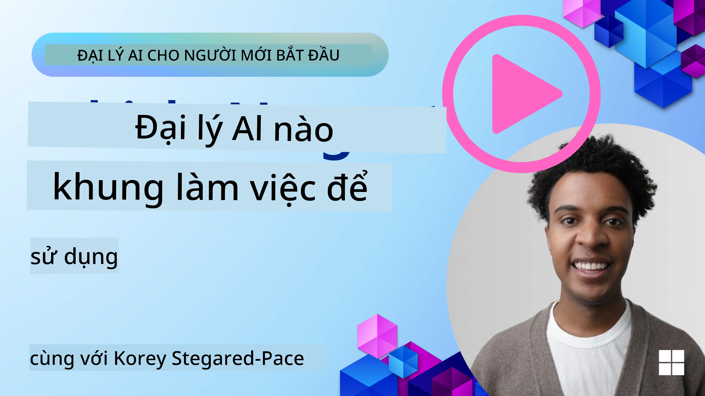

[](https://youtu.be/ODwF-EZo_O8?si=1xoy_B9RNQfrYdF7)

> _(Nhấp vào hình ảnh trên để xem video bài học này)_

# Khám phá Khung tác nhân AI

Khung tác nhân AI là các nền tảng phần mềm được thiết kế để đơn giản hóa việc tạo lập, triển khai và quản lý các tác nhân AI. Các khung này cung cấp cho nhà phát triển các thành phần có sẵn, trừu tượng hóa và công cụ giúp phát triển hệ thống AI phức tạp dễ dàng hơn.

Các khung này giúp nhà phát triển tập trung vào các khía cạnh riêng biệt của ứng dụng bằng cách cung cấp các phương pháp tiêu chuẩn đối với những thách thức phổ biến trong phát triển tác nhân AI. Chúng nâng cao khả năng mở rộng, tính truy cập và hiệu quả trong xây dựng hệ thống AI.

## Giới thiệu

Bài học này sẽ bao gồm:

- Khung tác nhân AI là gì và chúng cho phép nhà phát triển đạt được điều gì?
- Các nhóm có thể sử dụng chúng để nhanh chóng tạo mẫu, lặp lại và cải thiện khả năng của tác nhân như thế nào?
- Sự khác biệt giữa các khung và công cụ do Microsoft tạo ra (<a href="https://aka.ms/ai-agents-beginners/ai-agent-service" target="_blank">Dịch vụ Tác nhân Microsoft Foundry</a> và <a href="https://learn.microsoft.com/azure/ai-services/openai/how-to/responses" target="_blank">Khung Tác nhân Microsoft</a>) là gì?
- Tôi có thể tích hợp các công cụ hệ sinh thái Azure hiện có trực tiếp không, hay tôi cần các giải pháp độc lập?
- Dịch vụ Tác nhân Microsoft Foundry là gì và nó giúp tôi như thế nào?

## Mục tiêu học tập

Mục tiêu của bài học này là giúp bạn hiểu:

- Vai trò của khung tác nhân AI trong phát triển AI.
- Cách tận dụng khung tác nhân AI để xây dựng các tác nhân thông minh.
- Các khả năng chính được kích hoạt bởi khung tác nhân AI.
- Sự khác biệt giữa Khung Tác nhân Microsoft và Dịch vụ Tác nhân Microsoft Foundry.

## Khung tác nhân AI là gì và chúng cho phép nhà phát triển làm gì?

Khung AI truyền thống có thể giúp bạn tích hợp AI vào ứng dụng và cải thiện các ứng dụng đó theo các cách sau:

- **Cá nhân hóa**: AI có thể phân tích hành vi và sở thích người dùng để cung cấp các đề xuất, nội dung và trải nghiệm cá nhân hóa.
Ví dụ: Các dịch vụ phát trực tuyến như Netflix sử dụng AI để gợi ý phim và chương trình dựa trên lịch sử xem, tăng sự tương tác và hài lòng của người dùng.
- **Tự động hóa và hiệu quả**: AI có thể tự động hóa các tác vụ lặp đi lặp lại, tối ưu quy trình làm việc và cải thiện hiệu suất vận hành.
Ví dụ: Ứng dụng dịch vụ khách hàng sử dụng chatbot AI để xử lý các câu hỏi phổ biến, giảm thời gian phản hồi và giải phóng nhân viên cho các vấn đề phức tạp hơn.
- **Cải thiện trải nghiệm người dùng**: AI có thể nâng cao trải nghiệm người dùng tổng thể bằng cách cung cấp các tính năng thông minh như nhận diện giọng nói, xử lý ngôn ngữ tự nhiên và dự đoán văn bản.
Ví dụ: Các trợ lý ảo như Siri và Google Assistant sử dụng AI để hiểu và phản hồi các lệnh thoại, giúp người dùng tương tác dễ dàng hơn với thiết bị của họ.

### Nghe có vẻ tuyệt vời đúng không, vậy tại sao chúng ta cần Khung tác nhân AI?

Khung tác nhân AI đại diện cho điều gì đó hơn cả khung AI thông thường. Chúng được thiết kế để tạo ra các tác nhân thông minh có thể tương tác với người dùng, các tác nhân khác và môi trường để đạt được các mục tiêu cụ thể. Các tác nhân này có thể thể hiện hành vi tự chủ, đưa ra quyết định và thích ứng với các điều kiện thay đổi. Hãy xem một số khả năng chính được kích hoạt bởi Khung tác nhân AI:

- **Hợp tác và phối hợp tác nhân**: Cho phép tạo ra nhiều tác nhân AI làm việc cùng nhau, giao tiếp và phối hợp để giải quyết các nhiệm vụ phức tạp.
- **Tự động hóa và quản lý nhiệm vụ**: Cung cấp các cơ chế tự động hóa quy trình nhiều bước, phân công nhiệm vụ và quản lý nhiệm vụ linh hoạt giữa các tác nhân.
- **Hiểu ngữ cảnh và thích ứng**: Trang bị cho tác nhân khả năng hiểu ngữ cảnh, thích ứng với môi trường thay đổi và đưa ra quyết định dựa trên thông tin thời gian thực.

Tóm lại, các tác nhân cho phép bạn làm được nhiều hơn, nâng cấp tự động hóa lên một tầm cao mới, tạo ra các hệ thống thông minh hơn có khả năng thích nghi và học hỏi từ môi trường.

## Cách nhanh chóng tạo mẫu, lặp lại và cải thiện khả năng của tác nhân?

Lĩnh vực này thay đổi rất nhanh, nhưng có một số điểm chung trong hầu hết các Khung tác nhân AI giúp bạn nhanh chóng tạo mẫu và lặp lại là thành phần mô-đun, công cụ hợp tác và học tập theo thời gian thực. Hãy cùng tìm hiểu:

- **Sử dụng thành phần mô-đun**: Các bộ phát triển phần mềm AI (SDK) cung cấp các thành phần có sẵn như kết nối AI và bộ nhớ, gọi hàm sử dụng ngôn ngữ tự nhiên hoặc plugin code, mẫu nhắc và nhiều hơn nữa.
- **Tận dụng công cụ hợp tác**: Thiết kế các tác nhân với vai trò và nhiệm vụ cụ thể, cho phép họ thử nghiệm và tinh chỉnh quy trình hợp tác.
- **Học theo thời gian thực**: Triển khai các vòng phản hồi nơi tác nhân học từ các tương tác và điều chỉnh hành vi một cách linh hoạt.

### Sử dụng thành phần mô-đun

Các SDK như Khung tác nhân Microsoft cung cấp các thành phần có sẵn như kết nối AI, định nghĩa công cụ và quản lý tác nhân.

**Cách các nhóm có thể sử dụng**: Các nhóm có thể nhanh chóng lắp ráp các thành phần này để tạo nguyên mẫu chức năng mà không cần bắt đầu từ đầu, cho phép thử nghiệm và lặp lại nhanh.

**Cách hoạt động trong thực tế**: Bạn có thể dùng bộ phân tích cú pháp có sẵn để trích xuất thông tin từ đầu vào người dùng, mô-đun bộ nhớ để lưu trữ và truy xuất dữ liệu, và trình tạo nhắc để tương tác với người dùng, tất cả mà không cần xây dựng từ đầu những thành phần này.

**Mã ví dụ**. Hãy xem ví dụ về cách bạn có thể sử dụng Khung tác nhân Microsoft với `FoundryChatClient` để mô hình phản hồi đầu vào người dùng bằng cách gọi công cụ:

``` python
# Ví dụ về Khung làm việc Microsoft Agent bằng Python

import asyncio
import os

from agent_framework import tool
from agent_framework.foundry import FoundryChatClient
from azure.identity import AzureCliCredential


# Định nghĩa một hàm công cụ mẫu để đặt chuyến đi
@tool(approval_mode="never_require")
def book_flight(date: str, location: str) -> str:
    """Book travel given location and date."""
    return f"Travel was booked to {location} on {date}"


async def main():
    provider = FoundryChatClient(
        project_endpoint=os.environ["AZURE_AI_PROJECT_ENDPOINT"],
        model=os.environ["AZURE_AI_MODEL_DEPLOYMENT_NAME"],
        credential=AzureCliCredential(),
    )
    agent = provider.as_agent(
        name="travel_agent",
        instructions="Help the user book travel. Use the book_flight tool when ready.",
        tools=[book_flight],
    )

    response = await agent.run("I'd like to go to New York on January 1, 2025")
    print(response)
    # Ví dụ đầu ra: Chuyến bay của bạn đến New York vào ngày 1 tháng 1 năm 2025 đã được đặt thành công. Chúc bạn hành trình an toàn! ✈️🗽


if __name__ == "__main__":
    asyncio.run(main())
```

Điều bạn có thể thấy từ ví dụ này là cách sử dụng bộ phân tích cú pháp có sẵn để trích xuất thông tin chính từ đầu vào của người dùng, như xuất phát, điểm đến và ngày của yêu cầu đặt vé máy bay. Cách tiếp cận mô-đun này cho phép bạn tập trung vào logic cấp cao.

### Tận dụng công cụ hợp tác

Các khung như Khung tác nhân Microsoft tạo điều kiện cho việc tạo ra nhiều tác nhân làm việc cùng nhau.

**Cách các nhóm có thể sử dụng**: Các nhóm có thể thiết kế các tác nhân với vai trò và nhiệm vụ cụ thể, giúp thử nghiệm và tinh chỉnh quy trình hợp tác và nâng cao hiệu quả hệ thống.

**Cách hoạt động trong thực tế**: Bạn có thể tạo một nhóm các tác nhân, trong đó mỗi tác nhân có chức năng chuyên biệt như truy xuất dữ liệu, phân tích hoặc ra quyết định. Các tác nhân này có thể giao tiếp và chia sẻ thông tin để đạt được mục tiêu chung, như trả lời câu hỏi người dùng hoặc hoàn thành nhiệm vụ.

**Mã ví dụ (Khung tác nhân Microsoft)**:

```python
# Tạo nhiều đại lý làm việc cùng nhau sử dụng Microsoft Agent Framework

import os
from agent_framework.foundry import FoundryChatClient
from azure.identity import AzureCliCredential

provider = FoundryChatClient(
    project_endpoint=os.environ["AZURE_AI_PROJECT_ENDPOINT"],
    model=os.environ["AZURE_AI_MODEL_DEPLOYMENT_NAME"],
    credential=AzureCliCredential(),
)

# Đại lý truy xuất dữ liệu
agent_retrieve = provider.as_agent(
    name="dataretrieval",
    instructions="Retrieve relevant data using available tools.",
    tools=[retrieve_tool],
)

# Đại lý phân tích dữ liệu
agent_analyze = provider.as_agent(
    name="dataanalysis",
    instructions="Analyze the retrieved data and provide insights.",
    tools=[analyze_tool],
)

# Chạy các đại lý theo thứ tự trên một nhiệm vụ
retrieval_result = await agent_retrieve.run("Retrieve sales data for Q4")
analysis_result = await agent_analyze.run(f"Analyze this data: {retrieval_result}")
print(analysis_result)
```

Điều bạn thấy trong đoạn mã trên là cách bạn tạo một nhiệm vụ liên quan nhiều tác nhân cùng phân tích dữ liệu. Mỗi tác nhân thực hiện chức năng cụ thể và nhiệm vụ được thực thi bằng cách phối hợp các tác nhân để đạt kết quả mong muốn. Bằng cách tạo các tác nhân chuyên biệt với vai trò được phân công, bạn có thể cải thiện hiệu quả và hiệu suất nhiệm vụ.

### Học theo thời gian thực

Các khung nâng cao cung cấp khả năng hiểu ngữ cảnh thời gian thực và thích ứng.

**Cách các nhóm có thể sử dụng**: Các nhóm có thể triển khai vòng phản hồi để tác nhân học từ các tương tác và điều chỉnh hành vi một cách động, dẫn đến việc cải tiến và phát triển liên tục các khả năng.

**Cách hoạt động trong thực tế**: Các tác nhân có thể phân tích phản hồi người dùng, dữ liệu môi trường và kết quả nhiệm vụ để cập nhật cơ sở tri thức, điều chỉnh thuật toán ra quyết định và cải thiện hiệu suất theo thời gian. Quá trình học lặp này giúp tác nhân thích ứng với điều kiện và sở thích người dùng thay đổi, nâng cao hiệu quả tổng thể của hệ thống.

## Sự khác biệt giữa Khung Tác nhân Microsoft và Dịch vụ Tác nhân Microsoft Foundry là gì?

Có nhiều cách để so sánh các phương pháp này, nhưng hãy xem vài điểm khác biệt chính về thiết kế, khả năng và mục tiêu sử dụng:

## Khung Tác nhân Microsoft (MAF)

Khung Tác nhân Microsoft cung cấp bộ SDK gọn nhẹ để xây dựng tác nhân AI sử dụng `FoundryChatClient`. Nó cho phép nhà phát triển tạo tác nhân sử dụng mô hình Azure OpenAI với gọi công cụ tích hợp sẵn, quản lý hội thoại và bảo mật cấp doanh nghiệp qua Azure identity.

**Trường hợp sử dụng**: Xây dựng tác nhân AI sẵn sàng đi vào sản xuất với sử dụng công cụ, quy trình nhiều bước và tích hợp doanh nghiệp.

Dưới đây là một số khái niệm cốt lõi quan trọng trong Khung Tác nhân Microsoft:

- **Tác nhân**. Một tác nhân được tạo qua `FoundryChatClient` và cấu hình với tên, hướng dẫn và công cụ. Tác nhân có thể:
  - **Xử lý tin nhắn người dùng** và tạo phản hồi bằng mô hình Azure OpenAI.
  - **Gọi công cụ** tự động dựa trên ngữ cảnh hội thoại.
  - **Duy trì trạng thái hội thoại** qua nhiều tương tác.

  Đây là đoạn mã minh họa cách tạo tác nhân:

    ```python
    import os
    from agent_framework.foundry import FoundryChatClient
    from azure.identity import AzureCliCredential

    provider = FoundryChatClient(
        project_endpoint=os.environ["AZURE_AI_PROJECT_ENDPOINT"],
        model=os.environ["AZURE_AI_MODEL_DEPLOYMENT_NAME"],
        credential=AzureCliCredential(),
    )
    agent = provider.as_agent(
        name="my_agent",
        instructions="You are a helpful assistant.",
    )

    response = await agent.run("Hello, World!")
    print(response)
    ```

- **Công cụ**. Khung hỗ trợ định nghĩa công cụ dưới dạng hàm Python mà tác nhân có thể gọi tự động. Công cụ được đăng ký khi tạo tác nhân:

    ```python
    def get_weather(location: str) -> str:
        """Get the current weather for a location."""
        return f"The weather in {location} is sunny, 72\u00b0F."

    agent = provider.as_agent(
        name="weather_agent",
        instructions="Help users check the weather.",
        tools=[get_weather],
    )
    ```

- **Phối hợp đa tác nhân**. Bạn có thể tạo nhiều tác nhân với chuyên môn khác nhau và phối hợp công việc của họ:

    ```python
    planner = provider.as_agent(
        name="planner",
        instructions="Break down complex tasks into steps.",
    )

    executor = provider.as_agent(
        name="executor",
        instructions="Execute the planned steps using available tools.",
        tools=[execute_tool],
    )

    plan = await planner.run("Plan a trip to Paris")
    result = await executor.run(f"Execute this plan: {plan}")
    ```

- **Tích hợp Azure Identity**. Khung sử dụng `AzureCliCredential` (hoặc `DefaultAzureCredential`) để xác thực bảo mật, không cần quản lý khóa API trực tiếp.

## Dịch vụ Tác nhân Microsoft Foundry

Dịch vụ Tác nhân Microsoft Foundry là một bổ sung mới, giới thiệu tại Microsoft Ignite 2024. Nó cho phép phát triển và triển khai tác nhân AI với mô hình linh hoạt hơn, như gọi trực tiếp các LLM mã nguồn mở như Llama 3, Mistral và Cohere.

Dịch vụ Tác nhân Microsoft Foundry cung cấp cơ chế bảo mật doanh nghiệp mạnh mẽ và phương pháp lưu trữ dữ liệu, phù hợp cho các ứng dụng doanh nghiệp.

Nó hoạt động sẵn sàng với Khung Tác nhân Microsoft để xây dựng và triển khai tác nhân.

Dịch vụ này hiện đang ở trạng thái Xem trước Công khai và hỗ trợ Python cùng C# để xây dựng tác nhân.

Sử dụng SDK Python của Dịch vụ Tác nhân Microsoft Foundry, chúng ta có thể tạo một tác nhân với công cụ do người dùng định nghĩa:

```python
import asyncio
from azure.identity import DefaultAzureCredential
from azure.ai.projects import AIProjectClient

# Định nghĩa các hàm công cụ
def get_specials() -> str:
    """Provides a list of specials from the menu."""
    return """
    Special Soup: Clam Chowder
    Special Salad: Cobb Salad
    Special Drink: Chai Tea
    """

def get_item_price(menu_item: str) -> str:
    """Provides the price of the requested menu item."""
    return "$9.99"


async def main() -> None:
    credential = DefaultAzureCredential()
    project_client = AIProjectClient.from_connection_string(
        credential=credential,
        conn_str="your-connection-string",
    )

    agent = project_client.agents.create_agent(
        model="gpt-4o-mini",
        name="Host",
        instructions="Answer questions about the menu.",
        tools=[get_specials, get_item_price],
    )

    thread = project_client.agents.create_thread()

    user_inputs = [
        "Hello",
        "What is the special soup?",
        "How much does that cost?",
        "Thank you",
    ]

    for user_input in user_inputs:
        print(f"# User: '{user_input}'")
        message = project_client.agents.create_message(
            thread_id=thread.id,
            role="user",
            content=user_input,
        )
        run = project_client.agents.create_and_process_run(
            thread_id=thread.id, agent_id=agent.id
        )
        messages = project_client.agents.list_messages(thread_id=thread.id)
        print(f"# Agent: {messages.data[0].content[0].text.value}")


if __name__ == "__main__":
    asyncio.run(main())
```

### Khái niệm cốt lõi

Dịch vụ Tác nhân Microsoft Foundry có các khái niệm cốt lõi sau:

- **Tác nhân**. Dịch vụ tích hợp với Microsoft Foundry. Trong Microsoft Foundry, một tác nhân AI đóng vai trò như "microservice thông minh" sử dụng để trả lời câu hỏi (RAG), thực hiện hành động hoặc tự động hóa hoàn toàn quy trình. Nó đạt được điều này bằng cách kết hợp sức mạnh của mô hình AI tạo sinh với các công cụ cho phép truy cập và tương tác với các nguồn dữ liệu thực tế. Đây là ví dụ về một tác nhân:

    ```python
    agent = project_client.agents.create_agent(
        model="gpt-4o-mini",
        name="my-agent",
        instructions="You are helpful agent",
        tools=code_interpreter.definitions,
        tool_resources=code_interpreter.resources,
    )
    ```

    Trong ví dụ này, một tác nhân được tạo với mô hình `gpt-4o-mini`, tên `my-agent`, và hướng dẫn `Bạn là tác nhân hữu ích`. Tác nhân được trang bị công cụ và tài nguyên để thực hiện nhiệm vụ giải thích mã.

- **Chuỗi và tin nhắn**. Chuỗi là khái niệm quan trọng khác dùng để biểu thị cuộc hội thoại hoặc tương tác giữa tác nhân và người dùng. Chuỗi có thể được dùng để theo dõi tiến trình cuộc trò chuyện, lưu trữ thông tin ngữ cảnh và quản lý trạng thái tương tác. Đây là ví dụ về một chuỗi:

    ```python
    thread = project_client.agents.create_thread()
    message = project_client.agents.create_message(
        thread_id=thread.id,
        role="user",
        content="Could you please create a bar chart for the operating profit using the following data and provide the file to me? Company A: $1.2 million, Company B: $2.5 million, Company C: $3.0 million, Company D: $1.8 million",
    )
    
    # Yêu cầu đại lý thực hiện công việc trên chủ đề
    run = project_client.agents.create_and_process_run(thread_id=thread.id, agent_id=agent.id)
    
    # Lấy và ghi lại tất cả các tin nhắn để xem phản hồi của đại lý
    messages = project_client.agents.list_messages(thread_id=thread.id)
    print(f"Messages: {messages}")
    ```

    Trong đoạn mã trên, một chuỗi được tạo. Sau đó, một tin nhắn được gửi đến chuỗi. Bằng cách gọi `create_and_process_run`, tác nhân được yêu cầu thực hiện công việc trong chuỗi. Cuối cùng, các tin nhắn được lấy và ghi lại để xem phản hồi của tác nhân. Các tin nhắn cho thấy tiến trình cuộc hội thoại giữa người dùng và tác nhân. Cũng cần hiểu rằng các tin nhắn có thể thuộc loại khác nhau như văn bản, hình ảnh hoặc tệp, tức là tác nhân có thể tạo ra ví dụ như một hình ảnh hoặc phản hồi văn bản. Với tư cách là nhà phát triển, bạn có thể sử dụng thông tin này để xử lý thêm phản hồi hoặc trình bày cho người dùng.

- **Tích hợp với Khung Tác nhân Microsoft**. Dịch vụ Tác nhân Microsoft Foundry làm việc mượt mà với Khung Tác nhân Microsoft, có nghĩa bạn có thể xây dựng tác nhân dùng `FoundryChatClient` và triển khai qua Dịch vụ Tác nhân cho kịch bản sản xuất.

**Trường hợp sử dụng**: Dịch vụ Tác nhân Microsoft Foundry được thiết kế cho ứng dụng doanh nghiệp cần triển khai tác nhân AI bảo mật, có khả năng mở rộng và linh hoạt.

## Sự khác biệt giữa hai phương pháp này là gì?
 
Nghe có vẻ có sự trùng lặp, nhưng có vài điểm khác biệt chính về thiết kế, khả năng và mục tiêu sử dụng:
 
- **Khung Tác nhân Microsoft (MAF)**: Là bộ SDK sẵn sàng đi vào sản xuất để xây dựng tác nhân AI. Nó cung cấp API gọn nhẹ để tạo tác nhân với gọi công cụ, quản lý hội thoại và tích hợp Azure identity.
- **Dịch vụ Tác nhân Microsoft Foundry**: Là nền tảng và dịch vụ triển khai trong Microsoft Foundry dành cho tác nhân. Nó cung cấp kết nối sẵn với dịch vụ như Azure OpenAI, Azure AI Search, Bing Search và thực thi mã.
 
Vẫn chưa chắc chọn cái nào?

### Trường hợp sử dụng
 
Hãy xem liệu chúng tôi có thể giúp bạn bằng cách điểm qua vài trường hợp sử dụng phổ biến:
 
> Hỏi: Tôi đang xây dựng ứng dụng tác nhân AI sản xuất và muốn bắt đầu nhanh
>

> Đáp: Khung Tác nhân Microsoft là lựa chọn tuyệt vời. Nó cung cấp API Python đơn giản qua `FoundryChatClient` cho phép bạn định nghĩa tác nhân với công cụ và hướng dẫn chỉ trong vài dòng mã.

> Hỏi: Tôi cần triển khai cấp doanh nghiệp với tích hợp Azure như Tìm kiếm và thực thi mã
>
> Đáp: Dịch vụ Tác nhân Microsoft Foundry là lựa chọn phù hợp nhất. Nó là dịch vụ nền tảng tích hợp sẵn các mô hình đa dạng, Azure AI Search, Bing Search và Azure Functions. Giúp bạn dễ dàng xây dựng tác nhân trong Cổng Foundry và triển khai quy mô lớn.
 
> Hỏi: Tôi vẫn bối rối, cho tôi một lựa chọn thôi
>
> Đáp: Bắt đầu với Khung Tác nhân Microsoft để xây dựng tác nhân, rồi dùng Dịch vụ Tác nhân Microsoft Foundry khi cần triển khai và mở rộng trong sản xuất. Cách này giúp bạn lặp lại nhanh logic tác nhân đồng thời có lộ trình rõ ràng để triển khai doanh nghiệp.
 
Hãy tóm tắt những khác biệt chính trong bảng dưới đây:

| Khung | Trọng tâm | Khái niệm cốt lõi | Trường hợp sử dụng |
| --- | --- | --- | --- |
| Khung Tác nhân Microsoft | SDK tác nhân gọn nhẹ với gọi công cụ | Tác nhân, Công cụ, Azure Identity | Xây dựng tác nhân AI, sử dụng công cụ, quy trình nhiều bước |
| Dịch vụ Tác nhân Microsoft Foundry | Mô hình linh hoạt, bảo mật doanh nghiệp, tạo mã, gọi công cụ | Mô-đun, Hợp tác, Điều phối quy trình | Triển khai tác nhân AI bảo mật, mở rộng và linh hoạt |

## Tôi có thể tích hợp các công cụ hệ sinh thái Azure hiện có trực tiếp không, hay tôi cần các giải pháp độc lập?


Câu trả lời là có, bạn có thể tích hợp các công cụ hệ sinh thái Azure hiện có của bạn trực tiếp với Dịch vụ Đại lý Microsoft Foundry đặc biệt, vì nó được xây dựng để hoạt động liền mạch với các dịch vụ Azure khác. Bạn có thể ví dụ tích hợp Bing, Azure AI Search và Azure Functions. Cũng có sự tích hợp sâu với Microsoft Foundry.

Khung Đại lý Microsoft cũng tích hợp với các dịch vụ Azure thông qua `FoundryChatClient` và nhận dạng Azure, cho phép bạn gọi trực tiếp các dịch vụ Azure từ các công cụ đại lý của mình.

## Mã Mẫu

- Python: [Agent Framework (Microsoft Foundry)](./code_samples/02-python-agent-framework.ipynb)
- Python: [Agent Framework (Azure OpenAI Responses API)](./code_samples/02-python-agent-framework-azure-openai.ipynb)
- .NET: [Agent Framework](./code_samples/02-dotnet-agent-framework.md)

## Có Thêm Câu Hỏi về Khung Đại lý AI?

Tham gia [Microsoft Foundry Discord](https://discord.com/invite/ATgtXmAS5D) để gặp gỡ những người học khác, tham dự giờ làm việc và nhận được câu trả lời cho các câu hỏi về Đại lý AI của bạn.

## Tài liệu Tham khảo

- <a href="https://techcommunity.microsoft.com/blog/azure-ai-services-blog/introducing-azure-ai-agent-service/4298357" target="_blank">Dịch vụ Đại lý Azure</a>
- <a href="https://learn.microsoft.com/azure/ai-services/openai/how-to/responses" target="_blank">Khung Đại lý Microsoft - Phản hồi Azure OpenAI</a>
- <a href="https://learn.microsoft.com/azure/ai-services/agents/overview" target="_blank">Dịch vụ Đại lý Microsoft Foundry</a>

## Bài học Trước

[Giới thiệu về Đại lý AI và Các trường hợp sử dụng Đại lý](../01-intro-to-ai-agents/README.md)

## Bài học Tiếp theo

[Hiểu về Các Mẫu Thiết kế Agentic](../03-agentic-design-patterns/README.md)

---

<!-- CO-OP TRANSLATOR DISCLAIMER START -->
**Tuyên bố miễn trừ trách nhiệm**:
Tài liệu này đã được dịch bằng dịch vụ dịch thuật AI [Co-op Translator](https://github.com/Azure/co-op-translator). Mặc dù chúng tôi cố gắng đảm bảo độ chính xác, xin lưu ý rằng bản dịch tự động có thể chứa lỗi hoặc sai sót. Tài liệu gốc bằng ngôn ngữ gốc nên được coi là nguồn tin chính thức. Đối với thông tin quan trọng, nên sử dụng dịch vụ dịch thuật chuyên nghiệp bởi con người. Chúng tôi không chịu trách nhiệm về bất kỳ hiểu lầm hoặc giải thích sai nào phát sinh từ việc sử dụng bản dịch này.
<!-- CO-OP TRANSLATOR DISCLAIMER END -->