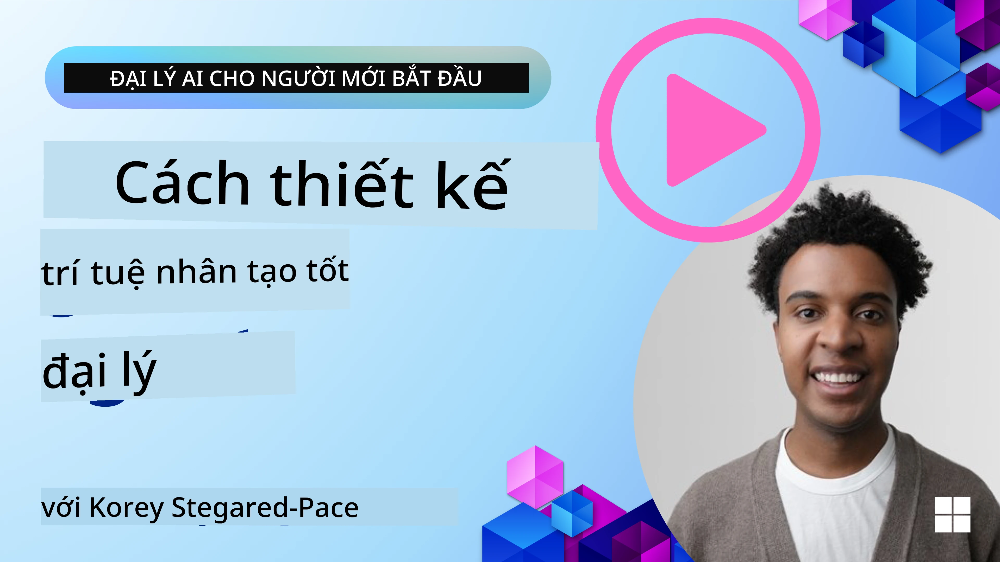
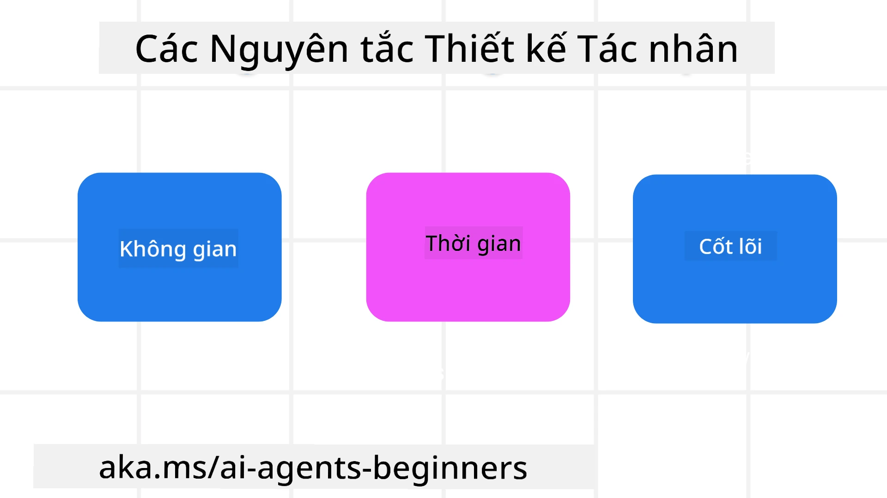

> _(Nhấp vào hình ảnh phía trên để xem video bài học này)_
# Nguyên Tắc Thiết Kế Tác Nhân AI

## Giới Thiệu

Có rất nhiều cách để suy nghĩ về việc xây dựng Hệ Thống Tác Nhân AI. Vì sự mơ hồ là một đặc điểm chứ không phải lỗi trong thiết kế AI Tạo Sinh, đôi khi kỹ sư khó xác định được cần bắt đầu từ đâu. Chúng tôi đã tạo ra một bộ Nguyên Tắc Thiết Kế Trải Nghiệm Người Dùng lấy con người làm trung tâm để giúp các nhà phát triển xây dựng các hệ thống tác nhân tập trung vào khách hàng nhằm giải quyết nhu cầu kinh doanh. Những nguyên tắc thiết kế này không phải là kiến trúc bắt buộc mà là điểm khởi đầu cho các nhóm định nghĩa và xây dựng trải nghiệm tác nhân.

Nói chung, các tác nhân nên:

- Mở rộng và nâng cao năng lực con người (động não, giải quyết vấn đề, tự động hóa, v.v.)
- Bổ sung các khoảng trống kiến thức (cập nhật nhanh về các lĩnh vực kiến thức, dịch thuật, v.v.)
- Thúc đẩy và hỗ trợ hợp tác theo cách mà chúng ta - cá nhân đều thích làm việc cùng người khác
- Giúp chúng ta trở thành phiên bản tốt hơn của chính mình (ví dụ: huấn luyện viên cuộc sống/người quản lý công việc, giúp học kỹ năng điều chỉnh cảm xúc và chánh niệm, xây dựng khả năng chịu đựng, v.v.)

## Bài Học Này Sẽ Bao Gồm

- Nguyên tắc Thiết Kế Tác Nhân là gì
- Một số hướng dẫn nên tuân theo khi áp dụng các nguyên tắc thiết kế này
- Một vài ví dụ về việc sử dụng các nguyên tắc thiết kế

## Mục Tiêu Học Tập

Sau khi hoàn thành bài học này, bạn sẽ có thể:

1. Giải thích Nguyên Tắc Thiết Kế Tác Nhân là gì
2. Giải thích các hướng dẫn khi sử dụng Nguyên Tắc Thiết Kế Tác Nhân
3. Hiểu cách xây dựng một tác nhân sử dụng Nguyên Tắc Thiết Kế Tác Nhân

## Nguyên Tắc Thiết Kế Tác Nhân

### Tác Nhân (Không Gian)

Đây là môi trường mà tác nhân hoạt động. Những nguyên tắc này hướng dẫn cách thiết kế tác nhân để họ tham gia vào thế giới vật lý và kỹ thuật số.

- **Kết nối, không sáp nhập** – giúp kết nối người với người khác, sự kiện và kiến thức có thể hành động để thúc đẩy hợp tác và kết nối.
- Tác nhân giúp kết nối sự kiện, kiến thức và con người.
- Tác nhân đưa mọi người đến gần nhau hơn. Chúng không được thiết kế để thay thế hay hạ thấp con người.
- **Dễ tiếp cận nhưng đôi khi vô hình** – tác nhân chủ yếu hoạt động ở nền và chỉ nhẹ nhàng nhắc nhở khi có liên quan và phù hợp.
  - Tác nhân dễ dàng được phát hiện và truy cập cho người dùng được ủy quyền trên bất kỳ thiết bị hoặc nền tảng nào.
  - Tác nhân hỗ trợ đầu vào và đầu ra đa phương thức (âm thanh, giọng nói, văn bản, v.v.).
  - Tác nhân có thể chuyển đổi mượt mà giữa nền và tiền cảnh; giữa chủ động và phản ứng, tùy thuộc vào việc nhận biết nhu cầu người dùng.
  - Tác nhân có thể hoạt động ở dạng vô hình, nhưng đường dẫn xử lý nền và hợp tác với các tác nhân khác là minh bạch và có thể kiểm soát bởi người dùng.

### Tác Nhân (Thời Gian)

Đây là cách tác nhân hoạt động theo thời gian. Những nguyên tắc này hướng dẫn cách thiết kế tác nhân tương tác qua quá khứ, hiện tại và tương lai.

- **Quá khứ**: Phản ánh lịch sử bao gồm cả trạng thái và bối cảnh.
  - Tác nhân cung cấp kết quả phù hợp hơn dựa trên phân tích dữ liệu lịch sử phong phú hơn chỉ sự kiện, con người hay trạng thái.
  - Tác nhân tạo kết nối từ các sự kiện trong quá khứ và phản chiếu chủ động về ký ức để tương tác với tình huống hiện tại.
- **Hiện tại**: Nhắc nhở hơn là chỉ thông báo.
  - Tác nhân thể hiện phương pháp tiếp cận toàn diện khi tương tác với con người. Khi một sự kiện xảy ra, tác nhân vượt ra ngoài thông báo tĩnh hay hình thức trang trọng tĩnh khác. Tác nhân có thể đơn giản hóa quy trình hoặc tạo ra các dấu hiệu linh động để thu hút sự chú ý người dùng đúng lúc.
  - Tác nhân truyền tải thông tin dựa trên môi trường ngữ cảnh, các thay đổi xã hội và văn hóa và phù hợp với ý định người dùng.
  - Tương tác với tác nhân có thể dần dần, phát triển/tăng độ phức tạp để trao quyền cho người dùng lâu dài.
- **Tương lai**: Thích nghi và phát triển.
  - Tác nhân thích nghi với các thiết bị, nền tảng và phương thức khác nhau.
  - Tác nhân thích ứng với hành vi người dùng, nhu cầu tiếp cận và có thể tùy chỉnh tự do.
  - Tác nhân được hình thành và phát triển qua tương tác liên tục của người dùng.

### Tác Nhân (Cốt lõi)

Đây là các yếu tố then chốt trong thiết kế cốt lõi của tác nhân.

- **Chấp nhận sự không chắc chắn nhưng thiết lập niềm tin**.
  - Một mức độ không chắc chắn của tác nhân là điều được mong đợi. Không chắc chắn là yếu tố then chốt trong thiết kế tác nhân.
  - Niềm tin và tính minh bạch là lớp nền tảng của thiết kế tác nhân.
  - Con người kiểm soát khi nào tác nhân bật/tắt và trạng thái tác nhân luôn hiển thị rõ ràng.

## Hướng Dẫn Thực Hiện Các Nguyên Tắc Này

Khi sử dụng các nguyên tắc thiết kế trên, hãy vận dụng các hướng dẫn sau:

1. **Minh bạch**: Thông báo cho người dùng biết AI tham gia, cách nó hoạt động (bao gồm cả hành động trong quá khứ), và cách gửi phản hồi, sửa đổi hệ thống.
2. **Kiểm soát**: Cho phép người dùng tùy chỉnh, chỉ định sở thích và cá nhân hóa, và kiểm soát hệ thống cũng như các thuộc tính của nó (bao gồm khả năng xóa bỏ).
3. **Tính nhất quán**: Hướng tới trải nghiệm đa phương thức nhất quán trên các thiết bị và điểm cuối. Sử dụng các phần tử UI/UX quen thuộc (ví dụ, biểu tượng micro cho tương tác giọng nói) và giảm gánh nặng nhận thức của khách hàng càng nhiều càng tốt (ví dụ, hướng tới phản hồi súc tích, hỗ trợ trực quan và nội dung ‘Tìm Hiểu Thêm’).

## Cách Thiết Kế Tác Nhân Du Lịch theo Các Nguyên Tắc và Hướng Dẫn Này

Hãy tưởng tượng bạn đang thiết kế một Tác Nhân Du Lịch, đây là cách bạn có thể nghĩ đến việc sử dụng các Nguyên Tắc và Hướng Dẫn Thiết Kế:

1. **Minh bạch** – Cho người dùng biết Tác Nhân Du Lịch là tác nhân được kích hoạt AI. Cung cấp hướng dẫn cơ bản về cách bắt đầu (ví dụ: tin nhắn “Xin chào”, các câu lệnh mẫu). Ghi rõ điều này trên trang sản phẩm. Hiển thị danh sách các câu lệnh người dùng đã hỏi trước đó. Rõ ràng cách cung cấp phản hồi (biểu tượng thích/không thích, nút Gửi Phản Hồi, v.v.). Nêu rõ nếu tác nhân có giới hạn về sử dụng hoặc chủ đề.
2. **Kiểm soát** – Đảm bảo rõ cách người dùng có thể chỉnh sửa tác nhân sau khi được tạo với các mục như Lời Nhắc Hệ Thống. Cho phép người dùng chọn mức độ lời lẽ của tác nhân, phong cách viết, và bất kỳ lưu ý nào về chủ đề tác nhân không nên nói về. Cho phép người dùng xem và xóa bất kỳ tập tin hoặc dữ liệu liên quan, câu lệnh và các cuộc trò chuyện trước.
3. **Tính nhất quán** – Đảm bảo các biểu tượng chia sẻ câu lệnh, thêm tập tin hoặc ảnh và gắn thẻ ai đó hay thứ gì đó là chuẩn và dễ nhận biết. Dùng biểu tượng chiếc ghim giấy để biểu thị tải/tải lên tập tin với tác nhân, và biểu tượng hình ảnh để biểu thị tải lên đồ họa.

## Mã Mẫu

- Python: [Agent Framework](./code_samples/03-python-agent-framework.ipynb)
- .NET: [Agent Framework](./code_samples/03-dotnet-agent-framework.md)

## Còn Câu Hỏi Về Mô Hình Thiết Kế Tác Nhân AI?

Tham gia [Microsoft Foundry Discord](https://discord.com/invite/ATgtXmAS5D) để gặp gỡ các học viên khác, tham dự giờ làm việc và nhận giải đáp câu hỏi về Tác Nhân AI.

## Tài Nguyên Bổ Sung

- <a href="https://openai.com" target="_blank">Thực Hành Quản Trị Hệ Thống AI Tác Nhân | OpenAI</a>
- <a href="https://microsoft.com" target="_blank">Dự Án Bộ Công Cụ HAX - Microsoft Research</a>
- <a href="https://responsibleaitoolbox.ai" target="_blank">Hộp Công Cụ AI Trách Nhiệm</a>

## Bài Học Trước

[Khám Phá Các Khung Tác Nhân](../02-explore-agentic-frameworks/README.md)

## Bài Học Tiếp Theo

[Mẫu Thiết Kế Sử Dụng Công Cụ](../04-tool-use/README.md)

---

<!-- CO-OP TRANSLATOR DISCLAIMER START -->
**Tuyên bố miễn trừ trách nhiệm**:
Tài liệu này đã được dịch bằng dịch vụ dịch thuật AI [Co-op Translator](https://github.com/Azure/co-op-translator). Mặc dù chúng tôi cố gắng đảm bảo độ chính xác, xin lưu ý rằng bản dịch tự động có thể chứa lỗi hoặc sai sót. Tài liệu gốc bằng ngôn ngữ gốc nên được coi là nguồn tin chính thức. Đối với thông tin quan trọng, nên sử dụng dịch vụ dịch thuật chuyên nghiệp bởi con người. Chúng tôi không chịu trách nhiệm về bất kỳ hiểu lầm hoặc giải thích sai nào phát sinh từ việc sử dụng bản dịch này.
<!-- CO-OP TRANSLATOR DISCLAIMER END -->