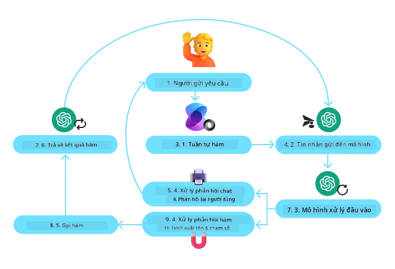
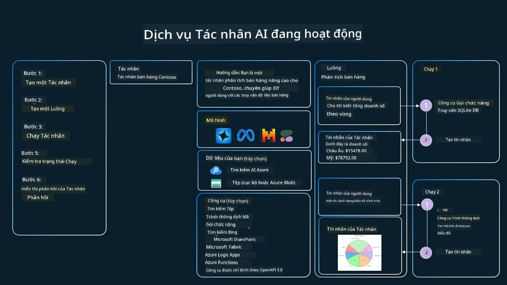

[](https://youtu.be/vieRiPRx-gI?si=cEZ8ApnT6Sus9rhn)

> _(Nhấp vào hình ảnh trên để xem video của bài học này)_

# Mẫu Thiết Kế Sử Dụng Công Cụ

Công cụ rất thú vị vì chúng cho phép các đại lý AI có phạm vi khả năng rộng hơn. Thay vì đại lý chỉ có một tập hợp hành động hạn chế mà nó có thể thực hiện, bằng cách thêm một công cụ, đại lý bây giờ có thể thực hiện nhiều hành động khác nhau. Trong chương này, chúng ta sẽ xem xét Mẫu Thiết Kế Sử Dụng Công Cụ, mô tả cách các đại lý AI có thể sử dụng các công cụ cụ thể để đạt được mục tiêu của họ.

## Giới thiệu

Trong bài học này, chúng ta sẽ tìm câu trả lời cho các câu hỏi sau:

- Mẫu thiết kế sử dụng công cụ là gì?
- Những trường hợp sử dụng nào có thể áp dụng mẫu này?
- Những thành phần/khối xây dựng nào cần thiết để triển khai mẫu thiết kế này?
- Những lưu ý đặc biệt khi sử dụng Mẫu Thiết Kế Sử Dụng Công Cụ để xây dựng các đại lý AI đáng tin cậy là gì?

## Mục tiêu học tập

Sau khi hoàn thành bài học này, bạn sẽ có thể:

- Định nghĩa Mẫu Thiết Kế Sử Dụng Công Cụ và mục đích của nó.
- Xác định các trường hợp sử dụng mà Mẫu Thiết Kế Sử Dụng Công Cụ áp dụng được.
- Hiểu các thành phần chính cần thiết để triển khai mẫu thiết kế.
- Nhận biết các lưu ý để đảm bảo tính đáng tin cậy của các đại lý AI sử dụng mẫu thiết kế này.

## Mẫu Thiết Kế Sử Dụng Công Cụ là gì?

**Mẫu Thiết Kế Sử Dụng Công Cụ** tập trung vào việc cung cấp cho các Mô Hình Ngôn Ngữ Lớn (LLM) khả năng tương tác với các công cụ bên ngoài để đạt được các mục tiêu cụ thể. Công cụ là mã có thể được đại lý thực thi để thực hiện các hành động. Một công cụ có thể là hàm đơn giản như máy tính, hoặc một cuộc gọi API đến dịch vụ bên thứ ba như tra cứu giá cổ phiếu hoặc dự báo thời tiết. Trong bối cảnh các đại lý AI, các công cụ được thiết kế để được thực thi bởi các đại lý đáp lại các **lệnh gọi hàm do mô hình tạo ra**.

## Những trường hợp sử dụng có thể áp dụng?

Các đại lý AI có thể tận dụng công cụ để hoàn thành các tác vụ phức tạp, truy xuất thông tin hoặc đưa ra quyết định. Mẫu thiết kế sử dụng công cụ thường được dùng trong các tình huống yêu cầu tương tác động với các hệ thống bên ngoài, như cơ sở dữ liệu, dịch vụ web hoặc trình thông dịch mã. Khả năng này hữu ích cho nhiều trường hợp sử dụng khác nhau bao gồm:

- **Truy xuất Thông tin Động:** Đại lý có thể truy vấn các API hoặc cơ sở dữ liệu bên ngoài để lấy dữ liệu cập nhật (ví dụ: truy vấn cơ sở dữ liệu SQLite để phân tích dữ liệu, lấy giá cổ phiếu hoặc thông tin thời tiết).
- **Thực thi và Thông dịch Mã:** Đại lý có thể thực thi mã hoặc script để giải các bài toán toán học, tạo báo cáo hoặc thực hiện mô phỏng.
- **Tự động hóa Quy trình làm việc:** Tự động hóa các quy trình lặp đi lặp lại hoặc nhiều bước bằng cách tích hợp các công cụ như bộ lập lịch tác vụ, dịch vụ email hoặc pipeline dữ liệu.
- **Hỗ trợ Khách hàng:** Đại lý có thể tương tác với hệ thống CRM, nền tảng vé hỗ trợ hoặc kho tri thức để giải đáp thắc mắc người dùng.
- **Tạo và Chỉnh sửa Nội dung:** Đại lý có thể sử dụng các công cụ như kiểm tra ngữ pháp, tóm tắt văn bản hoặc đánh giá an toàn nội dung để hỗ trợ công việc sáng tạo nội dung.

## Những thành phần/khối xây dựng cần thiết để triển khai mẫu thiết kế sử dụng công cụ?

Các khối xây dựng này cho phép đại lý AI thực hiện nhiều loại tác vụ. Hãy xem xét các thành phần chính cần cho triển khai Mẫu Thiết Kế Sử Dụng Công Cụ:

- **Lược đồ Hàm/Công Cụ**: Định nghĩa chi tiết các công cụ có sẵn, bao gồm tên hàm, mục đích, tham số yêu cầu và đầu ra mong đợi. Các lược đồ này giúp LLM hiểu được công cụ nào có sẵn và cách xây dựng các yêu cầu hợp lệ.

- **Logic Thực Thi Hàm**: Điều khiển cách và thời điểm công cụ được gọi dựa trên ý định của người dùng và bối cảnh cuộc trò chuyện. Có thể bao gồm các mô-đun lập kế hoạch, cơ chế điều phối hoặc luồng có điều kiện để xác định việc sử dụng công cụ một cách động.

- **Hệ thống Xử lý Tin nhắn**: Các thành phần quản lý luồng hội thoại giữa dữ liệu đầu vào người dùng, phản hồi LLM, các cuộc gọi công cụ và đầu ra của công cụ.

- **Khung Tích hợp Công Cụ**: Cơ sở hạ tầng kết nối đại lý với các công cụ khác nhau, dù đó là các hàm đơn giản hay dịch vụ bên ngoài phức tạp.

- **Xử lý Lỗi & Xác thực**: Cơ chế xử lý lỗi khi thực thi công cụ, xác thực tham số và quản lý phản hồi bất ngờ.

- **Quản lý Trạng thái**: Theo dõi bối cảnh cuộc trò chuyện, các tương tác công cụ trước đó và dữ liệu tồn tại để đảm bảo sự nhất quán qua nhiều lượt tương tác.

Tiếp theo, chúng ta hãy xem chi tiết hơn về Lệnh Gọi Hàm/Công Cụ.

### Lệnh Gọi Hàm/Công Cụ

Lệnh gọi hàm là phương thức chính giúp các Mô Hình Ngôn Ngữ Lớn (LLM) tương tác với công cụ. Bạn thường thấy 'Hàm' và 'Công Cụ' được dùng thay thế cho nhau vì 'hàm' (các đoạn mã có thể tái sử dụng) chính là 'công cụ' mà các đại lý dùng để thực hiện các tác vụ. Để hàm có thể được gọi thực thi, LLM phải so sánh yêu cầu của người dùng với mô tả các hàm. Để làm được điều này, một lược đồ chứa mô tả tất cả các hàm có sẵn được gửi cho LLM. LLM sau đó chọn hàm thích hợp nhất cho tác vụ và trả lại tên hàm cùng các đối số. Hàm được chọn sẽ được gọi, phản hồi của nó được gửi lại cho LLM, LLM sử dụng thông tin này để phản hồi yêu cầu của người dùng.

Để nhà phát triển triển khai lệnh gọi hàm cho đại lý, bạn sẽ cần:

1. Mô hình LLM hỗ trợ lệnh gọi hàm
2. Một lược đồ chứa mô tả các hàm
3. Code cho mỗi hàm được mô tả

Hãy dùng ví dụ lấy thời gian hiện tại ở một thành phố để minh họa:

1. **Khởi tạo LLM hỗ trợ lệnh gọi hàm:**

    Không phải tất cả các mô hình đều hỗ trợ lệnh gọi hàm, vì vậy quan trọng là kiểm tra LLM bạn đang dùng có hỗ trợ không. <a href="https://learn.microsoft.com/azure/ai-services/openai/how-to/function-calling" target="_blank">Azure OpenAI</a> hỗ trợ lệnh gọi hàm. Chúng ta có thể bắt đầu bằng cách khởi tạo client Azure OpenAI.

    ```python
    # Khởi tạo client Azure OpenAI
    client = AzureOpenAI(
        azure_endpoint = os.getenv("AZURE_AI_PROJECT_ENDPOINT"), 
        api_key=os.getenv("AZURE_OPENAI_API_KEY"),  
        api_version="2024-05-01-preview"
    )
    ```

1. **Tạo Lược Đồ Hàm**:

    Tiếp theo chúng ta sẽ định nghĩa một lược đồ JSON chứa tên hàm, mô tả chức năng hàm, và tên cùng mô tả các tham số hàm.
    Chúng ta sẽ truyền lược đồ này cho client đã tạo trước đó, cùng với yêu cầu của người dùng để tìm thời gian ở San Francisco. Điều quan trọng cần lưu ý là một **cuộc gọi công cụ** được trả về, **không phải** câu trả lời cuối cùng cho câu hỏi. Như đã đề cập trước đó, LLM trả về tên hàm nó chọn và các đối số sẽ được truyền vào.

    ```python
    # Mô tả chức năng cho mô hình đọc
    tools = [
        {
            "type": "function",
            "function": {
                "name": "get_current_time",
                "description": "Get the current time in a given location",
                "parameters": {
                    "type": "object",
                    "properties": {
                        "location": {
                            "type": "string",
                            "description": "The city name, e.g. San Francisco",
                        },
                    },
                    "required": ["location"],
                },
            }
        }
    ]
    ```
   
    ```python
  
    # Tin nhắn người dùng ban đầu
    messages = [{"role": "user", "content": "What's the current time in San Francisco"}] 
  
    # Lần gọi API đầu tiên: Yêu cầu mô hình sử dụng hàm
      response = client.chat.completions.create(
          model=deployment_name,
          messages=messages,
          tools=tools,
          tool_choice="auto",
      )
  
      # Xử lý phản hồi của mô hình
      response_message = response.choices[0].message
      messages.append(response_message)
  
      print("Model's response:")  

      print(response_message)
  
    ```

    ```bash
    Model's response:
    ChatCompletionMessage(content=None, role='assistant', function_call=None, tool_calls=[ChatCompletionMessageToolCall(id='call_pOsKdUlqvdyttYB67MOj434b', function=Function(arguments='{"location":"San Francisco"}', name='get_current_time'), type='function')])
    ```
  
1. **Code hàm cần thiết để thực hiện tác vụ:**

    Bây giờ LLM đã chọn hàm cần chạy, code để thực hiện tác vụ phải được triển khai và thực thi.
    Chúng ta có thể viết code lấy thời gian hiện tại bằng Python. Cũng cần viết code để trích xuất tên hàm và đối số từ response_message để lấy kết quả cuối cùng.

    ```python
      def get_current_time(location):
        """Get the current time for a given location"""
        print(f"get_current_time called with location: {location}")  
        location_lower = location.lower()
        
        for key, timezone in TIMEZONE_DATA.items():
            if key in location_lower:
                print(f"Timezone found for {key}")  
                current_time = datetime.now(ZoneInfo(timezone)).strftime("%I:%M %p")
                return json.dumps({
                    "location": location,
                    "current_time": current_time
                })
      
        print(f"No timezone data found for {location_lower}")  
        return json.dumps({"location": location, "current_time": "unknown"})
    ```

     ```python
     # Xử lý các cuộc gọi hàm
      if response_message.tool_calls:
          for tool_call in response_message.tool_calls:
              if tool_call.function.name == "get_current_time":
     
                  function_args = json.loads(tool_call.function.arguments)
     
                  time_response = get_current_time(
                      location=function_args.get("location")
                  )
     
                  messages.append({
                      "tool_call_id": tool_call.id,
                      "role": "tool",
                      "name": "get_current_time",
                      "content": time_response,
                  })
      else:
          print("No tool calls were made by the model.")  
  
      # Cuộc gọi API thứ hai: Lấy phản hồi cuối cùng từ mô hình
      final_response = client.chat.completions.create(
          model=deployment_name,
          messages=messages,
      )
  
      return final_response.choices[0].message.content
     ```

     ```bash
      get_current_time called with location: San Francisco
      Timezone found for san francisco
      The current time in San Francisco is 09:24 AM.
     ```

Lệnh gọi hàm là trọng tâm của hầu hết, nếu không muốn nói là tất cả các thiết kế sử dụng công cụ cho đại lý, tuy nhiên việc triển khai từ đầu có thể đôi khi khó khăn.
Như chúng ta đã học trong [Bài học 2](../../../02-explore-agentic-frameworks) các framework agentic cung cấp các khối xây dựng có sẵn để triển khai sử dụng công cụ.
 
## Ví dụ Sử dụng Công Cụ với Framework Agentic

Dưới đây là một số ví dụ về cách bạn có thể triển khai Mẫu Thiết Kế Sử Dụng Công Cụ sử dụng các framework agentic khác nhau:

### Microsoft Agent Framework

<a href="https://learn.microsoft.com/azure/ai-services/agents/overview" target="_blank">Microsoft Agent Framework</a> là một framework AI mã nguồn mở để xây dựng các đại lý AI. Nó đơn giản hóa quá trình sử dụng lệnh gọi hàm bằng cách cho phép bạn định nghĩa các công cụ như các hàm Python được trang trí bằng decorator `@tool`. Framework xử lý việc giao tiếp qua lại giữa mô hình và code của bạn. Nó cũng cung cấp quyền truy cập vào các công cụ có sẵn như Tìm kiếm Tệp và Trình Thông dịch Mã thông qua `AzureAIProjectAgentProvider`.

Sơ đồ dưới đây minh họa quy trình gọi hàm với Microsoft Agent Framework:



Trong Microsoft Agent Framework, các công cụ được định nghĩa như các hàm được decorator. Chúng ta có thể chuyển hàm `get_current_time` đã thấy trước đó thành công cụ bằng cách dùng decorator `@tool`. Framework sẽ tự động tuần tự hóa hàm và tham số của nó, tạo lược đồ để gửi tới LLM.

```python
from agent_framework import tool
from agent_framework.azure import AzureAIProjectAgentProvider
from azure.identity import AzureCliCredential

@tool
def get_current_time(location: str) -> str:
    """Get the current time for a given location"""
    ...

# Tạo khách hàng
provider = AzureAIProjectAgentProvider(credential=AzureCliCredential())

# Tạo một tác nhân và chạy với công cụ
agent = await provider.create_agent(name="TimeAgent", instructions="Use available tools to answer questions.", tools=get_current_time)
response = await agent.run("What time is it?")
```
  
### Azure AI Agent Service

<a href="https://learn.microsoft.com/azure/ai-services/agents/overview" target="_blank">Azure AI Agent Service</a> là một framework agentic mới hơn được thiết kế để giúp nhà phát triển xây dựng, triển khai và mở rộng các đại lý AI chất lượng cao, có thể mở rộng một cách an toàn mà không cần quản lý tài nguyên máy tính và lưu trữ bên dưới. Nó đặc biệt hữu ích cho các ứng dụng doanh nghiệp vì đây là dịch vụ được quản lý hoàn chỉnh với bảo mật cấp doanh nghiệp.

So với phát triển trực tiếp với API LLM, Azure AI Agent Service cung cấp một số ưu điểm, bao gồm:

- Gọi công cụ tự động – không cần phải phân tích cuộc gọi công cụ, gọi công cụ và xử lý phản hồi; tất cả đều được thực hiện phía máy chủ
- Quản lý dữ liệu an toàn – thay vì phải quản lý trạng thái cuộc trò chuyện riêng, bạn có thể dựa vào các “threads” để lưu trữ tất cả thông tin cần thiết
- Công cụ có sẵn ngay – Các công cụ bạn có thể sử dụng để tương tác với nguồn dữ liệu của bạn, như Bing, Azure AI Search và Azure Functions.

Các công cụ có sẵn trong Azure AI Agent Service có thể được chia thành hai loại:

1. Công cụ Kiến Thức:
    - <a href="https://learn.microsoft.com/azure/ai-services/agents/how-to/tools/bing-grounding?tabs=python&pivots=overview" target="_blank">Tích hợp tìm kiếm Bing</a>
    - <a href="https://learn.microsoft.com/azure/ai-services/agents/how-to/tools/file-search?tabs=python&pivots=overview" target="_blank">Tìm kiếm Tệp</a>
    - <a href="https://learn.microsoft.com/azure/ai-services/agents/how-to/tools/azure-ai-search?tabs=azurecli%2Cpython&pivots=overview-azure-ai-search" target="_blank">Azure AI Search</a>

2. Công cụ Hành động:
    - <a href="https://learn.microsoft.com/azure/ai-services/agents/how-to/tools/function-calling?tabs=python&pivots=overview" target="_blank">Gọi Hàm</a>
    - <a href="https://learn.microsoft.com/azure/ai-services/agents/how-to/tools/code-interpreter?tabs=python&pivots=overview" target="_blank">Trình Thông dịch Mã</a>
    - <a href="https://learn.microsoft.com/azure/ai-services/agents/how-to/tools/openapi-spec?tabs=python&pivots=overview" target="_blank">Công cụ định nghĩa OpenAPI</a>
    - <a href="https://learn.microsoft.com/azure/ai-services/agents/how-to/tools/azure-functions?pivots=overview" target="_blank">Azure Functions</a>

Dịch vụ Agent cho phép chúng ta sử dụng các công cụ này cùng nhau dưới dạng một `toolset`. Nó cũng sử dụng `threads` để theo dõi lịch sử tin nhắn trong một cuộc trò chuyện cụ thể.

Hãy tưởng tượng bạn là một đại lý bán hàng tại công ty Contoso. Bạn muốn phát triển một đại lý hội thoại có thể trả lời câu hỏi về dữ liệu bán hàng của bạn.

Hình ảnh dưới đây minh họa cách bạn có thể sử dụng Azure AI Agent Service để phân tích dữ liệu bán hàng của bạn:



Để sử dụng bất kỳ công cụ nào với dịch vụ này, chúng ta có thể tạo client và định nghĩa một công cụ hoặc bộ công cụ. Để triển khai thực tế, chúng ta có thể dùng đoạn code Python sau. LLM sẽ có thể nhìn vào bộ công cụ và quyết định nên sử dụng hàm người dùng tạo `fetch_sales_data_using_sqlite_query` hay Trình Thông dịch Mã có sẵn tùy theo yêu cầu của người dùng.

```python 
import os
from azure.ai.projects import AIProjectClient
from azure.identity import DefaultAzureCredential
from fetch_sales_data_functions import fetch_sales_data_using_sqlite_query # hàm fetch_sales_data_using_sqlite_query có thể được tìm thấy trong tập tin fetch_sales_data_functions.py.
from azure.ai.projects.models import ToolSet, FunctionTool, CodeInterpreterTool

project_client = AIProjectClient.from_connection_string(
    credential=DefaultAzureCredential(),
    conn_str=os.environ["PROJECT_CONNECTION_STRING"],
)

# Khởi tạo bộ công cụ
toolset = ToolSet()

# Khởi tạo agent gọi hàm với hàm fetch_sales_data_using_sqlite_query và thêm nó vào bộ công cụ
fetch_data_function = FunctionTool(fetch_sales_data_using_sqlite_query)
toolset.add(fetch_data_function)

# Khởi tạo công cụ Code Interpreter và thêm nó vào bộ công cụ.
code_interpreter = code_interpreter = CodeInterpreterTool()
toolset.add(code_interpreter)

agent = project_client.agents.create_agent(
    model="gpt-4o-mini", name="my-agent", instructions="You are helpful agent", 
    toolset=toolset
)
```

## Những lưu ý đặc biệt khi sử dụng Mẫu Thiết Kế Sử Dụng Công Cụ để xây dựng các đại lý AI đáng tin cậy?

Một mối quan ngại phổ biến với SQL được tạo động bởi LLM là bảo mật, đặc biệt là nguy cơ tấn công SQL injection hoặc hành động ác ý như xoá hoặc làm hỏng cơ sở dữ liệu. Mặc dù các mối quan ngại này là hợp lý, chúng có thể được giảm thiểu hiệu quả bằng cách cấu hình chính xác quyền truy cập cơ sở dữ liệu. Với hầu hết các hệ quản trị cơ sở dữ liệu, điều này bao gồm việc cấu hình cơ sở dữ liệu ở chế độ chỉ đọc. Với các dịch vụ cơ sở dữ liệu như PostgreSQL hoặc Azure SQL, ứng dụng nên được cấp vai trò chỉ đọc (SELECT).

Chạy ứng dụng trong môi trường an toàn càng tăng cường bảo vệ. Trong các kịch bản doanh nghiệp, dữ liệu thường được trích xuất và biến đổi từ các hệ thống vận hành sang cơ sở dữ liệu hoặc kho dữ liệu chỉ đọc với lược đồ thân thiện với người dùng. Cách tiếp cận này đảm bảo dữ liệu được bảo mật, tối ưu cho hiệu suất và truy cập, đồng thời ứng dụng có quyền truy cập hạn chế chỉ đọc.

## Mã mẫu

- Python: [Agent Framework](./code_samples/04-python-agent-framework.ipynb)
- .NET: [Agent Framework](./code_samples/04-dotnet-agent-framework.md)

## Còn thắc mắc gì về Mẫu Thiết Kế Sử Dụng Công Cụ?

Tham gia [Microsoft Foundry Discord](https://aka.ms/ai-agents/discord) để gặp gỡ các học viên khác, tham dự giờ làm việc và nhận câu trả lời cho các câu hỏi về Đại Lý AI.

## Tài nguyên bổ sung

- <a href="https://microsoft.github.io/build-your-first-agent-with-azure-ai-agent-service-workshop/" target="_blank">Workshop Dịch vụ Đại lý AI Azure</a>
- <a href="https://github.com/Azure-Samples/contoso-creative-writer/tree/main/docs/workshop" target="_blank">Workshop Đa Đại Lý Contoso Creative Writer</a>
- <a href="https://learn.microsoft.com/azure/ai-services/agents/overview" target="_blank">Tổng quan Microsoft Agent Framework</a>

## Bài học trước

[Hiểu về các Mẫu Thiết Kế Agentic](../03-agentic-design-patterns/README.md)

## Bài học tiếp theo
[Agentic RAG](../05-agentic-rag/README.md)

---

<!-- CO-OP TRANSLATOR DISCLAIMER START -->
**Tuyên bố từ chối trách nhiệm**:  
Tài liệu này đã được dịch bằng dịch vụ dịch thuật AI [Co-op Translator](https://github.com/Azure/co-op-translator). Mặc dù chúng tôi cố gắng đảm bảo độ chính xác, xin lưu ý rằng bản dịch tự động có thể chứa lỗi hoặc không chính xác. Tài liệu gốc bằng ngôn ngữ bản địa nên được coi là nguồn đáng tin cậy và chính thức. Đối với thông tin quan trọng, khuyến nghị nên sử dụng dịch vụ dịch thuật chuyên nghiệp bởi con người. Chúng tôi không chịu trách nhiệm về bất kỳ sự hiểu nhầm hoặc giải thích sai nào phát sinh từ việc sử dụng bản dịch này.
<!-- CO-OP TRANSLATOR DISCLAIMER END -->