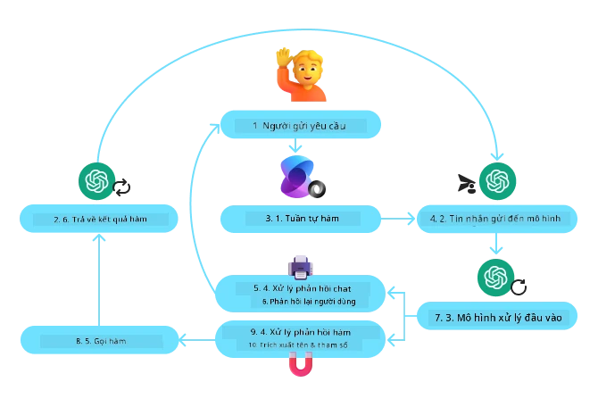
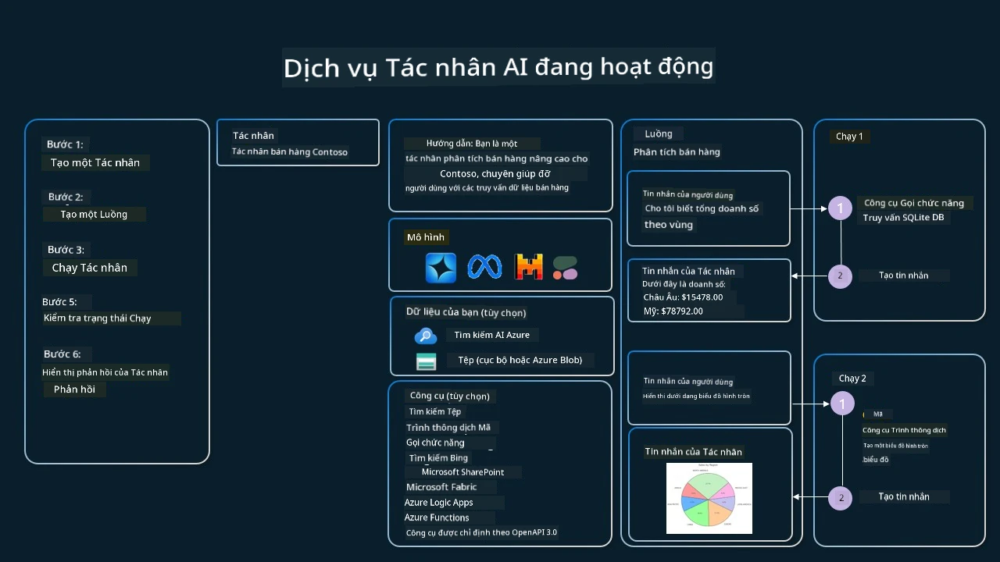

[](https://youtu.be/vieRiPRx-gI?si=cEZ8ApnT6Sus9rhn)

> _(Nhấp vào hình ảnh trên để xem video của bài học này)_

# Mẫu Thiết Kế Sử Dụng Công Cụ

Công cụ thật thú vị vì chúng cho phép các đại lý AI có một phạm vi năng lực rộng hơn. Thay vì đại lý chỉ có một tập hợp các hành động giới hạn mà nó có thể thực hiện, bằng cách thêm một công cụ, đại lý giờ đây có thể thực hiện nhiều loại hành động khác nhau. Trong chương này, chúng ta sẽ xem xét Mẫu Thiết Kế Sử Dụng Công Cụ, mô tả cách các đại lý AI có thể sử dụng các công cụ cụ thể để đạt được mục tiêu của mình.

## Giới Thiệu

Trong bài học này, chúng ta sẽ trả lời các câu hỏi sau:

- Mẫu thiết kế sử dụng công cụ là gì?
- Những trường hợp sử dụng nào có thể áp dụng mẫu thiết kế này?
- Các yếu tố / khối xây dựng cần thiết để triển khai mẫu thiết kế là gì?
- Những cân nhắc đặc biệt nào khi sử dụng Mẫu Thiết Kế Sử Dụng Công Cụ để xây dựng các đại lý AI đáng tin cậy?

## Mục Tiêu Học Tập

Sau khi hoàn thành bài học này, bạn sẽ có thể:

- Định nghĩa Mẫu Thiết Kế Sử Dụng Công Cụ và mục đích của nó.
- Nhận diện các trường hợp sử dụng mà Mẫu Thiết Kế Sử Dụng Công Cụ có thể áp dụng.
- Hiểu các yếu tố chính cần thiết để triển khai mẫu thiết kế.
- Nhận biết những cân nhắc để đảm bảo độ tin cậy khi sử dụng mẫu thiết kế này cho các đại lý AI.

## Mẫu Thiết Kế Sử Dụng Công Cụ là gì?

**Mẫu Thiết Kế Sử Dụng Công Cụ** tập trung vào việc cung cấp cho các Mô Hình Ngôn Ngữ Lớn (LLM) khả năng tương tác với các công cụ bên ngoài để đạt được các mục tiêu cụ thể. Công cụ là các đoạn mã có thể được đại lý thực thi để thực hiện các hành động. Một công cụ có thể là một hàm đơn giản như máy tính, hoặc một cuộc gọi API tới dịch vụ bên thứ ba như tra cứu giá cổ phiếu hoặc dự báo thời tiết. Trong bối cảnh các đại lý AI, các công cụ được thiết kế để được thực thi bởi các đại lý dựa trên các **cuộc gọi hàm do mô hình tạo ra**.

## Những trường hợp sử dụng nào có thể áp dụng?

Các đại lý AI có thể tận dụng công cụ để hoàn thành các tác vụ phức tạp, truy xuất thông tin, hoặc đưa ra quyết định. Mẫu thiết kế sử dụng công cụ thường được dùng trong các kịch bản yêu cầu tương tác động với các hệ thống bên ngoài, như cơ sở dữ liệu, dịch vụ web, hoặc bộ thông dịch mã. Khả năng này hữu ích cho nhiều trường hợp sử dụng khác nhau bao gồm:

- **Truy xuất thông tin động:** Đại lý có thể truy vấn các API hoặc cơ sở dữ liệu bên ngoài để lấy dữ liệu cập nhật (ví dụ: truy vấn cơ sở dữ liệu SQLite để phân tích dữ liệu, lấy giá cổ phiếu hoặc thông tin thời tiết).
- **Thực thi và giải thích mã:** Đại lý có thể chạy mã hoặc tập lệnh để giải quyết các bài toán toán học, tạo báo cáo, hoặc thực hiện các mô phỏng.
- **Tự động hóa quy trình làm việc:** Tự động hóa các quy trình lặp đi lặp lại hoặc đa bước bằng cách tích hợp công cụ như bộ lập lịch nhiệm vụ, dịch vụ email, hoặc các đường ống dữ liệu.
- **Hỗ trợ khách hàng:** Đại lý có thể tương tác với các hệ thống CRM, nền tảng hỗ trợ vé, hoặc cơ sở tri thức để giải quyết các câu hỏi của người dùng.
- **Tạo và chỉnh sửa nội dung:** Đại lý có thể tận dụng các công cụ như kiểm tra ngữ pháp, tóm tắt văn bản, hoặc đánh giá an toàn nội dung để hỗ trợ các tác vụ tạo nội dung.

## Các yếu tố / khối xây dựng cần thiết để triển khai mẫu thiết kế sử dụng công cụ?

Các khối xây dựng này cho phép đại lý AI thực hiện nhiều loại nhiệm vụ khác nhau. Hãy cùng xem xét các yếu tố chính cần có để triển khai Mẫu Thiết Kế Sử Dụng Công Cụ:

- **Lược đồ Hàm/Công Cụ**: Định nghĩa chi tiết các công cụ có sẵn, bao gồm tên hàm, mục đích, tham số cần thiết và đầu ra dự kiến. Các lược đồ này giúp LLM hiểu được những công cụ nào có thể dùng và cách tạo yêu cầu hợp lệ.

- **Logic Thực Thi Hàm**: Quy định cách và khi nào các công cụ được gọi dựa trên ý định người dùng và ngữ cảnh hội thoại. Điều này có thể bao gồm các module lập kế hoạch, cơ chế chuyển hướng, hoặc các luồng điều kiện để xác định việc sử dụng công cụ một cách động.

- **Hệ Thống Xử Lý Tin Nhắn**: Các thành phần quản lý luồng hội thoại giữa đầu vào người dùng, phản hồi của LLM, cuộc gọi công cụ và kết quả từ công cụ.

- **Khung Tích Hợp Công Cụ**: Hạ tầng kết nối đại lý với nhiều công cụ khác nhau, dù là hàm đơn giản hay dịch vụ bên ngoài phức tạp.

- **Xử Lý Lỗi & Xác Thực**: Cơ chế xử lý lỗi khi thực thi công cụ, xác thực tham số và quản lý các phản hồi không mong đợi.

- **Quản Lý Trạng Thái**: Theo dõi ngữ cảnh hội thoại, các tương tác công cụ trước đó, và dữ liệu tồn tại để đảm bảo tính nhất quán trong các tương tác đa lượt.

Tiếp theo, hãy cùng xem chi tiết về Cuộc Gọi Hàm/Công Cụ.
 
### Cuộc Gọi Hàm/Công Cụ

Cuộc gọi hàm là cách chính để chúng ta cho phép các Mô Hình Ngôn Ngữ Lớn (LLM) tương tác với các công cụ. Bạn thường thấy 'Hàm' và 'Công Cụ' được dùng thay thế cho nhau vì 'hàm' (đoạn mã có thể tái sử dụng) chính là 'công cụ' mà đại lý dùng để thực hiện nhiệm vụ. Để mã của một hàm được gọi, LLM phải so sánh yêu cầu của người dùng với mô tả hàm. Để làm điều này, một lược đồ chứa mô tả tất cả các hàm có sẵn được gửi đến LLM. LLM sau đó chọn hàm phù hợp nhất cho nhiệm vụ và trả về tên hàm cùng đối số. Hàm được chọn sẽ được gọi, phản hồi của nó được gửi lại cho LLM, LLM dùng thông tin này để đáp lại yêu cầu của người dùng.

Để các nhà phát triển triển khai cuộc gọi hàm cho đại lý, bạn sẽ cần:

1. Một mô hình LLM hỗ trợ cuộc gọi hàm
2. Một lược đồ chứa mô tả các hàm
3. Mã cho mỗi hàm được mô tả

Hãy dùng ví dụ lấy giờ hiện tại ở một thành phố để minh họa:

1. **Khởi tạo một LLM hỗ trợ cuộc gọi hàm:**

    Không phải tất cả các mô hình đều hỗ trợ cuộc gọi hàm, nên điều quan trọng là kiểm tra xem LLM bạn dùng có hỗ trợ không.     <a href="https://learn.microsoft.com/azure/ai-services/openai/how-to/function-calling" target="_blank">Azure OpenAI</a> hỗ trợ cuộc gọi hàm. Chúng ta có thể bắt đầu bằng cách khởi tạo client OpenAI kết nối với **API Responses** của Azure OpenAI (điểm cuối ổn định `/openai/v1/` — không cần `api_version`).

    ```python
    # Khởi tạo client OpenAI cho Azure OpenAI (API Responses, điểm cuối v1)
    client = OpenAI(
        base_url=f"{os.environ['AZURE_OPENAI_ENDPOINT'].rstrip('/')}/openai/v1/",
        api_key=os.environ["AZURE_OPENAI_API_KEY"],
    )
    deployment_name = os.environ["AZURE_OPENAI_DEPLOYMENT"]
    ```

1. **Tạo Lược Đồ Hàm**:

    Tiếp theo, chúng ta sẽ định nghĩa một lược đồ JSON chứa tên hàm, mô tả chức năng hàm và tên cùng mô tả các tham số hàm.
    Sau đó, chúng ta sẽ gửi lược đồ này cho client vừa tạo cùng với yêu cầu người dùng muốn biết giờ hiện tại ở San Francisco. Điều quan trọng cần lưu ý là **cuộc gọi công cụ** là thứ được trả về, **không phải** câu trả lời cuối cùng cho câu hỏi. Như đã nói, LLM trả về tên hàm mà nó chọn để thực hiện nhiệm vụ, cùng các tham số sẽ được truyền cho hàm đó.

    ```python
    # Mô tả chức năng để mô hình đọc (Định dạng công cụ phẳng API Phản hồi)
    tools = [
        {
            "type": "function",
            "name": "get_current_time",
            "description": "Get the current time in a given location",
            "parameters": {
                "type": "object",
                "properties": {
                    "location": {
                        "type": "string",
                        "description": "The city name, e.g. San Francisco",
                    },
                },
                "required": ["location"],
            },
        }
    ]
    ```
   
    ```python
  
    # Tin nhắn người dùng ban đầu
    messages = [{"role": "user", "content": "What's the current time in San Francisco"}]

    # Lần gọi API đầu tiên: Yêu cầu mô hình sử dụng chức năng
    response = client.responses.create(
        model=deployment_name,
        input=messages,
        tools=tools,
        tool_choice="auto",
        store=False,
    )

    # API Phản hồi trả về các lần gọi công cụ dưới dạng các mục function_call trong response.output.
    # Thêm chúng vào cuộc trò chuyện để mô hình có đầy đủ ngữ cảnh ở lượt tiếp theo.
    messages += response.output

    print("Model's response:")
    print(response.output)
  
    ```

    ```bash
    Model's response:
    [ResponseFunctionToolCall(arguments='{"location":"San Francisco"}', call_id='call_pOsKdUlqvdyttYB67MOj434b', name='get_current_time', type='function_call')]
    ```
  
1. **Mã hàm cần để thực hiện nhiệm vụ:**

    Khi LLM đã chọn hàm cần chạy, mã thực hiện nhiệm vụ phải được triển khai và thực thi.
    Chúng ta có thể lập trình mã Python để lấy giờ hiện tại. Đồng thời cũng cần viết mã để trích xuất tên hàm và đối số từ response_message để lấy kết quả cuối cùng.

    ```python
      def get_current_time(location):
        """Get the current time for a given location"""
        print(f"get_current_time called with location: {location}")  
        location_lower = location.lower()
        
        for key, timezone in TIMEZONE_DATA.items():
            if key in location_lower:
                print(f"Timezone found for {key}")  
                current_time = datetime.now(ZoneInfo(timezone)).strftime("%I:%M %p")
                return json.dumps({
                    "location": location,
                    "current_time": current_time
                })
      
        print(f"No timezone data found for {location_lower}")  
        return json.dumps({"location": location, "current_time": "unknown"})
    ```

     ```python
    # Xử lý các cuộc gọi hàm
    tool_calls = [item for item in response.output if item.type == "function_call"]
    if tool_calls:
        for tool_call in tool_calls:
            if tool_call.name == "get_current_time":

                function_args = json.loads(tool_call.arguments)

                time_response = get_current_time(
                    location=function_args.get("location")
                )

                # Trả về kết quả công cụ dưới dạng mục function_call_output
                messages.append({
                    "type": "function_call_output",
                    "call_id": tool_call.call_id,
                    "output": time_response,
                })
    else:
        print("No tool calls were made by the model.")

    # Cuộc gọi API thứ hai: Lấy phản hồi cuối cùng từ mô hình
    final_response = client.responses.create(
        model=deployment_name,
        input=messages,
        tools=tools,
        store=False,
    )

    return final_response.output_text
     ```

     ```bash
      get_current_time called with location: San Francisco
      Timezone found for san francisco
      The current time in San Francisco is 09:24 AM.
     ```

Cuộc gọi hàm là trung tâm của hầu hết, nếu không muốn nói là tất cả, thiết kế sử dụng công cụ cho đại lý, tuy nhiên việc triển khai từ đầu có thể đôi khi khó khăn.
Như chúng ta đã học trong [Bài 2](../../../02-explore-agentic-frameworks), các khung agentic cung cấp cho chúng ta những khối xây dựng sẵn để triển khai việc sử dụng công cụ.
 
## Ví dụ sử dụng công cụ với các khung Agentic

Dưới đây là một số ví dụ về cách bạn có thể triển khai Mẫu Thiết Kế Sử Dụng Công Cụ sử dụng các khung agentic khác nhau:

### Khung Microsoft Agent Framework

<a href="https://learn.microsoft.com/azure/ai-services/agents/overview" target="_blank">Microsoft Agent Framework</a> là một khung AI mã nguồn mở để xây dựng các đại lý AI. Nó làm đơn giản quá trình sử dụng gọi hàm bằng cách cho phép bạn định nghĩa công cụ dưới dạng các hàm Python với decorator `@tool`. Khung này xử lý giao tiếp hai chiều giữa mô hình và mã của bạn. Nó cũng cung cấp truy cập đến các công cụ xây dựng sẵn như Tìm kiếm File và Bộ Thông Dịch Mã thông qua `FoundryChatClient`.

Sơ đồ sau minh họa quy trình gọi hàm với Microsoft Agent Framework:



Trong Microsoft Agent Framework, các công cụ được định nghĩa dưới dạng các hàm có decorator. Chúng ta có thể chuyển hàm `get_current_time` đã thấy trước đó thành công cụ bằng cách dùng decorator `@tool`. Khung này sẽ tự động tuần tự hóa hàm và các tham số của nó, tạo lược đồ để gửi đến LLM.

```python
import os
from agent_framework import tool
from agent_framework.foundry import FoundryChatClient
from azure.identity import AzureCliCredential

@tool(approval_mode="never_require")
def get_current_time(location: str) -> str:
    """Get the current time for a given location"""
    ...

# Tạo client
provider = FoundryChatClient(
    project_endpoint=os.environ["AZURE_AI_PROJECT_ENDPOINT"],
    model=os.environ["AZURE_AI_MODEL_DEPLOYMENT_NAME"],
    credential=AzureCliCredential(),
)

# Tạo một agent và chạy với công cụ
agent = provider.as_agent(name="TimeAgent", instructions="Use available tools to answer questions.", tools=get_current_time)
response = await agent.run("What time is it?")
```
  
### Dịch Vụ Đại Lý Microsoft Foundry Agent Service

<a href="https://learn.microsoft.com/azure/ai-services/agents/overview" target="_blank">Microsoft Foundry Agent Service</a> là một khung agentic mới hơn được thiết kế để cho phép các nhà phát triển xây dựng, triển khai và mở rộng các đại lý AI chất lượng cao, an toàn mà không cần quản lý tài nguyên tính toán và lưu trữ nền tảng. Nó đặc biệt hữu ích cho các ứng dụng doanh nghiệp vì là dịch vụ được quản lý hoàn toàn với bảo mật cấp doanh nghiệp.

Khi so sánh với phát triển trực tiếp qua API LLM, Microsoft Foundry Agent Service có một số lợi thế, bao gồm:

- Cuộc gọi công cụ tự động – không cần phải phân tích cuộc gọi công cụ, gọi công cụ, rồi xử lý phản hồi; tất cả đều được thực hiện phía máy chủ
- Dữ liệu được quản lý an toàn – thay vì quản lý trạng thái hội thoại của riêng bạn, bạn có thể dựa vào các thread để lưu trữ toàn bộ thông tin cần thiết
- Công cụ có sẵn ngay – Các công cụ bạn có thể dùng để tương tác với nguồn dữ liệu của mình, như Bing, Azure AI Search, và Azure Functions.

Các công cụ có trong Microsoft Foundry Agent Service được chia thành hai loại:

1. Công Cụ Kiến Thức:
    - <a href="https://learn.microsoft.com/azure/ai-services/agents/how-to/tools/bing-grounding?tabs=python&pivots=overview" target="_blank">Tích hợp với Tìm kiếm Bing</a>
    - <a href="https://learn.microsoft.com/azure/ai-services/agents/how-to/tools/file-search?tabs=python&pivots=overview" target="_blank">Tìm kiếm File</a>
    - <a href="https://learn.microsoft.com/azure/ai-services/agents/how-to/tools/azure-ai-search?tabs=azurecli%2Cpython&pivots=overview-azure-ai-search" target="_blank">Tìm kiếm Azure AI</a>

2. Công Cụ Hành Động:
    - <a href="https://learn.microsoft.com/azure/ai-services/agents/how-to/tools/function-calling?tabs=python&pivots=overview" target="_blank">Cuộc Gọi Hàm</a>
    - <a href="https://learn.microsoft.com/azure/ai-services/agents/how-to/tools/code-interpreter?tabs=python&pivots=overview" target="_blank">Bộ Thông Dịch Mã</a>
    - <a href="https://learn.microsoft.com/azure/ai-services/agents/how-to/tools/openapi-spec?tabs=python&pivots=overview" target="_blank">Công cụ định nghĩa OpenAPI</a>
    - <a href="https://learn.microsoft.com/azure/ai-services/agents/how-to/tools/azure-functions?pivots=overview" target="_blank">Azure Functions</a>

Dịch vụ Đại lý cho phép chúng ta dùng những công cụ này cùng nhau như một `bộ công cụ`. Nó cũng sử dụng `threads` để theo dõi lịch sử các tin nhắn từ một cuộc hội thoại cụ thể.

Hãy tưởng tượng bạn là đại lý bán hàng ở một công ty tên Contoso. Bạn muốn phát triển một đại lý hội thoại có thể trả lời câu hỏi về dữ liệu bán hàng của bạn.

Hình ảnh sau minh họa cách bạn có thể dùng Microsoft Foundry Agent Service để phân tích dữ liệu bán hàng:



Để sử dụng bất kỳ công cụ nào với dịch vụ này, chúng ta có thể tạo client và định nghĩa một công cụ hoặc bộ công cụ. Để triển khai thực tế, ta dùng mã Python sau. LLM sẽ có thể xem bộ công cụ và quyết định dùng hàm do người dùng tạo `fetch_sales_data_using_sqlite_query` hay Bộ Thông Dịch Mã dựng sẵn dựa trên yêu cầu của người dùng.

```python 
import os
from azure.ai.projects import AIProjectClient
from azure.identity import DefaultAzureCredential
from fetch_sales_data_functions import fetch_sales_data_using_sqlite_query # hàm fetch_sales_data_using_sqlite_query có thể được tìm thấy trong file fetch_sales_data_functions.py.
from azure.ai.projects.models import ToolSet, FunctionTool, CodeInterpreterTool

project_client = AIProjectClient.from_connection_string(
    credential=DefaultAzureCredential(),
    conn_str=os.environ["PROJECT_CONNECTION_STRING"],
)

# Khởi tạo bộ công cụ
toolset = ToolSet()

# Khởi tạo tác nhân gọi hàm với hàm fetch_sales_data_using_sqlite_query và thêm nó vào bộ công cụ
fetch_data_function = FunctionTool(fetch_sales_data_using_sqlite_query)
toolset.add(fetch_data_function)

# Khởi tạo công cụ Bộ thông dịch Mã và thêm nó vào bộ công cụ.
code_interpreter = CodeInterpreterTool()toolset.add(code_interpreter)

agent = project_client.agents.create_agent(
    model="gpt-4o-mini", name="my-agent", instructions="You are helpful agent", 
    toolset=toolset
)
```

## Những cân nhắc đặc biệt khi sử dụng Mẫu Thiết Kế Sử Dụng Công Cụ để xây dựng đại lý AI đáng tin cậy?

Mối quan ngại phổ biến với SQL sinh ra động do LLM là về bảo mật, đặc biệt nguy cơ tiêm SQL hoặc hành động độc hại, như xóa hoặc làm hỏng cơ sở dữ liệu. Trong khi những lo ngại này là hợp lý, chúng có thể được giảm thiểu hiệu quả bằng cách cấu hình quyền truy cập cơ sở dữ liệu phù hợp. Đối với hầu hết cơ sở dữ liệu, điều này liên quan đến việc thiết lập cơ sở dữ liệu ở chế độ chỉ đọc. Đối với các dịch vụ cơ sở dữ liệu như PostgreSQL hoặc Azure SQL, ứng dụng nên được gán vai trò chỉ đọc (SELECT).

Chạy ứng dụng trong môi trường an toàn càng làm tăng khả năng bảo vệ. Trong các kịch bản doanh nghiệp, dữ liệu thường được trích xuất và chuyển đổi từ hệ thống hoạt động sang cơ sở dữ liệu chỉ đọc hoặc kho dữ liệu với lược đồ dễ dùng. Cách tiếp cận này đảm bảo dữ liệu được bảo mật, tối ưu cho hiệu suất và khả năng truy cập, và ứng dụng có quyền truy cập hạn chế, chỉ đọc.

## Mã Mẫu

- Python: [Agent Framework](./code_samples/04-python-agent-framework.ipynb)
- .NET: [Agent Framework](./code_samples/04-dotnet-agent-framework.md)

## Còn câu hỏi gì về Mẫu Thiết Kế Sử Dụng Công Cụ không?

Tham gia [Microsoft Foundry Discord](https://discord.com/invite/ATgtXmAS5D) để gặp gỡ những người học khác, tham dự giờ làm việc và nhận câu trả lời cho các câu hỏi về Đại Lý AI.

## Tài Nguyên Bổ Sung

- <a href="https://microsoft.github.io/build-your-first-agent-with-azure-ai-agent-service-workshop/" target="_blank">Hội Thảo Dịch Vụ Đại Lý AI Azure</a>
- <a href="https://github.com/Azure-Samples/contoso-creative-writer/tree/main/docs/workshop" target="_blank">Hội Thảo Đa Đại Lý Viết Sáng Tạo Contoso</a>
- <a href="https://learn.microsoft.com/azure/ai-services/agents/overview" target="_blank">Tổng Quan Microsoft Agent Framework</a>


## Bài học trước

[Hiểu về Các Mẫu Thiết Kế Agentic](../03-agentic-design-patterns/README.md)

## Bài học tiếp theo

[Agentic RAG](../05-agentic-rag/README.md)

---

<!-- CO-OP TRANSLATOR DISCLAIMER START -->
**Tuyên bố miễn trừ trách nhiệm**:
Tài liệu này đã được dịch bằng dịch vụ dịch thuật AI [Co-op Translator](https://github.com/Azure/co-op-translator). Mặc dù chúng tôi cố gắng đảm bảo độ chính xác, xin lưu ý rằng bản dịch tự động có thể chứa lỗi hoặc sai sót. Tài liệu gốc bằng ngôn ngữ gốc nên được coi là nguồn tin chính thức. Đối với thông tin quan trọng, nên sử dụng dịch vụ dịch thuật chuyên nghiệp bởi con người. Chúng tôi không chịu trách nhiệm về bất kỳ hiểu lầm hoặc giải thích sai nào phát sinh từ việc sử dụng bản dịch này.
<!-- CO-OP TRANSLATOR DISCLAIMER END -->