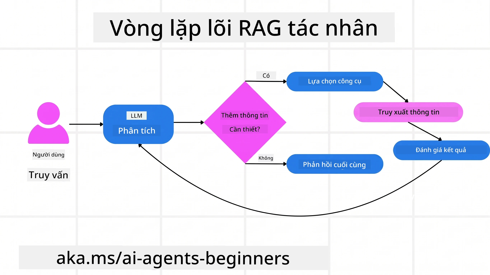
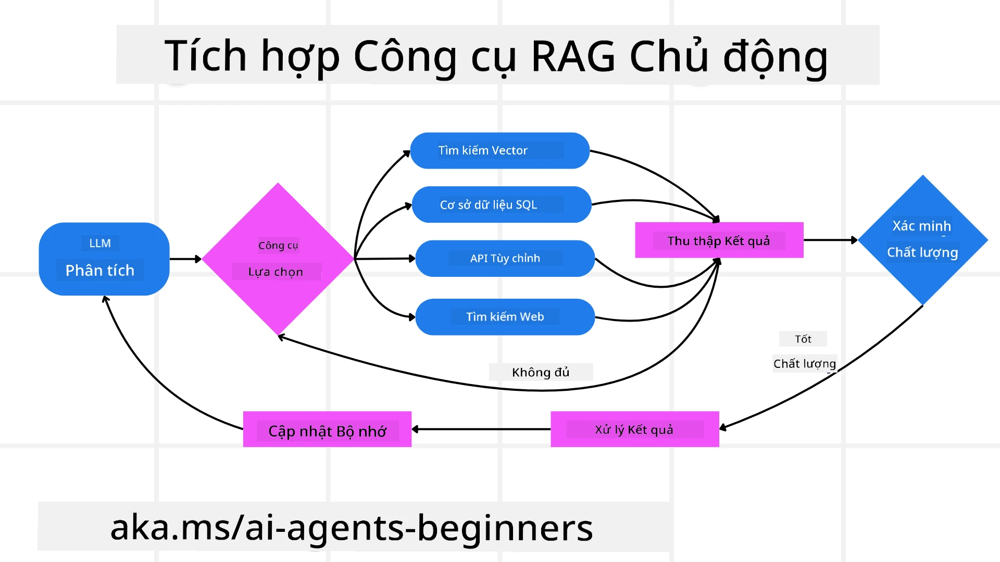
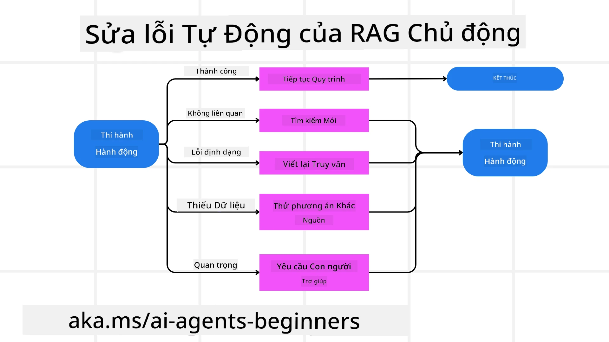
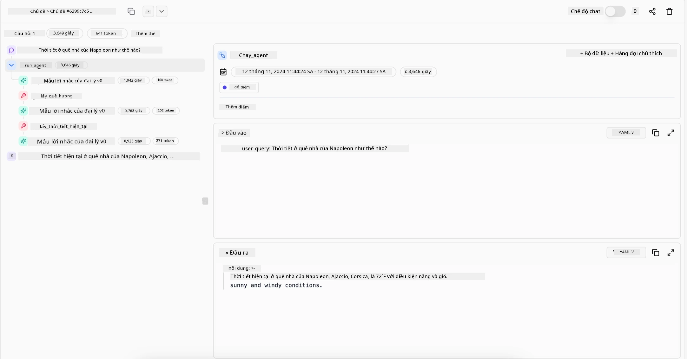

> _(Nhấn vào hình ảnh phía trên để xem video bài học này)_

# Agentic RAG

Bài học này cung cấp một tổng quan toàn diện về Agentic Retrieval-Augmented Generation (Agentic RAG), một mô hình AI mới nổi trong đó các mô hình ngôn ngữ lớn (LLM) tự động lập kế hoạch các bước tiếp theo đồng thời lấy thông tin từ các nguồn bên ngoài. Khác với các mẫu truy xuất tĩnh rồi đọc, Agentic RAG liên quan đến các cuộc gọi lặp đi lặp lại đến LLM, xen kẽ với các cuộc gọi đến công cụ hoặc hàm và các kết quả có cấu trúc. Hệ thống đánh giá kết quả, tinh chỉnh truy vấn, gọi thêm các công cụ nếu cần, và tiếp tục chu trình này cho đến khi đạt được giải pháp hài lòng.

## Giới thiệu

Bài học này sẽ trình bày

- **Hiểu về Agentic RAG:** Tìm hiểu về mô hình AI mới nổi, nơi các mô hình ngôn ngữ lớn (LLM) tự động lập kế hoạch các bước tiếp theo đồng thời lấy thông tin từ các nguồn dữ liệu bên ngoài.
- **Hiểu phong cách maker-checker lặp đi lặp lại:** Nắm bắt vòng lặp các cuộc gọi lặp đi lặp lại đến LLM, xen kẽ với các cuộc gọi công cụ hoặc hàm và các kết quả có cấu trúc, được thiết kế để cải thiện độ chính xác và xử lý các truy vấn bị sai định dạng.
- **Khám phá ứng dụng thực tiễn:** Xác định các kịch bản mà Agentic RAG thể hiện mạnh mẽ, như môi trường ưu tiên độ chính xác, tương tác cơ sở dữ liệu phức tạp và các quy trình công việc mở rộng.

## Mục tiêu học tập

Sau khi hoàn thành bài học này, bạn sẽ biết cách/hiểu được:

- **Hiểu về Agentic RAG:** Tìm hiểu về mô hình AI mới nổi, nơi các mô hình ngôn ngữ lớn (LLM) tự động lập kế hoạch các bước tiếp theo trong khi lấy thông tin từ các nguồn dữ liệu bên ngoài.
- **Phong cách maker-checker lặp đi lặp lại:** Nắm bắt khái niệm vòng lặp các cuộc gọi lặp đi lặp lại đến LLM, xen kẽ với các cuộc gọi công cụ hoặc hàm và các kết quả có cấu trúc, được thiết kế để cải thiện độ chính xác và xử lý các truy vấn bị sai định dạng.
- **Sở hữu quá trình suy luận:** Hiểu khả năng của hệ thống trong việc sở hữu quá trình suy luận của chính nó, đưa ra quyết định về cách tiếp cận vấn đề mà không dựa vào các con đường được định nghĩa trước.
- **Quy trình công việc:** Hiểu cách một mô hình agentic tự quyết định việc truy xuất báo cáo xu hướng thị trường, xác định dữ liệu đối thủ cạnh tranh, liên kết các chỉ số bán hàng nội bộ, tổng hợp kết quả và đánh giá chiến lược.
- **Vòng lặp lặp lại, tích hợp công cụ và bộ nhớ:** Tìm hiểu về sự dựa vào mô hình tương tác vòng lặp của hệ thống, duy trì trạng thái và bộ nhớ qua các bước để tránh vòng lặp lặp lại và đưa ra quyết định sáng suốt hơn.
- **Xử lý lỗi và tự chỉnh sửa:** Khám phá các cơ chế tự chỉnh sửa mạnh mẽ của hệ thống, bao gồm lặp lại và truy vấn lại, sử dụng công cụ chẩn đoán, và dự phòng giám sát con người.
- **Giới hạn của khả năng tác nhân:** Hiểu các giới hạn của Agentic RAG, tập trung vào tính tự chủ theo lĩnh vực, phụ thuộc vào hạ tầng, và tôn trọng các giới hạn an toàn.
- **Các trường hợp sử dụng thực tế và giá trị:** Xác định các kịch bản mà Agentic RAG phát huy tốt, như môi trường ưu tiên độ chính xác, tương tác cơ sở dữ liệu phức tạp và quy trình công việc mở rộng.
- **Quản trị, minh bạch và tin cậy:** Tìm hiểu về tầm quan trọng của quản trị và minh bạch, bao gồm giải thích được suy luận, kiểm soát thiên lệch và giám sát con người.

## Agentic RAG là gì?

Agentic Retrieval-Augmented Generation (Agentic RAG) là một mô hình AI mới nổi, trong đó các mô hình ngôn ngữ lớn (LLM) tự động lập kế hoạch các bước tiếp theo đồng thời lấy thông tin từ các nguồn bên ngoài. Khác với các mẫu truy xuất rồi đọc tĩnh, Agentic RAG liên quan đến các cuộc gọi lặp lại đến LLM, xen kẽ với các cuộc gọi công cụ hoặc hàm và các kết quả có cấu trúc. Hệ thống đánh giá kết quả, tinh chỉnh truy vấn, gọi thêm các công cụ nếu cần, và tiếp tục chu trình cho đến khi đạt được giải pháp hài lòng. Phong cách “maker-checker” lặp lại này giúp cải thiện độ chính xác, xử lý các truy vấn sai định dạng, và đảm bảo kết quả chất lượng cao.

Hệ thống chủ động sở hữu quá trình suy luận của chính mình, viết lại các truy vấn thất bại, chọn phương pháp truy xuất khác, và tích hợp nhiều công cụ — như tìm kiếm vector trong Azure AI Search, cơ sở dữ liệu SQL hoặc API tùy chỉnh — trước khi hoàn tất câu trả lời. Đặc điểm phân biệt của hệ thống agentic là khả năng sở hữu quá trình suy luận của chính nó. Các triển khai RAG truyền thống dựa vào các con đường định nghĩa trước, nhưng một hệ thống agentic tự động xác định trình tự các bước dựa trên chất lượng thông tin mà nó tìm thấy.

## Định nghĩa Agentic Retrieval-Augmented Generation (Agentic RAG)

Agentic Retrieval-Augmented Generation (Agentic RAG) là một mô hình mới trong phát triển AI, nơi các LLM không chỉ lấy thông tin từ các nguồn dữ liệu bên ngoài mà còn tự động lập kế hoạch các bước tiếp theo của chúng. Khác với mẫu truy xuất rồi đọc tĩnh hoặc các chuỗi prompt được lập trình kỹ càng, Agentic RAG liên quan đến vòng lặp các cuộc gọi lặp lại đến LLM, xen kẽ với các cuộc gọi công cụ hoặc hàm và các kết quả có cấu trúc. Ở mỗi bước, hệ thống đánh giá kết quả đã thu thập được, quyết định có cần tinh chỉnh truy vấn hay không, gọi thêm công cụ nếu cần, và tiếp tục chu trình cho đến khi đạt được giải pháp thỏa đáng.

Phong cách “maker-checker” lặp lại này được thiết kế để cải thiện độ chính xác, xử lý các truy vấn sai định dạng với các cơ sở dữ liệu có cấu trúc (ví dụ NL2SQL), và đảm bảo kết quả cân bằng, chất lượng cao. Thay vì chỉ dựa trên các chuỗi prompt được thiết kế cẩn thận, hệ thống chủ động sở hữu quá trình suy luận của chính mình. Nó có thể viết lại các truy vấn thất bại, chọn các phương pháp truy xuất khác, và tích hợp đa công cụ — như tìm kiếm vector trong Azure AI Search, cơ sở dữ liệu SQL hoặc các API tùy chỉnh — trước khi hoàn tất câu trả lời. Điều này loại bỏ nhu cầu về các khung điều phối quá phức tạp. Thay vào đó, một vòng lặp đơn giản của “gọi LLM → sử dụng công cụ → gọi LLM → …” có thể tạo ra các kết quả tinh vi và vững chắc.

## Sở hữu quá trình suy luận

Đặc điểm phân biệt làm cho một hệ thống trở thành “agentic” là khả năng sở hữu quá trình suy luận của chính nó. Các triển khai RAG truyền thống thường phụ thuộc vào con người định sẵn lộ trình cho mô hình: một chuỗi suy nghĩ phác thảo cái cần truy xuất và khi nào.
Nhưng khi hệ thống thực sự agentic, nó tự quyết định cách tiếp cận vấn đề bên trong. Nó không chỉ thi hành một kịch bản; mà là tự động xác định trình tự các bước dựa trên chất lượng thông tin nó tìm thấy.
Ví dụ, nếu được yêu cầu tạo một chiến lược ra mắt sản phẩm, nó không chỉ dựa vào một prompt mô tả toàn bộ quy trình nghiên cứu và ra quyết định. Thay vào đó, mô hình agentic tự quyết định:

1. Truy xuất các báo cáo xu hướng thị trường hiện tại bằng cách sử dụng Bing Web Grounding
2. Xác định dữ liệu đối thủ cạnh tranh liên quan bằng Azure AI Search.
3. Liên kết các số liệu bán hàng nội bộ lịch sử bằng Azure SQL Database.
4. Tổng hợp các phát hiện thành một chiến lược nhất quán được điều phối qua Azure OpenAI Service.
5. Đánh giá chiến lược để phát hiện lỗ hổng hoặc sự không nhất quán, khởi động một vòng truy xuất khác nếu cần.
Tất cả các bước này — tinh chỉnh truy vấn, chọn nguồn, lặp lại cho đến khi “hài lòng” với câu trả lời — đều do mô hình quyết định, không phải do con người viết kịch bản trước.

## Vòng lặp lặp lại, tích hợp công cụ và bộ nhớ

Một hệ thống agentic dựa vào mô hình tương tác vòng lặp:

- **Cuộc gọi ban đầu:** Mục tiêu của người dùng (hay prompt người dùng) được trình bày cho LLM.
- **Gọi công cụ:** Nếu mô hình nhận thấy thông tin thiếu hoặc chỉ dẫn mơ hồ, nó chọn một công cụ hoặc phương pháp truy xuất — như truy vấn cơ sở dữ liệu vector (ví dụ Azure AI Search tìm kiếm kết hợp trên dữ liệu riêng tư) hoặc gọi SQL có cấu trúc — để thu thập thêm ngữ cảnh.
- **Đánh giá & Tinh chỉnh:** Sau khi xem xét dữ liệu trả về, mô hình quyết định liệu thông tin có đủ hay không. Nếu không, nó tinh chỉnh truy vấn, thử công cụ khác, hoặc điều chỉnh cách tiếp cận.
- **Lặp lại tới khi hài lòng:** Chu trình này tiếp tục cho đến khi mô hình xác định rằng nó có đủ rõ ràng và bằng chứng để đưa ra câu trả lời cuối cùng, được suy luận kỹ lưỡng.
- **Bộ nhớ & Trạng thái:** Bởi vì hệ thống duy trì trạng thái và bộ nhớ xuyên suốt các bước, nó có thể nhớ lại các lần thử trước và kết quả của chúng, tránh các vòng lặp lặp lại và đưa ra quyết định sáng suốt hơn khi tiến hành.

Theo thời gian, điều này tạo ra cảm giác hiểu biết tiến triển, giúp mô hình xử lý các tác vụ phức tạp, nhiều bước mà không cần con người phải can thiệp hoặc điều chỉnh prompt liên tục.

## Xử lý các chế độ thất bại và tự sửa lỗi

Tính tự chủ của Agentic RAG cũng bao gồm các cơ chế tự sửa lỗi mạnh mẽ. Khi hệ thống gặp phải các ngõ cụt — như truy xuất tài liệu không liên quan hoặc gặp phải các truy vấn sai định dạng — nó có thể:

- **Lặp lại và truy vấn lại:** Thay vì trả lại các phản hồi giá trị thấp, mô hình thử các chiến lược tìm kiếm mới, viết lại truy vấn cơ sở dữ liệu hoặc xem xét các bộ dữ liệu thay thế.
- **Sử dụng công cụ chẩn đoán:** Hệ thống có thể gọi thêm các hàm giúp nó gỡ lỗi các bước suy luận hoặc xác nhận độ chính xác của dữ liệu đã truy xuất. Các công cụ như Azure AI Tracing sẽ rất quan trọng để cho phép quan sát và giám sát mạnh mẽ.
- **Truyền cho giám sát con người:** Trong các trường hợp rủi ro cao hoặc thất bại lặp đi lặp lại, mô hình có thể báo hiệu sự không chắc chắn và yêu cầu hướng dẫn từ con người. Sau khi nhận được phản hồi sửa chữa từ con người, mô hình có thể học hỏi bài học đó cho những lần tiếp theo.

Phương pháp lặp lại và năng động này cho phép mô hình cải thiện liên tục, đảm bảo rằng nó không chỉ là hệ thống thực thi một lần mà là hệ thống học hỏi từ các sai sót trong một phiên làm việc.

## Giới hạn của khả năng tác nhân

Dù có sự tự chủ trong một nhiệm vụ, Agentic RAG không tương đương với Trí Tuệ Nhân Tạo Tổng Quát (AGI). Khả năng “agentic” của nó bị giới hạn trong các công cụ, nguồn dữ liệu và chính sách do các nhà phát triển con người cung cấp. Nó không thể tự tạo ra công cụ riêng hoặc vượt ra ngoài giới hạn miền đã được đặt. Thay vào đó, nó xuất sắc trong việc điều phối năng động các tài nguyên hiện có.
Các khác biệt chính so với các dạng AI tiên tiến hơn bao gồm:

1. **Tự chủ theo miền cụ thể:** Các hệ thống Agentic RAG tập trung đạt được các mục tiêu do người dùng định nghĩa trong một miền đã biết, sử dụng các chiến lược như viết lại truy vấn hoặc chọn công cụ để cải thiện kết quả.
2. **Phụ thuộc vào hạ tầng:** Khả năng của hệ thống phụ thuộc vào các công cụ và dữ liệu do nhà phát triển tích hợp. Nó không thể vượt quá giới hạn này nếu không có sự can thiệp của con người.
3. **Tôn trọng các giới hạn an toàn:** Các hướng dẫn đạo đức, quy tắc tuân thủ và chính sách kinh doanh vẫn rất quan trọng. Tự do của tác nhân luôn bị giới hạn bởi các biện pháp an toàn và cơ chế giám sát (hi vọng là như vậy?)

## Các trường hợp sử dụng thực tế và giá trị

Agentic RAG thể hiện ưu thế trong các kịch bản đòi hỏi sự tinh chỉnh lặp đi lặp lại và độ chính xác:

1. **Môi trường ưu tiên độ chính xác:** Trong kiểm tra tuân thủ, phân tích quy định hoặc nghiên cứu pháp lý, mô hình agentic có thể kiểm tra sự thật nhiều lần, tham khảo nhiều nguồn, và viết lại truy vấn cho đến khi tạo ra câu trả lời được rà soát kỹ lưỡng.
2. **Tương tác cơ sở dữ liệu phức tạp:** Khi xử lý dữ liệu có cấu trúc mà truy vấn thường xuyên thất bại hoặc cần điều chỉnh, hệ thống có thể tự động tinh chỉnh truy vấn bằng Azure SQL hoặc Microsoft Fabric OneLake, đảm bảo kết quả truy xuất cuối cùng phù hợp với ý định người dùng.
3. **Quy trình công việc kéo dài:** Các phiên làm việc lâu có thể phát triển khi xuất hiện thông tin mới. Agentic RAG có thể liên tục tích hợp dữ liệu mới, điều chỉnh chiến lược khi học hỏi thêm về không gian vấn đề.

## Quản trị, minh bạch và tin cậy

Khi các hệ thống này trở nên tự chủ hơn trong suy luận, quản trị và minh bạch trở nên rất quan trọng:

- **Suy luận có thể giải thích:** Mô hình có thể cung cấp bảng tra cứu các truy vấn nó đã thực hiện, các nguồn đã tham khảo, và các bước suy luận đã thực hiện để đạt được kết luận. Các công cụ như Azure AI Content Safety và Azure AI Tracing / GenAIOps có thể giúp duy trì minh bạch và giảm thiểu rủi ro.
- **Kiểm soát thiên lệch và truy xuất cân bằng:** Nhà phát triển có thể điều chỉnh các chiến lược truy xuất để đảm bảo các nguồn dữ liệu được xem xét cân bằng, đại diện và thường xuyên kiểm toán đầu ra để phát hiện thiên lệch hoặc mô hình sai lệch bằng cách sử dụng các mô hình tùy chỉnh cho các tổ chức khoa học dữ liệu nâng cao sử dụng Azure Machine Learning.
- **Giám sát con người và tuân thủ:** Đối với các tác vụ nhạy cảm, việc xem xét của con người vẫn là rất cần thiết. Agentic RAG không thay thế sự đánh giá của con người trong các quyết định quan trọng — nó bổ trợ bằng cách cung cấp các lựa chọn được rà soát kỹ càng hơn.

Việc có các công cụ cung cấp ghi chép rõ ràng về hành động là rất quan trọng. Nếu không có chúng, việc gỡ lỗi một quy trình nhiều bước sẽ rất khó khăn. Xem ví dụ sau đây từ Literal AI (công ty đứng sau Chainlit) cho một lần chạy Agent:

## Kết luận

Agentic RAG đại diện cho một bước tiến tự nhiên trong cách các hệ thống AI xử lý các nhiệm vụ phức tạp, dữ liệu lớn. Bằng cách áp dụng mô hình tương tác vòng lặp, tự động chọn công cụ, và tinh chỉnh truy vấn cho đến khi đạt được kết quả chất lượng cao, hệ thống tiến xa hơn kiểu theo kịch bản tĩnh thành một người quyết định thích ứng, biết bối cảnh. Dù vẫn bị giới hạn bởi hạ tầng và hướng dẫn đạo đức do con người đặt ra, các khả năng agentic này cho phép các tương tác AI phong phú hơn, năng động hơn và cuối cùng hữu ích hơn cho cả doanh nghiệp và người dùng cuối.

### Có thêm câu hỏi về Agentic RAG?

Tham gia [Microsoft Foundry Discord](https://discord.com/invite/ATgtXmAS5D) để gặp gỡ các học viên khác, tham dự giờ làm việc và được giải đáp câu hỏi về AI Agents.

## Tài nguyên bổ sung

- <a href="https://learn.microsoft.com/training/modules/use-own-data-azure-openai" target="_blank">Triển khai Retrieval Augmented Generation (RAG) với Azure OpenAI Service: Tìm hiểu cách sử dụng dữ liệu riêng của bạn với Azure OpenAI Service. Module Microsoft Learn này cung cấp hướng dẫn toàn diện về việc triển khai RAG</a>
- <a href="https://learn.microsoft.com/azure/ai-studio/concepts/evaluation-approach-gen-ai" target="_blank">Đánh giá ứng dụng AI tạo sinh với Microsoft Foundry: Bài viết này bao gồm đánh giá và so sánh các mô hình trên các bộ dữ liệu công khai, bao gồm các ứng dụng AI Agentic và kiến trúc RAG</a>
- <a href="https://weaviate.io/blog/what-is-agentic-rag" target="_blank">Agentic RAG là gì | Weaviate</a>
- <a href="https://ragaboutit.com/agentic-rag-a-complete-guide-to-agent-based-retrieval-augmented-generation/" target="_blank">Agentic RAG: Hướng dẫn đầy đủ về Agent-Based Retrieval Augmented Generation – Tin tức từ generation RAG</a>

- <a href="https://huggingface.co/learn/cookbook/agent_rag" target="_blank">Agentic RAG: tăng tốc RAG của bạn với cải biên truy vấn và tự truy vấn! Sách dạy AI mã nguồn mở Hugging Face</a>
- <a href="https://youtu.be/aQ4yQXeB1Ss?si=2HUqBzHoeB5tR04U" target="_blank">Thêm Lớp Agentic vào RAG</a>
- <a href="https://www.youtube.com/watch?v=zeAyuLc_f3Q&t=244s" target="_blank">Tương Lai của Trợ Lý Kiến Thức: Jerry Liu</a>
- <a href="https://www.youtube.com/watch?v=AOSjiXP1jmQ" target="_blank">Cách Xây Dựng Hệ Thống Agentic RAG</a>
- <a href="https://ignite.microsoft.com/sessions/BRK102?source=sessions" target="_blank">Sử dụng Dịch vụ Microsoft Foundry Agent để mở rộng quy mô các tác nhân AI của bạn</a>

### Các Bài Báo Học Thuật

- <a href="https://arxiv.org/abs/2303.17651" target="_blank">2303.17651 Self-Refine: Tinh Chỉnh Lặp Đi Lặp Lại với Phản Hồi Tự Động</a>
- <a href="https://arxiv.org/abs/2303.11366" target="_blank">2303.11366 Reflexion: Tác Nhân Ngôn Ngữ với Học Tăng Cường Bằng Lời Nói</a>
- <a href="https://arxiv.org/abs/2305.11738" target="_blank">2305.11738 CRITIC: Mô Hình Ngôn Ngữ Lớn Có Thể Tự Sửa Lỗi với Phê Bình Tương Tác Công Cụ</a>
- <a href="https://arxiv.org/abs/2501.09136" target="_blank">2501.09136 Agentic Retrieval-Augmented Generation: Tổng Quan về Agentic RAG</a>

## Bài Học Trước

[Mẫu Thiết Kế Sử Dụng Công Cụ](../04-tool-use/README.md)

## Bài Học Tiếp Theo

[Xây Dựng Tác Nhân AI Đáng Tin Cậy](../06-building-trustworthy-agents/README.md)

---

<!-- CO-OP TRANSLATOR DISCLAIMER START -->
**Tuyên bố miễn trừ trách nhiệm**:
Tài liệu này đã được dịch bằng dịch vụ dịch thuật AI [Co-op Translator](https://github.com/Azure/co-op-translator). Mặc dù chúng tôi cố gắng đảm bảo độ chính xác, xin lưu ý rằng bản dịch tự động có thể chứa lỗi hoặc sai sót. Tài liệu gốc bằng ngôn ngữ gốc nên được coi là nguồn tin chính thức. Đối với thông tin quan trọng, nên sử dụng dịch vụ dịch thuật chuyên nghiệp bởi con người. Chúng tôi không chịu trách nhiệm về bất kỳ hiểu lầm hoặc giải thích sai nào phát sinh từ việc sử dụng bản dịch này.
<!-- CO-OP TRANSLATOR DISCLAIMER END -->