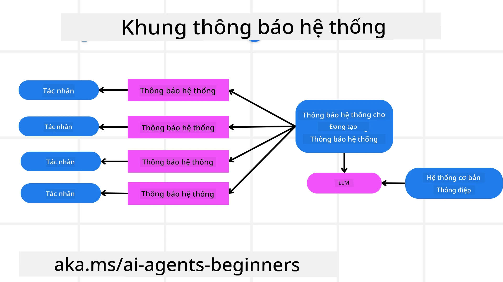
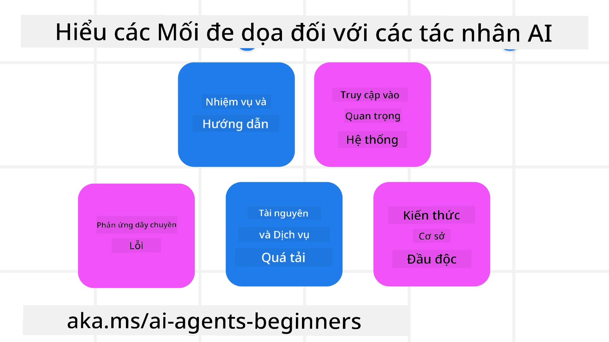
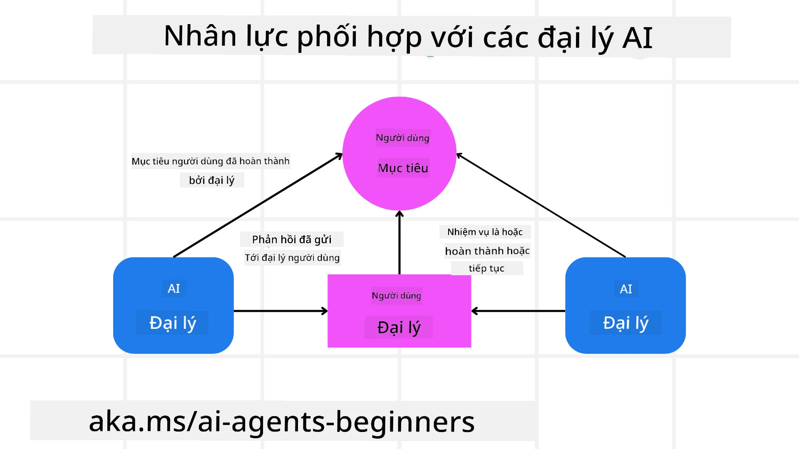

[](https://youtu.be/iZKkMEGBCUQ?si=Q-kEbcyHUMPoHp8L)

> _(Nhấn vào hình ảnh ở trên để xem video bài học này)_

# Xây dựng các Đại lý AI Đáng tin cậy

## Giới thiệu

Bài học này sẽ bao gồm:

- Cách xây dựng và triển khai các Đại lý AI an toàn và hiệu quả
- Các cân nhắc về bảo mật quan trọng khi phát triển Đại lý AI.
- Cách duy trì quyền riêng tư dữ liệu và người dùng khi phát triển các Đại lý AI.

## Mục tiêu học tập

Sau khi hoàn thành bài học này, bạn sẽ biết cách:

- Xác định và giảm thiểu rủi ro khi tạo các Đại lý AI.
- Thực hiện các biện pháp bảo mật để đảm bảo dữ liệu và quyền truy cập được quản lý đúng cách.
- Tạo Đại lý AI duy trì quyền riêng tư dữ liệu và mang lại trải nghiệm người dùng chất lượng.

## An toàn

Trước tiên, hãy cùng xem xét việc xây dựng các ứng dụng đại lý an toàn. An toàn có nghĩa là đại lý AI hoạt động theo thiết kế. Là những người xây dựng ứng dụng đại lý, chúng ta có các phương pháp và công cụ để tối đa hóa sự an toàn:

### Xây dựng Khung Thông điệp Hệ thống

Nếu bạn từng xây dựng ứng dụng AI sử dụng Mô hình Ngôn ngữ Lớn (LLMs), bạn sẽ biết tầm quan trọng của việc thiết kế một nhắc nhở hệ thống hoặc thông điệp hệ thống vững chắc. Những câu nhắc này thiết lập các quy tắc meta, hướng dẫn và quy định về cách LLM tương tác với người dùng và dữ liệu.

Đối với các Đại lý AI, nhắc nhở hệ thống còn quan trọng hơn vì các Đại lý AI sẽ cần những hướng dẫn rất cụ thể để hoàn thành các nhiệm vụ mà chúng ta thiết kế.

Để tạo ra các nhắc nhở hệ thống có thể mở rộng, chúng ta có thể sử dụng một khung thông điệp hệ thống để xây dựng một hoặc nhiều đại lý trong ứng dụng của mình:



#### Bước 1: Tạo Thông điệp Hệ thống Meta

Nhắc nhở meta này sẽ được một LLM sử dụng để tạo các nhắc nhở hệ thống cho các đại lý mà chúng ta tạo. Chúng ta thiết kế nó dưới dạng mẫu để có thể tạo nhiều đại lý một cách hiệu quả nếu cần.

Dưới đây là ví dụ về một thông điệp hệ thống meta chúng ta sẽ cung cấp cho LLM:

```plaintext
You are an expert at creating AI agent assistants. 
You will be provided a company name, role, responsibilities and other
information that you will use to provide a system prompt for.
To create the system prompt, be descriptive as possible and provide a structure that a system using an LLM can better understand the role and responsibilities of the AI assistant. 
```

#### Bước 2: Tạo một nhắc nhở cơ bản

Bước tiếp theo là tạo một nhắc nhở cơ bản để mô tả Đại lý AI. Bạn nên bao gồm vai trò của đại lý, các nhiệm vụ mà đại lý sẽ hoàn thành, và bất kỳ trách nhiệm khác của đại lý.

Dưới đây là một ví dụ:

```plaintext
You are a travel agent for Contoso Travel that is great at booking flights for customers. To help customers you can perform the following tasks: lookup available flights, book flights, ask for preferences in seating and times for flights, cancel any previously booked flights and alert customers on any delays or cancellations of flights.  
```

#### Bước 3: Cung cấp Thông điệp Hệ thống Cơ bản cho LLM

Bây giờ chúng ta có thể tối ưu hóa thông điệp hệ thống này bằng cách cung cấp thông điệp hệ thống meta như một thông điệp hệ thống và thông điệp hệ thống cơ bản của chúng ta.

Điều này sẽ tạo ra một thông điệp hệ thống được thiết kế tốt hơn nhằm hướng dẫn các Đại lý AI của chúng ta:

```markdown
**Company Name:** Contoso Travel  
**Role:** Travel Agent Assistant

**Objective:**  
You are an AI-powered travel agent assistant for Contoso Travel, specializing in booking flights and providing exceptional customer service. Your main goal is to assist customers in finding, booking, and managing their flights, all while ensuring that their preferences and needs are met efficiently.

**Key Responsibilities:**

1. **Flight Lookup:**
    
    - Assist customers in searching for available flights based on their specified destination, dates, and any other relevant preferences.
    - Provide a list of options, including flight times, airlines, layovers, and pricing.
2. **Flight Booking:**
    
    - Facilitate the booking of flights for customers, ensuring that all details are correctly entered into the system.
    - Confirm bookings and provide customers with their itinerary, including confirmation numbers and any other pertinent information.
3. **Customer Preference Inquiry:**
    
    - Actively ask customers for their preferences regarding seating (e.g., aisle, window, extra legroom) and preferred times for flights (e.g., morning, afternoon, evening).
    - Record these preferences for future reference and tailor suggestions accordingly.
4. **Flight Cancellation:**
    
    - Assist customers in canceling previously booked flights if needed, following company policies and procedures.
    - Notify customers of any necessary refunds or additional steps that may be required for cancellations.
5. **Flight Monitoring:**
    
    - Monitor the status of booked flights and alert customers in real-time about any delays, cancellations, or changes to their flight schedule.
    - Provide updates through preferred communication channels (e.g., email, SMS) as needed.

**Tone and Style:**

- Maintain a friendly, professional, and approachable demeanor in all interactions with customers.
- Ensure that all communication is clear, informative, and tailored to the customer's specific needs and inquiries.

**User Interaction Instructions:**

- Respond to customer queries promptly and accurately.
- Use a conversational style while ensuring professionalism.
- Prioritize customer satisfaction by being attentive, empathetic, and proactive in all assistance provided.

**Additional Notes:**

- Stay updated on any changes to airline policies, travel restrictions, and other relevant information that could impact flight bookings and customer experience.
- Use clear and concise language to explain options and processes, avoiding jargon where possible for better customer understanding.

This AI assistant is designed to streamline the flight booking process for customers of Contoso Travel, ensuring that all their travel needs are met efficiently and effectively.

```

#### Bước 4: Lặp lại và Cải thiện

Giá trị của khung thông điệp hệ thống này là khả năng mở rộng việc tạo ra các thông điệp hệ thống từ nhiều đại lý trở nên dễ dàng hơn cũng như cải thiện các thông điệp hệ thống của bạn theo thời gian. Hiếm khi bạn có được một thông điệp hệ thống hoạt động ngay lần đầu cho toàn bộ trường hợp sử dụng của bạn. Có thể thực hiện các điều chỉnh và cải tiến nhỏ bằng cách thay đổi thông điệp hệ thống cơ bản và chạy nó qua hệ thống sẽ cho phép bạn so sánh và đánh giá kết quả.

## Hiểu về Các Mối đe dọa

Để xây dựng các đại lý AI đáng tin cậy, điều quan trọng là phải hiểu và giảm thiểu các rủi ro và mối đe dọa đối với đại lý AI của bạn. Hãy cùng xem một số mối đe dọa khác nhau đối với đại lý AI và cách bạn có thể lên kế hoạch và chuẩn bị tốt hơn cho chúng.



### Nhiệm vụ và Hướng dẫn

**Mô tả:** Kẻ tấn công cố gắng thay đổi hướng dẫn hoặc mục tiêu của đại lý AI thông qua việc nhắc nhở hoặc thao túng đầu vào.

**Giải pháp:** Thực hiện các kiểm tra xác thực và bộ lọc đầu vào để phát hiện các nhắc nhở tiềm ẩn nguy hiểm trước khi chúng được đại lý AI xử lý. Vì những cuộc tấn công này thường yêu cầu tương tác thường xuyên với Đại lý, giới hạn số lượt trò chuyện cũng là một cách để ngăn chặn các kiểu tấn công này.

### Truy cập Các Hệ thống Quan trọng

**Mô tả:** Nếu một đại lý AI có quyền truy cập vào các hệ thống và dịch vụ lưu trữ dữ liệu nhạy cảm, kẻ tấn công có thể xâm nhập vào giao tiếp giữa đại lý và các dịch vụ đó. Đây có thể là các cuộc tấn công trực tiếp hoặc cố gắng gián tiếp để thu thập thông tin về các hệ thống này thông qua đại lý.

**Giải pháp:** Đại lý AI nên truy cập hệ thống chỉ khi cần thiết để ngăn chặn các loại tấn công này. Giao tiếp giữa đại lý và hệ thống cũng phải được bảo mật. Thực hiện xác thực và kiểm soát truy cập là cách khác để bảo vệ thông tin này.

### Quá tải Tài nguyên và Dịch vụ

**Mô tả:** Đại lý AI có thể truy cập các công cụ và dịch vụ khác nhau để hoàn thành nhiệm vụ. Kẻ tấn công có thể sử dụng khả năng này để tấn công các dịch vụ này bằng cách gửi một lượng lớn yêu cầu qua Đại lý AI, có thể dẫn đến sự cố hệ thống hoặc chi phí cao.

**Giải pháp:** Thiết lập các chính sách giới hạn số lượng yêu cầu mà một đại lý AI có thể gửi tới dịch vụ. Giới hạn số lượt trò chuyện và yêu cầu với đại lý AI của bạn cũng là cách để ngăn chặn các kiểu tấn công này.

### Đầu độc Cơ sở Kiến thức

**Mô tả:** Loại tấn công này không nhằm vào đại lý AI trực tiếp mà vào cơ sở kiến thức và các dịch vụ khác mà đại lý AI sẽ sử dụng. Điều này có thể liên quan đến việc làm hỏng dữ liệu hoặc thông tin mà đại lý AI sử dụng để hoàn thành nhiệm vụ, dẫn đến các câu trả lời thiên lệch hoặc không mong muốn với người dùng.

**Giải pháp:** Thực hiện kiểm tra định kỳ dữ liệu mà đại lý AI sẽ sử dụng trong quy trình làm việc của nó. Đảm bảo rằng quyền truy cập vào dữ liệu này được bảo mật và chỉ thay đổi bởi những cá nhân được tin cậy để tránh các loại tấn công này.

### Lỗi Thác Nối

**Mô tả:** Đại lý AI truy cập nhiều công cụ và dịch vụ để hoàn thành nhiệm vụ. Các lỗi do kẻ tấn công gây ra có thể gây ra sự cố cho các hệ thống khác mà đại lý AI kết nối, làm cho cuộc tấn công lan rộng hơn và khó xử lý hơn.

**Giải pháp:** Một cách để tránh điều này là để Đại lý AI hoạt động trong môi trường hạn chế, như thực hiện các nhiệm vụ trong một Docker container, nhằm ngăn chặn các cuộc tấn công trực tiếp vào hệ thống. Tạo cơ chế dự phòng và logic thử lại khi một số hệ thống phản hồi lỗi cũng là cách khác để ngăn sự cố hệ thống lớn hơn.

## Con người trong Vòng lặp

Một cách hiệu quả khác để xây dựng hệ thống Đại lý AI đáng tin cậy là sử dụng Con người trong vòng lặp. Điều này tạo ra một quy trình cho phép người dùng cung cấp phản hồi cho các Đại lý trong quá trình chạy. Người dùng về cơ bản đóng vai trò là các đại lý trong hệ thống đa đại lý và có thể phê duyệt hoặc kết thúc quá trình đang diễn ra.



Dưới đây là một đoạn mã sử dụng Microsoft Agent Framework để minh họa cách khái niệm này được triển khai:

```python
import os
from agent_framework.azure import AzureAIProjectAgentProvider
from azure.identity import AzureCliCredential

# Tạo nhà cung cấp với sự phê duyệt có sự tham gia của con người
provider = AzureAIProjectAgentProvider(
    credential=AzureCliCredential(),
)

# Tạo đại lý với một bước phê duyệt của con người
response = provider.create_response(
    input="Write a 4-line poem about the ocean.",
    instructions="You are a helpful assistant. Ask for user approval before finalizing.",
)

# Người dùng có thể xem xét và phê duyệt phản hồi
print(response.output_text)
user_input = input("Do you approve? (APPROVE/REJECT): ")
if user_input == "APPROVE":
    print("Response approved.")
else:
    print("Response rejected. Revising...")
```

## Kết luận

Xây dựng các đại lý AI đáng tin cậy đòi hỏi thiết kế cẩn thận, các biện pháp bảo mật mạnh mẽ và sự lặp lại liên tục. Bằng cách triển khai các hệ thống nhắc nhở meta có cấu trúc, hiểu các mối đe dọa tiềm ẩn và áp dụng các chiến lược giảm thiểu, các nhà phát triển có thể tạo ra các đại lý AI vừa an toàn vừa hiệu quả. Hơn nữa, kết hợp phương pháp con người trong vòng lặp đảm bảo rằng đại lý AI luôn phù hợp với nhu cầu người dùng đồng thời giảm thiểu rủi ro. Khi AI tiếp tục phát triển, duy trì một thái độ chủ động về bảo mật, quyền riêng tư và các cân nhắc đạo đức sẽ là chìa khóa để xây dựng lòng tin và độ tin cậy trong các hệ thống điều khiển bởi AI.

### Có thêm câu hỏi về Xây dựng Đại lý AI Đáng tin cậy?

Tham gia [Microsoft Foundry Discord](https://aka.ms/ai-agents/discord) để gặp gỡ các học viên khác, tham dự giờ làm việc và nhận giải đáp các câu hỏi về Đại lý AI của bạn.

## Tài nguyên Bổ sung

- <a href="https://learn.microsoft.com/azure/ai-studio/responsible-use-of-ai-overview" target="_blank">Tổng quan AI có trách nhiệm</a>
- <a href="https://learn.microsoft.com/azure/ai-studio/concepts/evaluation-approach-gen-ai" target="_blank">Đánh giá các mô hình AI tạo sinh và ứng dụng AI</a>
- <a href="https://learn.microsoft.com/azure/ai-services/openai/concepts/system-message?context=%2Fazure%2Fai-studio%2Fcontext%2Fcontext&tabs=top-techniques" target="_blank">Thông điệp hệ thống an toàn</a>
- <a href="https://blogs.microsoft.com/wp-content/uploads/prod/sites/5/2022/06/Microsoft-RAI-Impact-Assessment-Template.pdf?culture=en-us&country=us" target="_blank">Mẫu Đánh giá Rủi ro</a>

## Bài học trước

[Agentic RAG](../05-agentic-rag/README.md)

## Bài học tiếp theo

[Planning Design Pattern](../07-planning-design/README.md)

---

<!-- CO-OP TRANSLATOR DISCLAIMER START -->
**Tuyên bố từ chối trách nhiệm**:  
Tài liệu này đã được dịch bằng dịch vụ dịch thuật AI [Co-op Translator](https://github.com/Azure/co-op-translator). Mặc dù chúng tôi nỗ lực để đảm bảo độ chính xác, xin lưu ý rằng bản dịch tự động có thể chứa sai sót hoặc không chính xác. Tài liệu gốc bằng ngôn ngữ gốc của nó nên được coi là nguồn chính xác và có thẩm quyền. Đối với những thông tin quan trọng, khuyến nghị sử dụng dịch vụ dịch thuật chuyên nghiệp bởi con người. Chúng tôi không chịu trách nhiệm về bất kỳ sự hiểu lầm hay giải thích sai nào phát sinh từ việc sử dụng bản dịch này.
<!-- CO-OP TRANSLATOR DISCLAIMER END -->