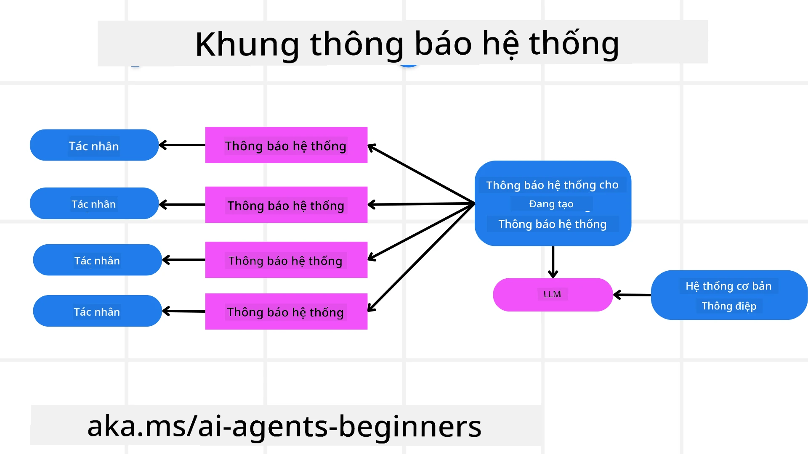
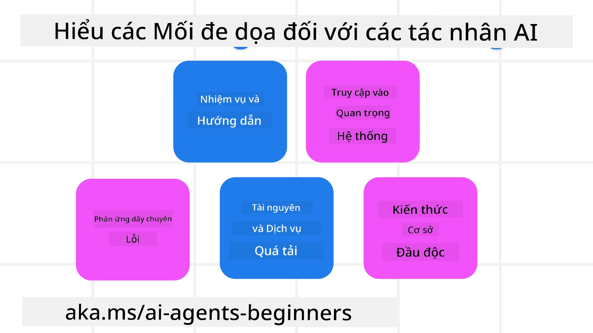
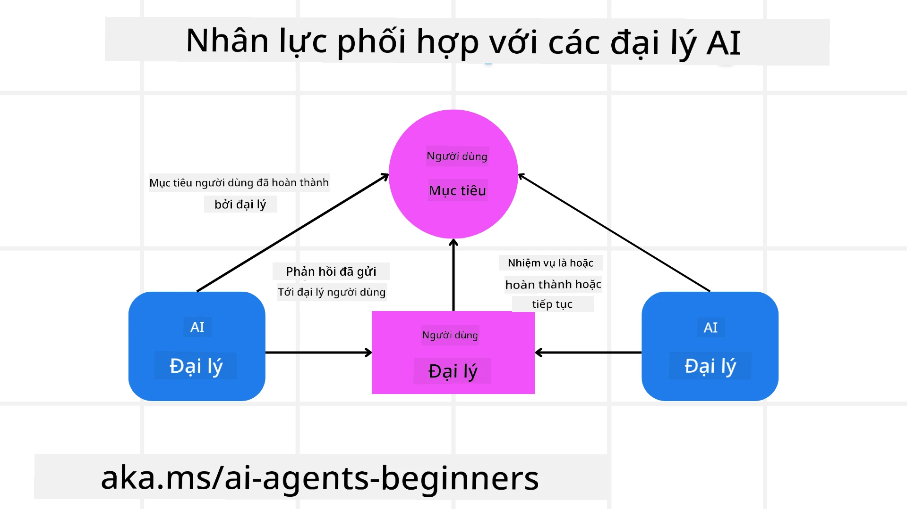

[](https://youtu.be/iZKkMEGBCUQ?si=Q-kEbcyHUMPoHp8L)

> _(Bấm vào hình ảnh trên để xem video bài học này)_

# Xây Dựng Đại Lý AI Đáng Tin Cậy

## Giới Thiệu

Bài học này sẽ bao gồm:

- Cách xây dựng và triển khai các Đại lý AI an toàn và hiệu quả
- Những cân nhắc quan trọng về bảo mật khi phát triển Đại lý AI.
- Cách duy trì bảo mật dữ liệu và quyền riêng tư của người dùng khi phát triển Đại lý AI.

## Mục Tiêu Học Tập

Sau khi hoàn thành bài học này, bạn sẽ biết cách:

- Nhận diện và giảm thiểu rủi ro khi tạo Đại lý AI.
- Thực hiện các biện pháp bảo mật để đảm bảo dữ liệu và quyền truy cập được quản lý đúng cách.
- Tạo ra các Đại lý AI duy trì bảo mật dữ liệu và cung cấp trải nghiệm người dùng chất lượng.

## An Toàn

Trước tiên hãy xem xét việc xây dựng các ứng dụng đại lý an toàn. An toàn có nghĩa là đại lý AI thực hiện đúng như thiết kế. Là người xây dựng các ứng dụng đại lý, chúng ta có các phương pháp và công cụ để tối đa hóa sự an toàn:

### Xây Dựng Khung Tin Nhắn Hệ Thống

Nếu bạn từng xây dựng một ứng dụng AI sử dụng Mô Hình Ngôn Ngữ Lớn (LLM), bạn sẽ hiểu tầm quan trọng của việc thiết kế một lời nhắc hệ thống hoặc tin nhắn hệ thống vững chắc. Những lời nhắc này xác lập các quy tắc meta, hướng dẫn và chỉ dẫn cho cách mà LLM sẽ tương tác với người dùng và dữ liệu.

Đối với Đại lý AI, lời nhắc hệ thống càng quan trọng hơn vì các Đại lý AI cần các chỉ dẫn cụ thể cao để hoàn thành các nhiệm vụ mà chúng ta thiết kế.

Để tạo lời nhắc hệ thống có thể mở rộng, chúng ta có thể sử dụng một khung tin nhắn hệ thống để xây dựng một hoặc nhiều đại lý trong ứng dụng của mình:



#### Bước 1: Tạo Tin Nhắn Hệ Thống Meta

Lời nhắc meta sẽ được sử dụng bởi LLM để tạo ra các lời nhắc hệ thống cho các đại lý mà chúng ta tạo ra. Chúng ta thiết kế nó dưới dạng mẫu để có thể tạo nhiều đại lý một cách hiệu quả nếu cần.

Dưới đây là ví dụ về một tin nhắn hệ thống meta mà chúng ta sẽ gửi cho LLM:

```plaintext
You are an expert at creating AI agent assistants. 
You will be provided a company name, role, responsibilities and other
information that you will use to provide a system prompt for.
To create the system prompt, be descriptive as possible and provide a structure that a system using an LLM can better understand the role and responsibilities of the AI assistant. 
```

#### Bước 2: Tạo lời nhắc cơ bản

Bước tiếp theo là tạo một lời nhắc cơ bản để mô tả Đại lý AI. Bạn nên bao gồm vai trò của đại lý, các nhiệm vụ mà đại lý sẽ hoàn thành, và bất kỳ trách nhiệm nào khác của đại lý.

Dưới đây là một ví dụ:

```plaintext
You are a travel agent for Contoso Travel that is great at booking flights for customers. To help customers you can perform the following tasks: lookup available flights, book flights, ask for preferences in seating and times for flights, cancel any previously booked flights and alert customers on any delays or cancellations of flights.  
```

#### Bước 3: Cung cấp Tin Nhắn Hệ Thống Cơ Bản cho LLM

Bây giờ chúng ta có thể tối ưu hóa tin nhắn hệ thống này bằng cách cung cấp tin nhắn hệ thống meta làm tin nhắn hệ thống và tin nhắn hệ thống cơ bản của chúng ta.

Điều này sẽ tạo ra một tin nhắn hệ thống được thiết kế tốt hơn để hướng dẫn các đại lý AI của chúng ta:

```markdown
**Company Name:** Contoso Travel  
**Role:** Travel Agent Assistant

**Objective:**  
You are an AI-powered travel agent assistant for Contoso Travel, specializing in booking flights and providing exceptional customer service. Your main goal is to assist customers in finding, booking, and managing their flights, all while ensuring that their preferences and needs are met efficiently.

**Key Responsibilities:**

1. **Flight Lookup:**
    
    - Assist customers in searching for available flights based on their specified destination, dates, and any other relevant preferences.
    - Provide a list of options, including flight times, airlines, layovers, and pricing.
2. **Flight Booking:**
    
    - Facilitate the booking of flights for customers, ensuring that all details are correctly entered into the system.
    - Confirm bookings and provide customers with their itinerary, including confirmation numbers and any other pertinent information.
3. **Customer Preference Inquiry:**
    
    - Actively ask customers for their preferences regarding seating (e.g., aisle, window, extra legroom) and preferred times for flights (e.g., morning, afternoon, evening).
    - Record these preferences for future reference and tailor suggestions accordingly.
4. **Flight Cancellation:**
    
    - Assist customers in canceling previously booked flights if needed, following company policies and procedures.
    - Notify customers of any necessary refunds or additional steps that may be required for cancellations.
5. **Flight Monitoring:**
    
    - Monitor the status of booked flights and alert customers in real-time about any delays, cancellations, or changes to their flight schedule.
    - Provide updates through preferred communication channels (e.g., email, SMS) as needed.

**Tone and Style:**

- Maintain a friendly, professional, and approachable demeanor in all interactions with customers.
- Ensure that all communication is clear, informative, and tailored to the customer's specific needs and inquiries.

**User Interaction Instructions:**

- Respond to customer queries promptly and accurately.
- Use a conversational style while ensuring professionalism.
- Prioritize customer satisfaction by being attentive, empathetic, and proactive in all assistance provided.

**Additional Notes:**

- Stay updated on any changes to airline policies, travel restrictions, and other relevant information that could impact flight bookings and customer experience.
- Use clear and concise language to explain options and processes, avoiding jargon where possible for better customer understanding.

This AI assistant is designed to streamline the flight booking process for customers of Contoso Travel, ensuring that all their travel needs are met efficiently and effectively.

```

#### Bước 4: Lặp lại và Cải thiện

Giá trị của khung tin nhắn hệ thống này là giúp dễ dàng mở rộng việc tạo các tin nhắn hệ thống từ nhiều đại lý cũng như cải thiện các tin nhắn hệ thống theo thời gian. Hiếm khi bạn có một tin nhắn hệ thống phù hợp ngay lần đầu cho toàn bộ trường hợp sử dụng của mình. Khả năng điều chỉnh nhỏ và cải tiến bằng cách thay đổi tin nhắn hệ thống cơ bản và chạy nó qua hệ thống sẽ cho phép bạn so sánh và đánh giá kết quả.

## Hiểu Biết Về Các Mối Đe Dọa

Để xây dựng các đại lý AI đáng tin cậy, điều quan trọng là hiểu và giảm thiểu các rủi ro và mối đe dọa đối với đại lý AI của bạn. Hãy cùng xem một số mối đe dọa khác nhau đối với đại lý AI và cách bạn có thể lập kế hoạch và chuẩn bị tốt hơn cho chúng.



### Nhiệm Vụ và Hướng Dẫn

**Mô tả:** Kẻ tấn công cố gắng thay đổi các hướng dẫn hoặc mục tiêu của đại lý AI thông qua việc gợi ý hoặc thao túng đầu vào.

**Biện pháp giảm thiểu**: Thực hiện các kiểm tra xác thực và bộ lọc đầu vào để phát hiện những lời nhắc có thể gây nguy hiểm trước khi chúng được đại lý AI xử lý. Vì các cuộc tấn công này thường yêu cầu tương tác liên tục với Đại lý, giới hạn số lượt trong một cuộc trò chuyện cũng là một cách để ngăn chặn các loại tấn công này.

### Truy Cập Hệ Thống Quan Trọng

**Mô tả:** Nếu đại lý AI có quyền truy cập vào các hệ thống và dịch vụ lưu trữ dữ liệu nhạy cảm, kẻ tấn công có thể xâm phạm giao tiếp giữa đại lý và các dịch vụ này. Đây có thể là tấn công trực tiếp hoặc cố gắng gián tiếp lấy thông tin về các hệ thống này thông qua đại lý.

**Biện pháp giảm thiểu:** Đại lý AI chỉ nên được cấp quyền truy cập hệ thống khi thật sự cần thiết để ngăn chặn các loại tấn công này. Giao tiếp giữa đại lý và hệ thống cũng cần được bảo mật. Triển khai xác thực và kiểm soát truy cập là cách khác để bảo vệ thông tin này.

### Quá Tải Tài Nguyên và Dịch Vụ

**Mô tả:** Đại lý AI có thể truy cập các công cụ và dịch vụ khác nhau để hoàn thành các nhiệm vụ. Kẻ tấn công có thể sử dụng khả năng này để gửi một lượng lớn yêu cầu qua Đại lý AI, dẫn đến việc hệ thống bị lỗi hoặc chi phí tăng cao.

**Biện pháp giảm thiểu:** Thực hiện các chính sách giới hạn số lượng yêu cầu mà đại lý AI có thể gửi tới một dịch vụ. Giới hạn số lượt trò chuyện và số yêu cầu đến đại lý AI cũng là một cách khác để ngăn chặn các loại tấn công này.

### Đầu Độc Cơ Sở Kiến Thức

**Mô tả:** Loại tấn công này không nhắm vào trực tiếp đại lý AI mà nhắm vào cơ sở kiến thức và các dịch vụ khác mà đại lý sử dụng. Điều này có thể liên quan đến việc làm hỏng dữ liệu hoặc thông tin mà đại lý AI sẽ sử dụng để hoàn thành nhiệm vụ, dẫn đến các phản hồi sai lệch hoặc không mong muốn với người dùng.

**Biện pháp giảm thiểu:** Thường xuyên kiểm tra xác minh dữ liệu mà đại lý AI sẽ sử dụng trong quy trình làm việc. Đảm bảo rằng quyền truy cập vào dữ liệu này được bảo mật và chỉ được thay đổi bởi những người đáng tin cậy để tránh các loại tấn công này.

### Lỗi Lan Tràn

**Mô tả:** Đại lý AI truy cập các công cụ và dịch vụ khác nhau để hoàn thành nhiệm vụ. Lỗi do kẻ tấn công gây ra có thể dẫn đến sự cố của các hệ thống khác mà đại lý kết nối, khiến cuộc tấn công lan rộng và khó khắc phục hơn.

**Biện pháp giảm thiểu:** Một phương pháp để tránh điều này là cho đại lý AI hoạt động trong môi trường giới hạn, ví dụ như thực thi các nhiệm vụ trong container Docker, để ngăn chặn các cuộc tấn công trực tiếp vào hệ thống. Tạo cơ chế dự phòng và logic thử lại khi một số hệ thống phản hồi lỗi cũng là cách khác để ngăn ngừa sự cố hệ thống lớn hơn.

## Người Điều Khiển Trung Gian

Một cách hiệu quả khác để xây dựng hệ thống đại lý AI đáng tin cậy là sử dụng Người Điều Khiển Trung Gian (Human-in-the-loop). Điều này tạo ra một luồng trong đó người dùng có thể cung cấp phản hồi cho các đại lý trong quá trình chạy. Người dùng về cơ bản đóng vai trò như các đại lý trong hệ thống đa đại lý và bằng cách cung cấp sự chấp thuận hoặc kết thúc quá trình đang chạy.



Dưới đây là đoạn mã sử dụng Microsoft Agent Framework để minh họa cách khái niệm này được triển khai:

```python
import os
from agent_framework.foundry import FoundryChatClient
from azure.identity import AzureCliCredential

# Tạo nhà cung cấp với sự phê duyệt có người kiểm duyệt
provider = FoundryChatClient(
    project_endpoint=os.environ["AZURE_AI_PROJECT_ENDPOINT"],
    model=os.environ["AZURE_AI_MODEL_DEPLOYMENT_NAME"],
    credential=AzureCliCredential(),
)

# Tạo tác nhân với bước phê duyệt của con người
response = provider.create_response(
    input="Write a 4-line poem about the ocean.",
    instructions="You are a helpful assistant. Ask for user approval before finalizing.",
)

# Người dùng có thể xem lại và phê duyệt phản hồi
print(response.output_text)
user_input = input("Do you approve? (APPROVE/REJECT): ")
if user_input == "APPROVE":
    print("Response approved.")
else:
    print("Response rejected. Revising...")
```

## Kết Luận

Xây dựng các đại lý AI đáng tin cậy yêu cầu thiết kế cẩn thận, các biện pháp bảo mật chắc chắn và sự lặp lại liên tục. Bằng cách triển khai các hệ thống meta prompting có cấu trúc, hiểu các mối đe dọa tiềm tàng và áp dụng các chiến lược giảm thiểu, các nhà phát triển có thể tạo ra các đại lý AI vừa an toàn vừa hiệu quả. Thêm vào đó, kết hợp phương pháp người điều khiển trung gian đảm bảo các đại lý AI luôn phù hợp với nhu cầu người dùng đồng thời giảm thiểu rủi ro. Khi AI tiếp tục phát triển, duy trì một lập trường chủ động về bảo mật, quyền riêng tư và các cân nhắc đạo đức sẽ là chìa khóa để xây dựng sự tin tưởng và độ tin cậy trong các hệ thống dựa trên AI.

## Mẫu Mã

- [`code_samples/06-system-message-framework.ipynb`](code_samples/06-system-message-framework.ipynb): Minh họa từng bước khung hệ thống meta-prompting.
- [`code_samples/06-human-in-the-loop.ipynb`](code_samples/06-human-in-the-loop.ipynb): Các cổng phê duyệt trước hành động, phân tầng rủi ro và ghi nhật ký kiểm toán cho các đại lý đáng tin cậy.

### Còn Thắc Mắc Gì về Việc Xây Dựng Đại Lý AI Đáng Tin Cậy?

Tham gia [Microsoft Foundry Discord](https://discord.com/invite/ATgtXmAS5D) để gặp gỡ những người học khác, tham dự giờ làm việc và nhận giải đáp các câu hỏi về Đại lý AI của bạn.

## Tài Nguyên Bổ Sung

- <a href="https://learn.microsoft.com/azure/ai-studio/responsible-use-of-ai-overview" target="_blank">Tổng quan về AI có trách nhiệm</a>
- <a href="https://learn.microsoft.com/azure/ai-studio/concepts/evaluation-approach-gen-ai" target="_blank">Đánh giá các mô hình AI sinh tạo và ứng dụng AI</a>
- <a href="https://learn.microsoft.com/azure/ai-services/openai/concepts/system-message?context=%2Fazure%2Fai-studio%2Fcontext%2Fcontext&tabs=top-techniques" target="_blank">Tin nhắn hệ thống an toàn</a>
- <a href="https://blogs.microsoft.com/wp-content/uploads/prod/sites/5/2022/06/Microsoft-RAI-Impact-Assessment-Template.pdf?culture=en-us&country=us" target="_blank">Mẫu Đánh giá Rủi ro</a>

## Bài Học Trước

[Agentic RAG](../05-agentic-rag/README.md)

## Bài Học Tiếp Theo

[Mẫu Thiết Kế Lập Kế Hoạch](../07-planning-design/README.md)

---

<!-- CO-OP TRANSLATOR DISCLAIMER START -->
**Tuyên bố miễn trừ trách nhiệm**:
Tài liệu này đã được dịch bằng dịch vụ dịch thuật AI [Co-op Translator](https://github.com/Azure/co-op-translator). Mặc dù chúng tôi cố gắng đảm bảo độ chính xác, xin lưu ý rằng bản dịch tự động có thể chứa lỗi hoặc sai sót. Tài liệu gốc bằng ngôn ngữ gốc nên được coi là nguồn tin chính thức. Đối với thông tin quan trọng, nên sử dụng dịch vụ dịch thuật chuyên nghiệp bởi con người. Chúng tôi không chịu trách nhiệm về bất kỳ hiểu lầm hoặc giải thích sai nào phát sinh từ việc sử dụng bản dịch này.
<!-- CO-OP TRANSLATOR DISCLAIMER END -->