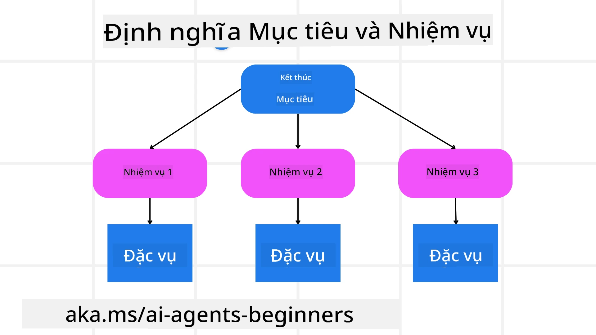

[](https://youtu.be/kPfJ2BrBCMY?si=9pYpPXp0sSbK91Dr)

> _(Nhấp vào hình ảnh ở trên để xem video bài học này)_

# Lập Kế Hoạch Thiết Kế

## Giới Thiệu

Bài học này sẽ bao gồm

* Định nghĩa một mục tiêu tổng thể rõ ràng và chia nhỏ một nhiệm vụ phức tạp thành các nhiệm vụ có thể quản lý được.
* Tận dụng đầu ra có cấu trúc để tạo ra các phản hồi đáng tin cậy và dễ đọc bởi máy hơn.
* Áp dụng cách tiếp cận dựa trên sự kiện để xử lý các nhiệm vụ động và các đầu vào không mong đợi.

## Mục Tiêu Học Tập

Sau khi hoàn thành bài học này, bạn sẽ hiểu về:

* Xác định và thiết lập mục tiêu tổng thể cho một tác nhân AI, đảm bảo nó biết rõ cần đạt được điều gì.
* Phân rã một nhiệm vụ phức tạp thành các nhiệm vụ con quản lý được và tổ chức chúng theo một trình tự logic.
* Trang bị cho các tác nhân những công cụ phù hợp (ví dụ như công cụ tìm kiếm hoặc công cụ phân tích dữ liệu), quyết định khi nào và cách thức sử dụng chúng, đồng thời xử lý các tình huống không mong muốn phát sinh.
* Đánh giá kết quả các nhiệm vụ con, đo lường hiệu suất, và lặp lại các hành động để cải thiện kết quả cuối cùng.

## Định Nghĩa Mục Tiêu Tổng Thể và Chia Nhỏ Nhiệm Vụ



Phần lớn các nhiệm vụ thực tế quá phức tạp để giải quyết trong một bước duy nhất. Một tác nhân AI cần một mục tiêu ngắn gọn để hướng dẫn việc lập kế hoạch và hành động của nó. Ví dụ, hãy xem xét mục tiêu:

    "Tạo một lịch trình du lịch 3 ngày."

Mặc dù đơn giản để phát biểu, mục tiêu này vẫn cần được tinh chỉnh. Mục tiêu càng rõ ràng thì tác nhân (và bất kỳ cộng tác viên con người nào) càng tập trung tốt hơn vào việc đạt được kết quả phù hợp, chẳng hạn như tạo một lịch trình toàn diện bao gồm các lựa chọn chuyến bay, đề xuất khách sạn và gợi ý hoạt động.

### Phân Rã Nhiệm Vụ

Các nhiệm vụ lớn hoặc phức tạp trở nên dễ quản lý hơn khi được chia nhỏ thành các nhiệm vụ con có mục tiêu rõ ràng.
Ví dụ với lịch trình du lịch, bạn có thể phân rã mục tiêu thành:

* Đặt Chuyến Bay
* Đặt Khách Sạn
* Thuê Xe
* Cá Nhân Hóa

Mỗi nhiệm vụ con sau đó có thể do các tác nhân hoặc quy trình chuyên biệt xử lý. Một tác nhân có thể chuyên về tìm kiếm các ưu đãi chuyến bay tốt nhất, một tác nhân khác tập trung vào việc đặt khách sạn, v.v. Một tác nhân phối hợp hoặc "hậu tuyến" có thể tổng hợp các kết quả này thành một lịch trình thống nhất cho người dùng cuối.

Cách tiếp cận mô-đun này cũng cho phép nâng cấp dần dần. Ví dụ, bạn có thể thêm các tác nhân chuyên biệt cho Gợi Ý Đồ Ăn hoặc Hoạt Động Địa Phương và tinh chỉnh lịch trình theo thời gian.

### Đầu ra có cấu trúc

Các Mô Hình Ngôn Ngữ Lớn (LLMs) có thể tạo đầu ra có cấu trúc (ví dụ JSON) để các tác nhân hoặc dịch vụ phía sau dễ dàng phân tích và xử lý. Điều này đặc biệt hữu ích trong bối cảnh đa tác nhân, nơi chúng ta có thể thực hiện các nhiệm vụ này sau khi nhận được kết quả lập kế hoạch.

Đoạn mã Python dưới đây minh họa một tác nhân lập kế hoạch đơn giản phân rã mục tiêu thành các nhiệm vụ con và tạo ra kế hoạch có cấu trúc:

```python
from pydantic import BaseModel
from enum import Enum
from typing import List, Optional, Union
import json
import os
from typing import Optional
from pprint import pprint
from agent_framework.azure import AzureAIProjectAgentProvider
from azure.identity import AzureCliCredential

class AgentEnum(str, Enum):
    FlightBooking = "flight_booking"
    HotelBooking = "hotel_booking"
    CarRental = "car_rental"
    ActivitiesBooking = "activities_booking"
    DestinationInfo = "destination_info"
    DefaultAgent = "default_agent"
    GroupChatManager = "group_chat_manager"

# Mô hình Nhiệm vụ Phụ Du lịch
class TravelSubTask(BaseModel):
    task_details: str
    assigned_agent: AgentEnum  # chúng tôi muốn giao nhiệm vụ cho đại lý

class TravelPlan(BaseModel):
    main_task: str
    subtasks: List[TravelSubTask]
    is_greeting: bool

provider = AzureAIProjectAgentProvider(credential=AzureCliCredential())

# Định nghĩa tin nhắn người dùng
system_prompt = """You are a planner agent.
    Your job is to decide which agents to run based on the user's request.
    Provide your response in JSON format with the following structure:
{'main_task': 'Plan a family trip from Singapore to Melbourne.',
 'subtasks': [{'assigned_agent': 'flight_booking',
               'task_details': 'Book round-trip flights from Singapore to '
                               'Melbourne.'}
    Below are the available agents specialised in different tasks:
    - FlightBooking: For booking flights and providing flight information
    - HotelBooking: For booking hotels and providing hotel information
    - CarRental: For booking cars and providing car rental information
    - ActivitiesBooking: For booking activities and providing activity information
    - DestinationInfo: For providing information about destinations
    - DefaultAgent: For handling general requests"""

user_message = "Create a travel plan for a family of 2 kids from Singapore to Melbourne"

response = client.create_response(input=user_message, instructions=system_prompt)

response_content = response.output_text
pprint(json.loads(response_content))
```

### Tác nhân Lập kế hoạch với Điều phối Đa tác nhân

Trong ví dụ này, một Semantic Router Agent nhận yêu cầu từ người dùng (ví dụ: "Tôi cần kế hoạch khách sạn cho chuyến đi của mình.").

Tác nhân lập kế hoạch sau đó:

* Nhận Kế hoạch Khách sạn: Tác nhân lập kế hoạch lấy thông điệp người dùng và, dựa trên lời nhắc hệ thống (bao gồm chi tiết các tác nhân có sẵn), tạo ra một kế hoạch du lịch có cấu trúc.
* Liệt kê Các Tác nhân và Công cụ của Họ: Đăng ký tác nhân giữ danh sách các tác nhân (ví dụ như cho chuyến bay, khách sạn, thuê xe và các hoạt động) cùng các chức năng hoặc công cụ mà họ cung cấp.
* Định tuyến Kế hoạch đến các Tác nhân Tương ứng: Tùy theo số lượng nhiệm vụ con, tác nhân lập kế hoạch hoặc gửi thông điệp trực tiếp đến tác nhân chuyên trách (kịch bản một nhiệm vụ) hoặc điều phối thông qua quản lý trò chuyện nhóm để phối hợp đa tác nhân.
* Tóm tắt Kết quả: Cuối cùng, tác nhân lập kế hoạch tóm tắt kế hoạch đã tạo ra để rõ ràng.
Đoạn mã Python dưới đây minh họa các bước này:

```python

from pydantic import BaseModel

from enum import Enum
from typing import List, Optional, Union

class AgentEnum(str, Enum):
    FlightBooking = "flight_booking"
    HotelBooking = "hotel_booking"
    CarRental = "car_rental"
    ActivitiesBooking = "activities_booking"
    DestinationInfo = "destination_info"
    DefaultAgent = "default_agent"
    GroupChatManager = "group_chat_manager"

# Mô hình Công việc phụ về Du lịch

class TravelSubTask(BaseModel):
    task_details: str
    assigned_agent: AgentEnum # chúng ta muốn giao nhiệm vụ cho đại lý

class TravelPlan(BaseModel):
    main_task: str
    subtasks: List[TravelSubTask]
    is_greeting: bool
import json
import os
from typing import Optional

from agent_framework.azure import AzureAIProjectAgentProvider
from azure.identity import AzureCliCredential

# Tạo khách hàng

provider = AzureAIProjectAgentProvider(credential=AzureCliCredential())

from pprint import pprint

# Định nghĩa tin nhắn người dùng

system_prompt = """You are a planner agent.
    Your job is to decide which agents to run based on the user's request.
    Below are the available agents specialized in different tasks:
    - FlightBooking: For booking flights and providing flight information
    - HotelBooking: For booking hotels and providing hotel information
    - CarRental: For booking cars and providing car rental information
    - ActivitiesBooking: For booking activities and providing activity information
    - DestinationInfo: For providing information about destinations
    - DefaultAgent: For handling general requests"""

user_message = "Create a travel plan for a family of 2 kids from Singapore to Melbourne"

response = client.create_response(input=user_message, instructions=system_prompt)

response_content = response.output_text

# In nội dung phản hồi sau khi tải nó dưới dạng JSON

pprint(json.loads(response_content))
```

Phần tiếp theo là đầu ra từ đoạn mã trước và bạn có thể dùng đầu ra có cấu trúc này để định tuyến đến `assigned_agent` và tóm tắt kế hoạch du lịch cho người dùng cuối.

```json
{
    "is_greeting": "False",
    "main_task": "Plan a family trip from Singapore to Melbourne.",
    "subtasks": [
        {
            "assigned_agent": "flight_booking",
            "task_details": "Book round-trip flights from Singapore to Melbourne."
        },
        {
            "assigned_agent": "hotel_booking",
            "task_details": "Find family-friendly hotels in Melbourne."
        },
        {
            "assigned_agent": "car_rental",
            "task_details": "Arrange a car rental suitable for a family of four in Melbourne."
        },
        {
            "assigned_agent": "activities_booking",
            "task_details": "List family-friendly activities in Melbourne."
        },
        {
            "assigned_agent": "destination_info",
            "task_details": "Provide information about Melbourne as a travel destination."
        }
    ]
}
```

Một notebook ví dụ với đoạn mã trên có sẵn [ở đây](07-python-agent-framework.ipynb).

### Lập Kế Hoạch Lặp Đi Lặp Lại

Một số nhiệm vụ đòi hỏi sự trao đổi qua lại hoặc lập kế hoạch lại, nơi kết quả của nhiệm vụ con này ảnh hưởng tới nhiệm vụ kế tiếp. Ví dụ, nếu tác nhân phát hiện một định dạng dữ liệu không mong muốn khi đặt chuyến bay, nó có thể cần điều chỉnh chiến lược trước khi chuyển sang đặt khách sạn.

Thêm vào đó, phản hồi từ người dùng (ví dụ như người dùng quyết định họ thích chuyến bay sớm hơn) có thể kích hoạt việc lập kế hoạch lại một phần. Cách tiếp cận động, lặp đi lặp lại này đảm bảo giải pháp cuối cùng phù hợp với các giới hạn thực tế và sở thích người dùng thay đổi theo thời gian.

vd: mã ví dụ

```python
from agent_framework.azure import AzureAIProjectAgentProvider
from azure.identity import AzureCliCredential
#.. giống như mã trước và chuyển tiếp lịch sử người dùng, kế hoạch hiện tại

system_prompt = """You are a planner agent to optimize the
    Your job is to decide which agents to run based on the user's request.
    Below are the available agents specialized in different tasks:
    - FlightBooking: For booking flights and providing flight information
    - HotelBooking: For booking hotels and providing hotel information
    - CarRental: For booking cars and providing car rental information
    - ActivitiesBooking: For booking activities and providing activity information
    - DestinationInfo: For providing information about destinations
    - DefaultAgent: For handling general requests"""

user_message = "Create a travel plan for a family of 2 kids from Singapore to Melbourne"

response = client.create_response(
    input=user_message,
    instructions=system_prompt,
    context=f"Previous travel plan - {TravelPlan}",
)
# .. lập lại kế hoạch và gửi các nhiệm vụ cho các đại lý tương ứng
```

Để lập kế hoạch toàn diện hơn, hãy xem bài <a href="https://www.microsoft.com/research/articles/magentic-one-a-generalist-multi-agent-system-for-solving-complex-tasks" target="_blank">Blogpost Magnetic One</a> về giải quyết các nhiệm vụ phức tạp.

## Tóm Tắt

Trong bài viết này, chúng ta đã xem qua ví dụ về cách tạo ra một tác nhân lập kế hoạch có thể linh hoạt chọn các tác nhân có sẵn được định nghĩa. Đầu ra của tác nhân Lập kế hoạch phân rã các nhiệm vụ và chỉ định các tác nhân để thực thi. Giả định rằng các tác nhân có quyền truy cập các chức năng/công cụ cần thiết để thực hiện nhiệm vụ. Bên cạnh các tác nhân, bạn có thể bao gồm các mẫu khác như phản chiếu, tóm tắt, và chat theo vòng tròn để tùy chỉnh thêm.

## Tài Nguyên Bổ Sung

Magentic One - Hệ thống đa tác nhân tổng quát để giải quyết các nhiệm vụ phức tạp và đạt được kết quả ấn tượng trên nhiều chuẩn thử thách đa tác nhân. Tham khảo: <a href="https://www.microsoft.com/research/articles/magentic-one-a-generalist-multi-agent-system-for-solving-complex-tasks" target="_blank">Magentic One</a>. Trong triển khai này, orchestrator tạo kế hoạch nhiệm vụ cụ thể và phân công các tác vụ này cho các tác nhân có sẵn. Bên cạnh việc lập kế hoạch, orchestrator còn sử dụng cơ chế theo dõi tiến độ nhiệm vụ và lập kế hoạch lại khi cần.

### Còn Thắc Mắc Gì Về Mẫu Thiết Kế Lập Kế Hoạch?

Tham gia [Microsoft Foundry Discord](https://aka.ms/ai-agents/discord) để gặp gỡ các học viên khác, tham dự giờ hỗ trợ và được giải đáp thắc mắc về tác nhân AI.

## Bài Học Trước

[Xây Dựng Tác Nhân AI Đáng Tin Cậy](../06-building-trustworthy-agents/README.md)

## Bài Học Tiếp Theo

[Mẫu Thiết Kế Đa Tác Nhân](../08-multi-agent/README.md)

---

<!-- CO-OP TRANSLATOR DISCLAIMER START -->
**Tuyên bố từ chối trách nhiệm**:
Tài liệu này đã được dịch bằng dịch vụ dịch thuật AI [Co-op Translator](https://github.com/Azure/co-op-translator). Mặc dù chúng tôi cố gắng đảm bảo độ chính xác, xin lưu ý rằng bản dịch tự động có thể chứa lỗi hoặc không chính xác. Tài liệu gốc bằng ngôn ngữ nguyên bản được xem là nguồn chính thức và có thẩm quyền. Đối với thông tin quan trọng, nên sử dụng bản dịch do con người chuyên nghiệp thực hiện. Chúng tôi không chịu trách nhiệm đối với bất kỳ sự hiểu lầm hay giải thích sai lệch nào phát sinh từ việc sử dụng bản dịch này.
<!-- CO-OP TRANSLATOR DISCLAIMER END -->