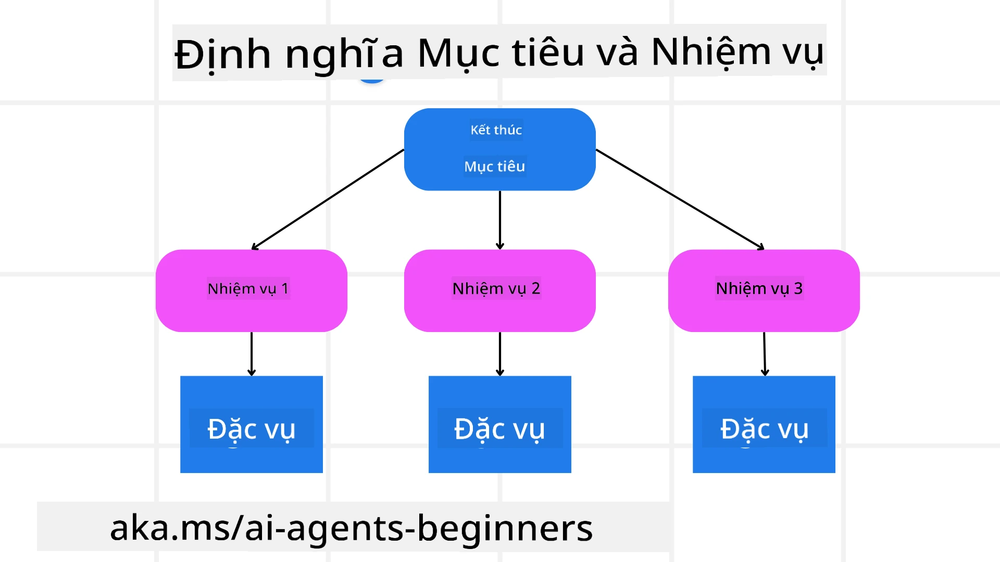

[](https://youtu.be/kPfJ2BrBCMY?si=9pYpPXp0sSbK91Dr)

> _(Nhấp vào hình ảnh bên trên để xem video của bài học này)_

# Lập Kế Hoạch Thiết Kế

## Giới thiệu

Bài học này sẽ bao gồm

* Xác định mục tiêu tổng thể rõ ràng và chia nhỏ một nhiệm vụ phức tạp thành các nhiệm vụ nhỏ dễ quản lý.
* Tận dụng đầu ra có cấu trúc để có các phản hồi đáng tin cậy hơn và có thể đọc được bằng máy.
* Áp dụng phương pháp hướng sự kiện để xử lý các nhiệm vụ động và các đầu vào không mong đợi.

## Mục Tiêu Học Tập

Sau khi hoàn thành bài học này, bạn sẽ hiểu về:

* Xác định và đặt ra mục tiêu tổng thể cho đại lý AI, đảm bảo nó biết rõ những gì cần đạt được.
* Phân tách một nhiệm vụ phức tạp thành các nhiệm vụ nhỏ dễ quản lý và tổ chức chúng thành một trình tự logic.
* Trang bị cho đại lý các công cụ phù hợp (ví dụ: công cụ tìm kiếm hoặc công cụ phân tích dữ liệu), quyết định khi nào và cách sử dụng chúng, đồng thời xử lý các tình huống không mong đợi phát sinh.
* Đánh giá kết quả các nhiệm vụ phụ, đo lường hiệu suất và lặp lại các hành động để cải thiện kết quả cuối cùng.

## Xác Định Mục Tiêu Tổng Thể và Chia Nhỏ Nhiệm Vụ



Hầu hết các nhiệm vụ thực tế quá phức tạp để xử lý trong một bước duy nhất. Một đại lý AI cần một mục tiêu ngắn gọn để hướng dẫn kế hoạch và hành động của nó. Ví dụ, hãy xem mục tiêu:

    "Tạo lịch trình du lịch trong 3 ngày."

Mặc dù đơn giản để phát biểu, mục tiêu này vẫn cần được làm rõ hơn. Mục tiêu càng rõ ràng, đại lý (và bất kỳ cộng tác viên con người nào) càng có thể tập trung để đạt được kết quả đúng, ví dụ như tạo một lịch trình toàn diện với các lựa chọn chuyến bay, đề xuất khách sạn và gợi ý hoạt động.

### Phân Tách Nhiệm Vụ

Các nhiệm vụ lớn hoặc phức tạp trở nên dễ quản lý hơn khi được tách thành các nhiệm vụ nhỏ hơn, tập trung vào mục tiêu cụ thể.
Ví dụ lịch trình du lịch, bạn có thể phân tách mục tiêu thành:

* Đặt vé máy bay
* Đặt khách sạn
* Thuê xe
* Cá nhân hóa

Mỗi nhiệm vụ phụ sau đó có thể được xử lý bởi các đại lý hoặc quy trình chuyên biệt. Một đại lý có thể chuyên về tìm kiếm các chuyến bay tốt nhất, một đại lý khác tập trung vào đặt khách sạn, và tương tự. Một đại lý điều phối hoặc "hạ nguồn" có thể tổng hợp các kết quả này thành một lịch trình hoàn chỉnh cho người dùng cuối.

Phương pháp mô-đun này cũng cho phép cải tiến dần dần. Chẳng hạn, bạn có thể thêm các đại lý chuyên về Đề Xuất Ẩm Thực hoặc Gợi Ý Hoạt Động Địa Phương và tinh chỉnh lịch trình theo thời gian.

### Đầu Ra Có Cấu Trúc

Các Mô Hình Ngôn Ngữ Lớn (LLMs) có thể tạo ra đầu ra có cấu trúc (ví dụ: JSON) giúp các đại lý hoặc dịch vụ hạ nguồn dễ dàng phân tích và xử lý. Điều này đặc biệt hữu ích trong bối cảnh đa đại lý, nơi chúng ta có thể thực hiện các nhiệm vụ sau khi nhận được đầu ra kế hoạch.

Đoạn mã Python dưới đây minh họa một đại lý lập kế hoạch đơn giản phân tách mục tiêu thành các nhiệm vụ phụ và tạo ra một kế hoạch có cấu trúc:

```python
from pydantic import BaseModel
from enum import Enum
from typing import List, Optional, Union
import json
import os
from typing import Optional
from pprint import pprint
from agent_framework.foundry import FoundryChatClient
from azure.identity import AzureCliCredential

class AgentEnum(str, Enum):
    FlightBooking = "flight_booking"
    HotelBooking = "hotel_booking"
    CarRental = "car_rental"
    ActivitiesBooking = "activities_booking"
    DestinationInfo = "destination_info"
    DefaultAgent = "default_agent"
    GroupChatManager = "group_chat_manager"

# Mô hình Công việc Phụ Du lịch
class TravelSubTask(BaseModel):
    task_details: str
    assigned_agent: AgentEnum  # chúng ta muốn giao nhiệm vụ cho đại lý

class TravelPlan(BaseModel):
    main_task: str
    subtasks: List[TravelSubTask]
    is_greeting: bool

provider = FoundryChatClient(
    project_endpoint=os.environ["AZURE_AI_PROJECT_ENDPOINT"],
    model=os.environ["AZURE_AI_MODEL_DEPLOYMENT_NAME"],
    credential=AzureCliCredential(),
)

# Định nghĩa tin nhắn người dùng
system_prompt = """You are a planner agent.
    Your job is to decide which agents to run based on the user's request.
    Provide your response in JSON format with the following structure:
{'main_task': 'Plan a family trip from Singapore to Melbourne.',
 'subtasks': [{'assigned_agent': 'flight_booking',
               'task_details': 'Book round-trip flights from Singapore to '
                               'Melbourne.'}
    Below are the available agents specialised in different tasks:
    - FlightBooking: For booking flights and providing flight information
    - HotelBooking: For booking hotels and providing hotel information
    - CarRental: For booking cars and providing car rental information
    - ActivitiesBooking: For booking activities and providing activity information
    - DestinationInfo: For providing information about destinations
    - DefaultAgent: For handling general requests"""

user_message = "Create a travel plan for a family of 2 kids from Singapore to Melbourne"

response = client.create_response(input=user_message, instructions=system_prompt)

response_content = response.output_text
pprint(json.loads(response_content))
```

### Đại Lý Lập Kế Hoạch với Điều Phối Đa Đại Lý

Trong ví dụ này, một Đại Lý Bộ Định Tuyến Ngữ Nghĩa (Semantic Router Agent) nhận yêu cầu từ người dùng (ví dụ: "Tôi cần kế hoạch khách sạn cho chuyến đi của tôi.").

Đại lý lập kế hoạch sẽ:

* Nhận Kế Hoạch Khách Sạn: Đại lý lập kế hoạch lấy tin nhắn của người dùng và, dựa trên lời nhắc hệ thống (bao gồm thông tin các đại lý có sẵn), tạo ra một kế hoạch du lịch có cấu trúc.
* Liệt Kê Các Đại Lý và Công Cụ Của Họ: Danh bạ đại lý lưu danh sách các đại lý (ví dụ: cho chuyến bay, khách sạn, thuê xe và hoạt động) cùng với các chức năng hoặc công cụ họ cung cấp.
* Chuyển Kế Hoạch cho Các Đại Lý Tương Ứng: Tùy thuộc vào số lượng nhiệm vụ phụ, đại lý lập kế hoạch sẽ gửi tin nhắn trực tiếp cho đại lý chuyên biệt (trong các trường hợp nhiệm vụ đơn) hoặc điều phối qua quản lý trò chuyện nhóm cho sự hợp tác đa đại lý.
* Tóm Tắt Kết Quả: Cuối cùng, đại lý lập kế hoạch tóm tắt kế hoạch được tạo ra để rõ ràng hơn.
Đoạn mã Python dưới đây minh họa các bước này:

```python

from pydantic import BaseModel

from enum import Enum
from typing import List, Optional, Union

class AgentEnum(str, Enum):
    FlightBooking = "flight_booking"
    HotelBooking = "hotel_booking"
    CarRental = "car_rental"
    ActivitiesBooking = "activities_booking"
    DestinationInfo = "destination_info"
    DefaultAgent = "default_agent"
    GroupChatManager = "group_chat_manager"

# Mô hình Công việc phụ Du lịch

class TravelSubTask(BaseModel):
    task_details: str
    assigned_agent: AgentEnum # chúng tôi muốn giao nhiệm vụ cho đại lý

class TravelPlan(BaseModel):
    main_task: str
    subtasks: List[TravelSubTask]
    is_greeting: bool
import json
import os
from typing import Optional

from agent_framework.foundry import FoundryChatClient
from azure.identity import AzureCliCredential

# Tạo khách hàng

provider = FoundryChatClient(
    project_endpoint=os.environ["AZURE_AI_PROJECT_ENDPOINT"],
    model=os.environ["AZURE_AI_MODEL_DEPLOYMENT_NAME"],
    credential=AzureCliCredential(),
)

from pprint import pprint

# Định nghĩa tin nhắn người dùng

system_prompt = """You are a planner agent.
    Your job is to decide which agents to run based on the user's request.
    Below are the available agents specialized in different tasks:
    - FlightBooking: For booking flights and providing flight information
    - HotelBooking: For booking hotels and providing hotel information
    - CarRental: For booking cars and providing car rental information
    - ActivitiesBooking: For booking activities and providing activity information
    - DestinationInfo: For providing information about destinations
    - DefaultAgent: For handling general requests"""

user_message = "Create a travel plan for a family of 2 kids from Singapore to Melbourne"

response = client.create_response(input=user_message, instructions=system_prompt)

response_content = response.output_text

# In nội dung phản hồi sau khi tải nó dưới dạng JSON

pprint(json.loads(response_content))
```

Đây là đầu ra từ đoạn mã trước và bạn có thể sử dụng đầu ra có cấu trúc này để chuyển tiếp đến `assigned_agent` và tóm tắt kế hoạch du lịch cho người dùng cuối.

```json
{
    "is_greeting": "False",
    "main_task": "Plan a family trip from Singapore to Melbourne.",
    "subtasks": [
        {
            "assigned_agent": "flight_booking",
            "task_details": "Book round-trip flights from Singapore to Melbourne."
        },
        {
            "assigned_agent": "hotel_booking",
            "task_details": "Find family-friendly hotels in Melbourne."
        },
        {
            "assigned_agent": "car_rental",
            "task_details": "Arrange a car rental suitable for a family of four in Melbourne."
        },
        {
            "assigned_agent": "activities_booking",
            "task_details": "List family-friendly activities in Melbourne."
        },
        {
            "assigned_agent": "destination_info",
            "task_details": "Provide information about Melbourne as a travel destination."
        }
    ]
}
```

Một notebook ví dụ với đoạn mã trước có sẵn [tại đây](./code_samples/07-python-agent-framework.ipynb).

### Lập Kế Hoạch Lặp Đi Lặp Lại

Một số nhiệm vụ yêu cầu trao đổi qua lại hoặc lập kế hoạch lại, nơi kết quả của một nhiệm vụ phụ sẽ ảnh hưởng đến nhiệm vụ tiếp theo. Ví dụ, nếu đại lý phát hiện định dạng dữ liệu không mong đợi khi đặt vé máy bay, nó có thể cần điều chỉnh chiến lược trước khi tiếp tục với việc đặt khách sạn.

Ngoài ra, phản hồi từ người dùng (ví dụ: một người dùng quyết định họ muốn chuyến bay sớm hơn) có thể kích hoạt một kế hoạch lại một phần. Phương pháp linh hoạt, lặp lại này đảm bảo rằng giải pháp cuối cùng phù hợp với các giới hạn thực tế và sở thích người dùng thay đổi theo thời gian.

ví dụ mã mẫu

```python
import os
from agent_framework.foundry import FoundryChatClient
from azure.identity import AzureCliCredential
#.. giống như mã trước và truyền lịch sử người dùng, kế hoạch hiện tại

system_prompt = """You are a planner agent to optimize the
    Your job is to decide which agents to run based on the user's request.
    Below are the available agents specialized in different tasks:
    - FlightBooking: For booking flights and providing flight information
    - HotelBooking: For booking hotels and providing hotel information
    - CarRental: For booking cars and providing car rental information
    - ActivitiesBooking: For booking activities and providing activity information
    - DestinationInfo: For providing information about destinations
    - DefaultAgent: For handling general requests"""

user_message = "Create a travel plan for a family of 2 kids from Singapore to Melbourne"

response = client.create_response(
    input=user_message,
    instructions=system_prompt,
    context=f"Previous travel plan - {TravelPlan}",
)
# .. lên kế hoạch lại và gửi các nhiệm vụ cho các đại lý tương ứng
```

Để lập kế hoạch toàn diện hơn, hãy xem <a href="https://www.microsoft.com/research/articles/magentic-one-a-generalist-multi-agent-system-for-solving-complex-tasks" target="_blank">Bài Blog Magnetic One</a> về giải pháp các nhiệm vụ phức tạp.

## Tóm Tắt

Trong bài viết này, chúng ta đã xem xét ví dụ về cách tạo một đại lý lập kế hoạch có thể chọn lựa động các đại lý có sẵn được định nghĩa. Đầu ra của đại lý lập kế hoạch phân tách các nhiệm vụ và phân công các đại lý để thực hiện. Giả định rằng các đại lý có quyền truy cập vào các chức năng/công cụ cần thiết để thực hiện nhiệm vụ. Ngoài các đại lý, bạn có thể thêm các mẫu khác như phản chiếu, tóm tắt, và trò chuyện vòng tròn để tùy chỉnh thêm.

## Tài Nguyên Bổ Sung

Magnetic One - Hệ thống đa đại lý tổng quát để giải quyết các nhiệm vụ phức tạp và đã đạt kết quả ấn tượng trên nhiều chuẩn mực đại lý thách thức. Tham khảo: <a href="https://www.microsoft.com/research/articles/magentic-one-a-generalist-multi-agent-system-for-solving-complex-tasks" target="_blank">Magnetic One</a>. Trong triển khai này, người điều phối tạo ra các kế hoạch nhiệm vụ cụ thể và giao các nhiệm vụ đó cho các đại lý có sẵn. Bên cạnh việc lập kế hoạch, người điều phối còn áp dụng cơ chế theo dõi để giám sát tiến trình nhiệm vụ và lập kế hoạch lại khi cần thiết.

### Có Câu Hỏi Thêm về Mẫu Thiết Kế Lập Kế Hoạch?

Tham gia [Microsoft Foundry Discord](https://discord.com/invite/ATgtXmAS5D) để gặp gỡ các học viên khác, tham dự giờ làm việc và nhận câu trả lời cho các câu hỏi về Đại lý AI của bạn.

## Bài Học Trước

[Xây Dựng Đại Lý AI Đáng Tin Cậy](../06-building-trustworthy-agents/README.md)

## Bài Học Tiếp Theo

[Mẫu Thiết Kế Đa Đại Lý](../08-multi-agent/README.md)

---

<!-- CO-OP TRANSLATOR DISCLAIMER START -->
**Tuyên bố miễn trừ trách nhiệm**:
Tài liệu này đã được dịch bằng dịch vụ dịch thuật AI [Co-op Translator](https://github.com/Azure/co-op-translator). Mặc dù chúng tôi cố gắng đảm bảo độ chính xác, xin lưu ý rằng bản dịch tự động có thể chứa lỗi hoặc sai sót. Tài liệu gốc bằng ngôn ngữ gốc nên được coi là nguồn tin chính thức. Đối với thông tin quan trọng, nên sử dụng dịch vụ dịch thuật chuyên nghiệp bởi con người. Chúng tôi không chịu trách nhiệm về bất kỳ hiểu lầm hoặc giải thích sai nào phát sinh từ việc sử dụng bản dịch này.
<!-- CO-OP TRANSLATOR DISCLAIMER END -->