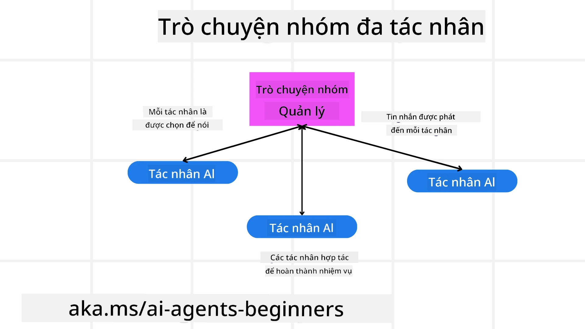
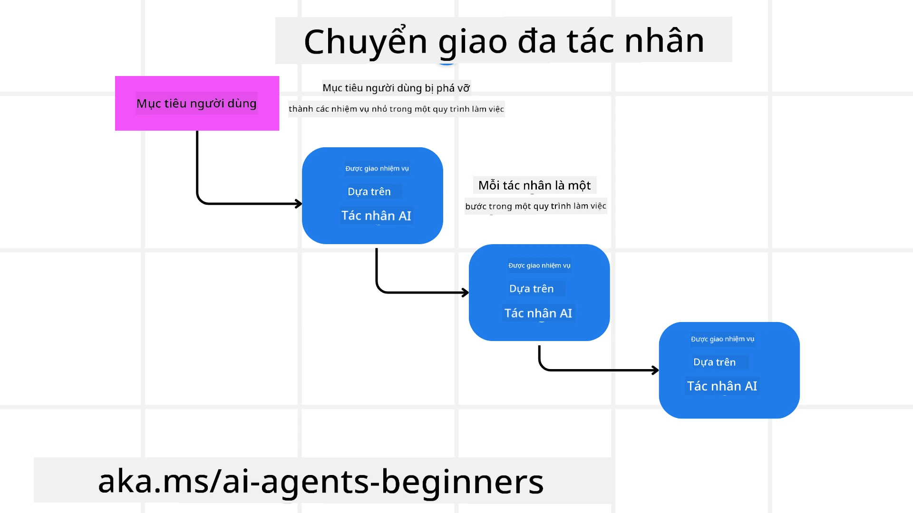
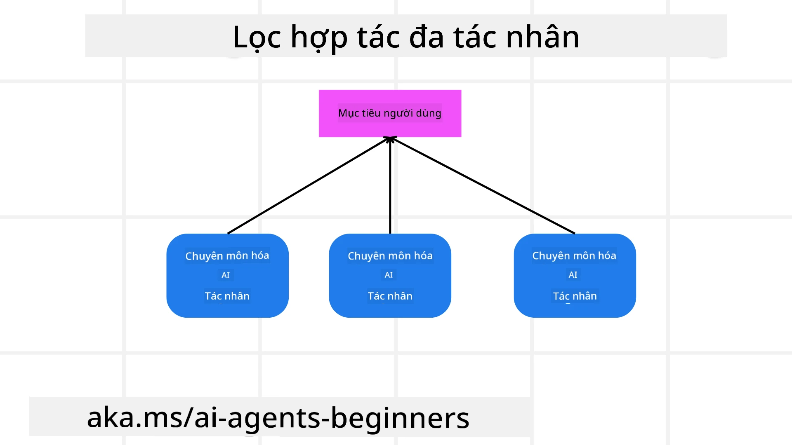

> _(Nhấn vào hình ảnh ở trên để xem video bài học này)_

# Mẫu thiết kế đa tác nhân

Ngay khi bạn bắt đầu làm việc trên một dự án liên quan đến nhiều tác nhân, bạn sẽ cần xem xét mẫu thiết kế đa tác nhân. Tuy nhiên, có thể bạn sẽ không rõ ngay lúc đầu khi nào nên chuyển sang đa tác nhân và lợi thế của nó là gì.

## Giới thiệu

Trong bài học này, chúng ta sẽ tìm câu trả lời cho các câu hỏi sau:

- Những kịch bản nào phù hợp với đa tác nhân?
- Lợi thế của việc sử dụng đa tác nhân so với một tác nhân đơn làm nhiều nhiệm vụ là gì?
- Các thành phần xây dựng của mẫu thiết kế đa tác nhân là gì?
- Làm thế nào để có thể quan sát cách các tác nhân tương tác với nhau?

## Mục tiêu học tập

Sau bài học này, bạn nên có khả năng:

- Xác định các kịch bản phù hợp với đa tác nhân
- Nhận biết lợi thế của việc sử dụng đa tác nhân so với một tác nhân đơn.
- Hiểu được các thành phần xây dựng để triển khai mẫu thiết kế đa tác nhân.

Bức tranh tổng thể lớn hơn là gì?

*Đa tác nhân là một mẫu thiết kế cho phép nhiều tác nhân làm việc cùng nhau để đạt được một mục tiêu chung*.

Mẫu này được sử dụng rộng rãi trong nhiều lĩnh vực, bao gồm robotics, hệ thống tự động và tính toán phân tán.

## Các kịch bản phù hợp với đa tác nhân

Vậy những kịch bản nào là ví dụ điển hình cho việc sử dụng đa tác nhân? Câu trả lời là có nhiều kịch bản mà việc dùng nhiều tác nhân mang lại lợi ích, đặc biệt trong các trường hợp sau:

- **Khối lượng công việc lớn**: Khối lượng công việc lớn có thể được chia thành các nhiệm vụ nhỏ hơn và phân công cho các tác nhân khác nhau, cho phép xử lý song song và hoàn thành nhanh hơn. Ví dụ điển hình là trong xử lý dữ liệu lớn.
- **Nhiệm vụ phức tạp**: Tương tự khối lượng công việc lớn, các nhiệm vụ phức tạp có thể được phân chia thành các phần nhỏ hơn và giao cho các tác nhân chuyên trách từng khía cạnh cụ thể của nhiệm vụ. Ví dụ như trong phương tiện tự hành, các tác nhân quản lý định vị, phát hiện chướng ngại vật và giao tiếp với các xe khác.
- **Chuyên môn đa dạng**: Các tác nhân khác nhau có thể sở hữu chuyên môn đa dạng, giúp xử lý các khía cạnh khác nhau của nhiệm vụ hiệu quả hơn so với một tác nhân đơn. Ví dụ về chăm sóc sức khỏe, các tác nhân có thể quản lý chẩn đoán, kế hoạch điều trị và theo dõi bệnh nhân.

## Lợi thế của việc sử dụng đa tác nhân so với tác nhân đơn

Hệ thống một tác nhân có thể hoạt động tốt với các nhiệm vụ đơn giản, nhưng với các nhiệm vụ phức tạp hơn, sử dụng nhiều tác nhân có thể mang lại nhiều lợi ích:

- **Chuyên môn hóa**: Mỗi tác nhân có thể chuyên môn hóa cho một nhiệm vụ cụ thể. Thiếu chuyên môn hóa trong một tác nhân đơn nghĩa là bạn có một tác nhân có thể làm mọi việc nhưng có thể bị bối rối khi đối mặt với nhiệm vụ phức tạp. Ví dụ nó có thể làm một nhiệm vụ mà nó không phù hợp nhất.
- **Khả năng mở rộng**: Dễ dàng mở rộng hệ thống bằng cách thêm nhiều tác nhân hơn thay vì quá tải một tác nhân duy nhất.
- **Khả năng chịu lỗi**: Nếu một tác nhân thất bại, các tác nhân khác vẫn có thể hoạt động, đảm bảo độ tin cậy của hệ thống.

Hãy lấy một ví dụ, chúng ta đặt một chuyến đi cho người dùng. Hệ thống một tác nhân sẽ phải xử lý tất cả các khía cạnh của quá trình đặt chuyến đi, từ tìm kiếm chuyến bay đến đặt khách sạn và thuê xe. Để thực hiện điều này với một tác nhân đơn, tác nhân đó cần có các công cụ để xử lý tất cả các nhiệm vụ này. Điều này có thể dẫn đến một hệ thống phức tạp và đơn khối khó bảo trì và mở rộng. Trong khi đó, một hệ thống đa tác nhân có thể có các tác nhân chuyên biệt trong việc tìm chuyến bay, đặt khách sạn và thuê xe. Điều này giúp hệ thống trở nên mô-đun hơn, dễ bảo trì và mở rộng.

So sánh điều này với một văn phòng du lịch gia đình nhỏ so với một nhượng quyền thương mại. Văn phòng du lịch gia đình có thể chỉ có một tác nhân xử lý tất cả các khía cạnh của quá trình đặt chuyến đi, còn nhượng quyền sẽ có các tác nhân khác nhau xử lý các phần khác nhau của quy trình.

## Thành phần xây dựng để triển khai mẫu thiết kế đa tác nhân

Trước khi triển khai mẫu thiết kế đa tác nhân, bạn cần hiểu các thành phần xây dựng tạo nên mẫu này.

Hãy làm điều này cụ thể hơn bằng cách tiếp tục lấy ví dụ về việc đặt chuyến đi cho người dùng. Trong trường hợp này, các thành phần xây dựng sẽ bao gồm:

- **Giao tiếp giữa các tác nhân**: Các tác nhân tìm chuyến bay, đặt khách sạn và thuê xe cần giao tiếp và chia sẻ thông tin về sở thích và giới hạn của người dùng. Bạn cần quyết định các giao thức và phương pháp giao tiếp này. Cụ thể là tác nhân tìm chuyến bay cần giao tiếp với tác nhân đặt khách sạn để đảm bảo khách sạn được đặt vào đúng ngày bay. Điều đó có nghĩa các tác nhân phải chia sẻ thông tin về ngày đi lại, tức là bạn phải quyết định *tác nhân nào chia sẻ thông tin gì và cách thức chia sẻ*.
- **Cơ chế phối hợp**: Các tác nhân cần phối hợp hành động để đảm bảo sở thích và giới hạn của người dùng được thoả mãn. Ví dụ người dùng muốn khách sạn gần sân bay trong khi giới hạn là xe thuê chỉ có tại sân bay. Điều này có nghĩa tác nhân đặt khách sạn phải phối hợp với tác nhân thuê xe để đảm bảo sở thích và giới hạn của người dùng được đáp ứng. Bạn cần quyết định *cách các tác nhân phối hợp hành động*.
- **Kiến trúc tác nhân**: Các tác nhân cần có cấu trúc nội bộ để ra quyết định và học hỏi từ tương tác với người dùng. Ví dụ tác nhân tìm chuyến bay cần có cấu trúc nội bộ để quyết định chuyến bay nào nên gợi ý dựa trên sở thích trước đây của người dùng. Bạn cần quyết định *cách các tác nhân ra quyết định và học từ tương tác*. Ví dụ, tác nhân tìm chuyến bay có thể dùng mô hình học máy để gợi ý chuyến bay dựa trên sở thích trước đó của người dùng.
- **Hiển thị tương tác đa tác nhân**: Bạn cần có khả năng quan sát cách các tác nhân tương tác với nhau. Điều này đòi hỏi có các công cụ và kỹ thuật theo dõi hoạt động và tương tác của tác nhân. Có thể là công cụ ghi nhận và giám sát, công cụ trực quan hóa và các chỉ số hiệu suất.
- **Mẫu đa tác nhân**: Có nhiều mẫu để triển khai hệ thống đa tác nhân, như kiến trúc tập trung, phi tập trung và kiến trúc kết hợp. Bạn cần quyết định mẫu phù hợp nhất với trường hợp sử dụng.
- **Con người trong vòng lặp**: Trong hầu hết trường hợp, bạn sẽ có con người tham gia và cần hướng dẫn các tác nhân khi nào nên yêu cầu sự can thiệp của con người. Ví dụ như người dùng yêu cầu khách sạn hoặc chuyến bay cụ thể mà tác nhân chưa đề xuất hoặc xác nhận trước khi đặt chuyến bay hoặc khách sạn.

## Hiển thị tương tác đa tác nhân

Việc quan sát cách các tác nhân tương tác với nhau là rất quan trọng. Khả năng này cần thiết cho việc gỡ lỗi, tối ưu và đảm bảo hiệu quả tổng thể của hệ thống. Để làm được điều này, bạn cần có công cụ và kỹ thuật theo dõi các hoạt động và tương tác của tác nhân. Có thể là các công cụ ghi nhận và giám sát, công cụ trực quan hóa và các chỉ số hiệu suất.

Ví dụ, trong trường hợp đặt chuyến đi cho người dùng, bạn có thể có một bảng điều khiển hiển thị trạng thái của từng tác nhân, sở thích và giới hạn của người dùng, cùng các tương tác giữa các tác nhân. Bảng điều khiển này có thể cho thấy ngày đi lại của người dùng, các chuyến bay do tác nhân tìm chuyến đề xuất, khách sạn do tác nhân đặt khách sạn đề xuất và xe thuê do tác nhân thuê xe đề xuất. Điều này giúp bạn có cái nhìn rõ ràng về cách các tác nhân tương tác và liệu sở thích và giới hạn của người dùng có được đáp ứng.

Hãy xem xét chi tiết các khía cạnh sau:

- **Công cụ ghi nhận và giám sát**: Bạn cần ghi nhận lại mọi hành động của các tác nhân. Một mục ghi nhật ký có thể lưu thông tin về tác nhân thực hiện hành động, hành động đó, thời điểm thực hiện và kết quả. Thông tin này dùng để gỡ lỗi, tối ưu và hơn thế nữa.

- **Công cụ trực quan hóa**: Các công cụ này giúp bạn thấy rõ tương tác giữa các tác nhân một cách trực quan hơn. Ví dụ, bạn có thể có một đồ thị biểu diễn luồng thông tin giữa các tác nhân. Điều này giúp xác định nút thắt, kém hiệu quả và các vấn đề khác trong hệ thống.

- **Chỉ số hiệu suất**: Các chỉ số này giúp bạn theo dõi hiệu quả của hệ thống đa tác nhân. Ví dụ, bạn có thể theo dõi thời gian hoàn thành nhiệm vụ, số nhiệm vụ hoàn thành trong một đơn vị thời gian và độ chính xác của các đề xuất. Thông tin này giúp xác định điểm cần cải thiện và tối ưu hệ thống.

## Mẫu đa tác nhân

Chúng ta sẽ cùng tìm hiểu một số mẫu cụ thể có thể dùng để tạo các ứng dụng đa tác nhân. Dưới đây là một số mẫu thú vị đáng cân nhắc:

### Trò chuyện nhóm

Mẫu này hữu ích khi bạn muốn tạo ứng dụng trò chuyện nhóm nơi nhiều tác nhân có thể giao tiếp với nhau. Các tình huống sử dụng thường là hợp tác nhóm, hỗ trợ khách hàng, mạng xã hội.

Trong mẫu này, mỗi tác nhân đại diện cho một người dùng trong nhóm trò chuyện, và các tin nhắn được trao đổi giữa các tác nhân qua giao thức nhắn tin. Các tác nhân có thể gửi tin, nhận tin và phản hồi tin từ các tác nhân khác.

Mẫu này có thể triển khai theo kiến trúc tập trung - tất cả tin nhắn đi qua máy chủ trung tâm, hoặc kiến trúc phi tập trung - tin nhắn trao đổi trực tiếp.

### Chuyển giao nhiệm vụ

Mẫu này hữu ích khi bạn muốn tạo ứng dụng cho phép nhiều tác nhân chuyển giao nhiệm vụ cho nhau.

Các trường hợp sử dụng phổ biến là hỗ trợ khách hàng, quản lý nhiệm vụ và tự động hóa quy trình làm việc.

Trong mẫu này, mỗi tác nhân đại diện cho một nhiệm vụ hoặc bước trong quy trình, các tác nhân có thể chuyển giao nhiệm vụ dựa trên các quy tắc đã định nghĩa.

### Lọc cộng tác

Mẫu này hữu ích khi bạn muốn tạo ứng dụng trong đó nhiều tác nhân hợp tác để đưa ra các đề xuất cho người dùng.

Lý do muốn nhiều tác nhân hợp tác là bởi mỗi tác nhân có thể có chuyên môn khác nhau và đóng góp vào quá trình đề xuất theo nhiều cách khác nhau.

Lấy ví dụ người dùng muốn được đề xuất cổ phiếu tốt nhất để mua trên thị trường chứng khoán.

- **Chuyên gia ngành**: Một tác nhân có thể là chuyên gia trong một ngành cụ thể.
- **Phân tích kỹ thuật**: Một tác nhân khác có thể là chuyên gia phân tích kỹ thuật.
- **Phân tích cơ bản**: Một tác nhân nữa là chuyên gia phân tích cơ bản. Bằng cách hợp tác, các tác nhân này cung cấp đề xuất toàn diện hơn cho người dùng.

## Kịch bản: Quy trình hoàn tiền

Xem xét một kịch bản khách hàng đang cố gắng nhận hoàn tiền cho một sản phẩm, sẽ có khá nhiều tác nhân tham gia vào quy trình này nhưng hãy chia thành các tác nhân chuyên biệt cho quy trình này và các tác nhân chung có thể dùng trong các quy trình khác.

**Các tác nhân chuyên biệt cho quy trình hoàn tiền**:

Dưới đây là một số tác nhân có thể tham gia quy trình hoàn tiền:

- **Tác nhân khách hàng**: Đại diện khách hàng và chịu trách nhiệm khởi xướng quy trình hoàn tiền.
- **Tác nhân người bán**: Đại diện người bán và chịu trách nhiệm xử lý việc hoàn tiền.
- **Tác nhân thanh toán**: Đại diện quy trình thanh toán và chịu trách nhiệm hoàn tiền cho khách hàng.
- **Tác nhân giải quyết**: Đại diện quy trình giải quyết các vấn đề phát sinh trong quá trình hoàn tiền.
- **Tác nhân tuân thủ**: Đại diện quy trình tuân thủ và đảm bảo quá trình hoàn tiền phù hợp với quy định và chính sách.

**Các tác nhân chung**:

Các tác nhân này có thể được dùng trong các phần khác của doanh nghiệp bạn.

- **Tác nhân vận chuyển**: Đại diện quy trình vận chuyển và chịu trách nhiệm gửi sản phẩm trả lại người bán. Tác nhân này có thể dùng cả trong quy trình hoàn tiền và vận chuyển chung sản phẩm khi mua hàng.
- **Tác nhân phản hồi**: Đại diện quy trình thu thập phản hồi từ khách hàng. Phản hồi có thể được lấy bất cứ lúc nào, không chỉ trong quy trình hoàn tiền.
- **Tác nhân leo thang**: Đại diện quy trình leo thang vấn đề lên cấp hỗ trợ cao hơn. Bạn có thể dùng tác nhân này cho bất kỳ quy trình nào cần nâng cấp vấn đề.
- **Tác nhân thông báo**: Đại diện quy trình thông báo và chịu trách nhiệm gửi thông báo cho khách hàng ở nhiều giai đoạn của quy trình hoàn tiền.
- **Tác nhân phân tích**: Đại diện quy trình phân tích dữ liệu liên quan đến quy trình hoàn tiền.
- **Tác nhân kiểm toán**: Đại diện quy trình kiểm toán, đảm bảo quy trình hoàn tiền được thực hiện đúng.
- **Tác nhân báo cáo**: Đại diện quy trình báo cáo và chịu trách nhiệm tạo báo cáo về quy trình hoàn tiền.
- **Tác nhân kiến thức**: Đại diện quy trình quản lý cơ sở kiến thức liên quan đến quy trình hoàn tiền. Tác nhân này có thể có kiến thức về hoàn tiền và các phần khác của doanh nghiệp bạn.
- **Tác nhân bảo mật**: Đại diện quy trình bảo mật và chịu trách nhiệm đảm bảo an toàn cho quy trình hoàn tiền.
- **Tác nhân chất lượng**: Đại diện quy trình chất lượng và chịu trách nhiệm đảm bảo chất lượng của quy trình hoàn tiền.

Có khá nhiều tác nhân được liệt kê ở trên, cả cho quy trình hoàn tiền chuyên biệt và các tác nhân chung có thể dùng trong các phần khác của doanh nghiệp bạn. Hy vọng điều này giúp bạn hình dung cách quyết định chọn tác nhân nào trong hệ thống đa tác nhân của bạn.

## Bài tập

Thiết kế một hệ thống đa tác nhân cho quy trình hỗ trợ khách hàng. Xác định các tác nhân tham gia trong quy trình, vai trò và trách nhiệm của họ, cùng cách họ tương tác với nhau. Xem xét cả các tác nhân chuyên biệt cho quy trình hỗ trợ khách hàng và các tác nhân chung có thể dùng trong những phần khác của doanh nghiệp bạn.
> Hãy suy nghĩ trước khi bạn đọc giải pháp sau, bạn có thể cần nhiều agent hơn bạn nghĩ.

> TIP: Hãy nghĩ về các giai đoạn khác nhau của quy trình hỗ trợ khách hàng và cũng cân nhắc các agent cần thiết cho bất kỳ hệ thống nào.

## Giải pháp

[Solution](./solution/solution.md)

## Kiểm tra kiến thức

Câu hỏi: Khi nào bạn nên cân nhắc sử dụng multi-agents?

- [ ] A1: Khi bạn có khối lượng công việc nhỏ và nhiệm vụ đơn giản.
- [ ] A2: Khi bạn có khối lượng công việc lớn
- [ ] A3: Khi bạn có nhiệm vụ đơn giản.

[Solution quiz](./solution/solution-quiz.md)

## Tóm tắt

Trong bài học này, chúng ta đã xem xét mẫu thiết kế multi-agent, bao gồm các tình huống mà multi-agents áp dụng, những lợi thế khi sử dụng multi-agents so với một agent duy nhất, các thành phần xây dựng để triển khai mẫu thiết kế multi-agent, và cách để có thể quan sát được cách các agent tương tác với nhau.

### Còn thắc mắc về Mẫu Thiết Kế Multi-Agent?

Tham gia [Microsoft Foundry Discord](https://aka.ms/ai-agents/discord) để gặp mặt những người học khác, tham dự giờ làm việc và nhận được giải đáp các câu hỏi về AI Agents.

## Tài nguyên bổ sung

- <a href="https://learn.microsoft.com/azure/ai-services/agents/overview" target="_blank">Tài liệu Microsoft Agent Framework</a>
- <a href="https://www.analyticsvidhya.com/blog/2024/10/agentic-design-patterns/" target="_blank">Mẫu thiết kế Agentic</a>

## Bài học trước

[Planning Design](../07-planning-design/README.md)

## Bài học tiếp theo

[Metacognition in AI Agents](../09-metacognition/README.md)

---

<!-- CO-OP TRANSLATOR DISCLAIMER START -->
**Từ chối trách nhiệm**:  
Tài liệu này đã được dịch bằng dịch vụ dịch thuật AI [Co-op Translator](https://github.com/Azure/co-op-translator). Mặc dù chúng tôi cố gắng đảm bảo độ chính xác, xin lưu ý rằng bản dịch tự động có thể chứa lỗi hoặc sự không chính xác. Tài liệu gốc bằng ngôn ngữ nguyên bản của nó nên được xem là nguồn thông tin chính xác nhất. Đối với các thông tin quan trọng, nên sử dụng dịch vụ dịch thuật chuyên nghiệp do con người thực hiện. Chúng tôi không chịu trách nhiệm về bất kỳ sự hiểu lầm hoặc giải thích sai nào phát sinh từ việc sử dụng bản dịch này.
<!-- CO-OP TRANSLATOR DISCLAIMER END -->