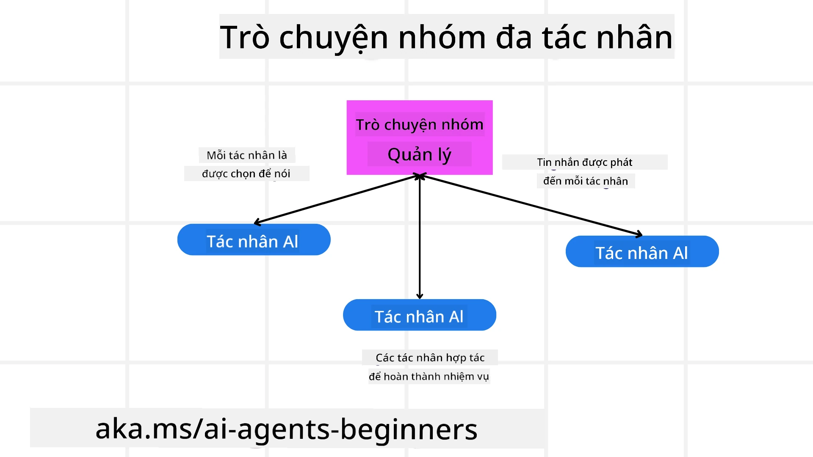
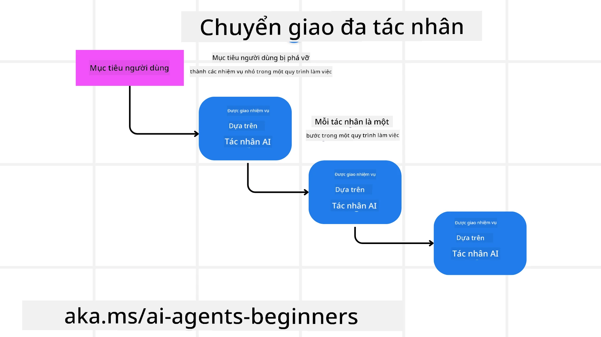
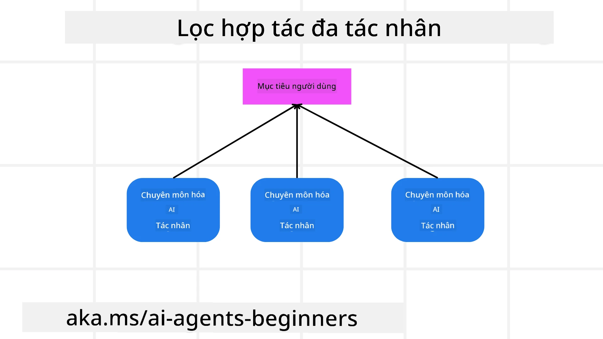

> _(Nhấp vào hình ảnh trên để xem video của bài học này)_

# Các mẫu thiết kế đa tác nhân

Ngay khi bạn bắt đầu làm việc trên một dự án liên quan đến nhiều tác nhân, bạn sẽ cần xem xét mẫu thiết kế đa tác nhân. Tuy nhiên, có thể bạn không rõ lúc nào nên chuyển sang đa tác nhân và lợi thế của nó là gì.

## Giới thiệu

Trong bài học này, chúng ta sẽ trả lời các câu hỏi sau:

- Những kịch bản nào thích hợp để áp dụng đa tác nhân?
- Ưu điểm của việc sử dụng đa tác nhân so với chỉ một tác nhân thực hiện nhiều nhiệm vụ là gì?
- Các thành phần cấu thành để thực hiện mẫu thiết kế đa tác nhân là gì?
- Làm thế nào để chúng ta có thể thấy được cách các tác nhân tương tác với nhau?

## Mục tiêu học tập

Sau bài học này, bạn sẽ có thể:

- Xác định các kịch bản phù hợp để áp dụng đa tác nhân
- Nhận biết lợi ích của việc sử dụng đa tác nhân so với một tác nhân đơn lẻ.
- Hiểu các thành phần cấu thành để thực hiện mẫu thiết kế đa tác nhân.

Bức tranh lớn hơn là gì?

*Đa tác nhân là một mẫu thiết kế cho phép nhiều tác nhân làm việc cùng nhau để đạt được một mục tiêu chung*.

Mẫu này được sử dụng rộng rãi trong nhiều lĩnh vực, bao gồm robot, hệ thống tự hành và tính toán phân tán.

## Các kịch bản áp dụng đa tác nhân

Vậy những kịch bản nào là trường hợp sử dụng tốt cho đa tác nhân? Câu trả lời là có nhiều kịch bản mà việc sử dụng nhiều tác nhân đem lại lợi ích, đặc biệt trong các trường hợp sau:

- **Khối lượng công việc lớn**: Khối lượng công việc lớn có thể được chia thành các nhiệm vụ nhỏ hơn và giao cho các tác nhân khác nhau, cho phép xử lý song song và hoàn thành nhanh hơn. Ví dụ trong trường hợp xử lý dữ liệu lớn.
- **Nhiệm vụ phức tạp**: Nhiệm vụ phức tạp, giống như khối lượng công việc lớn, có thể được chia nhỏ thành các nhiệm vụ phụ và giao cho từng tác nhân chuyên về một khía cạnh cụ thể. Ví dụ điển hình là trong các phương tiện tự hành, nơi các tác nhân khác nhau quản lý điều hướng, phát hiện chướng ngại vật và giao tiếp với các phương tiện khác.
- **Chuyên môn đa dạng**: Các tác nhân khác nhau có thể có kỹ năng chuyên môn khác nhau, giúp họ xử lý các khía cạnh của nhiệm vụ hiệu quả hơn so với một tác nhân duy nhất. Ví dụ trong lĩnh vực chăm sóc sức khỏe, các tác nhân có thể quản lý chẩn đoán, kế hoạch điều trị và giám sát bệnh nhân.

## Lợi thế của việc sử dụng đa tác nhân so với tác nhân đơn lẻ

Hệ thống với một tác nhân đơn lẻ có thể hoạt động tốt cho các nhiệm vụ đơn giản, nhưng với nhiệm vụ phức tạp hơn, việc sử dụng nhiều tác nhân có thể mang lại nhiều lợi thế:

- **Chuyên môn hóa**: Mỗi tác nhân có thể được chuyên môn hóa cho một nhiệm vụ cụ thể. Thiếu chuyên môn trong tác nhân đơn lẻ nghĩa là tác nhân có thể làm mọi thứ nhưng có thể bối rối khi phải xử lý nhiệm vụ phức tạp. Ví dụ, nó có thể làm nhiệm vụ không phù hợp nhất với nó.
- **Khả năng mở rộng**: Hệ thống dễ mở rộng hơn bằng cách thêm nhiều tác nhân thay vì làm quá tải một tác nhân duy nhất.
- **Khả năng chịu lỗi**: Nếu một tác nhân thất bại, các tác nhân khác vẫn có thể tiếp tục hoạt động, đảm bảo độ tin cậy của hệ thống.

Hãy lấy ví dụ, giả sử đặt một chuyến đi cho người dùng. Hệ thống một tác nhân sẽ phải xử lý tất cả các khía cạnh của quá trình đặt chuyến đi, từ tìm chuyến bay đến đặt khách sạn và thuê xe. Để đạt được điều này với một tác nhân duy nhất, tác nhân đó phải có công cụ để xử lý tất cả nhiệm vụ này. Điều này có thể dẫn đến một hệ thống phức tạp và đơn khối khó bảo trì và mở rộng. Ngược lại, hệ thống đa tác nhân có thể có những tác nhân khác nhau chuyên về tìm chuyến bay, đặt khách sạn và thuê xe. Điều này làm cho hệ thống trở nên mô-đun hơn, dễ bảo trì và dễ mở rộng.

So sánh điều này với một đại lý du lịch nhỏ do cá nhân điều hành so với một đại lý du lịch chạy theo mô hình nhượng quyền. Đại lý nhỏ có một tác nhân xử lý mọi khía cạnh của quá trình đặt chuyến đi, trong khi đại lý nhượng quyền có nhiều tác nhân xử lý các khía cạnh khác nhau của quá trình đặt chuyến đi.

## Các thành phần cấu thành để thực hiện mẫu thiết kế đa tác nhân

Trước khi bạn có thể thực hiện mẫu thiết kế đa tác nhân, bạn cần hiểu các thành phần cấu thành tạo nên mẫu.

Hãy làm cho điều này cụ thể hơn bằng cách lại lấy ví dụ đặt chuyến đi cho người dùng. Trong trường hợp này, các thành phần cấu thành sẽ bao gồm:

- **Giao tiếp giữa tác nhân**: Các tác nhân tìm chuyến bay, đặt khách sạn và thuê xe cần giao tiếp và chia sẻ thông tin về sở thích và giới hạn của người dùng. Bạn cần quyết định các giao thức và phương thức cho việc giao tiếp này. Cụ thể, tác nhân tìm chuyến bay cần giao tiếp với tác nhân đặt khách sạn để đảm bảo khách sạn được đặt cùng ngày với chuyến bay. Điều này nghĩa là các tác nhân cần chia sẻ thông tin về ngày đi lại của người dùng, do đó bạn cần quyết định *tác nhân nào chia sẻ thông tin và cách họ chia sẻ*.
- **Cơ chế phối hợp**: Các tác nhân cần phối hợp hành động để đảm bảo sở thích và giới hạn của người dùng được đáp ứng. Một sở thích của người dùng có thể là muốn khách sạn gần sân bay trong khi giới hạn có thể là các xe thuê chỉ có tại sân bay. Điều này nghĩa là tác nhân đặt khách sạn phải phối hợp với tác nhân thuê xe để đáp ứng sở thích và giới hạn của người dùng. Bạn cần quyết định *cách các tác nhân phối hợp hành động*.
- **Kiến trúc tác nhân**: Các tác nhân cần có cấu trúc bên trong để đưa ra quyết định và học hỏi từ các tương tác với người dùng. Điều này có nghĩa là tác nhân tìm chuyến bay cần có cấu trúc bên trong để quyết định chuyến bay nào để đề xuất cho người dùng. Bạn cần quyết định *cách các tác nhân đưa ra quyết định và học hỏi từ tương tác với người dùng*. Ví dụ về cách một tác nhân học hỏi và cải tiến có thể là tác nhân tìm chuyến bay sử dụng mô hình học máy để đề xuất chuyến bay dựa trên sở thích trước đó của người dùng.
- **Hiển thị tương tác đa tác nhân**: Bạn cần thấy được cách các tác nhân tương tác với nhau. Điều này nghĩa là bạn cần công cụ và kỹ thuật theo dõi hoạt động và tương tác của các tác nhân. Có thể dưới dạng công cụ ghi nhật ký và giám sát, công cụ hiển thị và các chỉ số hiệu suất.
- **Mẫu đa tác nhân**: Có các mẫu khác nhau để thực hiện hệ thống đa tác nhân, như kiến trúc tập trung, phân tán và lai. Bạn cần quyết định mẫu phù hợp nhất với trường hợp sử dụng của mình.
- **Con người trong vòng lặp**: Trong đa số trường hợp, sẽ có một con người trong vòng lặp và bạn cần chỉ dẫn các tác nhân khi nào nên yêu cầu sự can thiệp của con người. Điều này có thể dưới dạng người dùng yêu cầu một khách sạn hoặc chuyến bay cụ thể mà tác nhân chưa đề xuất hoặc yêu cầu xác nhận trước khi đặt chuyến bay hoặc khách sạn.

## Hiển thị tương tác đa tác nhân

Điều quan trọng là bạn cần có khả năng quan sát cách các tác nhân tương tác với nhau. Điều này rất cần thiết để gỡ lỗi, tối ưu và đảm bảo hiệu quả tổng thể của hệ thống. Để đạt được điều này, bạn cần các công cụ và kỹ thuật theo dõi hoạt động và tương tác của các tác nhân. Có thể bao gồm các công cụ ghi nhật ký và giám sát, công cụ hiển thị và các chỉ số hiệu suất.

Ví dụ, trong trường hợp đặt chuyến đi cho người dùng, bạn có thể có một bảng điều khiển hiển thị trạng thái của từng tác nhân, sở thích và giới hạn của người dùng, và các tương tác giữa các tác nhân. Bảng điều khiển này có thể hiển thị ngày đi lại của người dùng, các chuyến bay được tác nhân chuyến bay đề xuất, khách sạn do tác nhân khách sạn đề xuất, và xe thuê do tác nhân thuê xe đề xuất. Điều này giúp bạn nhìn rõ cách các tác nhân tương tác với nhau và liệu sở thích và giới hạn của người dùng có được đáp ứng hay không.

Hãy xem kỹ từng khía cạnh này.

- **Công cụ ghi nhật ký và giám sát**: Bạn cần ghi lại các hành động của mỗi tác nhân. Một bản ghi có thể lưu thông tin về tác nhân thực hiện hành động, hành động đã làm, thời gian thực hiện và kết quả của hành động. Thông tin này có thể dùng để gỡ lỗi, tối ưu và nhiều mục đích khác.

- **Công cụ hiển thị**: Các công cụ hiển thị giúp bạn thấy các tương tác giữa các tác nhân một cách trực quan hơn. Ví dụ, bạn có thể có một đồ thị thể hiện luồng thông tin giữa các tác nhân. Điều này giúp bạn nhận diện điểm nghẽn, sự không hiệu quả và các vấn đề khác trong hệ thống.

- **Chỉ số hiệu suất**: Chỉ số hiệu suất giúp bạn theo dõi hiệu quả của hệ thống đa tác nhân. Ví dụ, bạn có thể theo dõi thời gian hoàn thành nhiệm vụ, số nhiệm vụ hoàn thành trên một đơn vị thời gian, và độ chính xác của các đề xuất do các tác nhân đưa ra. Thông tin này giúp bạn nhận diện điểm cần cải thiện và tối ưu hệ thống.

## Mẫu đa tác nhân

Hãy đi sâu vào một số mẫu cụ thể mà chúng ta có thể dùng để tạo ứng dụng đa tác nhân. Dưới đây là một số mẫu thú vị đáng xem xét:

### Trò chuyện nhóm

Mẫu này hữu ích khi bạn muốn tạo ứng dụng chat nhóm với nhiều tác nhân có thể giao tiếp với nhau. Trường hợp sử dụng thường bao gồm hợp tác nhóm, hỗ trợ khách hàng và mạng xã hội.

Trong mẫu này, mỗi tác nhân đại diện cho một người dùng trong nhóm chat, và các tin nhắn được trao đổi giữa các tác nhân theo giao thức nhắn tin. Các tác nhân có thể gửi tin nhắn vào nhóm chat, nhận tin nhắn từ nhóm chat, và phản hồi tin nhắn từ các tác nhân khác.

Mẫu này có thể được thực hiện bằng kiến trúc tập trung, nơi tất cả tin nhắn đi qua máy chủ trung tâm, hoặc kiến trúc phân tán, nơi các tin nhắn trao đổi trực tiếp.

### Chuyển giao nhiệm vụ

Mẫu này hữu ích khi bạn muốn tạo ứng dụng nhiều tác nhân có thể chuyển giao nhiệm vụ cho nhau.

Trường hợp sử dụng phổ biến bao gồm hỗ trợ khách hàng, quản lý nhiệm vụ và tự động hóa quy trình làm việc.

Trong mẫu này, mỗi tác nhân đại diện một nhiệm vụ hoặc bước trong quy trình làm việc, và tác nhân có thể chuyển giao nhiệm vụ cho tác nhân khác dựa trên quy tắc định sẵn.

### Lọc cộng tác

Mẫu này hữu ích khi bạn muốn tạo ứng dụng mà nhiều tác nhân hợp tác để đưa ra khuyến nghị cho người dùng.

Lý do muốn nhiều tác nhân hợp tác là vì mỗi tác nhân có chuyên môn khác nhau và có thể đóng góp vào quá trình khuyến nghị theo nhiều cách khác nhau.

Hãy lấy ví dụ một người dùng muốn được khuyên nên mua cổ phiếu nào là tốt nhất trên thị trường chứng khoán.

- **Chuyên gia ngành**: Một tác nhân có thể là chuyên gia trong một ngành cụ thể.
- **Phân tích kỹ thuật**: Một tác nhân khác có thể là chuyên gia về phân tích kỹ thuật.
- **Phân tích cơ bản**: Và một tác nhân khác là chuyên gia phân tích cơ bản. Bằng cách hợp tác, các tác nhân này có thể cung cấp khuyến nghị toàn diện hơn cho người dùng.

## Kịch bản: Quy trình hoàn tiền

Hãy xem xét một kịch bản khách hàng cố gắng nhận hoàn tiền cho một sản phẩm, có thể có khá nhiều tác nhân tham gia vào quy trình này nhưng hãy chia ra các tác nhân chuyên biệt cho quy trình này và các tác nhân chung có thể dùng cho các quy trình khác.

**Tác nhân chuyên biệt cho quy trình hoàn tiền**:

Dưới đây là một số tác nhân có thể tham gia vào quy trình hoàn tiền:

- **Tác nhân khách hàng**: Đại diện cho khách hàng và chịu trách nhiệm khởi đầu quy trình hoàn tiền.
- **Tác nhân người bán**: Đại diện người bán và chịu trách nhiệm xử lý hoàn tiền.
- **Tác nhân thanh toán**: Đại diện quy trình thanh toán và chịu trách nhiệm hoàn tiền cho khách hàng.
- **Tác nhân giải quyết**: Đại diện quy trình giải quyết và chịu trách nhiệm giải quyết các vấn đề phát sinh trong quá trình hoàn tiền.
- **Tác nhân tuân thủ**: Đại diện quy trình tuân thủ và chịu trách nhiệm đảm bảo quy trình hoàn tiền tuân thủ các quy định và chính sách.

**Tác nhân chung**:

Các tác nhân này có thể sử dụng cho các phần khác của doanh nghiệp bạn.

- **Tác nhân vận chuyển**: Đại diện quy trình vận chuyển và chịu trách nhiệm gửi sản phẩm trả lại người bán. Tác nhân này có thể dùng cả trong quy trình hoàn tiền và vận chuyển sản phẩm chung, ví dụ khi mua hàng.
- **Tác nhân phản hồi**: Đại diện quy trình phản hồi và chịu trách nhiệm thu thập phản hồi từ khách hàng. Phản hồi có thể xảy ra bất kỳ lúc nào chứ không chỉ trong quy trình hoàn tiền.
- **Tác nhân leo thang**: Đại diện quy trình leo thang và chịu trách nhiệm nâng cấp vấn đề lên cấp hỗ trợ cao hơn. Bạn có thể dùng loại tác nhân này cho bất kỳ quy trình nào cần leo thang vấn đề.
- **Tác nhân thông báo**: Đại diện quy trình thông báo và chịu trách nhiệm gửi thông báo cho khách hàng ở các giai đoạn khác nhau của quy trình hoàn tiền.
- **Tác nhân phân tích**: Đại diện quy trình phân tích và chịu trách nhiệm phân tích dữ liệu liên quan đến quy trình hoàn tiền.
- **Tác nhân kiểm tra**: Đại diện quy trình kiểm tra và chịu trách nhiệm kiểm toán quy trình hoàn tiền để đảm bảo quy trình thực hiện đúng.
- **Tác nhân báo cáo**: Đại diện quy trình báo cáo và chịu trách nhiệm tạo báo cáo về quy trình hoàn tiền.
- **Tác nhân kiến thức**: Đại diện quy trình quản lý kiến thức và chịu trách nhiệm duy trì cơ sở kiến thức liên quan đến quy trình hoàn tiền. Tác nhân này có thể hiểu biết cả về hoàn tiền và các phần khác của doanh nghiệp.
- **Tác nhân bảo mật**: Đại diện quy trình bảo mật và chịu trách nhiệm đảm bảo an toàn cho quy trình hoàn tiền.
- **Tác nhân chất lượng**: Đại diện quy trình chất lượng và chịu trách nhiệm đảm bảo chất lượng cho quy trình hoàn tiền.

Có khá nhiều tác nhân đã liệt kê ở trên cả cho quy trình hoàn tiền chuyên biệt và các tác nhân chung có thể dùng trong các phần khác của doanh nghiệp bạn. Hy vọng điều này giúp bạn hình dung được cách quyết định các tác nhân cần sử dụng trong hệ thống đa tác nhân của mình.

## Bài tập

Thiết kế một hệ thống đa tác nhân cho quy trình hỗ trợ khách hàng. Xác định các tác nhân tham gia trong quy trình, vai trò và trách nhiệm của họ, và cách họ tương tác với nhau. Xem xét cả tác nhân chuyên biệt cho quy trình hỗ trợ khách hàng và các tác nhân chung có thể dùng trong các phần khác của doanh nghiệp bạn.

> Hãy suy nghĩ trước khi bạn đọc giải pháp sau, bạn có thể cần nhiều tác nhân hơn bạn nghĩ.

> MẸO: Hãy suy nghĩ về các giai đoạn khác nhau của quy trình hỗ trợ khách hàng và cũng cân nhắc các tác nhân cần thiết cho bất kỳ hệ thống nào.

## Giải pháp

[Giải pháp](./solution/solution.md)

## Kiểm tra kiến thức

### Câu hỏi 1

Kịch bản nào phù hợp nhất cho hệ thống đa tác nhân?

- [ ] A1: Một bot hỗ trợ trả lời các câu hỏi phổ biến sử dụng một cơ sở kiến thức và một bộ công cụ nhỏ.
- [ ] A2: Một quy trình hoàn tiền cần các vai trò riêng biệt về gian lận, thanh toán và tuân thủ, mỗi vai trò có công cụ riêng, và kết quả của họ phải được phối hợp.
- [ ] A3: Cùng một yêu cầu phân loại đơn giản đến hàng nghìn lần mỗi giờ.

### Câu hỏi 2

Khi nào một tác nhân đơn thường là lựa chọn tốt hơn?

- [ ] A1: Nhiệm vụ có thể được xử lý bằng một bộ hướng dẫn và công cụ, không cần chuyển giao chuyên môn.
- [ ] A2: Tác nhân có quyền truy cập vào hơn một công cụ.
- [ ] A3: Quy trình yêu cầu các vai trò riêng biệt với các quyền khác nhau và các đường dẫn kiểm toán độc lập.

[Giải pháp bài kiểm tra](./solution/solution-quiz.md)

## Tóm tắt

Trong bài học này, chúng ta đã xem xét mẫu thiết kế đa tác nhân, bao gồm các kịch bản áp dụng đa tác nhân, lợi ích của việc sử dụng đa tác nhân so với tác nhân đơn lẻ, các thành phần xây dựng để triển khai mẫu thiết kế đa tác nhân, và cách để có thể quan sát được cách các tác nhân tương tác với nhau.

### Có thêm câu hỏi về Mẫu Thiết Kế Đa Tác Nhân?

Tham gia [Microsoft Foundry Discord](https://discord.com/invite/ATgtXmAS5D) để gặp gỡ những người học khác, tham dự giờ hỗ trợ và được giải đáp thắc mắc về Tác nhân AI.

## Tài nguyên bổ sung

- <a href="https://learn.microsoft.com/azure/ai-services/agents/overview" target="_blank">Tài liệu Microsoft Agent Framework</a>
- <a href="https://www.analyticsvidhya.com/blog/2024/10/agentic-design-patterns/" target="_blank">Mẫu thiết kế Agentic</a>

## Bài học trước

[Lập kế hoạch thiết kế](../07-planning-design/README.md)

## Bài học tiếp theo

[Siêu nhận thức trong Tác nhân AI](../09-metacognition/README.md)

---

<!-- CO-OP TRANSLATOR DISCLAIMER START -->
**Tuyên bố miễn trừ trách nhiệm**:
Tài liệu này đã được dịch bằng dịch vụ dịch thuật AI [Co-op Translator](https://github.com/Azure/co-op-translator). Mặc dù chúng tôi cố gắng đảm bảo độ chính xác, xin lưu ý rằng bản dịch tự động có thể chứa lỗi hoặc sai sót. Tài liệu gốc bằng ngôn ngữ gốc nên được coi là nguồn tin chính thức. Đối với thông tin quan trọng, nên sử dụng dịch vụ dịch thuật chuyên nghiệp bởi con người. Chúng tôi không chịu trách nhiệm về bất kỳ hiểu lầm hoặc giải thích sai nào phát sinh từ việc sử dụng bản dịch này.
<!-- CO-OP TRANSLATOR DISCLAIMER END -->